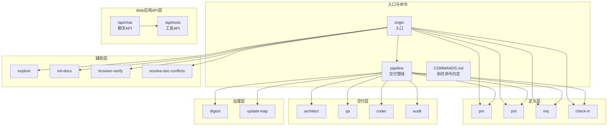
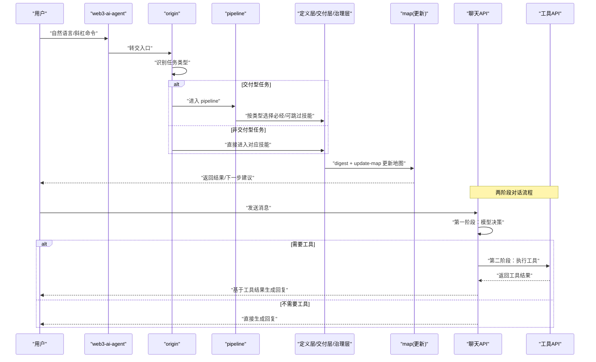
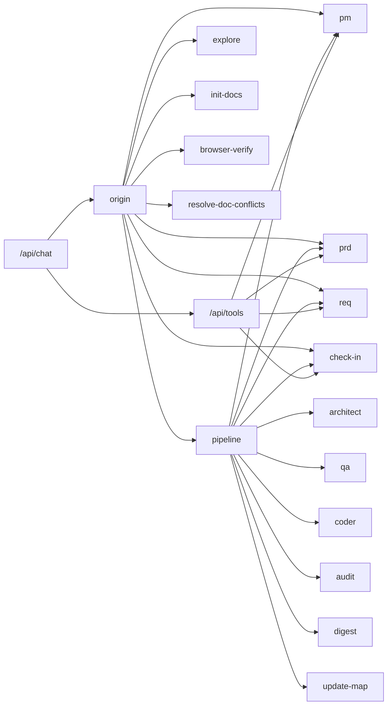

# API参考文档

<cite>
**本文引用的文件**
- [apps/web/app/api/chat/route.ts](file://apps/web/app/api/chat/route.ts)
- [apps/web/app/api/tools/route.ts](file://apps/web/app/api/tools/route.ts)
- [apps/web/types/chat.ts](file://apps/web/types/chat.ts)
- [apps/web/app/page.tsx](file://apps/web/app/page.tsx)
- [apps/web/components/ChatInput.tsx](file://apps/web/components/ChatInput.tsx)
- [apps/web/components/MessageList.tsx](file://apps/web/components/MessageList.tsx)
- [apps/web/components/MessageItem.tsx](file://apps/web/components/MessageItem.tsx)
- [skills/x-ray/SKILL.md](file://skills/x-ray/SKILL.md)
- [skills/x-ray/COMMANDS.md](file://skills/x-ray/COMMANDS.md)
- [skills/x-ray/SKILL-SYSTEM-DESIGN-V3.md](file://skills/x-ray/SKILL-SYSTEM-DESIGN-V3.md)
- [skills/x-ray/explore/SKILL.md](file://skills/x-ray/explore/SKILL.md)
- [skills/x-ray/init-docs/SKILL.md](file://skills/x-ray/init-docs/SKILL.md)
- [skills/x-ray/browser-verify/SKILL.md](file://skills/x-ray/browser-verify/SKILL.md)
</cite>

## 更新摘要
**所做更改**
- 新增两阶段对话流程API章节，详细说明聊天API的工作机制
- 新增工具API章节，说明工具执行接口和数据格式
- 更新架构总览，反映新的两阶段对话流程
- 新增客户端集成指南，包含Web应用示例
- 更新技能间通信协议，增加工具调用数据格式
- **新增**：聊天API调试功能增强，包括Function Calling过程的详细日志记录和两阶段对话流程的调试信息

## 目录
1. [简介](#简介)
2. [项目结构](#项目结构)
3. [核心组件](#核心组件)
4. [架构总览](#架构总览)
5. [详细组件分析](#详细组件分析)
6. [API参考](#api参考)
7. [依赖关系分析](#依赖关系分析)
8. [性能考量](#性能考量)
9. [故障排查指南](#故障排查指南)
10. [结论](#结论)
11. [附录](#附录)

## 简介
本文件为 Web3 AI Agent 技能系统的全面 API 参考，面向 API 使用者与集成开发者，聚焦以下目标：
- 明确技能调用接口与斜杠命令约定
- 说明各技能的输入、输出与执行规则
- 提供技能间通信协议（输入输出格式、数据传递机制）
- 给出请求/响应示例、错误码与异常处理策略
- 解释版本管理与向后兼容性
- 提供客户端集成指南与 SDK 使用建议
- **新增**：两阶段对话流程API和工具API的详细说明
- **新增**：聊天API调试功能增强，包括Function Calling过程的详细日志记录

## 项目结构
技能系统以"主入口 + 分层路由 + 交付流水线 + 治理闭环"的方式组织，核心文件如下：
- 主入口与命令约定：SKILL.md、COMMANDS.md
- 系统设计（V3）：SKILL-SYSTEM-DESIGN-V3.md
- 技能定义：architect、pm、pipeline、qa、coder、check-in、digest、update-map 等 SKILL.md
- **新增**：Web应用API层，包含聊天API和工具API



**图表来源**
- [skills/x-ray/SKILL.md](file://skills/x-ray/SKILL.md)
- [skills/x-ray/COMMANDS.md](file://skills/x-ray/COMMANDS.md)
- [skills/x-ray/SKILL-SYSTEM-DESIGN-V3.md](file://skills/x-ray/SKILL-SYSTEM-DESIGN-V3.md)
- [apps/web/app/api/chat/route.ts](file://apps/web/app/api/chat/route.ts)
- [apps/web/app/api/tools/route.ts](file://apps/web/app/api/tools/route.ts)

**章节来源**
- [skills/x-ray/SKILL.md](file://skills/x-ray/SKILL.md)
- [skills/x-ray/COMMANDS.md](file://skills/x-ray/COMMANDS.md)
- [skills/x-ray/SKILL-SYSTEM-DESIGN-V3.md](file://skills/x-ray/SKILL-SYSTEM-DESIGN-V3.md)
- [apps/web/app/api/chat/route.ts](file://apps/web/app/api/chat/route.ts)
- [apps/web/app/api/tools/route.ts](file://apps/web/app/api/tools/route.ts)

## 核心组件
- 主入口 web3-ai-agent：统一接收外部请求，先经 origin 判断任务类型，再路由到相应技能或 pipeline。
- 斜杠命令：/origin、/pipeline feat/patch/refactor、/pm、/prd、/req、/check-in、/architect、/qa、/coder、/audit、/digest、/update-map、/explore、/init-docs、/browser-verify、/resolve-doc-conflicts。
- 交付管线 pipeline：根据任务类型（FEAT/PATCH/REFACTOR）选择执行深度与必经/可跳过技能。
- 实施前门禁 check-in：强制对交付型任务与准备进入实施的 DEFINE 任务进行对齐，明确问题、边界、方案、完成标准与下一跳。
- **新增**：Web应用API层，包含聊天API和工具API，支持两阶段对话流程和工具执行接口。
- **新增**：聊天API调试功能，提供详细的Function Calling过程日志记录。

**章节来源**
- [skills/x-ray/SKILL.md](file://skills/x-ray/SKILL.md)
- [skills/x-ray/COMMANDS.md](file://skills/x-ray/COMMANDS.md)
- [skills/x-ray/SKILL-SYSTEM-DESIGN-V3.md](file://skills/x-ray/SKILL-SYSTEM-DESIGN-V3.md)
- [apps/web/app/api/chat/route.ts](file://apps/web/app/api/chat/route.ts)
- [apps/web/app/api/tools/route.ts](file://apps/web/app/api/tools/route.ts)

## 架构总览
系统采用"入口路由 → 任务分类 → 交付管线（可选）→ 实施对齐 → 设计/验证/实现 → 风险审计 → 经验沉淀 → 地图更新"的闭环，**新增**两阶段对话流程支持。



**图表来源**
- [skills/x-ray/SKILL.md](file://skills/x-ray/SKILL.md)
- [skills/x-ray/SKILL-SYSTEM-DESIGN-V3.md](file://skills/x-ray/SKILL-SYSTEM-DESIGN-V3.md)
- [apps/web/app/api/chat/route.ts](file://apps/web/app/api/chat/route.ts)
- [apps/web/app/api/tools/route.ts](file://apps/web/app/api/tools/route.ts)

## 详细组件分析

### 主入口 web3-ai-agent 与斜杠命令
- 主入口职责：统一入口、自动分流、避免手工直进主链。
- 斜杠命令推荐：
  - /origin + 任务描述
  - /pipeline feat/patch/refactor + 任务描述
  - /pm、/prd、/req、/check-in、/architect、/qa、/coder、/audit、/digest、/update-map、/explore、/init-docs、/browser-verify、/resolve-doc-conflicts

**章节来源**
- [skills/x-ray/SKILL.md](file://skills/x-ray/SKILL.md)
- [skills/x-ray/COMMANDS.md](file://skills/x-ray/COMMANDS.md)

### 交付管线 pipeline
- 作用：为交付型任务选择执行深度，避免默认跑完整长链路。
- 允许输入：DELIVER-FEAT、DELIVER-PATCH、DELIVER-REFACTOR。
- 输出格式：包含"类型、级别、必经技能、可跳过技能、按需插入"等字段。
- 路由规则：
  - FEAT：pm(按需) → prd → req → check-in → architect → qa → coder → audit → digest → update-map
  - PATCH：req → check-in → coder → qa → digest → update-map（可按需插入 pm/prd/architect/audit/browser-verify）
  - REFACTOR：req → check-in → architect → qa → coder → audit → digest → update-map（可按需插入 prd/browser-verify）

**章节来源**
- [skills/x-ray/SKILL-SYSTEM-DESIGN-V3.md](file://skills/x-ray/SKILL-SYSTEM-DESIGN-V3.md)

### 实施前门禁 check-in
- 定位：实施前对齐点，非全局门禁。
- 强制适用场景：DELIVER-FEAT、DELIVER-PATCH、DELIVER-REFACTOR、准备进入实施的 DEFINE。
- 输出模板：必须包含"要解决的问题、必须掌握的上下文、采用的方案、不做什么、产物、完成标准、下一跳技能"。
- 硬规则：无 check-in 不得进入 architect/qa/coder；必须明确"不做什么"和完成标准。

**章节来源**
- [skills/x-ray/SKILL-SYSTEM-DESIGN-V3.md](file://skills/x-ray/SKILL-SYSTEM-DESIGN-V3.md)

### 设计 architect
- 适用场景：涉及接口、状态流、模块边界或结构性重构。
- 输入：check-in、任务卡。
- 输出：主题架构说明（目标、模块边界、数据流、消息流、接口契约、错误处理、风险点）。
- 规则：若仅为局部修补且无结构变化，可跳过；若发现需求边界变化，应回退 prd/req。

**章节来源**
- [skills/x-ray/SKILL-SYSTEM-DESIGN-V3.md](file://skills/x-ray/SKILL-SYSTEM-DESIGN-V3.md)

### 验证 qa
- 定位：定义并执行验证策略，FEAT 走 RED 模式，PATCH/REFACTOR 走轻量验证或回归验证。
- 输入：check-in、架构说明、任务卡。
- 输出：测试清单、红灯结果或验证结果、回归检查点。
- 红绿灯规则：FEAT 先红后绿；coder 负责把 RED 全部变为 GREEN；若 RED 直接通过，说明测试可能过弱，需修正。

**章节来源**
- [skills/x-ray/SKILL-SYSTEM-DESIGN-V3.md](file://skills/x-ray/SKILL-SYSTEM-DESIGN-V3.md)

### 实现 coder
- 定位：在边界清楚的前提下实施代码，最多 10 轮自愈循环将 QA 红灯变为绿灯。
- 输入：check-in、架构说明、QA 输出。
- 自愈循环：最多 10 轮，超限输出 STUCK 报告并请求人工介入。
- 规则：发现范围扩大应回退 req/check-in/architect；优先跑相关验证，不默认全量重跑。

**章节来源**
- [skills/x-ray/SKILL-SYSTEM-DESIGN-V3.md](file://skills/x-ray/SKILL-SYSTEM-DESIGN-V3.md)

### 风险审计 audit
- 定位：风险审计，V3 默认分轻重，不再一刀切。
- 规则：总分 100 分，>=80 通过；60-79 软拒绝回退修复；<60 直接拒绝；严重安全问题可一票否决。

**章节来源**
- [skills/x-ray/SKILL-SYSTEM-DESIGN-V3.md](file://skills/x-ray/SKILL-SYSTEM-DESIGN-V3.md)

### 经验沉淀 digest 与地图更新 update-map
- digest：阶段沉淀，记录完成项、问题、经验与后续建议。
- update-map：更新项目状态、索引、下一步入口与技能地图信息。
- 两者共同构成 closeout 阶段，确保交付闭环。

**章节来源**
- [skills/x-ray/SKILL-SYSTEM-DESIGN-V3.md](file://skills/x-ray/SKILL-SYSTEM-DESIGN-V3.md)

### 辅助技能
- explore：只读导航，帮助理解项目模块与能力。
- init-docs：初始化文档体系，建立第一版地图与结构化文档。
- browser-verify：浏览器层验收，验证改动在真实页面中的表现。
- resolve-doc-conflicts：文档冲突治理，处理合并冲突。

**章节来源**
- [skills/x-ray/SKILL-SYSTEM-DESIGN-V3.md](file://skills/x-ray/SKILL-SYSTEM-DESIGN-V3.md)
- [skills/x-ray/explore/SKILL.md](file://skills/x-ray/explore/SKILL.md)
- [skills/x-ray/init-docs/SKILL.md](file://skills/x-ray/init-docs/SKILL.md)
- [skills/x-ray/browser-verify/SKILL.md](file://skills/x-ray/browser-verify/SKILL.md)

## API参考

### 聊天API（/api/chat）
**概述**
两阶段对话流程的聊天API，支持智能工具调用。第一阶段模型决定是否需要工具，第二阶段基于工具结果生成最终回复。**新增**详细的Function Calling过程日志记录功能。

**请求格式**
```json
{
  "messages": [
    {
      "role": "user",
      "content": "ETH当前价格是多少？"
    },
    {
      "role": "assistant", 
      "content": "您好，我可以帮您查询ETH价格信息。请问您还需要查询其他区块链相关信息吗？"
    }
  ]
}
```

**响应格式**
```json
{
  "content": "根据最新数据，ETH当前价格为$3245.67，24小时涨跌幅为+2.34%。",
  "toolCalls": [
    {
      "id": "call_123",
      "name": "getETHPrice",
      "arguments": {},
      "result": {
        "price": 3245.67,
        "change24h": 2.34,
        "currency": "USD",
        "source": "CoinGecko",
        "timestamp": "2024-01-15T10:30:00Z"
      }
    }
  ]
}
```

**调试日志记录**
聊天API包含详细的Function Calling过程日志记录，包括：
- **第一阶段调用日志**：记录发送给AI的消息、工具定义和AI回复
- **第二阶段调用日志**：记录带工具结果的消息和最终回复
- **工具调用日志**：记录每个工具的执行结果和错误信息

**错误处理**
- 配置错误：返回503状态码，提示检查环境变量配置
- 通用错误：返回500状态码，提供友好错误信息

**章节来源**
- [apps/web/app/api/chat/route.ts](file://apps/web/app/api/chat/route.ts)
- [apps/web/types/chat.ts](file://apps/web/types/chat.ts)

### 工具API（/api/tools）
**概述**
本地工具执行API，支持多种Web3相关工具函数的调用。

**可用工具**
1. `getETHPrice` - 获取ETH实时价格
   - 参数：无
   - 返回：价格、24小时涨跌幅、货币单位、数据源、时间戳

2. `getWalletBalance` - 查询以太坊钱包余额
   - 参数：address（钱包地址）
   - 返回：地址、余额、单位、数据源、时间戳

3. `getGasPrice` - 获取当前Gas价格
   - 参数：无
   - 返回：基础费用、最大费用、优先费用、单位、数据源、时间戳

**请求格式**
```json
{
  "name": "getETHPrice",
  "arguments": {}
}
```

**响应格式**
```json
{
  "price": 3245.67,
  "change24h": 2.34,
  "currency": "USD",
  "source": "CoinGecko",
  "timestamp": "2024-01-15T10:30:00Z"
}
```

**错误处理**
- 地址格式错误：返回错误信息，状态码200
- RPC调用失败：返回错误信息，状态码500
- 工具不存在：返回错误信息，状态码200

**章节来源**
- [apps/web/app/api/tools/route.ts](file://apps/web/app/api/tools/route.ts)

### Web应用集成API
**概述**
Web应用提供完整的聊天界面，包含消息列表、输入框和工具调用展示。

**消息类型定义**
```typescript
interface Message {
  id: string;
  role: 'user' | 'assistant' | 'system';
  content: string;
  timestamp: number;
  toolCalls?: ToolCall[];
  isError?: boolean;
}

interface ToolCall {
  id: string;
  name: string;
  arguments: Record<string, unknown>;
  result?: unknown;
}
```

**客户端集成示例**
```javascript
// 发送消息到聊天API
const sendMessage = async (content) => {
  const response = await fetch('/api/chat', {
    method: 'POST',
    headers: { 'Content-Type': 'application/json' },
    body: JSON.stringify({
      messages: [
        { role: 'user', content },
        { role: 'assistant', content: '正在处理...' }
      ]
    })
  });
  
  const data = await response.json();
  return data;
};
```

**章节来源**
- [apps/web/app/page.tsx](file://apps/web/app/page.tsx)
- [apps/web/components/ChatInput.tsx](file://apps/web/components/ChatInput.tsx)
- [apps/web/components/MessageList.tsx](file://apps/web/components/MessageList.tsx)
- [apps/web/components/MessageItem.tsx](file://apps/web/components/MessageItem.tsx)
- [apps/web/types/chat.ts](file://apps/web/types/chat.ts)

## 依赖关系分析
- 入口层：origin、pipeline
- 定义层：pm、prd、req、check-in
- 交付层：architect、qa、coder、audit
- 治理层：digest、update-map
- 辅助层：explore、init-docs、browser-verify、resolve-doc-conflicts
- **新增**：Web应用API层：chat API、tools API



**图表来源**
- [skills/x-ray/SKILL.md](file://skills/x-ray/SKILL.md)
- [skills/x-ray/SKILL-SYSTEM-DESIGN-V3.md](file://skills/x-ray/SKILL-SYSTEM-DESIGN-V3.md)
- [apps/web/app/api/chat/route.ts](file://apps/web/app/api/chat/route.ts)
- [apps/web/app/api/tools/route.ts](file://apps/web/app/api/tools/route.ts)

**章节来源**
- [skills/x-ray/SKILL.md](file://skills/x-ray/SKILL.md)
- [skills/x-ray/SKILL-SYSTEM-DESIGN-V3.md](file://skills/x-ray/SKILL-SYSTEM-DESIGN-V3.md)
- [apps/web/app/api/chat/route.ts](file://apps/web/app/api/chat/route.ts)
- [apps/web/app/api/tools/route.ts](file://apps/web/app/api/tools/route.ts)

## 性能考量
- 任务分流：通过 origin 与 pipeline 降低无效链路长度，提高交付效率。
- 短链路优先：PATCH 默认不走 pm/prd，REFACTOR 默认不走 pm，小任务优先短链路。
- 自愈上限：coder 最多 10 轮自愈，避免长时间卡顿与资源浪费。
- 轻重审计：audit 分轻重，避免小任务过度消耗。
- **新增**：两阶段对话流程优化：工具调用失败不影响主要对话流程，提供降级处理。
- **新增**：调试日志优化：详细的Function Calling过程日志记录，便于问题诊断和性能分析。

**章节来源**
- [skills/x-ray/SKILL-SYSTEM-DESIGN-V3.md](file://skills/x-ray/SKILL-SYSTEM-DESIGN-V3.md)
- [apps/web/app/api/chat/route.ts](file://apps/web/app/api/chat/route.ts)

## 故障排查指南
- 缺少 check-in
  - 症状：无法进入 architect/qa/coder。
  - 处理：先执行 check-in，明确"要解决的问题、上下文、方案、不做什么、产物、完成标准、下一跳"。
- coder 卡住
  - 症状：连续多次失败，超过 10 轮。
  - 处理：输出 STUCK 报告，包含卡住原因、已尝试方案、当前阻塞点、建议人工介入方向。
- audit 未通过
  - 症状：<60 分或存在严重问题。
  - 处理：按软拒绝回退修复或直接拒绝，必要时一票否决。
- RED 直接通过
  - 症状：测试过弱导致意外通过。
  - 处理：修正测试，确保 RED 能有效证明"当前未通过"。
- **新增**：聊天API错误
  - 配置错误：检查LLM提供商配置和API密钥设置
  - 工具调用失败：检查RPC节点连接和工具参数格式
  - 网络超时：增加重试机制和超时时间
  - **新增**：Function Calling调试：利用详细的日志记录功能进行问题诊断
- **新增**：调试日志分析
  - 第一阶段调用失败：检查工具定义和消息格式
  - 第二阶段调用失败：检查工具结果格式和消息构建
  - 工具执行异常：查看工具调用日志中的错误信息

**章节来源**
- [skills/x-ray/SKILL-SYSTEM-DESIGN-V3.md](file://skills/x-ray/SKILL-SYSTEM-DESIGN-V3.md)
- [apps/web/app/api/chat/route.ts](file://apps/web/app/api/chat/route.ts)
- [apps/web/app/api/tools/route.ts](file://apps/web/app/api/tools/route.ts)

## 结论
本参考文档梳理了 Web3 AI Agent 技能系统的入口、命令、分层与流水线规则，明确了各技能的输入输出与衔接关系，并提供了故障排查与性能优化建议。**新增**的两阶段对话流程和工具API为系统增加了强大的Web3数据查询能力，支持智能工具调用和自然语言交互。**新增**的聊天API调试功能增强了系统的可观测性和可维护性，详细的Function Calling过程日志记录为问题诊断和性能优化提供了有力支持。建议集成方遵循斜杠命令约定与 check-in 强制规则，结合 pipeline 的短链路策略，提升交付效率与质量。

## 附录

### 斜杠命令使用示例
- 新功能：/origin + 任务描述
- 修 bug：/origin + 任务描述
- 重构：/origin + 任务描述
- 探索项目：/explore + 任务描述
- 直接进入交付：/pipeline feat/patch/refactor + 任务描述

**章节来源**
- [skills/x-ray/COMMANDS.md](file://skills/x-ray/COMMANDS.md)

### 技能间通信协议与数据传递
- 输入输出格式标准化
  - check-in：强制输出"问题、上下文、方案、不做什么、产物、完成标准、下一跳"。
  - architect：输出"主题架构说明"（目标、模块边界、数据流、消息流、接口契约、错误处理、风险点）。
  - qa：输出"测试清单、红灯结果/验证结果、回归检查点"。
  - coder：输出"代码修改、验证结果"，若失败输出 STUCK 报告。
  - digest：输出"复盘总结"（完成项、问题、学到的经验、未解决问题、下一步建议）。
  - update-map：输出"地图更新"（当前状态、影响模块/能力、新增文档、需要关注的后续入口）。
- **新增**：工具调用协议
  - ToolCall接口：包含id、name、arguments、result字段
  - 工具执行：支持异步工具调用和结果聚合
  - 错误处理：工具调用失败不影响主要对话流程
- **新增**：调试日志协议
  - 日志级别：INFO、DEBUG、ERROR
  - 日志格式：JSON格式，包含时间戳、调用阶段、消息内容
  - 调试信息：工具定义、消息转换、调用结果、错误详情
- 数据传递机制
  - 以"任务卡/上下文/产物"为载体，在相邻技能间传递。
  - pipeline 根据任务类型动态选择必经/可跳过技能，减少冗余。
  - **新增**：聊天消息携带工具调用信息，支持工具结果展示。

**章节来源**
- [skills/x-ray/SKILL-SYSTEM-DESIGN-V3.md](file://skills/x-ray/SKILL-SYSTEM-DESIGN-V3.md)
- [apps/web/types/chat.ts](file://apps/web/types/chat.ts)

### 版本管理与向后兼容
- V3 核心变化
  - 任务分类从 3 类扩展为 7 类（DISCOVER/BOOTSTRAP/DEFINE/DELIVER-FEAT/DELIVER-PATCH/DELIVER-REFACTOR/VERIFY/GOVERN）。
  - pipeline 仅服务于交付型任务，非交付型任务不进入 pipeline。
  - learn-gate 更名为 check-in，强调"实施前对齐点"。
  - pm/prd/req 改为按需进入，不再默认全跑。
  - audit 分轻重，避免小任务过度消耗。
  - digest+update-map 理解为 closeout，减轻流程割裂感。
- **新增**：API版本演进
  - V1：基础技能系统
  - V2：引入Web应用API层
  - V3：两阶段对话流程和工具API
  - **新增**：V4：增强调试功能和日志记录
- 向后兼容建议
  - 旧流程可逐步迁移到 V3 的 7 类任务与按需进入策略。
  - 保持斜杠命令与主入口不变，内部路由逻辑平滑过渡。
  - **新增**：API版本控制，保持向后兼容性
  - **新增**：调试日志格式标准化，确保历史版本兼容

**章节来源**
- [skills/x-ray/SKILL-SYSTEM-DESIGN-V3.md](file://skills/x-ray/SKILL-SYSTEM-DESIGN-V3.md)

### 客户端集成指南与 SDK 使用建议
- 建议流程
  - 优先使用斜杠命令：/origin + 任务描述，或 /pipeline feat/patch/refactor + 任务描述。
  - 对于支持显式点名的宿主，推荐直接调用 web3-ai-agent 主入口，由 origin 自动分流。
  - **新增**：Web应用集成：使用内置聊天界面或自定义UI组件
- SDK 使用建议
  - 将"命令 + 描述"封装为统一输入格式，便于宿主产品下拉提示与自动补全。
  - 在 coder 卡住时，解析 STUCK 报告并触发人工介入流程。
  - 在 audit 未达 80 分时，按软拒绝回退修复策略处理。
  - **新增**：工具调用集成：支持异步工具执行和结果处理
  - **新增**：调试日志集成：收集和分析Function Calling过程日志
- 错误码与异常处理
  - 缺少 check-in：禁止进入 architect/qa/coder，需先完成 check-in。
  - coder 超限：输出 STUCK 报告并终止，请求人工介入。
  - audit 未达标：按 60-79 软拒绝或 <60 直接拒绝处理。
  - RED 异常通过：修正测试，确保 RED 能有效证明"当前未通过"。
  - **新增**：聊天API错误：区分配置错误和运行时错误，提供针对性处理
  - **新增**：工具API错误：地址格式验证、RPC连接检查、工具参数校验
  - **新增**：调试日志错误：提供详细的Function Calling过程日志，便于问题诊断

**章节来源**
- [skills/x-ray/COMMANDS.md](file://skills/x-ray/COMMANDS.md)
- [skills/x-ray/SKILL-SYSTEM-DESIGN-V3.md](file://skills/x-ray/SKILL-SYSTEM-DESIGN-V3.md)
- [apps/web/app/api/chat/route.ts](file://apps/web/app/api/chat/route.ts)
- [apps/web/app/api/tools/route.ts](file://apps/web/app/api/tools/route.ts)

### Web应用组件集成
**消息组件**
- MessageList：自动滚动到最新消息，支持加载状态显示
- MessageItem：支持用户消息、助手消息和错误消息的不同样式
- ChatInput：支持多行输入、快捷键发送、加载状态禁用

**集成示例**
```typescript
// 使用MessageList组件
<MessageList messages={messages} isLoading={isLoading} />

// 使用ChatInput组件
<ChatInput onSend={handleSendMessage} isLoading={isLoading} />
```

**章节来源**
- [apps/web/app/page.tsx](file://apps/web/app/page.tsx)
- [apps/web/components/MessageList.tsx](file://apps/web/components/MessageList.tsx)
- [apps/web/components/MessageItem.tsx](file://apps/web/components/MessageItem.tsx)
- [apps/web/components/ChatInput.tsx](file://apps/web/components/ChatInput.tsx)

### 调试功能使用指南
**Function Calling调试**
- **启用调试**：聊天API自动记录详细的Function Calling过程日志
- **日志内容**：
  - 第1次API调用：发送给AI的消息、工具定义、AI回复
  - 第2次API调用：带工具结果的消息、最终回复
- **日志格式**：JSON格式，包含时间戳、调用阶段、消息内容
- **日志位置**：服务器控制台输出，便于开发和生产环境监控

**调试最佳实践**
- 开发环境：启用详细日志，便于问题诊断
- 生产环境：控制日志级别，避免性能影响
- 性能监控：分析Function Calling耗时，优化工具调用策略
- 错误追踪：利用日志中的错误信息快速定位问题

**章节来源**
- [apps/web/app/api/chat/route.ts](file://apps/web/app/api/chat/route.ts)