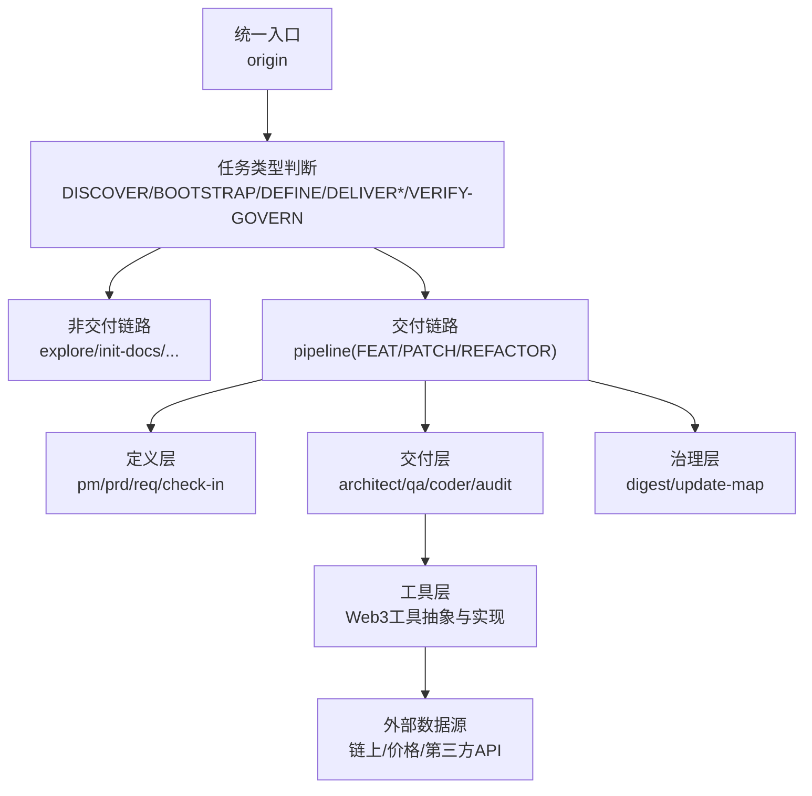
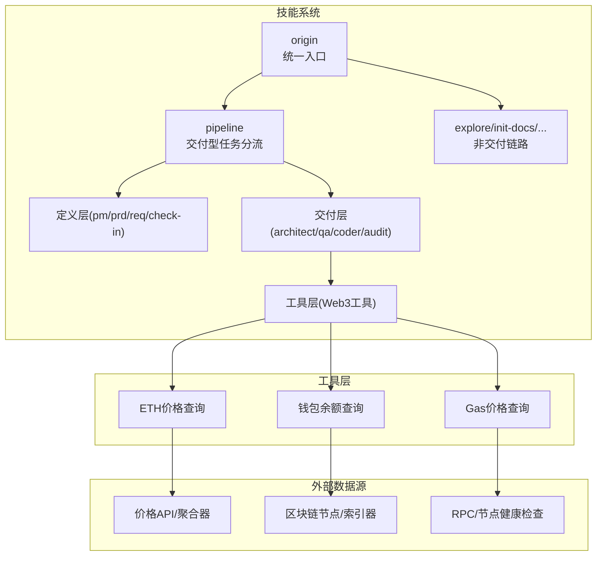
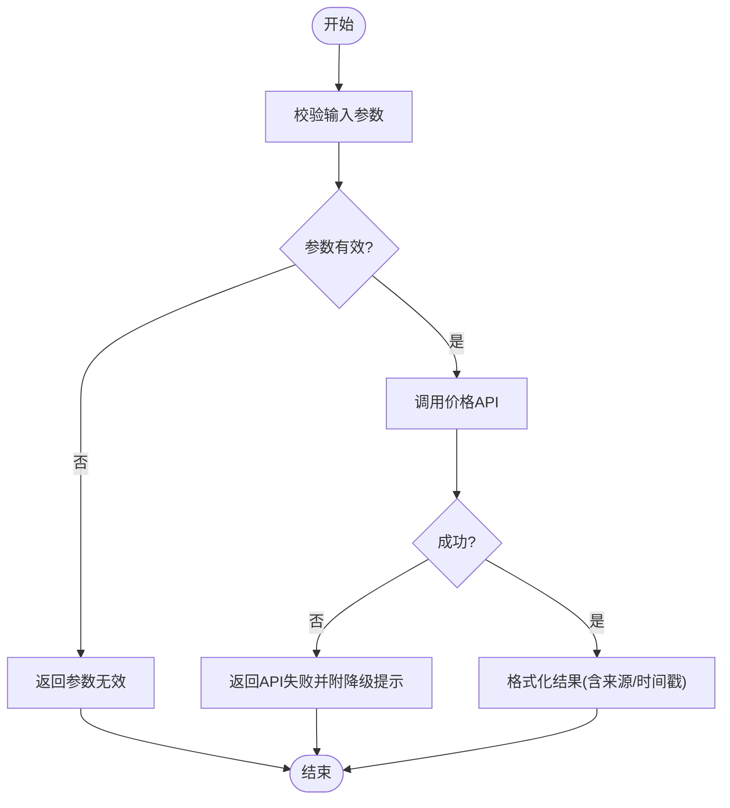
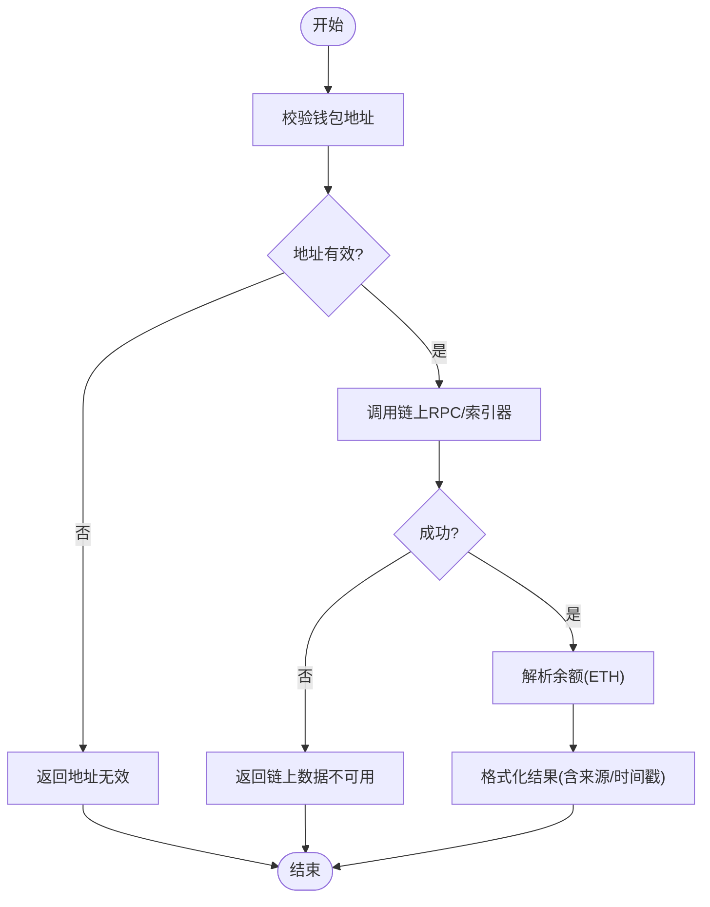
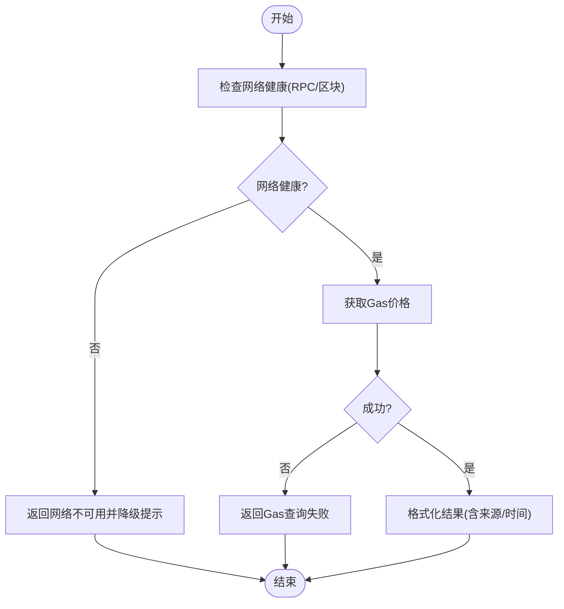
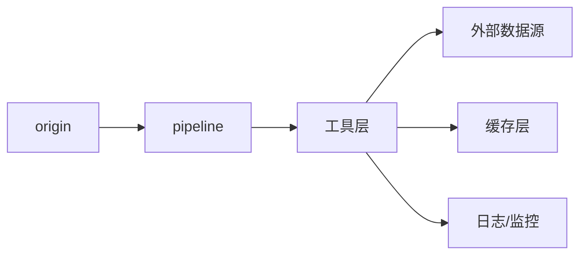

# Web3工具集成

<cite>
**本文引用的文件**
- [Web3-AI-Agent-PRD-MVP.md](file://Web3-AI-Agent-PRD-MVP.md)
- [Web3-AI-Agent-项目里程碑-Checklist.md](file://Web3-AI-Agent-项目里程碑-Checklist.md)
- [WEB3-AI-AGENT-使用教程-V1.md](file://WEB3-AI-AGENT-使用教程-V1.md)
- [skills/web3-ai-agent/SKILL.md](file://skills/web3-ai-agent/SKILL.md)
- [skills/web3-ai-agent/SKILL-SYSTEM-DESIGN-V3.md](file://skills/web3-ai-agent/SKILL-SYSTEM-DESIGN-V3.md)
- [skills/web3-ai-agent/MAP-V3.md](file://skills/web3-ai-agent/MAP-V3.md)
- [skills/web3-ai-agent/origin/SKILL.md](file://skills/web3-ai-agent/origin/SKILL.md)
- [skills/web3-ai-agent/pipeline/SKILL.md](file://skills/web3-ai-agent/pipeline/SKILL.md)
</cite>

## 目录
1. [简介](#简介)
2. [项目结构](#项目结构)
3. [核心组件](#核心组件)
4. [架构总览](#架构总览)
5. [详细组件分析](#详细组件分析)
6. [依赖分析](#依赖分析)
7. [性能考虑](#性能考虑)
8. [故障排查指南](#故障排查指南)
9. [结论](#结论)
10. [附录](#附录)

## 简介
本文件面向Web3开发者，系统化阐述AI-Agent项目的Web3工具集成方案。围绕“工具抽象层、工具调用接口、数据格式化与错误处理策略”，结合MVP阶段的三大核心工具（ETH价格查询、钱包余额查询、Gas价格查询）进行设计与实现指导；并提供扩展机制、API接口文档、性能优化与故障恢复建议，帮助团队在可控风险边界内构建可演进的Web3数据服务能力。

## 项目结构
该项目采用“技能系统（Skill System）+ 工具层”的分层组织方式：
- 技能系统：通过统一入口路由不同任务类型，按需进入定义、交付、治理等子链路。
- 工具层：封装Web3数据获取逻辑，提供标准化接口与错误处理策略，确保Agent在调用工具前后能获得一致、可解释的结果。

图表来源
- [skills/web3-ai-agent/SKILL.md:1-224](file://skills/web3-ai-agent/SKILL.md#L1-L224)
- [skills/web3-ai-agent/SKILL-SYSTEM-DESIGN-V3.md:1-719](file://skills/web3-ai-agent/SKILL-SYSTEM-DESIGN-V3.md#L1-L719)
- [skills/web3-ai-agent/MAP-V3.md:1-166](file://skills/web3-ai-agent/MAP-V3.md#L1-L166)

章节来源
- [skills/web3-ai-agent/SKILL.md:1-224](file://skills/web3-ai-agent/SKILL.md#L1-L224)
- [skills/web3-ai-agent/SKILL-SYSTEM-DESIGN-V3.md:1-719](file://skills/web3-ai-agent/SKILL-SYSTEM-DESIGN-V3.md#L1-L719)
- [skills/web3-ai-agent/MAP-V3.md:1-166](file://skills/web3-ai-agent/MAP-V3.md#L1-L166)

## 核心组件
- 工具抽象层
  - 设计理念：将Web3数据查询抽象为标准化工具，统一输入/输出契约、错误处理与降级策略，保证Agent在不同数据源间平滑切换。
  - 关键属性：工具名称、输入参数、输出结构、错误码、降级策略、数据来源标识。
- 三大核心工具
  - ETH价格查询：面向公开价格数据源，返回ETH价格与来源时间戳。
  - 钱包余额查询：校验钱包地址合法性，查询链上ETH余额并标注数据来源。
  - Gas价格查询：检查网络可用性，若不可用则返回降级提示与替代信息。
- 错误处理与降级
  - 参数无效、外部API超时、网络不可用、工具失败等场景均需返回可理解的失败说明与保守建议，避免伪造数据。

章节来源
- [Web3-AI-Agent-PRD-MVP.md:84-156](file://Web3-AI-Agent-PRD-MVP.md#L84-L156)
- [Web3-AI-Agent-PRD-MVP.md:174-197](file://Web3-AI-Agent-PRD-MVP.md#L174-L197)

## 架构总览
Web3工具集成的总体架构由“技能系统路由 + 工具层 + 外部数据源”三层组成。技能系统负责任务识别与流程编排，工具层负责数据获取与结果格式化，外部数据源包括链上节点、价格API与第三方Web3数据提供商。

图表来源
- [skills/web3-ai-agent/origin/SKILL.md:1-125](file://skills/web3-ai-agent/origin/SKILL.md#L1-L125)
- [skills/web3-ai-agent/pipeline/SKILL.md:1-89](file://skills/web3-ai-agent/pipeline/SKILL.md#L1-L89)
- [Web3-AI-Agent-PRD-MVP.md:84-156](file://Web3-AI-Agent-PRD-MVP.md#L84-L156)

## 详细组件分析

### 工具抽象层设计
- 输入/输出契约
  - 输入：工具名称、参数集合（如钱包地址、链ID、超时阈值）
  - 输出：结构化结果（含数值、单位、来源、时间戳、工具元信息）
- 错误处理策略
  - 参数校验失败：返回“参数无效”及可选建议
  - 外部API超时/异常：返回“数据获取失败”并附带降级提示
  - 网络不可用：返回“网络不可用”并建议稍后重试
- 降级与容错
  - 多源备份：同一工具可配置多个数据源，失败时自动切换
  - 缓存命中：优先返回缓存结果，设置TTL与失效策略
  - 保守回复：失败时不输出虚构数据，明确标注“数据来源未知”

章节来源
- [Web3-AI-Agent-PRD-MVP.md:174-197](file://Web3-AI-Agent-PRD-MVP.md#L174-L197)

### ETH价格查询工具
- 数据获取机制
  - 选择可靠的价格聚合器或交易所API，支持ETH/USD等主流对
  - 返回价格数值、来源时间戳、数据源标识
- 数据格式化
  - 数值保留合理精度，单位统一
  - 结果中明确标注“数据来自工具查询，而非模型主观生成”
- 错误处理
  - API不可达：返回“价格数据暂时不可用，建议稍后重试”
  - 解析失败：返回“数据解析异常，无法生成价格结果”

图表来源
- [Web3-AI-Agent-PRD-MVP.md:143-156](file://Web3-AI-Agent-PRD-MVP.md#L143-L156)

章节来源
- [Web3-AI-Agent-PRD-MVP.md:143-156](file://Web3-AI-Agent-PRD-MVP.md#L143-L156)

### 钱包余额查询工具
- 地址验证与余额获取流程
  - 地址校验：使用正则或校验和算法验证钱包地址合法性
  - 余额查询：调用链上节点或索引器，获取ETH余额
  - 结果标注：明确数据来源（链上）、查询时间、单位
- 数据格式化
  - 余额数值保留合适精度，单位统一为ETH
  - 结果中包含“数据来自链上查询”的说明
- 错误处理
  - 地址无效：返回“地址格式不正确”
  - RPC不可用：返回“链上数据不可用，建议稍后重试”
  - 解析失败：返回“余额解析异常”

图表来源
- [Web3-AI-Agent-PRD-MVP.md:143-156](file://Web3-AI-Agent-PRD-MVP.md#L143-L156)

章节来源
- [Web3-AI-Agent-PRD-MVP.md:143-156](file://Web3-AI-Agent-PRD-MVP.md#L143-L156)

### Gas价格查询工具
- 网络状态检查与降级策略
  - 健康检查：先检查RPC连通性与区块高度变化
  - 可用：返回当前Gas价格（基础/优先级/乐观）
  - 不可用：返回“网络不可用”并建议使用历史参考或稍后重试
- 数据格式化
  - 返回结构化Gas价格字段（如gwei），标注来源与时间
- 错误处理
  - 超时：返回“Gas价格查询超时”
  - 解析失败：返回“Gas数据解析异常”

图表来源
- [Web3-AI-Agent-PRD-MVP.md:143-156](file://Web3-AI-Agent-PRD-MVP.md#L143-L156)

章节来源
- [Web3-AI-Agent-PRD-MVP.md:143-156](file://Web3-AI-Agent-PRD-MVP.md#L143-L156)

### 工具系统的扩展机制
- 第三方Web3数据源集成
  - 注册新工具：定义工具名称、输入/输出契约、错误码与降级策略
  - 配置数据源：支持多源并行与故障转移
  - 结果归一化：统一字段与单位，确保Agent侧无需感知底层差异
- 集成流程
  - 在工具层新增适配器，实现统一接口
  - 在技能系统中注册工具，确保Agent可调用
  - 编写测试用例与异常路径验证

章节来源
- [Web3-AI-Agent-PRD-MVP.md:143-156](file://Web3-AI-Agent-PRD-MVP.md#L143-L156)

## 依赖分析
- 技能系统与工具层的耦合关系
  - 技能系统负责任务路由与流程编排，工具层提供数据能力
  - 两者通过标准化工具接口耦合，降低相互依赖
- 外部依赖
  - 价格API、链上RPC、索引器等第三方服务
  - 通过健康检查与降级策略降低外部依赖风险

图表来源
- [skills/web3-ai-agent/SKILL.md:1-224](file://skills/web3-ai-agent/SKILL.md#L1-L224)
- [skills/web3-ai-agent/SKILL-SYSTEM-DESIGN-V3.md:1-719](file://skills/web3-ai-agent/SKILL-SYSTEM-DESIGN-V3.md#L1-L719)

章节来源
- [skills/web3-ai-agent/SKILL.md:1-224](file://skills/web3-ai-agent/SKILL.md#L1-L224)
- [skills/web3-ai-agent/SKILL-SYSTEM-DESIGN-V3.md:1-719](file://skills/web3-ai-agent/SKILL-SYSTEM-DESIGN-V3.md#L1-L719)

## 性能考虑
- 缓存策略
  - 价格与Gas价格：短期缓存（如数分钟），设置TTL与失效策略
  - 钱包余额：按地址维度缓存，结合区块高度或时间戳判断有效性
- 并发与限流
  - 对外部API进行并发限制与重试退避
  - 对链上RPC进行队列化与限流，避免抖动
- 降级与可观测性
  - 失败时返回降级提示，记录失败原因与耗时
  - 健康检查周期化，异常告警与自动恢复

## 故障排查指南
- 常见问题与处理
  - 参数无效：检查输入格式与必填字段
  - API超时：查看外部服务状态与限流情况
  - 网络不可用：检查RPC连通性与区块高度变化
  - 结果为空：确认数据源可用性与工具配置
- 日志与监控
  - 记录工具调用参数、响应时间、错误码与降级原因
  - 设置SLA阈值与告警，保障用户体验

章节来源
- [Web3-AI-Agent-PRD-MVP.md:174-197](file://Web3-AI-Agent-PRD-MVP.md#L174-L197)

## 结论
本方案以“技能系统路由 + 工具层抽象 + 外部数据源”为核心，围绕MVP三大工具构建了可演进的Web3数据服务能力。通过标准化接口、统一错误处理与降级策略，以及可插拔的扩展机制，团队可在可控风险边界内持续迭代，逐步完善多链支持与高级能力。

## 附录

### API接口文档（示例）
- ETH价格查询
  - 方法：GET
  - 路径：/tools/getETHPrice
  - 请求参数
    - 无
  - 成功响应
    - 字段：price（数值）、currency（字符串）、source（字符串）、timestamp（时间戳）
  - 失败响应
    - 字段：error（字符串）、message（字符串）、retryAfter（可选）
- 钱包余额查询
  - 方法：POST
  - 路径：/tools/getWalletBalance
  - 请求参数
    - address（钱包地址，校验格式）
  - 成功响应
    - 字段：balance（数值，ETH）、address（字符串）、source（字符串）、timestamp（时间戳）
  - 失败响应
    - 字段：error（字符串）、message（字符串）、help（可选）
- Gas价格查询
  - 方法：GET
  - 路径：/tools/getGasPrice
  - 请求参数
    - 无
  - 成功响应
    - 字段：standard（数值，gwei）、priority（数值，gwei）、timestamp（时间戳）、source（字符串）
  - 失败响应
    - 字段：error（字符串）、message（字符串）、help（可选）

章节来源
- [Web3-AI-Agent-PRD-MVP.md:84-156](file://Web3-AI-Agent-PRD-MVP.md#L84-L156)