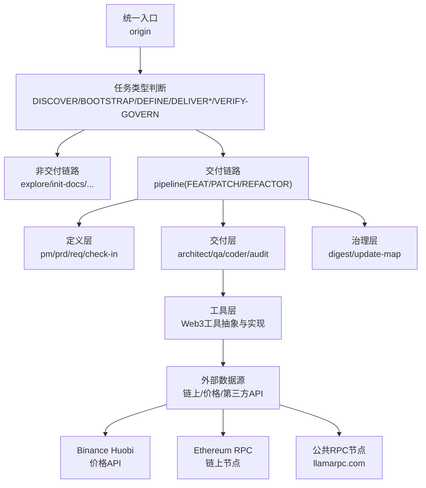
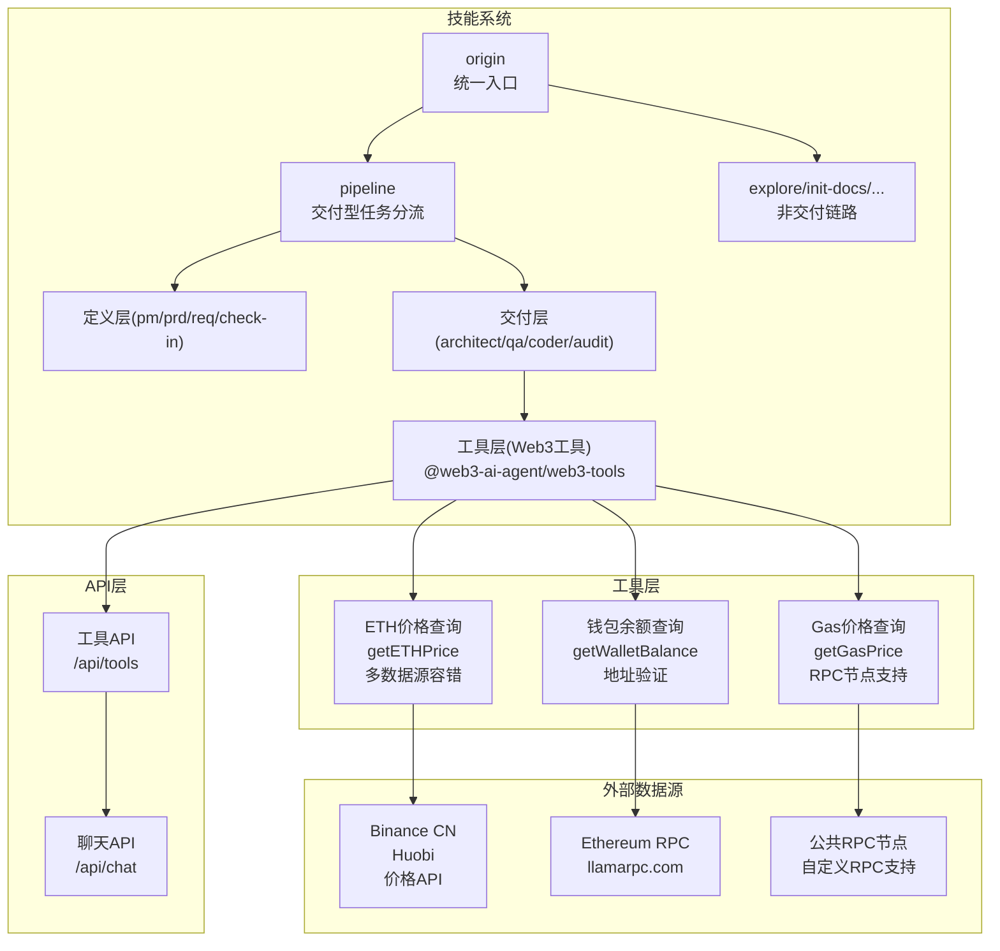
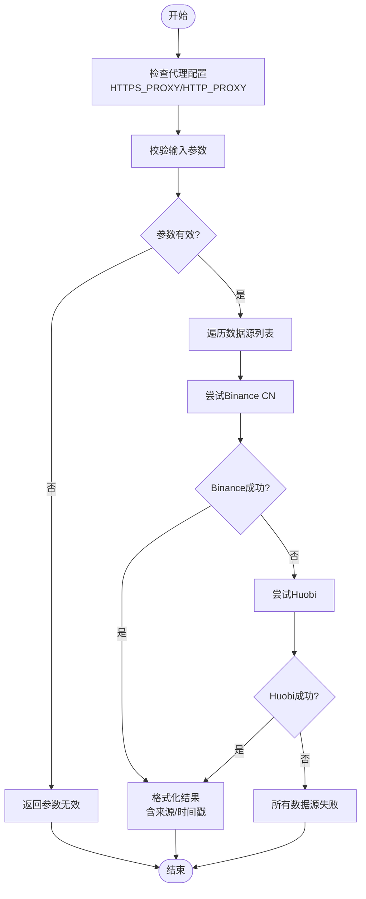
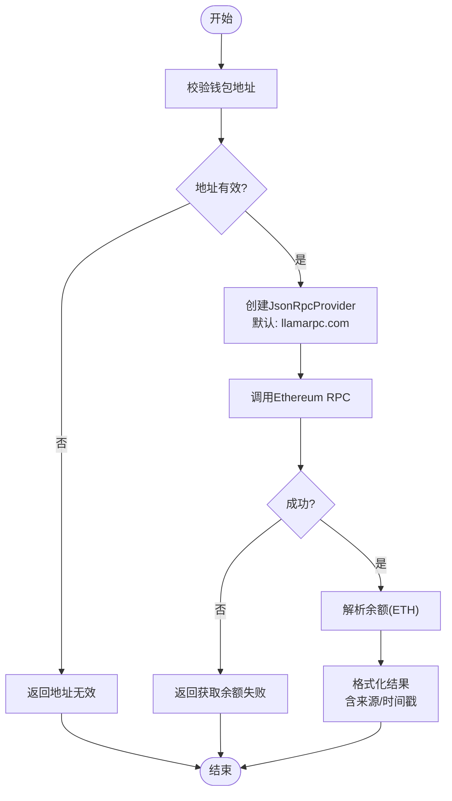
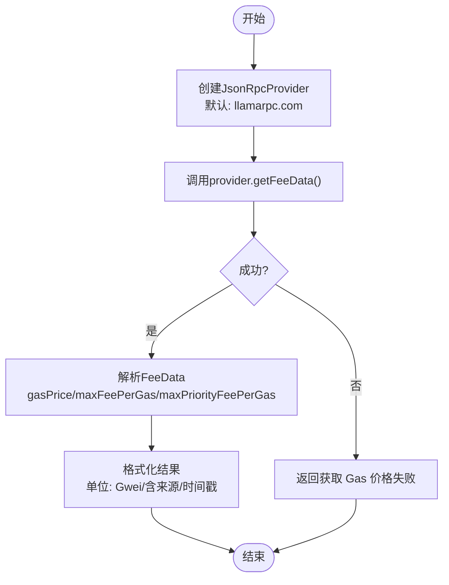

# Web3工具集成

<cite>
**本文引用的文件**
- [Web3-AI-Agent-PRD-MVP.md](file://docs/Web3-AI-Agent-PRD-MVP.md)
- [Web3-AI-Agent-项目里程碑-Checklist.md](file://docs/Web3-AI-Agent-项目里程碑-Checklist.md)
- [WEB3-AI-AGENT-使用教程-V1.md](file://docs/WEB3-AI-AGENT-使用教程-V1.md)
- [packages/web3-tools/src/index.ts](file://packages/web3-tools/src/index.ts)
- [packages/web3-tools/src/types.ts](file://packages/web3-tools/src/types.ts)
- [packages/web3-tools/src/price.ts](file://packages/web3-tools/src/price.ts)
- [packages/web3-tools/src/balance.ts](file://packages/web3-tools/src/balance.ts)
- [packages/web3-tools/src/gas.ts](file://packages/web3-tools/src/gas.ts)
- [packages/web3-tools/package.json](file://packages/web3-tools/package.json)
- [apps/web/app/api/tools/route.ts](file://apps/web/app/api/tools/route.ts)
- [apps/web/app/api/chat/route.ts](file://apps/web/app/api/chat/route.ts)
- [apps/web/package.json](file://apps/web/package.json)
- [apps/web/app/page.tsx](file://apps/web/app/page.tsx)
- [skills/x-ray/SKILL.md](file://skills/x-ray/SKILL.md)
- [skills/x-ray/SKILL-SYSTEM-DESIGN-V3.md](file://skills/x-ray/SKILL-SYSTEM-DESIGN-V3.md)
- [skills/x-ray/MAP-V3.md](file://skills/x-ray/MAP-V3.md)
</cite>

## 更新摘要
**变更内容**
- 更新架构说明以反映从API路由调用改为直接包导入的架构重构
- 新增代理支持、多数据源容错、超时处理等新功能特性
- 更新工具实现位置至packages/web3-tools/src/目录
- 更新依赖管理为monorepo包结构
- 更新API接口文档以反映新的工具调用方式

## 目录
1. [简介](#简介)
2. [项目结构](#项目结构)
3. [核心组件](#核心组件)
4. [架构总览](#架构总览)
5. [详细组件分析](#详细组件分析)
6. [依赖分析](#依赖分析)
7. [性能考虑](#性能考虑)
8. [故障排查指南](#故障排查指南)
9. [结论](#结论)
10. [附录](#附录)

## 简介
本文件面向Web3开发者，系统化阐述AI-Agent项目的Web3工具集成方案。项目已从概念设计升级为完整实现，包含ETH价格查询、钱包余额查询、Gas价格查询等核心工具，以及完整的工具抽象层设计。围绕"工具抽象层、工具调用接口、数据格式化与错误处理策略"，结合MVP阶段的三大核心工具进行设计与实现指导；并提供扩展机制、API接口文档、性能优化与故障恢复建议，帮助团队在可控风险边界内构建可演进的Web3数据服务能力。

**更新** 项目现已完成架构重构，采用monorepo包管理模式，工具实现迁移至packages/web3-tools/src/目录，支持代理配置、多数据源容错和超时处理等增强功能。

## 项目结构
该项目采用"技能系统（Skill System）+ 工具层 + API层"的分层组织方式，现已升级为monorepo架构：
- 技能系统：通过统一入口路由不同任务类型，按需进入定义、交付、治理等子链路。
- 工具层：封装Web3数据获取逻辑，提供标准化接口与错误处理策略，确保Agent在调用工具前后能获得一致、可解释的结果。
- API层：提供RESTful接口，支持前端调用和工具调用。



**图表来源**
- [skills/x-ray/SKILL.md:1-224](file://skills/x-ray/SKILL.md#L1-L224)
- [skills/x-ray/SKILL-SYSTEM-DESIGN-V3.md:1-719](file://skills/x-ray/SKILL-SYSTEM-DESIGN-V3.md#L1-L719)
- [skills/x-ray/MAP-V3.md:1-211](file://skills/x-ray/MAP-V3.md#L1-L211)

**章节来源**
- [skills/x-ray/SKILL.md:1-224](file://skills/x-ray/SKILL.md#L1-L224)
- [skills/x-ray/SKILL-SYSTEM-DESIGN-V3.md:1-719](file://skills/x-ray/SKILL-SYSTEM-DESIGN-V3.md#L1-L719)
- [skills/x-ray/MAP-V3.md:1-211](file://skills/x-ray/MAP-V3.md#L1-L211)

## 核心组件
- 工具抽象层
  - 设计理念：将Web3数据查询抽象为标准化工具，统一输入/输出契约、错误处理与降级策略，保证Agent在不同数据源间平滑切换。
  - 关键属性：工具名称、输入参数、输出结构、错误码、降级策略、数据来源标识。
- 三大核心工具
  - ETH价格查询：支持多数据源容错（Binance/Huobi），内置代理支持和10秒超时处理，返回ETH价格与24小时变化率。
  - 钱包余额查询：校验钱包地址合法性，查询链上ETH余额并标注数据来源，支持自定义RPC节点。
  - Gas价格查询：检查网络可用性，返回当前Gas价格（基础/优先级/乐观），支持自定义RPC节点。
- 错误处理与降级
  - 参数无效、外部API超时、网络不可用、工具失败等场景均需返回可理解的失败说明与保守建议，避免伪造数据。

**更新** 新增代理支持、多数据源容错、超时处理等增强功能，提升工具的可靠性和可用性。

**章节来源**
- [Web3-AI-Agent-PRD-MVP.md:84-156](file://docs/Web3-AI-Agent-PRD-MVP.md#L84-L156)
- [Web3-AI-Agent-PRD-MVP.md:174-197](file://docs/Web3-AI-Agent-PRD-MVP.md#L174-L197)

## 架构总览
Web3工具集成的总体架构由"技能系统路由 + 工具层 + API层 + 外部数据源"四层组成。技能系统负责任务识别与流程编排，工具层负责数据获取与结果格式化，API层提供统一接口，外部数据源包括链上节点、价格API与第三方Web3数据提供商。

**更新** 架构已重构为monorepo模式，工具实现位于packages/web3-tools/src/目录，通过包导入方式直接调用，提升性能和可维护性。



**图表来源**
- [apps/web/app/api/tools/route.ts:1-47](file://apps/web/app/api/tools/route.ts#L1-L47)
- [apps/web/app/api/chat/route.ts:1-185](file://apps/web/app/api/chat/route.ts#L1-L185)
- [packages/web3-tools/src/index.ts:1-7](file://packages/web3-tools/src/index.ts#L1-L7)

## 详细组件分析

### 工具抽象层设计
- 输入/输出契约
  - 输入：工具名称、参数集合（如钱包地址、链ID、超时阈值）
  - 输出：结构化结果（含success标志、data、error、timestamp、source）
- 错误处理策略
  - 参数校验失败：返回"参数无效"及可选建议
  - 外部API超时/异常：返回"数据获取失败"并附带降级提示
  - 网络不可用：返回"网络不可用"并建议稍后重试
- 降级与容错
  - 多源备份：同一工具可配置多个数据源，失败时自动切换
  - 缓存命中：优先返回缓存结果，设置TTL与失效策略
  - 保守回复：失败时不输出虚构数据，明确标注"数据来源未知"

**更新** 新增代理支持和超时处理机制，提升工具的稳定性和可靠性。

**章节来源**
- [Web3-AI-Agent-PRD-MVP.md:174-197](file://docs/Web3-AI-Agent-PRD-MVP.md#L174-L197)

### ETH价格查询工具
- 数据获取机制
  - 使用多数据源容错机制，支持Binance CN和Huobi价格API
  - 内置代理支持，支持HTTPS_PROXY和HTTP_PROXY环境变量
  - 10秒超时限制，确保响应及时性
  - 返回价格数值、24小时变化百分比、货币单位
- 数据格式化
  - 数值保留合理精度，单位统一为USD
  - 结果中明确标注"数据来自Binance/Huobi"
- 错误处理
  - API不可达：返回"所有价格数据源都不可用，请稍后重试"
  - 解析失败：返回"数据解析异常，无法生成价格结果"



**图表来源**
- [packages/web3-tools/src/price.ts:20-84](file://packages/web3-tools/src/price.ts#L20-L84)

**章节来源**
- [packages/web3-tools/src/price.ts:16-84](file://packages/web3-tools/src/price.ts#L16-L84)

### 钱包余额查询工具
- 地址验证与余额获取流程
  - 地址校验：使用ethers.js验证钱包地址合法性
  - RPC配置：支持默认公共RPC节点（eth.llamarpc.com）和自定义RPC
  - 余额查询：调用Ethereum RPC节点，获取ETH余额
  - 结果标注：明确数据来源（链上）、查询时间、单位
- 数据格式化
  - 余额数值保留合适精度，单位统一为ETH
  - 结果中包含"data来自链上查询"的说明
- 错误处理
  - 地址无效：返回"无效的以太坊地址格式"
  - RPC不可用：返回"获取余额失败"
  - 解析失败：返回"获取余额失败"



**图表来源**
- [packages/web3-tools/src/balance.ts:12-53](file://packages/web3-tools/src/balance.ts#L12-L53)

**章节来源**
- [packages/web3-tools/src/balance.ts:7-53](file://packages/web3-tools/src/balance.ts#L7-L53)

### Gas价格查询工具
- 网络状态检查与降级策略
  - RPC配置：支持默认公共RPC节点（eth.llamarpc.com）和自定义RPC
  - Fee数据获取：调用provider.getFeeData()获取Gas价格信息
  - 可用：返回当前Gas价格（基础/优先级/乐观），单位为Gwei
  - 不可用：返回"获取 Gas 价格失败"
- 数据格式化
  - 返回结构化Gas价格字段（如gwei），标注来源与时间
- 错误处理
  - 超时：返回"获取 Gas 价格失败"
  - 解析失败：返回"获取 Gas 价格失败"



**图表来源**
- [packages/web3-tools/src/gas.ts:11-43](file://packages/web3-tools/src/gas.ts#L11-L43)

**章节来源**
- [packages/web3-tools/src/gas.ts:7-43](file://packages/web3-tools/src/gas.ts#L7-L43)

### 工具系统的扩展机制
- 第三方Web3数据源集成
  - 注册新工具：定义工具名称、输入/输出契约、错误码与降级策略
  - 配置数据源：支持多源并行与故障转移
  - 结果归一化：统一字段与单位，确保Agent侧无需感知底层差异
- 集成流程
  - 在工具层新增适配器，实现统一接口
  - 在技能系统中注册工具，确保Agent可调用
  - 编写测试用例与异常路径验证

**更新** 新增代理支持和超时处理机制，提升工具的稳定性和可用性。

**章节来源**
- [Web3-AI-Agent-PRD-MVP.md:143-156](file://docs/Web3-AI-Agent-PRD-MVP.md#L143-L156)

## 依赖分析
- 技能系统与工具层的耦合关系
  - 技能系统负责任务路由与流程编排，工具层提供数据能力
  - 两者通过标准化工具接口耦合，降低相互依赖
- 外部依赖
  - Binance Huobi价格API、Ethereum RPC节点、公共RPC节点等第三方服务
  - 通过健康检查与降级策略降低外部依赖风险
- 包管理
  - monorepo架构，使用pnpm workspace管理
  - @web3-ai-agent/web3-tools包提供核心工具功能
  - @web3-ai-agent/web应用依赖工具包

**更新** 依赖管理已迁移到monorepo模式，使用pnpm workspace进行包管理。

```mermaid
graph LR
O["origin"] --> P["pipeline"]
P --> T["@web3-ai-agent/web3-tools<br/>工具层"]
T --> EX["外部数据源<br/>Binance/Huobi/RPC节点"]
T --> CACHE["缓存层"]
T --> LOG["日志/监控"]
API["API层"] --> T
API --> CHAT["聊天API"]
subgraph "Monorepo包管理"
PKG["@web3-ai-agent/web3-tools<br/>pnpm workspace:*"] --> DEPS["ethers/node-fetch/https-proxy-agent"]
APP["@web3-ai-agent/web<br/>workspace:*"] --> PKG
END
```

**图表来源**
- [skills/x-ray/SKILL.md:1-224](file://skills/x-ray/SKILL.md#L1-L224)
- [skills/x-ray/SKILL-SYSTEM-DESIGN-V3.md:1-719](file://skills/x-ray/SKILL-SYSTEM-DESIGN-V3.md#L1-L719)
- [packages/web3-tools/package.json:1-25](file://packages/web3-tools/package.json#L1-L25)
- [apps/web/package.json:1-36](file://apps/web/package.json#L1-L36)

**章节来源**
- [skills/x-ray/SKILL.md:1-224](file://skills/x-ray/SKILL.md#L1-L224)
- [skills/x-ray/SKILL-SYSTEM-DESIGN-V3.md:1-719](file://skills/x-ray/SKILL-SYSTEM-DESIGN-V3.md#L1-L719)
- [packages/web3-tools/package.json:1-25](file://packages/web3-tools/package.json#L1-L25)
- [apps/web/package.json:1-36](file://apps/web/package.json#L1-L36)

## 性能考虑
- 缓存策略
  - 价格与Gas价格：短期缓存（如60秒），设置TTL与失效策略
  - 钱包余额：按地址维度缓存，结合区块高度或时间戳判断有效性
- 并发与限流
  - 对外部API进行并发限制与重试退避
  - 对链上RPC进行队列化与限流，避免抖动
- 降级与可观测性
  - 失败时返回降级提示，记录失败原因与耗时
  - 健康检查周期化，异常告警与自动恢复
- 代理支持
  - 支持HTTPS_PROXY和HTTP_PROXY环境变量
  - 自动检测代理配置并启用代理连接
- 超时处理
  - HTTP请求设置10秒超时限制
  - RPC调用使用ethers提供的超时机制

**更新** 新增代理支持、超时处理等性能优化措施，提升工具的稳定性和响应速度。

## 故障排查指南
- 常见问题与处理
  - 参数无效：检查输入格式与必填字段
  - API超时：查看外部服务状态与限流情况
  - 网络不可用：检查RPC连通性与区块高度变化
  - 结果为空：确认数据源可用性与工具配置
  - 代理连接失败：检查HTTPS_PROXY/HTTP_PROXY环境变量配置
- 日志与监控
  - 记录工具调用参数、响应时间、错误码与降级原因
  - 设置SLA阈值与告警，保障用户体验
- 诊断步骤
  - 检查环境变量配置（RPC节点、代理设置）
  - 验证网络连通性和防火墙设置
  - 查看工具返回的source字段确认数据来源
  - 检查工具调用的timestamp和error字段

**更新** 新增代理配置和超时处理相关的故障排查指南。

**章节来源**
- [Web3-AI-Agent-PRD-MVP.md:174-197](file://docs/Web3-AI-Agent-PRD-MVP.md#L174-L197)

## 结论
本方案以"技能系统路由 + 工具层抽象 + API层 + 外部数据源"为核心，围绕MVP三大工具构建了可演进的Web3数据服务能力。通过标准化接口、统一错误处理与降级策略，以及可插拔的扩展机制，团队可在可控风险边界内持续迭代，逐步完善多链支持与高级能力。

**更新** 架构重构完成后，系统采用monorepo包管理模式，工具实现更加模块化和可维护，新增的代理支持、多数据源容错和超时处理等功能显著提升了系统的稳定性和可靠性。

## 附录

### API接口文档
- ETH价格查询
  - 方法：GET
  - 路径：/api/tools/getETHPrice
  - 请求参数：无
  - 成功响应：包含price、change24h、currency字段
  - 失败响应：包含error字段
- 钱包余额查询
  - 方法：POST
  - 路径：/api/tools/getWalletBalance
  - 请求参数：address（钱包地址）
  - 成功响应：包含address、balance、unit字段
  - 失败响应：包含error字段
- Gas价格查询
  - 方法：GET
  - 路径：/api/tools/getGasPrice
  - 请求参数：无
  - 成功响应：包含gasPrice、maxFeePerGas、maxPriorityFeePerGas、unit字段
  - 失败响应：包含error字段

**更新** API接口文档保持不变，工具调用方式已从直接调用改为通过API路由间接调用。

**章节来源**
- [apps/web/app/api/tools/route.ts:9-47](file://apps/web/app/api/tools/route.ts#L9-L47)

### 工具调用示例
- 前端调用流程
  - 用户输入问题
  - Agent判断是否需要调用工具
  - 调用对应Web3工具API
  - 获取工具结果并回填给模型
  - 生成最终回复并返回给前端
- 直接触发方式
  - 直接导入@web3-ai-agent/web3-tools包
  - 调用getETHPrice、getWalletBalance、getGasPrice函数
  - 处理返回的ToolResult对象

**更新** 新增直接包导入调用方式，支持两种调用模式：

**章节来源**
- [apps/web/app/api/chat/route.ts:77-185](file://apps/web/app/api/chat/route.ts#L77-L185)
- [apps/web/app/page.tsx:42-105](file://apps/web/app/page.tsx#L42-L105)

### 类型定义
- ToolResult：工具调用结果的标准格式
- ETHPriceData：ETH价格数据结构
- WalletBalanceData：钱包余额数据结构
- GasPriceData：Gas价格数据结构

**更新** 类型定义保持不变，位于packages/web3-tools/src/types.ts中。

**章节来源**
- [packages/web3-tools/src/types.ts:1-34](file://packages/web3-tools/src/types.ts#L1-L34)

### 环境变量配置
- RPC节点配置
  - ETHEREUM_RPC_URL：自定义RPC节点URL
  - 默认使用公共RPC节点：https://eth.llamarpc.com
- 代理配置
  - HTTPS_PROXY：HTTPS代理服务器地址
  - HTTP_PROXY：HTTP代理服务器地址
- 超时配置
  - HTTP请求超时：10秒
  - RPC调用超时：由ethers库处理

**更新** 新增代理支持和超时处理相关的环境变量配置说明。