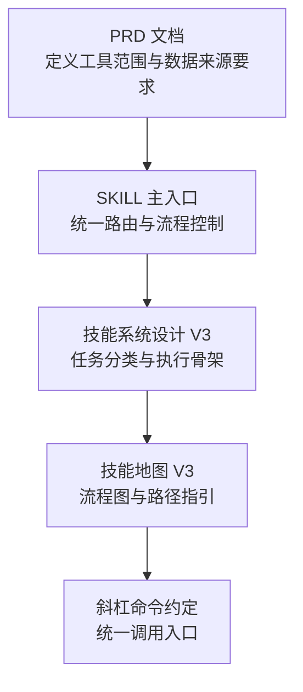
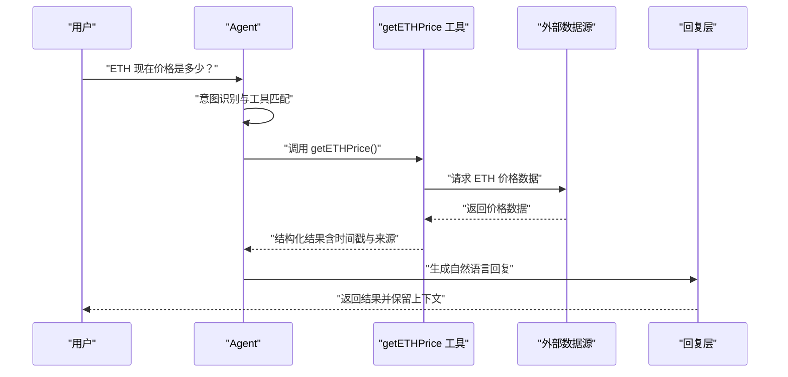
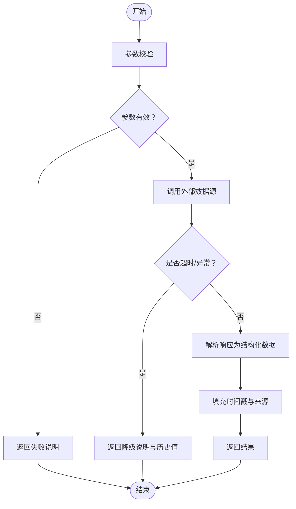
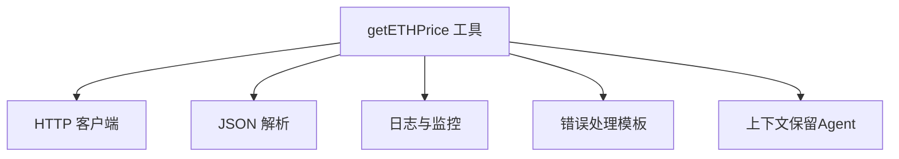

# ETH价格查询工具

<cite>
**本文引用的文件**
- [Web3-AI-Agent-PRD-MVP.md](file://docs/Web3-AI-Agent-PRD-MVP.md)
- [SKILL.md](file://skills/web3-ai-agent/SKILL.md)
- [SKILL-SYSTEM-DESIGN-V3.md](file://skills/web3-ai-agent/SKILL-SYSTEM-DESIGN-V3.md)
- [MAP-V3.md](file://skills/web3-ai-agent/MAP-V3.md)
- [COMMANDS.md](file://skills/web3-ai-agent/COMMANDS.md)
</cite>

## 目录
1. [简介](#简介)
2. [项目结构](#项目结构)
3. [核心组件](#核心组件)
4. [架构总览](#架构总览)
5. [详细组件分析](#详细组件分析)
6. [依赖分析](#依赖分析)
7. [性能考虑](#性能考虑)
8. [故障排查指南](#故障排查指南)
9. [结论](#结论)
10. [附录](#附录)

## 简介
本文件围绕 ETH 价格查询工具（getETHPrice）进行系统化技术实现说明，涵盖数据源接入、API 调用流程、实时性保障、错误处理、API 接口设计、缓存策略、更新频率与精度控制、与其他工具的协作关系以及集成最佳实践。  
根据项目 PRD，getETHPrice 属于 MVP 必做 Web3 工具之一，用于提供“可信、可溯源”的 ETH 价格数据，避免模型主观捏造链上数据。

章节来源
- [Web3-AI-Agent-PRD-MVP.md:94-96](file://docs/Web3-AI-Agent-PRD-MVP.md#L94-L96)
- [Web3-AI-Agent-PRD-MVP.md:147-155](file://docs/Web3-AI-Agent-PRD-MVP.md#L147-L155)

## 项目结构
该项目采用“技能（Skill）系统”组织工具与流程，getETHPrice 作为 Web3 工具之一，遵循统一的技能入口与流程规范。关键文件与职责如下：
- PRD 文档：定义工具范围、数据来源要求与风险控制原则
- SKILL 主入口：统一路由到不同技能与流程
- SKILL-SYSTEM-DESIGN-V3：定义技能分层、任务分类与执行骨架
- MAP-V3：技能地图与流程图，帮助定位 getETHPrice 的集成位置
- COMMANDS：斜杠命令约定，便于统一调用入口

图表来源
- [SKILL.md:1-224](file://skills/web3-ai-agent/SKILL.md#L1-L224)
- [SKILL-SYSTEM-DESIGN-V3.md:1-719](file://skills/web3-ai-agent/SKILL-SYSTEM-DESIGN-V3.md#L1-L719)
- [MAP-V3.md:1-166](file://skills/web3-ai-agent/MAP-V3.md#L1-L166)
- [COMMANDS.md:1-81](file://skills/web3-ai-agent/COMMANDS.md#L1-L81)

章节来源
- [SKILL.md:73-91](file://skills/web3-ai-agent/SKILL.md#L73-L91)
- [SKILL-SYSTEM-DESIGN-V3.md:265-281](file://skills/web3-ai-agent/SKILL-SYSTEM-DESIGN-V3.md#L265-L281)
- [MAP-V3.md:3-84](file://skills/web3-ai-agent/MAP-V3.md#L3-L84)
- [COMMANDS.md:1-50](file://skills/web3-ai-agent/COMMANDS.md#L1-L50)

## 核心组件
- getETHPrice 工具：负责从外部数据源获取 ETH 价格，返回结构化结果并标注数据来源
- Agent 调用层：识别用户意图，必要时调用 getETHPrice，并将结果整合为自然语言回复
- 错误处理与降级：参数校验失败、外部 API 超时或异常、高风险问题保守回复
- 缓存与更新：在满足实时性与精度的前提下，设定合理的缓存与更新策略
- 风险控制：在工具失败时不伪造数据，提供免责声明与风险提示

章节来源
- [Web3-AI-Agent-PRD-MVP.md:94-96](file://docs/Web3-AI-Agent-PRD-MVP.md#L94-L96)
- [Web3-AI-Agent-PRD-MVP.md:151-155](file://docs/Web3-AI-Agent-PRD-MVP.md#L151-L155)
- [Web3-AI-Agent-PRD-MVP.md:161-171](file://docs/Web3-AI-Agent-PRD-MVP.md#L161-L171)

## 架构总览
getETHPrice 的调用与集成遵循“意图识别 → 工具调用 → 结果回填 → 自然语言回复”的 Agent Loop 流程；在工具层之上，统一由 SKILL 主入口进行路由与流程控制。

图表来源
- [Web3-AI-Agent-PRD-MVP.md:174-183](file://docs/Web3-AI-Agent-PRD-MVP.md#L174-L183)
- [SKILL.md:73-91](file://skills/web3-ai-agent/SKILL.md#L73-L91)

## 详细组件分析

### getETHPrice 工具接口设计
- 请求参数
  - 无参数：工具以“ETH 价格查询”为唯一语义入口
  - 可扩展：若未来支持多币种或多市场，可在工具层新增枚举参数（例如 market=binance 或 coin=ETH/USDT）
- 响应格式
  - 字段建议
    - price：价格数值（字符串或数字，视前端渲染需求而定）
    - currency：计价货币（如 USD）
    - source：数据来源标识（如 coingecko/binance）
    - timestamp：数据时间戳（秒或毫秒，统一为 UTC）
    - confidence：置信度（可选，用于表示数据新鲜度或波动性）
  - 时间戳处理
    - 使用 UTC 秒级时间戳，便于跨系统对齐
    - 返回时注明“数据来自工具查询，非模型主观生成”
- 错误码与异常
  - 参数无效：返回明确失败说明
  - 外部 API 超时/异常：返回降级说明与可选的历史最近值
  - 高风险问题：返回数据参考与免责声明

章节来源
- [Web3-AI-Agent-PRD-MVP.md:147-155](file://docs/Web3-AI-Agent-PRD-MVP.md#L147-L155)
- [Web3-AI-Agent-PRD-MVP.md:161-171](file://docs/Web3-AI-Agent-PRD-MVP.md#L161-L171)

### 数据源接入与 API 调用流程
- 数据源选择
  - 优先选择公开、稳定、可溯源的第三方价格服务（如 CoinGecko、Binance Open API）
  - 明确标注 source，便于溯源与审计
- 调用流程
  - 参数校验：确保无参数或参数合法
  - 发起请求：设置合理超时（如 3–5 秒），启用重试（指数退避）
  - 结果解析：提取 price/currency/source/timestamp
  - 校验与落盘：记录原始响应与解析后的结构化数据
- 实时性保障
  - 优先从近实时数据源获取
  - 对于波动较大的市场，建议缩短缓存窗口（如 60–120 秒）

图表来源
- [Web3-AI-Agent-PRD-MVP.md:185-197](file://docs/Web3-AI-Agent-PRD-MVP.md#L185-L197)

### 缓存策略、更新频率与精度控制
- 缓存策略
  - LRU/基于 TTL 的缓存：以 price 为 key，缓存最近一次有效价格
  - 缓存命中：直接返回，提升响应速度
  - 缓存未命中：触发一次新鲜数据拉取
- 更新频率
  - 建议 60–120 秒刷新一次，兼顾实时性与成本
  - 对于高波动时段可缩短至 30–60 秒
- 精度控制
  - 价格精度：保留 2–4 位小数（根据计价货币与波动幅度）
  - 时间戳精度：秒级 UTC，避免本地时区偏差
  - 置信度：可选，用于表达数据新鲜度与波动性

章节来源
- [Web3-AI-Agent-PRD-MVP.md:151-155](file://docs/Web3-AI-Agent-PRD-MVP.md#L151-L155)

### 与其他工具的协作关系与依赖管理
- 与 getWalletBalance 的协作
  - 两者均为 Web3 数据查询工具，遵循相同的数据来源标注与风险控制原则
  - 在同一 Agent Loop 中可顺序调用，分别返回 ETH 价格与地址余额
- 与 Agent 调用层的集成
  - 由 SKILL 主入口统一路由，识别“价格查询”意图后调用 getETHPrice
  - 结果回填给模型，生成自然语言回复并保留上下文
- 依赖管理
  - 外部依赖：HTTP 客户端、JSON 解析、日志与指标上报
  - 内部依赖：统一的错误处理与降级策略、时间戳与来源标注

章节来源
- [Web3-AI-Agent-PRD-MVP.md:94-96](file://docs/Web3-AI-Agent-PRD-MVP.md#L94-L96)
- [SKILL.md:73-91](file://skills/web3-ai-agent/SKILL.md#L73-L91)

### 具体调用示例与最佳实践
- 调用入口
  - 斜杠命令：/origin 或 /pipeline（按团队约定）
  - 自然语言：直接描述“查询 ETH 价格”
- 参数验证
  - 无参数场景无需校验；若扩展参数，需在工具层进行白名单与范围校验
- 网络请求
  - 设置超时与重试；记录请求与响应日志，便于审计
- 结果解析
  - 规范化字段与时间戳；标注 source 与 timestamp
- 异常处理
  - 参数无效：返回明确失败
  - 外部 API 超时/异常：返回降级说明与历史值
  - 高风险问题：提供免责声明与保守建议

章节来源
- [COMMANDS.md:178-201](file://skills/web3-ai-agent/COMMANDS.md#L178-L201)
- [Web3-AI-Agent-PRD-MVP.md:185-197](file://docs/Web3-AI-Agent-PRD-MVP.md#L185-L197)

## 依赖分析
- 外部依赖
  - HTTP 客户端：稳定、可配置超时与重试
  - JSON 解析：严格模式，失败即报错
  - 日志与监控：记录请求、响应、错误与耗时
- 内部依赖
  - 错误处理模板：统一的失败说明与降级策略
  - 时间戳与来源标注：统一字段与格式
  - 上下文保留：在 Agent Loop 中复用对话上下文

图表来源
- [Web3-AI-Agent-PRD-MVP.md:185-197](file://docs/Web3-AI-Agent-PRD-MVP.md#L185-L197)

章节来源
- [Web3-AI-Agent-PRD-MVP.md:185-197](file://docs/Web3-AI-Agent-PRD-MVP.md#L185-L197)

## 性能考虑
- 网络请求
  - 合理设置超时与重试，避免阻塞主流程
  - 对高频调用场景启用并发限制与队列
- 缓存
  - 采用 LRU 或 TTL 缓存，减少重复请求
  - 缓存粒度以“价格值 + 来源 + 计价货币”为 key
- 渲染与传输
  - 前端按需渲染，避免一次性加载过多历史数据
  - 传输层启用压缩与合理的分页策略

## 故障排查指南
- 常见问题
  - 参数无效：检查调用方是否传入非法参数
  - 外部 API 超时：检查网络连通性与第三方服务可用性
  - 结果为空：检查解析逻辑与字段映射
  - 高风险问题：确认是否返回免责声明与保守建议
- 排查步骤
  - 查看日志：请求、响应、错误与耗时
  - 核对时间戳与来源：确保数据可溯源
  - 验证缓存：确认缓存命中与更新策略
  - 回滚变更：在问题扩大前回退最近变更

章节来源
- [Web3-AI-Agent-PRD-MVP.md:185-197](file://docs/Web3-AI-Agent-PRD-MVP.md#L185-L197)

## 结论
getETHPrice 工具作为 Web3 AI Agent 的核心数据能力之一，需在“可信、可溯源、可降级”的前提下提供实时价格数据。通过统一的技能入口、严格的错误处理与降级策略、合理的缓存与更新机制，以及与 Agent 调用层的紧密协作，可实现稳定、可维护且可扩展的价格查询能力。建议在后续版本中进一步完善多市场与多币种支持，并持续优化实时性与成本平衡。

## 附录
- 技能系统总原则与执行骨架
  - 用最少步骤将任务送入正确路径
  - 对高风险任务增加约束，对低风险任务减少消耗
  - 保留文档沉淀，但不让流程压垮交付效率
- 推荐斜杠命令
  - /origin：统一入口
  - /pipeline feat/patch/refactor：按任务类型进入相应流程
  - /explore：只读探索，不进入交付链

章节来源
- [SKILL-SYSTEM-DESIGN-V3.md:24-42](file://skills/web3-ai-agent/SKILL-SYSTEM-DESIGN-V3.md#L24-L42)
- [COMMANDS.md:203-223](file://skills/web3-ai-agent/COMMANDS.md#L203-L223)