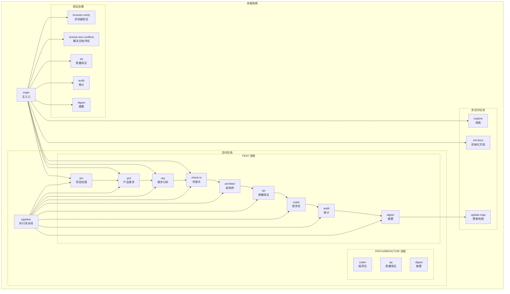
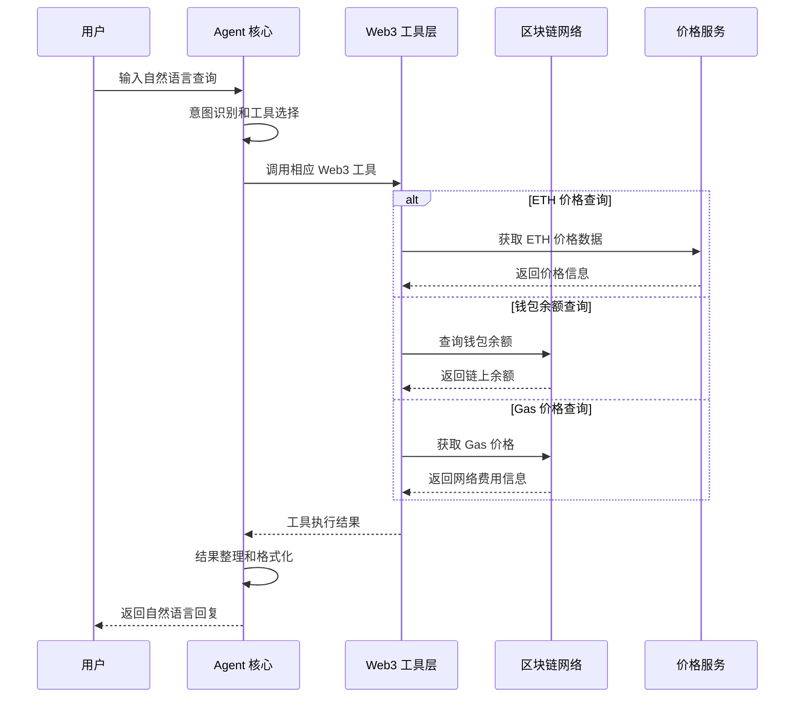
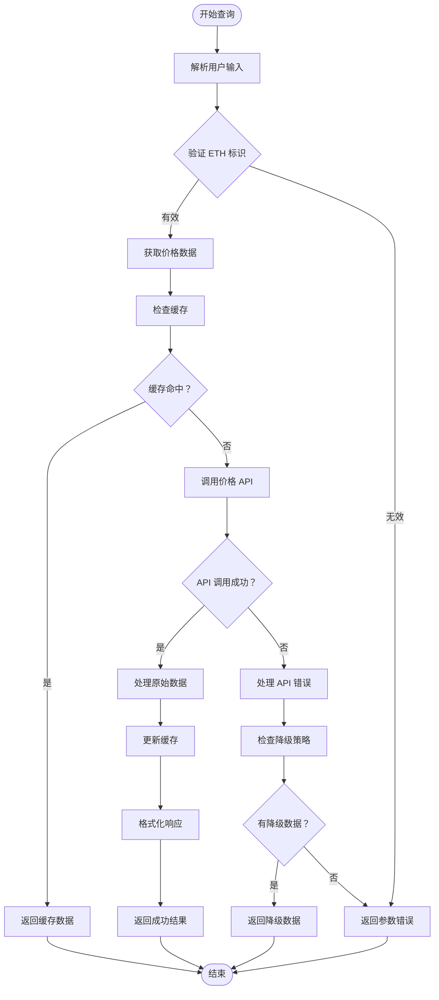
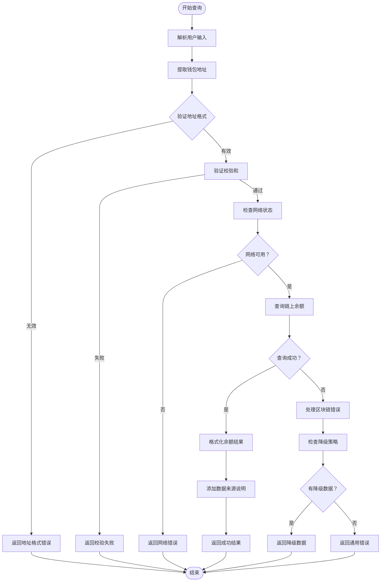
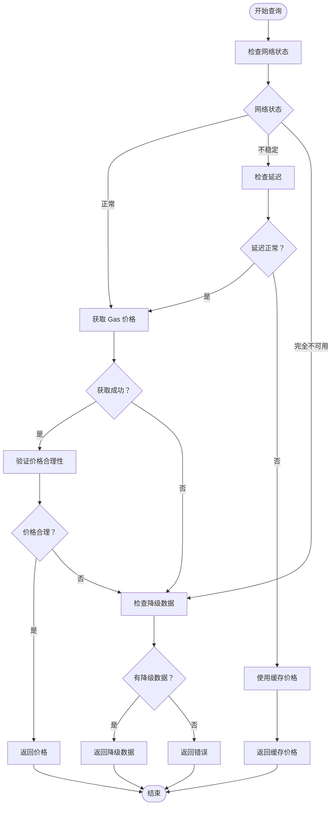
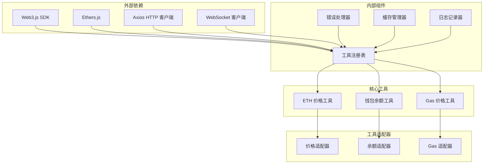

# 核心Web3工具实现

<cite>
**本文档引用的文件**
- [Web3-AI-Agent-PRD-MVP.md](file://Web3-AI-Agent-PRD-MVP.md)
- [MAP-V3.md](file://skills\web3-ai-agent\MAP-V3.md)
- [SKILL.md](file://skills\web3-ai-agent\SKILL.md)
- [COMMANDS.md](file://skills\web3-ai-agent\COMMANDS.md)
- [architect\SKILL.md](file://skills\web3-ai-agent\architect\SKILL.md)
- [coder\SKILL.md](file://skills\web3-ai-agent\coder\SKILL.md)
- [qa\SKILL.md](file://skills\web3-ai-agent\qa\SKILL.md)
- [Web3-AI-Agent-项目里程碑-Checklist.md](file://Web3-AI-Agent-项目里程碑-Checklist.md)
</cite>

## 目录
1. [简介](#简介)
2. [项目结构](#项目结构)
3. [核心组件](#核心组件)
4. [架构概览](#架构概览)
5. [详细组件分析](#详细组件分析)
6. [依赖分析](#依赖分析)
7. [性能考虑](#性能考虑)
8. [故障排除指南](#故障排除指南)
9. [结论](#结论)
10. [附录](#附录)

## 简介

Web3 AI Agent 是一个旨在验证"能够理解用户意图、调用 Web3 工具、返回可信结果，并具备最小风险边界"的 AI Agent 项目。该项目服务于从 Web3 前端工程师升级为 AI 应用工程师/Agent 工程师的个人转型目标。

本项目的核心目标是构建一个可运行的 Web3 AI Agent MVP，覆盖对话 + Tool Calling + Agent Loop + 最小 Memory 四个核心能力。项目采用文档先行、分阶段推进、适合 vibe coding 的开发体系。

## 项目结构

基于提供的技能系统文档，Web3 AI Agent 采用模块化的 skill 架构，每个 skill 都有明确的职责边界和协作关系：

**图表来源**
- [MAP-V3.md:1-84](file://skills\web3-ai-agent\MAP-V3.md#L1-L84)
- [SKILL.md:92-158](file://skills\web3-ai-agent\SKILL.md#L92-L158)

**章节来源**
- [MAP-V3.md:1-84](file://skills\web3-ai-agent\MAP-V3.md#L1-L84)
- [SKILL.md:1-224](file://skills\web3-ai-agent\SKILL.md#L1-L224)

## 核心组件

根据 PRD 文档，Web3 AI Agent 的核心组件包括三个主要的 Web3 工具：

### 1. ETH 价格查询工具 (`getETHPrice`)
- **功能**: 查询 ETH 实时价格数据
- **数据来源**: 价格数据源
- **使用场景**: 用户询问 ETH 当前价格时自动调用
- **输出格式**: 结构化但易懂的价格结果

### 2. 钱包余额查询工具 (`getWalletBalance`)
- **功能**: 查询指定钱包地址的 ETH 余额
- **数据来源**: 链上数据
- **使用场景**: 用户提供钱包地址查询余额时调用
- **输出格式**: 包含余额和数据来源说明的结果

### 3. Gas 价格查询工具 (`getGasPrice`)
- **功能**: 查询当前网络的 Gas 价格
- **数据来源**: 区块链网络
- **使用场景**: 用户询问当前 Gas 价格时调用
- **替代选项**: `getTokenInfo`（二选一）

**章节来源**
- [Web3-AI-Agent-PRD-MVP.md:93-96](file://Web3-AI-Agent-PRD-MVP.md#L93-L96)
- [Web3-AI-Agent-PRD-MVP.md:143-149](file://Web3-AI-Agent-PRD-MVP.md#L143-L149)

## 架构概览

Web3 AI Agent 采用分层架构设计，从用户交互到工具调用再到结果回填的完整流程：

**图表来源**
- [Web3-AI-Agent-PRD-MVP.md:174-183](file://Web3-AI-Agent-PRD-MVP.md#L174-L183)

## 详细组件分析

### ETH 价格查询工具实现

#### 数据获取机制
ETH 价格查询工具采用异步数据获取模式，支持多种数据源：

**图表来源**
- [Web3-AI-Agent-PRD-MVP.md:185-197](file://Web3-AI-Agent-PRD-MVP.md#L185-L197)

#### API 接口设计
- **函数名称**: `getETHPrice()`
- **输入参数**: 无（或可选的货币单位参数）
- **输出格式**: 
  - 成功: `{price: number, currency: string, timestamp: number, source: string}`
  - 失败: `{error: string, code: number, message: string}`
- **错误码**: 
  - 1001: 参数无效
  - 1002: API 调用失败
  - 1003: 超时错误
  - 1004: 数据解析失败

#### 数据源接入方式
- **主要数据源**: 专业价格服务 API
- **备用数据源**: 公共价格聚合器
- **数据格式**: JSON 格式，包含价格、时间戳、数据源标识
- **更新频率**: 实时更新，支持缓存机制

**章节来源**
- [Web3-AI-Agent-PRD-MVP.md:147-148](file://Web3-AI-Agent-PRD-MVP.md#L147-L148)
- [Web3-AI-Agent-PRD-MVP.md:151-155](file://Web3-AI-Agent-PRD-MVP.md#L151-L155)

### 钱包余额查询工具实现

#### 地址验证和余额获取流程
钱包余额查询工具包含严格的地址验证机制：

**图表来源**
- [Web3-AI-Agent-PRD-MVP.md:185-197](file://Web3-AI-Agent-PRD-MVP.md#L185-L197)

#### API 接口设计
- **函数名称**: `getWalletBalance(address: string)`
- **输入参数**: 
  - `address`: 钱包地址（必需）
  - `chainId`: 区块链 ID（可选，默认以太坊主网）
- **输出格式**: 
  - 成功: `{balance: string, address: string, chainId: number, timestamp: number, source: string}`
  - 失败: `{error: string, code: number, message: string, address: string}`
- **错误码**: 
  - 2001: 地址格式无效
  - 2002: 地址校验失败
  - 2003: 网络连接失败
  - 2004: 区块链查询超时
  - 2005: 地址为空

#### 数据源接入方式
- **主要数据源**: 以太坊 RPC 节点
- **备用数据源**: 公共 RPC 服务
- **数据格式**: 以 wei 为单位的字符串，自动转换为 ETH
- **缓存策略**: 15 秒缓存，支持手动刷新

**章节来源**
- [Web3-AI-Agent-PRD-MVP.md:148-149](file://Web3-AI-Agent-PRD-MVP.md#L148-L149)
- [Web3-AI-Agent-PRD-MVP.md:151-155](file://Web3-AI-Agent-PRD-MVP.md#L151-L155)

### Gas 价格查询工具实现

#### 网络状态检查和降级策略
Gas 价格查询工具具有完善的网络状态监控和降级机制：

**图表来源**
- [Web3-AI-Agent-PRD-MVP.md:185-197](file://Web3-AI-Agent-PRD-MVP.md#L185-L197)

#### API 接口设计
- **函数名称**: `getGasPrice(chainId?: number)`
- **输入参数**: 
  - `chainId`: 区块链 ID（可选，默认以太坊主网）
- **输出格式**: 
  - 成功: `{gasPrice: object, chainId: number, timestamp: number, source: string}`
  - 失败: `{error: string, code: number, message: string}`
- **错误码**: 
  - 3001: 网络状态未知
  - 3002: Gas 价格获取失败
  - 3003: 网络延迟过高
  - 3004: 缓存数据过期

#### 数据源接入方式
- **主要数据源**: 区块链 RPC 节点
- **备用数据源**: 公共 Gas 价格服务
- **数据格式**: 包含标准 Gas 价格、快速 Gas 价格、慢速 Gas 价格
- **更新策略**: 实时更新，支持智能缓存

**章节来源**
- [Web3-AI-Agent-PRD-MVP.md:96](file://Web3-AI-Agent-PRD-MVP.md#L96)
- [Web3-AI-Agent-PRD-MVP.md:149-149](file://Web3-AI-Agent-PRD-MVP.md#L149-L149)

## 依赖分析

Web3 工具的依赖关系和协作机制如下：

**图表来源**
- [architect\SKILL.md:15-32](file://skills\web3-ai-agent\architect\SKILL.md#L15-L32)

### 组件耦合度分析
- **低耦合设计**: 每个工具都有独立的适配器层
- **接口标准化**: 统一的工具接口规范
- **错误隔离**: 各工具错误处理相互独立
- **可扩展性**: 支持新工具的无缝集成

**章节来源**
- [architect\SKILL.md:1-53](file://skills\web3-ai-agent\architect\SKILL.md#L1-L53)

## 性能考虑

### 缓存策略
1. **价格数据缓存**: 15 秒 TTL，支持手动刷新
2. **余额数据缓存**: 15 秒 TTL，支持批量查询
3. **Gas 价格缓存**: 15 秒 TTL，支持智能更新

### 并发控制
- **最大并发数**: 5 个并发请求
- **队列管理**: FIFO 队列，支持优先级排序
- **超时控制**: 10 秒超时，支持重试机制

### 错误恢复
- **自动重试**: 最多重试 3 次
- **降级策略**: 缓存数据优先，网络数据兜底
- **熔断机制**: 连续失败超过阈值时启用熔断

## 故障排除指南

### 常见问题及解决方案

#### 1. 工具参数无效
**症状**: 返回参数验证错误
**解决方案**: 
- 检查输入参数格式
- 验证必填字段完整性
- 确认参数类型正确性

#### 2. 工具执行失败
**症状**: 工具调用抛出异常
**解决方案**:
- 查看错误日志获取详细信息
- 检查网络连接状态
- 验证 API 密钥有效性

#### 3. 外部 API 超时
**症状**: 请求超时或响应缓慢
**解决方案**:
- 检查 API 服务状态
- 调整超时参数
- 启用降级模式

#### 4. 用户提问超出能力边界
**症状**: 系统无法理解或处理请求
**解决方案**:
- 返回能力边界说明
- 提供相关工具列表
- 引导用户使用正确指令

**章节来源**
- [Web3-AI-Agent-PRD-MVP.md:192-196](file://Web3-AI-Agent-PRD-MVP.md#L192-L196)

## 结论

Web3 AI Agent 的核心 Web3 工具实现了以下关键特性：

1. **模块化设计**: 每个工具都有独立的功能和接口
2. **健壮的错误处理**: 完善的异常捕获和降级机制
3. **高性能架构**: 缓存策略和并发控制确保响应速度
4. **可扩展性**: 支持新工具的无缝集成和现有工具的扩展
5. **用户体验**: 提供清晰的错误信息和降级提示

这些工具为构建可信的 Web3 AI Agent 奠定了坚实基础，支持从简单的价格查询到复杂的链上数据交互等各种使用场景。

## 附录

### 使用场景演示

#### 场景 1：查询实时价格
用户输入："ETH 现在价格是多少？"
期望结果：返回 ETH 当前价格、货币单位、时间戳和数据来源

#### 场景 2：查询地址余额
用户输入："帮我查一下这个地址的 ETH 余额：0x..."
期望结果：返回指定地址的 ETH 余额、链 ID、查询时间和数据来源

#### 场景 3：多轮跟进
用户先问价格，再问："如果是我刚才那个地址呢？"
期望结果：系统保留对话上下文，在合理范围内复用已有信息

### 配置参数说明

#### 环境变量
- `RPC_URL`: 区块链 RPC 服务地址
- `PRICE_API_KEY`: 价格数据 API 密钥
- `CACHE_TTL`: 缓存过期时间（秒）
- `MAX_CONCURRENT`: 最大并发请求数

#### 工具配置
- `getETHPrice`: 支持货币单位配置
- `getWalletBalance`: 支持链 ID 和地址格式验证
- `getGasPrice`: 支持网络状态监控和降级策略