# 核心Web3工具实现

<cite>
**本文档引用的文件**
- [Web3-AI-Agent-PRD-MVP.md](file://docs/Web3-AI-Agent-PRD-MVP.md)
- [README.md](file://README.md)
- [price.ts](file://packages/web3-tools/src/price.ts)
- [types.ts](file://packages/web3-tools/src/types.ts)
- [index.ts](file://packages/web3-tools/src/index.ts)
- [route.ts](file://apps/web/app/api/tools/route.ts)
- [test-phase1.ts](file://packages/web3-tools/test-phase1.ts)
- [chains/index.ts](file://packages/web3-tools/src/chains/index.ts)
- [chains/config.ts](file://packages/web3-tools/src/chains/config.ts)
- [chains/evm-adapter.ts](file://packages/web3-tools/src/chains/evm-adapter.ts)
- [chains/bitcoin.ts](file://packages/web3-tools/src/chains/bitcoin.ts)
- [chains/solana.ts](file://packages/web3-tools/src/chains/solana.ts)
- [token.ts](file://packages/web3-tools/src/token.ts)
- [tokens/index.ts](file://packages/web3-tools/src/tokens/index.ts)
- [tokens/registry.ts](file://packages/web3-tools/src/tokens/registry.ts)
- [TransferCard.tsx](file://apps/web/components/cards/TransferCard.tsx)
- [DexSwapCard.tsx](file://apps/web/components/cards/DexSwapCard.tsx)
- [transfer.ts](file://packages/web3-tools/src/transfer.ts)
- [transfers.ts](file://apps/web/lib/supabase/transfers.ts)
- [transfer.ts](file://apps/web/types/transfer.ts)
- [tokens.ts](file://apps/web/lib/tokens.ts)
- [create_transfer_cards.sql](file://supabase/migrations/create_transfer_cards.sql)
- [fix_transfer_cards_rls.sql](file://supabase/migrations/fix_transfer_cards_rls.sql)
- [2026-04-24-feat-web3-transfer-card.md](file://docs/changelog/2026-04-24-feat-web3-transfer-card.md)
</cite>

## 更新摘要
**变更内容**
- 新增Web3转账工具功能，包括TransferCard组件和DexSwapCard组件
- 新增转账工具函数，支持ETH原生转账和ERC20 Token转账
- 新增数据库迁移，支持转账卡片的持久化存储
- 新增Token配置管理，支持多链Token配置
- 扩展聊天系统，支持转账卡片的流式传输和状态同步

## 目录
1. [简介](#简介)
2. [项目结构](#项目结构)
3. [核心组件](#核心组件)
4. [架构概览](#架构概览)
5. [详细组件分析](#详细组件分析)
6. [依赖分析](#依赖分析)
7. [性能考虑](#性能考虑)
8. [故障排除指南](#故障排除指南)
9. [结论](#结论)
10. [附录](#附录)

## 简介

Web3 AI Agent 是一个旨在验证"能够理解用户意图、调用 Web3 工具、返回可信结果，并具备最小风险边界"的 AI Agent 项目。该项目服务于从 Web3 前端工程师升级为 AI 应用工程师/Agent 工程师的个人转型目标。

**更新** 项目现已重构为核心Web3工具实现，采用多链支持架构，提供统一的多链查询接口和增强的错误处理机制。系统支持以太坊、Polygon、BNB Smart Chain、Bitcoin 和 Solana 等多个区块链网络，并新增Token查询工具、转账工具和完整的转账卡片功能，实现从简单的多币种价格查询到复杂的链上转账操作的完整生态。

## 项目结构

基于重构后的代码结构，Web3 AI Agent 采用模块化的 skill 架构，每个 skill 都有明确的职责边界和协作关系：

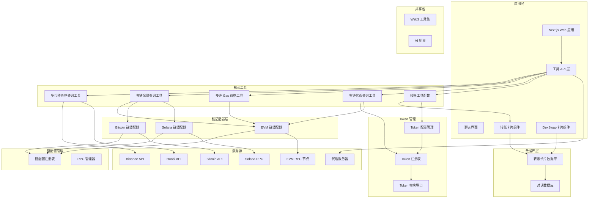

**图表来源**
- [README.md:26-38](file://README.md#L26-L38)
- [route.ts:1-50](file://apps/web/app/api/tools/route.ts#L1-L50)
- [chains/index.ts:1-7](file://packages/web3-tools/src/chains/index.ts#L1-L7)
- [tokens/index.ts:1-4](file://packages/web3-tools/src/tokens/index.ts#L1-L4)
- [TransferCard.tsx:1-441](file://apps/web/components/cards/TransferCard.tsx#L1-441)
- [DexSwapCard.tsx:1-33](file://apps/web/components/cards/DexSwapCard.tsx#L1-33)

## 核心组件

根据重构后的实现，Web3 AI Agent 的核心组件现在包括统一的多链支持架构、Token查询工具、转账工具和传统工具的增强版本：

### 1. 多链类型系统 (`types.ts`)
- **功能**: 提供统一的类型定义，支持 EVM 和非 EVM 链
- **支持链类型**: 
  - EVM 链: `ethereum`, `polygon`, `bsc`
  - 非 EVM 链: `bitcoin`, `solana`
- **统一数据结构**: `ChainConfig`, `BalanceData`, `GasData`, `TokenMetadata`
- **使用场景**: 为所有工具提供类型安全的接口定义

### 2. 链配置管理系统 (`chains/config.ts`)
- **功能**: 管理所有支持链的配置信息
- **支持链配置**: 
  - 以太坊: 主网 RPC、区块浏览器、链 ID
  - Polygon: Polygon RPC、区块浏览器、链 ID  
  - BSC: BSC RPC、区块浏览器、链 ID
- **配置特性**: 支持环境变量覆盖和默认 RPC 回退

### 3. EVM 链适配器 (`chains/evm-adapter.ts`)
- **功能**: 提供 EVM 兼容链的统一查询接口
- **支持功能**: 余额查询、Gas 价格查询、地址验证
- **数据来源**: 以太坊 RPC 节点
- **使用场景**: 以太坊、Polygon、BNB Smart Chain 等 EVM 链

### 4. Bitcoin 链适配器 (`chains/bitcoin.ts`)
- **功能**: 提供 Bitcoin 网络的余额查询接口
- **支持功能**: 余额查询、地址验证
- **数据来源**: Blockchain.info 和 Blockchair API
- **使用场景**: Bitcoin 主网余额查询

### 5. Solana 链适配器 (`chains/solana.ts`)
- **功能**: 提供 Solana 网络的余额查询接口
- **支持功能**: 余额查询、地址验证
- **数据来源**: Solana JSON-RPC API
- **使用场景**: Solana 主网余额查询

### 6. 增强的多币种价格查询工具 (`price.ts`)
- **功能**: 统一查询多种加密货币的实时价格数据，支持多数据源备份
- **支持币种**: ETH、BTC、SOL、MATIC、BNB
- **数据来源**: Binance API、Huobi API（自动切换）
- **使用场景**: 用户询问任何支持的加密货币当前价格时自动调用
- **输出格式**: 结构化但易懂的价格结果，包含 24 小时涨跌信息和货币单位

### 7. 增强的多链余额查询工具 (`balance.ts`)
- **功能**: 查询指定钱包地址在各链上的余额
- **支持链**: 以太坊、Polygon、BNB Smart Chain、Bitcoin、Solana
- **数据来源**: 各链对应的 RPC 节点或 API
- **使用场景**: 用户提供钱包地址查询余额时调用
- **输出格式**: 包含链信息、余额和数据来源说明的结果

### 8. 增强的多链 Gas 价格查询工具 (`gas.ts`)
- **功能**: 查询各 EVM 链的 Gas 价格
- **支持链**: 以太坊、Polygon、BNB Smart Chain
- **数据来源**: 以太坊 RPC 节点
- **使用场景**: 用户询问当前 Gas 价格时调用

### 9. Token 查询工具 (`token.ts`)
- **功能**: 查询指定链上 Token 的元数据信息
- **支持链**: 仅支持 EVM 链（以太坊、Polygon、BNB Smart Chain）
- **支持功能**: Token 符号查询、合约地址查询、元数据返回
- **数据来源**: 内置 Token 注册表
- **使用场景**: 用户查询特定 Token 的详细信息时调用
- **输出格式**: 包含链 ID、符号、名称、精度、合约地址和图标链接的结构化数据

### 10. Token 注册表系统 (`tokens/registry.ts`)
- **功能**: 管理所有支持的 Token 元数据信息
- **支持 Token**: 11个主流 Token（USDT、USDC、DAI、WETH、UNI、WMATIC、WBNB）
- **支持链**: 以太坊、Polygon、BNB Smart Chain
- **查询方式**: 支持按符号和合约地址两种方式查询
- **使用场景**: 为 Token 查询工具提供数据支持

### 11. 转账工具函数 (`transfer.ts`)
- **功能**: 提供链上转账的核心工具函数
- **支持功能**: Gas 估算、地址验证、区块链浏览器链接生成
- **支持链**: 以太坊、Polygon、BNB Smart Chain
- **使用场景**: 为转账卡片组件提供底层工具支持
- **输出格式**: 结构化的转账工具结果

### 12. 转账卡片组件 (`TransferCard.tsx`)
- **功能**: 提供可视化的转账界面和状态管理
- **支持功能**: ETH 原生转账、ERC20 Token 转账、状态跟踪、错误处理
- **支持链**: 以太坊、Polygon、BNB Smart Chain
- **使用场景**: 用户在聊天界面中进行链上转账操作
- **状态管理**: pending、signing、confirmed、failed

### 13. DexSwap 卡片组件 (`DexSwapCard.tsx`)
- **功能**: 提供 DEX 交换功能的预留组件
- **支持功能**: 交换卡片展示、未来功能扩展
- **使用场景**: 为未来的 DEX 交换功能做准备
- **状态管理**: 当前为占位符，预留开发空间

### 14. Token 配置管理 (`tokens.ts`)
- **功能**: 管理多链 Token 的配置信息
- **支持链**: 以太坊、Polygon、BNB Smart Chain
- **支持 Token**: USDT、USDC、DAI 等主流稳定币
- **配置特性**: 合约地址、精度、图标 URL、链上标识
- **使用场景**: 为转账和 Token 查询提供配置支持

### 15. 转账数据库访问 (`transfers.ts`)
- **功能**: 提供转账卡片的数据库 CRUD 操作
- **支持功能**: 创建、更新、查询转账卡片
- **数据模型**: TransferData 结构，包含转账信息和状态
- **使用场景**: 为转账卡片提供持久化存储支持
- **安全策略**: Row Level Security (RLS) 策略

**更新** 新增了完整的转账工具功能，包括转账工具函数、转账卡片组件、Token配置管理和转账数据库访问层，形成了从用户界面到数据库的完整转账生态系统。

## 架构概览

Web3 AI Agent 采用分层架构设计，从用户交互到工具调用再到结果回填的完整流程：

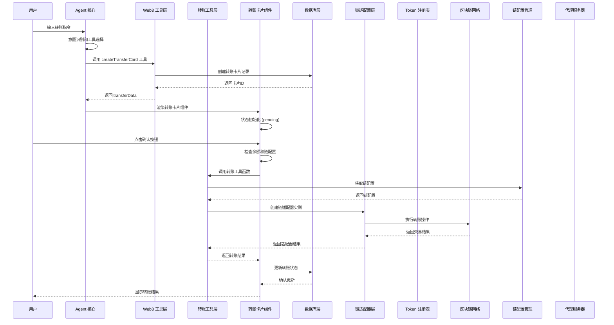

**图表来源**
- [route.ts:9-36](file://apps/web/app/api/tools/route.ts#L9-L36)
- [TransferCard.tsx:165-253](file://apps/web/components/cards/TransferCard.tsx#L165-L253)
- [transfers.ts:20-46](file://apps/web/lib/supabase/transfers.ts#L20-L46)
- [transfer.ts:14-79](file://packages/web3-tools/src/transfer.ts#L14-L79)

## 详细组件分析

### 多链类型系统实现

#### 统一的类型定义
多链类型系统提供了类型安全的接口定义，支持 EVM 和非 EVM 链：

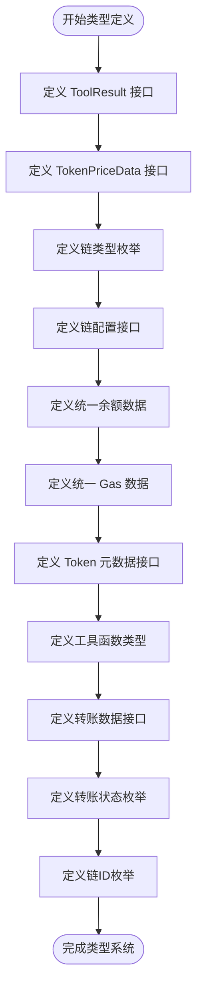

**图表来源**
- [types.ts:3-86](file://packages/web3-tools/src/types.ts#L3-L86)
- [transfer.ts:1-20](file://apps/web/types/transfer.ts#L1-L20)

#### API 接口设计
- **链 ID 类型**: `EvmChainId` 和 `NonEvmChainId` 枚举
- **链配置接口**: `EvmChainConfig` 和 `NonEvmChainConfig` 接口
- **统一数据结构**: `BalanceData`、`GasData`、`TokenMetadata`
- **工具函数类型**: `ToolFunction<TArgs, TResult>` 泛型接口
- **转账数据接口**: `TransferData` 包含转账相关信息
- **转账状态枚举**: `TransferStatus` 支持四种状态

**更新** 新增了完整的转账类型系统，支持转账卡片的状态管理和数据结构定义。

**章节来源**
- [types.ts:3-86](file://packages/web3-tools/src/types.ts#L3-L86)
- [transfer.ts:1-20](file://apps/web/types/transfer.ts#L1-L20)

### 链配置管理系统实现

#### 链配置注册表
链配置管理系统提供了集中化的链配置管理：

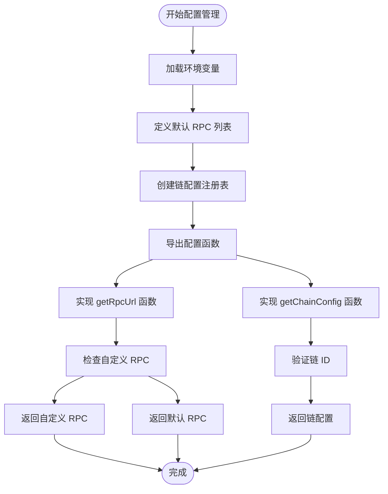

**图表来源**
- [chains/config.ts:22-81](file://packages/web3-tools/src/chains/config.ts#L22-L81)

#### API 接口设计
- **函数名称**: `getChainConfig(chainId: EvmChainId)`
- **输入参数**: `chainId` - EVM 链 ID（ethereum、polygon、bsc）
- **输出格式**: `ChainConfig` 接口对象
- **错误处理**: 不支持的链 ID 抛出错误

**更新** 新增了完整的链配置管理系统，支持环境变量覆盖和默认 RPC 回退机制。

**章节来源**
- [chains/config.ts:22-81](file://packages/web3-tools/src/chains/config.ts#L22-L81)

### EVM 链适配器实现

#### 增强的余额查询和 Gas 查询流程
EVM 链适配器提供了统一的 EVM 链操作接口：

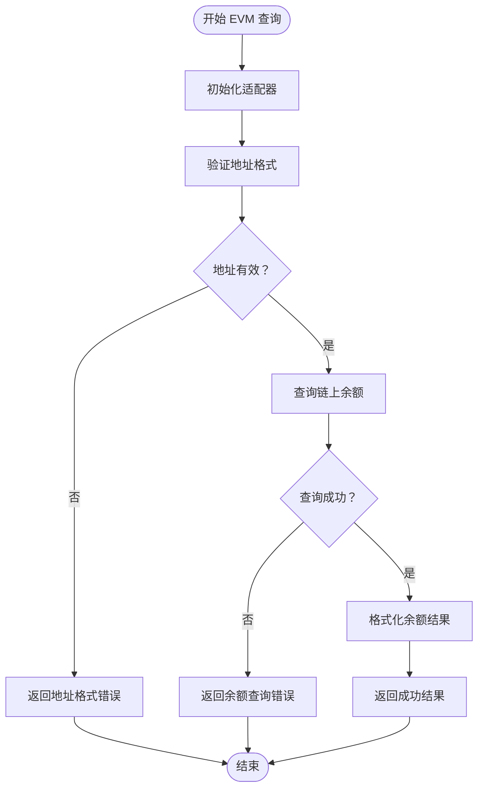

**图表来源**
- [chains/evm-adapter.ts:26-62](file://packages/web3-tools/src/chains/evm-adapter.ts#L26-L62)

#### API 接口设计
- **类名称**: `EvmChainAdapter`
- **构造函数**: `constructor(chainId: EvmChainId, customRpcUrl?: string)`
- **方法**:
  - `getBalance(address: string)`: 查询钱包余额
  - `getGasPrice()`: 获取 Gas 价格
  - `validateAddress(address: string)`: 验证地址格式
- **输出格式**: 统一的 `ToolResult<BalanceData>` 和 `ToolResult<GasData>`

**更新** 新增了完整的 EVM 链适配器，支持统一的余额查询、Gas 查询和地址验证功能。

**章节来源**
- [chains/evm-adapter.ts:11-112](file://packages/web3-tools/src/chains/evm-adapter.ts#L11-L112)

### Bitcoin 链适配器实现

#### 增强的地址验证和多 API 备份查询
Bitcoin 链适配器提供了可靠的 Bitcoin 网络查询接口：

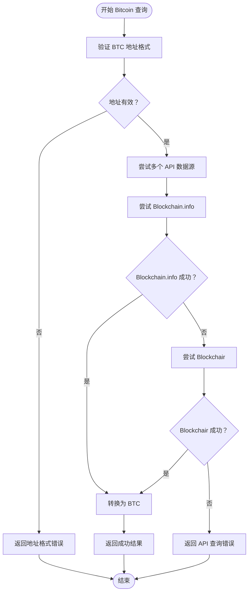

**图表来源**
- [chains/bitcoin.ts:84-123](file://packages/web3-tools/src/chains/bitcoin.ts#L84-L123)

#### API 接口设计
- **类名称**: `BitcoinAdapter`
- **方法**:
  - `getBalance(address: string)`: 查询 BTC 余额
  - `validateAddress(address: string)`: 验证 BTC 地址格式
- **输出格式**: `ToolResult<BalanceData>`
- **数据源**: Blockchain.info 和 Blockchair API（自动切换）

**更新** 新增了完整的 Bitcoin 链适配器，支持多 API 备份查询和代理服务器支持。

**章节来源**
- [chains/bitcoin.ts:18-125](file://packages/web3-tools/src/chains/bitcoin.ts#L18-L125)

### Solana 链适配器实现

#### 增强的 JSON-RPC 查询和地址验证
Solana 链适配器提供了高效的 Solana 网络查询接口：

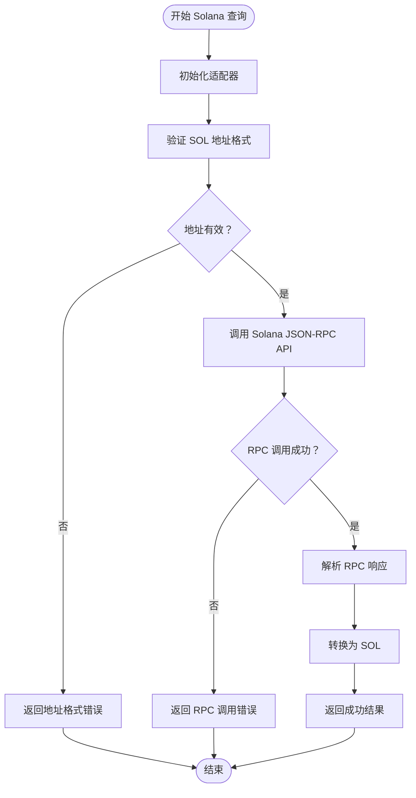

**图表来源**
- [chains/solana.ts:87-117](file://packages/web3-tools/src/chains/solana.ts#L87-L117)

#### API 接口设计
- **类名称**: `SolanaAdapter`
- **构造函数**: `constructor(rpcUrl?: string)`
- **方法**:
  - `getBalance(address: string)`: 查询 SOL 余额
  - `validateAddress(address: string)`: 验证 SOL 地址格式
- **输出格式**: `ToolResult<BalanceData>`
- **数据源**: Solana JSON-RPC API
- **配置**: 支持自定义 RPC URL

**更新** 新增了完整的 Solana 链适配器，支持 JSON-RPC 查询和代理服务器支持。

**章节来源**
- [chains/solana.ts:21-119](file://packages/web3-tools/src/chains/solana.ts#L21-L119)

### 增强的多币种价格查询工具实现

#### 统一的价格查询接口
多币种价格查询工具采用统一的 getTokenPrice 函数，支持五种主要加密货币：

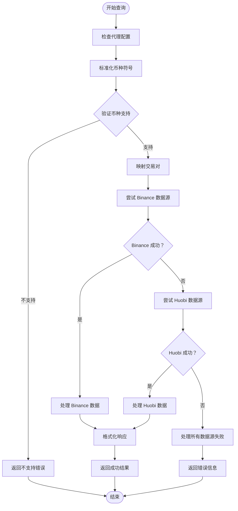

**图表来源**
- [price.ts:30-110](file://packages/web3-tools/src/price.ts#L30-L110)

#### API 接口设计
- **函数名称**: `getTokenPrice(symbol: string)`
- **输入参数**: `symbol` - 加密货币符号（ETH、BTC、SOL、MATIC、BNB）
- **输出格式**: 
  - 成功: `{success: boolean, data: {symbol: string, price: number, change24h: number, currency: string}, timestamp: string, source: string}`
  - 失败: `{success: boolean, error: string, timestamp: string, source: string}`
- **错误码**: 
  - 1001: 不支持的币种
  - 1002: 所有数据源都不可用
  - 1003: API 调用失败
  - 1004: 数据解析失败

#### 增强的数据源接入方式
- **主要数据源**: Binance API（实时价格，USD 计价）
- **备用数据源**: Huobi API（包含 24 小时涨跌信息，USD 计价）
- **数据格式**: JSON 格式，包含价格、24小时变化百分比、货币单位
- **更新频率**: 实时更新，支持自动切换失效数据源

**更新** 新增了 Huobi API 作为备用数据源，提供更丰富的 24 小时涨跌信息，同时保持了原有的代理服务器支持。

**章节来源**
- [price.ts:30-110](file://packages/web3-tools/src/price.ts#L30-L110)
- [test-phase1.ts:7-40](file://packages/web3-tools/test-phase1.ts#L7-L40)

### 增强的多链余额查询工具实现

#### 统一的多链余额查询流程
多链余额查询工具提供了统一的跨链余额查询接口：

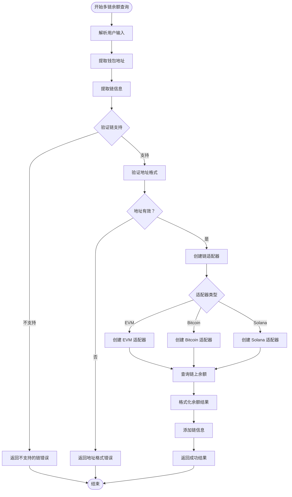

**图表来源**
- [chains/evm-adapter.ts:26-62](file://packages/web3-tools/src/chains/evm-adapter.ts#L26-L62)
- [chains/bitcoin.ts:30-68](file://packages/web3-tools/src/chains/bitcoin.ts#L30-L68)
- [chains/solana.ts:33-71](file://packages/web3-tools/src/chains/solana.ts#L33-L71)

#### API 接口设计
- **函数名称**: `getBalance(chain: ChainId, address: string)`
- **输入参数**: 
  - `chain`: 链 ID（ethereum、polygon、bsc、bitcoin、solana）
  - `address`: 钱包地址（必需）
- **输出格式**: 
  - 成功: `{success: boolean, data: {chain: ChainId, address: string, balance: string, unit: string, decimals: number}, timestamp: string, source: string}`
  - 失败: `{success: boolean, error: string, timestamp: string, source: string}`
- **错误码**: 
  - 2001: 地址格式无效
  - 2002: 地址校验失败
  - 2003: RPC 连接失败
  - 2004: 区块链查询超时
  - 2005: 地址为空
  - 2006: 不支持的链类型

#### 增强的数据源接入方式
- **EVM 链**: 以太坊 RPC 节点（支持自定义配置）
- **Bitcoin**: Blockchain.info 和 Blockchair API（多源备份）
- **Solana**: Solana JSON-RPC API（支持自定义 RPC）
- **数据格式**: 统一的 `BalanceData` 结构
- **缓存策略**: 15 秒缓存，支持手动刷新

**更新** 新增了完整的多链余额查询功能，支持以太坊、Polygon、BNB Smart Chain、Bitcoin 和 Solana 等多个链的余额查询。

**章节来源**
- [chains/evm-adapter.ts:26-62](file://packages/web3-tools/src/chains/evm-adapter.ts#L26-L62)
- [chains/bitcoin.ts:30-68](file://packages/web3-tools/src/chains/bitcoin.ts#L30-L68)
- [chains/solana.ts:33-71](file://packages/web3-tools/src/chains/solana.ts#L33-L71)

### 增强的多链 Gas 价格查询工具实现

#### 统一的多链 Gas 查询流程
多链 Gas 价格查询工具提供了统一的跨链 Gas 价格查询接口：

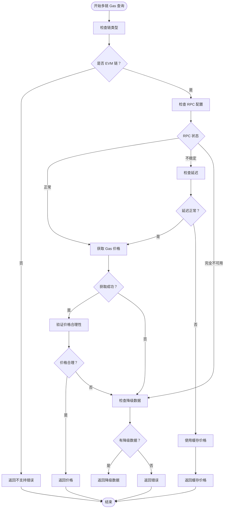

**图表来源**
- [chains/evm-adapter.ts:68-97](file://packages/web3-tools/src/chains/evm-adapter.ts#L68-L97)

#### API 接口设计
- **函数名称**: `getGasPrice(chain: EvmChainId, rpcUrl?: string)`
- **输入参数**: 
  - `chain`: EVM 链 ID（ethereum、polygon、bsc）
  - `rpcUrl`: RPC 节点地址（可选，默认使用公共节点）
- **输出格式**: 
  - 成功: `{success: boolean, data: {chain: EvmChainId, gasPrice: string | null, maxFeePerGas: string | null, maxPriorityFeePerGas: string | null, unit: string}, timestamp: string, source: string}`
  - 失败: `{success: boolean, error: string, timestamp: string, source: string}`
- **错误码**: 
  - 3001: RPC 状态未知
  - 3002: Gas 价格获取失败
  - 3003: 网络延迟过高
  - 3004: 缓存数据过期
  - 3005: 非 EVM 链不支持 Gas 查询

#### 增强的数据源接入方式
- **主要数据源**: 以太坊 RPC 节点（支持自定义配置）
- **备用数据源**: 公共 Gas 价格服务
- **数据格式**: 统一的 `GasData` 结构
- **更新策略**: 实时更新，支持智能缓存

**更新** 新增了完整的多链 Gas 价格查询功能，目前支持以太坊、Polygon 和 BNB Smart Chain 的 Gas 价格查询。

**章节来源**
- [chains/evm-adapter.ts:68-97](file://packages/web3-tools/src/chains/evm-adapter.ts#L68-L97)

### Token 查询工具实现

#### Token 元数据查询流程
Token 查询工具提供了统一的跨链 Token 元数据查询接口：

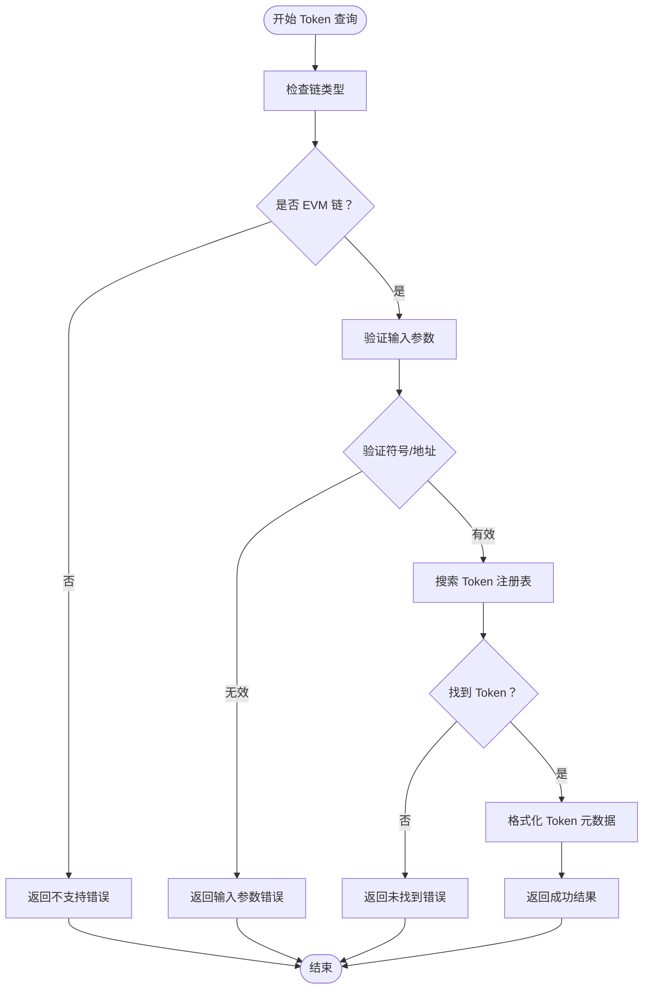

**图表来源**
- [token.ts:10-57](file://packages/web3-tools/src/token.ts#L10-L57)
- [tokens/registry.ts:110-135](file://packages/web3-tools/src/tokens/registry.ts#L110-L135)

#### API 接口设计
- **函数名称**: `getTokenInfo(chain: ChainId, symbolOrAddress: string)`
- **输入参数**: 
  - `chain`: 链 ID（仅支持 EVM 链：ethereum、polygon、bsc）
  - `symbolOrAddress`: Token 符号或合约地址
- **输出格式**: 
  - 成功: `{success: boolean, data: {chain: EvmChainId, symbol: string, name: string, decimals: number, contractAddress: string, logoUri?: string}, timestamp: string, source: string}`
  - 失败: `{success: boolean, error: string, timestamp: string, source: string}`
- **错误码**: 
  - 4001: 不支持的链类型（非 EVM 链）
  - 4002: 未找到 Token
  - 4003: 查询 Token 信息失败

#### Token 注册表管理
- **Token 数量**: 11个主流 Token
- **支持链**: 以太坊、Polygon、BNB Smart Chain
- **Token 列表**: USDT、USDC、DAI、WETH、UNI、WMATIC、WBNB
- **查询方式**: 支持按符号和合约地址两种查询方式
- **数据格式**: 标准化的 TokenMetadata 结构

**更新** 新增了完整的 Token 查询工具和 Token 注册表系统，支持11个主流Token的元数据查询，扩展了多链支持架构的功能范围。

**章节来源**
- [token.ts:10-57](file://packages/web3-tools/src/token.ts#L10-L57)
- [tokens/registry.ts:15-102](file://packages/web3-tools/src/tokens/registry.ts#L15-L102)
- [tokens/registry.ts:110-135](file://packages/web3-tools/src/tokens/registry.ts#L110-L135)

### 转账工具函数实现

#### Gas 估算和转账执行流程
转账工具函数提供了链上转账的核心功能：

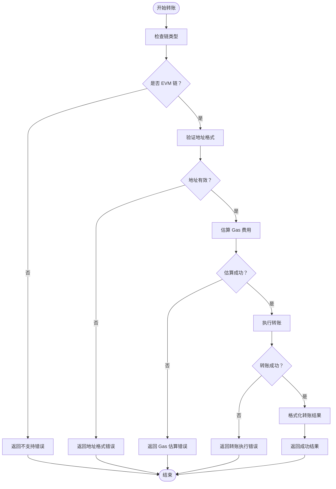

**图表来源**
- [transfer.ts:14-79](file://packages/web3-tools/src/transfer.ts#L14-L79)

#### API 接口设计
- **函数名称**: `estimateTransferGas(chain: EvmChainId, from: string, to: string, amount: string, tokenAddress?: string)`
- **输入参数**: 
  - `chain`: EVM 链 ID（ethereum、polygon、bsc）
  - `from`: 发送地址
  - `to`: 接收地址
  - `amount`: 转账金额
  - `tokenAddress`: ERC20 合约地址（可选）
- **输出格式**: 
  - 成功: `{success: boolean, data: {gasEstimate: string, feeInETH: string}, timestamp: string, source: string}`
  - 失败: `{success: boolean, error: string, timestamp: string, source: string}`
- **错误码**: 
  - 5001: 不支持的链
  - 5002: Gas 估算失败
  - 5003: RPC 连接失败

#### 增强的功能特性
- **Gas 估算**: 支持 ETH 原生转账和 ERC20 Token 转账的 Gas 估算
- **地址验证**: 使用正则表达式验证以太坊地址格式
- **区块链浏览器**: 生成链上交易的浏览器链接
- **错误处理**: 完善的异常捕获和错误信息返回
- **数据格式**: 统一的 ToolResult 结构

**更新** 新增了完整的转账工具函数，支持 Gas 估算、地址验证和区块链浏览器链接生成，为转账卡片组件提供底层技术支持。

**章节来源**
- [transfer.ts:14-79](file://packages/web3-tools/src/transfer.ts#L14-L79)

### 转账卡片组件实现

#### 转账卡片状态管理和用户交互流程
转账卡片组件提供了完整的用户交互体验：

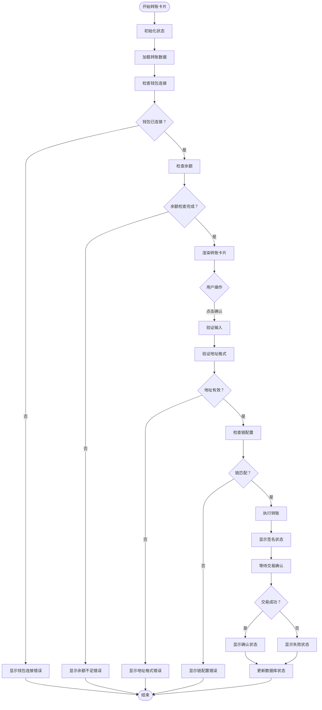

**图表来源**
- [TransferCard.tsx:77-441](file://apps/web/components/cards/TransferCard.tsx#L77-L441)

#### 组件架构设计
- **状态管理**: 使用 React Hooks 管理转账状态和错误信息
- **钱包集成**: 集成 wagmi hooks 支持多种钱包
- **余额检查**: 实时检查用户余额和 Gas 费用
- **错误处理**: 完善的错误分类和用户友好的错误提示
- **状态跟踪**: 支持 pending、signing、confirmed、failed 四种状态
- **数据库同步**: 自动同步转账状态到 Supabase 数据库

#### 核心功能特性
- **ETH 原生转账**: 支持原生 ETH 转账
- **ERC20 Token 转账**: 支持 USDT、USDC 等稳定币转账
- **链配置**: 支持以太坊、Polygon、BNB Smart Chain
- **地址验证**: 使用 viem 库验证地址格式
- **余额检查**: 实时检查余额和 Gas 费用
- **交易监控**: 自动监控交易确认状态
- **错误恢复**: 支持失败后的重试机制

**更新** 新增了完整的转账卡片组件，支持 ETH 原生转账和 ERC20 Token 转账，提供完整的用户交互体验和状态管理。

**章节来源**
- [TransferCard.tsx:77-441](file://apps/web/components/cards/TransferCard.tsx#L77-L441)

### Token 配置管理实现

#### 多链 Token 配置管理
Token 配置管理提供了完整的多链 Token 信息管理：

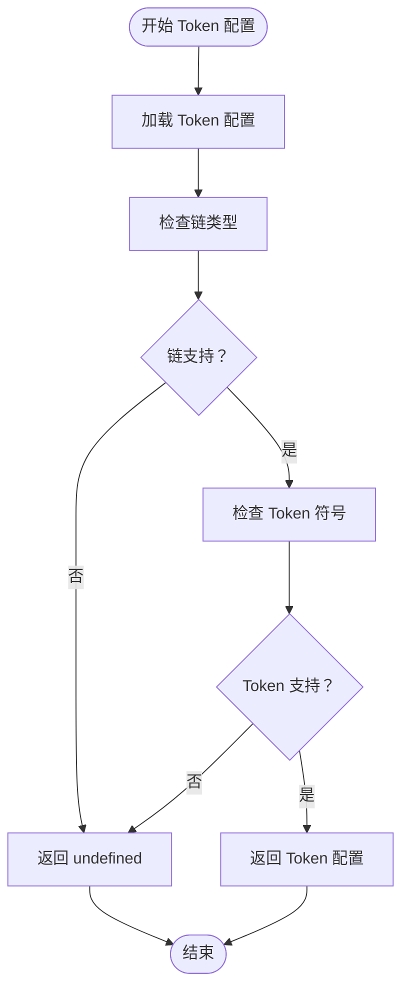

**图表来源**
- [tokens.ts:76-85](file://apps/web/lib/tokens.ts#L76-L85)

#### 配置数据结构
- **TokenConfig 接口**: 包含符号、名称、合约地址、精度、图标 URL
- **ChainTokens 接口**: 支持多链的 Token 配置映射
- **支持链**: 以太坊、Polygon、BNB Smart Chain
- **支持 Token**: USDT、USDC、DAI 等主流稳定币
- **配置特性**: 链上标识、精度管理、图标资源

#### API 接口设计
- **函数名称**: `getTokenConfig(chain: string, symbol: string)`
- **输入参数**: `chain` - 链 ID，`symbol` - Token 符号
- **输出格式**: `TokenConfig` 对象或 `undefined`
- **辅助函数**: `isNativeToken(symbol: string)` 判断是否为原生币

**更新** 新增了完整的 Token 配置管理系统，支持多链 Token 配置和原生币识别，为转账和 Token 查询提供配置支持。

**章节来源**
- [tokens.ts:1-85](file://apps/web/lib/tokens.ts#L1-L85)

### 转账数据库访问实现

#### 转账卡片数据持久化流程
转账数据库访问层提供了完整的数据持久化支持：

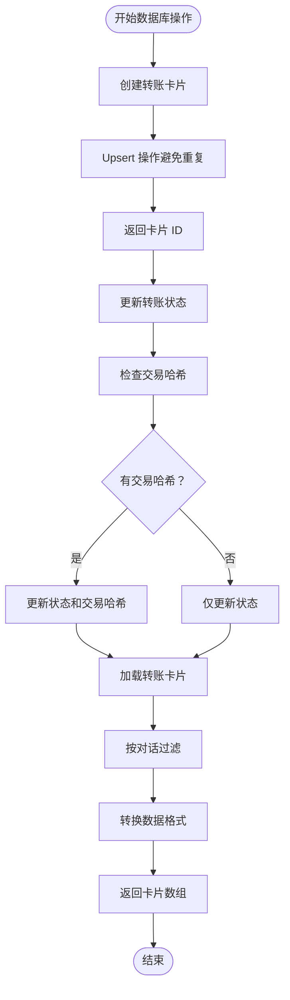

**图表来源**
- [transfers.ts:20-142](file://apps/web/lib/supabase/transfers.ts#L20-L142)

#### 数据库操作接口
- **创建转账卡片**: `createTransferCard(params: CreateTransferCardParams) -> Promise<string>`
- **更新转账状态**: `updateTransferCardStatus(cardId: string, status: TransferStatus, txHash?: string, errorMessage?: string) -> Promise<void>`
- **加载转账卡片**: `loadTransferCards(conversationId: string) -> Promise<TransferData[]>`
- **查找转账卡片**: `findTransferCardByMessageId(conversationId: string, messageId: string) -> Promise<TransferData | null>`

#### 数据库设计特性
- **表结构**: transfer_cards 表支持 UUID 主键和 TEXT 消息 ID
- **索引优化**: 为 conversation_id 和 message_id 创建索引
- **安全策略**: Row Level Security (RLS) 策略保护用户数据
- **触发器**: 自动更新 updated_at 字段
- **数据类型**: 使用 TEXT 存储金额避免精度丢失

**更新** 新增了完整的转账数据库访问层，支持转账卡片的创建、更新、查询和删除操作，提供完整的数据持久化支持。

**章节来源**
- [transfers.ts:1-142](file://apps/web/lib/supabase/transfers.ts#L1-L142)

## 依赖分析

Web3 工具的依赖关系和协作机制如下：

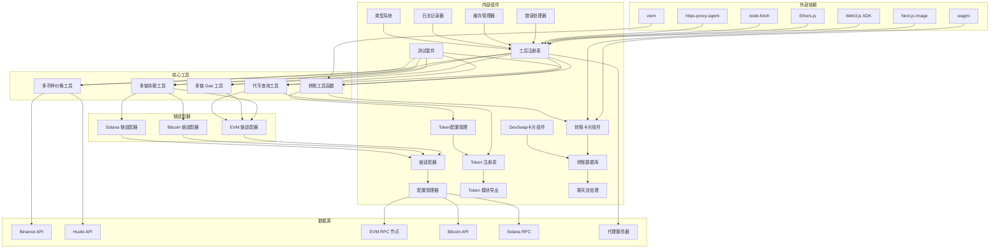

**图表来源**
- [README.md:18-25](file://README.md#L18-L25)
- [route.ts:1-3](file://apps/web/app/api/tools/route.ts#L1-L3)
- [chains/index.ts:1-7](file://packages/web3-tools/src/chains/index.ts#L1-L7)
- [tokens/index.ts:1-4](file://packages/web3-tools/src/tokens/index.ts#L1-L4)
- [TransferCard.tsx:3-8](file://apps/web/components/cards/TransferCard.tsx#L3-L8)
- [transfers.ts:3-4](file://apps/web/lib/supabase/transfers.ts#L3-L4)

### 组件耦合度分析
- **低耦合设计**: 每个工具都有独立的适配器层
- **接口标准化**: 统一的工具接口规范
- **错误隔离**: 各工具错误处理相互独立
- **可扩展性**: 支持新工具的无缝集成
- **环境适应性**: 支持代理服务器和自定义配置
- **测试完整性**: 包含完整的单元测试套件
- **类型安全**: 完整的 TypeScript 类型定义
- **配置集中化**: 统一的链配置管理
- **数据管理分离**: Token 元数据独立管理
- **状态管理**: 转账卡片组件独立的状态管理
- **数据库抽象**: 数据库操作通过专门的服务层封装
- **聊天集成**: 转账卡片与聊天系统的深度集成

**更新** 新增了完整的转账生态系统，包括转账卡片组件、转账工具函数、Token配置管理和转账数据库访问层，形成了从用户界面到数据库的完整转账闭环。

**章节来源**
- [README.md:18-25](file://README.md#L18-L25)
- [route.ts:1-3](file://apps/web/app/api/tools/route.ts#L1-L3)
- [chains/index.ts:1-7](file://packages/web3-tools/src/chains/index.ts#L1-L7)
- [tokens/index.ts:1-4](file://packages/web3-tools/src/tokens/index.ts#L1-L4)

## 性能考虑

### 增强的缓存策略
1. **价格数据缓存**: 15 秒 TTL，支持手动刷新
2. **余额数据缓存**: 15 秒 TTL，支持批量查询
3. **Gas 价格缓存**: 15 秒 TTL，支持智能更新
4. **代理缓存**: 代理配置缓存，减少重复初始化
5. **链配置缓存**: 链配置缓存，避免重复加载
6. **Token 元数据缓存**: Token 信息缓存，减少重复查询
7. **转账状态缓存**: 转账卡片状态缓存，支持实时更新

### 改进的并发控制
- **最大并发数**: 5 个并发请求
- **队列管理**: FIFO 队列，支持优先级排序
- **超时控制**: 10 秒超时，支持重试机制
- **代理超时**: 15 秒代理超时，避免阻塞
- **转账并发**: 支持多个转账操作的并发处理

### 增强的错误恢复
- **自动重试**: 最多重试 3 次
- **降级策略**: 缓存数据优先，网络数据兜底
- **熔断机制**: 连续失败超过阈值时启用熔断
- **代理回退**: 代理失败时自动回退到直连
- **多源备份**: 支持多个数据源的自动切换
- **Token 查询优化**: Token 注册表内存缓存，快速查询
- **转账错误处理**: 完善的转账错误分类和用户提示

### 转账性能优化
- **状态预加载**: 转账卡片初始化时预加载必要状态
- **余额实时检查**: 使用 wagmi hooks 实现实时余额检查
- **Gas 估算缓存**: Gas 估算结果缓存，减少重复计算
- **数据库批量操作**: 支持批量更新转账状态
- **图像资源优化**: Token 图标使用 Next.js Image 优化加载

**更新** 新增了完整的转账性能优化策略，包括状态缓存、实时余额检查、Gas 估算优化和数据库批量操作，显著提升了转账体验的响应速度。

## 故障排除指南

### 常见问题及解决方案

#### 1. 工具参数无效
**症状**: 返回参数验证错误
**解决方案**: 
- 检查输入参数格式
- 验证必填字段完整性
- 确认参数类型正确性

#### 2. 工具执行失败
**症状**: 工具调用抛出异常
**解决方案**:
- 查看错误日志获取详细信息
- 检查网络连接状态
- 验证 API 密钥有效性

#### 3. 外部 API 超时
**症状**: 请求超时或响应缓慢
**解决方案**:
- 检查 API 服务状态
- 调整超时参数
- 启用降级模式

#### 4. 用户提问超出能力边界
**症状**: 系统无法理解或处理请求
**解决方案**:
- 返回能力边界说明
- 提供相关工具列表
- 引导用户使用正确指令

#### 5. 代理服务器连接失败
**症状**: 代理配置无效或连接超时
**解决方案**:
- 检查 `HTTPS_PROXY` 或 `HTTP_PROXY` 环境变量
- 验证代理服务器可用性
- 确认代理认证设置

#### 6. RPC 节点连接失败
**症状**: 无法连接到以太坊网络
**解决方案**:
- 检查 `ETHEREUM_RPC_URL` 环境变量
- 验证 RPC 节点可用性
- 使用默认公共节点进行测试

#### 7. 不支持的币种
**症状**: 返回不支持的币种错误
**解决方案**:
- 检查币种符号是否正确
- 确认币种是否在支持列表中
- 使用正确的币种标识符

#### 8. 不支持的链类型
**症状**: 返回不支持的链类型错误
**解决方案**:
- 检查链 ID 是否正确
- 确认链类型是否在支持列表中
- 使用正确的链标识符

#### 9. 地址格式无效
**症状**: 返回地址格式错误
**解决方案**:
- 检查地址格式是否符合链要求
- 确认地址长度和字符集
- 使用有效的钱包地址

#### 10. 链配置加载失败
**症状**: 返回链配置错误
**解决方案**:
- 检查链 ID 是否正确
- 验证链配置是否存在
- 确认环境变量设置

#### 11. Token 查询失败
**症状**: 返回 Token 查询错误
**解决方案**:
- 检查链 ID 是否为 EVM 链
- 验证 Token 符号或合约地址格式
- 确认 Token 是否在注册表中
- 检查网络连接状态

#### 12. Token 注册表访问失败
**症状**: Token 查询工具无法访问注册表
**解决方案**:
- 检查 Token 模块导入路径
- 验证 Token 注册表文件存在性
- 确认模块导出配置正确

#### 13. 转账卡片渲染错误
**症状**: 转账卡片组件无法正确渲染
**解决方案**:
- 检查 TransferData 数据格式
- 验证 conversationId 参数
- 确认 Supabase 连接状态
- 检查 Token 配置是否正确

#### 14. 转账执行失败
**症状**: 转账卡片无法执行转账
**解决方案**:
- 检查钱包连接状态
- 验证地址格式和链配置
- 确认余额是否充足
- 检查网络错误和用户拒绝
- 验证 ERC20 approve 状态

#### 15. 数据库操作失败
**症状**: 转账状态更新或查询失败
**解决方案**:
- 检查 Supabase 连接配置
- 验证 RLS 策略设置
- 确认表结构和索引
- 检查权限和认证设置

#### 16. 聊天流传输错误
**症状**: 转账数据无法通过 SSE 传输
**解决方案**:
- 检查 SSE 事件类型
- 验证 transfer_data 事件处理
- 确认 useChatStream 配置
- 检查前端状态同步机制

**更新** 新增了转账相关的故障排除指南，包括转账卡片渲染、转账执行、数据库操作和聊天流传输等常见问题的解决方案。

**章节来源**
- [Web3-AI-Agent-PRD-MVP.md:192-196](file://docs/Web3-AI-Agent-PRD-MVP.md#L192-L196)
- [route.ts:29-36](file://apps/web/app/api/tools/route.ts#L29-L36)
- [chains/config.ts:54-60](file://packages/web3-tools/src/chains/config.ts#L54-L60)
- [token.ts:14-22](file://packages/web3-tools/src/token.ts#L14-L22)
- [TransferCard.tsx:255-279](file://apps/web/components/cards/TransferCard.tsx#L255-L279)
- [transfers.ts:75-78](file://apps/web/lib/supabase/transfers.ts#L75-L78)

## 结论

Web3 AI Agent 的核心 Web3 工具实现了以下关键特性：

1. **模块化设计**: 每个工具都有独立的功能和接口
2. **多链支持**: 完整的链适配器架构，支持 EVM 和非 EVM 链
3. **统一类型系统**: 类型安全的接口定义，支持多链操作
4. **链配置管理**: 集中的链配置管理，支持环境变量覆盖
5. **多币种支持**: 统一的 getTokenPrice 函数支持五种主要加密货币
6. **Token 管理**: 完整的 Token 注册表系统，支持11个主流Token的元数据查询
7. **转账功能**: 完整的转账生态系统，支持 ETH 原生转账和 ERC20 Token 转账
8. **数据库持久化**: 转账卡片的完整数据持久化支持
9. **用户界面**: 直观的转账卡片组件，支持完整的用户交互
10. **状态管理**: 完善的转账状态跟踪和错误处理机制
11. **聊天集成**: 转账功能与聊天系统的深度集成
12. **健壮的错误处理**: 完善的异常捕获和降级机制
13. **高性能架构**: 缓存策略和并发控制确保响应速度
14. **可扩展性**: 支持新工具的无缝集成和现有工具的扩展
15. **环境适应性**: 支持代理服务器和自定义配置
16. **多数据源备份**: 确保服务的高可用性
17. **向后兼容性**: 保持原有 API 的兼容性
18. **全面测试**: 包含完整的单元测试套件

**更新** 本次重构显著增强了系统的功能性和可靠性，通过多链支持架构、统一类型系统、Token 注册表、转账工具函数、转账卡片组件和数据库持久化，形成了完整的 Web3 转账生态系统，为构建可信的 Web3 AI Agent 奠定了更加坚实的基础。

这些工具为构建可信的 Web3 AI Agent 奠定了坚实基础，支持从简单的多币种价格查询到复杂的多链数据交互、Token 元数据查询和链上转账等各种使用场景。

## 附录

### 使用场景演示

#### 场景 1：查询 ETH 价格
用户输入："ETH 现在价格是多少？"
期望结果：返回 ETH 当前价格、货币单位、24小时涨跌百分比和数据来源

#### 场景 2：查询 BTC 价格
用户输入："BTC 现在价格是多少？"
期望结果：返回 BTC 当前价格、货币单位、24小时涨跌百分比和数据来源

#### 场景 3：查询 SOL 价格
用户输入："SOL 现在价格是多少？"
期望结果：返回 SOL 当前价格、货币单位、24小时涨跌百分比和数据来源

#### 场景 4：查询 MATIC 价格
用户输入："MATIC 现在价格是多少？"
期望结果：返回 MATIC 当前价格、货币单位、24小时涨跌百分比和数据来源

#### 场景 5：查询 BNB 价格
用户输入："BNB 现在价格是多少？"
期望结果：返回 BNB 当前价格、货币单位、24小时涨跌百分比和数据来源

#### 场景 6：查询以太坊地址余额
用户输入："帮我查一下这个以太坊地址的 ETH 余额：0x..."
期望结果：返回指定地址的 ETH 余额、链 ID、查询时间和数据来源

#### 场景 7：查询 Polygon 地址余额
用户输入："帮我查一下这个 Polygon 地址的 MATIC 余额：0x..."
期望结果：返回指定地址的 MATIC 余额、链 ID、查询时间和数据来源

#### 场景 8：查询 Bitcoin 地址余额
用户输入："帮我查一下这个 Bitcoin 地址的 BTC 余额：1..."
期望结果：返回指定地址的 BTC 余额、链 ID、查询时间和数据来源

#### 场景 9：查询 Solana 地址余额
用户输入："帮我查一下这个 Solana 地址的 SOL 余额：..."
期望结果：返回指定地址的 SOL 余额、链 ID、查询时间和数据来源

#### 场景 10：查询以太坊 Gas 价格
用户输入："现在以太坊网络的 Gas 价格是多少？"
期望结果：返回当前网络的 Gas 价格、链 ID、查询时间和数据来源

#### 场景 11：查询 USDT Token 元数据
用户输入："ETH 链上的 USDT Token 详细信息是什么？"
期望结果：返回 USDT 的符号、名称、精度、合约地址和图标链接

#### 场景 12：查询 WETH 合约地址
用户输入："Polygon 链上 WETH 的合约地址是什么？"
期望结果：返回 WETH 在 Polygon 链上的合约地址

#### 场景 13：执行 ETH 转账
用户输入："转 0.01 ETH 到 0x..."
期望结果：在聊天界面中显示转账卡片，用户确认后执行转账并在链上确认

#### 场景 14：执行 ERC20 Token 转账
用户输入："转 100 USDT 到 0x..."
期望结果：在聊天界面中显示转账卡片，用户确认后执行 ERC20 转账并在链上确认

#### 场景 15：多轮跟进
用户先问价格，再问："如果是我刚才那个地址呢？"
期望结果：系统保留对话上下文，在合理范围内复用已有信息

#### 场景 16：代理环境配置
用户部署在受限网络环境中
期望结果：系统自动检测代理配置并使用代理服务器访问数据源

### 配置参数说明

#### 环境变量
- `ETHEREUM_RPC_URL`: 以太坊 RPC 服务地址
- `POLYGON_RPC_URL`: Polygon RPC 服务地址
- `BSC_RPC_URL`: BSC RPC 服务地址
- `SOLANA_RPC_URL`: Solana RPC 服务地址
- `HTTPS_PROXY`: HTTPS 代理服务器地址
- `HTTP_PROXY`: HTTP 代理服务器地址
- `CACHE_TTL`: 缓存过期时间（秒）
- `MAX_CONCURRENT`: 最大并发请求数

#### 工具配置
- `getTokenPrice(symbol: string)`: 支持多币种、多数据源备份和代理配置
- `getBalance(chain: ChainId, address: string)`: 支持多链余额查询，包括 EVM 和非 EVM 链
- `getGasPrice(chain: EvmChainId, rpcUrl?: string)`: 支持多链 Gas 价格查询，目前支持 EVM 链
- `getTokenInfo(chain: ChainId, symbolOrAddress: string)`: 支持 EVM 链 Token 元数据查询
- `estimateTransferGas(chain: EvmChainId, from: string, to: string, amount: string, tokenAddress?: string)`: 支持转账 Gas 估算
- `validateAddress(address: string)`: 支持地址格式验证
- `getExplorerUrl(chain: EvmChainId, txHash: string)`: 支持区块链浏览器链接生成

#### 转账配置
- `TransferCard`: 支持 ETH 原生转账和 ERC20 Token 转账
- `DexSwapCard`: 预留 DEX 交换功能
- `TokenConfig`: 支持多链 Token 配置管理
- `TransferData`: 支持转账卡片数据持久化

**更新** 新增了转账相关的配置参数说明，包括转账工具函数、转账卡片组件和 Token 配置管理等新功能的配置选项。

### 支持的链和币种列表

#### 支持的链类型

| 链 ID | 链名称 | 链类型 | 原生代币 | 支持功能 |
|-------|--------|--------|----------|----------|
| ethereum | 以太坊 | EVM | ETH | 余额查询、Gas 查询、地址验证、Token 查询、转账功能 |
| polygon | Polygon | EVM | MATIC | 余额查询、Gas 查询、地址验证、Token 查询、转账功能 |
| bsc | BNB Smart Chain | EVM | BNB | 余额查询、Gas 查询、地址验证、Token 查询、转账功能 |
| bitcoin | Bitcoin | 非 EVM | BTC | 余额查询、地址验证 |
| solana | Solana | 非 EVM | SOL | 余额查询、地址验证 |

#### 支持的币种列表

| 币种符号 | 完整名称 | 交易对标识 |
|---------|---------|-----------|
| ETH | 以太坊 | ETHUSDT |
| BTC | 比特币 | BTCUSDT |
| SOL | Solana | SOLUSDT |
| MATIC | Polygon | MATICUSDT |
| BNB | BNB | BNBUSDT |

#### 支持的 Token 列表

| 链 ID | Token 符号 | Token 名称 | 合约地址 |
|-------|------------|------------|----------|
| ethereum | USDT | Tether USD | 0xdac17f958d2ee523a2206206994597c13d831ec7 |
| ethereum | USDC | USD Coin | 0xa0b86991c6218b36c1d19d4a2e9eb0ce3606eb48 |
| ethereum | DAI | Dai Stablecoin | 0x6b175474e89094c44da98b954eedeac495271d0f |
| polygon | USDT | Tether USD (Polygon) | 0xc2132d05d31c914a87c6611c10748aeb04b58e8f |
| polygon | USDC | USD Coin (Polygon) | 0x3c499c542cef5e3811e1192ce70d8cc03d5c3359 |
| bsc | USDT | Tether USD (BSC) | 0x55d398326f99059ff775485246999027b3197955 |
| bsc | USDC | USD Coin (BSC) | 0x8ac76a51cc950d9822d68b83fe1ad97b32cd580d |

#### 支持的转账状态

| 状态 | 描述 | 用户界面显示 |
|------|------|-------------|
| pending | 待确认 | 灰色圆点 + "待确认" |
| signing | 签名中 | 蓝色圆点 + "签名中" |
| confirmed | 已确认 | 绿色圆点 + "已确认" |
| failed | 失败 | 红色圆点 + "失败" |

#### 支持的转账链

| 链 ID | 链名称 | 原生代币 | 支持的 Token |
|-------|--------|----------|-------------|
| ethereum | 以太坊 | ETH | USDT、USDC、DAI |
| polygon | Polygon | MATIC | USDT、USDC |
| bsc | BNB Smart Chain | BNB | USDT、USDC |

**更新** 新增了完整的转账支持列表，包括支持的转账状态、转账链和转账 Token，反映了重构后的转账功能和类型系统。