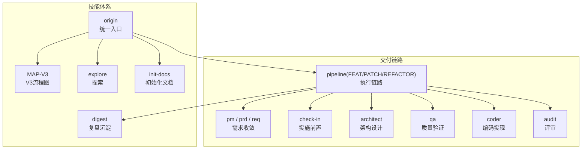
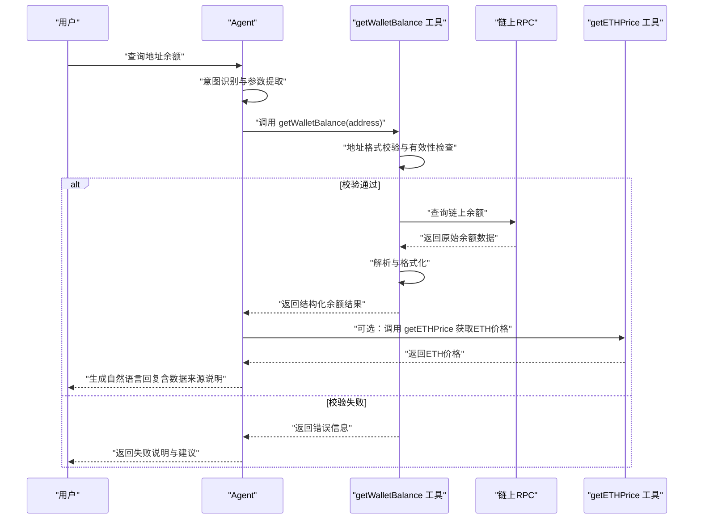
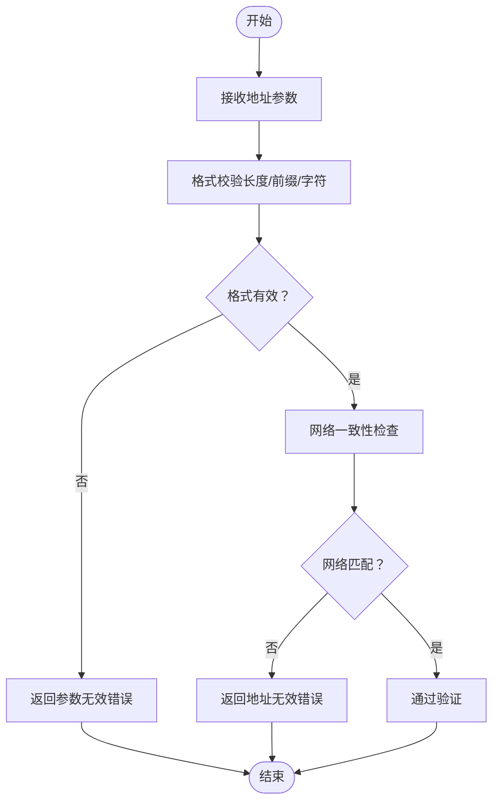
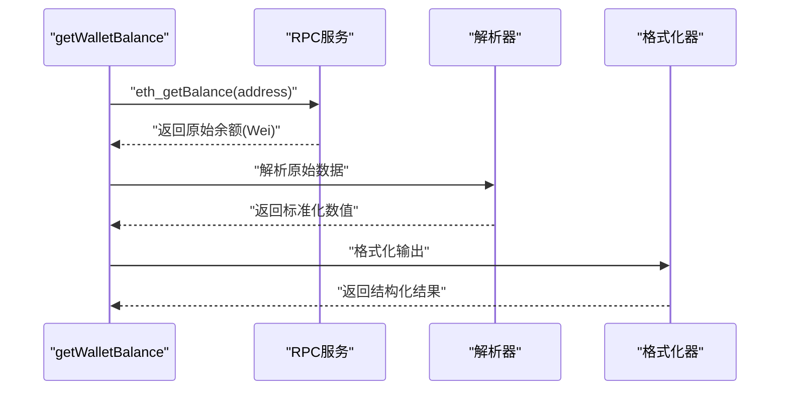
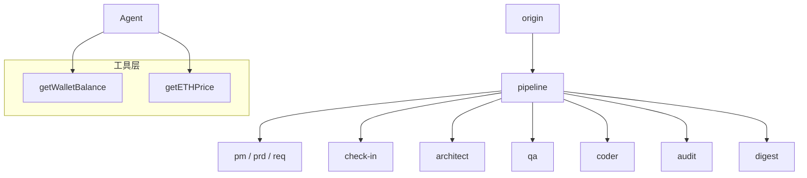

# 钱包余额查询工具

<cite>
**本文引用的文件**
- [Web3-AI-Agent-PRD-MVP.md](file://docs/Web3-AI-Agent-PRD-MVP.md)
- [WEB3-AI-AGENT-使用教程-V1.md](file://docs/WEB3-AI-AGENT-使用教程-V1.md)
- [SKILL.md](file://skills/web3-ai-agent/SKILL.md)
- [MAP-V3.md](file://skills/web3-ai-agent/MAP-V3.md)
- [origin SKILL.md](file://skills/web3-ai-agent/origin/SKILL.md)
- [explore SKILL.md](file://skills/web3-ai-agent/explore/SKILL.md)
- [init-docs SKILL.md](file://skills/web3-ai-agent/init-docs/SKILL.md)
- [digest SKILL.md](file://skills/web3-ai-agent/digest/SKILL.md)
- [按周拆解的学习资料清单.md](file://docs/按周拆解的学习资料清单.md)
</cite>

## 目录
1. [简介](#简介)
2. [项目结构](#项目结构)
3. [核心组件](#核心组件)
4. [架构概览](#架构概览)
5. [详细组件分析](#详细组件分析)
6. [依赖分析](#依赖分析)
7. [性能考虑](#性能考虑)
8. [故障排除指南](#故障排除指南)
9. [结论](#结论)
10. [附录](#附录)

## 简介
本文件为钱包余额查询工具（getWalletBalance）的全面技术实现文档。围绕地址验证机制、余额获取流程、API接口设计、错误处理策略、数据来源与准确性保障、与ETH价格工具的协作关系等方面进行系统阐述，并提供面向开发者的集成与使用指导。

## 项目结构
该项目采用“技能（skill）”体系组织，统一入口为 origin，根据任务类型路由至不同子技能或执行链路。钱包余额查询工具属于Web3工具集合的一部分，与价格查询工具共同构成MVP阶段的核心能力。

**图表来源**
- [SKILL.md:1-224](file://skills/web3-ai-agent/SKILL.md#L1-L224)
- [MAP-V3.md:1-166](file://skills/web3-ai-agent/MAP-V3.md#L1-L166)

**章节来源**
- [SKILL.md:1-224](file://skills/web3-ai-agent/SKILL.md#L1-L224)
- [MAP-V3.md:1-166](file://skills/web3-ai-agent/MAP-V3.md#L1-L166)

## 核心组件
- getWalletBalance 工具：负责接收钱包地址参数，进行格式与有效性校验，调用链上RPC查询余额，解析并格式化结果，同时处理异常与错误码。
- getETHPrice 工具：提供ETH价格查询能力，与余额查询工具协同，为用户提供价格对比与价值评估。
- Agent 主流程：识别用户意图，判断是否需要调用Web3工具，整合工具结果生成自然语言回复，并保留会话上下文。
- 错误处理与降级：在参数无效、RPC调用失败、超时等场景下，返回可理解的失败说明与保守建议。
- 风险控制与免责声明：对高风险问题（如投资建议）进行风险提示，强调数据来源与免责声明。

**章节来源**
- [Web3-AI-Agent-PRD-MVP.md:94-96](file://docs/Web3-AI-Agent-PRD-MVP.md#L94-L96)
- [Web3-AI-Agent-PRD-MVP.md:143-156](file://docs/Web3-AI-Agent-PRD-MVP.md#L143-L156)
- [Web3-AI-Agent-PRD-MVP.md:159-171](file://docs/Web3-AI-Agent-PRD-MVP.md#L159-L171)

## 架构概览
钱包余额查询工具在Agent系统中的调用路径如下：

**图表来源**
- [Web3-AI-Agent-PRD-MVP.md:54-62](file://docs/Web3-AI-Agent-PRD-MVP.md#L54-L62)
- [Web3-AI-Agent-PRD-MVP.md:94-96](file://docs/Web3-AI-Agent-PRD-MVP.md#L94-L96)

## 详细组件分析

### 地址验证机制
- 地址格式校验：确保输入为有效的以太坊钱包地址格式（如以0x开头的42字符十六进制字符串），并进行大小写兼容处理。
- 有效性检查：通过哈希校验或网络特定规则进一步确认地址的有效性，避免无效或恶意输入。
- 错误处理策略：对格式不符、长度异常、字符非法等情况返回明确的错误码与提示信息；对空地址或未识别地址返回“参数无效”。

**图表来源**
- [Web3-AI-Agent-PRD-MVP.md:143-156](file://docs/Web3-AI-Agent-PRD-MVP.md#L143-L156)

**章节来源**
- [Web3-AI-Agent-PRD-MVP.md:143-156](file://docs/Web3-AI-Agent-PRD-MVP.md#L143-L156)

### 余额获取流程
- 链上数据查询：调用以太坊RPC接口（如eth_getBalance）查询指定地址的ETH余额。
- RPC调用：封装HTTP请求，设置合理的超时与重试策略，处理网络异常与服务不可达情况。
- 数据解析：将返回的Wei单位余额转换为ETH单位（如保留适当小数位），并进行数值范围与精度校验。
- 结果格式化：输出结构化的余额对象，包含地址、余额数值、单位、数据来源与时间戳等字段。

**图表来源**
- [Web3-AI-Agent-PRD-MVP.md:143-156](file://docs/Web3-AI-Agent-PRD-MVP.md#L143-L156)

**章节来源**
- [Web3-AI-Agent-PRD-MVP.md:143-156](file://docs/Web3-AI-Agent-PRD-MVP.md#L143-L156)

### API接口设计
- 地址参数验证：必填，格式为以0x开头的42字符十六进制字符串；支持大小写混合。
- 返回值结构：包含地址、余额数值、单位、数据来源、查询时间等字段；错误时返回错误码与原因。
- 错误码定义：
  - 参数无效：输入格式不符或为空
  - 地址无效：地址不在当前网络或无法识别
  - RPC调用失败：网络异常、服务不可达、超时
  - 解析失败：返回数据格式异常或数值异常
- 数据类型规范：地址为字符串，余额为数值型（支持科学计数法），单位为ETH，时间戳为ISO 8601格式。

**章节来源**
- [Web3-AI-Agent-PRD-MVP.md:143-156](file://docs/Web3-AI-Agent-PRD-MVP.md#L143-L156)

### 代码示例与使用方法
以下示例展示getWalletBalance工具的典型使用路径（以路径引用代替具体代码内容）：
- 参数传递：通过Agent意图识别提取地址参数，调用getWalletBalance(address)。
- 异步处理：在Agent主循环中以非阻塞方式等待工具返回，结合流式输出提升用户体验。
- 结果处理：将余额结果与ETH价格对比，生成自然语言回复；若失败则返回失败说明与建议。
- 异常捕获：捕获参数无效、RPC失败、解析异常等，分别映射到相应错误码与提示。

**章节来源**
- [WEB3-AI-AGENT-使用教程-V1.md:108-126](file://docs/WEB3-AI-AGENT-使用教程-V1.md#L108-L126)
- [Web3-AI-Agent-PRD-MVP.md:174-197](file://docs/Web3-AI-Agent-PRD-MVP.md#L174-L197)

### 数据来源说明、准确性保证与延迟处理
- 数据来源说明：明确标注余额数据来自链上查询，避免模型主观生成；在回复中体现“数据来自工具查询，而非模型主观生成”。
- 准确性保证：通过网络一致性检查与数值范围校验减少异常数据影响；对极小额余额保留适当精度。
- 延迟处理机制：设置RPC请求超时阈值与指数退避重试；在Agent侧采用流式输出与进度提示缓解等待感。

**章节来源**
- [Web3-AI-Agent-PRD-MVP.md:143-156](file://docs/Web3-AI-Agent-PRD-MVP.md#L143-L156)
- [Web3-AI-Agent-PRD-MVP.md:159-171](file://docs/Web3-AI-Agent-PRD-MVP.md#L159-L171)

### 与ETH价格工具的协作关系与数据对比
- 协作关系：余额查询完成后，Agent可根据用户意图选择调用getETHPrice获取ETH价格，实现余额与价格的对比展示。
- 数据对比功能：将ETH余额与当前价格相乘得到USD价值，提供更直观的资产概览；在高风险问题上提供保守建议与免责声明。

**章节来源**
- [Web3-AI-Agent-PRD-MVP.md:44-53](file://docs/Web3-AI-Agent-PRD-MVP.md#L44-L53)
- [Web3-AI-Agent-PRD-MVP.md:54-62](file://docs/Web3-AI-Agent-PRD-MVP.md#L54-L62)
- [按周拆解的学习资料清单.md:40](file://docs/按周拆解的学习资料清单.md#L40)

## 依赖分析
钱包余额查询工具在技能体系中的依赖关系如下：

**图表来源**
- [SKILL.md:92-158](file://skills/web3-ai-agent/SKILL.md#L92-L158)
- [MAP-V3.md:104-131](file://skills/web3-ai-agent/MAP-V3.md#L104-L131)

**章节来源**
- [SKILL.md:92-158](file://skills/web3-ai-agent/SKILL.md#L92-L158)
- [MAP-V3.md:104-131](file://skills/web3-ai-agent/MAP-V3.md#L104-L131)

## 性能考虑
- RPC调用优化：批量查询与缓存策略（针对频繁查询的地址）可降低延迟；对热点地址设置短期缓存。
- 错误恢复：指数退避重试与熔断保护，避免雪崩效应；对超时与失败进行快速失败与降级处理。
- 输出优化：采用流式输出与进度提示，改善用户体验；对大额数值进行千分位与单位缩写展示。

## 故障排除指南
- 参数无效：检查地址格式是否正确（0x前缀、42字符、十六进制），确认大小写兼容。
- 地址无效：确认地址在网络中有效且可识别；检查网络配置与链ID一致性。
- RPC调用失败：检查网络连通性、RPC节点可用性与超时设置；查看错误日志与重试次数。
- 解析失败：核对返回数据格式与数值范围；对异常值进行兜底处理与告警。

**章节来源**
- [Web3-AI-Agent-PRD-MVP.md:185-197](file://docs/Web3-AI-Agent-PRD-MVP.md#L185-L197)

## 结论
钱包余额查询工具通过严格的地址验证、稳健的链上查询与解析、清晰的错误处理与风险控制，为Agent提供了可靠的Web3数据服务能力。配合ETH价格工具，实现了余额与价值的综合展示，满足MVP阶段的核心使用场景与风险边界要求。

## 附录
- 技能体系入口与流程：统一从origin进入，按任务类型路由至探索、初始化、交付链路或验证治理。
- 推荐使用方式：通过自然语言或斜杠命令触发，遵循V3流程推进，确保check-in前置与质量门禁。

**章节来源**
- [SKILL.md:168-224](file://skills/web3-ai-agent/SKILL.md#L168-L224)
- [WEB3-AI-AGENT-使用教程-V1.md:423-454](file://docs/WEB3-AI-AGENT-使用教程-V1.md#L423-L454)