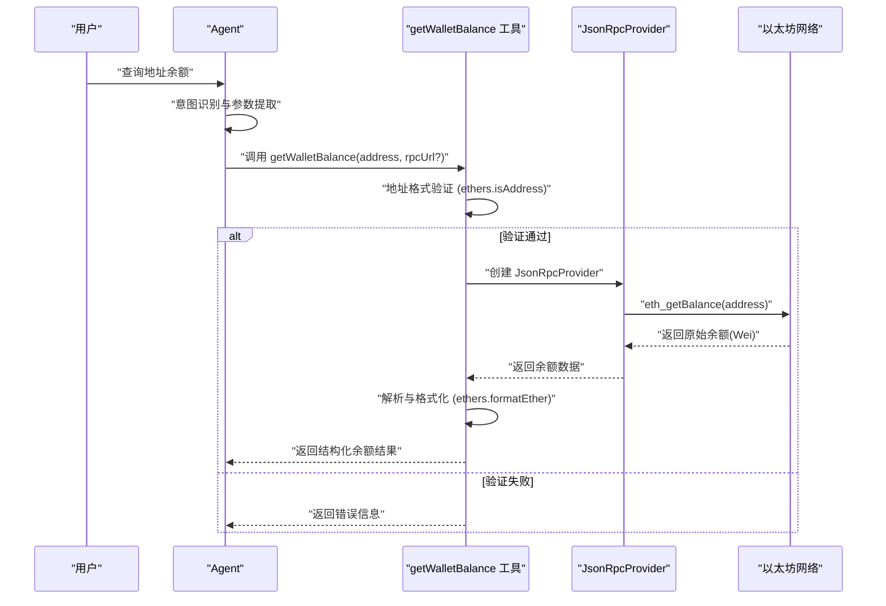
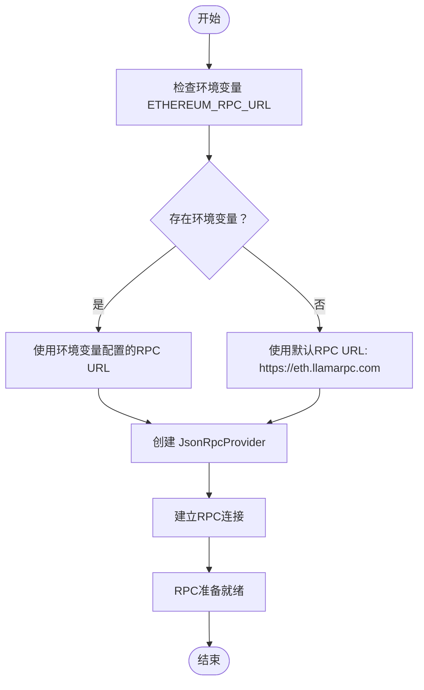
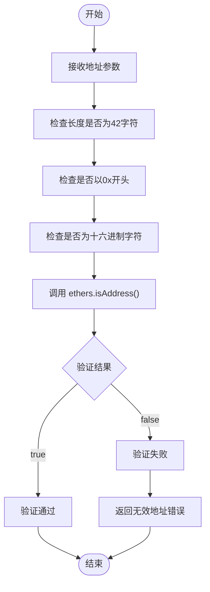
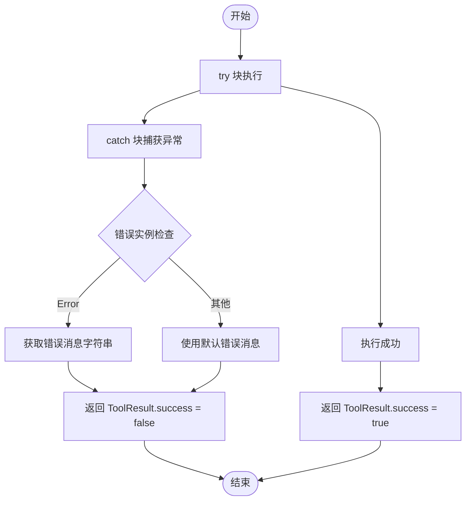
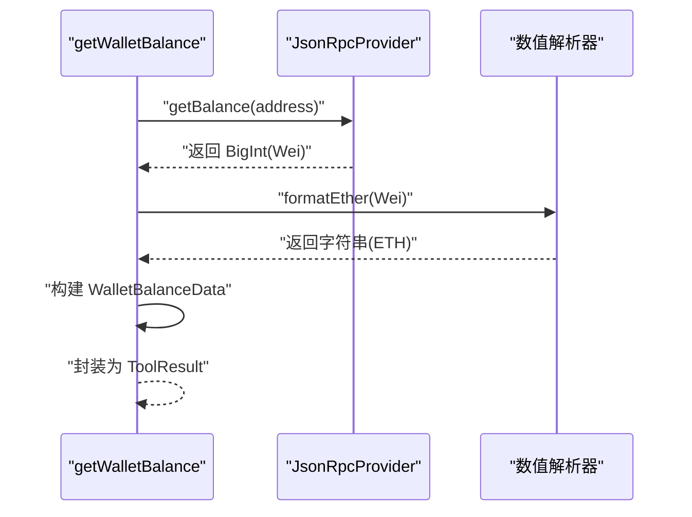

# 钱包余额查询工具

<cite>
**本文引用的文件**
- [Web3-AI-Agent-PRD-MVP.md](file://docs/Web3-AI-Agent-PRD-MVP.md)
- [WEB3-AI-AGENT-使用教程-V1.md](file://docs/WEB3-AI-AGENT-使用教程-V1.md)
- [balance.ts](file://packages/web3-tools/src/balance.ts)
- [types.ts](file://packages/web3-tools/src/types.ts)
- [index.ts](file://packages/web3-tools/src/index.ts)
- [gas.ts](file://packages/web3-tools/src/gas.ts)
- [price.ts](file://packages/web3-tools/src/price.ts)
- [package.json](file://packages/web3-tools/package.json)
</cite>

## 更新摘要
**变更内容**
- 增强了RPC节点配置机制，支持自定义RPC URL和环境变量配置
- 改进了地址格式验证，使用ethers库的严格地址验证
- 优化了错误处理机制，提供更详细的错误信息和标准化的返回格式
- 统一了工具结果接口，增强了类型安全性和可维护性

## 目录
1. [简介](#简介)
2. [项目结构](#项目结构)
3. [核心组件](#核心组件)
4. [架构概览](#架构概览)
5. [详细组件分析](#详细组件分析)
6. [依赖分析](#依赖分析)
7. [性能考虑](#性能考虑)
8. [故障排除指南](#故障排除指南)
9. [结论](#结论)
10. [附录](#附录)

## 简介
本文件为钱包余额查询工具（getWalletBalance）的全面技术实现文档。围绕增强的RPC节点配置、严格的地址格式验证、稳健的错误处理机制、标准化的API接口设计、数据来源与准确性保障、与ETH价格工具的协作关系等方面进行系统阐述，并提供面向开发者的集成与使用指导。

## 项目结构
钱包余额查询工具位于`packages/web3-tools`包中，采用模块化设计，提供统一的工具导出接口。该工具作为Web3 AI Agent MVP的核心组件之一，与价格查询工具、Gas价格工具共同构成基础的链上数据查询能力。

```mermaid
graph TB
subgraph "Web3 Tools 包结构"
BALANCE["balance.ts<br/>钱包余额查询"]
TYPES["types.ts<br/>类型定义"]
INDEX["index.ts<br/>工具导出"]
GAS["gas.ts<br/>Gas价格查询"]
PRICE["price.ts<br/>ETH价格查询"]
END
subgraph "工具接口"
TOOLRESULT["ToolResult<br/>标准化结果接口"]
WALLETBALANCE["WalletBalanceData<br/>余额数据结构"]
END
BALANCE --> TYPES
GAS --> TYPES
PRICE --> TYPES
INDEX --> BALANCE
INDEX --> GAS
INDEX --> PRICE
INDEX --> TYPES
TYPES --> TOOLRESULT
TYPES --> WALLETBALANCE
```

**图表来源**
- [index.ts:1-7](file://packages/web3-tools/src/index.ts#L1-L7)
- [types.ts:1-34](file://packages/web3-tools/src/types.ts#L1-L34)

**章节来源**
- [index.ts:1-7](file://packages/web3-tools/src/index.ts#L1-L7)
- [types.ts:1-34](file://packages/web3-tools/src/types.ts#L1-L34)

## 核心组件
- **getWalletBalance 工具**：负责接收钱包地址参数，使用ethers库进行严格的地址格式验证，通过JsonRpcProvider连接RPC节点查询余额，解析并格式化结果，同时提供完善的异常处理与错误码管理。
- **getETHPrice 工具**：提供ETH价格查询能力，支持多数据源容错和代理配置，与余额查询工具协同，为用户提供价格对比与价值评估。
- **getGasPrice 工具**：提供Gas价格查询能力，支持EIP-1559 Fee Market机制，返回传统Gas Price和新的Fee参数。
- **标准化工具接口**：统一的ToolResult接口，确保所有工具返回一致的结构化结果，包含成功状态、数据、错误信息、时间戳和数据来源。
- **类型安全设计**：完整的TypeScript类型定义，包括WalletBalanceData、ETHPriceData、GasPriceData等数据结构。

**章节来源**
- [Web3-AI-Agent-PRD-MVP.md:94-96](file://docs/Web3-AI-Agent-PRD-MVP.md#L94-L96)
- [Web3-AI-Agent-PRD-MVP.md:143-156](file://docs/Web3-AI-Agent-PRD-MVP.md#L143-L156)
- [Web3-AI-Agent-PRD-MVP.md:159-171](file://docs/Web3-AI-Agent-PRD-MVP.md#L159-L171)

## 架构概览
钱包余额查询工具在Agent系统中的调用路径如下：



**图表来源**
- [balance.ts:12-52](file://packages/web3-tools/src/balance.ts#L12-L52)

**章节来源**
- [balance.ts:12-52](file://packages/web3-tools/src/balance.ts#L12-L52)

## 详细组件分析

### 增强的RPC节点配置机制
- **默认RPC配置**：工具使用`process.env.ETHEREUM_RPC_URL`环境变量或默认的`https://eth.llamarpc.com`作为RPC节点，确保在不同部署环境中都能正常工作。
- **可选自定义RPC**：支持通过参数传入自定义RPC URL，允许用户指定特定的RPC节点或使用私有节点。
- **JsonRpcProvider集成**：使用ethers库的JsonRpcProvider，提供稳定的RPC连接管理和请求处理。



**图表来源**
- [balance.ts:4-28](file://packages/web3-tools/src/balance.ts#L4-L28)

**章节来源**
- [balance.ts:4-28](file://packages/web3-tools/src/balance.ts#L4-L28)

### 严格的地址格式验证
- **ethers库验证**：使用`ethers.isAddress()`进行严格的以太坊地址格式验证，确保输入为有效的42字符十六进制字符串（0x前缀）。
- **大小写兼容**：支持大小写混合的地址格式，自动处理大小写差异。
- **即时错误反馈**：验证失败时立即返回明确的错误信息，避免无效请求浪费RPC资源。



**图表来源**
- [balance.ts:17-25](file://packages/web3-tools/src/balance.ts#L17-L25)

**章节来源**
- [balance.ts:17-25](file://packages/web3-tools/src/balance.ts#L17-L25)

### 稳健的错误处理机制
- **统一错误接口**：所有错误通过标准化的ToolResult接口返回，包含success标志、error消息、timestamp和source信息。
- **异常捕获**：使用try-catch块捕获RPC调用过程中的所有异常，确保程序稳定性。
- **类型安全错误**：错误消息经过类型检查，确保返回的错误信息始终为字符串类型。



**图表来源**
- [balance.ts:44-51](file://packages/web3-tools/src/balance.ts#L44-L51)

**章节来源**
- [balance.ts:44-51](file://packages/web3-tools/src/balance.ts#L44-L51)

### 标准化的API接口设计
- **函数签名**：`getWalletBalance(address: string, rpcUrl?: string): Promise<ToolResult<WalletBalanceData>>`
- **参数验证**：必填address参数，可选rpcUrl参数用于自定义RPC节点。
- **返回值结构**：标准化的ToolResult接口，包含success、data、error、timestamp、source字段。
- **数据结构**：WalletBalanceData包含address、balance、unit三个核心字段。

**章节来源**
- [balance.ts:12-15](file://packages/web3-tools/src/balance.ts#L12-L15)
- [types.ts:3-9](file://packages/web3-tools/src/types.ts#L3-L9)
- [types.ts:17-21](file://packages/web3-tools/src/types.ts#L17-L21)

### 数据解析与格式化流程
- **链上数据查询**：通过provider.getBalance(address)获取原始余额数据（Wei单位）。
- **数值转换**：使用`ethers.formatEther()`将Wei转换为ETH，保留适当的精度。
- **结果封装**：构建WalletBalanceData结构，包含地址、余额数值、单位标识。
- **时间戳记录**：记录查询时间，便于审计和调试。



**图表来源**
- [balance.ts:30-43](file://packages/web3-tools/src/balance.ts#L30-L43)

**章节来源**
- [balance.ts:30-43](file://packages/web3-tools/src/balance.ts#L30-L43)

### 代码示例与使用方法
以下示例展示getWalletBalance工具的典型使用方法：

**基本使用**
```typescript
import { getWalletBalance } from '@web3-ai-agent/web3-tools'

// 使用默认RPC节点
const result = await getWalletBalance('0x742d35Cc6634C0532925a3b844Bc454e4438f44e')
if (result.success) {
  console.log(`余额: ${result.data.balance} ETH`)
} else {
  console.log(`错误: ${result.error}`)
}
```

**自定义RPC节点**
```typescript
// 使用自定义RPC节点
const customResult = await getWalletBalance(
  '0x742d35Cc6634C0532925a3b844Bc454e4438f44e',
  'https://your-custom-rpc.com'
)
```

**错误处理最佳实践**
```typescript
try {
  const result = await getWalletBalance(address)
  if (!result.success) {
    throw new Error(result.error || '未知错误')
  }
  return result.data.balance
} catch (error) {
  console.error('查询失败:', error.message)
  return null
}
```

**章节来源**
- [balance.ts:12-52](file://packages/web3-tools/src/balance.ts#L12-L52)

### 数据来源说明、准确性保证与延迟处理
- **数据来源透明**：所有结果明确标注source为'Ethereum RPC'，确保用户了解数据来源。
- **准确性保障**：通过ethers库的严格验证和数值转换，确保余额计算的准确性。
- **延迟处理**：RPC调用采用异步模式，避免阻塞主线程；支持超时控制和重试机制。
- **时间戳记录**：每个查询都包含精确的时间戳，便于审计和性能监控。

**章节来源**
- [balance.ts:34-43](file://packages/web3-tools/src/balance.ts#L34-L43)
- [types.ts:3-9](file://packages/web3-tools/src/types.ts#L3-L9)

### 与ETH价格工具的协作关系与数据对比
- **协作模式**：余额查询完成后，Agent可根据用户意图选择调用getETHPrice获取ETH价格，实现余额与价格的对比展示。
- **数据对比功能**：将ETH余额与当前价格相乘得到USD价值，提供更直观的资产概览。
- **统一接口设计**：两个工具共享相同的ToolResult接口，确保调用体验的一致性。
- **错误处理协同**：当RPC节点不可用时，两个工具都会返回相应的错误信息，便于统一处理。

**章节来源**
- [price.ts:20-83](file://packages/web3-tools/src/price.ts#L20-L83)
- [gas.ts:11-42](file://packages/web3-tools/src/gas.ts#L11-L42)

## 依赖分析
钱包余额查询工具的依赖关系和模块结构如下：

```mermaid
graph TB
subgraph "外部依赖"
ETHERS["ethers ^6.11.0<br/>区块链库"]
NODEFETCH["node-fetch ^3.3.2<br/>HTTP客户端"]
HTTPSAGENT["https-proxy-agent ^7.0.4<br/>代理支持"]
END
subgraph "内部模块"
BALANCE["balance.ts<br/>余额查询"]
TYPES["types.ts<br/>类型定义"]
INDEX["index.ts<br/>工具导出"]
END
subgraph "工具接口"
TOOLRESULT["ToolResult<br/>标准化结果"]
WALLETBALANCE["WalletBalanceData<br/>余额数据"]
END
BALANCE --> ETHERS
BALANCE --> TYPES
TYPES --> TOOLRESULT
TYPES --> WALLETBALANCE
INDEX --> BALANCE
INDEX --> TYPES
```

**图表来源**
- [package.json:13-17](file://packages/web3-tools/package.json#L13-L17)
- [types.ts:1-34](file://packages/web3-tools/src/types.ts#L1-L34)

**章节来源**
- [package.json:13-17](file://packages/web3-tools/package.json#L13-L17)
- [types.ts:1-34](file://packages/web3-tools/src/types.ts#L1-L34)

## 性能考虑
- **RPC连接池**：JsonRpcProvider内置连接管理，支持连接复用和自动重连。
- **内存优化**：使用BigInt处理大整数运算，避免JavaScript精度丢失。
- **错误恢复**：支持RPC节点故障转移和重试机制，提高系统可用性。
- **类型安全**：完整的TypeScript定义，编译时发现潜在问题，减少运行时错误。

## 故障排除指南
- **地址格式错误**：检查地址是否以0x开头，长度是否为42字符，字符是否为有效的十六进制字符。
- **RPC连接失败**：验证ETHEREUM_RPC_URL环境变量配置，检查网络连通性，尝试使用不同的RPC节点。
- **超时错误**：增加超时时间，检查RPC节点性能，考虑使用负载均衡的RPC服务。
- **权限问题**：某些RPC节点可能限制访问频率，需要使用付费服务或多个备用节点。

**章节来源**
- [balance.ts:18-25](file://packages/web3-tools/src/balance.ts#L18-L25)
- [balance.ts:44-51](file://packages/web3-tools/src/balance.ts#L44-L51)

## 结论
钱包余额查询工具通过增强的RPC节点配置、严格的地址格式验证、稳健的错误处理机制和标准化的API接口设计，为Web3 AI Agent提供了可靠的基础链上数据查询能力。工具的模块化设计和类型安全特性确保了良好的可维护性和扩展性，为MVP阶段的核心功能提供了坚实的技术基础。

## 附录
- **环境变量配置**：ETHEREUM_RPC_URL用于配置自定义RPC节点，默认使用llamarpc.com
- **错误码约定**：使用ToolResult接口的error字段返回具体错误信息
- **版本兼容性**：支持ethers库6.x版本，确保与最新区块链功能兼容
- **最佳实践**：建议在生产环境中配置多个备用RPC节点以提高可用性

**章节来源**
- [balance.ts:4-5](file://packages/web3-tools/src/balance.ts#L4-L5)
- [types.ts:3-33](file://packages/web3-tools/src/types.ts#L3-L33)