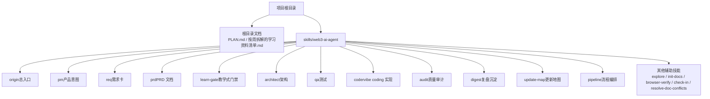
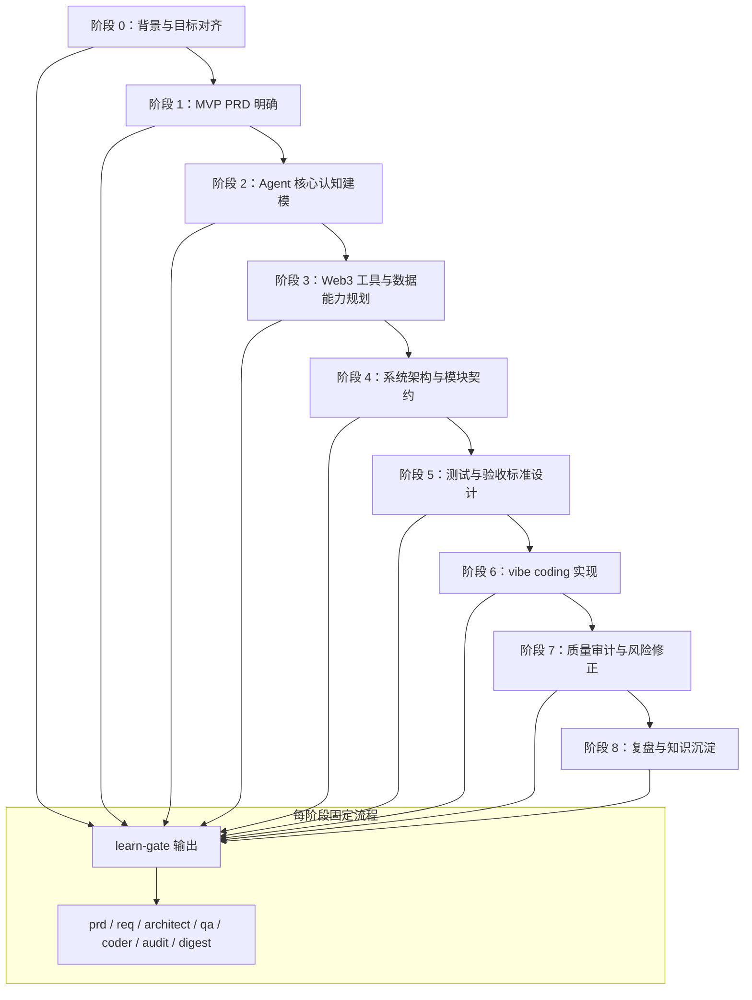
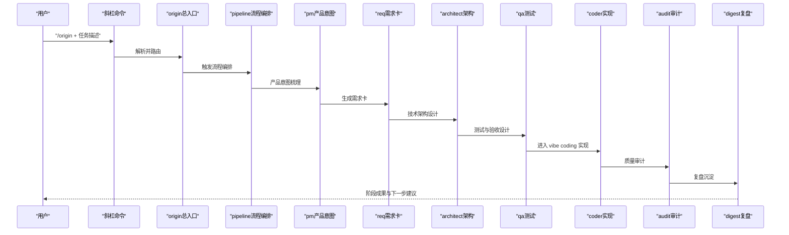
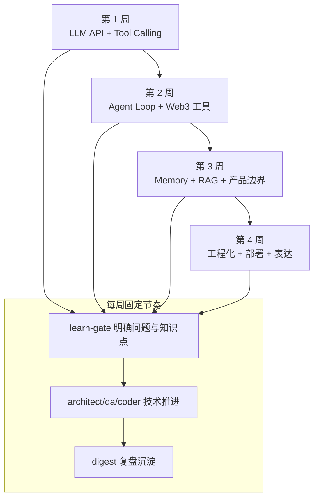
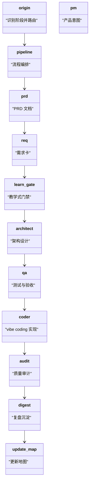
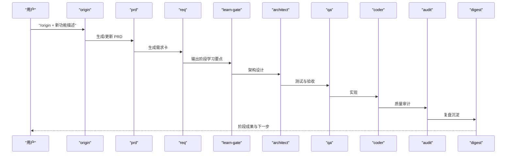
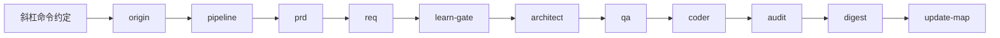

# 快速开始

<cite>
**本文引用的文件**
- [AI-Agent.md](file://AI-Agent.md)
- [PLAN.md](file://PLAN.md)
- [按周拆解的学习资料清单.md](file://按周拆解的学习资料清单.md)
- [skills/web3-ai-agent/COMMANDS.md](file://skills/web3-ai-agent/COMMANDS.md)
- [skills/web3-ai-agent/SKILL-SYSTEM-DESIGN.md](file://skills/web3-ai-agent/SKILL-SYSTEM-DESIGN.md)
- [skills/web3-ai-agent/MAP.md](file://skills/web3-ai-agent/MAP.md)
- [skills/web3-ai-agent/TEMPLATES.md](file://skills/web3-ai-agent/TEMPLATES.md)
- [skills/web3-ai-agent/pipeline/SKILL.md](file://skills/web3-ai-agent/pipeline/SKILL.md)
- [skills/web3-ai-agent/pm/SKILL.md](file://skills/web3-ai-agent/pm/SKILL.md)
- [skills/web3-ai-agent/req/SKILL.md](file://skills/web3-ai-agent/req/SKILL.md)
- [skills/web3-ai-agent/architect/SKILL.md](file://skills/web3-ai-agent/architect/SKILL.md)
- [skills/web3-ai-agent/qa/SKILL.md](file://skills/web3-ai-agent/qa/SKILL.md)
- [skills/web3-ai-agent/coder/SKILL.md](file://skills/web3-ai-agent/coder/SKILL.md)
- [skills/web3-ai-agent/audit/SKILL.md](file://skills/web3-ai-agent/audit/SKILL.md)
- [skills/web3-ai-agent/digest/SKILL.md](file://skills/web3-ai-agent/digest/SKILL.md)
- [skills/web3-ai-agent/update-map/SKILL.md](file://skills/web3-ai-agent/update-map/SKILL.md)
- [skills/web3-ai-agent/explore/SKILL.md](file://skills/web3-ai-agent/explore/SKILL.md)
- [skills/web3-ai-agent/init-docs/SKILL.md](file://skills/web3-ai-agent/init-docs/SKILL.md)
- [skills/web3-ai-agent/browser-verify/SKILL.md](file://skills/web3-ai-agent/browser-verify/SKILL.md)
- [skills/web3-ai-agent/check-in/SKILL.md](file://skills/web3-ai-agent/check-in/SKILL.md)
- [skills/web3-ai-agent/resolve-doc-conflicts/SKILL.md](file://skills/web3-ai-agent/resolve-doc-conflicts/SKILL.md)
</cite>

## 目录
1. [简介](#简介)
2. [项目结构](#项目结构)
3. [核心组件](#核心组件)
4. [架构总览](#架构总览)
5. [详细组件分析](#详细组件分析)
6. [依赖分析](#依赖分析)
7. [性能考虑](#性能考虑)
8. [故障排除指南](#故障排除指南)
9. [结论](#结论)
10. [附录](#附录)

## 简介
本快速开始指南面向希望从零起步构建与使用“Web3 AI Agent 技能系统”的初学者。你将获得：
- 环境搭建与工具链准备
- 学习路径规划（按周拆解）
- 基本使用方法与斜杠命令约定
- 实际入门示例（如何用技能系统完成简单任务）
- 常见问题与故障排除

该系统以“文档先行 + 分阶段学习 + vibe coding”为核心，通过一组流程型多 skill 串联从 PRD 到实现的完整闭环。

## 项目结构
仓库采用“根目录文档 + skills/ 目录”的组织方式，便于边学边做、边做边学。关键位置：
- 根目录文档：用于阶段性交付与里程碑管理
- skills/web3-ai-agent：按阶段拆分的技能集合，每个技能独立文档化，职责清晰

图表来源
- [PLAN.md:42-56](file://PLAN.md#L42-L56)
- [skills/web3-ai-agent/MAP.md](file://skills/web3-ai-agent/MAP.md)

章节来源
- [PLAN.md:1-176](file://PLAN.md#L1-L176)
- [skills/web3-ai-agent/MAP.md](file://skills/web3-ai-agent/MAP.md)

## 核心组件
- 学习与规划：按周拆解的学习资料清单，提供每周目标、学习内容、项目产出与验收标准
- 技能系统：以“流程型多 skill”为核心，覆盖 PRD、需求、架构、测试、实现、审计、复盘等环节
- 命令约定：统一的斜杠命令格式，便于在不同宿主环境中稳定调用技能
- 文档设计：PRD、阶段执行说明、里程碑 checklist 等，确保交付物可复用、可追溯

章节来源
- [按周拆解的学习资料清单.md:1-196](file://按周拆解的学习资料清单.md#L1-L196)
- [PLAN.md:57-124](file://PLAN.md#L57-L124)
- [skills/web3-ai-agent/COMMANDS.md:1-81](file://skills/web3-ai-agent/COMMANDS.md#L1-L81)
- [skills/web3-ai-agent/SKILL-SYSTEM-DESIGN.md](file://skills/web3-ai-agent/SKILL-SYSTEM-DESIGN.md)

## 架构总览
技能系统围绕九个阶段编排，每个阶段均需先经“教学式门禁（learn-gate）”输出“要解决的问题、需要懂的知识点、技术方案、产物、成功标准”。随后由 prd → req → learn-gate → architect → qa → coder → audit → digest 形成闭环。

图表来源
- [PLAN.md:106-124](file://PLAN.md#L106-L124)
- [PLAN.md:125-167](file://PLAN.md#L125-L167)

章节来源
- [PLAN.md:106-167](file://PLAN.md#L106-L167)

## 详细组件分析

### 命令约定与基本使用
- 斜杠命令格式：统一以“/技能名 + 任务描述”作为输入约定，便于在不同宿主产品中稳定调用
- 推荐入口：优先使用 /origin 作为总入口，随后根据任务类型选择 /pipeline、/pm、/req、/architect、/qa、/coder、/audit、/digest、/update-map、/explore、/init-docs、/browser-verify、/check-in、/resolve-doc-conflicts 等
- 示例：新功能、修 bug、重构、探索项目等均有对应命令示例

图表来源
- [skills/web3-ai-agent/COMMANDS.md:20-50](file://skills/web3-ai-agent/COMMANDS.md#L20-L50)
- [PLAN.md:103-105](file://PLAN.md#L103-L105)

章节来源
- [skills/web3-ai-agent/COMMANDS.md:1-81](file://skills/web3-ai-agent/COMMANDS.md#L1-L81)
- [PLAN.md:103-105](file://PLAN.md#L103-L105)

### 学习路径规划（按周拆解）
- 第 1 周：LLM API、Chat 与 Function Calling，建立最小 Agent 闭环，产出至少 2 个真实工具
- 第 2 周：Agent Loop、Prompt 设计与 Web3 工具接入，完成一轮任务闭环并接入真实 Web3 数据
- 第 3 周：Memory、RAG 入门与产品边界，形成初步产品形态与风险控制策略
- 第 4 周：工程化、部署与项目表达，输出可展示的工程成果与简历项目描述
- 使用方法：建议每周采用“learn-gate → architect/qa/coder → digest”的节奏推进

图表来源
- [按周拆解的学习资料清单.md:15-50](file://按周拆解的学习资料清单.md#L15-L50)
- [按周拆解的学习资料清单.md:59-93](file://按周拆解的学习资料清单.md#L59-L93)
- [按周拆解的学习资料清单.md:102-135](file://按周拆解的学习资料清单.md#L102-L135)
- [按周拆解的学习资料清单.md:144-178](file://按周拆解的学习资料清单.md#L144-L178)
- [按周拆解的学习资料清单.md:187-196](file://按周拆解的学习资料清单.md#L187-L196)

章节来源
- [按周拆解的学习资料清单.md:1-196](file://按周拆解的学习资料清单.md#L1-L196)

### 技能系统设计与职责边界
- 总体原则：保留自治流水线骨架，增加 Web3 专属约束与教学式门禁
- 每个 skill 的职责边界清晰，避免重复与遗漏；通过 learn-gate 强制每阶段输出“要解决的问题、需要懂的知识点、技术方案、产物、成功标准”
- 阶段定义：从 Phase 0 到 Phase 8，每个阶段都必须先经 learn-gate

图表来源
- [PLAN.md:57-124](file://PLAN.md#L57-L124)
- [PLAN.md:103-105](file://PLAN.md#L103-L105)

章节来源
- [PLAN.md:57-124](file://PLAN.md#L57-L124)
- [PLAN.md:103-105](file://PLAN.md#L103-L105)

### 入门示例：使用技能系统完成简单任务
- 新功能：以“/origin + 任务描述”作为入口，系统将自动路由到 prd → req → learn-gate → architect → qa → coder → audit → digest 的完整流程
- 修 bug：同样以 /origin 入口，结合 req、architect、coder、audit 等技能定位问题、设计修复方案并验证
- 探索项目：使用 /explore 获取当前模块与能力概览，再结合 /init-docs 初始化文档，/browser-verify 验证文档一致性，/resolve-doc-conflicts 解决冲突

图表来源
- [skills/web3-ai-agent/COMMANDS.md:52-80](file://skills/web3-ai-agent/COMMANDS.md#L52-L80)
- [PLAN.md:103-105](file://PLAN.md#L103-L105)

章节来源
- [skills/web3-ai-agent/COMMANDS.md:52-80](file://skills/web3-ai-agent/COMMANDS.md#L52-L80)
- [PLAN.md:103-105](file://PLAN.md#L103-L105)

## 依赖分析
- 技能耦合：技能之间通过“输入/输出契约”与“阶段顺序”耦合，避免循环依赖
- 外部依赖：命令约定与宿主产品交互；Web3 工具依赖链上 RPC 与 SDK
- 文档依赖：PRD、阶段执行说明、里程碑 checklist 为后续技能执行提供输入

图表来源
- [skills/web3-ai-agent/COMMANDS.md:20-50](file://skills/web3-ai-agent/COMMANDS.md#L20-L50)
- [PLAN.md:103-105](file://PLAN.md#L103-L105)

章节来源
- [skills/web3-ai-agent/COMMANDS.md:20-50](file://skills/web3-ai-agent/COMMANDS.md#L20-L50)
- [PLAN.md:103-105](file://PLAN.md#L103-L105)

## 性能考虑
- 学习节奏：按周推进，避免知识过载；每周聚焦“要解决的问题、需要懂的知识点、技术方案、产物、成功标准”
- 工程化：在第四周完成日志、错误追踪、基础评测与部署，提升可运维性与可展示性
- 自动化：通过 pipeline 串联技能，减少手工切换成本，提高交付效率

## 故障排除指南
- 命令无法触发：确认宿主产品是否支持斜杠命令弹窗；若不支持，可在聊天框中手动输入命令格式
- 技能未按预期执行：检查是否先通过 learn-gate 输出了阶段学习要点；若缺失，系统可能拒绝进入下游技能
- 文档冲突：使用 /resolve-doc-conflicts 解决多源文档冲突
- 项目探索：使用 /explore 获取当前模块与能力概览，再结合 /init-docs 初始化文档，/browser-verify 验证文档一致性

章节来源
- [skills/web3-ai-agent/COMMANDS.md:14-19](file://skills/web3-ai-agent/COMMANDS.md#L14-L19)
- [按周拆解的学习资料清单.md:187-196](file://按周拆解的学习资料清单.md#L187-L196)
- [skills/web3-ai-agent/resolve-doc-conflicts/SKILL.md](file://skills/web3-ai-agent/resolve-doc-conflicts/SKILL.md)
- [skills/web3-ai-agent/explore/SKILL.md](file://skills/web3-ai-agent/explore/SKILL.md)
- [skills/web3-ai-agent/init-docs/SKILL.md](file://skills/web3-ai-agent/init-docs/SKILL.md)
- [skills/web3-ai-agent/browser-verify/SKILL.md](file://skills/web3-ai-agent/browser-verify/SKILL.md)

## 结论
通过“文档先行 + 分阶段学习 + vibe coding”的技能系统，你可以以最小成本建立可复用的知识地图与工程成果。建议从 /origin 入口开始，结合按周拆解的学习资料清单，按阶段推进 prd → req → learn-gate → architect → qa → coder → audit → digest，逐步完成从概念到可展示产品的全过程。

## 附录
- 环境与工具准备（建议）
  - 编辑器：支持 Markdown 与斜杠命令的编辑器或 IDE 插件
  - 宿主产品：支持斜杠命令弹窗的聊天/协作平台
  - Web3 工具链：RPC、SDK、钱包与链上数据查询工具
  - 部署平台：Vercel、Netlify 或自建服务器
- 常用命令清单（参考）
  - /origin、/pipeline、/pm、/prd、/req、/check-in、/architect、/qa、/coder、/audit、/digest、/update-map、/explore、/init-docs、/browser-verify、/resolve-doc-conflicts

章节来源
- [skills/web3-ai-agent/COMMANDS.md:20-50](file://skills/web3-ai-agent/COMMANDS.md#L20-L50)
- [按周拆解的学习资料清单.md:187-196](file://按周拆解的学习资料清单.md#L187-L196)