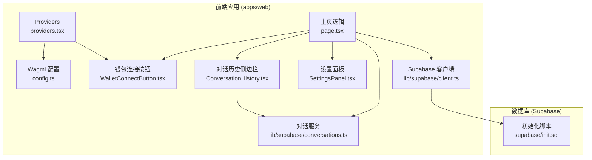
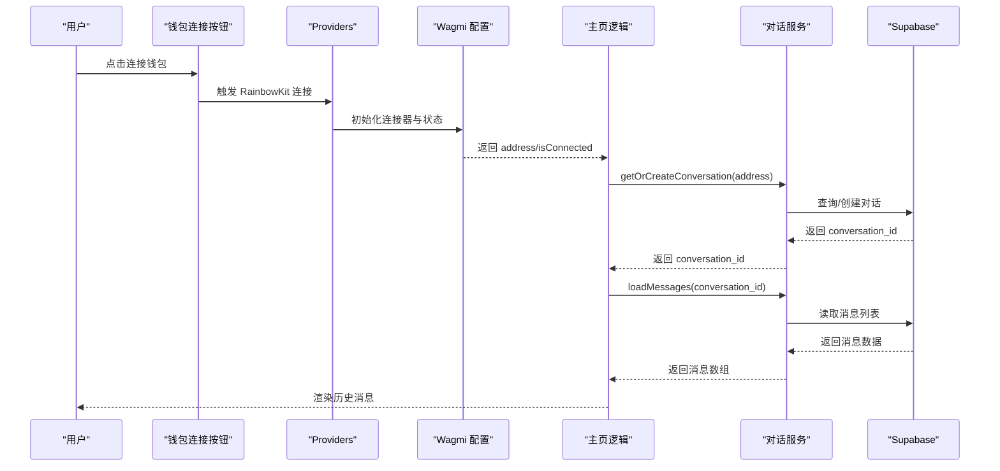
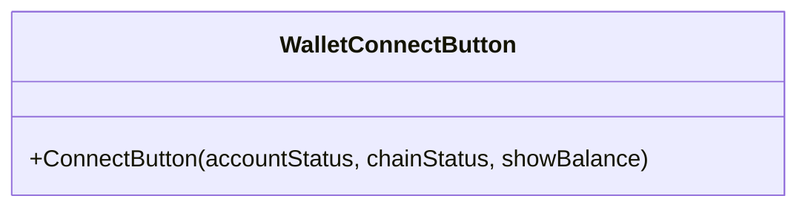
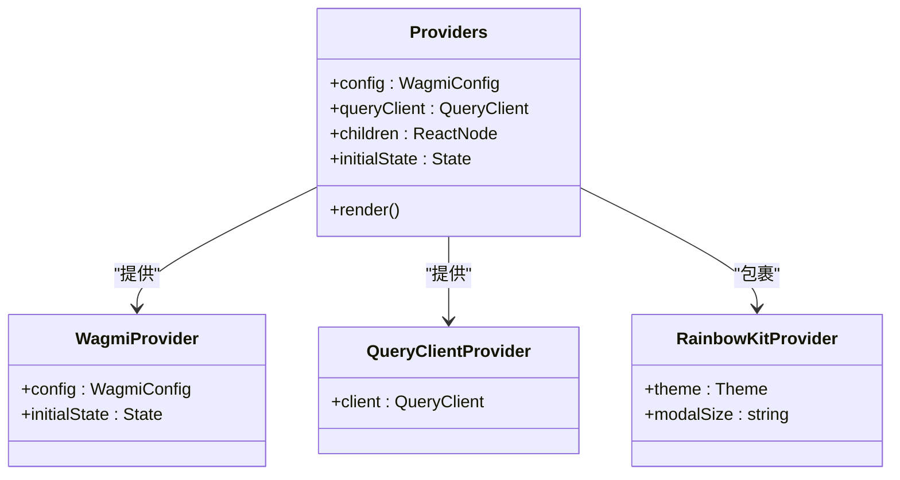
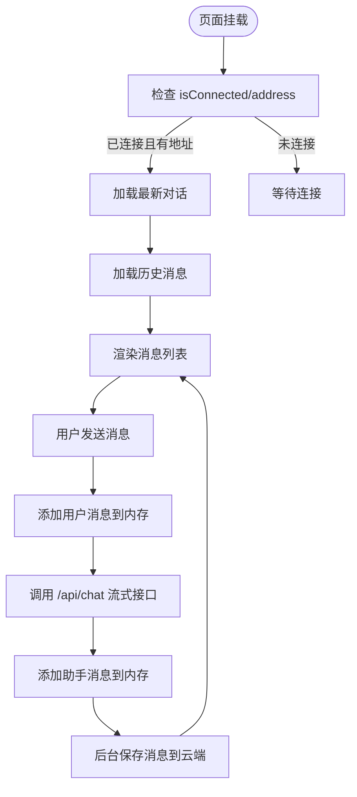
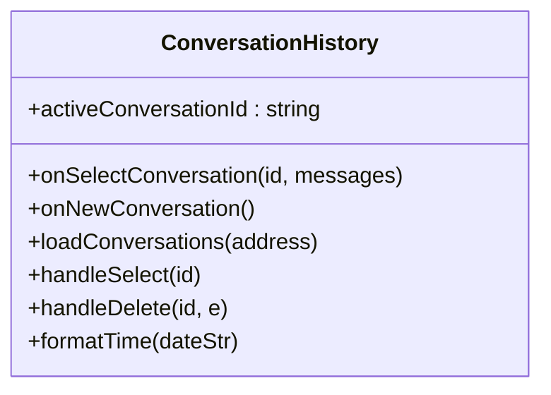
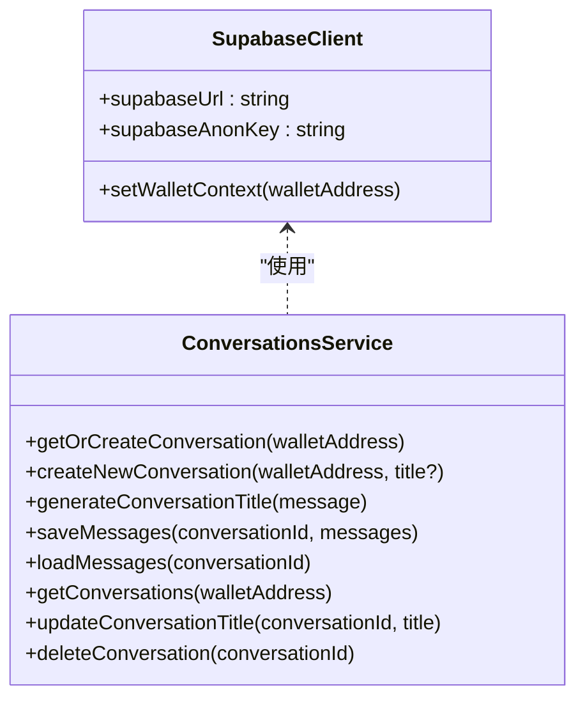
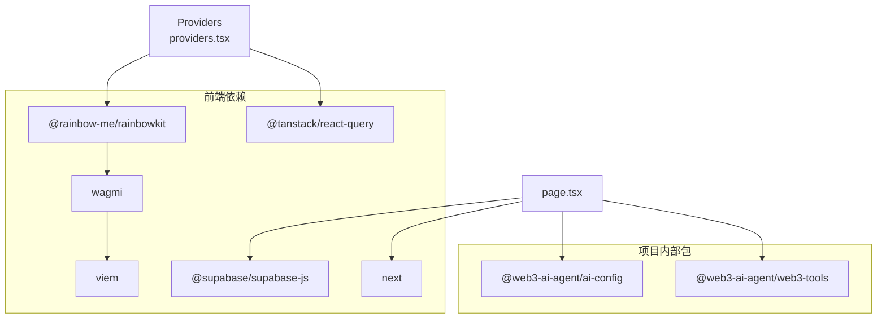

# 钱包登录配置指南

<cite>
**本文档引用的文件**
- [WALLET-LOGIN-SETUP.md](file://WALLET-LOGIN-SETUP.md)
- [WalletConnectButton.tsx](file://apps/web/components/WalletConnectButton.tsx)
- [providers.tsx](file://apps/web/app/providers.tsx)
- [config.ts](file://apps/web/app/config.ts)
- [client.ts](file://apps/web/lib/supabase/client.ts)
- [conversations.ts](file://apps/web/lib/supabase/conversations.ts)
- [page.tsx](file://apps/web/app/page.tsx)
- [ConversationHistory.tsx](file://apps/web/components/ConversationHistory.tsx)
- [SettingsPanel.tsx](file://apps/web/components/SettingsPanel.tsx)
- [init.sql](file://supabase/init.sql)
- [package.json](file://apps/web/package.json)
</cite>

## 目录
1. [简介](#简介)
2. [项目结构概览](#项目结构概览)
3. [核心组件分析](#核心组件分析)
4. [架构总览](#架构总览)
5. [详细组件分析](#详细组件分析)
6. [依赖关系分析](#依赖关系分析)
7. [性能考虑](#性能考虑)
8. [故障排除指南](#故障排除指南)
9. [结论](#结论)

## 简介
本指南面向希望在 Web3 AI Agent 项目中集成钱包登录与对话历史持久化的开发者。文档基于现有代码实现，提供从环境准备、配置部署到功能验证的完整流程说明，并深入解析钱包连接、状态管理、云端存储及数据隔离策略。

## 项目结构概览
项目采用 Next.js 14 App Router 架构，前端应用位于 apps/web，核心功能围绕钱包连接（RainbowKit + Wagmi）、云端存储（Supabase）与对话记忆管理展开。钱包登录配置的关键文件分布如下：

**图表来源**
- [providers.tsx:1-51](file://apps/web/app/providers.tsx#L1-L51)
- [config.ts:1-59](file://apps/web/app/config.ts#L1-L59)
- [WalletConnectButton.tsx:1-17](file://apps/web/components/WalletConnectButton.tsx#L1-L17)
- [page.tsx:1-362](file://apps/web/app/page.tsx#L1-L362)
- [ConversationHistory.tsx:1-221](file://apps/web/components/ConversationHistory.tsx#L1-L221)
- [SettingsPanel.tsx:1-192](file://apps/web/components/SettingsPanel.tsx#L1-L192)
- [client.ts:1-39](file://apps/web/lib/supabase/client.ts#L1-L39)
- [conversations.ts:1-219](file://apps/web/lib/supabase/conversations.ts#L1-L219)
- [init.sql:1-103](file://supabase/init.sql#L1-L103)

**章节来源**
- [providers.tsx:1-51](file://apps/web/app/providers.tsx#L1-L51)
- [config.ts:1-59](file://apps/web/app/config.ts#L1-L59)
- [page.tsx:1-362](file://apps/web/app/page.tsx#L1-L362)

## 核心组件分析
本节聚焦钱包登录与对话历史持久化的核心实现要点，包括钱包连接、状态注入、云端存储与数据隔离策略。

- 钱包连接与状态注入
  - 使用 RainbowKit Provider 包裹应用，启用 wagmi 状态管理与 react-query 缓存。
  - 客户端完整配置包含 WalletConnect 与 Injected 连接器，SSR 阶段仅使用 Injected，避免 IndexedDB 访问问题。
  - 钱包地址变化触发对话历史加载与状态清理。

- 云端存储与数据隔离
  - Supabase 客户端通过环境变量初始化，提供 setWalletContext 接口（当前为客户端警告实现）。
  - 数据库通过 RLS 策略按 wallet_address 隔离用户数据，确保不同钱包地址无法访问彼此的历史记录。

- 对话历史管理
  - 首次连接自动获取或创建最新对话；后续消息自动保存至云端。
  - 侧边栏支持新建、选择、删除对话，实时更新标题与消息计数。

**章节来源**
- [providers.tsx:10-50](file://apps/web/app/providers.tsx#L10-L50)
- [config.ts:26-59](file://apps/web/app/config.ts#L26-L59)
- [client.ts:15-39](file://apps/web/lib/supabase/client.ts#L15-L39)
- [init.sql:31-97](file://supabase/init.sql#L31-L97)
- [page.tsx:63-105](file://apps/web/app/page.tsx#L63-L105)
- [ConversationHistory.tsx:24-95](file://apps/web/components/ConversationHistory.tsx#L24-L95)

## 架构总览
下图展示了钱包登录与对话历史持久化的端到端流程：从钱包连接到云端数据读写，再到 UI 展示与交互。

**图表来源**
- [WalletConnectButton.tsx:5-16](file://apps/web/components/WalletConnectButton.tsx#L5-L16)
- [providers.tsx:10-50](file://apps/web/app/providers.tsx#L10-L50)
- [config.ts:26-59](file://apps/web/app/config.ts#L26-L59)
- [page.tsx:63-105](file://apps/web/app/page.tsx#L63-L105)
- [conversations.ts:14-45](file://apps/web/lib/supabase/conversations.ts#L14-L45)
- [conversations.ts:119-143](file://apps/web/lib/supabase/conversations.ts#L119-L143)

## 详细组件分析

### 钱包连接组件分析
WalletConnectButton 使用 RainbowKit 的 ConnectButton，配置账户状态显示与链状态图标，确保在桌面与移动端呈现一致的连接体验。

**图表来源**
- [WalletConnectButton.tsx:5-16](file://apps/web/components/WalletConnectButton.tsx#L5-L16)

**章节来源**
- [WalletConnectButton.tsx:1-17](file://apps/web/components/WalletConnectButton.tsx#L1-L17)

### Providers 与 Wagmi 配置
Providers 负责：
- 初始化 Wagmi 配置，区分 SSR 与客户端的连接器集合。
- 配置 React Query 默认缓存策略（staleTime、gcTime）。
- 使用 RainbowKit Provider 包裹应用，设置主题与模态框尺寸。

**图表来源**
- [providers.tsx:10-50](file://apps/web/app/providers.tsx#L10-L50)
- [config.ts:7-24](file://apps/web/app/config.ts#L7-L24)
- [config.ts:27-59](file://apps/web/app/config.ts#L27-L59)

**章节来源**
- [providers.tsx:1-51](file://apps/web/app/providers.tsx#L1-L51)
- [config.ts:1-59](file://apps/web/app/config.ts#L1-L59)

### 页面逻辑与对话历史
页面逻辑负责：
- 监听钱包连接状态，连接成功后加载最新对话与历史消息。
- 新消息发送后，自动保存至云端并更新 UI。
- 支持新建对话、选择对话与删除对话。

**图表来源**
- [page.tsx:63-105](file://apps/web/app/page.tsx#L63-L105)
- [page.tsx:177-268](file://apps/web/app/page.tsx#L177-L268)
- [useChatStream.ts:167-252](file://apps/web/hooks/useChatStream.ts#L167-L252)

**章节来源**
- [page.tsx:19-362](file://apps/web/app/page.tsx#L19-L362)

### 对话历史侧边栏
侧边栏组件负责：
- 监听钱包连接状态，加载对话列表。
- 支持新建、选择、删除对话，实时响应标题更新事件。
- 格式化时间显示与移动端交互。

**图表来源**
- [ConversationHistory.tsx:14-95](file://apps/web/components/ConversationHistory.tsx#L14-L95)

**章节来源**
- [ConversationHistory.tsx:1-221](file://apps/web/components/ConversationHistory.tsx#L1-L221)

### Supabase 客户端与对话服务
Supabase 客户端与对话服务提供：
- 客户端初始化与上下文设置接口（当前为客户端警告实现）。
- 对话的创建、查询、标题更新与删除。
- 消息的批量插入与按对话加载。

**图表来源**
- [client.ts:15-39](file://apps/web/lib/supabase/client.ts#L15-L39)
- [conversations.ts:14-45](file://apps/web/lib/supabase/conversations.ts#L14-L45)
- [conversations.ts:94-143](file://apps/web/lib/supabase/conversations.ts#L94-L143)
- [conversations.ts:148-218](file://apps/web/lib/supabase/conversations.ts#L148-L218)

**章节来源**
- [client.ts:1-39](file://apps/web/lib/supabase/client.ts#L1-L39)
- [conversations.ts:1-219](file://apps/web/lib/supabase/conversations.ts#L1-L219)

## 依赖关系分析
钱包登录与对话历史持久化涉及的关键依赖与版本关系如下：

**图表来源**
- [package.json:12-31](file://apps/web/package.json#L12-L31)
- [providers.tsx:3-6](file://apps/web/app/providers.tsx#L3-L6)
- [page.tsx:15](file://apps/web/app/page.tsx#L15)

**章节来源**
- [package.json:1-44](file://apps/web/package.json#L1-L44)

## 性能考虑
- 缓存策略：React Query 默认 staleTime 与 gcTime 已配置，减少重复请求与内存占用。
- 流式传输：聊天消息通过 SSE 流式接收，结合节流更新降低 UI 抖动。
- 云端降级：当前实现中存在降级到本地存储的 TODO，建议在网络异常时提供本地缓存与重试机制。
- 数据库优化：初始化脚本包含必要索引，RLS 策略确保数据隔离，避免全表扫描。

[本节为通用性能指导，无需特定文件来源]

## 故障排除指南
- 环境变量缺失
  - 现象：Supabase 客户端初始化抛出错误。
  - 处理：确认 .env.local 中包含 NEXT_PUBLIC_SUPABASE_URL 与 NEXT_PUBLIC_SUPABASE_ANON_KEY。
  - 参考：[client.ts:8-10](file://apps/web/lib/supabase/client.ts#L8-L10)

- 钱包连接失败
  - 现象：RainbowKit 无法连接或显示异常。
  - 处理：检查 NEXT_PUBLIC_WALLETCONNECT_PROJECT_ID 是否正确；确认客户端配置包含 walletConnect。
  - 参考：[config.ts:5](file://apps/web/app/config.ts#L5), [config.ts:33-48](file://apps/web/app/config.ts#L33-L48)

- 对话历史无法加载
  - 现象：连接钱包后无历史消息。
  - 处理：确认 Supabase 初始化脚本已执行；检查 RLS 策略是否生效。
  - 参考：[init.sql:31-97](file://supabase/init.sql#L31-L97), [page.tsx:74-105](file://apps/web/app/page.tsx#L74-L105)

- 云端保存失败
  - 现象：消息发送后未持久化。
  - 处理：检查 saveMessages 调用与网络状态；关注控制台错误日志。
  - 参考：[page.tsx:108-117](file://apps/web/app/page.tsx#L108-L117), [conversations.ts:94-114](file://apps/web/lib/supabase/conversations.ts#L94-L114)

**章节来源**
- [client.ts:8-10](file://apps/web/lib/supabase/client.ts#L8-L10)
- [config.ts:5](file://apps/web/app/config.ts#L5)
- [config.ts:33-48](file://apps/web/app/config.ts#L33-L48)
- [init.sql:31-97](file://supabase/init.sql#L31-L97)
- [page.tsx:74-105](file://apps/web/app/page.tsx#L74-L105)
- [page.tsx:108-117](file://apps/web/app/page.tsx#L108-L117)
- [conversations.ts:94-114](file://apps/web/lib/supabase/conversations.ts#L94-L114)

## 结论
本指南基于现有代码实现了钱包登录与对话历史持久化的完整配置路径。通过 RainbowKit + Wagmi 的连接层、Supabase 的云端存储与 RLS 数据隔离，以及 React Query 的状态管理，系统在保证安全性的同时提供了良好的用户体验。建议后续完善客户端上下文设置与云端降级策略，以提升生产环境的稳定性与可用性。