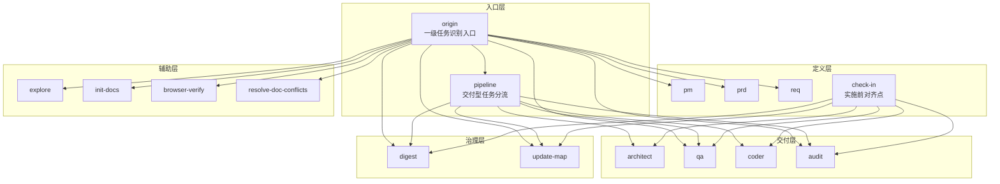
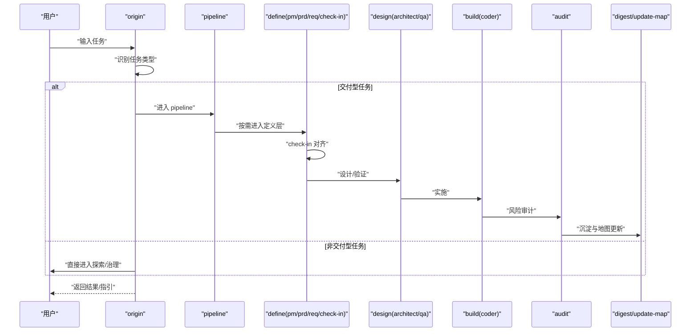
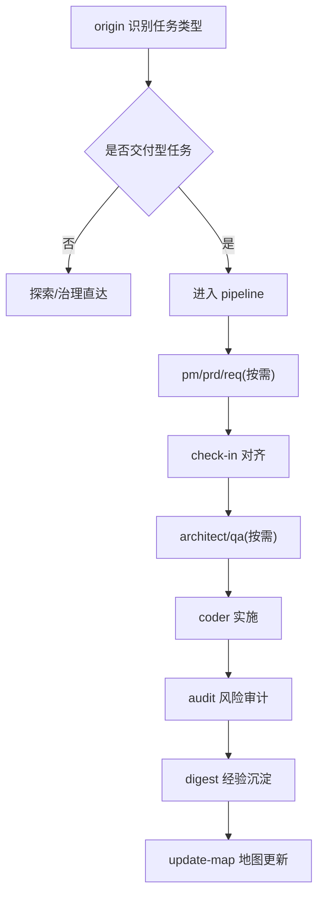

# Web3专属约束

<cite>
**本文引用的文件**
- [skills\web3-ai-agent\SKILL.md](file://skills\web3-ai-agent\SKILL.md)
- [skills\web3-ai-agent\SKILL-SYSTEM-DESIGN-V3.md](file://skills\web3-ai-agent\SKILL-SYSTEM-DESIGN-V3.md)
- [skills\web3-ai-agent\MAP-V3.md](file://skills\web3-ai-agent\MAP-V3.md)
- [skills\web3-ai-agent\COMMANDS.md](file://skills\web3-ai-agent\COMMANDS.md)
- [skills\web3-ai-agent\architect\SKILL.md](file://skills\web3-ai-agent\architect\SKILL.md)
- [skills\web3-ai-agent\qa\SKILL.md](file://skills\web3-ai-agent\qa\SKILL.md)
- [skills\web3-ai-agent\coder\SKILL.md](file://skills\web3-ai-agent\coder\SKILL.md)
- [skills\web3-ai-agent\digest\SKILL.md](file://skills\web3-ai-agent\digest\SKILL.md)
- [skills\web3-ai-agent\audit\SKILL.md](file://skills\web3-ai-agent\audit\SKILL.md)
- [docs\Web3-AI-Agent-PRD-MVP.md](file://docs\Web3-AI-Agent-PRD-MVP.md)
</cite>

## 目录
1. [简介](#简介)
2. [项目结构](#项目结构)
3. [核心组件](#核心组件)
4. [架构总览](#架构总览)
5. [详细组件分析](#详细组件分析)
6. [依赖关系分析](#依赖关系分析)
7. [性能考量](#性能考量)
8. [故障排查指南](#故障排查指南)
9. [结论](#结论)
10. [附录](#附录)

## 简介
本文件面向Web3 AI Agent的技能系统，制定“Web3专属约束”。其核心目标是：
- 明确Agent在Web3场景下的“LLM + Tool + Loop + Memory”设计边界；
- 强调Web3数据必须标注来源，模型不得伪造链上实时数据；
- 建立高风险问题的风险提示机制，严禁给出确定性投资建议；
- 限定MVP阶段的范围与限制，解释为何不提前扩展至自动交易与多链平台；
- 提供约束实施指南与合规性检查要点，确保系统在工程与伦理层面可控。

## 项目结构
Web3 AI Agent技能系统围绕“入口 → 任务识别 → 路由 → 执行 → 收尾”的主干流程展开，辅以“探索/引导/治理”等支持层。V3版本将技能分层为入口层、定义层、交付层、治理层与辅助层；并以origin为唯一入口，以check-in为实施前对齐点，以audit为交付前风险关。

图表来源
- [skills\web3-ai-agent\MAP-V3.md:1-166](file://skills\web3-ai-agent\MAP-V3.md#L1-L166)
- [skills\web3-ai-agent\SKILL-SYSTEM-DESIGN-V3.md:164-220](file://skills\web3-ai-agent\SKILL-SYSTEM-DESIGN-V3.md#L164-L220)

章节来源
- [skills\web3-ai-agent\SKILL.md:1-224](file://skills\web3-ai-agent\SKILL.md#L1-L224)
- [skills\web3-ai-agent\SKILL-SYSTEM-DESIGN-V3.md:1-719](file://skills\web3-ai-agent\SKILL-SYSTEM-DESIGN-V3.md#L1-L719)
- [skills\web3-ai-agent\MAP-V3.md:1-166](file://skills\web3-ai-agent\MAP-V3.md#L1-L166)

## 核心组件
- origin：唯一入口，负责任务类型识别与一级分流（DISCOVER/BOOTSTRAP/DEFINE/DELIVER-*/VERIFY/GOVERN）。
- pipeline：仅对交付型任务生效，按FEAT/PATCH/REFACTOR选择执行深度。
- check-in：实施前对齐点，强制输出“问题、上下文、方案、不做什么、产物、完成标准、下一跳”七要素。
- architect：结构设计，定义模块边界、数据/消息流、接口契约与风险点。
- qa：验证策略定义与执行，FEAT默认RED，PATCH/REFACTOR默认轻量验证或回归检查。
- coder：在边界清晰前提下实施代码，最多10轮自愈循环，超限输出STUCK并终止。
- audit：风险审计与评分，总分100，>=80通过，<60直接拒绝，存在一票否决项。
- digest/update-map：经验沉淀与地图更新，形成闭环。

章节来源
- [skills\web3-ai-agent\SKILL-SYSTEM-DESIGN-V3.md:439-601](file://skills\web3-ai-agent\SKILL-SYSTEM-DESIGN-V3.md#L439-L601)
- [skills\web3-ai-agent\SKILL.md:160-167](file://skills\web3-ai-agent\SKILL.md#L160-L167)

## 架构总览
Web3专属约束下的Agent执行骨架强调“最小可行能力 + 风险前置控制”。主执行骨架为 route → define(按需) → check-in → design(按需) → build → closeout。其中：
- route由origin/pipeline完成；
- define由pm/prd/req完成；
- check-in为实施前门禁；
- design由architect/qa完成；
- build由coder完成；
- closeout由audit/digest/update-map完成。

图表来源
- [skills\web3-ai-agent\SKILL-SYSTEM-DESIGN-V3.md:265-286](file://skills\web3-ai-agent\SKILL-SYSTEM-DESIGN-V3.md#L265-L286)
- [skills\web3-ai-agent\MAP-V3.md:86-157](file://skills\web3-ai-agent\MAP-V3.md#L86-L157)

章节来源
- [skills\web3-ai-agent\SKILL-SYSTEM-DESIGN-V3.md:265-286](file://skills\web3-ai-agent\SKILL-SYSTEM-DESIGN-V3.md#L265-L286)
- [skills\web3-ai-agent\MAP-V3.md:86-157](file://skills\web3-ai-agent\MAP-V3.md#L86-L157)

## 详细组件分析

### Agent核心：LLM + Tool + Loop + Memory
- LLM：负责理解用户意图、规划工具调用与整合结果。
- Tool：限定为Web3预定义工具（如价格、余额、Gas），必须在结果中注明来源。
- Loop：Agent Loop保证多轮对话与上下文延续，但不扩大能力边界。
- Memory：最小会话Memory，仅保留必要上下文，避免长期持久化。

章节来源
- [docs\Web3-AI-Agent-PRD-MVP.md:11-23](file://docs\Web3-AI-Agent-PRD-MVP.md#L11-L23)
- [docs\Web3-AI-Agent-PRD-MVP.md:124-141](file://docs\Web3-AI-Agent-PRD-MVP.md#L124-L141)

### Web3数据来源标注与不可伪造性
- 数据来源必须可说明，链上数据与价格数据应明确区分。
- 返回结果中应体现“来自工具查询，而非模型主观生成”。
- 工具失败时禁止模型伪造结果填补空白；必须显式说明不确定性。

章节来源
- [docs\Web3-AI-Agent-PRD-MVP.md:143-156](file://docs\Web3-AI-Agent-PRD-MVP.md#L143-L156)
- [docs\Web3-AI-Agent-PRD-MVP.md:159-171](file://docs\Web3-AI-Agent-PRD-MVP.md#L159-L171)

### 高风险问题的风险提示机制
- 对“买卖建议/时机/收益预测”等高风险问题，系统必须保守回答并提供风险提示与免责声明。
- 不得对价格走势做确定性承诺，不得自行捏造链上数据。

章节来源
- [docs\Web3-AI-Agent-PRD-MVP.md:73-81](file://docs\Web3-AI-Agent-PRD-MVP.md#L73-L81)
- [docs\Web3-AI-Agent-PRD-MVP.md:134-140](file://docs\Web3-AI-Agent-PRD-MVP.md#L134-L140)

### MVP阶段限制与原因
- 不包含自动交易执行、钱包真实签名与链上写操作、多链复杂资产聚合、高级RAG系统、长期持久化Memory、多Agent协作、完整后台管理。
- 原因：聚焦最小可行能力，确保数据可信、流程可控、风险可管。

章节来源
- [docs\Web3-AI-Agent-PRD-MVP.md:110-121](file://docs\Web3-AI-Agent-PRD-MVP.md#L110-L121)

### 技能系统约束与执行规则
- 禁止跳过origin直进主链；禁止无check-in进入architect/qa/coder。
- FEAT默认先由qa执行RED；coder最多10轮自愈，超限终止并输出STUCK报告。
- audit总分100，>=80通过，<60直接拒绝；存在一票否决项（严重安全问题、关键不变量破坏、高风险边界缺失）。

章节来源
- [skills\web3-ai-agent\SKILL.md:160-167](file://skills\web3-ai-agent\SKILL.md#L160-L167)
- [skills\web3-ai-agent\SKILL-SYSTEM-DESIGN-V3.md:696-719](file://skills\web3-ai-agent\SKILL-SYSTEM-DESIGN-V3.md#L696-L719)

### 技能职责与边界
- architect：定义模块边界、数据流、接口契约与风险点；不直接写测试/编码。
- qa：定义并执行验证策略；FEAT先RED，PATCH/REFACTOR轻量验证。
- coder：实施代码，最多10轮自愈；不扩大需求范围。
- audit：风险审计与评分；不直接改代码/重新定义需求。
- digest：经验沉淀；不替代地图更新/需求文档。

章节来源
- [skills\web3-ai-agent\architect\SKILL.md:1-53](file://skills\web3-ai-agent\architect\SKILL.md#L1-L53)
- [skills\web3-ai-agent\qa\SKILL.md:1-73](file://skills\web3-ai-agent\qa\SKILL.md#L1-L73)
- [skills\web3-ai-agent\coder\SKILL.md:1-72](file://skills\web3-ai-agent\coder\SKILL.md#L1-L72)
- [skills\web3-ai-agent\digest\SKILL.md:1-50](file://skills\web3-ai-agent\digest\SKILL.md#L1-L50)
- [skills\web3-ai-agent\audit\SKILL.md:1-88](file://skills\web3-ai-agent\audit\SKILL.md#L1-L88)

### 交付流程与按需插入
- FEAT：pm(按需) → prd → req → check-in → architect → qa → coder → audit → digest → update-map。
- PATCH：req → check-in → coder → qa → digest → update-map；可按需插入architect/audit/browser-verify/prd。
- REFACTOR：req → check-in → architect → qa → coder → audit → digest → update-map；可按需插入prd/browser-verify。

章节来源
- [skills\web3-ai-agent\SKILL-SYSTEM-DESIGN-V3.md:288-392](file://skills\web3-ai-agent\SKILL-SYSTEM-DESIGN-V3.md#L288-L392)
- [skills\web3-ai-agent\MAP-V3.md:102-131](file://skills\web3-ai-agent\MAP-V3.md#L102-L131)

## 依赖关系分析
- 路由依赖：origin为唯一入口；仅DELIVER-*进入pipeline；check-in仅对实施型任务强制。
- 执行依赖：FEAT默认先RED；coder自愈循环受轮次上限约束；audit评分决定是否进入digest。
- 治理依赖：digest与update-map共同构成closeout闭环。

图表来源
- [skills\web3-ai-agent\MAP-V3.md:86-157](file://skills\web3-ai-agent\MAP-V3.md#L86-L157)
- [skills\web3-ai-agent\SKILL-SYSTEM-DESIGN-V3.md:265-286](file://skills\web3-ai-agent\SKILL-SYSTEM-DESIGN-V3.md#L265-L286)

章节来源
- [skills\web3-ai-agent\MAP-V3.md:158-166](file://skills\web3-ai-agent\MAP-V3.md#L158-L166)
- [skills\web3-ai-agent\SKILL-SYSTEM-DESIGN-V3.md:696-719](file://skills\web3-ai-agent\SKILL-SYSTEM-DESIGN-V3.md#L696-L719)

## 性能考量
- 通过“按需插入”减少不必要的验证与设计成本，例如PATCH/REFACTOR默认不走pm/prd，仅在必要时插入。
- audit分轻重，避免小任务过度消耗，提升交付效率。
- coder自愈循环上限控制在10轮，防止无限试错导致资源浪费。

章节来源
- [skills\web3-ai-agent\SKILL-SYSTEM-DESIGN-V3.md:320-327](file://skills\web3-ai-agent\SKILL-SYSTEM-DESIGN-V3.md#L320-L327)
- [skills\web3-ai-agent\SKILL-SYSTEM-DESIGN-V3.md:351-356](file://skills\web3-ai-agent\SKILL-SYSTEM-DESIGN-V3.md#L351-L356)
- [skills\web3-ai-agent\SKILL-SYSTEM-DESIGN-V3.md:386-391](file://skills\web3-ai-agent\SKILL-SYSTEM-DESIGN-V3.md#L386-L391)
- [skills\web3-ai-agent\SKILL-SYSTEM-DESIGN-V3.md:420-428](file://skills\web3-ai-agent\SKILL-SYSTEM-DESIGN-V3.md#L420-L428)
- [skills\web3-ai-agent\SKILL-SYSTEM-DESIGN-V3.md:544-546](file://skills\web3-ai-agent\SKILL-SYSTEM-DESIGN-V3.md#L544-L546)
- [skills\web3-ai-agent\SKILL-SYSTEM-DESIGN-V3.md:706-711](file://skills\web3-ai-agent\SKILL-SYSTEM-DESIGN-V3.md#L706-L711)
- [skills\web3-ai-agent\SKILL-SYSTEM-DESIGN-V3.md:712-719](file://skills\web3-ai-agent\SKILL-SYSTEM-DESIGN-V3.md#L712-L719)

## 故障排查指南
- 未通过RED：检查check-in完成标准是否清晰，QA测试清单是否覆盖主/异常路径。
- coder卡住：查看STUCK报告，定位阻塞点与已尝试方案，必要时回退至architect/req重新对齐。
- audit软拒绝/直接拒绝：根据评分项逐项整改，尤其关注安全与风险边界、关键不变量与高风险场景的降级处理。
- 工具失败/超时：严格遵循“不伪造数据”的原则，显式说明不确定性与下一步提示。

章节来源
- [skills\web3-ai-agent\SKILL-SYSTEM-DESIGN-V3.md:700-719](file://skills\web3-ai-agent\SKILL-SYSTEM-DESIGN-V3.md#L700-L719)
- [skills\web3-ai-agent\coder\SKILL.md:18-37](file://skills\web3-ai-agent\coder\SKILL.md#L18-L37)
- [skills\web3-ai-agent\audit\SKILL.md:52-77](file://skills\web3-ai-agent\audit\SKILL.md#L52-L77)
- [docs\Web3-AI-Agent-PRD-MVP.md:185-197](file://docs\Web3-AI-Agent-PRD-MVP.md#L185-L197)

## 结论
Web3专属约束以“最小可行能力 + 风险前置控制”为核心，通过origin/pipeline/check-in的强制约束与audit的评分阈值，确保Agent在Web3场景下：
- 数据来源可追溯、不可伪造；
- 高风险问题不越界、不提供确定性建议；
- MVP阶段聚焦对话、工具调用、循环与最小记忆；
- 交付流程可控、可治理、可沉淀。

## 附录

### 实施指南与合规性检查要点
- 入口与路由
  - 任何外部请求必须先经origin识别任务类型，不得绕过。
  - 仅DELIVER-*进入pipeline；其他任务不进入长链路。
- 实施前对齐
  - FEAT/PATCH/REFACTOR/准备进入实施的DEFINE均需check-in。
  - check-in必须输出七要素：问题、上下文、方案、不做什么、产物、完成标准、下一跳。
- 验证与自愈
  - FEAT默认先RED；PATCH/REFACTOR保留轻量验证或回归检查。
  - coder最多10轮自愈；超限输出STUCK并终止。
- 风险审计
  - audit总分100；>=80通过；60-79软拒绝；<60直接拒绝。
  - 一票否决项：严重安全问题、关键不变量破坏、高风险边界缺失。
- 数据与免责声明
  - 数据来源必须可说明；链上与价格数据应区分；返回结果体现“来自工具查询”。
  - 工具失败/超时不得伪造数据；必须显式说明不确定性与风险提示。
- MVP限制
  - 不包含自动交易、真实签名与链上写操作、多链复杂资产聚合、高级RAG、长期持久化Memory、多Agent协作、完整后台管理。

章节来源
- [skills\web3-ai-agent\SKILL.md:160-167](file://skills\web3-ai-agent\SKILL.md#L160-L167)
- [skills\web3-ai-agent\SKILL-SYSTEM-DESIGN-V3.md:696-719](file://skills\web3-ai-agent\SKILL-SYSTEM-DESIGN-V3.md#L696-L719)
- [skills\web3-ai-agent\MAP-V3.md:158-166](file://skills\web3-ai-agent\MAP-V3.md#L158-L166)
- [docs\Web3-AI-Agent-PRD-MVP.md:110-121](file://docs\Web3-AI-Agent-PRD-MVP.md#L110-L121)
- [docs\Web3-AI-Agent-PRD-MVP.md:143-171](file://docs\Web3-AI-Agent-PRD-MVP.md#L143-L171)