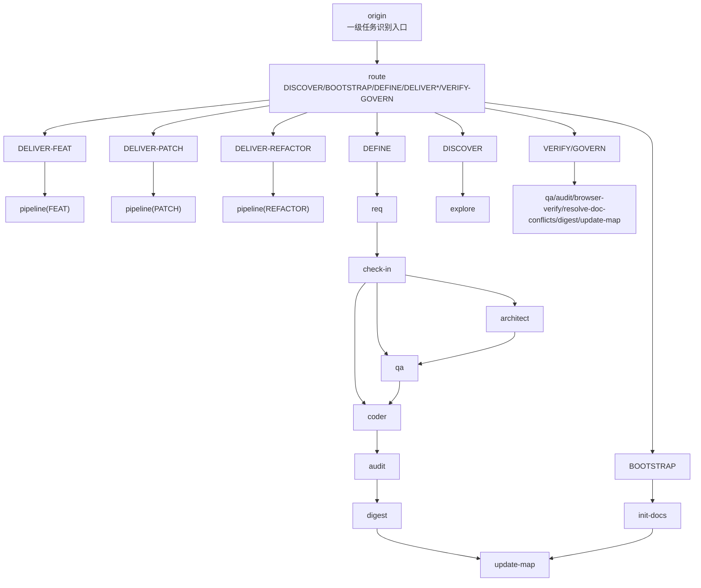
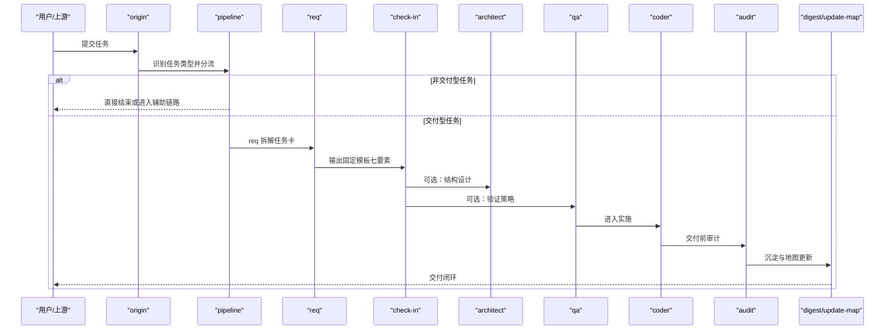
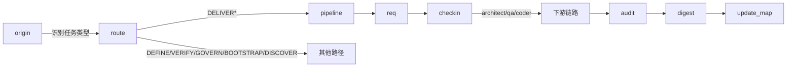

# 学习门禁机制

<cite>
**本文引用的文件**
- [SKILL-SYSTEM-DESIGN-V3.md](file://skills/web3-ai-agent/SKILL-SYSTEM-DESIGN-V3.md)
- [MAP-V3.md](file://skills/web3-ai-agent/MAP-V3.md)
- [check-in\SKILL.md](file://skills/web3-ai-agent/check-in/SKILL.md)
- [req\SKILL.md](file://skills/web3-ai-agent/req/SKILL.md)
- [architect\SKILL.md](file://skills/web3-ai-agent/architect/SKILL.md)
- [qa\SKILL.md](file://skills/web3-ai-agent/qa/SKILL.md)
- [coder\SKILL.md](file://skills/web3-ai-agent/coder/SKILL.md)
- [audit\SKILL.md](file://skills/web3-ai-agent/audit/SKILL.md)
- [digest\SKILL.md](file://skills/web3-ai-agent/digest/SKILL.md)
</cite>

## 目录
1. [简介](#简介)
2. [项目结构](#项目结构)
3. [核心组件](#核心组件)
4. [架构总览](#架构总览)
5. [详细组件分析](#详细组件分析)
6. [依赖分析](#依赖分析)
7. [性能考虑](#性能考虑)
8. [故障排查指南](#故障排查指南)
9. [结论](#结论)
10. [附录](#附录)

## 简介
本文件围绕 AI-Agent 技能系统中的“学习门禁”机制（V3 版本中更名为“实施前对齐点”，英文名 check-in）进行系统化说明。旨在帮助团队建立稳定、可追溯、可演化的质量控制体系，确保每个阶段的质量与完整性，防止跳过关键步骤。本文将详细解释固定输出模板的结构与内容要求，说明“问题、知识点、技术方案、完成标准”四个维度的含义与作用，并给出实施指南与常见问题解决方案。

## 项目结构
该仓库以技能（Skill）为基本单元，围绕“任务类型识别 → 定义 → 实施前对齐 → 设计/验证 → 实施 → 收尾”的主干流程展开。其中，check-in 作为“实施前对齐点”，仅对实施型任务强制，是进入设计与编码的前置门禁。

图表来源
- [MAP-V3.md: 1-166:1-166](file://skills/web3-ai-agent/MAP-V3.md#L1-L166)
- [SKILL-SYSTEM-DESIGN-V3.md: 265-286:265-286](file://skills/web3-ai-agent/SKILL-SYSTEM-DESIGN-V3.md#L265-L286)

章节来源
- [MAP-V3.md: 1-166:1-166](file://skills/web3-ai-agent/MAP-V3.md#L1-L166)
- [SKILL-SYSTEM-DESIGN-V3.md: 265-286:265-286](file://skills/web3-ai-agent/SKILL-SYSTEM-DESIGN-V3.md#L265-L286)

## 核心组件
- origin：识别任务类型，决定是否进入 pipeline 与后续路径。
- req：将 PRD/缺陷/重构目标拆解为最小可执行任务卡，统一包含来源、目标、范围、依赖、验收与下一跳。
- check-in：实施前对齐点，强制输出固定模板的七项内容，确保“问题、上下文、方案、边界、产物、标准、下一跳”闭环。
- architect：当任务涉及结构/接口/状态流/模块边界变化时，产出结构说明与契约。
- qa：定义并执行验证策略，FEAT 先红灯（RED），PATCH/REFACTOR 默认轻量验证或回归检查。
- coder：在边界清晰前提下实施代码，最多 10 轮自愈循环将 QA 红灯变为绿灯。
- audit：交付前风险审计，支持轻审/重审，总分 100，>=80 通过，<60 直接废弃。
- digest/update-map：沉淀经验并更新知识地图，形成闭环。

章节来源
- [SKILL-SYSTEM-DESIGN-V3.md: 441-601:441-601](file://skills/web3-ai-agent/SKILL-SYSTEM-DESIGN-V3.md#L441-L601)
- [check-in\SKILL.md: 1-56:1-56](file://skills/web3-ai-agent/check-in/SKILL.md#L1-L56)
- [req\SKILL.md: 1-57:1-57](file://skills/web3-ai-agent/req/SKILL.md#L1-L57)
- [architect\SKILL.md: 1-53:1-53](file://skills/web3-ai-agent/architect/SKILL.md#L1-L53)
- [qa\SKILL.md: 1-73:1-73](file://skills/web3-ai-agent/qa/SKILL.md#L1-L73)
- [coder\SKILL.md: 1-72:1-72](file://skills/web3-ai-agent/coder/SKILL.md#L1-L72)
- [audit\SKILL.md: 1-88:1-88](file://skills/web3-ai-agent/audit/SKILL.md#L1-L88)
- [digest\SKILL.md: 1-50:1-50](file://skills/web3-ai-agent/digest/SKILL.md#L1-L50)

## 架构总览
V3 的主执行骨架为“route -> define(按需) -> check-in -> design(按需) -> build -> closeout”。其中：
- route：origin + pipeline
- define：pm/prd/req（按需）
- check-in：实施前对齐点
- design：architect/qa（按需）
- build：coder
- closeout：audit/digest/update-map

图表来源
- [SKILL-SYSTEM-DESIGN-V3.md: 265-286:265-286](file://skills/web3-ai-agent/SKILL-SYSTEM-DESIGN-V3.md#L265-L286)
- [MAP-V3.md: 86-166:86-166](file://skills/web3-ai-agent/MAP-V3.md#L86-L166)

## 详细组件分析

### check-in：实施前对齐点（学习门禁）
- 定位：实施前门禁，不是全局门禁；仅对实施型任务强制。
- 强制适用场景：DELIVER-FEAT、DELIVER-PATCH、DELIVER-REFACTOR、DEFINE 中准备进入实施的任务。
- 默认不强制场景：DISCOVER、BOOTSTRAP、纯 VERIFY/GOVERN。
- 硬规则：
  - 没有 check-in，不进入 architect/qa/coder。
  - 必须明确“不做什么”。
  - 必须明确完成标准，否则视为未完成。

固定输出模板（七要素）：
- 本阶段要解决的问题
- 本阶段必须掌握的上下文
- 本阶段采用的方案
- 本阶段不做什么
- 本阶段产物
- 本阶段完成标准
- 进入下一阶段前要调用的 skill

作用：防止直接上手写代码、PATCH 只修表象、REFACTOR 只谈结构不谈等价、FEAT 在边界不清时扩 scope。

章节来源
- [check-in\SKILL.md: 1-56:1-56](file://skills/web3-ai-agent/check-in/SKILL.md#L1-L56)
- [SKILL-SYSTEM-DESIGN-V3.md: 395-437:395-437](file://skills/web3-ai-agent/SKILL-SYSTEM-DESIGN-V3.md#L395-L437)

### req：任务卡拆解（最小可执行单元）
- 输入：PRD、bug 描述、重构目标。
- 输出：需求卡/缺陷卡/重构卡，统一包含来源、目标、影响范围、依赖关系、验收标准、下一跳。
- 流程：确定任务对象 → 拆成最小交付单元 → 写清影响范围 → 写清验收条件。
- 规则：PATCH/REFACTOR 默认从 req 开始；若任务卡仍过大，应继续拆分。

章节来源
- [req\SKILL.md: 1-57:1-57](file://skills/web3-ai-agent/req/SKILL.md#L1-L57)

### architect：结构设计与契约
- 适用场景：涉及接口变化、状态流变化、模块边界变化、结构性重构。
- 输入：check-in、任务卡。
- 输出：主题架构说明，包含目标、模块边界、数据流、消息流、接口契约、错误处理、风险点。
- 规则：若只是纯局部修补且无结构变化，可跳过；若发现需求边界变化，回退 prd/req。

章节来源
- [architect\SKILL.md: 1-53:1-53](file://skills/web3-ai-agent/architect/SKILL.md#L1-L53)

### qa：验证策略与红绿灯
- 定位：定义并执行验证策略；FEAT 先红灯（RED），PATCH/REFACTOR 默认轻量验证或回归检查。
- 红绿灯规则：
  - FEAT：先红后绿；RED 目标是证明“当前未通过”，不直接修复。
  - PATCH/REFACTOR：默认不强制走完整 RED，但必须保留验证或回归检查。
- 输出：测试清单、红灯结果或验证结果、回归检查点。
- 规则：必须引用 check-in 的完成标准；REFACTOR 默认优先保障回归验证；PATCH 至少保留轻量回归检查。

章节来源
- [qa\SKILL.md: 1-73:1-73](file://skills/web3-ai-agent/qa/SKILL.md#L1-L73)

### coder：自愈式实施
- 定位：在边界已清楚的前提下实施代码，将 QA 红灯变为绿灯。
- 自愈循环：最多 10 轮，超过 10 轮仍未通过，立即终止并输出 STUCK 报告，请求人工介入。
- 规则：没有 check-in 不进入 coder；发现范围变大，回退 req/check-in/architect；优先跑相关验证，不默认全量重跑。

章节来源
- [coder\SKILL.md: 1-72:1-72](file://skills/web3-ai-agent/coder/SKILL.md#L1-L72)

### audit：风险审计与评分
- 定位：交付前最后一道风险关，不负责继续实现，只负责判断是否放行。
- 模式：轻审（PATCH/低风险 REFACTOR）、重审（FEAT/高风险 PATCH/REFACTOR/Web3 高风险任务）。
- 评分规则（满分 100）：
  - >=80：通过
  - 60-79：软拒绝，回退 coder 修正
  - <60：直接拒绝，终止并人工介入或重定方案
  - 一票否决：严重安全问题、明显越过 check-in 的非目标、关键不变量被破坏、高风险场景缺少风险提示或失败降级
- 输出：Audit 结果（模式、总分、结论、主要问题、风险建议）

章节来源
- [audit\SKILL.md: 1-88:1-88](file://skills/web3-ai-agent/audit/SKILL.md#L1-L88)

### digest/update-map：沉淀与地图更新
- digest：记录完成项、问题、经验与后续建议，强调“为什么卡住/为什么成功”。
- update-map：更新文档索引、当前状态与下一步入口。
- 规则：PATCH 可以轻量写，但不建议省略。

章节来源
- [digest\SKILL.md: 1-50:1-50](file://skills/web3-ai-agent/digest/SKILL.md#L1-L50)

### 门禁检查的四维模型与模板
固定输出模板的七项内容可映射到四维模型：
- 问题：本阶段要解决的问题
- 知识点：本阶段必须掌握的上下文
- 技术方案：本阶段采用的方案
- 完成标准：本阶段完成标准

作用：
- 问题：明确“要达成什么”，避免方向漂移。
- 知识点：确保“边界与前提清晰”，防止盲目实施。
- 技术方案：保证“方法可执行”，避免无效劳动。
- 完成标准：确保“可验证、可交付”，防止伪完成。

章节来源
- [check-in\SKILL.md: 25-35:25-35](file://skills/web3-ai-agent/check-in/SKILL.md#L25-L35)
- [SKILL-SYSTEM-DESIGN-V3.md: 407-418:407-418](file://skills/web3-ai-agent/SKILL-SYSTEM-DESIGN-V3.md#L407-L418)

### 门禁检查如何确保阶段质量与完整性
- 强制前置：没有 check-in 的输出，不得进入 architect/qa/coder，确保“先对齐、后实施”。
- 明确边界：必须明确“不做什么”，防止范围蔓延。
- 可验证标准：必须明确完成标准，否则视为未完成，确保“可衡量、可交付”。
- 可追溯闭环：digest/update-map 将经验沉淀与地图更新结合，形成“执行—反馈—优化”的闭环。

章节来源
- [check-in\SKILL.md: 51-56:51-56](file://skills/web3-ai-agent/check-in/SKILL.md#L51-L56)
- [digest\SKILL.md: 42-44:42-44](file://skills/web3-ai-agent/digest/SKILL.md#L42-L44)
- [MAP-V3.md: 158-166:158-166](file://skills/web3-ai-agent/MAP-V3.md#L158-L166)

### 实施指南
- 任务识别：由 origin 完成一级分类，区分 DISCOVER/BOOTSTRAP/DEFINE/DELIVER*/VERIFY/GOVERN。
- 定义阶段：按需进入 pm/prd/req，将模糊输入转为可实施对象；DELIVER* 默认进入 req。
- 实施前对齐：check-in 强制输出七要素；未满足“不做什么+完成标准”不得进入设计与编码。
- 设计与验证：architect/qa 按需进入；FEAT 先 RED，PATCH/REFACTOR 默认轻量验证。
- 实施与审计：coder 自愈循环最多 10 轮；audit 轻/重审并按评分阈值放行。
- 收尾与沉淀：digest 记录经验，update-map 更新状态与入口。

章节来源
- [SKILL-SYSTEM-DESIGN-V3.md: 222-286:222-286](file://skills/web3-ai-agent/SKILL-SYSTEM-DESIGN-V3.md#L222-L286)
- [MAP-V3.md: 86-166:86-166](file://skills/web3-ai-agent/MAP-V3.md#L86-L166)

### 常见问题与解决方案
- 问题：check-in 未明确“不做什么”
  - 解决：在模板中强制填写“本阶段不做什么”，并与完成标准联动。
- 问题：check-in 未明确完成标准
  - 解决：完成标准必须可验证，否则视为未完成，不得进入下一阶段。
- 问题：PATCH 只修表象不找根因
  - 解决：默认从 req 开始，必要时回退 prd/req，确保根因定位。
- 问题：REFACTOR 只谈结构不谈等价
  - 解决：必须进行回归验证，必要时插入 architect/qa/broswer-verify。
- 问题：FEAT 边界不清导致 scope 扩张
  - 解决：在 check-in 中明确“不做什么”，必要时回退 prd/req。
- 问题：coder 超过 10 轮仍未通过
  - 解决：立即终止并输出 STUCK 报告，请求人工介入。
- 问题：audit 评分低于阈值
  - 解决：<60 直接拒绝，>=80 通过，60-79 软拒绝回退 coder 修正。

章节来源
- [check-in\SKILL.md: 51-56:51-56](file://skills/web3-ai-agent/check-in/SKILL.md#L51-L56)
- [coder\SKILL.md: 39-48:39-48](file://skills/web3-ai-agent/coder/SKILL.md#L39-L48)
- [audit\SKILL.md: 70-77:70-77](file://skills/web3-ai-agent/audit/SKILL.md#L70-L77)

## 依赖分析
- 路由依赖：origin 决定是否进入 pipeline；只有 DELIVER* 任务进入 pipeline。
- 强制依赖：check-in 是进入 architect/qa/coder 的前置条件。
- 可选依赖：architect/audit/browser-verify/prd 可按需插入。
- 收尾依赖：digest/update-map 组成 closeout，确保闭环。

图表来源
- [MAP-V3.md: 86-166:86-166](file://skills/web3-ai-agent/MAP-V3.md#L86-L166)
- [SKILL-SYSTEM-DESIGN-V3.md: 222-286:222-286](file://skills/web3-ai-agent/SKILL-SYSTEM-DESIGN-V3.md#L222-L286)

章节来源
- [MAP-V3.md: 86-166:86-166](file://skills/web3-ai-agent/MAP-V3.md#L86-L166)
- [SKILL-SYSTEM-DESIGN-V3.md: 222-286:222-286](file://skills/web3-ai-agent/SKILL-SYSTEM-DESIGN-V3.md#L222-L286)

## 性能考虑
- 降低流程成本：非交付型任务不进入 pipeline，避免不必要的流程开销。
- 分层分流：按任务类型与风险等级分流，高风险任务增加约束，低风险任务减少消耗。
- 轻审/重审：audit 默认分轻重，避免小任务过度消耗。
- 自愈循环上限：coder 最多 10 轮，防止无限试错。

章节来源
- [SKILL-SYSTEM-DESIGN-V3.md: 24-42:24-42](file://skills/web3-ai-agent/SKILL-SYSTEM-DESIGN-V3.md#L24-L42)
- [SKILL-SYSTEM-DESIGN-V3.md: 40-41:40-41](file://skills/web3-ai-agent/SKILL-SYSTEM-DESIGN-V3.md#L40-L41)
- [coder\SKILL.md: 39-48:39-48](file://skills/web3-ai-agent/coder/SKILL.md#L39-L48)

## 故障排查指南
- 未进入设计/编码：检查是否完成 check-in 的七要素输出，特别是“不做什么”和“完成标准”。
- PATCH 修复无效：确认是否进行了回归检查；必要时回退 req/prd。
- REFACTOR 引入回归：优先进行回归验证，必要时插入 architect/qa。
- audit 评分过低：根据评分细则逐项整改，严重问题一票否决。
- digest 轻描淡写：强调“为什么卡住/为什么成功”，避免流水账。

章节来源
- [check-in\SKILL.md: 51-56:51-56](file://skills/web3-ai-agent/check-in/SKILL.md#L51-L56)
- [audit\SKILL.md: 64-77:64-77](file://skills/web3-ai-agent/audit/SKILL.md#L64-L77)
- [digest\SKILL.md: 46-50:46-50](file://skills/web3-ai-agent/digest/SKILL.md#L46-L50)

## 结论
V3 的学习门禁（check-in）通过“实施前对齐点”机制，将“问题、知识点、技术方案、完成标准”四个维度固化为可执行的七要素模板，确保每个阶段的质量与完整性。配合轻/重审、红绿灯、自愈循环等规则，形成“先对齐、后设计、再实施、最后审计”的稳健闭环，既能提升交付效率，又能有效控制风险。

## 附录
- 任务类型与推荐链路参考：[MAP-V3.md: 132-166:132-166](file://skills/web3-ai-agent/MAP-V3.md#L132-L166)
- 系统总体设计与原则：[SKILL-SYSTEM-DESIGN-V3.md: 24-694:24-694](file://skills/web3-ai-agent/SKILL-SYSTEM-DESIGN-V3.md#L24-L694)