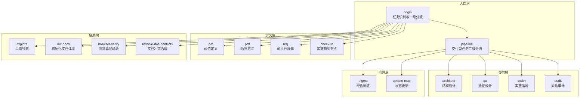
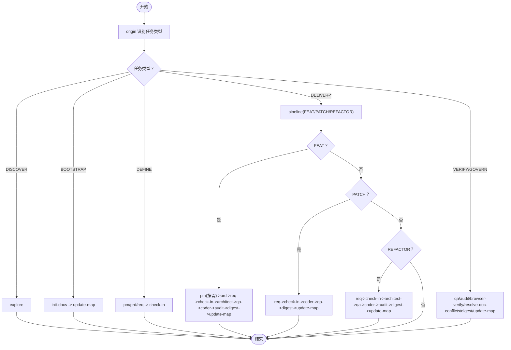
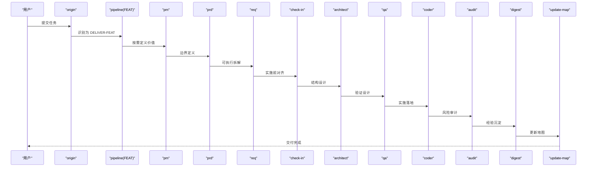
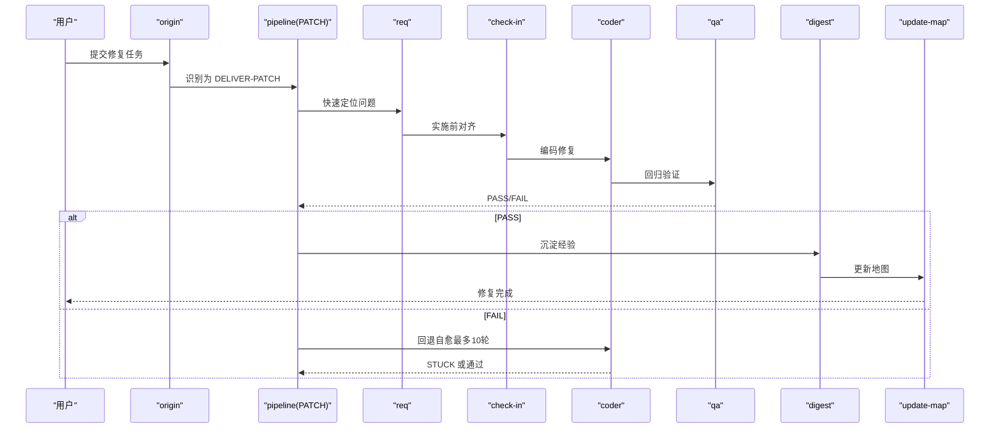
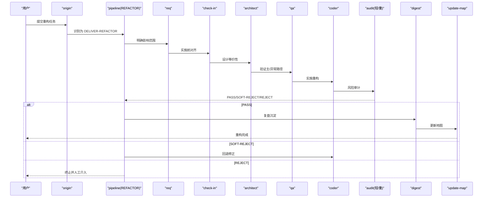
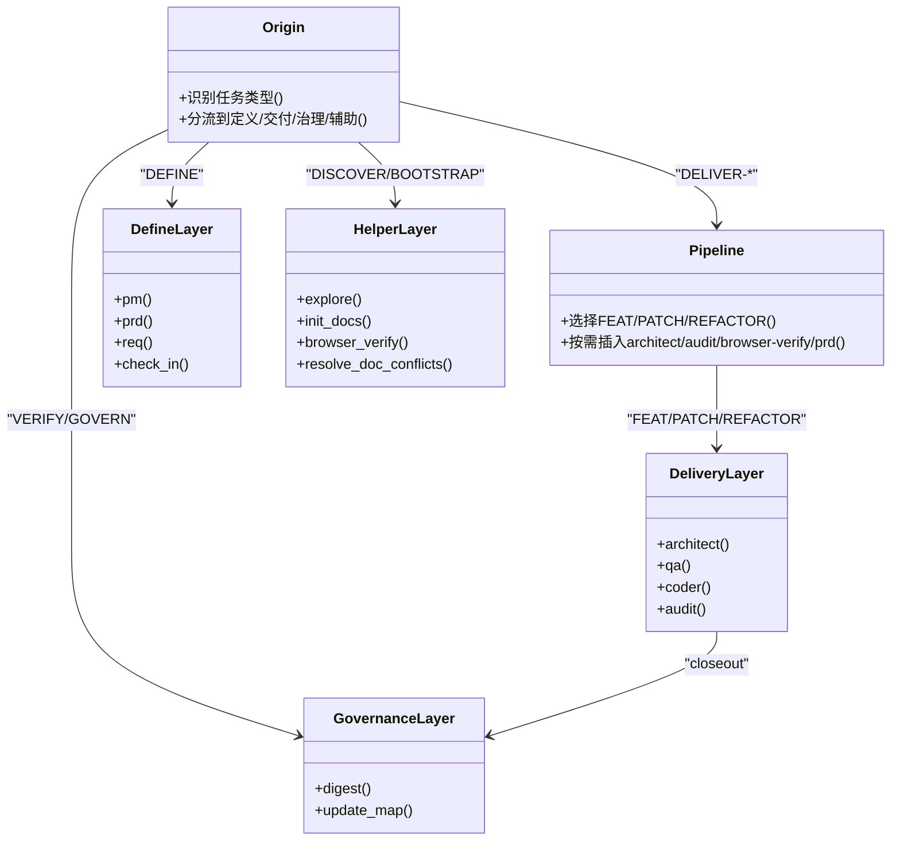

# 技能协作机制

<cite>
**本文引用的文件**
- [技能系统设计（V3）](file://skills/web3-ai-agent/SKILL-SYSTEM-DESIGN-V3.md)
- [技能总入口与流程图](file://skills/web3-ai-agent/SKILL.md)
- [技能地图（V3）](file://skills/web3-ai-agent/MAP-V3.md)
- [斜杠命令约定](file://skills/web3-ai-agent/COMMANDS.md)
- [architect 技能说明](file://skills/web3-ai-agent/architect/SKILL.md)
- [audit 技能说明](file://skills/web3-ai-agent/audit/SKILL.md)
- [browser-verify 技能说明](file://skills/web3-ai-agent/browser-verify/SKILL.md)
- [check-in 技能说明](file://skills/web3-ai-agent/check-in/SKILL.md)
- [coder 技能说明](file://skills/web3-ai-agent/coder/SKILL.md)
- [digest 技能说明](file://skills/web3-ai-agent/digest/SKILL.md)
- [explore 技能说明](file://skills/web3-ai-agent/explore/SKILL.md)
</cite>

## 目录
1. [简介](#简介)
2. [项目结构](#项目结构)
3. [核心组件](#核心组件)
4. [架构总览](#架构总览)
5. [详细组件分析](#详细组件分析)
6. [依赖分析](#依赖分析)
7. [性能考虑](#性能考虑)
8. [故障排查指南](#故障排查指南)
9. [结论](#结论)
10. [附录](#附录)

## 简介
本文件面向AI-Agent技能系统，聚焦12个核心技能模块之间的协作关系与数据流向，系统性阐述：
- 两级路由与调度：任务类型识别、技能选择算法、执行流程控制
- 主链路与回退链路：不同任务类型的主路径与按需插入的辅助链路
- 输入输出标准化：通过统一契约实现模块化协作
- 协作示例与最佳实践：帮助开发者快速理解并正确使用技能系统

## 项目结构
技能系统围绕“入口层 → 定义层 → 交付层 → 治理层 → 辅助层”的五层结构展开，核心入口为 origin 与 pipeline，分别负责任务类型识别与交付型任务的二级分流。

图表来源
- [技能系统设计（V3）:164-220](file://skills/web3-ai-agent/SKILL-SYSTEM-DESIGN-V3.md#L164-L220)
- [技能总入口与流程图:92-158](file://skills/web3-ai-agent/SKILL.md#L92-L158)
- [技能地图（V3）:1-166](file://skills/web3-ai-agent/MAP-V3.md#L1-L166)

章节来源
- [技能系统设计（V3）:164-220](file://skills/web3-ai-agent/SKILL-SYSTEM-DESIGN-V3.md#L164-L220)
- [技能总入口与流程图:92-158](file://skills/web3-ai-agent/SKILL.md#L92-L158)
- [技能地图（V3）:1-166](file://skills/web3-ai-agent/MAP-V3.md#L1-L166)

## 核心组件
- 入口层
  - origin：识别任务类型，决定进入定义层、交付层、治理层或辅助层
  - pipeline：仅对交付型任务进行二级分流（FEAT/PATCH/REFACTOR）
- 定义层
  - pm/prd/req：将模糊输入转化为可实施对象；check-in：实施前对齐点
- 交付层
  - architect：结构设计与契约定义
  - qa：验证设计与红绿灯规则
  - coder：实施落地与最多10轮自愈
  - audit：风险审计与评分阈值
- 治理层
  - digest：经验沉淀
  - update-map：状态更新与地图维护
- 辅助层
  - explore、init-docs、browser-verify、resolve-doc-conflicts

章节来源
- [技能系统设计（V3）:440-601](file://skills/web3-ai-agent/SKILL-SYSTEM-DESIGN-V3.md#L440-L601)
- [技能总入口与流程图:23-72](file://skills/web3-ai-agent/SKILL.md#L23-L72)

## 架构总览
系统采用“入口识别 + 分流 + 按需执行”的两层路由模型：
- 一级路由：origin 识别 DISCOVER/BOOTSTRAP/DEFINE/DELIVER-*/VERIFY/GOVERN
- 二级路由：仅 DELIVER-* 进入 pipeline，按 FEAT/PATCH/REFACTOR 选择执行深度
- 强制门禁：check-in 仅对实施型任务强制，防止盲目进入交付层

图表来源
- [技能系统设计（V3）:222-281](file://skills/web3-ai-agent/SKILL-SYSTEM-DESIGN-V3.md#L222-L281)
- [技能地图（V3）:86-166](file://skills/web3-ai-agent/MAP-V3.md#L86-L166)
- [技能总入口与流程图:92-158](file://skills/web3-ai-agent/SKILL.md#L92-L158)

章节来源
- [技能系统设计（V3）:222-281](file://skills/web3-ai-agent/SKILL-SYSTEM-DESIGN-V3.md#L222-L281)
- [技能地图（V3）:86-166](file://skills/web3-ai-agent/MAP-V3.md#L86-L166)
- [技能总入口与流程图:92-158](file://skills/web3-ai-agent/SKILL.md#L92-L158)

## 详细组件分析

### 路由与调度机制
- 任务类型识别
  - origin 依据用户输入与上下文判断任务类型，确保所有外部调用均从 origin 进入
- 技能选择算法
  - 非交付型任务：直接进入对应分支（探索/初始化/定义/治理）
  - 交付型任务：进入 pipeline，按 FEAT/PATCH/REFACTOR 选择执行深度与必经节点
- 执行流程控制
  - check-in 为实施前门禁，未通过不得进入 architect/qa/coder
  - audit 评分阈值与轻重审策略决定是否进入 digest 或回退 coder

章节来源
- [技能系统设计（V3）:222-262](file://skills/web3-ai-agent/SKILL-SYSTEM-DESIGN-V3.md#L222-L262)
- [技能总入口与流程图:23-72](file://skills/web3-ai-agent/SKILL.md#L23-L72)
- [技能地图（V3）:86-100](file://skills/web3-ai-agent/MAP-V3.md#L86-L100)

### 主链路与回退链路

#### 主链路（route → define(按需) → check-in → design(按需) → build → closeout）
- route：origin + pipeline
- define：pm/prd/req（按需）
- check-in：实施前对齐点
- design：architect/qa（按需）
- build：coder
- closeout：audit（轻/重）→ digest → update-map

章节来源
- [技能系统设计（V3）:265-285](file://skills/web3-ai-agent/SKILL-SYSTEM-DESIGN-V3.md#L265-L285)

#### 回退链路
- coder 自愈：最多10轮，超限输出 STUCK 报告并终止，请求人工介入
- audit 轻/重审：分数低于阈值时回退 coder 或终止
- browser-verify：前端/交互问题回退 coder
- 文档冲突：resolve-doc-conflicts 后可继续 digest/update-map

章节来源
- [技能系统设计（V3）:696-719](file://skills/web3-ai-agent/SKILL-SYSTEM-DESIGN-V3.md#L696-L719)
- [coder 技能说明:18-37](file://skills/web3-ai-agent/coder/SKILL.md#L18-L37)
- [audit 技能说明:52-77](file://skills/web3-ai-agent/audit/SKILL.md#L52-L77)
- [browser-verify 技能说明:48-52](file://skills/web3-ai-agent/browser-verify/SKILL.md#L48-L52)

### 输入输出标准化与契约
- check-in 强制输出7项：问题、上下文、方案、不做什么、产物、完成标准、下一跳 skill
- architect 输出：主题架构说明（目标、模块边界、数据流、消息流、接口契约、错误处理、风险点）
- audit 输出：模式、总分、结论、主要问题、风险建议
- digest 输出：完成项、问题、学到的经验、未解决问题、下一步建议
- browser-verify 输出：页面/入口、验证步骤、结果（PASS/PARTIAL/FAIL）、发现的问题
- coder 输出：代码修改、验证结果；若失败输出 STUCK 报告

章节来源
- [check-in 技能说明:25-35](file://skills/web3-ai-agent/check-in/SKILL.md#L25-L35)
- [architect 技能说明:20-32](file://skills/web3-ai-agent/architect/SKILL.md#L20-L32)
- [audit 技能说明:41-50](file://skills/web3-ai-agent/audit/SKILL.md#L41-L50)
- [digest 技能说明:18-28](file://skills/web3-ai-agent/digest/SKILL.md#L18-L28)
- [browser-verify 技能说明:21-29](file://skills/web3-ai-agent/browser-verify/SKILL.md#L21-L29)
- [coder 技能说明:55-59](file://skills/web3-ai-agent/coder/SKILL.md#L55-L59)

### 技能协作序列图

#### FEAT 交付主链路

图表来源
- [技能系统设计（V3）:292-327](file://skills/web3-ai-agent/SKILL-SYSTEM-DESIGN-V3.md#L292-L327)
- [技能地图（V3）:104-121](file://skills/web3-ai-agent/MAP-V3.md#L104-L121)

#### PATCH 回归修复链路

图表来源
- [技能系统设计（V3）:328-360](file://skills/web3-ai-agent/SKILL-SYSTEM-DESIGN-V3.md#L328-L360)
- [技能地图（V3）:110-121](file://skills/web3-ai-agent/MAP-V3.md#L110-L121)

#### REFACTOR 设计优先链路

图表来源
- [技能系统设计（V3）:360-392](file://skills/web3-ai-agent/SKILL-SYSTEM-DESIGN-V3.md#L360-L392)
- [技能地图（V3）:122-131](file://skills/web3-ai-agent/MAP-V3.md#L122-L131)

### 技能类关系图

图表来源
- [技能系统设计（V3）:164-220](file://skills/web3-ai-agent/SKILL-SYSTEM-DESIGN-V3.md#L164-L220)
- [技能地图（V3）:1-166](file://skills/web3-ai-agent/MAP-V3.md#L1-L166)

## 依赖分析
- 耦合与内聚
  - 入口层与定义层耦合度低，便于独立演进
  - 交付层内部强关联（architect→qa→coder→audit），形成闭环
  - 治理层与辅助层作为收尾与只读能力，降低对主链路干扰
- 关键依赖链
  - check-in 是交付层的前置依赖，未通过则阻断后续
  - audit 评分决定是否进入 digest，或回退 coder
  - browser-verify 仅在前端/交互场景按需插入，不影响默认路径

章节来源
- [技能系统设计（V3）:395-437](file://skills/web3-ai-agent/SKILL-SYSTEM-DESIGN-V3.md#L395-L437)
- [技能地图（V3）:158-166](file://skills/web3-ai-agent/MAP-V3.md#L158-L166)

## 性能考虑
- 路由分流减少无效执行：非交付型任务不进入 pipeline，降低流程开销
- 按需插入：pm/prd/architect/audit/browser-verify 仅在必要时触发，避免过度验证
- coder 自愈上限：10轮自愈避免长时间无效循环，提升吞吐
- 轻审/重审策略：根据任务风险动态分配资源，平衡质量与效率

## 故障排查指南
- 无法进入交付层
  - 检查是否通过 check-in；未通过则阻断 architect/qa/coder
- audit 未通过
  - 轻审：<80 时回退 coder；重审：<60 直接终止并人工介入
- coder 长时间未通过
  - 超过10轮输出 STUCK 报告，需人工介入定位阻塞点
- 前端/交互问题
  - 使用 browser-verify 进行可视化验收，失败回退 coder

章节来源
- [技能系统设计（V3）:696-719](file://skills/web3-ai-agent/SKILL-SYSTEM-DESIGN-V3.md#L696-L719)
- [check-in 技能说明:51-56](file://skills/web3-ai-agent/check-in/SKILL.md#L51-L56)
- [audit 技能说明:64-77](file://skills/web3-ai-agent/audit/SKILL.md#L64-L77)
- [coder 技能说明:39-48](file://skills/web3-ai-agent/coder/SKILL.md#L39-L48)
- [browser-verify 技能说明:48-52](file://skills/web3-ai-agent/browser-verify/SKILL.md#L48-L52)

## 结论
该技能系统通过“入口识别 + 分流 + 按需执行”的两层路由模型，实现了对不同类型任务的高效处理。check-in 作为实施前门禁，配合 audit 的轻重审策略与 coder 的自愈上限，既保证质量又兼顾效率。通过统一的输入输出契约，各技能模块得以模块化协作，形成可扩展、可治理的智能体工作流。

## 附录

### 推荐使用方式与命令约定
- 默认推荐入口：/origin + 任务描述
- 命令总表：/origin、/pipeline feat/patch/refactor、/pm、/prd、/req、/check-in、/architect、/qa、/coder、/audit、/digest、/update-map、/explore、/init-docs、/browser-verify、/resolve-doc-conflicts

章节来源
- [斜杠命令约定:20-50](file://skills/web3-ai-agent/COMMANDS.md#L20-L50)
- [技能总入口与流程图:178-224](file://skills/web3-ai-agent/SKILL.md#L178-L224)