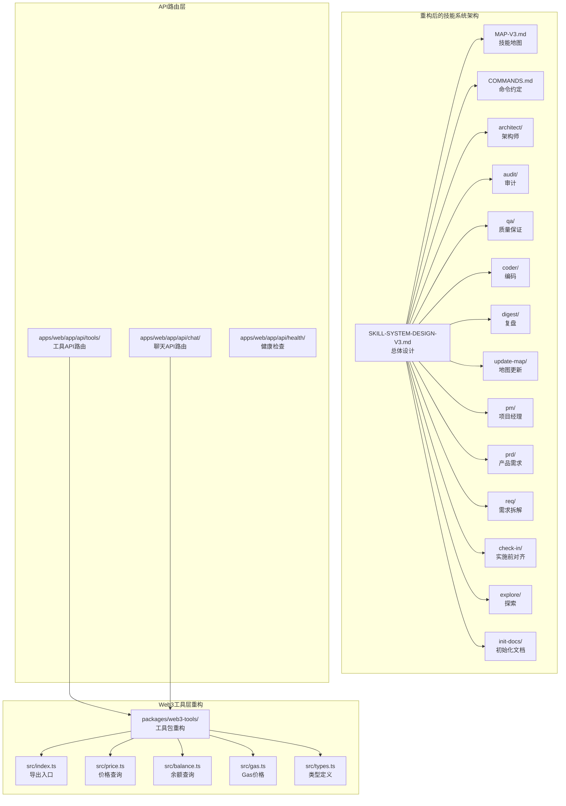
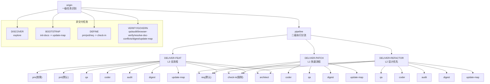
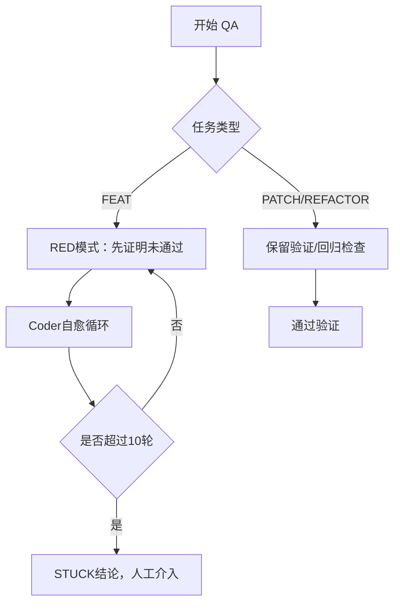
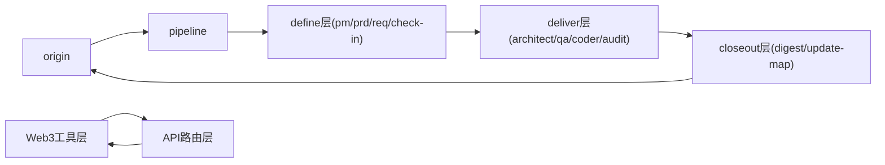

# 技能系统架构

<cite>
**本文引用的文件**
- [SKILL-SYSTEM-DESIGN-V3.md](file://skills/x-ray/SKILL-SYSTEM-DESIGN-V3.md)
- [MAP-V3.md](file://skills/x-ray/MAP-V3.md)
- [COMMANDS.md](file://skills/x-ray/COMMANDS.md)
- [architect/SKILL.md](file://skills/x-ray/architect/SKILL.md)
- [audit/SKILL.md](file://skills/x-ray/audit/SKILL.md)
- [qa/SKILL.md](file://skills/x-ray/qa/SKILL.md)
- [coder/SKILL.md](file://skills/x-ray/coder/SKILL.md)
- [digest/SKILL.md](file://skills/x-ray/digest/SKILL.md)
- [update-map/SKILL.md](file://skills/x-ray/update-map/SKILL.md)
- [pm/SKILL.md](file://skills/x-ray/pm/SKILL.md)
- [prd/SKILL.md](file://skills/x-ray/prd/SKILL.md)
- [req/SKILL.md](file://skills/x-ray/req/SKILL.md)
- [check-in/SKILL.md](file://skills/x-ray/check-in/SKILL.md)
- [explore/SKILL.md](file://skills/x-ray/explore/SKILL.md)
- [init-docs/SKILL.md](file://skills/x-ray/init-docs/SKILL.md)
- [ARCHITECTURE.md](file://ARCHITECTURE.md)
- [package.json](file://packages/web3-tools/package.json)
- [index.ts](file://packages/web3-tools/src/index.ts)
- [price.ts](file://packages/web3-tools/src/price.ts)
- [balance.ts](file://packages/web3-tools/src/balance.ts)
- [gas.ts](file://packages/web3-tools/src/gas.ts)
- [types.ts](file://packages/web3-tools/src/types.ts)
- [route.ts](file://apps/web/app/api/tools/route.ts)
- [tsconfig.json](file://packages/web3-tools/tsconfig.json)
- [turbo.json](file://turbo.json)
</cite>

## 更新摘要
**所做更改**
- 新增Web3工具重构完成的架构说明，包括代码结构优化和模块化设计
- 更新工具层与技能系统的集成关系，反映新的Web3工具包架构
- 补充Web3工具API路由的实现细节和错误处理机制
- 完善工具层的类型定义和数据流设计
- 更新项目构建配置和依赖管理策略

## 目录
1. [简介](#简介)
2. [项目结构](#项目结构)
3. [核心组件](#核心组件)
4. [架构总览](#架构总览)
5. [详细组件分析](#详细组件分析)
6. [Web3工具重构](#web3工具重构)
7. [依赖分析](#依赖分析)
8. [性能考量](#性能考量)
9. [故障排查指南](#故障排查指南)
10. [结论](#结论)
11. [附录](#附录)

## 简介
本架构文档面向架构师与高级开发者，系统化解析Web3 AI Agent技能系统V3的设计理念与实现蓝图。该系统以"文档驱动 + 流程型多技能 + 门禁式质量控制"为核心，构建可路由、可裁剪、可回退的技能操作系统，覆盖从探索、定义、交付到治理的全生命周期。V3版本将系统从单一流水线升级为可分流的操作系统，通过七类任务类型和三层执行深度，实现高效的质量控制和知识沉淀。

**更新** 本次更新重点反映了Web3工具重构完成后的最新架构状态，包括模块化设计、类型安全和API路由优化。

## 项目结构
技能系统位于skills/x-ray目录，采用"设计稿 + 地图 + 命令约定 + 模板规范 + 单模块技能定义"的结构化组织方式，每个技能模块都有独立的SKILL.md文件定义其职责、输入输出和执行规则。新增的Web3工具重构完成后，形成了更加清晰的分层架构。

**图表来源**
- [ARCHITECTURE.md:40-61](file://ARCHITECTURE.md#L40-L61)
- [package.json:1-24](file://packages/web3-tools/package.json#L1-L24)
- [index.ts:1-7](file://packages/web3-tools/src/index.ts#L1-L7)
- [route.ts:1-46](file://apps/web/app/api/tools/route.ts#L1-L46)

**章节来源**
- [SKILL-SYSTEM-DESIGN-V3.md:1-719](file://skills/x-ray/SKILL-SYSTEM-DESIGN-V3.md#L1-L719)
- [MAP-V3.md:1-211](file://skills/x-ray/MAP-V3.md#L1-L211)
- [COMMANDS.md:1-81](file://skills/x-ray/COMMANDS.md#L1-L81)
- [ARCHITECTURE.md:40-159](file://ARCHITECTURE.md#L40-L159)

## 核心组件

### 五层技能架构
V3版本将技能系统重新组织为五个层次，每个层次都有明确的职责边界：

**入口层** (`origin`, `pipeline`)
- 负责任务类型识别和二级路由分流
- 仅对交付型任务进入pipeline

**定义层** (`pm`, `prd`, `req`, `check-in`)
- 从模糊意图到清晰任务的转换
- 实施前对齐点，强制门禁

**交付层** (`architect`, `qa`, `coder`, `audit`)
- 设计、验证、实现、风险审计
- 核心执行链路

**治理层** (`digest`, `update-map`)
- 经验沉淀和状态更新
- 交付闭环

**辅助层** (`explore`, `init-docs`, `browser-verify`, `resolve-doc-conflicts`)
- 只读探索、初始化、验收、冲突治理
- 不与主交付链混用

**章节来源**
- [SKILL-SYSTEM-DESIGN-V3.md:164-220](file://skills/x-ray/SKILL-SYSTEM-DESIGN-V3.md#L164-L220)
- [SKILL-SYSTEM-DESIGN-V3.md:439-601](file://skills/x-ray/SKILL-SYSTEM-DESIGN-V3.md#L439-L601)
- [SKILL-SYSTEM-DESIGN-V3.md:696-719](file://skills/x-ray/SKILL-SYSTEM-DESIGN-V3.md#L696-L719)

### 七类任务模型
V3不再局限于传统的FEAT/PATCH/REFACTOR三类，而是定义了七种任务类型：

**DISCOVER** (`explore`)
- 只读探索，不进入交付链
- 适用于新人熟悉项目、查询模块、定位代码

**BOOTSTRAP** (`init-docs` -> `update-map`)
- 新项目初始化和文档重建
- 建立初始地图、索引、基础文档网络

**DEFINE** (`pm`/`prd`/`req` -> `check-in`)
- 目标模糊到清晰任务的转换
- 价值对齐和范围定义

**DELIVER-FEAT** (L3全流程)
- 新功能、新模块、新能力
- 完整的FEAT流程：pm(按需) -> prd -> req -> check-in -> architect -> qa -> coder -> audit -> digest -> update-map

**DELIVER-PATCH** (L1快速流程)
- bug修复、回归修复、边界case修复
- 快速修复流程：req -> check-in -> coder -> qa -> digest -> update-map

**DELIVER-REFACTOR** (L2设计优先)
- 重构、模块拆分、性能优化
- 设计优先流程：req -> check-in -> architect -> qa -> coder -> audit -> digest -> update-map

**VERIFY/GOVERN** (治理)
- 浏览器验收、文档冲突解决、发布前复核
- 验证和治理流程：qa -> audit -> browser-verify -> resolve-doc-conflicts -> digest -> update-map

**章节来源**
- [SKILL-SYSTEM-DESIGN-V3.md:45-161](file://skills/x-ray/SKILL-SYSTEM-DESIGN-V3.md#L45-L161)
- [MAP-V3.md:177-201](file://skills/x-ray/MAP-V3.md#L177-L201)

## 架构总览
V3系统以"route -> define(按需) -> check-in -> design(按需) -> build -> closeout"为主线，将主链路抽象为6段，既保证交付效率，又保留文档沉淀与质量控制。

**图表来源**
- [MAP-V3.md:3-129](file://skills/x-ray/MAP-V3.md#L3-L129)
- [SKILL-SYSTEM-DESIGN-V3.md:265-393](file://skills/x-ray/SKILL-SYSTEM-DESIGN-V3.md#L265-L393)

**章节来源**
- [MAP-V3.md:1-211](file://skills/x-ray/MAP-V3.md#L1-L211)
- [SKILL-SYSTEM-DESIGN-V3.md:265-393](file://skills/x-ray/SKILL-SYSTEM-DESIGN-V3.md#L265-L393)

## 详细组件分析

### 路由与调度机制

#### 一级路由：origin任务识别
`origin`技能负责识别七种任务类型：
- DISCOVER：explore
- BOOTSTRAP：init-docs -> update-map  
- DEFINE：pm/prd/req -> check-in
- DELIVER-*：进入pipeline分流
- VERIFY/GOVERN：qa/audit/browser-verify/resolve-doc-conflicts/digest/update-map

#### 二级路由：pipeline执行分流
只有DELIVER-FEAT/PATCH/REFACTOR三类任务进入pipeline，每类任务都有不同的执行深度和必经技能。

#### check-in门禁机制
check-in是实施前对齐点，强制适用于：
- DELIVER-FEAT、DELIVER-PATCH、DELIVER-REFACTOR
- DEFINE中准备进入实施的任务

**章节来源**
- [MAP-V3.md:86-157](file://skills/x-ray/MAP-V3.md#L86-L157)
- [SKILL-SYSTEM-DESIGN-V3.md:222-263](file://skills/x-ray/SKILL-SYSTEM-DESIGN-V3.md#L222-L263)

### 质量控制与执行硬规则

#### QA红绿灯规则
- FEAT默认先执行RED模式，证明"当前未通过"
- PATCH/REFACTOR默认保留验证或回归检查
- RED模式最多运行2次，验证阶段先负责RED

#### Coder自愈规则
- coder负责把QA的RED变成GREEN
- 最多10轮自愈循环，超限输出STUCK报告并人工介入
- 超过10轮仍未通过，必须终止并输出卡住原因

#### Audit评分规则
- 完整评分100分：需求一致性25分、结构契约一致性15分、安全风险20分、代码质量15分、回归风险10分、文档收尾10分、场景治理5分
- >=80：通过
- 60-79：软拒绝，回退coder修正
- <60：直接拒绝，当前方案废弃
- 严重安全问题、关键不变量破坏、高风险边界缺失可一票否决

**图表来源**
- [SKILL-SYSTEM-DESIGN-V3.md:700-719](file://skills/x-ray/SKILL-SYSTEM-DESIGN-V3.md#L700-L719)

**章节来源**
- [SKILL-SYSTEM-DESIGN-V3.md:700-719](file://skills/x-ray/SKILL-SYSTEM-DESIGN-V3.md#L700-L719)

### 技能模块详细职责

#### 定义层技能
**PM技能**：目标模糊时的价值定义，明确用户、痛点、价值主张和MVP范围

**PRD技能**：正式范围定义，明确做什么、不做什么、验收标准和风险边界

**REQ技能**：最小可执行任务卡拆解，明确影响范围、依赖关系和验收条件

**Check-in技能**：实施前对齐点，强制输出问题、上下文、方案、不做什么、产物、完成标准、下一跳

#### 交付层技能
**Architect技能**：模块边界、接口契约、数据/消息流设计，支持最多10轮自愈

**QA技能**：验证策略定义，FEAT先RED后GREEN，PATCH/REFACTOR保留回归检查

**Coder技能**：实施落地，最多10轮自愈循环，超限输出STUCK报告

**Audit技能**：风险审计，支持轻审和重审两种模式，默认分轻重

#### 治理层技能
**Digest技能**：阶段沉淀，记录完成项、问题、经验和后续建议

**Update-Map技能**：状态更新，维护当前项目状态和下一步入口

#### 辅助层技能
**Explore技能**：只读探索，不进入交付链

**Init-Docs技能**：新项目初始化文档体系

**Browser-Verify技能**：浏览器层验收

**Resolve-Doc-Conflicts技能**：文档冲突治理

**章节来源**
- [SKILL-SYSTEM-DESIGN-V3.md:439-601](file://skills/x-ray/SKILL-SYSTEM-DESIGN-V3.md#L439-L601)
- [architect/SKILL.md:1-53](file://skills/x-ray/architect/SKILL.md#L1-L53)
- [audit/SKILL.md:1-88](file://skills/x-ray/audit/SKILL.md#L1-L88)
- [qa/SKILL.md:1-73](file://skills/x-ray/qa/SKILL.md#L1-L73)
- [coder/SKILL.md:1-72](file://skills/x-ray/coder/SKILL.md#L1-L72)
- [digest/SKILL.md:1-50](file://skills/x-ray/digest/SKILL.md#L1-L50)
- [update-map/SKILL.md:1-47](file://skills/x-ray/update-map/SKILL.md#L1-L47)
- [pm/SKILL.md:1-53](file://skills/x-ray/pm/SKILL.md#L1-L53)
- [prd/SKILL.md:1-54](file://skills/x-ray/prd/SKILL.md#L1-L54)
- [req/SKILL.md:1-57](file://skills/x-ray/req/SKILL.md#L1-L57)
- [check-in/SKILL.md:1-56](file://skills/x-ray/check-in/SKILL.md#L1-L56)
- [explore/SKILL.md:1-42](file://skills/x-ray/explore/SKILL.md#L1-L42)
- [init-docs/SKILL.md:1-41](file://skills/x-ray/init-docs/SKILL.md#L1-L41)

## Web3工具重构

### 工具包架构设计
Web3工具重构完成后，形成了高度模块化的工具包架构，采用统一的导出入口和类型定义系统：

**模块化设计**
- `src/index.ts` 作为统一导出入口，集中暴露所有工具函数
- 每个工具功能独立封装在对应的模块文件中
- 统一的类型定义确保类型安全和IDE支持

**类型安全系统**
- `src/types.ts` 定义了完整的工具结果类型和数据接口
- 每个工具函数都返回标准化的 `ToolResult<T>` 结构
- 强类型约束确保工具调用的一致性和可靠性

**章节来源**
- [package.json:1-24](file://packages/web3-tools/package.json#L1-L24)
- [index.ts:1-7](file://packages/web3-tools/src/index.ts#L1-L7)
- [types.ts:1-34](file://packages/web3-tools/src/types.ts#L1-L34)

### 工具实现细节

#### 价格查询工具
`getETHPrice()` 提供多数据源容错的价格查询功能：
- 支持 Binance 和 Huobi 两个主要数据源
- 自动代理配置支持国内网络访问
- 10秒超时保护和错误降级机制
- 标准化的价格数据结构包含24小时涨跌幅

#### 钱包余额查询
`getWalletBalance()` 提供以太坊钱包余额查询：
- 地址格式验证确保输入有效性
- 支持自定义RPC节点配置
- 使用ethers.js进行链上查询
- 标准化的余额数据结构

#### Gas价格查询
`getGasPrice()` 提供当前网络Gas价格信息：
- 支持EIP-1559 Fee Market结构
- 返回传统gasPrice和新式费用参数
- 支持自定义RPC节点配置

**章节来源**
- [price.ts:1-84](file://packages/web3-tools/src/price.ts#L1-L84)
- [balance.ts:1-53](file://packages/web3-tools/src/balance.ts#L1-L53)
- [gas.ts:1-43](file://packages/web3-tools/src/gas.ts#L1-L43)

### API路由集成
重构后的Web3工具通过Next.js API路由进行集成：

**路由设计**
- `/api/tools` 路由统一处理所有Web3工具调用
- 支持动态工具名称和参数传递
- 标准化的错误处理和响应格式
- 内置超时保护和异常捕获

**安全机制**
- 工具调用参数验证
- 错误响应标准化
- 异常情况下的优雅降级
- 日志记录和调试支持

**章节来源**
- [route.ts:1-46](file://apps/web/app/api/tools/route.ts#L1-L46)

### 构建配置优化
重构后的项目采用了现代化的构建配置：

**TypeScript配置**
- ES2020目标和ESNext模块解析
- 严格模式确保类型安全
- 声明文件自动生成
- Bundler模块解析优化

**构建脚本**
- tsup编译器支持CJS和ESM格式
- 开发模式自动监听文件变更
- 类型检查独立执行
- 产物目录结构清晰

**章节来源**
- [tsconfig.json:1-18](file://packages/web3-tools/tsconfig.json#L1-L18)
- [package.json:8-12](file://packages/web3-tools/package.json#L8-L12)

## 依赖分析

### 耦合关系
- origin与pipeline：origin决策，pipeline调度
- define层与deliver层：define层为deliver层提供清晰输入
- check-in与deliver层：check-in是deliver层的前置门禁
- closeout(audit/digest/update-map)与deliver层：交付闭环
- Web3工具层与API路由：工具函数通过API路由暴露

### 外部依赖
- 宿主产品UI对命令弹窗的支持程度
- 文档与模板的版本一致性
- 各技能模块间的接口契约一致性
- Web3工具的外部API依赖和网络配置

**图表来源**
- [MAP-V3.md:86-157](file://skills/x-ray/MAP-V3.md#L86-L157)
- [SKILL-SYSTEM-DESIGN-V3.md:265-281](file://skills/x-ray/SKILL-SYSTEM-DESIGN-V3.md#L265-L281)
- [ARCHITECTURE.md:89-96](file://ARCHITECTURE.md#L89-L96)

**章节来源**
- [MAP-V3.md:86-157](file://skills/x-ray/MAP-V3.md#L86-L157)
- [SKILL-SYSTEM-DESIGN-V3.md:265-281](file://skills/x-ray/SKILL-SYSTEM-DESIGN-V3.md#L265-L281)
- [ARCHITECTURE.md:89-96](file://ARCHITECTURE.md#L89-L96)

## 性能考量

### 路由分流优化
- 通过origin+pipeline的两级分流，避免非交付任务进入冗长主链路
- DISCOVER/BOOTSTRAP/VERIFY/GOVERN任务直接处理，不占用pipeline资源

### 执行深度控制
- L1(Light)：DELIVER-PATCH，快速修复
- L2(Design-first)：DELIVER-REFACTOR，设计优先
- L3(Full)：DELIVER-FEAT，完整流程

### 质量前置控制
- check-in将"是否具备实施条件"前置，减少返工
- QA先行RED，避免无效实现

### 自愈循环限制
- Coder最多10轮自愈循环，超限立即终止
- 防止无限试错和资源浪费

### Web3工具性能优化
- 多数据源容错机制提升可用性
- 代理配置支持网络环境适配
- 超时保护防止阻塞等待
- 标准化响应格式便于缓存和复用

## 故障排查指南

### 路由问题
**未进入pipeline**
- 检查origin是否正确识别任务类型
- 确认任务是否属于DELIVER-*类型

**未进入check-in**
- 确认任务是否属于需要实施前对齐的类型
- 检查是否遗漏check-in输出结构

### 质量控制问题
**QA无法推进**
- FEAT默认RED，确认RED是否有效执行
- PATCH/REFACTOR是否保留验证或回归检查

**Coder卡住**
- 是否超过10轮自愈循环
- 是否存在不可修复的边界问题

**Audit未通过**
- 评分是否低于阈值
- 是否存在严重风险或一票否决项

### 技能执行问题
**技能顺序错误**
- 检查技能间的依赖关系
- 确认必需技能是否按顺序执行

**输出不符合规范**
- 检查技能输出模板
- 确认必需字段是否完整

### Web3工具问题
**工具调用失败**
- 检查API路由配置和权限
- 确认外部API服务可用性
- 验证网络代理配置

**数据查询异常**
- 检查输入参数格式和有效性
- 确认RPC节点配置正确
- 查看错误日志获取详细信息

**章节来源**
- [SKILL-SYSTEM-DESIGN-V3.md:700-719](file://skills/x-ray/SKILL-SYSTEM-DESIGN-V3.md#L700-L719)
- [route.ts:36-45](file://apps/web/app/api/tools/route.ts#L36-L45)

## 结论
Web3 AI Agent技能系统V3以"可路由、可裁剪、可回退"为核心设计理念，通过origin/pipeline的两级分流与check-in的门禁式质量控制，将文档驱动与自动化执行有机结合。V3版本将系统从单一流水线升级为可分流的操作系统，通过七类任务类型和三层执行深度，实现了高效的质量控制和知识沉淀。

**更新** Web3工具重构完成后，系统在保持原有架构优势的基础上，进一步提升了代码质量和可维护性。重构后的工具包采用模块化设计、类型安全和统一导出入口，为技能系统的扩展和维护奠定了坚实基础。

系统的核心优势包括：
- **灵活的路由机制**：七类任务类型支持不同场景需求
- **严格的门禁控制**：check-in确保实施前对齐
- **分层的质量控制**：QA、Coder、Audit三级质量保障
- **可扩展的架构**：五层技能架构支持持续演进
- **完善的治理机制**：digest和update-map确保知识沉淀
- **模块化的工具层**：Web3工具重构提升代码质量
- **标准化的API集成**：统一的工具调用接口

V3版本正式将"实施前对齐点"从learn-gate更名为check-in，强化其在交付流程中的定位，配合红绿灯、自愈与审计评分等硬规则，系统在保证质量的同时兼顾效率，适合在Web3 AI Agent项目中长期演进与规模化应用。

## 附录

### 使用建议
- 统一使用"/origin"命令开始任务
- 交付型任务优先走pipeline(FEAT/PATCH/REFACTOR)
- 实施前必须执行check-in
- FEAT默认QA先RED，Coder最多10轮自愈，Audit>=80才放行
- Web3工具调用遵循统一的API路由规范

### 命令约定
- /origin：任务入口
- /pipeline feat/patch/refactor：交付型任务分流
- /pm：项目经理技能
- /prd：产品需求技能  
- /req：需求拆解技能
- /check-in：实施前对齐点
- /architect：架构设计技能
- /qa：质量保证技能
- /coder：编码实现技能
- /audit：风险审计技能
- /digest：经验沉淀技能
- /update-map：地图更新技能
- /explore：项目探索技能
- /init-docs：文档初始化技能
- /browser-verify：浏览器验收技能
- /resolve-doc-conflicts：文档冲突解决技能

### Web3工具API规范
- GET /api/tools：工具调用接口
- 支持工具：getETHPrice、getWalletBalance、getGasPrice
- 参数验证：地址格式、RPC节点配置
- 错误处理：标准化错误响应格式
- 超时保护：10秒请求超时

### 技能地图解读
V3技能地图采用ASCII总流程图，直观展示七类任务的路由和分流关系。地图明确了：
- 一级路由：origin -> {DISCOVER|BOOTSTRAP|DEFINE|DELIVER-*|VERIFY/GOVERN}
- 二级路由：只有DELIVER-*任务进入pipeline
- 三类交付流程：FEAT(L3)、PATCH(L1)、REFACTOR(L2)
- 固定规则：origin判断、check-in门禁、按需插入技能
- 工具集成：Web3工具通过API路由统一调用

**章节来源**
- [COMMANDS.md:29-50](file://skills/x-ray/COMMANDS.md#L29-L50)
- [MAP-V3.md:48-129](file://skills/x-ray/MAP-V3.md#L48-L129)
- [ARCHITECTURE.md:89-96](file://ARCHITECTURE.md#L89-L96)