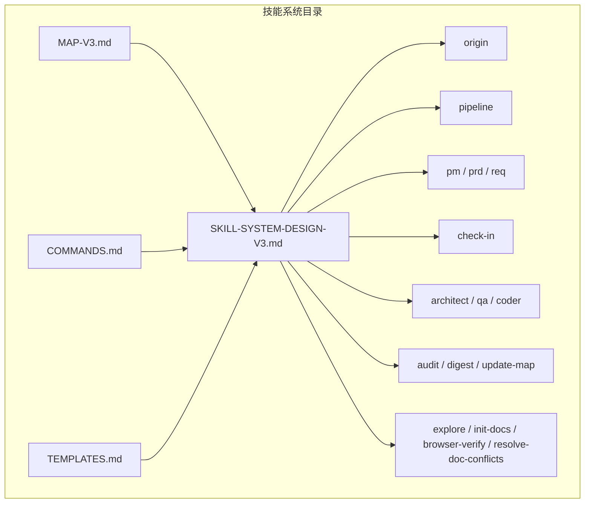
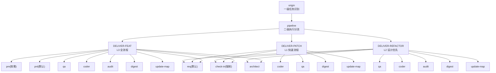
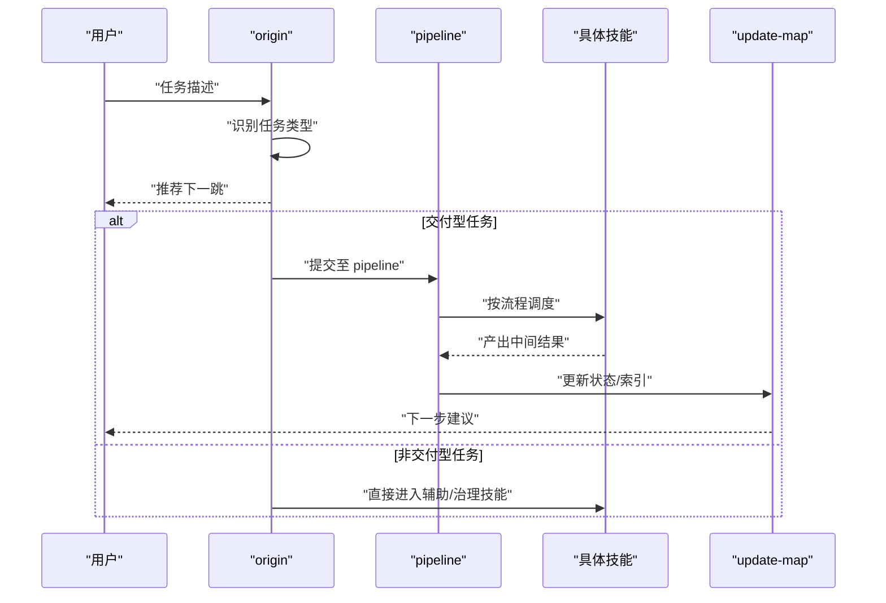
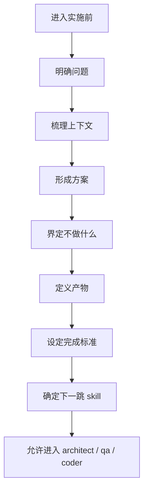
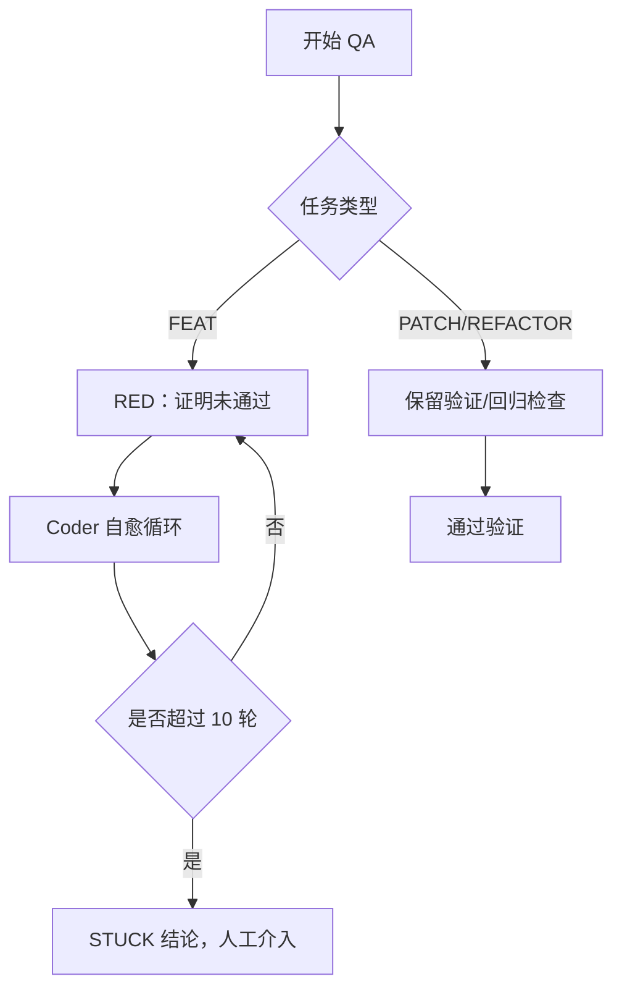
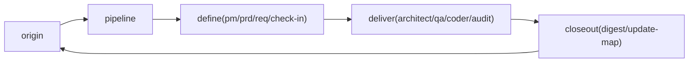

# 技能系统架构

<cite>
**本文引用的文件**
- [SKILL-SYSTEM-DESIGN-V3.md](file://skills/web3-ai-agent/SKILL-SYSTEM-DESIGN-V3.md)
- [MAP-V3.md](file://skills/web3-ai-agent/MAP-V3.md)
- [COMMANDS.md](file://skills/web3-ai-agent/COMMANDS.md)
- [TEMPLATES.md](file://skills/web3-ai-agent/TEMPLATES.md)
- [PLAN.md](file://PLAN.md)
- [WEB3-AI-AGENT-使用教程-V1.md](file://WEB3-AI-AGENT-使用教程-V1.md)
</cite>

## 目录
1. [简介](#简介)
2. [项目结构](#项目结构)
3. [核心组件](#核心组件)
4. [架构总览](#架构总览)
5. [详细组件分析](#详细组件分析)
6. [依赖分析](#依赖分析)
7. [性能考量](#性能考量)
8. [故障排查指南](#故障排查指南)
9. [结论](#结论)
10. [附录](#附录)

## 简介
本架构文档面向架构师与高级开发者，系统化解析 Web3 AI Agent 技能系统的设计理念与实现蓝图。该系统以“文档驱动 + 流程型多技能 + 门禁式质量控制”为核心，构建可路由、可裁剪、可回退的技能操作系统，覆盖从探索、定义、交付到治理的全生命周期。本文重点阐述：
- 16 个核心技能模块的协作关系与数据流向
- 技能路由与调度机制（任务类型识别、技能选择算法、执行流程控制）
- 学习门禁（V3 称为 check-in）的设计原理与实施方式
- 技能地图（Skill Map）与阶段学习目标、完成标准
- 系统边界、接口契约与扩展机制

## 项目结构
技能系统位于 skills/web3-ai-agent 目录，采用“设计稿 + 模板 + 地图 + 命令约定”的结构化组织方式，辅以根目录的规划与使用教程，确保从概念到落地的一致性。

图表来源
- [SKILL-SYSTEM-DESIGN-V3.md:1-719](file://skills/web3-ai-agent/SKILL-SYSTEM-DESIGN-V3.md#L1-L719)
- [MAP-V3.md:1-166](file://skills/web3-ai-agent/MAP-V3.md#L1-L166)
- [COMMANDS.md:1-81](file://skills/web3-ai-agent/COMMANDS.md#L1-L81)
- [TEMPLATES.md:1-102](file://skills/web3-ai-agent/TEMPLATES.md#L1-L102)

章节来源
- [SKILL-SYSTEM-DESIGN-V3.md:1-719](file://skills/web3-ai-agent/SKILL-SYSTEM-DESIGN-V3.md#L1-L719)
- [MAP-V3.md:1-166](file://skills/web3-ai-agent/MAP-V3.md#L1-L166)
- [COMMANDS.md:1-81](file://skills/web3-ai-agent/COMMANDS.md#L1-L81)
- [TEMPLATES.md:1-102](file://skills/web3-ai-agent/TEMPLATES.md#L1-L102)

## 核心组件
- 入口层：origin、pipeline
  - origin：识别任务类型（DISCOVER / BOOTSTRAP / DEFINE / DELIVER-* / VERIFY/GOVERN），决定是否进入 pipeline
  - pipeline：对交付型任务（DELIVER-FEAT / DELIVER-PATCH / DELIVER-REFACTOR）选择执行深度与必经/可跳过 skill
- 定义层：pm、prd、req、check-in
  - pm：价值与用户场景对齐
  - prd：范围、非目标、验收标准
  - req：需求卡拆解与影响范围
  - check-in：实施前对齐点，强制输出“问题、上下文、方案、不做什么、产物、完成标准、下一跳”
- 交付层：architect、qa、coder、audit
  - architect：模块边界、接口契约、数据/消息流
  - qa：测试策略与清单（含 RED/GREEN 红绿灯规则）
  - coder：按边界实现，支持最多 10 轮自愈循环
  - audit：风险审计（评分规则：>=80 通过；60-79 软拒绝；<60 直接拒绝；严重问题一票否决）
- 治理层：digest、update-map
  - digest：经验沉淀与问题总结
  - update-map：状态更新、索引与下一步建议
- 辅助层：explore、init-docs、browser-verify、resolve-doc-conflicts
  - 为只读探索、初始化、浏览器验收、文档冲突治理提供能力

章节来源
- [SKILL-SYSTEM-DESIGN-V3.md:164-220](file://skills/web3-ai-agent/SKILL-SYSTEM-DESIGN-V3.md#L164-L220)
- [SKILL-SYSTEM-DESIGN-V3.md:439-601](file://skills/web3-ai-agent/SKILL-SYSTEM-DESIGN-V3.md#L439-L601)
- [SKILL-SYSTEM-DESIGN-V3.md:696-719](file://skills/web3-ai-agent/SKILL-SYSTEM-DESIGN-V3.md#L696-L719)

## 架构总览
系统以“route -> define(按需) -> check-in -> design(按需) -> build -> closeout”为主线，将主链路抽象为 6 段，既保证交付效率，又保留文档沉淀与质量控制。

图表来源
- [MAP-V3.md:3-84](file://skills/web3-ai-agent/MAP-V3.md#L3-L84)
- [SKILL-SYSTEM-DESIGN-V3.md:265-393](file://skills/web3-ai-agent/SKILL-SYSTEM-DESIGN-V3.md#L265-L393)

章节来源
- [MAP-V3.md:1-166](file://skills/web3-ai-agent/MAP-V3.md#L1-L166)
- [SKILL-SYSTEM-DESIGN-V3.md:265-393](file://skills/web3-ai-agent/SKILL-SYSTEM-DESIGN-V3.md#L265-L393)

## 详细组件分析

### 路由与调度机制
- 一级路由：origin 识别任务类型
  - DISCOVER：explore
  - BOOTSTRAP：init-docs -> update-map
  - DEFINE：pm / prd / req -> check-in
  - DELIVER-*：进入 pipeline 分流
  - VERIFY/GOVERN：qa / audit / browser-verify / resolve-doc-conflicts / digest / update-map
- 二级路由：pipeline 仅对交付型任务生效
  - DELIVER-FEAT：pm(按需) -> prd -> req -> check-in -> architect -> qa -> coder -> audit -> digest -> update-map
  - DELIVER-PATCH：req -> check-in -> coder -> qa -> digest -> update-map（可按需插入 architect / audit / browser-verify / prd）
  - DELIVER-REFACTOR：req -> check-in -> architect -> qa -> coder -> audit -> digest -> update-map（可按需插入 prd / browser-verify）

图表来源
- [MAP-V3.md:86-157](file://skills/web3-ai-agent/MAP-V3.md#L86-L157)
- [SKILL-SYSTEM-DESIGN-V3.md:222-263](file://skills/web3-ai-agent/SKILL-SYSTEM-DESIGN-V3.md#L222-L263)

章节来源
- [MAP-V3.md:86-157](file://skills/web3-ai-agent/MAP-V3.md#L86-L157)
- [SKILL-SYSTEM-DESIGN-V3.md:222-263](file://skills/web3-ai-agent/SKILL-SYSTEM-DESIGN-V3.md#L222-L263)

### 学习门禁（check-in）设计与实施
- 定位：实施前对齐点，确认“要解决什么、明确不做什么、是否具备实施条件”
- 强制输出结构：问题、上下文、方案、不做什么、产物、完成标准、下一跳
- 强制范围：DELIVER-FEAT / DELIVER-PATCH / DELIVER-REFACTOR / DEFINE 中准备进入实施的任务
- 与其它技能的衔接：
  - architect / qa / coder 必须引用 check-in 的输出
  - pipeline 负责在合适时机插入 check-in

图表来源
- [SKILL-SYSTEM-DESIGN-V3.md:395-437](file://skills/web3-ai-agent/SKILL-SYSTEM-DESIGN-V3.md#L395-L437)

章节来源
- [SKILL-SYSTEM-DESIGN-V3.md:395-437](file://skills/web3-ai-agent/SKILL-SYSTEM-DESIGN-V3.md#L395-L437)

### 质量控制与执行硬规则
- QA 红绿灯规则（FEAT 默认 RED；PATCH/REFACTOR 默认保留验证）
- Coder 自愈规则（最多 10 轮自愈循环，超限 STUCK 结论并人工介入）
- Audit 评分规则（>=80 通过；60-79 软拒绝；<60 直接拒绝；严重问题一票否决）

图表来源
- [SKILL-SYSTEM-DESIGN-V3.md:700-711](file://skills/web3-ai-agent/SKILL-SYSTEM-DESIGN-V3.md#L700-L711)

章节来源
- [SKILL-SYSTEM-DESIGN-V3.md:700-719](file://skills/web3-ai-agent/SKILL-SYSTEM-DESIGN-V3.md#L700-L719)

### 技能地图与阶段学习目标
- 阶段模型（基于早期设计稿）：背景与目标对齐、MVP PRD 明确、Agent 认知建模、Web3 工具与数据规划、系统架构与模块契约、测试与验收设计、Vibe Coding 实现、质量审计与风险修正、复盘与知识沉淀
- V3 地图强调“可分流的操作系统”而非单一流水线，通过 ASCII 总流程图直观呈现路由与分流

章节来源
- [PLAN.md:106-124](file://PLAN.md#L106-L124)
- [MAP-V3.md:1-84](file://skills/web3-ai-agent/MAP-V3.md#L1-L84)

### 接口契约与扩展机制
- 契约维度：输入、输出、流程、边界、衔接条件
- 扩展机制：
  - 新增技能遵循统一模板（阶段输出、需求卡、架构说明、测试清单、复盘模板）
  - 命令约定标准化（斜杠命令 /origin、/pipeline feat/patch/refactor 等）
  - 辅助层独立，不与主交付链混用，便于按需组合

章节来源
- [TEMPLATES.md:1-102](file://skills/web3-ai-agent/TEMPLATES.md#L1-L102)
- [COMMANDS.md:1-81](file://skills/web3-ai-agent/COMMANDS.md#L1-L81)
- [SKILL-SYSTEM-DESIGN-V3.md:164-220](file://skills/web3-ai-agent/SKILL-SYSTEM-DESIGN-V3.md#L164-L220)

## 依赖分析
- 耦合关系
  - origin 与 pipeline：origin 决策，pipeline 调度
  - define 层与 deliver 层：define 层为 deliver 层提供清晰输入
  - check-in 与 deliver 层：check-in 是 deliver 层的前置门禁
  - closeout（audit/digest/update-map）与 deliver 层：交付闭环
- 外部依赖
  - 宿主产品 UI（Codex/Cursor）对命令弹窗的支持程度
  - 文档与模板的版本一致性（避免冲突）

图表来源
- [MAP-V3.md:86-157](file://skills/web3-ai-agent/MAP-V3.md#L86-L157)
- [SKILL-SYSTEM-DESIGN-V3.md:265-281](file://skills/web3-ai-agent/SKILL-SYSTEM-DESIGN-V3.md#L265-L281)

章节来源
- [MAP-V3.md:86-157](file://skills/web3-ai-agent/MAP-V3.md#L86-L157)
- [SKILL-SYSTEM-DESIGN-V3.md:265-281](file://skills/web3-ai-agent/SKILL-SYSTEM-DESIGN-V3.md#L265-L281)

## 性能考量
- 路由分流：通过 origin + pipeline 的两级分流，避免非交付任务进入冗长主链路
- L1/L2/L3 执行深度：根据任务类型选择合适深度，降低 token 与时间消耗
- 质量前置：check-in 将“是否具备实施条件”前置，减少返工
- 红绿灯与自愈：QA 先行 RED，Coder 自愈循环上限控制，避免无限试错

## 故障排查指南
- 未进入 pipeline
  - 检查 origin 是否正确识别任务类型
  - 确认任务是否属于 DELIVER-* 类型
- 未进入 check-in
  - 确认任务是否属于需要实施前对齐的类型
  - 检查是否遗漏 check-in 输出结构
- QA 无法推进
  - FEAT 默认 RED，确认 RED 是否有效执行
  - PATCH/REFACTOR 是否保留验证或回归检查
- Coder 卡住
  - 是否超过 10 轮自愈循环
  - 是否存在不可修复的边界问题
- Audit 未通过
  - 评分是否低于阈值
  - 是否存在严重风险或一票否决项

章节来源
- [SKILL-SYSTEM-DESIGN-V3.md:700-719](file://skills/web3-ai-agent/SKILL-SYSTEM-DESIGN-V3.md#L700-L719)

## 结论
该技能系统以“可路由、可裁剪、可回退”为核心，通过 origin/pipeline 的两级分流与 check-in 的门禁式质量控制，将文档驱动与自动化执行有机结合。V3 将“实施前对齐点”从 learn-gate 正式命名为 check-in，强化其在交付流程中的定位。配合红绿灯、自愈与审计评分等硬规则，系统在保证质量的同时兼顾效率，适合在 Web3 AI Agent 项目中长期演进与规模化应用。

## 附录
- 使用建议
  - 统一使用“请使用 web3-ai-agent skill，从 origin 开始”的开场
  - 交付型任务优先走 pipeline(FEAT/PATCH/REFACTOR)
  - 实施前必须执行 check-in
  - FEAT 默认 QA 先 RED，Coder 最多 10 轮自愈，Audit >=80 才放行
- 命令约定
  - /origin、/pipeline feat/patch/refactor、/pm、/prd、/req、/check-in、/architect、/qa、/coder、/audit、/digest、/update-map、/explore、/init-docs、/browser-verify、/resolve-doc-conflicts

章节来源
- [WEB3-AI-AGENT-使用教程-V1.md:396-454](file://WEB3-AI-AGENT-使用教程-V1.md#L396-L454)
- [COMMANDS.md:29-50](file://skills/web3-ai-agent/COMMANDS.md#L29-L50)