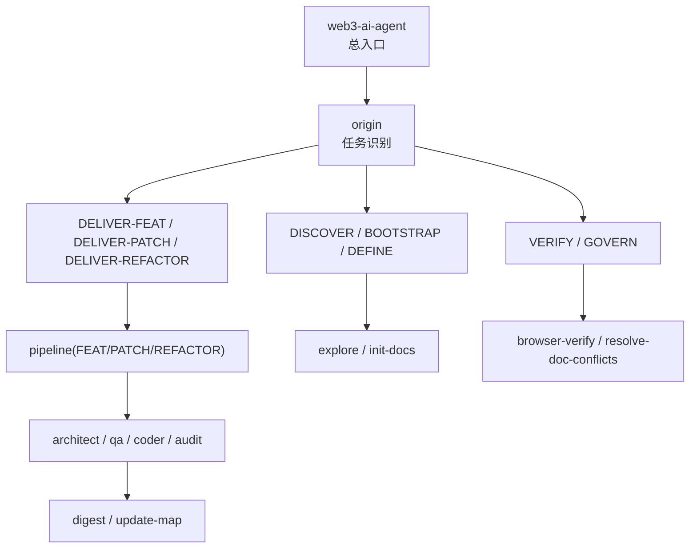
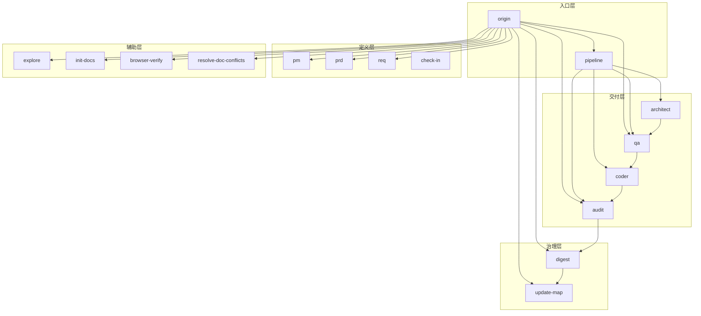
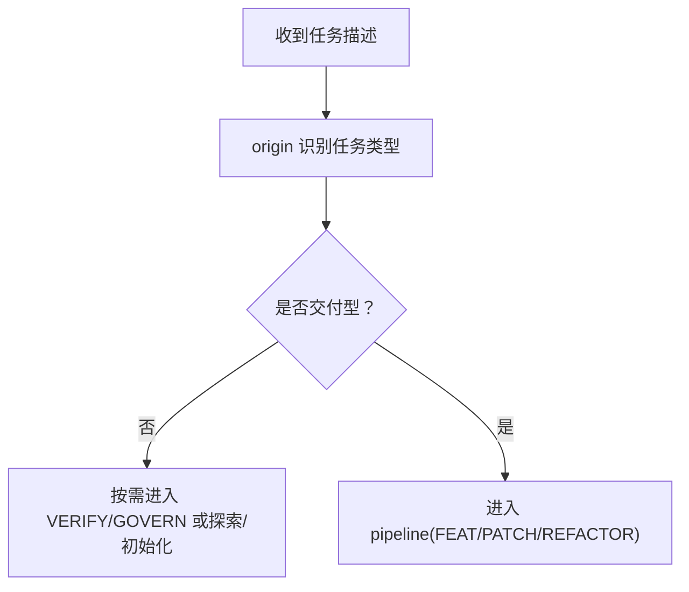
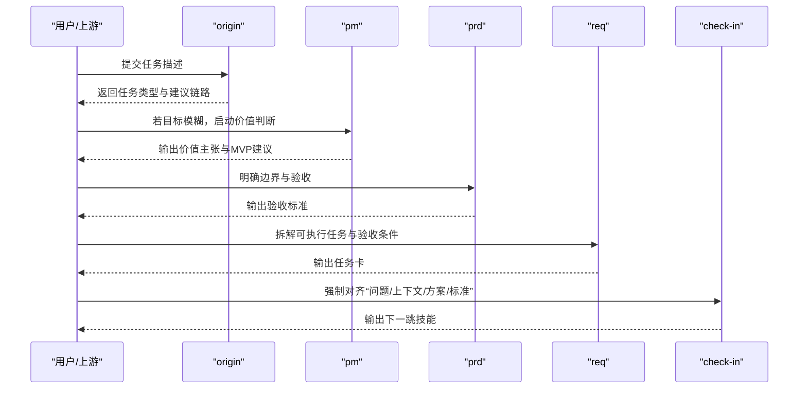
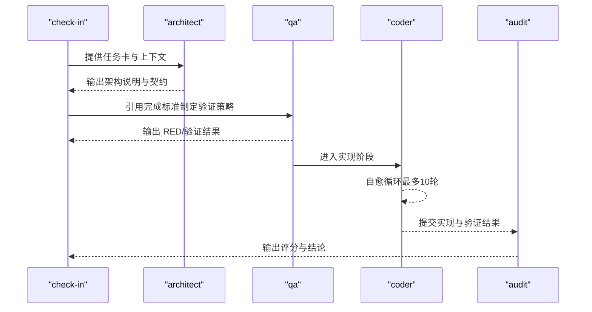
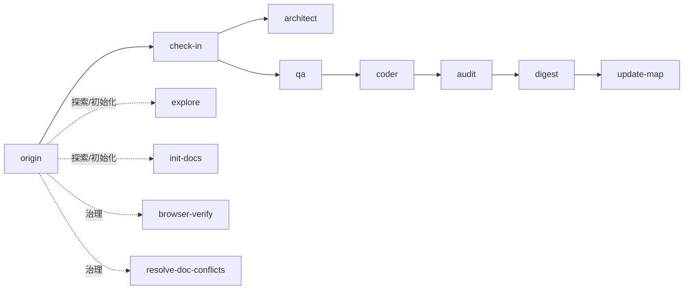

# 整体设计理念

<cite>
**本文引用的文件**
- [SKILL-SYSTEM-DESIGN-V3.md](file://skills/web3-ai-agent/SKILL-SYSTEM-DESIGN-V3.md)
- [MAP-V3.md](file://skills/web3-ai-agent/MAP-V3.md)
- [COMMANDS.md](file://skills/web3-ai-agent/COMMANDS.md)
- [SKILL.md](file://skills/web3-ai-agent/SKILL.md)
- [architect\SKILL.md](file://skills/web3-ai-agent/architect/SKILL.md)
- [coder\SKILL.md](file://skills/web3-ai-agent/coder/SKILL.md)
- [pm\SKILL.md](file://skills/web3-ai-agent/pm/SKILL.md)
- [qa\SKILL.md](file://skills/web3-ai-agent/qa/SKILL.md)
- [audit\SKILL.md](file://skills/web3-ai-agent/audit/SKILL.md)
</cite>

## 目录
1. [引言](#引言)
2. [项目结构](#项目结构)
3. [核心组件](#核心组件)
4. [架构总览](#架构总览)
5. [详细组件分析](#详细组件分析)
6. [依赖分析](#依赖分析)
7. [性能考虑](#性能考虑)
8. [故障排查指南](#故障排查指南)
9. [结论](#结论)
10. [附录](#附录)

## 引言
本设计理念文档面向架构师与项目管理者，系统阐述 Web3 AI Agent 技能系统的整体设计思想与执行框架。重点包括：
- 流程型多技能架构：以“任务类型”为一级分流、“交付类型”为二级分流，形成“入口层→定义层→交付层→治理层→辅助层”的五层结构。
- 文档驱动开发模式：以“文档先行→分阶段学习→vibe coding（即兴编码）”为核心流程，强调“先定义、再验证、后实现”的闭环。
- 自治开发流设计：通过“check-in（实施前对齐点）”强制每轮实施前明确“问题、知识点、技术方案、完成标准”，确保交付可控、风险受控。
- Web3 特殊约束：在链上数据不可伪造、实时性不可篡改的背景下，技能系统通过“QA 红灯优先”“Audit 轻/重审”“Browser Verify 视觉验收”等机制，保证结果可验证、可追溯、可治理。

## 项目结构
技能系统以“总入口 skill + 多个子 skill + 地图与命令约定”构成：
- 总入口 skill：统一入口，负责任务识别与路由。
- 子 skill：按职能分层，覆盖探索、定义、设计、验证、实现、审计、治理与辅助。
- 地图与命令：提供可视化流程与标准化命令约定，降低歧义与沟通成本。

图表来源
- [SKILL.md:15-55](file://skills/web3-ai-agent/SKILL.md#L15-L55)
- [MAP-V3.md:86-100](file://skills/web3-ai-agent/MAP-V3.md#L86-L100)

章节来源
- [SKILL.md:21-55](file://skills/web3-ai-agent/SKILL.md#L21-L55)
- [MAP-V3.md:1-166](file://skills/web3-ai-agent/MAP-V3.md#L1-L166)

## 核心组件
- 任务分类与路由
  - 七类任务：DISCOVER、BOOTSTRAP、DEFINE、DELIVER-FEAT、DELIVER-PATCH、DELIVER-REFACTOR、VERIFY/GOVERN。
  - 两级分流：origin 识别任务类型；交付型任务进入 pipeline，按 FEAT/PATCH/REFACTOR 选择执行深度。
- 分层结构
  - 入口层：origin、pipeline。
  - 定义层：pm、prd、req、check-in。
  - 交付层：architect、qa、coder、audit。
  - 治理层：digest、update-map。
  - 辅助层：explore、init-docs、browser-verify、resolve-doc-conflicts。
- 执行骨架
  - route → define(按需) → check-in → design(按需) → build → closeout。
- 硬规则
  - 任何任务必须经 origin；未通过 check-in 不得进入 architect/qa/coder；QA 红灯优先；Coder 最多 10 轮自愈；Audit 总分 100，≥80 通过。

章节来源
- [SKILL-SYSTEM-DESIGN-V3.md:45-161](file://skills/web3-ai-agent/SKILL-SYSTEM-DESIGN-V3.md#L45-L161)
- [SKILL-SYSTEM-DESIGN-V3.md:164-220](file://skills/web3-ai-agent/SKILL-SYSTEM-DESIGN-V3.md#L164-L220)
- [SKILL-SYSTEM-DESIGN-V3.md:265-285](file://skills/web3-ai-agent/SKILL-SYSTEM-DESIGN-V3.md#L265-L285)
- [SKILL-SYSTEM-DESIGN-V3.md:696-719](file://skills/web3-ai-agent/SKILL-SYSTEM-DESIGN-V3.md#L696-L719)

## 架构总览
整体架构以“任务识别→定义→对齐→设计→验证→实现→审计→沉淀”为主线，辅以“探索→初始化→浏览器验收→冲突治理”的支撑链路，形成“分流操作系统”而非“单一流水线”。

图表来源
- [SKILL-SYSTEM-DESIGN-V3.md:164-220](file://skills/web3-ai-agent/SKILL-SYSTEM-DESIGN-V3.md#L164-L220)
- [MAP-V3.md:1-166](file://skills/web3-ai-agent/MAP-V3.md#L1-L166)

章节来源
- [SKILL-SYSTEM-DESIGN-V3.md:164-220](file://skills/web3-ai-agent/SKILL-SYSTEM-DESIGN-V3.md#L164-L220)
- [MAP-V3.md:1-166](file://skills/web3-ai-agent/MAP-V3.md#L1-L166)

## 详细组件分析

### 入口层：origin 与 pipeline
- origin：识别任务类型（DISCOVER/BOOTSTRAP/DEFINE/DELIVER-*/VERIFY/GOVERN），并引导至相应链路。
- pipeline：仅对交付型任务生效，按 FEAT/PATCH/REFACTOR 选择执行深度与必经节点。

图表来源
- [SKILL-SYSTEM-DESIGN-V3.md:222-244](file://skills/web3-ai-agent/SKILL-SYSTEM-DESIGN-V3.md#L222-L244)
- [SKILL.md:23-55](file://skills/web3-ai-agent/SKILL.md#L23-L55)

章节来源
- [SKILL-SYSTEM-DESIGN-V3.md:222-244](file://skills/web3-ai-agent/SKILL-SYSTEM-DESIGN-V3.md#L222-L244)
- [SKILL.md:23-55](file://skills/web3-ai-agent/SKILL.md#L23-L55)

### 定义层：pm / prd / req / check-in
- pm：目标模糊时的价值与范围判断。
- prd：边界与验收定义。
- req：可执行拆解与验收条件。
- check-in：实施前对齐点，强制输出“问题、上下文、方案、不做什么、产物、完成标准、下一跳”。

图表来源
- [SKILL-SYSTEM-DESIGN-V3.md:395-436](file://skills/web3-ai-agent/SKILL-SYSTEM-DESIGN-V3.md#L395-L436)
- [pm\SKILL.md:8-53](file://skills/web3-ai-agent/pm/SKILL.md#L8-L53)
- [SKILL-SYSTEM-DESIGN-V3.md:407-418](file://skills/web3-ai-agent/SKILL-SYSTEM-DESIGN-V3.md#L407-L418)

章节来源
- [SKILL-SYSTEM-DESIGN-V3.md:395-436](file://skills/web3-ai-agent/SKILL-SYSTEM-DESIGN-V3.md#L395-L436)
- [pm\SKILL.md:8-53](file://skills/web3-ai-agent/pm/SKILL.md#L8-L53)
- [SKILL-SYSTEM-DESIGN-V3.md:407-418](file://skills/web3-ai-agent/SKILL-SYSTEM-DESIGN-V3.md#L407-L418)

### 交付层：architect / qa / coder / audit
- architect：结构设计与契约定义，必要时回退 prd/req。
- qa：FEAT 红灯优先，PATCH/REFACTOR 轻量验证或回归检查。
- coder：在边界清晰前提下实施，最多 10 轮自愈循环。
- audit：交付前风险审计，轻/重审并分级阈值。

图表来源
- [architect\SKILL.md:8-53](file://skills/web3-ai-agent/architect/SKILL.md#L8-L53)
- [qa\SKILL.md:12-73](file://skills/web3-ai-agent/qa/SKILL.md#L12-L73)
- [coder\SKILL.md:18-72](file://skills/web3-ai-agent/coder/SKILL.md#L18-L72)
- [audit\SKILL.md:12-88](file://skills/web3-ai-agent/audit/SKILL.md#L12-L88)

章节来源
- [architect\SKILL.md:8-53](file://skills/web3-ai-agent/architect/SKILL.md#L8-L53)
- [qa\SKILL.md:12-73](file://skills/web3-ai-agent/qa/SKILL.md#L12-L73)
- [coder\SKILL.md:18-72](file://skills/web3-ai-agent/coder/SKILL.md#L18-L72)
- [audit\SKILL.md:12-88](file://skills/web3-ai-agent/audit/SKILL.md#L12-L88)

### 治理层与辅助层
- 治理层：digest 沉淀经验，update-map 更新状态与入口。
- 辅助层：explore 只读导航，init-docs 初始化文档体系，browser-verify 视觉验收，resolve-doc-conflicts 处理冲突。

章节来源
- [SKILL-SYSTEM-DESIGN-V3.md:201-220](file://skills/web3-ai-agent/SKILL-SYSTEM-DESIGN-V3.md#L201-L220)

## 依赖分析
- 路由依赖：origin → 任务类型 → 定义/交付/治理链路。
- 执行依赖：check-in 是进入 architect/qa/coder 的前置；FEAT 默认先 qa 红灯；Coder 自愈循环依赖 QA 输出；Audit 依赖 check-in/代码/架构/QA 结果。
- 分层耦合：定义层与交付层通过 check-in 强耦合；交付层内部以“设计→验证→实现→审计”顺序耦合；治理层与辅助层独立于主链路。

图表来源
- [SKILL-SYSTEM-DESIGN-V3.md:265-285](file://skills/web3-ai-agent/SKILL-SYSTEM-DESIGN-V3.md#L265-L285)
- [MAP-V3.md:158-166](file://skills/web3-ai-agent/MAP-V3.md#L158-L166)

章节来源
- [SKILL-SYSTEM-DESIGN-V3.md:265-285](file://skills/web3-ai-agent/SKILL-SYSTEM-DESIGN-V3.md#L265-L285)
- [MAP-V3.md:158-166](file://skills/web3-ai-agent/MAP-V3.md#L158-L166)

## 性能考虑
- 路由分流：通过七类任务与两级分流，减少无效链路，提升平均交付效率。
- 执行深度：FEAT 默认较深，PATCH/REFACTOR 默认较浅，避免小题大做；audit 轻/重审按风险动态分配资源。
- 自愈循环：Coder 最多 10 轮自愈，防止无效内耗；超限即终止并人工介入，避免雪崩。
- 验证策略：FEAT 红灯优先，快速暴露问题；PATCH/REFACTOR 保留回归检查，兼顾速度与稳定性。

章节来源
- [SKILL-SYSTEM-DESIGN-V3.md:696-719](file://skills/web3-ai-agent/SKILL-SYSTEM-DESIGN-V3.md#L696-L719)
- [qa\SKILL.md:12-73](file://skills/web3-ai-agent/qa/SKILL.md#L12-L73)
- [coder\SKILL.md:18-72](file://skills/web3-ai-agent/coder/SKILL.md#L18-L72)
- [audit\SKILL.md:12-88](file://skills/web3-ai-agent/audit/SKILL.md#L12-L88)

## 故障排查指南
- 未通过 check-in
  - 现象：无法进入 architect/qa/coder。
  - 排查：确认是否遗漏“问题、上下文、方案、完成标准”等强制输出。
- QA 红灯异常
  - 现象：RED 直接通过或反复失败。
  - 排查：修正测试用例或回退至 prd/req 明确边界。
- Coder 卡住
  - 现象：超过 10 轮仍未通过。
  - 排查：输出 STUCK 报告，回退至 architect/qa 检视设计与验证。
- Audit 不通过
  - 现象：评分低于 80。
  - 排查：软拒绝回退 coder 修正；<60 直接终止并人工介入。

章节来源
- [SKILL-SYSTEM-DESIGN-V3.md:696-719](file://skills/web3-ai-agent/SKILL-SYSTEM-DESIGN-V3.md#L696-L719)
- [coder\SKILL.md:39-72](file://skills/web3-ai-agent/coder/SKILL.md#L39-L72)
- [audit\SKILL.md:52-88](file://skills/web3-ai-agent/audit/SKILL.md#L52-L88)

## 结论
Web3 AI Agent 技能系统以“任务识别—定义—对齐—设计—验证—实现—审计—沉淀”为主线，通过“七类任务+两级分流+五层结构+硬规则”，在保证 Web3 数据不可伪造、实时性不可篡改的约束下，实现了“文档先行→分阶段学习→vibe coding”的自治开发流。其核心价值在于：以最少步骤把任务送入正确路径、对高风险任务增加约束、保留文档沉淀但不牺牲交付效率。

## 附录
- 斜杠命令约定：统一使用“/origin /pipeline /pm /prd /req /check-in /architect /qa /coder /audit /digest /update-map /explore /init-docs /browser-verify /resolve-doc-conflicts”等命令，降低歧义与沟通成本。

章节来源
- [COMMANDS.md:20-81](file://skills/web3-ai-agent/COMMANDS.md#L20-L81)