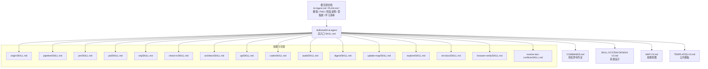
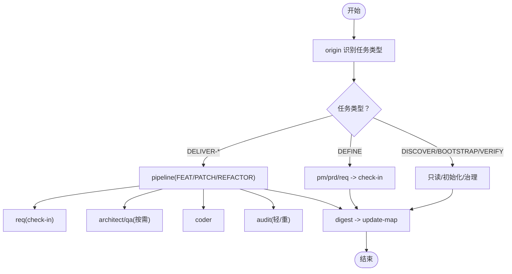
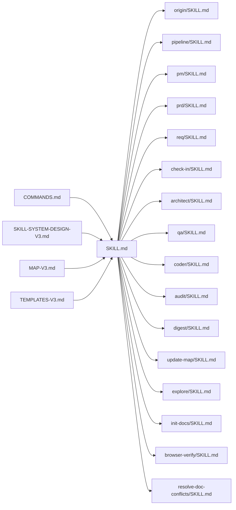

# 文档标准规范

<cite>
**本文引用的文件**
- [skills/web3-ai-agent/SKILL.md](file://skills/web3-ai-agent/SKILL.md)
- [skills/web3-ai-agent/COMMANDS.md](file://skills/web3-ai-agent/COMMANDS.md)
- [skills/web3-ai-agent/SKILL-SYSTEM-DESIGN-V3.md](file://skills/web3-ai-agent/SKILL-SYSTEM-DESIGN-V3.md)
- [skills/web3-ai-agent/MAP-V3.md](file://skills/web3-ai-agent/MAP-V3.md)
- [skills/web3-ai-agent/TEMPLATES-V3.md](file://skills/web3-ai-agent/TEMPLATES-V3.md)
- [skills/web3-ai-agent/architect/SKILL.md](file://skills/web3-ai-agent/architect/SKILL.md)
- [skills/web3-ai-agent/audit/SKILL.md](file://skills/web3-ai-agent/audit/SKILL.md)
- [skills/web3-ai-agent/check-in/SKILL.md](file://skills/web3-ai-agent/check-in/SKILL.md)
- [skills/web3-ai-agent/coder/SKILL.md](file://skills/web3-ai-agent/coder/SKILL.md)
- [skills/web3-ai-agent/digest/SKILL.md](file://skills/web3-ai-agent/digest/SKILL.md)
- [skills/web3-ai-agent/explore/SKILL.md](file://skills/web3-ai-agent/explore/SKILL.md)
- [skills/web3-ai-agent/init-docs/SKILL.md](file://skills/web3-ai-agent/init-docs/SKILL.md)
- [skills/web3-ai-agent/browser-verify/SKILL.md](file://skills/web3-ai-agent/browser-verify/SKILL.md)
- [skills/web3-ai-agent/resolve-doc-conflicts/SKILL.md](file://skills/web3-ai-agent/resolve-doc-conflicts/SKILL.md)
</cite>

## 目录
1. [简介](#简介)
2. [项目结构](#项目结构)
3. [核心组件](#核心组件)
4. [架构总览](#架构总览)
5. [详细组件分析](#详细组件分析)
6. [依赖分析](#依赖分析)
7. [性能考虑](#性能考虑)
8. [故障排查指南](#故障排查指南)
9. [结论](#结论)
10. [附录](#附录)

## 简介
本规范面向 AI-Agent 技能系统，旨在统一文档命名与组织结构，规范阶段输出模板、需求卡模板、架构说明模板、测试清单模板与复盘模板的格式与内容要求；阐明公共模板文档 TEMPLATES-V3.md 与技能地图 MAP-V3.md 的生成与维护机制；并提供编写最佳实践与质量检查标准，帮助团队建立可演进、可复用、可追溯的文档管理体系。

## 项目结构
- 根目录文档（示例）
  - AI-Agent.md：项目总览与背景
  - PLAN.md：项目计划与路线图
  - Web3-AI-Agent-使用教程-V1.md：使用教程
  - Web3-AI-Agent-PRD-MVP.md：产品需求文档（MVP）
  - Web3-AI-Agent-阶段执行说明-V2.md：阶段执行说明
  - Web3-AI-Agent-项目里程碑-Checklist.md：里程碑检查清单
  - 按周拆解的学习资料清单.md：学习资料规划
- 技能系统文档（skills/web3-ai-agent）
  - SKILL.md：技能系统总入口与主链路说明
  - COMMANDS.md：斜杠命令约定
  - SKILL-SYSTEM-DESIGN-V3.md：技能系统设计（V3）
  - MAP-V3.md：技能地图（V3）
  - TEMPLATES-V3.md：公共模板（V3）
  - 各技能子目录下的 SKILL.md：每个技能的职责、输入输出、流程与边界

图表来源
- [skills/web3-ai-agent/SKILL.md](file://skills/web3-ai-agent/SKILL.md)
- [skills/web3-ai-agent/COMMANDS.md](file://skills/web3-ai-agent/COMMANDS.md)
- [skills/web3-ai-agent/SKILL-SYSTEM-DESIGN-V3.md](file://skills/web3-ai-agent/SKILL-SYSTEM-DESIGN-V3.md)
- [skills/web3-ai-agent/MAP-V3.md](file://skills/web3-ai-agent/MAP-V3.md)
- [skills/web3-ai-agent/TEMPLATES-V3.md](file://skills/web3-ai-agent/TEMPLATES-V3.md)

章节来源
- [skills/web3-ai-agent/SKILL.md](file://skills/web3-ai-agent/SKILL.md)
- [skills/web3-ai-agent/COMMANDS.md](file://skills/web3-ai-agent/COMMANDS.md)
- [skills/web3-ai-agent/SKILL-SYSTEM-DESIGN-V3.md](file://skills/web3-ai-agent/SKILL-SYSTEM-DESIGN-V3.md)
- [skills/web3-ai-agent/MAP-V3.md](file://skills/web3-ai-agent/MAP-V3.md)
- [skills/web3-ai-agent/TEMPLATES-V3.md](file://skills/web3-ai-agent/TEMPLATES-V3.md)

## 核心组件
- 总入口 SKILL.md：定义主链路、任务类型分流、强制规则与斜杠命令建议
- 系统设计 SKILL-SYSTEM-DESIGN-V3.md：任务分类、分层、路由规则、执行骨架、三类交付流水线、check-in 定义与硬规则
- 技能地图 MAP-V3.md：ASCII 总流程图、一级/二级/三级路由、固定规则
- 公共模板 TEMPLATES-V3.md：check-in 总模板与 FEAT/PATCH/REFACTOR 场景化模板
- 各技能 SKILL.md：职责、输入输出、流程、边界与衔接

章节来源
- [skills/web3-ai-agent/SKILL.md](file://skills/web3-ai-agent/SKILL.md)
- [skills/web3-ai-agent/SKILL-SYSTEM-DESIGN-V3.md](file://skills/web3-ai-agent/SKILL-SYSTEM-DESIGN-V3.md)
- [skills/web3-ai-agent/MAP-V3.md](file://skills/web3-ai-agent/MAP-V3.md)
- [skills/web3-ai-agent/TEMPLATES-V3.md](file://skills/web3-ai-agent/TEMPLATES-V3.md)

## 架构总览
V3 将系统抽象为“路由 -> 定义(按需) -> check-in -> 设计(按需) -> 构建 -> 收尾”六段骨架，按任务类型进行一级分流，仅交付型任务进入 pipeline，实施型任务强制 check-in，辅助层独立于主链路。

图表来源
- [skills/web3-ai-agent/SKILL-SYSTEM-DESIGN-V3.md](file://skills/web3-ai-agent/SKILL-SYSTEM-DESIGN-V3.md)
- [skills/web3-ai-agent/MAP-V3.md](file://skills/web3-ai-agent/MAP-V3.md)

章节来源
- [skills/web3-ai-agent/SKILL-SYSTEM-DESIGN-V3.md](file://skills/web3-ai-agent/SKILL-SYSTEM-DESIGN-V3.md)
- [skills/web3-ai-agent/MAP-V3.md](file://skills/web3-ai-agent/MAP-V3.md)

## 详细组件分析

### 命名规范与组织结构
- 根目录文档命名规范
  - 使用“主题-用途-版本号.md”格式，如 Web3-AI-Agent-使用教程-V1.md、Web3-AI-Agent-阶段执行说明-V2.md、Web3-AI-Agent-项目里程碑-Checklist.md、Web3-AI-Agent-PRD-MVP.md、PLAN.md、AI-Agent.md、按周拆解的学习资料清单.md
  - 版本号采用大写字母 Vn，n 为递增整数
  - 用途与主题清晰区分，便于检索与版本管理
- 技能目录文档命名规范
  - 技能子目录下统一使用 SKILL.md，作为该技能的职责、输入输出、流程与边界说明
  - 公共模板与地图文档使用 TEMPLATES-Vn.md 与 MAP-Vn.md，版本号与系统设计保持一致
  - 斜杠命令约定使用 COMMANDS.md，集中定义命令格式与推荐入口

章节来源
- [skills/web3-ai-agent/SKILL.md](file://skills/web3-ai-agent/SKILL.md)
- [skills/web3-ai-agent/COMMANDS.md](file://skills/web3-ai-agent/COMMANDS.md)
- [skills/web3-ai-agent/SKILL-SYSTEM-DESIGN-V3.md](file://skills/web3-ai-agent/SKILL-SYSTEM-DESIGN-V3.md)
- [skills/web3-ai-agent/MAP-V3.md](file://skills/web3-ai-agent/MAP-V3.md)
- [skills/web3-ai-agent/TEMPLATES-V3.md](file://skills/web3-ai-agent/TEMPLATES-V3.md)

### 阶段输出模板
- check-in 总模板
  - 必填字段：本阶段要解决的问题、本阶段必须掌握的上下文、本阶段采用的方案、本阶段不做什么、本阶段产物、本阶段完成标准、进入下一阶段前要调用的 skill
  - 适用：所有实施型任务在进入设计或编码前
- FEAT 场景 check-in
  - 针对新增能力：明确服务对象、主路径、数据来源、依赖模块、异常场景、主路径方案、数据方案、降级方案、产物清单（需求卡、架构说明、测试清单、代码实现）、完成标准（主路径可跑通、数据来源清楚、失败场景可解释、验收标准可验证）
- PATCH 场景 check-in
  - 针对缺陷修复：明确具体 bug、复现条件、预期行为、根因假设、出错模块、相关状态流或数据流、回归风险点、最小修复路径、是否补防御逻辑、是否补测试、产物（缺陷卡、修复代码、回归验证记录）、完成标准（稳定修复、相关回归项通过、无新增行为偏差）
- REFACTOR 场景 check-in
  - 针对重构：明确结构问题、重构动机、必须保持不变的行为、模块边界、依赖关系、兼容约束、性能或维护性瓶颈、新结构方案、迁移路径、兼容方案、产物（重构卡、架构说明、回归测试清单、重构代码）、完成标准（行为等价、结构更清晰、回归项通过、风险已记录）

章节来源
- [skills/web3-ai-agent/TEMPLATES-V3.md](file://skills/web3-ai-agent/TEMPLATES-V3.md)
- [skills/web3-ai-agent/check-in/SKILL.md](file://skills/web3-ai-agent/check-in/SKILL.md)

### 需求卡模板
- FEAT 需求卡
  - 主题：FEAT-{编号}
  - 内容要点：业务价值、用户角色、功能范围、验收标准、非功能约束、依赖与边界、风险与假设
- PATCH 需求卡（缺陷卡）
  - 主题：PATCH-{编号}
  - 内容要点：缺陷描述、复现步骤、期望结果、实际结果、根因分析、修复方案、回归验证清单
- REFACTOR 需求卡（重构卡）
  - 主题：REFACTOR-{编号}
  - 内容要点：重构目标、影响范围、行为等价性声明、迁移策略、兼容性方案、回滚预案

章节来源
- [skills/web3-ai-agent/TEMPLATES-V3.md](file://skills/web3-ai-agent/TEMPLATES-V3.md)

### 架构说明模板
- 主题：{主题} 架构说明
- 内容要点：目标、模块边界、数据流、消息流、接口契约、错误处理、风险点
- 适用：涉及结构、接口、状态流或模块边界变化的任务，在 architect 阶段产出

章节来源
- [skills/web3-ai-agent/architect/SKILL.md](file://skills/web3-ai-agent/architect/SKILL.md)

### 测试清单模板
- FEAT 测试清单
  - 主题：FEAT-{编号} 测试清单
  - 内容要点：主路径用例、异常路径用例、边界用例、性能与安全用例、回归用例、自动化建议
- PATCH 测试清单
  - 主题：PATCH-{编号} 测试清单
  - 内容要点：缺陷复现用例、修复验证用例、相关回归用例、浏览器验收用例（前端相关）
- REFACTOR 测试清单
  - 主题：REFACTOR-{编号} 测试清单
  - 内容要点：行为等价性验证用例、性能回归用例、兼容性用例、文档与索引一致性用例

章节来源
- [skills/web3-ai-agent/TEMPLATES-V3.md](file://skills/web3-ai-agent/TEMPLATES-V3.md)

### 复盘模板
- 主题：{任务} 复盘
- 内容要点：本轮完成了什么、遇到了什么问题、学到了什么、仍未解决的问题、下一步建议
- 适用：digest 阶段产出，为 update-map 提供输入

章节来源
- [skills/web3-ai-agent/digest/SKILL.md](file://skills/web3-ai-agent/digest/SKILL.md)

### 公共模板文档的生成与维护机制
- TEMPLATES-V3.md
  - 作用：集中沉淀 check-in 总模板与 FEAT/PATCH/REFACTOR 场景化模板，确保各阶段输出结构化、可复用
  - 维护：随系统设计版本同步迭代，V3 对应 TEMPLATES-V3.md
- MAP-V3.md
  - 作用：提供技能地图与路由规则的可视化与文字说明，作为系统演进的参考基线
  - 维护：与 SKILL-SYSTEM-DESIGN-V3.md 保持一致，版本号同步

章节来源
- [skills/web3-ai-agent/TEMPLATES-V3.md](file://skills/web3-ai-agent/TEMPLATES-V3.md)
- [skills/web3-ai-agent/MAP-V3.md](file://skills/web3-ai-agent/MAP-V3.md)
- [skills/web3-ai-agent/SKILL-SYSTEM-DESIGN-V3.md](file://skills/web3-ai-agent/SKILL-SYSTEM-DESIGN-V3.md)

### 各技能职责与衔接
- origin/pipeline：任务识别与交付分流
- pm/prd/req：需求定义与拆解，按需进入
- check-in：实施前对齐点，强制规则
- architect/qa/coder：设计、验证、实现
- audit：风险审计与评分
- digest/update-map：沉淀与地图更新
- explore/init-docs/browser-verify/resolve-doc-conflicts：辅助层

章节来源
- [skills/web3-ai-agent/SKILL.md](file://skills/web3-ai-agent/SKILL.md)
- [skills/web3-ai-agent/architect/SKILL.md](file://skills/web3-ai-agent/architect/SKILL.md)
- [skills/web3-ai-agent/audit/SKILL.md](file://skills/web3-ai-agent/audit/SKILL.md)
- [skills/web3-ai-agent/check-in/SKILL.md](file://skills/web3-ai-agent/check-in/SKILL.md)
- [skills/web3-ai-agent/coder/SKILL.md](file://skills/web3-ai-agent/coder/SKILL.md)
- [skills/web3-ai-agent/digest/SKILL.md](file://skills/web3-ai-agent/digest/SKILL.md)
- [skills/web3-ai-agent/explore/SKILL.md](file://skills/web3-ai-agent/explore/SKILL.md)
- [skills/web3-ai-agent/init-docs/SKILL.md](file://skills/web3-ai-agent/init-docs/SKILL.md)
- [skills/web3-ai-agent/browser-verify/SKILL.md](file://skills/web3-ai-agent/browser-verify/SKILL.md)
- [skills/web3-ai-agent/resolve-doc-conflicts/SKILL.md](file://skills/web3-ai-agent/resolve-doc-conflicts/SKILL.md)

## 依赖分析
- 耦合关系
  - 总入口 SKILL.md 依赖 COMMANDS.md 的命令约定与 SKILL-SYSTEM-DESIGN-V3.md 的设计规则
  - 各技能 SKILL.md 依赖 TEMPLATES-V3.md 的模板与 MAP-V3.md 的路由规则
  - TEMPLATES-V3.md 与 MAP-V3.md 作为公共基线，被所有技能与流程引用
- 依赖图

图表来源
- [skills/web3-ai-agent/SKILL.md](file://skills/web3-ai-agent/SKILL.md)
- [skills/web3-ai-agent/COMMANDS.md](file://skills/web3-ai-agent/COMMANDS.md)
- [skills/web3-ai-agent/SKILL-SYSTEM-DESIGN-V3.md](file://skills/web3-ai-agent/SKILL-SYSTEM-DESIGN-V3.md)
- [skills/web3-ai-agent/MAP-V3.md](file://skills/web3-ai-agent/MAP-V3.md)
- [skills/web3-ai-agent/TEMPLATES-V3.md](file://skills/web3-ai-agent/TEMPLATES-V3.md)

章节来源
- [skills/web3-ai-agent/SKILL.md](file://skills/web3-ai-agent/SKILL.md)
- [skills/web3-ai-agent/COMMANDS.md](file://skills/web3-ai-agent/COMMANDS.md)
- [skills/web3-ai-agent/SKILL-SYSTEM-DESIGN-V3.md](file://skills/web3-ai-agent/SKILL-SYSTEM-DESIGN-V3.md)
- [skills/web3-ai-agent/MAP-V3.md](file://skills/web3-ai-agent/MAP-V3.md)
- [skills/web3-ai-agent/TEMPLATES-V3.md](file://skills/web3-ai-agent/TEMPLATES-V3.md)

## 性能考虑
- 通过“只读探索/初始化/治理”与“定义/交付/收尾”分层，减少非必要流程开销
- 交付型任务按 pipeline 深度裁剪，避免小任务过度消耗
- check-in 作为门禁，前置对齐降低返工成本
- audit 支持轻/重审，按风险级别匹配资源

## 故障排查指南
- 常见问题
  - 未经过 origin/pipeline 导致流程异常
  - 未执行 check-in 直接进入 architect/qa/coder
  - 缺少模板化输出导致下游验证困难
- 排查步骤
  - 核对 COMMANDS.md 的命令约定与输入格式
  - 检查 MAP-V3.md 的路由与强制规则
  - 确认 TEMPLATES-V3.md 的模板字段是否完整
  - 检查各技能 SKILL.md 的边界与衔接
- 人工介入触发
  - coder 超过 10 轮自愈仍失败
  - audit 低于阈值或存在一票否决项
  - 文档冲突无法自动化解

章节来源
- [skills/web3-ai-agent/COMMANDS.md](file://skills/web3-ai-agent/COMMANDS.md)
- [skills/web3-ai-agent/MAP-V3.md](file://skills/web3-ai-agent/MAP-V3.md)
- [skills/web3-ai-agent/TEMPLATES-V3.md](file://skills/web3-ai-agent/TEMPLATES-V3.md)
- [skills/web3-ai-agent/coder/SKILL.md](file://skills/web3-ai-agent/coder/SKILL.md)
- [skills/web3-ai-agent/audit/SKILL.md](file://skills/web3-ai-agent/audit/SKILL.md)
- [skills/web3-ai-agent/resolve-doc-conflicts/SKILL.md](file://skills/web3-ai-agent/resolve-doc-conflicts/SKILL.md)

## 结论
通过统一命名与组织结构、标准化阶段输出模板、明确公共模板与地图的维护机制，以及严格的硬规则与质量检查，AI-Agent 技能系统可形成“可演进、可复用、可追溯”的文档管理体系，提升跨阶段协作效率与交付质量。

## 附录

### 斜杠命令约定（COMMANDS.md）
- 推荐入口：/origin + 任务描述
- 命令总表：/origin、/pipeline feat/patch/refactor、/pm、/prd、/req、/check-in、/architect、/qa、/coder、/audit、/digest、/update-map、/explore、/init-docs、/browser-verify、/resolve-doc-conflicts

章节来源
- [skills/web3-ai-agent/COMMANDS.md](file://skills/web3-ai-agent/COMMANDS.md)

### 技能系统设计（SKILL-SYSTEM-DESIGN-V3.md）要点
- 任务分类：DISCOVER、BOOTSTRAP、DEFINE、DELIVER-FEAT、DELIVER-PATCH、DELIVER-REFACTOR、VERIFY/GOVERN
- 分层：入口层、定义层、交付层、治理层、辅助层
- 执行骨架：route -> define(按需) -> check-in -> design(按需) -> build -> closeout
- 三类交付流水线：FEAT（全链路）、PATCH（快线）、REFACTOR（设计优先）
- 硬规则：QA 红绿灯、Coder 自愈轮次、Audit 评分与阈值

章节来源
- [skills/web3-ai-agent/SKILL-SYSTEM-DESIGN-V3.md](file://skills/web3-ai-agent/SKILL-SYSTEM-DESIGN-V3.md)

### 技能地图（MAP-V3.md）要点
- ASCII 总流程图与路由规则
- 一级/二级/三级路由
- 固定规则：禁止跳过 origin、禁止无 check-in 进入 architect/qa/coder、check-in 仅对实施型任务强制等

章节来源
- [skills/web3-ai-agent/MAP-V3.md](file://skills/web3-ai-agent/MAP-V3.md)