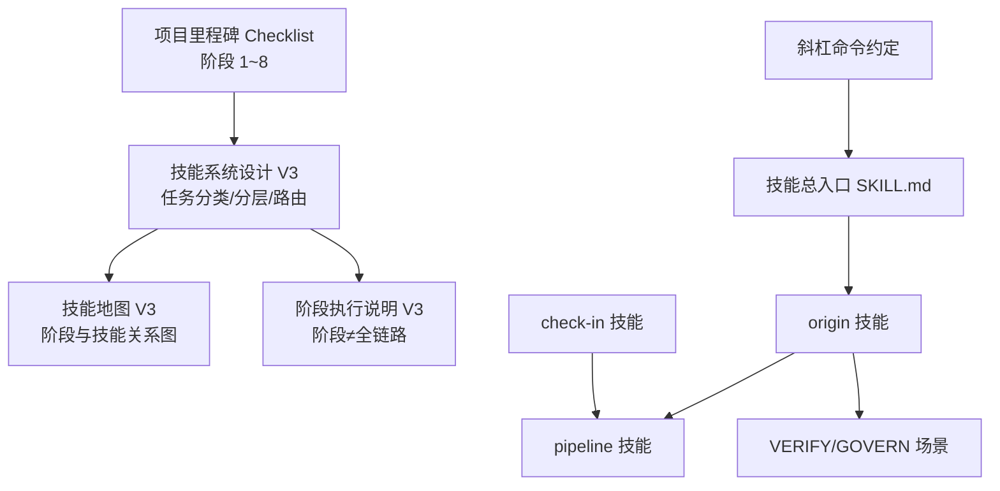
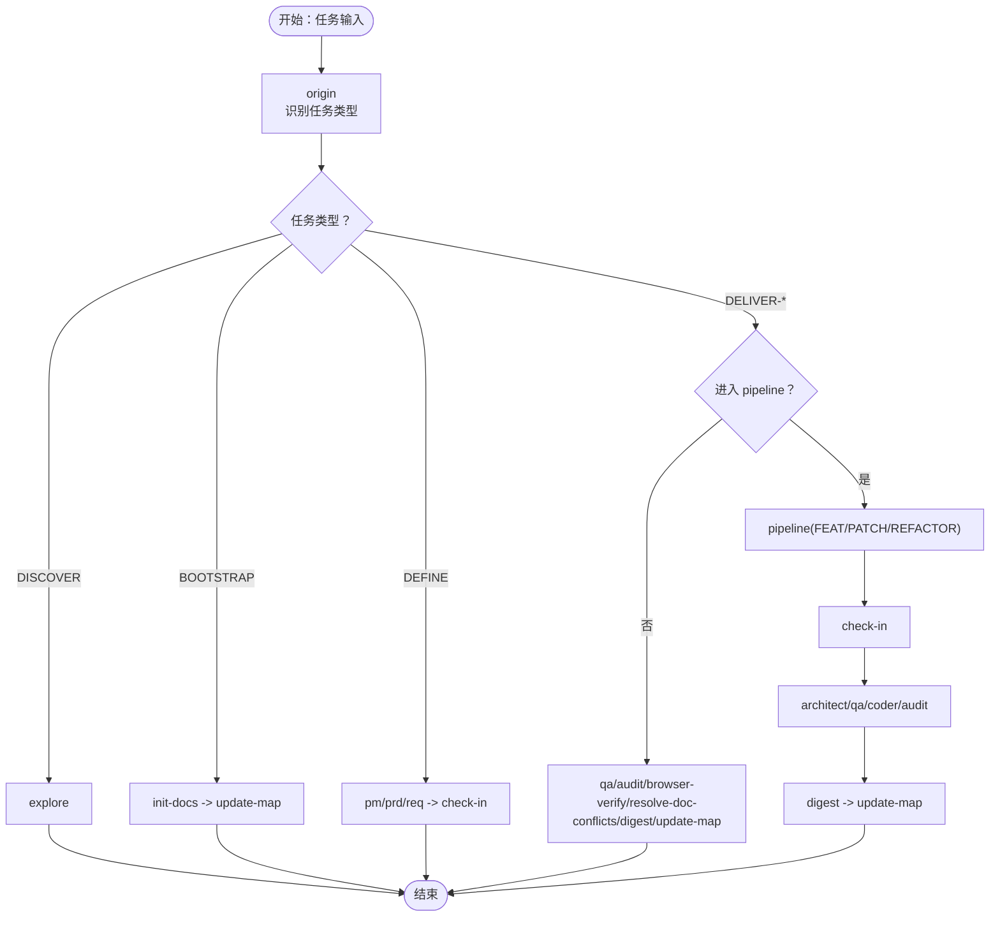
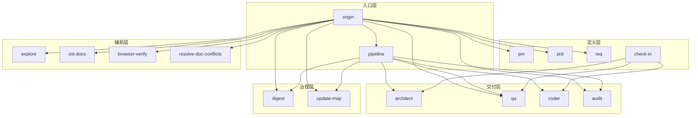

# 阶段模型设计

<cite>
**本文引用的文件**
- [Web3-AI-Agent 阶段执行说明-V3.md](file://Web3-AI-Agent-阶段执行说明-V3.md)
- [Web3-AI-Agent 项目里程碑-Checklist.md](file://Web3-AI-Agent-项目里程碑-Checklist.md)
- [Web3-AI-Agent Skill 系统设计-V3.md](file://skills\web3-ai-agent\SKILL-SYSTEM-DESIGN-V3.md)
- [Web3-AI-Agent 技能地图-V3.md](file://skills\web3-ai-agent\MAP-V3.md)
- [Web3-AI-Agent 技能总入口.md](file://skills\web3-ai-agent\SKILL.md)
- [斜杠命令约定.md](file://skills\web3-ai-agent\COMMANDS.md)
- [origin 技能.md](file://skills\web3-ai-agent\origin\SKILL.md)
- [check-in 技能.md](file://skills\web3-ai-agent\check-in\SKILL.md)
- [pipeline 技能.md](file://skills\web3-ai-agent\pipeline\SKILL.md)
</cite>

## 目录
1. [简介](#简介)
2. [项目结构](#项目结构)
3. [核心组件](#核心组件)
4. [架构总览](#架构总览)
5. [详细组件分析](#详细组件分析)
6. [依赖分析](#依赖分析)
7. [性能考虑](#性能考虑)
8. [故障排查指南](#故障排查指南)
9. [结论](#结论)
10. [附录](#附录)

## 简介
本设计文档围绕 AI-Agent 技能系统中的“阶段模型”展开，基于仓库中 V3 版本的技能体系与阶段执行说明，系统化梳理从 Phase 1 到 Phase 8 的阶段性目标、产出物、学习目标、完成标准与验收条件，并阐明阶段间依赖关系与回退机制。文档旨在帮助团队以一致化的方法论推进项目，确保交付效率与质量控制的平衡。

## 项目结构
仓库中与阶段模型直接相关的文件主要集中在 skills/web3-ai-agent 目录及项目里程碑清单中，核心文件包括：
- 技能系统设计（V3）：定义任务分类、分层、路由与执行骨架
- 技能地图（V3）：可视化阶段与技能之间的关系
- 阶段执行说明（V3）：强调“阶段”不等于“每次都完整跑一遍”的理念
- 项目里程碑 Checklist：将阶段模型映射到具体可验证的阶段与产出
- 技能总入口与各关键技能（origin、check-in、pipeline）：定义职责边界与硬规则

图表来源
- [Web3-AI-Agent 项目里程碑-Checklist.md:1-242](file://Web3-AI-Agent-项目里程碑-Checklist.md#L1-L242)
- [Web3-AI-Agent Skill 系统设计-V3.md:1-719](file://skills\web3-ai-agent\SKILL-SYSTEM-DESIGN-V3.md#L1-L719)
- [Web3-AI-Agent 技能地图-V3.md:1-166](file://skills\web3-ai-agent\MAP-V3.md#L1-L166)
- [Web3-AI-Agent 阶段执行说明-V3.md:1-31](file://Web3-AI-Agent-阶段执行说明-V3.md#L1-L31)
- [Web3-AI-Agent 技能总入口.md:1-224](file://skills\web3-ai-agent\SKILL.md#L1-L224)
- [斜杠命令约定.md:1-81](file://skills\web3-ai-agent\COMMANDS.md#L1-L81)
- [origin 技能.md:1-125](file://skills\web3-ai-agent\origin\SKILL.md#L1-L125)
- [check-in 技能.md:1-56](file://skills\web3-ai-agent\check-in\SKILL.md#L1-L56)
- [pipeline 技能.md:1-89](file://skills\web3-ai-agent\pipeline\SKILL.md#L1-L89)

章节来源
- [Web3-AI-Agent 项目里程碑-Checklist.md:1-242](file://Web3-AI-Agent-项目里程碑-Checklist.md#L1-L242)
- [Web3-AI-Agent Skill 系统设计-V3.md:1-719](file://skills\web3-ai-agent\SKILL-SYSTEM-DESIGN-V3.md#L1-L719)
- [Web3-AI-Agent 技能地图-V3.md:1-166](file://skills\web3-ai-agent\MAP-V3.md#L1-L166)
- [Web3-AI-Agent 阶段执行说明-V3.md:1-31](file://Web3-AI-Agent-阶段执行说明-V3.md#L1-L31)
- [Web3-AI-Agent 技能总入口.md:1-224](file://skills\web3-ai-agent\SKILL.md#L1-L224)
- [斜杠命令约定.md:1-81](file://skills\web3-ai-agent\COMMANDS.md#L1-L81)
- [origin 技能.md:1-125](file://skills\web3-ai-agent\origin\SKILL.md#L1-L125)
- [check-in 技能.md:1-56](file://skills\web3-ai-agent\check-in\SKILL.md#L1-L56)
- [pipeline 技能.md:1-89](file://skills\web3-ai-agent\pipeline\SKILL.md#L1-L89)

## 核心组件
- 阶段与任务关系：V3 强调“阶段”不等于“每次都完整跑一遍”，不同任务只引用自身所需的阶段。
- 任务类型与路由：由 origin 先识别任务类型，再决定是否进入 pipeline 以及是否强制 check-in。
- 执行骨架：route -> define(按需) -> check-in -> design(按需) -> build -> closeout。
- 三类交付管道：FEAT（全链路）、PATCH（快链路）、REFACTOR（设计优先）。
- 质量与风险控制：QA 红绿灯规则、Coder 自愈规则、Audit 评分规则。

章节来源
- [Web3-AI-Agent 阶段执行说明-V3.md:1-31](file://Web3-AI-Agent-阶段执行说明-V3.md#L1-L31)
- [Web3-AI-Agent Skill 系统设计-V3.md:222-285](file://skills\web3-ai-agent\SKILL-SYSTEM-DESIGN-V3.md#L222-L285)
- [Web3-AI-Agent Skill 系统设计-V3.md:288-392](file://skills\web3-ai-agent\SKILL-SYSTEM-DESIGN-V3.md#L288-L392)
- [Web3-AI-Agent Skill 系统设计-V3.md:696-719](file://skills\web3-ai-agent\SKILL-SYSTEM-DESIGN-V3.md#L696-L719)

## 架构总览
阶段模型以“任务类型识别”为起点，通过“是否进入 pipeline”和“是否强制 check-in”两条判定线，将不同任务分流至探索、定义、交付与治理四类主干路径；交付型任务进一步由三类管道承载，最终在 closeout 阶段沉淀与更新地图。

图表来源
- [Web3-AI-Agent 技能地图-V3.md:3-84](file://skills\web3-ai-agent\MAP-V3.md#L3-L84)
- [Web3-AI-Agent 技能地图-V3.md:132-156](file://skills\web3-ai-agent\MAP-V3.md#L132-L156)
- [Web3-AI-Agent Skill 系统设计-V3.md:222-285](file://skills\web3-ai-agent\SKILL-SYSTEM-DESIGN-V3.md#L222-L285)

章节来源
- [Web3-AI-Agent 技能地图-V3.md:1-166](file://skills\web3-ai-agent\MAP-V3.md#L1-L166)
- [Web3-AI-Agent Skill 系统设计-V3.md:222-285](file://skills\web3-ai-agent\SKILL-SYSTEM-DESIGN-V3.md#L222-L285)

## 详细组件分析

### 阶段 1：项目初始化
- 学习目标：建立项目基础结构、技术栈与文档体系，明确 skill 体系职责边界。
- 完成标准：文档结构已建立，开发方式与阶段流程清晰，skill 体系职责边界明确。
- 阶段产出：项目初始化说明、文档目录与命名规范、skill 体系方案文档。
- 关联 skill：origin、prd、update-map。
- 验收条件：可验证的文档与方案，不以口头完成为准。

章节来源
- [Web3-AI-Agent 项目里程碑-Checklist.md:9-34](file://Web3-AI-Agent-项目里程碑-Checklist.md#L9-L34)

### 阶段 2：PRD 与需求边界确认
- 学习目标：明确目标用户画像、核心使用场景、MVP 功能范围与验收标准。
- 完成标准：PRD 能回答“做什么、不做什么、为什么现在做”，文档足以支撑需求拆解，无重大范围歧义。
- 阶段产出：MVP PRD 文档、阶段执行说明。
- 关联 skill：prd、pm、req。
- 验收条件：PRD 可执行、边界清晰、无重大歧义。

章节来源
- [Web3-AI-Agent 项目里程碑-Checklist.md:37-63](file://Web3-AI-Agent-项目里程碑-Checklist.md#L37-L63)

### 阶段 3：Agent 核心能力定义
- 学习目标：明确 Agent 角色定位、对话/工具调用/Loop/Memory 边界，区分 MVP 与后续迭代。
- 完成标准：能区分 Chat 与 Agent 的实现差异，清楚说明 Tool、Loop、Memory 的作用，不会把非 MVP 能力提前实现。
- 阶段产出：Agent 能力定义说明、MVP 能力边界表。
- 关联 skill：learn-gate/architect、audit。
- 验收条件：能力边界清晰、实现不越界。

章节来源
- [Web3-AI-Agent 项目里程碑-Checklist.md:66-90](file://Web3-AI-Agent-项目里程碑-Checklist.md#L66-L90)

### 阶段 4：Web3 工具与数据能力设计
- 学习目标：明确链上/价格/余额/Gas 等数据来源，为每个工具定义输入/输出与错误处理。
- 完成标准：至少定义 3 个核心工具，每个工具清晰定义输入输出与外部依赖，失败场景可解释。
- 阶段产出：Web3 工具清单、Tool Contract 草案、数据来源说明。
- 关联 skill：learn-gate/architect、qa。
- 验收条件：工具清单完整、输入输出明确、可解释失败场景。

章节来源
- [Web3-AI-Agent 项目里程碑-Checklist.md:93-118](file://Web3-AI-Agent-项目里程碑-Checklist.md#L93-L118)

### 阶段 5：系统架构与模块契约
- 学习目标：明确前端/API/Agent Core/Tools 模块边界、消息/数据流、工具执行与回填流程、Memory 最小实现与错误处理/降级策略。
- 完成标准：架构图可指导后续开发，模块边界无冲突，关键交互路径可追踪。
- 阶段产出：系统架构图、模块职责说明、接口契约文档。
- 关联 skill：architect、qa、update-map。
- 验收条件：架构可落地、边界清晰、交互可追踪。

章节来源
- [Web3-AI-Agent 项目里程碑-Checklist.md:121-146](file://Web3-AI-Agent-项目里程碑-Checklist.md#L121-L146)

### 阶段 6：测试与验收设计
- 学习目标：为每个 MVP 能力定义验收点，制定测试问题集、工具调用验证点、错误处理验证点、风险提示验证点。
- 完成标准：能覆盖主路径与关键异常路径，能验证工具被正确调用，能验证系统不会输出不安全建议。
- 阶段产出：测试策略说明、阶段验收清单、高风险问题测试列表。
- 关联 skill：qa、audit。
- 验收条件：测试覆盖全面、风险可控。

章节来源
- [Web3-AI-Agent 项目里程碑-Checklist.md:149-173](file://Web3-AI-Agent-项目里程碑-Checklist.md#L149-L173)

### 阶段 7：Vibe Coding 实现
- 学习目标：完成基础 Chat UI、流式输出、至少 2 个 Tool Calling、Agent Loop v1、基础错误处理与最小 Memory 支持。
- 完成标准：用户可通过自然语言触发工具，工具结果可形成最终自然语言回答，失败时有合理降级。
- 阶段产出：可运行的 Web3 AI Agent MVP、开发记录、已实现能力清单。
- 关联 skill：coder、qa、audit。
- 验收条件：MVP 可运行、交互自然、失败可降级。

章节来源
- [Web3-AI-Agent 项目里程碑-Checklist.md:176-202](file://Web3-AI-Agent-项目里程碑-Checklist.md#L176-L202)

### 阶段 8：审计、复盘与沉淀
- 学习目标：检查工具调用安全性、链上数据真实性说明、免责声明、状态流清晰度，输出阶段复盘与下一步路线。
- 完成标准：主要风险有明确记录，已知问题被显式列出，下一阶段方向明确。
- 阶段产出：质量审计结论、阶段复盘文档、下一阶段迭代计划。
- 关联 skill：audit、digest、update-map。
- 验收条件：风险可见、问题可追溯、方向明确。

章节来源
- [Web3-AI-Agent 项目里程碑-Checklist.md:205-230](file://Web3-AI-Agent-项目里程碑-Checklist.md#L205-L230)

### 阶段间的依赖关系与回退机制
- 依赖关系
  - 阶段 1 → 阶段 2：必须完成文档与边界定义，才能进行后续设计与实现。
  - 阶段 2 → 阶段 3：PRD 明确后，才能定义核心能力边界。
  - 阶段 3 → 阶段 4：能力定义完成后，才能设计工具与数据来源。
  - 阶段 4 → 阶段 5：工具设计完成后，才能进行系统架构设计。
  - 阶段 5 → 阶段 6：架构完成后，才能制定测试与验收策略。
  - 阶段 6 → 阶段 7：测试策略完成后，才能进入实现阶段。
  - 阶段 7 → 阶段 8：实现完成后，进行审计、复盘与沉淀。
- 回退机制
  - 若发现范围变化，优先回退至 PRD/REQ 定义层，重新对齐边界后再继续。
  - 若 QA 红灯或审计不通过，按规则回退修复，直至满足标准。

章节来源
- [Web3-AI-Agent 项目里程碑-Checklist.md:30-33](file://Web3-AI-Agent-项目里程碑-Checklist.md#L30-L33)
- [Web3-AI-Agent 项目里程碑-Checklist.md:169-172](file://Web3-AI-Agent-项目里程碑-Checklist.md#L169-L172)
- [Web3-AI-Agent Skill 系统设计-V3.md:696-719](file://skills\web3-ai-agent\SKILL-SYSTEM-DESIGN-V3.md#L696-L719)

### 应用指南与实践案例
- 应用指南
  - 使用统一入口：始终以 /origin 作为第一跳，由 origin 判断任务类型并路由到相应技能或管道。
  - 按需选择阶段：不同任务只引用自身所需的阶段，避免不必要的流程负担。
  - 强制 check-in：仅对实施型任务强制 check-in，确保问题、边界、方案与完成标准明确。
  - 快慢链路：PATCH 默认走快链路，REFACTOR 优先保障结构与回归，FEAT 优先保障边界与验收。
- 实际案例
  - 新功能开发：/origin -> pipeline(FEAT) -> pm(按需) -> prd -> req -> check-in -> architect -> qa -> coder -> audit -> digest -> update-map。
  - 修 bug：/origin -> pipeline(PATCH) -> req -> check-in -> coder -> qa -> digest -> update-map。
  - 重构：/origin -> pipeline(REFACTOR) -> req -> check-in -> architect -> qa -> coder -> audit -> digest -> update-map。
  - 探索项目：/origin -> explore。
  - 文档冲突处理：/origin -> resolve-doc-conflicts。

章节来源
- [斜杠命令约定.md:1-81](file://skills\web3-ai-agent\COMMANDS.md#L1-L81)
- [Web3-AI-Agent 技能总入口.md:73-159](file://skills\web3-ai-agent\SKILL.md#L73-L159)
- [Web3-AI-Agent Skill 系统设计-V3.md:603-675](file://skills\web3-ai-agent\SKILL-SYSTEM-DESIGN-V3.md#L603-L675)

## 依赖分析
阶段模型在技能层面体现为“入口层（origin/pipeline）—定义层（pm/prd/req/check-in）—交付层（architect/qa/coder/audit）—治理层（digest/update-map）—辅助层（explore/init-docs/browser-verify/resolve-doc-conflicts）”的五层结构。各阶段与技能之间的依赖如下：

图表来源
- [Web3-AI-Agent 技能地图-V3.md:164-220](file://skills\web3-ai-agent\MAP-V3.md#L164-L220)
- [Web3-AI-Agent Skill 系统设计-V3.md:439-601](file://skills\web3-ai-agent\SKILL-SYSTEM-DESIGN-V3.md#L439-L601)

章节来源
- [Web3-AI-Agent 技能地图-V3.md:164-220](file://skills\web3-ai-agent\MAP-V3.md#L164-L220)
- [Web3-AI-Agent Skill 系统设计-V3.md:439-601](file://skills\web3-ai-agent\SKILL-SYSTEM-DESIGN-V3.md#L439-L601)

## 性能考虑
- 流程分流：通过 origin 的任务类型识别与 pipeline 的分级选择，避免所有任务走完整长链路，提升整体交付效率。
- 质量前置：QA 红绿灯规则与 Audit 评分规则在早期拦截问题，减少后期返工成本。
- 自愈循环：Coder 自愈规则限制最大尝试轮次，避免无限循环，保证问题在可控时间内得到处理。
- 文档治理：digest 与 update-map 合并为 closeout，减少流程割裂感，提升知识沉淀效率。

章节来源
- [Web3-AI-Agent Skill 系统设计-V3.md:696-719](file://skills\web3-ai-agent\SKILL-SYSTEM-DESIGN-V3.md#L696-L719)
- [Web3-AI-Agent 技能地图-V3.md:267-285](file://skills\web3-ai-agent\MAP-V3.md#L267-L285)

## 故障排查指南
- 未通过 check-in
  - 现象：无法进入 architect/qa/coder。
  - 原因：未完成 check-in 输出或未明确“不做什么”与完成标准。
  - 处理：回到 check-in，补齐输出模板要求项。
- QA 红灯
  - 现象：FEAT 默认先执行 RED，目标是证明“当前未通过”。
  - 处理：coder 在限定轮次内自愈，若超限则终止并人工介入。
- 审计不通过
  - 现象：Audit 总分低于阈值。
  - 处理：按评分规则回退修复或直接拒绝，严重问题可一票否决。
- 范围漂移
  - 现象：FEAT 边界不清导致扩 scope。
  - 处理：回退至 prd/req，重新对齐边界后再继续。

章节来源
- [check-in 技能.md:51-56](file://skills\web3-ai-agent\check-in\SKILL.md#L51-L56)
- [Web3-AI-Agent Skill 系统设计-V3.md:700-719](file://skills\web3-ai-agent\SKILL-SYSTEM-DESIGN-V3.md#L700-L719)
- [Web3-AI-Agent 技能地图-V3.md:158-166](file://skills\web3-ai-agent\MAP-V3.md#L158-L166)

## 结论
本阶段模型以“任务类型识别—按需阶段—质量前置—快速回退”为核心，将原本可能冗长的交付流程转化为可分流的操作系统。通过明确各阶段的学习目标、完成标准与验收条件，并结合 origin/pipeline/check-in 等关键技能的硬规则，团队可在保证质量的同时最大化交付效率，持续迭代与演进。

## 附录
- 关键技能职责与规则
  - origin：统一入口路由，识别任务类型并决定下一跳。
  - pipeline：仅服务交付型任务，选择执行深度。
  - check-in：实施前对齐点，强制输出七项模板。
  - 质量与风险控制：QA 红绿灯、Coder 自愈、Audit 评分。
- 斜杠命令参考
  - /origin、/pipeline feat/patch/refactor、/pm、/prd、/req、/check-in、/architect、/qa、/coder、/audit、/digest、/update-map、/explore、/init-docs、/browser-verify、/resolve-doc-conflicts。

章节来源
- [origin 技能.md:1-125](file://skills\web3-ai-agent\origin\SKILL.md#L1-L125)
- [pipeline 技能.md:1-89](file://skills\web3-ai-agent\pipeline\SKILL.md#L1-L89)
- [check-in 技能.md:1-56](file://skills\web3-ai-agent\check-in\SKILL.md#L1-L56)
- [斜杠命令约定.md:29-50](file://skills\web3-ai-agent\COMMANDS.md#L29-L50)
- [Web3-AI-Agent Skill 系统设计-V3.md:696-719](file://skills\web3-ai-agent\SKILL-SYSTEM-DESIGN-V3.md#L696-L719)