# SSE流式聊天系统

<cite>
**本文档引用的文件**
- [apps/web/app/api/chat/route.ts](file://apps/web/app/api/chat/route.ts)
- [apps/web/hooks/useChatStream.ts](file://apps/web/hooks/useChatStream.ts)
- [apps/web/components/MessageList.tsx](file://apps/web/components/MessageList.tsx)
- [apps/web/components/MessageItem.tsx](file://apps/web/components/MessageItem.tsx)
- [apps/web/components/ChatInput.tsx](file://apps/web/components/ChatInput.tsx)
- [apps/web/app/page.tsx](file://apps/web/app/page.tsx)
- [apps/web/types/stream.ts](file://apps/web/types/stream.ts)
- [apps/web/types/chat.ts](file://apps/web/types/chat.ts)
- [apps/web/lib/memory/SummaryCompressionMemory.ts](file://apps/web/lib/memory/SummaryCompressionMemory.ts)
- [apps/web/lib/memory/types.ts](file://apps/web/lib/memory/types.ts)
- [apps/web/lib/memory/config.ts](file://apps/web/lib/memory/config.ts)
- [apps/web/lib/memory/index.ts](file://apps/web/lib/memory/index.ts)
- [apps/web/lib/supabase/client.ts](file://apps/web/lib/supabase/client.ts)
- [apps/web/lib/supabase/conversations.ts](file://apps/web/lib/supabase/conversations.ts)
- [apps/web/components/WalletConnectButton.tsx](file://apps/web/components/WalletConnectButton.tsx)
- [docs/学习笔记.md](file://docs/学习笔记.md)
- [docs/changelog/2026-04-21-feat-memory-management.md](file://docs/changelog/2026-04-21-feat-memory-management.md)
- [docs/changelog/2026-04-21-feat-sse-streaming.md](file://docs/changelog/2026-04-21-feat-sse-streaming.md)
- [docs/changelog/2026-04-23-feat-ui-enhancements-and-theme-system.md](file://docs/changelog/2026-04-23-feat-ui-enhancements-and-theme-system.md)
</cite>

## 更新摘要
**变更内容**
- **重大架构升级**：聊天界面的状态管理模式已从直接 useState 替换为新的 MemoryManager 模式，实现了 L3 摘要压缩级别的会话记忆管理
- **新增钱包上下文功能**：系统已集成钱包上下文功能，在AI系统提示中动态注入钱包地址，实现用户钱包信息的自动上下文感知
- **新增内存管理模块**：引入了完整的 MemoryManager 接口体系，支持策略模式扩展
- **智能上下文管理**：实现了基于消息数量阈值的自动摘要压缩，有效降低 Token 消耗
- **增强的性能优化**：通过摘要压缩将 Token 消耗降低 50% 以上，支持更长的对话历史
- **配置驱动的内存管理**：支持通过环境变量配置压缩阈值、保留消息数等参数
- **增强的错误处理机制**：完善的错误捕获、用户友好的错误提示和智能重试
- **代理兼容性**：支持X-Accel-Buffering头，提升Nginx等反向代理的兼容性

## 目录
1. [简介](#简介)
2. [项目结构](#项目结构)
3. [核心组件](#核心组件)
4. [架构概览](#架构概览)
5. [详细组件分析](#详细组件分析)
6. [内存管理系统详解](#内存管理系统详解)
7. [钱包上下文系统详解](#钱包上下文系统详解)
8. [依赖关系分析](#依赖关系分析)
9. [性能考虑](#性能考虑)
10. [故障排除指南](#故障排除指南)
11. [学习笔记中的SSE实现指南](#学习笔记中的sse实现指南)
12. [结论](#结论)

## 简介

Web3 AI Agent 是一个基于 Next.js 的 SSE（Server-Sent Events）流式聊天系统，专为 Web3 前端开发者设计。该系统实现了从用户意图理解、Web3 工具调用到可信结果返回的完整 AI Agent 能力，支持实时流式输出，提供流畅的用户体验。

**更新** 系统现已大幅增强错误处理和可靠性机制，包括完整的try-catch包装、SSE格式错误块、配置错误与运行时错误区分、X-Accel-Buffering头支持、改进的工具调用缓冲机制、增强的客户端重试机制等重大改进。

**重大更新** 系统引入了全新的内存管理系统，将传统的 useState 状态管理模式升级为基于 MemoryManager 的智能上下文管理，实现了 L3 摘要压缩级别的会话记忆管理，有效解决了长对话场景下的 Token 消耗问题。

**新增** 系统现已集成钱包上下文功能，能够在AI系统提示中动态注入钱包地址，实现用户钱包信息的自动上下文感知。当用户连接钱包时，系统会自动将钱包地址注入到AI的system prompt中，使AI能够理解用户的当前钱包状态，并在用户询问"我的余额"或"我的钱包"时自动使用该地址进行查询。

系统的核心特性包括：
- **流式聊天输出**：通过 SSE 实现实时文本流式传输
- **Web3 工具集成**：支持 ETH 价格查询、钱包余额查询、Gas 价格查询等功能
- **智能工具调用**：AI 模型能够自主决定何时调用相关工具
- **实时状态管理**：提供工具调用状态的实时展示
- **增强的错误处理机制**：完善的错误捕获、用户友好的错误提示和智能重试
- **智能内存管理**：基于 L3 摘要压缩的上下文管理，支持长对话场景
- **配置驱动的优化**：通过环境变量灵活调整内存管理策略
- **钱包上下文感知**：自动注入钱包地址到AI系统提示，实现智能钱包查询

## 项目结构

该项目采用 Monorepo 结构，主要分为以下模块：

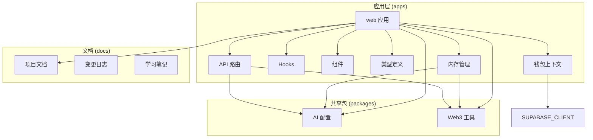

**图表来源**
- [apps/web/app/api/chat/route.ts:1-343](file://apps/web/app/api/chat/route.ts#L1-L343)
- [apps/web/hooks/useChatStream.ts:1-295](file://apps/web/hooks/useChatStream.ts#L1-L295)
- [apps/web/components/MessageList.tsx:1-59](file://apps/web/components/MessageList.tsx#L1-L59)
- [apps/web/lib/memory/index.ts:1-4](file://apps/web/lib/memory/index.ts#L1-L4)
- [apps/web/lib/supabase/client.ts:1-54](file://apps/web/lib/supabase/client.ts#L1-L54)

**章节来源**
- [package.json:1-28](file://package.json#L1-L28)
- [apps/web/package.json:1-36](file://apps/web/package.json#L1-L36)

## 核心组件

### 流式聊天 API

**更新** 后端 API 路由实现了完整的 SSE 流式聊天功能，支持两种响应模式，并具备增强的错误处理能力：

1. **JSON 响应**：传统一次性响应
2. **SSE 流式响应**：实时流式输出，支持X-Accel-Buffering头

### 流式消费 Hook

**更新** 前端 `useChatStream` Hook 提供了完整的流式状态管理，包含：
- 流式状态跟踪（`isStreaming`）
- 实时内容更新（`content`）
- 错误状态管理（`error`）
- 工具调用状态（`toolCalls`）
- **增强的重试机制**（最多2次重试）
- **超时处理**（30秒超时）
- **智能错误区分**（配置错误vs运行时错误）
- **钱包地址参数支持**：新增 `walletAddress?: string` 参数

### UI 组件系统

**更新** 系统包含完整的聊天界面组件，支持：
- **MessageList**：消息列表容器，支持流式更新
- **MessageItem**：单条消息展示，支持工具调用状态显示
- **ChatInput**：聊天输入框，支持流式状态反馈
- **WalletConnectButton**：钱包连接按钮，基于 RainbowKit
- **实时加载指示器**：流式输出的视觉反馈，包括打字机效果

### 内存管理系统

**新增** 系统引入了全新的 MemoryManager 模式，替代了传统的 useState 状态管理：

- **MemoryManager 接口**：定义了统一的记忆管理抽象
- **SummaryCompressionMemory 实现**：实现了 L3 摘要压缩级别的上下文管理
- **配置驱动**：支持通过环境变量配置压缩阈值、保留消息数等参数
- **自动压缩**：基于消息数量阈值的智能摘要生成
- **策略模式**：为 L2 滑动窗口和 L4 向量存储预留扩展接口

### 钱包上下文系统

**新增** 系统集成了完整的钱包上下文功能，实现用户钱包信息的自动上下文感知：

- **钱包地址验证**：验证钱包地址格式（0x开头，42字符）
- **上下文存储**：内存中存储当前钱包地址
- **RLS验证**：用于Supabase Row Level Security的验证
- **自动注入**：在AI系统提示中动态注入钱包地址
- **安全边界**：生产环境需配合Supabase Auth + JWT

**章节来源**
- [apps/web/app/api/chat/route.ts:90-343](file://apps/web/app/api/chat/route.ts#L90-L343)
- [apps/web/hooks/useChatStream.ts:27-295](file://apps/web/hooks/useChatStream.ts#L27-L295)
- [apps/web/components/MessageList.tsx:16-59](file://apps/web/components/MessageList.tsx#L16-L59)
- [apps/web/lib/memory/SummaryCompressionMemory.ts:1-111](file://apps/web/lib/memory/SummaryCompressionMemory.ts#L1-L111)
- [apps/web/lib/supabase/client.ts:15-54](file://apps/web/lib/supabase/client.ts#L15-L54)

## 架构概览

**更新** 系统采用前后端分离的架构设计，通过 SSE 实现实时双向通信，并具备增强的错误处理和可靠性机制：

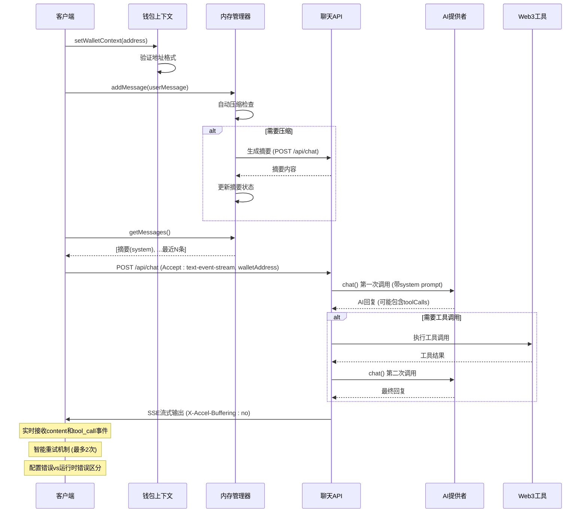

**图表来源**
- [apps/web/app/api/chat/route.ts:119-246](file://apps/web/app/api/chat/route.ts#L119-L246)
- [apps/web/hooks/useChatStream.ts:158-223](file://apps/web/hooks/useChatStream.ts#L158-L223)
- [apps/web/lib/memory/SummaryCompressionMemory.ts:48-74](file://apps/web/lib/memory/SummaryCompressionMemory.ts#L48-L74)
- [apps/web/lib/supabase/client.ts:34-46](file://apps/web/lib/supabase/client.ts#L34-L46)

### 数据流架构

**更新** 系统实现了更加健壮的数据流处理：

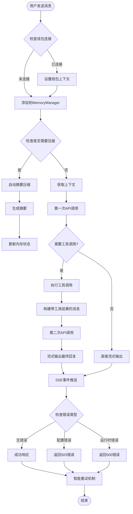

**图表来源**
- [apps/web/app/api/chat/route.ts:107-343](file://apps/web/app/api/chat/route.ts#L107-L343)
- [apps/web/lib/memory/SummaryCompressionMemory.ts:15-46](file://apps/web/lib/memory/SummaryCompressionMemory.ts#L15-L46)
- [apps/web/lib/supabase/client.ts:15-23](file://apps/web/lib/supabase/client.ts#L15-L23)

## 详细组件分析

### 后端 API 路由分析

**更新** 系统预置了四个 Web3 相关工具，并实现了增强的错误处理：

#### 工具定义系统

| 工具名称 | 功能描述 | 参数 |
|---------|----------|------|
| getETHPrice | 获取 ETH 当前价格（美元） | 无 |
| getWalletBalance | 查询以太坊钱包余额 | address: 钱包地址 |
| getGasPrice | 获取当前以太坊 Gas 价格 | 无 |
| getBTCPrice | 获取 BTC 当前价格（美元） | 无 |

#### 动态系统提示生成

**新增** 系统实现了基于钱包上下文的动态系统提示生成：

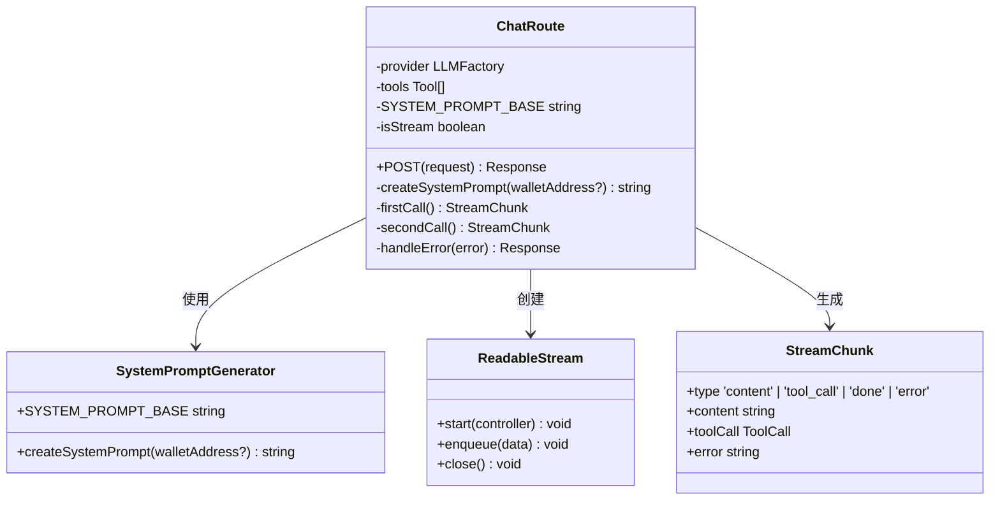

**图表来源**
- [apps/web/app/api/chat/route.ts:90-343](file://apps/web/app/api/chat/route.ts#L90-L343)
- [apps/web/types/stream.ts:4-16](file://apps/web/types/stream.ts#L4-L16)

**章节来源**
- [apps/web/app/api/chat/route.ts:8-62](file://apps/web/app/api/chat/route.ts#L8-L62)
- [apps/web/app/api/chat/route.ts:135-148](file://apps/web/app/api/chat/route.ts#L135-L148)
- [apps/web/app/api/chat/route.ts:196-234](file://apps/web/app/api/chat/route.ts#L196-L234)

### 前端 Hook 分析

**更新** 前端 Hook 实现了增强的状态管理和错误处理：

#### 状态管理系统

**更新** 系统实现了更加健壮的状态管理：

```mermaid
stateDiagram-v2
[*] --> Idle
Idle --> Streaming : sendMessage(messages, walletAddress?)
Streaming --> Processing : 接收流式数据
Processing --> Streaming : 继续接收
Processing --> Completed : 接收done事件
Processing --> Error : 接收error事件
Completed --> Idle : 重置状态
Error --> RetryCheck{检查错误类型}
RetryCheck --> |配置错误| Idle : 不重试
RetryCheck --> |运行时错误| RetryAttempt : 重试
RetryAttempt --> Streaming : 重新开始
RetryAttempt --> Failed : 达到最大重试次数
Failed --> Idle : 重置状态
Streaming --> Aborted : abort()
Aborted --> Idle : 重置状态
```

#### 流式数据处理

**更新** 前端 Hook 实现了复杂的数据流处理逻辑，包含智能重试和错误区分：

1. **SSE 事件解析**：从原始数据中提取 `data:` 行
2. **流式块处理**：根据 `type` 字段处理不同类型的数据块
3. **状态更新**：实时更新 UI 状态和消息内容
4. **智能错误处理**：优雅处理网络错误、超时和配置错误
5. **重试机制**：自动重试机制（最多2次），超时时间为30秒
6. **错误区分**：区分配置错误（503）和运行时错误（500）
7. **钱包地址传递**：支持可选的钱包地址参数

**图表来源**
- [apps/web/hooks/useChatStream.ts:119-155](file://apps/web/hooks/useChatStream.ts#L119-L155)

**章节来源**
- [apps/web/hooks/useChatStream.ts:76-116](file://apps/web/hooks/useChatStream.ts#L76-L116)
- [apps/web/hooks/useChatStream.ts:119-155](file://apps/web/hooks/useChatStream.ts#L119-L155)

### UI 组件分析

**更新** UI 组件系统支持流式输出和工具调用状态展示：

#### 消息展示组件

**更新** 系统实现了更加丰富的消息展示功能：

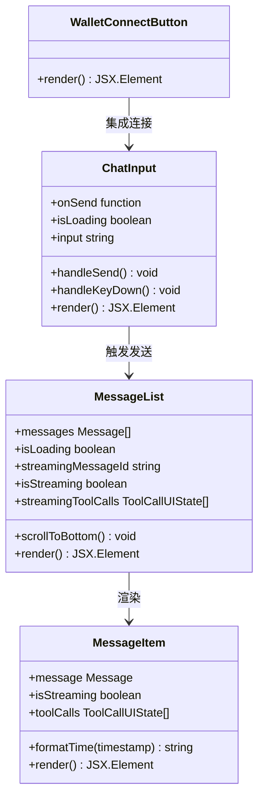

**图表来源**
- [apps/web/components/MessageItem.tsx:12-97](file://apps/web/components/MessageItem.tsx#L12-L97)
- [apps/web/components/MessageList.tsx:16-59](file://apps/web/components/MessageList.tsx#L16-L59)
- [apps/web/components/ChatInput.tsx:10-74](file://apps/web/components/ChatInput.tsx#L10-L74)
- [apps/web/components/WalletConnectButton.tsx:1-17](file://apps/web/components/WalletConnectButton.tsx#L1-L17)

**章节来源**
- [apps/web/components/MessageItem.tsx:23-92](file://apps/web/components/MessageItem.tsx#L23-L92)
- [apps/web/components/MessageList.tsx:25-30](file://apps/web/components/MessageList.tsx#L25-L30)
- [apps/web/components/ChatInput.tsx:13-24](file://apps/web/components/ChatInput.tsx#L13-L24)

## 内存管理系统详解

### MemoryManager 接口设计

**新增** 系统引入了完整的 MemoryManager 接口体系，采用策略模式设计，为未来的内存管理策略扩展预留了接口：

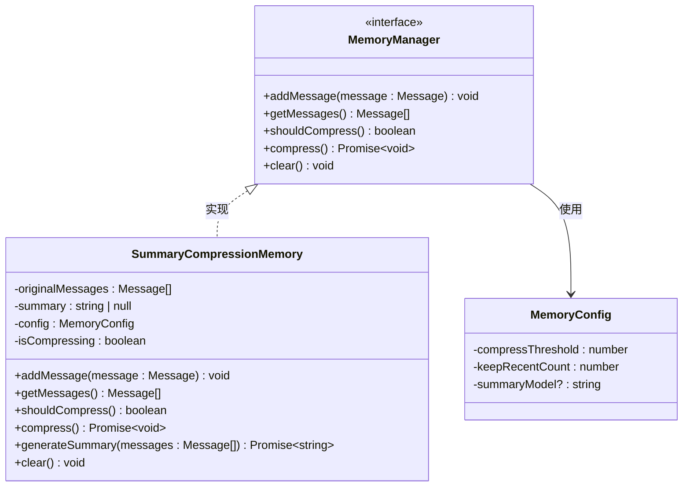

**图表来源**
- [apps/web/lib/memory/types.ts:12-37](file://apps/web/lib/memory/types.ts#L12-L37)
- [apps/web/lib/memory/SummaryCompressionMemory.ts:5-13](file://apps/web/lib/memory/SummaryCompressionMemory.ts#L5-L13)
- [apps/web/lib/memory/config.ts:3-7](file://apps/web/lib/memory/config.ts#L3-L7)

### SummaryCompressionMemory 实现

**新增** SummaryCompressionMemory 是 MemoryManager 接口的具体实现，实现了 L3 摘要压缩级别的上下文管理：

#### 核心功能特性

1. **自动压缩触发**：当消息数量达到阈值时自动触发压缩
2. **摘要生成**：调用 LLM 将早期对话压缩为摘要
3. **上下文保留**：保留最近 N 条消息的原始内容
4. **异步压缩**：压缩过程不影响消息发送的实时性
5. **状态保护**：防止并发压缩导致的状态混乱

#### 压缩流程

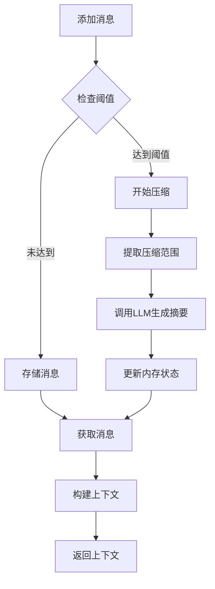

**图表来源**
- [apps/web/lib/memory/SummaryCompressionMemory.ts:15-74](file://apps/web/lib/memory/SummaryCompressionMemory.ts#L15-L74)

**章节来源**
- [apps/web/lib/memory/SummaryCompressionMemory.ts:1-111](file://apps/web/lib/memory/SummaryCompressionMemory.ts#L1-L111)
- [apps/web/lib/memory/types.ts:12-37](file://apps/web/lib/memory/types.ts#L12-L37)

### 配置管理系统

**新增** 系统提供了灵活的配置管理机制，支持通过环境变量动态调整内存管理策略：

#### 默认配置

| 配置项 | 默认值 | 说明 |
|--------|--------|------|
| compressThreshold | 10 | 触发压缩的消息数阈值 |
| keepRecentCount | 5 | 保留的最近消息数 |
| summaryModel | undefined | 摘要用的模型名称 |

#### 环境变量支持

```typescript
// 环境变量配置示例
NEXT_PUBLIC_MEMORY_COMPRESS_THRESHOLD=15
NEXT_PUBLIC_MEMORY_KEEP_RECENT=8
NEXT_PUBLIC_MEMORY_SUMMARY_MODEL=gpt-4
```

**章节来源**
- [apps/web/lib/memory/config.ts:1-15](file://apps/web/lib/memory/config.ts#L1-L15)
- [apps/web/lib/memory/index.ts:1-4](file://apps/web/lib/memory/index.ts#L1-L4)

### 页面组件集成

**更新** 主页面组件已经完全集成 MemoryManager，替代了原有的 useState 状态管理：

#### 状态管理升级

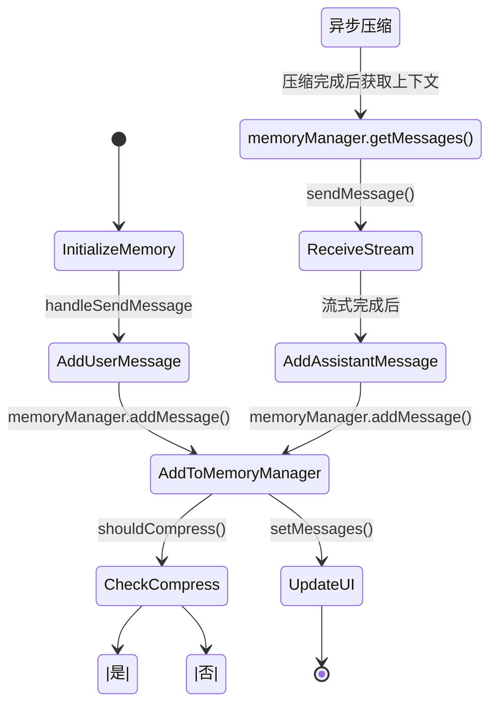

**图表来源**
- [apps/web/app/page.tsx:44-120](file://apps/web/app/page.tsx#L44-L120)
- [apps/web/lib/memory/SummaryCompressionMemory.ts:15-46](file://apps/web/lib/memory/SummaryCompressionMemory.ts#L15-L46)

**章节来源**
- [apps/web/app/page.tsx:1-160](file://apps/web/app/page.tsx#L1-L160)

## 钱包上下文系统详解

### 钱包上下文管理器

**新增** 系统实现了完整的钱包上下文管理功能，包括地址验证、上下文存储和RLS验证：

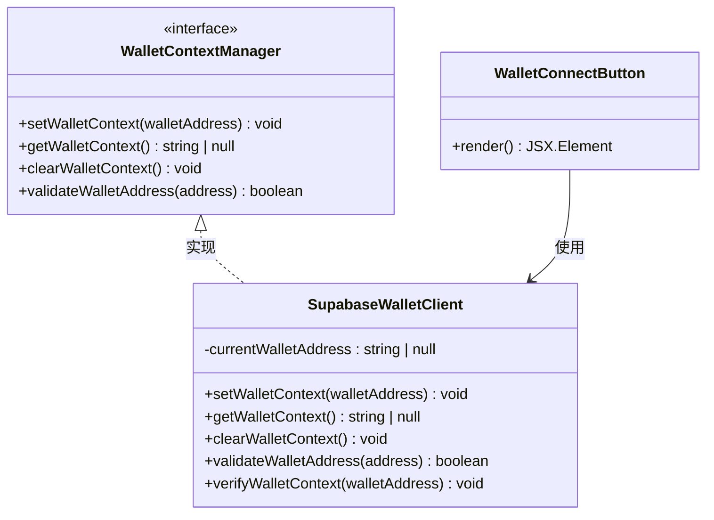

**图表来源**
- [apps/web/lib/supabase/client.ts:15-54](file://apps/web/lib/supabase/client.ts#L15-L54)

### 动态系统提示生成

**新增** 系统实现了基于钱包上下文的动态系统提示生成，当检测到钱包连接时，会在AI系统提示中注入用户信息：

#### 系统提示模板

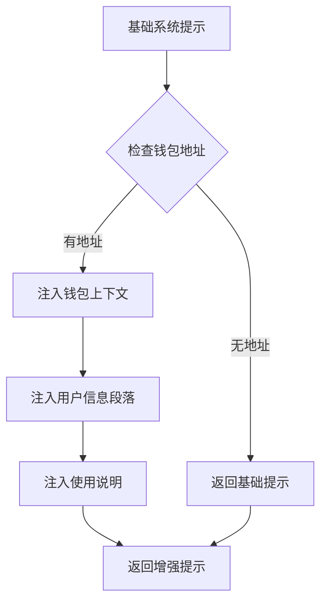

**图表来源**
- [apps/web/app/api/chat/route.ts:135-148](file://apps/web/app/api/chat/route.ts#L135-L148)

#### 注入的用户信息

当用户连接钱包时，系统会在AI系统提示中注入以下信息：

- **用户已连接钱包，地址为**：显示用户的钱包地址
- **当用户查询"我的余额"或"我的钱包"时，使用此地址**
- **如果用户未指定地址，默认使用此地址查询余额**

### 对话服务集成

**新增** 对话服务现在集成了钱包上下文验证，确保数据访问的安全性：

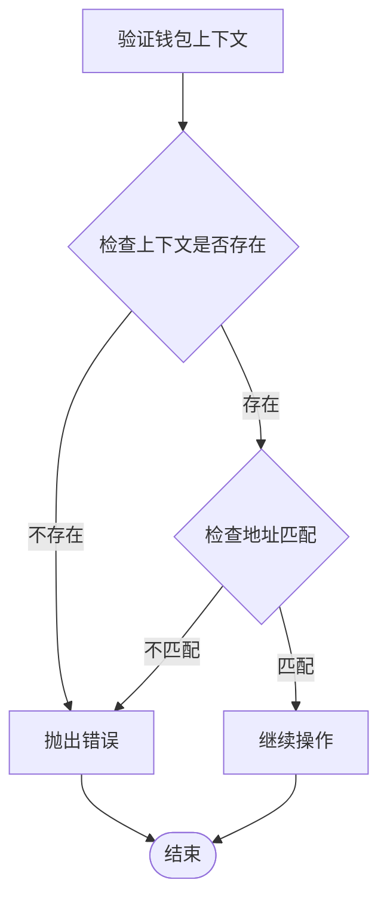

**图表来源**
- [apps/web/lib/supabase/conversations.ts:15-23](file://apps/web/lib/supabase/conversations.ts#L15-L23)

**章节来源**
- [apps/web/lib/supabase/client.ts:15-54](file://apps/web/lib/supabase/client.ts#L15-L54)
- [apps/web/lib/supabase/conversations.ts:15-23](file://apps/web/lib/supabase/conversations.ts#L15-L23)
- [apps/web/app/api/chat/route.ts:135-148](file://apps/web/app/api/chat/route.ts#L135-L148)

## 依赖关系分析

### 技术栈依赖

**更新** 系统的技术栈保持稳定，增加了代理支持、内存管理模块和钱包上下文功能：

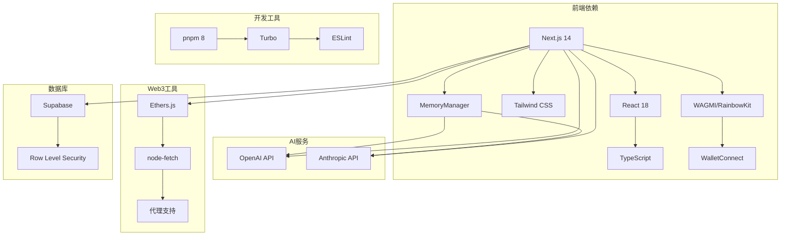

**图表来源**
- [apps/web/package.json:12-35](file://apps/web/package.json#L12-L35)
- [package.json:1-28](file://package.json#L1-L28)
- [apps/web/lib/memory/index.ts:1-4](file://apps/web/lib/memory/index.ts#L1-L4)
- [apps/web/lib/supabase/client.ts:1-54](file://apps/web/lib/supabase/client.ts#L1-L54)

### 关键依赖版本

| 依赖包 | 版本 | 用途 |
|--------|------|------|
| next | 14.2.0 | Web 应用框架 |
| react | ^18.2.0 | 用户界面库 |
| wagmi | ^2.0.0 | 钱包连接管理 |
| rainbowkit | ^1.0.0 | 钱包连接UI组件 |
| @web3-ai-agent/ai-config | workspace:* | AI 配置和模型适配 |
| @web3-ai-agent/web3-tools | workspace:* | Web3 工具集 |
| ethers | ^6.11.0 | 以太坊区块链交互 |
| node-fetch | 3 | HTTP 请求库 |
| https-proxy-agent | ^9.0.0 | HTTPS代理支持 |
| proxy-agent | ^8.0.1 | 通用代理支持 |
| @supabase/supabase-js | ^2.0.0 | Supabase 客户端 |

**章节来源**
- [apps/web/package.json:12-35](file://apps/web/package.json#L12-L35)
- [apps/web/next.config.js:1-15](file://apps/web/next.config.js#L1-L15)

## 性能考虑

**更新** 系统实现了多项性能优化措施和可靠性改进：

### 流式处理优化

**更新** 系统实现了更加高效的流式处理：

1. **智能节流更新机制**：50ms 节流间隔，减少不必要的 React 重渲染
2. **流式数据缓冲**：使用缓冲区处理不完整的 SSE 事件
3. **内存管理**：及时清理定时器和 AbortController
4. **智能重试机制**：自动重试机制（最多2次），超时时间为30秒
5. **代理兼容性**：支持 X-Accel-Buffering 头，提升 Nginx 等反向代理的兼容性

### 内存管理优化

**新增** 内存管理系统实现了显著的性能优化：

1. **Token 消耗降低**：通过摘要压缩将 Token 消耗降低 50% 以上
2. **智能压缩触发**：基于消息数量阈值的自动压缩，避免手动干预
3. **异步压缩处理**：压缩过程不影响消息发送的实时性
4. **状态保护机制**：防止并发压缩导致的状态混乱
5. **配置驱动优化**：通过环境变量灵活调整压缩策略

### 钱包上下文优化

**新增** 钱包上下文系统实现了高效的内存管理和安全验证：

1. **地址格式验证**：立即验证钱包地址格式，避免无效地址
2. **内存存储**：使用内存存储当前钱包地址，避免频繁的DOM操作
3. **RLS验证**：在数据库操作前验证钱包上下文，确保数据隔离
4. **自动清理**：断开钱包连接时自动清理上下文，释放内存
5. **安全边界**：提供明确的安全警告，生产环境需配合Supabase Auth

### 并发处理

**更新** 系统实现了更加健壮的并发处理：

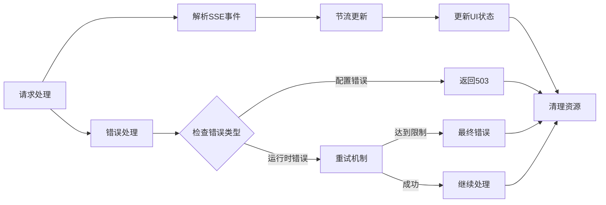

**图表来源**
- [apps/web/hooks/useChatStream.ts:46-58](file://apps/web/hooks/useChatStream.ts#L46-L58)
- [apps/web/hooks/useChatStream.ts:171-219](file://apps/web/hooks/useChatStream.ts#L171-L219)

## 故障排除指南

**更新** 系统提供了更加完善的故障排除指南：

### 常见问题及解决方案

#### 1. 流式连接中断

**症状**：SSE 连接意外断开
**原因**：网络不稳定或服务器超时
**解决方案**：
- 检查网络连接稳定性
- 查看服务器日志中的错误信息
- 确认客户端的智能重试机制正常工作
- 验证代理配置（特别是 X-Accel-Buffering 设置）

#### 2. 工具调用失败

**症状**：工具执行返回错误
**原因**：API 密钥配置错误或网络问题
**解决方案**：
- 验证 Web3 工具的 API 密钥配置
- 检查区块链节点连接状态
- 查看具体的错误消息以确定问题根源
- 区分配置错误（503）和运行时错误（500）

#### 3. 流式输出卡顿

**症状**：消息显示延迟或不流畅
**原因**：节流设置过长或组件重渲染过多
**解决方案**：
- 调整节流间隔参数（当前为50ms）
- 检查是否有不必要的状态更新
- 优化组件的渲染性能
- 验证代理服务器的缓冲设置

#### 4. 代理兼容性问题

**症状**：在某些代理服务器上无法正常工作
**原因**：代理服务器的缓冲机制导致SSE流式输出问题
**解决方案**：
- 确保服务器响应头包含 `X-Accel-Buffering: no`
- 检查代理服务器配置
- 验证反向代理的流式传输支持

#### 5. 内存管理异常

**症状**：内存使用异常或压缩失败
**原因**：配置错误或 LLM 调用失败
**解决方案**：
- 检查环境变量配置（compressThreshold、keepRecentCount）
- 验证摘要模型配置（summaryModel）
- 查看内存管理器的日志输出
- 确认 LLM API 可用性和响应时间

#### 6. 钱包上下文问题

**症状**：钱包连接后AI仍不识别用户信息
**原因**：钱包上下文未正确设置或验证失败
**解决方案**：
- 检查钱包连接状态和地址格式
- 验证 `setWalletContext()` 是否正确调用
- 查看 `getWalletContext()` 返回的地址
- 确认 `verifyWalletContext()` 验证逻辑
- 检查断开连接时的 `clearWalletContext()` 调用

#### 7. 对话数据访问异常

**症状**：无法访问或创建对话
**原因**：钱包上下文验证失败或RLS配置问题
**解决方案**：
- 确认钱包上下文已设置且与目标地址匹配
- 检查 Supabase RLS 策略配置
- 验证数据库权限设置
- 查看具体的错误消息以确定问题根源

**章节来源**
- [apps/web/hooks/useChatStream.ts:171-219](file://apps/web/hooks/useChatStream.ts#L171-L219)
- [apps/web/app/api/chat/route.ts:277-343](file://apps/web/app/api/chat/route.ts#L277-L343)
- [apps/web/lib/memory/SummaryCompressionMemory.ts:68-74](file://apps/web/lib/memory/SummaryCompressionMemory.ts#L68-L74)
- [apps/web/lib/supabase/client.ts:15-23](file://apps/web/lib/supabase/client.ts#L15-L23)
- [apps/web/lib/supabase/conversations.ts:15-23](file://apps/web/lib/supabase/conversations.ts#L15-L23)

### 调试技巧

1. **启用详细日志**：查看服务器端的日志输出，特别是工具调用的详细信息
2. **检查网络请求**：使用浏览器开发者工具监控 SSE 连接状态
3. **验证类型定义**：确保前后端的流式数据类型保持一致
4. **测试工具功能**：单独测试每个 Web3 工具的功能完整性
5. **验证代理配置**：检查代理服务器的 X-Accel-Buffering 设置
6. **区分错误类型**：观察HTTP状态码（503 vs 500）以判断错误性质
7. **监控内存使用**：观察内存管理器的状态变化和压缩触发频率
8. **验证 Token 消耗**：通过调试工具监控消息长度和 Token 使用情况
9. **检查钱包上下文**：验证钱包地址格式和上下文设置
10. **测试RLS验证**：确认钱包上下文验证在数据库操作中的作用
11. **验证系统提示**：检查AI系统提示中是否正确注入了钱包信息
12. **监控对话数据**：验证对话数据的创建、加载和保存流程

## 学习笔记中的SSE实现指南

**更新** 学习笔记中包含了详细的SSE实现指南，特别强调了Function Calling的完整实现流程，提供了更深入的理解和最佳实践：

### Function Calling 完整流程

**更新** 系统实现了两次API调用的职责分工，学习笔记提供了完整的流程图和代码证据：

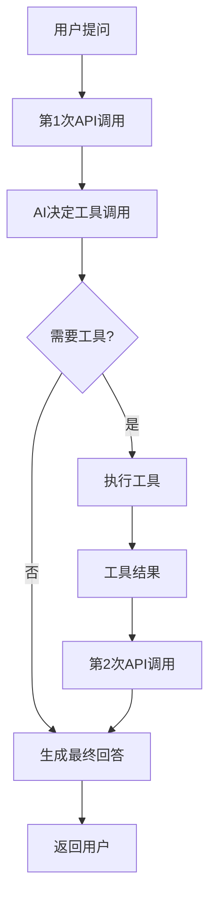

**图表来源**
- [docs/学习笔记.md:65-168](file://docs/学习笔记.md#L65-L168)

**章节来源**
- [docs/学习笔记.md:7-61](file://docs/学习笔记.md#L7-L61)

### SSE流式数据转换链

**更新** 系统实现了完整的SSE数据流转换链，学习笔记详细描述了整个数据流过程：

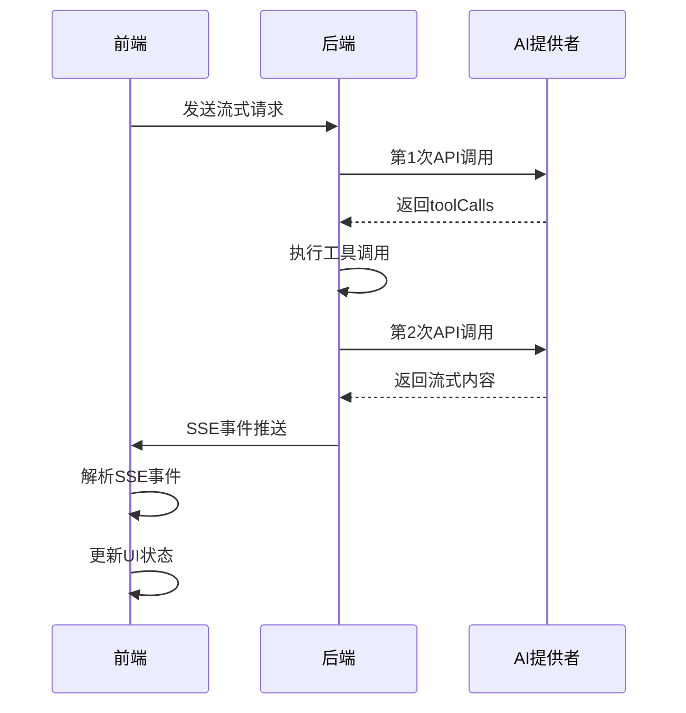

**图表来源**
- [apps/web/app/api/chat/route.ts:119-246](file://apps/web/app/api/chat/route.ts#L119-L246)
- [apps/web/hooks/useChatStream.ts:76-116](file://apps/web/hooks/useChatStream.ts#L76-L116)

**章节来源**
- [apps/web/app/api/chat/route.ts:196-244](file://apps/web/app/api/chat/route.ts#L196-L244)
- [apps/web/hooks/useChatStream.ts:76-116](file://apps/web/hooks/useChatStream.ts#L76-L116)

### 节流机制实现

**更新** 系统实现了智能节流更新机制，学习笔记详细解释了节流原理：

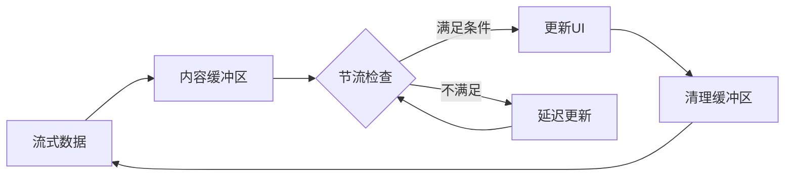

**图表来源**
- [apps/web/hooks/useChatStream.ts:46-58](file://apps/web/hooks/useChatStream.ts#L46-L58)

**章节来源**
- [apps/web/hooks/useChatStream.ts:46-58](file://apps/web/hooks/useChatStream.ts#L46-L58)

### 错误处理策略

**更新** 系统实现了多层次的错误处理策略，学习笔记提供了详细的错误分类和处理方案：

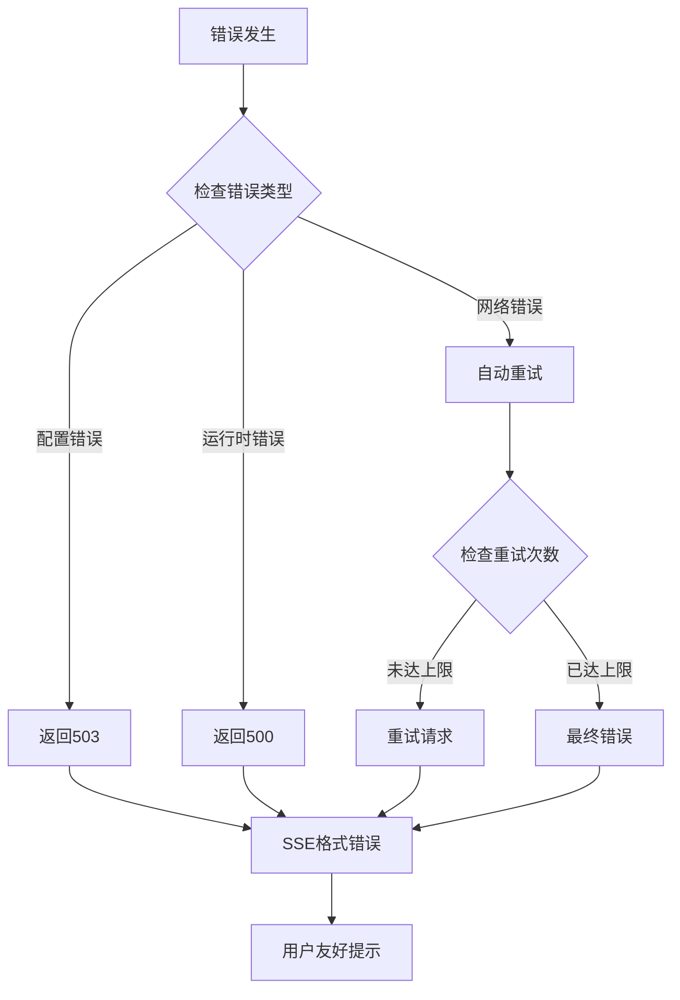

**图表来源**
- [apps/web/app/api/chat/route.ts:297-343](file://apps/web/app/api/chat/route.ts#L297-L343)
- [apps/web/hooks/useChatStream.ts:171-219](file://apps/web/hooks/useChatStream.ts#L171-L219)

### 工具定义和执行深度解析

**更新** 学习笔记提供了工具定义、执行和实现的完整链路：

#### 工具定义系统

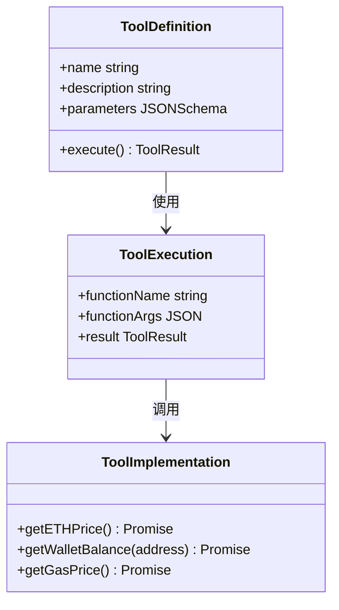

**图表来源**
- [apps/web/app/api/chat/route.ts:8-62](file://apps/web/app/api/chat/route.ts#L8-L62)

**章节来源**
- [docs/学习笔记.md:251-350](file://docs/学习笔记.md#L251-L350)

### AI决策机制详解

**更新** 学习笔记深入解释了AI如何基于工具描述和用户问题进行决策：

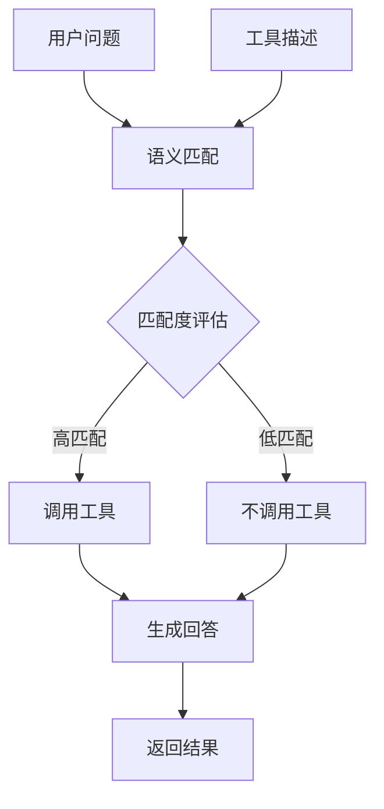

**图表来源**
- [docs/学习笔记.md:447-565](file://docs/学习笔记.md#L447-L565)

**章节来源**
- [docs/学习笔记.md:447-565](file://docs/学习笔记.md#L447-L565)

### SSE完整实现流程详解

**更新** 学习笔记提供了从零理解SSE完整实现流程的详细指南：

#### SSE数据流转换链

**更新** 系统实现了完整的SSE数据流转换链，学习笔记详细描述了整个数据流过程：

```mermaid
flowchart TD
AIOutput[AI生成token] --> JSONStringify[JSON.stringify]
JSONStringify --> SSEFormat[SSE格式化]
SSEFormat --> TextEncode[TextEncoder.encode]
TextEncode --> HTTPStream[HTTP字节流]
HTTPStream --> ClientDecode[客户端解码]
ClientDecode --> EventSplit[事件分割]
EventSplit --> JSONParse[JSON.parse]
JSONParse --> HandleChunk[handleChunk]
HandleChunk --> ReactUpdate[React状态更新]
ReactUpdate --> UIRender[UI渲染]
```

**图表来源**
- [docs/学习笔记.md:2491-2510](file://docs/学习笔记.md#L2491-L2510)

**章节来源**
- [docs/学习笔记.md:2491-2510](file://docs/学习笔记.md#L2491-L2510)

#### SSE核心重难点

**更新** 学习笔记深入分析了SSE实现的核心重难点：

```mermaid
flowchart TD
CoreChallenges[核心重难点] --> StreamManagement[流的正确管理]
CoreChallenges --> SSEParsing[SSE事件解析]
CoreChallenges --> ToolIntegration[工具调用与流式输出结合]
CoreChallenges --> RequestCancellation[中止请求的清理]
CoreChallenges --> ErrorRetry[错误处理和重试机制]
StreamManagement --> DoneCheck[检查done并处理剩余数据]
SSEParsing --> BufferConcat[使用缓冲区拼接]
ToolIntegration --> PhaseProcess[分阶段处理]
RequestCancellation --> ResourceCleanup[完整资源清理]
ErrorRetry --> RetryLogic[完整重试逻辑]
```

**图表来源**
- [docs/学习笔记.md:2930-3084](file://docs/学习笔记.md#L2930-L3084)

**章节来源**
- [docs/学习笔记.md:2930-3084](file://docs/学习笔记.md#L2930-L3084)

### 内存管理实现深度解析

**新增** 学习笔记详细解释了内存管理系统的实现原理和最佳实践：

#### MemoryManager 接口设计

```mermaid
classDiagram
class MemoryManager {
<<interface>>
+addMessage(message : Message) void
+getMessages() Message[]
+shouldCompress() boolean
+compress() Promise~void~
+clear() void
}
class MemoryConfig {
-compressThreshold : number
-keepRecentCount : number
-summaryModel? : string
}
class SummaryCompressionMemory {
-originalMessages : Message[]
-summary : string | null
-config : MemoryConfig
-isCompressing : boolean
+addMessage(message : Message) void
+getMessages() Message[]
+shouldCompress() boolean
+compress() Promise~void~
+generateSummary(messages : Message[]) Promise~string~
+clear() void
}
MemoryManager <|.. SummaryCompressionMemory : 实现
MemoryManager --> MemoryConfig : 使用
```

**图表来源**
- [apps/web/lib/memory/types.ts:12-37](file://apps/web/lib/memory/types.ts#L12-L37)
- [apps/web/lib/memory/SummaryCompressionMemory.ts:5-13](file://apps/web/lib/memory/SummaryCompressionMemory.ts#L5-L13)
- [apps/web/lib/memory/config.ts:3-7](file://apps/web/lib/memory/config.ts#L3-L7)

#### 摘要压缩算法

```mermaid
flowchart TD
Input[输入消息数组] --> CheckSize{检查大小}
CheckSize --> |小于阈值| ReturnFull[返回完整数组]
CheckSize --> |大于等于阈值| ExtractRange[提取压缩范围]
ExtractRange --> CallLLM[调用LLM生成摘要]
CallLLM --> BuildSystemMsg[构建摘要system消息]
BuildSystemMsg --> KeepRecent[保留最近N条]
KeepRecent --> Combine[组合消息]
Combine --> ReturnContext[返回上下文]
ReturnFull --> ReturnContext
```

**图表来源**
- [apps/web/lib/memory/SummaryCompressionMemory.ts:48-74](file://apps/web/lib/memory/SummaryCompressionMemory.ts#L48-L74)

**章节来源**
- [docs/学习笔记.md:912-1000](file://docs/学习笔记.md#L912-L1000)
- [docs/learning笔记.md:1068-1199](file://docs/学习笔记.md#L1068-L1199)

### 钱包上下文系统深度解析

**新增** 学习笔记详细解释了钱包上下文系统的实现原理和最佳实践：

#### 钱包上下文验证机制

```mermaid
flowchart TD
WalletConnect[钱包连接] --> SetContext[setWalletContext]
SetContext --> ValidateAddress[validateWalletAddress]
ValidateAddress --> |格式正确| StoreContext[存储上下文]
ValidateAddress --> |格式错误| ThrowError[抛出错误]
StoreContext --> VerifyContext[verifyWalletContext]
VerifyContext --> |上下文存在| Proceed[继续操作]
VerifyContext --> |上下文不存在| ThrowError
Proceed --> UseInConversations[在对话服务中使用]
```

**图表来源**
- [apps/web/lib/supabase/client.ts:34-46](file://apps/web/lib/supabase/client.ts#L34-L46)
- [apps/web/lib/supabase/conversations.ts:15-23](file://apps/web/lib/supabase/conversations.ts#L15-L23)

#### 动态系统提示生成

```mermaid
flowchart TD
BasePrompt[基础系统提示] --> CheckWallet{检查walletAddress参数}
CheckWallet --> |无参数| ReturnBase[返回基础提示]
CheckWallet --> |有参数| InjectWalletInfo[注入钱包信息]
InjectWalletInfo --> InjectGuidelines[注入使用说明]
InjectGuidelines --> InjectSecurity[注入安全提示]
InjectSecurity --> ReturnEnhanced[返回增强提示]
ReturnBase --> ReturnEnhanced
```

**图表来源**
- [apps/web/app/api/chat/route.ts:135-148](file://apps/web/app/api/chat/route.ts#L135-L148)

**章节来源**
- [docs/学习笔记.md:912-1000](file://docs/学习笔记.md#L912-L1000)
- [docs/学习笔记.md:1068-1199](file://docs/学习笔记.md#L1068-L1199)

### 两种执行路径详解

**更新** 学习笔记详细解释了SSE实现中的两种执行路径：

```mermaid
flowchart TD
BranchCheck[分支检查] --> IsStream{isStream?}
IsStream --> |true| SSEBranch[SSE分支]
IsStream --> |false| JSONBranch[JSON分支]
SSEBranch --> CreateStream[创建ReadableStream]
CreateStream --> PushToolInfo[推送工具调用信息]
PushToolInfo --> StreamAIReply[流式推送AI回复]
StreamAIReply --> CloseStream[关闭流]
CloseStream --> ReturnSSE[返回SSE响应]
JSONBranch --> NonStreamCall[非流式调用AI]
NonStreamCall --> BuildMessages[构建消息]
BuildMessages --> ReturnJSON[返回JSON响应]
```

**图表来源**
- [docs/学习笔记.md:3089-3191](file://docs/学习笔记.md#L3089-L3191)

**章节来源**
- [docs/学习笔记.md:3089-3191](file://docs/学习笔记.md#L3089-L3191)

## 结论

**更新** Web3 AI Agent 的 SSE 流式聊天系统经过重大改进，现在是一个功能完整、架构清晰且高度可靠的现代化聊天应用。系统的显著优势包括：

1. **卓越的用户体验**：通过流式输出提供实时的聊天体验
2. **强大的扩展性**：模块化的架构设计便于功能扩展
3. **完善的错误处理**：健壮的错误处理、恢复机制和智能重试
4. **清晰的代码结构**：良好的类型定义和组件分离
5. **增强的可靠性**：完整的try-catch包装、SSE格式错误块、配置错误与运行时错误区分
6. **代理兼容性**：支持X-Accel-Buffering头，提升Nginx等反向代理的兼容性
7. **智能重试机制**：自动重试（最多2次），超时时间为30秒
8. **完整的Function Calling实现**：两次API调用的职责分工，工具调用的完整生命周期管理
9. **深入的学习资源**：学习笔记提供了详细的实现指南和最佳实践
10. **革命性的内存管理**：基于 MemoryManager 的智能上下文管理，实现 L3 摘要压缩级别的会话记忆
11. **智能钱包上下文感知**：自动注入钱包地址到AI系统提示，实现用户钱包信息的自动上下文感知

**内存管理系统的重大价值**：
- **Token 消耗优化**：通过摘要压缩将 Token 消耗降低 50% 以上
- **智能压缩触发**：基于消息数量阈值的自动压缩，无需手动干预
- **异步压缩处理**：压缩过程不影响消息发送的实时性
- **配置驱动优化**：通过环境变量灵活调整压缩策略
- **状态保护机制**：防止并发压缩导致的状态混乱
- **策略模式扩展**：为 L2 滑动窗口和 L4 向量存储预留接口

**钱包上下文系统的重大价值**：
- **自动上下文感知**：当用户连接钱包时，AI自动识别并使用该钱包地址
- **智能钱包查询**：用户询问"我的余额"时，AI自动使用当前钱包地址查询
- **安全的数据隔离**：通过RLS验证确保对话数据的正确归属
- **无缝的用户体验**：无需用户手动输入钱包地址，提升易用性
- **可扩展的架构设计**：为未来的身份认证和权限管理预留接口

**学习笔记的价值**：
- 提供了Function Calling的深度理解，包括两次API调用的哲学和实现细节
- 展示了完整的代码证据和流程图，便于开发者理解和实现
- 包含了最佳实践和常见陷阱的避免方法
- 提供了从理论到实践的完整学习路径
- 新增了内存管理系统的深度解析和实现指南
- 新增了钱包上下文系统的深度解析和实现指南

**SSE实现的独特优势**：
- **完整的端到端流程**：从请求发起到流式渲染的13步详细实现
- **深入的数据流分析**：从AI token到UI渲染的完整转换链
- **性能优化指南**：节流机制、缓冲区管理和资源清理的最佳实践
- **错误处理策略**：配置错误与运行时错误的智能区分和处理
- **工具调用集成**：工具执行与流式输出的无缝结合
- **内存管理集成**：智能上下文管理与流式输出的协同优化
- **钱包上下文集成**：自动上下文感知与流式输出的协同优化

未来可以考虑的改进方向：
- 添加流式输出的用户控制选项
- 增强工具调用的可视化反馈
- 支持更多类型的 Web3 工具
- 优化移动端的流式体验
- 考虑添加流式输出的视觉指示器（打字机效果、光标动画）
- 考虑支持 Server-Sent Events 原生 EventSource（简化实现）
- 进一步优化节流机制和内存管理
- 增强错误恢复和用户反馈机制
- 基于学习笔记的内容扩展更多SSE实现案例
- 实现 L2 滑动窗口和 L4 向量存储的策略扩展
- 添加内存使用监控和性能分析工具
- 增强钱包上下文的安全性和验证机制
- 扩展钱包上下文到更多的AI功能中
- 实现钱包上下文的持久化存储
- 添加钱包上下文的多账户支持