# SSE流式聊天系统

<cite>
**本文档引用的文件**
- [apps/web/app/api/chat/route.ts](file://apps/web/app/api/chat/route.ts)
- [apps/web/hooks/useChatStream.ts](file://apps/web/hooks/useChatStream.ts)
- [apps/web/components/MessageList.tsx](file://apps/web/components/MessageList.tsx)
- [apps/web/components/MessageItem.tsx](file://apps/web/components/MessageItem.tsx)
- [apps/web/components/ChatInput.tsx](file://apps/web/components/ChatInput.tsx)
- [apps/web/app/page.tsx](file://apps/web/app/page.tsx)
- [apps/web/types/stream.ts](file://apps/web/types/stream.ts)
- [apps/web/types/chat.ts](file://apps/web/types/chat.ts)
- [docs/学习笔记.md](file://docs/学习笔记.md)
- [docs/changelog/2026-04-21-feat-sse-streaming.md](file://docs/changelog/2026-04-21-feat-sse-streaming.md)
</cite>

## 更新摘要
**变更内容**
- 新增了详细的SSE实现指南，包含端到端流程图、数据流转换链、节流机制、错误处理等完整技术实现细节
- 增强了Function Calling的完整实现，包括两次API调用的职责分工
- 改进了工具调用处理流程和状态管理
- 新增了完整的try-catch包装和SSE格式错误块
- 区分了配置错误与运行时错误
- 改进了客户端重试机制和工具调用缓冲机制

## 目录
1. [简介](#简介)
2. [项目结构](#项目结构)
3. [核心组件](#核心组件)
4. [架构概览](#架构概览)
5. [详细组件分析](#详细组件分析)
6. [依赖关系分析](#依赖关系分析)
7. [性能考虑](#性能考虑)
8. [故障排除指南](#故障排除指南)
9. [结论](#结论)

## 简介

Web3 AI Agent 是一个基于 Next.js 的 SSE（Server-Sent Events）流式聊天系统，专为 Web3 前端开发者设计。该系统实现了从用户意图理解、Web3 工具调用到可信结果返回的完整 AI Agent 能力，支持实时流式输出，提供流畅的用户体验。

**更新** 系统现已大幅增强错误处理和可靠性机制，包括完整的try-catch包装、SSE格式错误块、配置错误与运行时错误区分、X-Accel-Buffering头支持、改进的工具调用缓冲机制、增强的客户端重试机制等重大改进。

系统的核心特性包括：
- **流式聊天输出**：通过 SSE 实现实时文本流式传输
- **Web3 工具集成**：支持 ETH 价格查询、钱包余额查询、Gas 价格查询等功能
- **智能工具调用**：AI 模型能够自主决定何时调用相关工具
- **实时状态管理**：提供工具调用状态的实时展示
- **增强的错误处理机制**：完善的错误捕获、用户友好的错误提示和智能重试

## 项目结构

该项目采用 Monorepo 结构，主要分为以下模块：

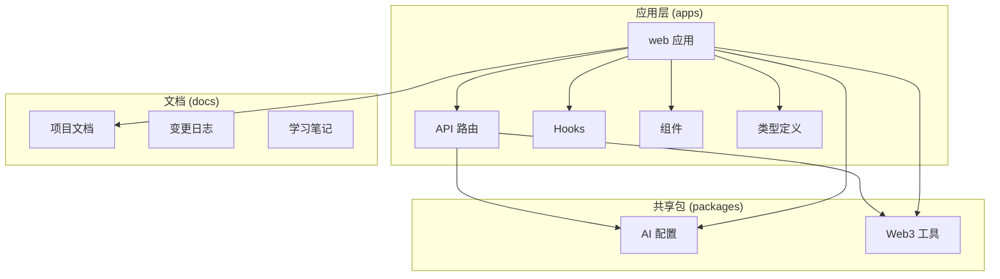

**图表来源**
- [apps/web/app/api/chat/route.ts:1-343](file://apps/web/app/api/chat/route.ts#L1-L343)
- [apps/web/hooks/useChatStream.ts:1-295](file://apps/web/hooks/useChatStream.ts#L1-L295)
- [apps/web/components/MessageList.tsx:1-59](file://apps/web/components/MessageList.tsx#L1-L59)

**章节来源**
- [package.json:1-28](file://package.json#L1-L28)
- [apps/web/package.json:1-36](file://apps/web/package.json#L1-L36)

## 核心组件

### 流式聊天 API

**更新** 后端 API 路由实现了完整的 SSE 流式聊天功能，支持两种响应模式，并具备增强的错误处理能力：

1. **JSON 响应**：传统一次性响应
2. **SSE 流式响应**：实时流式输出，支持X-Accel-Buffering头

### 流式消费 Hook

**更新** 前端 `useChatStream` Hook 提供了完整的流式状态管理，包含：
- 流式状态跟踪（`isStreaming`）
- 实时内容更新（`content`）
- 错误状态管理（`error`）
- 工具调用状态（`toolCalls`）
- **增强的重试机制**（最多2次重试）
- **超时处理**（30秒超时）
- **智能错误区分**（配置错误vs运行时错误）

### UI 组件系统

**更新** 系统包含完整的聊天界面组件，支持：
- **MessageList**：消息列表容器，支持流式更新
- **MessageItem**：单条消息展示，支持工具调用状态显示
- **ChatInput**：聊天输入框，支持流式状态反馈
- **实时加载指示器**：流式输出的视觉反馈，包括打字机效果

**章节来源**
- [apps/web/app/api/chat/route.ts:90-343](file://apps/web/app/api/chat/route.ts#L90-L343)
- [apps/web/hooks/useChatStream.ts:27-295](file://apps/web/hooks/useChatStream.ts#L27-L295)
- [apps/web/components/MessageList.tsx:16-59](file://apps/web/components/MessageList.tsx#L16-L59)

## 架构概览

**更新** 系统采用前后端分离的架构设计，通过 SSE 实现实时双向通信，并具备增强的错误处理和可靠性机制：

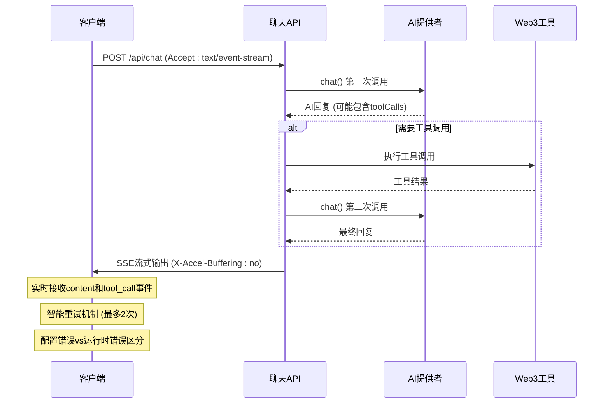

**图表来源**
- [apps/web/app/api/chat/route.ts:119-246](file://apps/web/app/api/chat/route.ts#L119-L246)
- [apps/web/hooks/useChatStream.ts:158-223](file://apps/web/hooks/useChatStream.ts#L158-L223)

### 数据流架构

**更新** 系统实现了更加健壮的数据流处理：

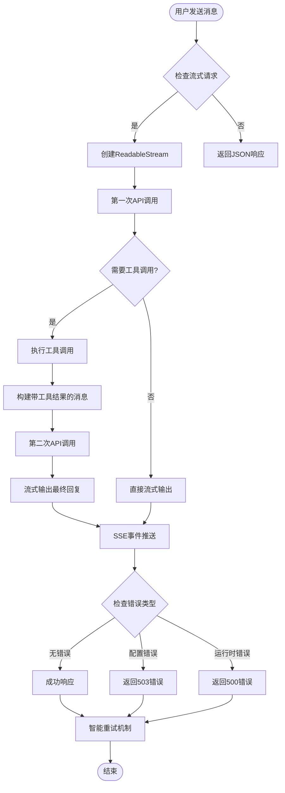

**图表来源**
- [apps/web/app/api/chat/route.ts:107-343](file://apps/web/app/api/chat/route.ts#L107-L343)

## 详细组件分析

### 后端 API 路由分析

**更新** 系统预置了四个 Web3 相关工具，并实现了增强的错误处理：

#### 工具定义系统

| 工具名称 | 功能描述 | 参数 |
|---------|----------|------|
| getETHPrice | 获取 ETH 当前价格（美元） | 无 |
| getWalletBalance | 查询以太坊钱包余额 | address: 钱包地址 |
| getGasPrice | 获取当前以太坊 Gas 价格 | 无 |
| getBTCPrice | 获取 BTC 当前价格（美元） | 无 |

#### 流式响应实现

**更新** 系统实现了完整的try-catch包装和SSE格式错误块：

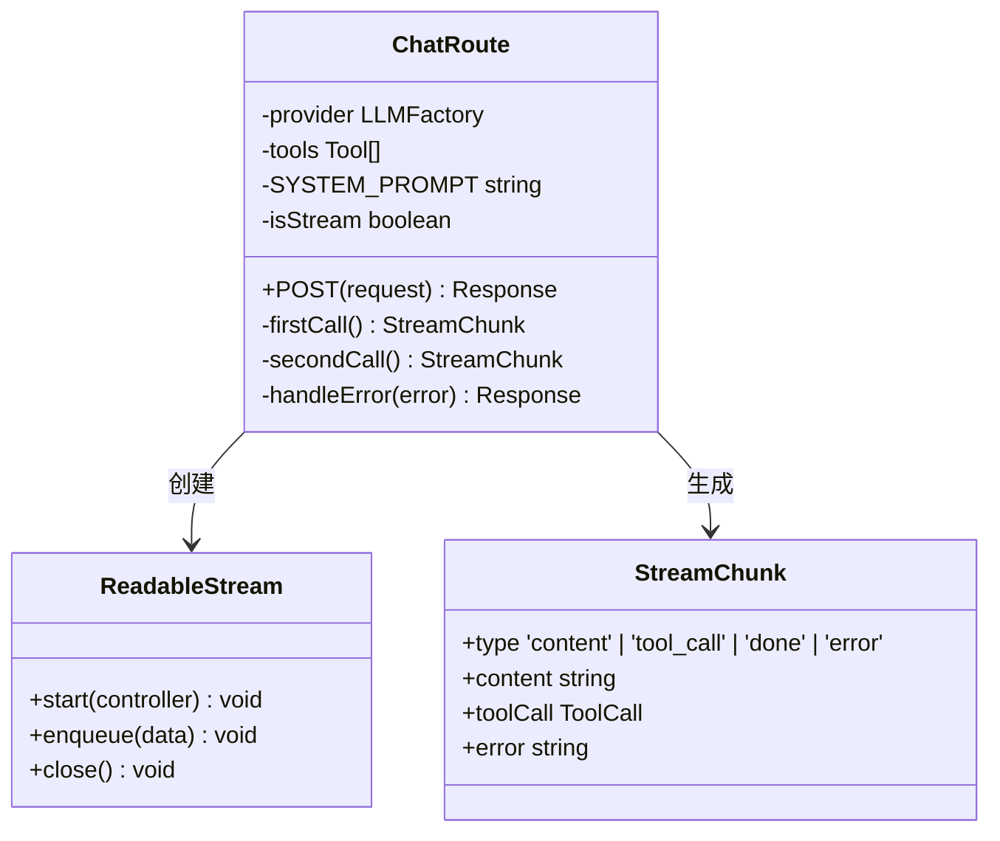

**图表来源**
- [apps/web/app/api/chat/route.ts:90-343](file://apps/web/app/api/chat/route.ts#L90-L343)
- [apps/web/types/stream.ts:4-16](file://apps/web/types/stream.ts#L4-L16)

**章节来源**
- [apps/web/app/api/chat/route.ts:8-62](file://apps/web/app/api/chat/route.ts#L8-L62)
- [apps/web/app/api/chat/route.ts:196-234](file://apps/web/app/api/chat/route.ts#L196-L234)

### 前端 Hook 分析

**更新** 前端 Hook 实现了增强的状态管理和错误处理：

#### 状态管理系统

**更新** 系统实现了更加健壮的状态管理：

```mermaid
stateDiagram-v2
[*] --> Idle
Idle --> Streaming : sendMessage()
Streaming --> Processing : 接收流式数据
Processing --> Streaming : 继续接收
Processing --> Completed : 接收done事件
Processing --> Error : 接收error事件
Completed --> Idle : 重置状态
Error --> RetryCheck{检查错误类型}
RetryCheck --> |配置错误| Idle : 不重试
RetryCheck --> |运行时错误| RetryAttempt : 重试
RetryAttempt --> Streaming : 重新开始
RetryAttempt --> Failed : 达到最大重试次数
Failed --> Idle : 重置状态
Streaming --> Aborted : abort()
Aborted --> Idle : 重置状态
```

#### 流式数据处理

**更新** 前端 Hook 实现了复杂的数据流处理逻辑，包含智能重试和错误区分：

1. **SSE 事件解析**：从原始数据中提取 `data:` 行
2. **流式块处理**：根据 `type` 字段处理不同类型的数据块
3. **状态更新**：实时更新 UI 状态和消息内容
4. **智能错误处理**：优雅处理网络错误、超时和配置错误
5. **重试机制**：自动重试机制（最多2次），超时时间为30秒
6. **错误区分**：区分配置错误（503）和运行时错误（500）

**图表来源**
- [apps/web/hooks/useChatStream.ts:119-155](file://apps/web/hooks/useChatStream.ts#L119-L155)

**章节来源**
- [apps/web/hooks/useChatStream.ts:76-116](file://apps/web/hooks/useChatStream.ts#L76-L116)
- [apps/web/hooks/useChatStream.ts:119-155](file://apps/web/hooks/useChatStream.ts#L119-L155)

### UI 组件分析

**更新** UI 组件系统支持流式输出和工具调用状态展示：

#### 消息展示组件

**更新** 系统实现了更加丰富的消息展示功能：

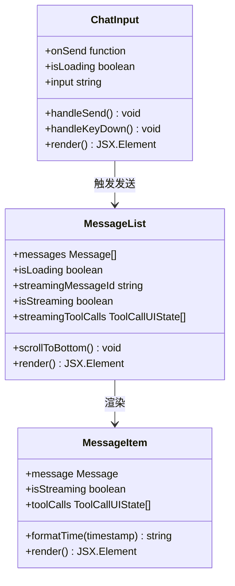

**图表来源**
- [apps/web/components/MessageItem.tsx:12-97](file://apps/web/components/MessageItem.tsx#L12-L97)
- [apps/web/components/MessageList.tsx:16-59](file://apps/web/components/MessageList.tsx#L16-L59)
- [apps/web/components/ChatInput.tsx:10-74](file://apps/web/components/ChatInput.tsx#L10-L74)

**章节来源**
- [apps/web/components/MessageItem.tsx:23-92](file://apps/web/components/MessageItem.tsx#L23-L92)
- [apps/web/components/MessageList.tsx:25-30](file://apps/web/components/MessageList.tsx#L25-L30)
- [apps/web/components/ChatInput.tsx:13-24](file://apps/web/components/ChatInput.tsx#L13-L24)

## 依赖关系分析

### 技术栈依赖

**更新** 系统的技术栈保持稳定，增加了代理支持：

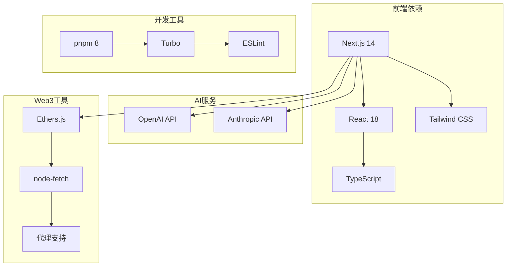

**图表来源**
- [apps/web/package.json:12-35](file://apps/web/package.json#L12-L35)
- [package.json:1-28](file://package.json#L1-L28)

### 关键依赖版本

| 依赖包 | 版本 | 用途 |
|--------|------|------|
| next | 14.2.0 | Web 应用框架 |
| react | ^18.2.0 | 用户界面库 |
| @web3-ai-agent/ai-config | workspace:* | AI 配置和模型适配 |
| @web3-ai-agent/web3-tools | workspace:* | Web3 工具集 |
| ethers | ^6.11.0 | 以太坊区块链交互 |
| node-fetch | 3 | HTTP 请求库 |
| https-proxy-agent | ^9.0.0 | HTTPS代理支持 |
| proxy-agent | ^8.0.1 | 通用代理支持 |

**章节来源**
- [apps/web/package.json:12-35](file://apps/web/package.json#L12-L35)
- [apps/web/next.config.js:1-15](file://apps/web/next.config.js#L1-L15)

## 性能考虑

**更新** 系统实现了多项性能优化措施和可靠性改进：

### 流式处理优化

**更新** 系统实现了更加高效的流式处理：

1. **智能节流更新机制**：50ms 节流间隔，减少不必要的 React 重渲染
2. **流式数据缓冲**：使用缓冲区处理不完整的 SSE 事件
3. **内存管理**：及时清理定时器和 AbortController
4. **智能重试机制**：自动重试机制（最多2次），超时时间为30秒
5. **代理兼容性**：支持 X-Accel-Buffering 头，提升 Nginx 等反向代理的兼容性

### 并发处理

**更新** 系统实现了更加健壮的并发处理：

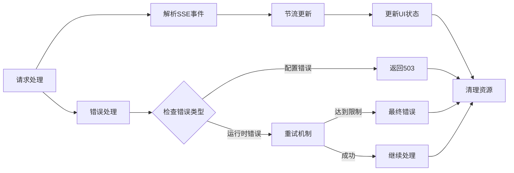

**图表来源**
- [apps/web/hooks/useChatStream.ts:46-58](file://apps/web/hooks/useChatStream.ts#L46-L58)
- [apps/web/hooks/useChatStream.ts:171-219](file://apps/web/hooks/useChatStream.ts#L171-L219)

## 故障排除指南

**更新** 系统提供了更加完善的故障排除指南：

### 常见问题及解决方案

#### 1. 流式连接中断

**症状**：SSE 连接意外断开
**原因**：网络不稳定或服务器超时
**解决方案**：
- 检查网络连接稳定性
- 查看服务器日志中的错误信息
- 确认客户端的智能重试机制正常工作
- 验证代理配置（特别是 X-Accel-Buffering 设置）

#### 2. 工具调用失败

**症状**：工具执行返回错误
**原因**：API 密钥配置错误或网络问题
**解决方案**：
- 验证 Web3 工具的 API 密钥配置
- 检查区块链节点连接状态
- 查看具体的错误消息以确定问题根源
- 区分配置错误（503）和运行时错误（500）

#### 3. 流式输出卡顿

**症状**：消息显示延迟或不流畅
**原因**：节流设置过长或组件重渲染过多
**解决方案**：
- 调整节流间隔参数（当前为50ms）
- 检查是否有不必要的状态更新
- 优化组件的渲染性能
- 验证代理服务器的缓冲设置

#### 4. 代理兼容性问题

**症状**：在某些代理服务器上无法正常工作
**原因**：代理服务器的缓冲机制导致SSE流式输出问题
**解决方案**：
- 确保服务器响应头包含 `X-Accel-Buffering: no`
- 检查代理服务器配置
- 验证反向代理的流式传输支持

**章节来源**
- [apps/web/hooks/useChatStream.ts:171-219](file://apps/web/hooks/useChatStream.ts#L171-L219)
- [apps/web/app/api/chat/route.ts:277-343](file://apps/web/app/api/chat/route.ts#L277-L343)

### 调试技巧

1. **启用详细日志**：查看服务器端的日志输出，特别是工具调用的详细信息
2. **检查网络请求**：使用浏览器开发者工具监控 SSE 连接状态
3. **验证类型定义**：确保前后端的流式数据类型保持一致
4. **测试工具功能**：单独测试每个 Web3 工具的功能完整性
5. **验证代理配置**：检查代理服务器的 X-Accel-Buffering 设置
6. **区分错误类型**：观察HTTP状态码（503 vs 500）以判断错误性质

## 学习笔记中的SSE实现指南

**更新** 学习笔记中包含了详细的SSE实现指南，特别强调了Function Calling的完整实现流程：

### Function Calling 完整流程

**更新** 系统实现了两次API调用的职责分工：

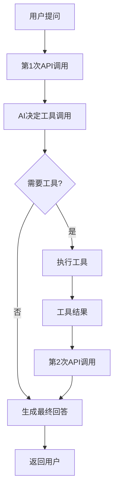

**图表来源**
- [docs/学习笔记.md:65-168](file://docs/学习笔记.md#L65-L168)

### SSE流式数据转换链

**更新** 系统实现了完整的SSE数据流转换链：

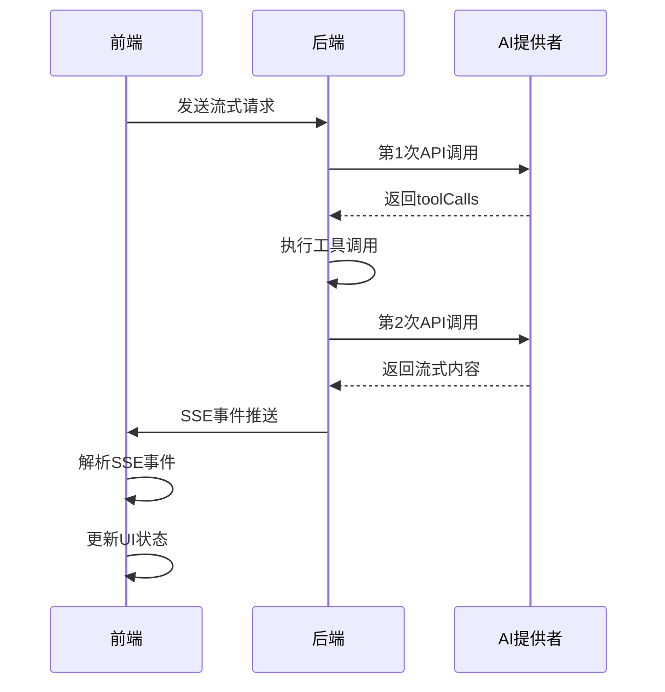

**图表来源**
- [apps/web/app/api/chat/route.ts:119-246](file://apps/web/app/api/chat/route.ts#L119-L246)
- [apps/web/hooks/useChatStream.ts:76-116](file://apps/web/hooks/useChatStream.ts#L76-L116)

### 节流机制实现

**更新** 系统实现了智能节流更新机制：

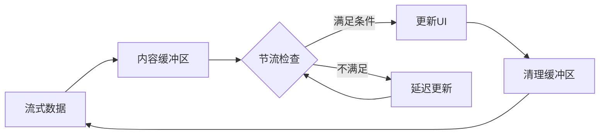

**图表来源**
- [apps/web/hooks/useChatStream.ts:46-58](file://apps/web/hooks/useChatStream.ts#L46-L58)

### 错误处理策略

**更新** 系统实现了多层次的错误处理策略：

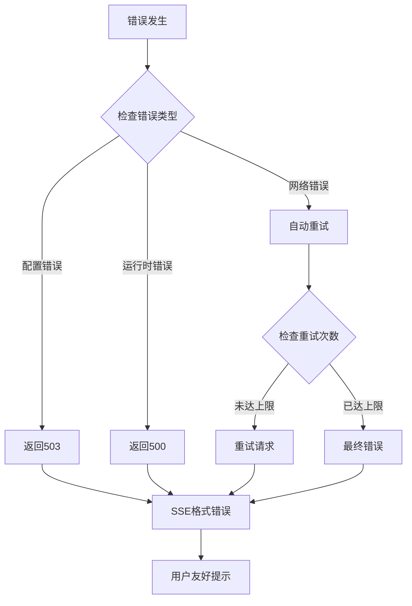

**图表来源**
- [apps/web/app/api/chat/route.ts:297-343](file://apps/web/app/api/chat/route.ts#L297-L343)
- [apps/web/hooks/useChatStream.ts:171-219](file://apps/web/hooks/useChatStream.ts#L171-L219)

## 结论

**更新** Web3 AI Agent 的 SSE 流式聊天系统经过重大改进，现在是一个功能完整、架构清晰且高度可靠的现代化聊天应用。系统的显著优势包括：

1. **卓越的用户体验**：通过流式输出提供实时的聊天体验
2. **强大的扩展性**：模块化的架构设计便于功能扩展
3. **完善的错误处理**：健壮的错误处理、恢复机制和智能重试
4. **清晰的代码结构**：良好的类型定义和组件分离
5. **增强的可靠性**：完整的try-catch包装、SSE格式错误块、配置错误与运行时错误区分
6. **代理兼容性**：支持X-Accel-Buffering头，提升Nginx等反向代理的兼容性
7. **智能重试机制**：自动重试（最多2次），超时时间为30秒
8. **完整的Function Calling实现**：两次API调用的职责分工，工具调用的完整生命周期管理

该系统为 Web3 前端开发者提供了一个优秀的参考实现，展示了如何将 AI 能力与 Web3 技术有机结合，创造出具有实际价值的应用程序。

未来可以考虑的改进方向：
- 添加流式输出的用户控制选项
- 增强工具调用的可视化反馈
- 支持更多类型的 Web3 工具
- 优化移动端的流式体验
- 考虑添加流式输出的视觉指示器（打字机效果、光标动画）
- 考虑支持 Server-Sent Events 原生 EventSource（简化实现）
- 进一步优化节流机制和内存管理
- 增强错误恢复和用户反馈机制