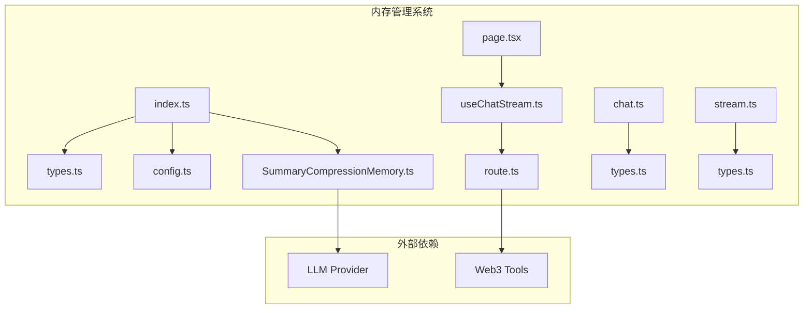
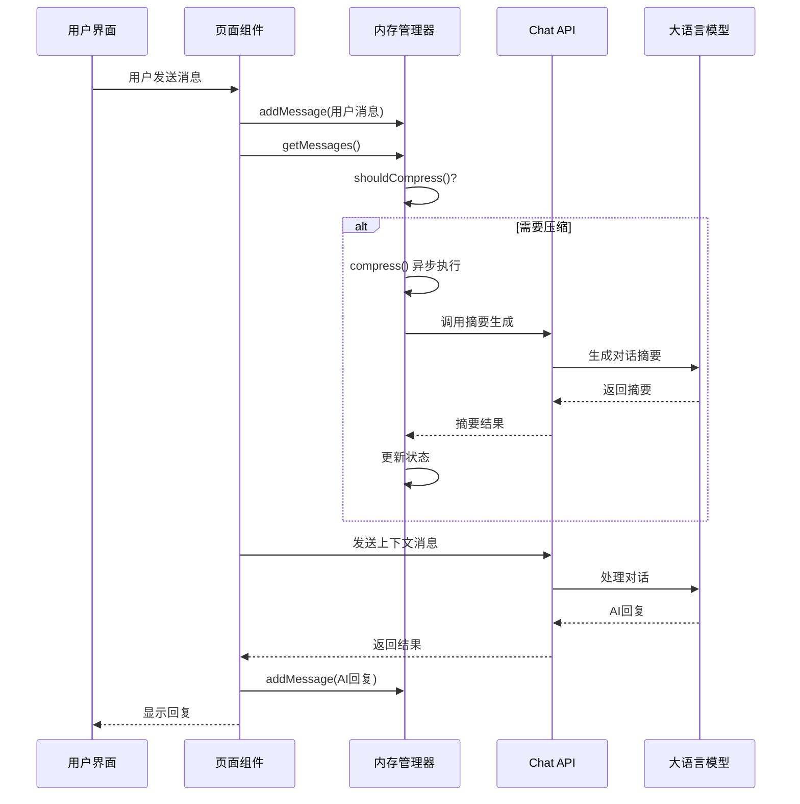
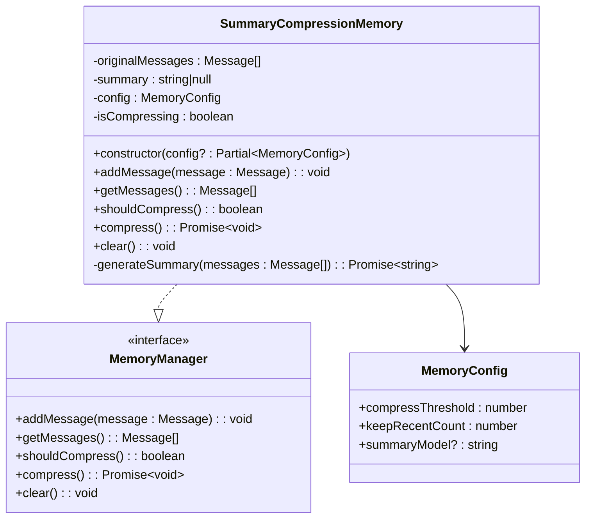
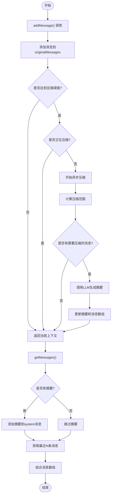
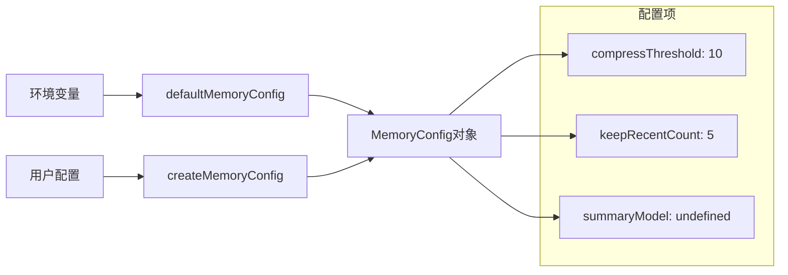
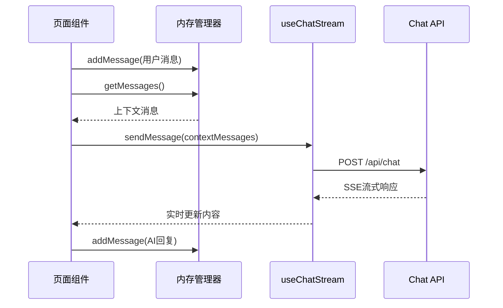
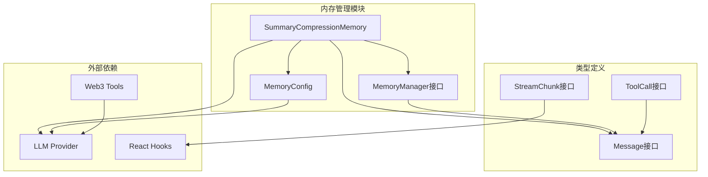

# 内存管理系统

<cite>
**本文档引用的文件**
- [SummaryCompressionMemory.ts](file://apps/web/lib/memory/SummaryCompressionMemory.ts)
- [types.ts](file://apps/web/lib/memory/types.ts)
- [config.ts](file://apps/web/lib/memory/config.ts)
- [index.ts](file://apps/web/lib/memory/index.ts)
- [page.tsx](file://apps/web/app/page.tsx)
- [useChatStream.ts](file://apps/web/hooks/useChatStream.ts)
- [route.ts](file://apps/web/app/api/chat/route.ts)
- [chat.ts](file://apps/web/types/chat.ts)
- [stream.ts](file://apps/web/types/stream.ts)
- [2026-04-21-feat-memory-management.md](file://docs/changelog/2026-04-21-feat-memory-management.md)
</cite>

## 目录
1. [简介](#简介)
2. [项目结构](#项目结构)
3. [核心组件](#核心组件)
4. [架构概览](#架构概览)
5. [详细组件分析](#详细组件分析)
6. [依赖关系分析](#依赖关系分析)
7. [性能考量](#性能考量)
8. [故障排除指南](#故障排除指南)
9. [结论](#结论)

## 简介

内存管理系统是AI代理系统中的关键组件，负责管理对话历史和上下文，确保在保持对话连贯性的同时优化Token消耗。该系统实现了L3摘要压缩模式，能够在单次对话内定期将早期历史消息合并为摘要，从而将Token消耗降低50%以上。

系统采用Strategy模式设计，为未来的L2滑动窗口和L4向量数据库扩展预留了接口。通过智能的异步压缩机制，系统在不影响用户体验的前提下实现了高效的上下文管理。

## 项目结构

内存管理系统位于`apps/web/lib/memory/`目录下，包含以下核心文件：

**图表来源**
- [index.ts:1-4](file://apps/web/lib/memory/index.ts#L1-L4)
- [types.ts:1-38](file://apps/web/lib/memory/types.ts#L1-L38)
- [config.ts:1-15](file://apps/web/lib/memory/config.ts#L1-L15)

**章节来源**
- [index.ts:1-4](file://apps/web/lib/memory/index.ts#L1-L4)
- [types.ts:1-38](file://apps/web/lib/memory/types.ts#L1-L38)
- [config.ts:1-15](file://apps/web/lib/memory/config.ts#L1-L15)

## 核心组件

内存管理系统由四个核心组件构成：

### MemoryManager接口
定义了内存管理的标准接口，采用Strategy模式设计：
- `addMessage(message: Message)`: 添加新消息到记忆
- `getMessages()`: 获取当前上下文（可能包含摘要）
- `shouldCompress()`: 判断是否需要压缩
- `compress()`: 执行异步压缩
- `clear()`: 清空记忆

### MemoryConfig配置
提供灵活的配置选项：
- `compressThreshold`: 触发压缩的消息数阈值（默认10）
- `keepRecentCount`: 保留的最近消息数（默认5）
- `summaryModel`: 摘要用模型（可选）

### SummaryCompressionMemory实现
L3摘要压缩模式的具体实现，包含智能压缩逻辑和错误处理机制。

**章节来源**
- [types.ts:12-37](file://apps/web/lib/memory/types.ts#L12-L37)
- [types.ts:3-10](file://apps/web/lib/memory/types.ts#L3-L10)
- [config.ts:3-7](file://apps/web/lib/memory/config.ts#L3-L7)

## 架构概览

内存管理系统采用分层架构设计，确保各组件职责清晰且松耦合：

**图表来源**
- [page.tsx:44-120](file://apps/web/app/page.tsx#L44-L120)
- [SummaryCompressionMemory.ts:15-42](file://apps/web/lib/memory/SummaryCompressionMemory.ts#L15-L42)
- [route.ts:90-120](file://apps/web/app/api/chat/route.ts#L90-L120)

## 详细组件分析

### SummaryCompressionMemory类分析

**图表来源**
- [SummaryCompressionMemory.ts:5-111](file://apps/web/lib/memory/SummaryCompressionMemory.ts#L5-L111)
- [types.ts:12-37](file://apps/web/lib/memory/types.ts#L12-L37)
- [types.ts:3-10](file://apps/web/lib/memory/types.ts#L3-L10)

#### 核心算法流程

**图表来源**
- [SummaryCompressionMemory.ts:15-74](file://apps/web/lib/memory/SummaryCompressionMemory.ts#L15-L74)
- [SummaryCompressionMemory.ts:24-42](file://apps/web/lib/memory/SummaryCompressionMemory.ts#L24-L42)

#### 错误处理机制

系统实现了完善的错误处理机制：

1. **压缩失败降级**: 当摘要生成失败时，保留完整历史并在下次重试
2. **并发保护**: 使用`isCompressing`标志位防止并发压缩操作
3. **网络异常处理**: 摘要生成过程中的网络错误会被捕获并记录
4. **状态恢复**: 错误发生后系统会回到一致的状态

**章节来源**
- [SummaryCompressionMemory.ts:48-74](file://apps/web/lib/memory/SummaryCompressionMemory.ts#L48-L74)
- [SummaryCompressionMemory.ts:68-73](file://apps/web/lib/memory/SummaryCompressionMemory.ts#L68-L73)

### 配置管理系统

**图表来源**
- [config.ts:3-7](file://apps/web/lib/memory/config.ts#L3-L7)
- [config.ts:9-14](file://apps/web/lib/memory/config.ts#L9-L14)

配置系统支持：
- **环境变量覆盖**: 通过NEXT_PUBLIC_MEMORY_*环境变量自定义行为
- **运行时配置**: 支持在创建实例时传入覆盖配置
- **默认值保证**: 缺少配置时使用合理的默认值

**章节来源**
- [config.ts:1-15](file://apps/web/lib/memory/config.ts#L1-L15)

### 与聊天系统的集成

内存管理系统与聊天系统的集成体现在以下几个方面：

**图表来源**
- [page.tsx:73-97](file://apps/web/app/page.tsx#L73-L97)
- [useChatStream.ts:167-252](file://apps/web/hooks/useChatStream.ts#L167-L252)

**章节来源**
- [page.tsx:44-120](file://apps/web/app/page.tsx#L44-L120)
- [useChatStream.ts:167-252](file://apps/web/hooks/useChatStream.ts#L167-L252)

## 依赖关系分析

内存管理系统与其他组件的依赖关系如下：

**图表来源**
- [SummaryCompressionMemory.ts:1-3](file://apps/web/lib/memory/SummaryCompressionMemory.ts#L1-L3)
- [types.ts:1](file://apps/web/lib/memory/types.ts#L1)
- [chat.ts:1-28](file://apps/web/types/chat.ts#L1-L28)

### 关键依赖特性

1. **松耦合设计**: MemoryManager接口与具体实现分离
2. **类型安全**: 完整的TypeScript类型定义确保编译时安全
3. **可扩展性**: Strategy模式为未来扩展预留接口
4. **无副作用**: 不依赖特定的UI框架或状态管理库

**章节来源**
- [types.ts:12-37](file://apps/web/lib/memory/types.ts#L12-L37)
- [SummaryCompressionMemory.ts:1-3](file://apps/web/lib/memory/SummaryCompressionMemory.ts#L1-L3)

## 性能考量

内存管理系统在设计时充分考虑了性能优化：

### Token消耗优化
- **L3摘要压缩**: 将早期对话压缩为摘要，Token消耗降低≥50%
- **智能阈值控制**: 基于消息数量而非Token数量的阈值控制，实现可预测的性能
- **最近消息保留**: 保留最近5条原始消息确保上下文完整性

### 内存管理优化
- **渐进式压缩**: 异步执行压缩操作，不阻塞主线程
- **状态缓存**: 摘要作为system消息缓存，避免重复计算
- **内存回收**: 压缩后及时释放早期消息内存

### 并发处理优化
- **防抖机制**: 避免频繁触发压缩操作
- **并发控制**: 使用标志位防止并发压缩
- **错误隔离**: 单个压缩失败不影响其他操作

## 故障排除指南

### 常见问题及解决方案

#### 1. 摘要生成失败
**症状**: 系统降级为完整历史，无摘要
**原因**: LLM服务不可用或响应超时
**解决方案**: 
- 检查LLM服务连接状态
- 增加网络超时时间
- 验证API密钥配置

#### 2. 压缩操作阻塞
**症状**: 用户界面卡顿
**原因**: 压缩操作在主线程执行
**解决方案**:
- 确认压缩操作为异步执行
- 检查`isCompressing`标志位状态
- 实施适当的节流机制

#### 3. 配置参数无效
**症状**: 自定义配置未生效
**原因**: 环境变量未正确设置
**解决方案**:
- 验证NEXT_PUBLIC_MEMORY_*环境变量
- 检查配置加载顺序
- 确认运行时配置覆盖逻辑

**章节来源**
- [SummaryCompressionMemory.ts:68-73](file://apps/web/lib/memory/SummaryCompressionMemory.ts#L68-L73)
- [config.ts:3-7](file://apps/web/lib/memory/config.ts#L3-L7)

### 调试技巧

1. **日志监控**: 利用console.error输出压缩失败信息
2. **状态检查**: 通过shouldCompress()判断压缩时机
3. **性能分析**: 监控压缩操作的执行时间
4. **内存使用**: 跟踪originalMessages数组大小变化

## 结论

内存管理系统成功实现了L3摘要压缩模式，为AI代理系统提供了高效的上下文管理解决方案。通过智能的异步压缩机制和完善的错误处理，系统在保持对话连贯性的同时显著降低了Token消耗。

系统的设计充分体现了以下优势：
- **可扩展性**: Strategy模式为未来扩展预留了接口
- **稳定性**: 完善的错误处理和降级机制
- **性能**: 智能的压缩时机控制和异步执行
- **易用性**: 简洁的API接口和灵活的配置选项

该系统为AI代理的长期发展奠定了坚实的基础，为后续实现更复杂的记忆管理策略（如L2滑动窗口和L4向量数据库）做好了准备。