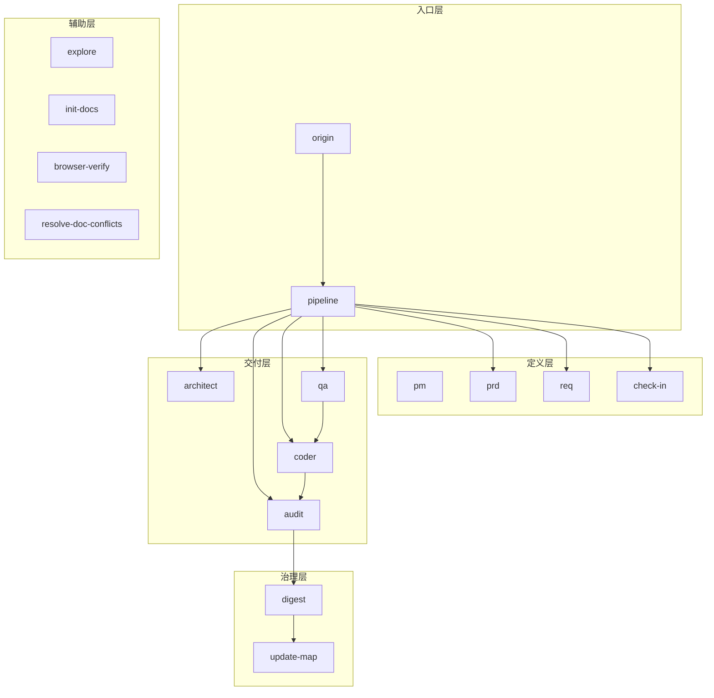
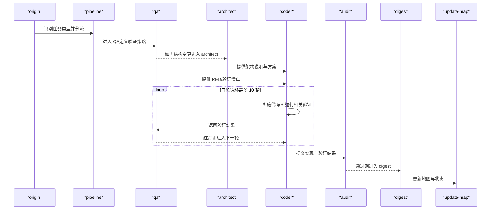
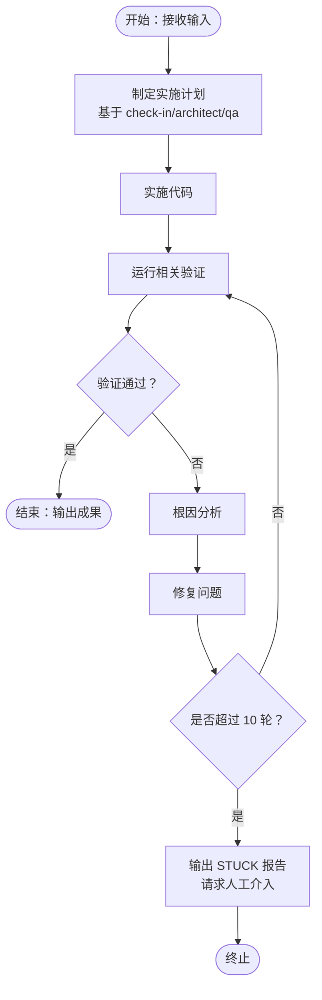
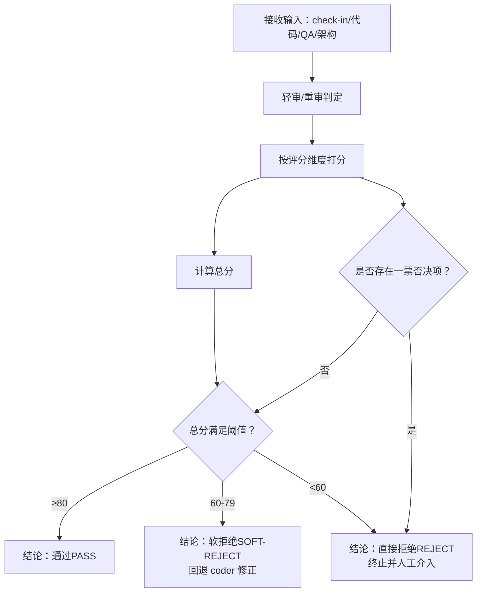
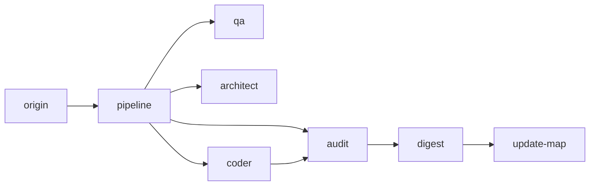

# 实现与安全审计技能

<cite>
**本文引用的文件**
- [技能系统设计（V3）](file://skills/web3-ai-agent/SKILL-SYSTEM-DESIGN-V3.md)
- [技能总入口（web3-ai-agent）](file://skills/web3-ai-agent/SKILL.md)
- [技能地图（V3）](file://skills/web3-ai-agent/MAP-V3.md)
- [斜杠命令约定](file://skills/web3-ai-agent/COMMANDS.md)
- [Coder 技能](file://skills/web3-ai-agent/coder/SKILL.md)
- [Audit 审计技能](file://skills/web3-ai-agent/audit/SKILL.md)
- [QA 技能](file://skills/web3-ai-agent/qa/SKILL.md)
- [Architect 架构师技能](file://skills/web3-ai-agent/architect/SKILL.md)
- [Check-in 实施前对齐点](file://skills/web3-ai-agent/check-in/SKILL.md)
- [Digest 复盘沉淀](file://skills/web3-ai-agent/digest/SKILL.md)
</cite>

## 目录
1. [简介](#简介)
2. [项目结构](#项目结构)
3. [核心组件](#核心组件)
4. [架构总览](#架构总览)
5. [详细组件分析](#详细组件分析)
6. [依赖关系分析](#依赖关系分析)
7. [性能考虑](#性能考虑)
8. [故障排查指南](#故障排查指南)
9. [结论](#结论)
10. [附录](#附录)

## 简介
本文件面向“AI-Agent 实现与安全审计技能”的技术文档，聚焦于两个关键技能：Coder（编码实现）与 Audit（安全审计）。文档基于仓库中的技能定义与流程设计，系统阐述：
- Coder 的 vibe coding 实现流程、代码质量保证机制、自愈机制设计与 10 轮自愈限制；
- Audit 的风险识别与控制流程、安全性检查标准、合规性验证方法与评分机制（满分 100 分，≥80 通过，<60 拒绝）；
- 编码规范、安全检查清单与审计标准；
- 实现过程中的问题处理、风险控制策略与质量保证措施。

## 项目结构
该仓库采用“技能（Skill）+ 路由（Route）+ 流水线（Pipeline）”的分层设计，围绕任务类型进行分流，交付型任务进入不同深度的执行流水线。其中：
- 入口层：origin、pipeline
- 定义层：pm、prd、req、check-in
- 交付层：architect、qa、coder、audit
- 治理层：digest、update-map
- 辅助层：explore、init-docs、browser-verify、resolve-doc-conflicts

图表来源
- [技能系统设计（V3）](file://skills/web3-ai-agent/SKILL-SYSTEM-DESIGN-V3.md)
- [技能地图（V3）](file://skills/web3-ai-agent/MAP-V3.md)

章节来源
- [技能系统设计（V3）](file://skills/web3-ai-agent/SKILL-SYSTEM-DESIGN-V3.md)
- [技能地图（V3）](file://skills/web3-ai-agent/MAP-V3.md)

## 核心组件
- Coder（编码实现）
  - 目标：在边界清晰前提下实施代码，通过最多 10 轮自愈循环将 QA 红灯变为绿灯。
  - 关键机制：自愈循环、10 轮上限、失败 STUCK 报告、与 check-in/architect/qa 的衔接。
- Audit（安全审计）
  - 目标：对实现结果进行风险审计与评分，轻审/重审可切换；总分 100，≥80 通过，60–79 软拒绝，<60 直接拒绝；严重问题一票否决。
  - 关键机制：评分维度与权重、阈值规则、一票否决项、与 digest 的衔接。

章节来源
- [Coder 技能](file://skills/web3-ai-agent/coder/SKILL.md)
- [Audit 审计技能](file://skills/web3-ai-agent/audit/SKILL.md)

## 架构总览
下图展示交付型任务（FEAT/PATCH/REFACTOR）在 pipeline 中的典型流转，以及与 Coder/Audit 的关系：

图表来源
- [技能系统设计（V3）](file://skills/web3-ai-agent/SKILL-SYSTEM-DESIGN-V3.md)
- [技能地图（V3）](file://skills/web3-ai-agent/MAP-V3.md)
- [Coder 技能](file://skills/web3-ai-agent/coder/SKILL.md)
- [Audit 审计技能](file://skills/web3-ai-agent/audit/SKILL.md)
- [QA 技能](file://skills/web3-ai-agent/qa/SKILL.md)
- [Architect 架构师技能](file://skills/web3-ai-agent/architect/SKILL.md)
- [Digest 复盘沉淀](file://skills/web3-ai-agent/digest/SKILL.md)

## 详细组件分析

### Coder 技能：vibe coding 实现流程与自愈机制
- vibe coding 概念解读
  - “vibe coding”在此语境下指：在明确的边界与方案下，以直觉与经验驱动的高效实现方式。其前提是 check-in 已明确问题、上下文、方案与完成标准，architect 已给出结构与契约，qa 已定义 RED/验证清单。
- 实现流程
  - 输入：check-in、架构说明、QA 输出（RED/验证清单）
  - 步骤：实施代码 → 运行相关验证 → 读取失败信息 → 根因分析 → 修复 → 下一轮
  - 输出：代码修改、验证结果；若失败输出 STUCK 报告
- 自愈机制与 10 轮限制
  - 自愈循环：每次迭代均以“验证失败”为触发，持续修复直至 GREEN 或达到上限
  - 10 轮限制：超过 10 轮仍未通过，必须终止并输出 STUCK 报告，请求人工介入
  - 与 QA 的衔接：QA 的 RED 是自愈的起点；若发现 QA 红灯与需求矛盾，应停止并报告，而非自行修改需求
- 代码质量保证机制
  - 优先跑相关验证，不默认全量重跑
  - 发现范围扩大时，回退 req/check-in/architect 重新对齐
  - 不修改 docs/ 需求定义，不擅自修改验收标准，不跳过失败验证

图表来源
- [Coder 技能](file://skills/web3-ai-agent/coder/SKILL.md)
- [QA 技能](file://skills/web3-ai-agent/qa/SKILL.md)
- [Check-in 实施前对齐点](file://skills/web3-ai-agent/check-in/SKILL.md)
- [Architect 架构师技能](file://skills/web3-ai-agent/architect/SKILL.md)

章节来源
- [Coder 技能](file://skills/web3-ai-agent/coder/SKILL.md)
- [QA 技能](file://skills/web3-ai-agent/qa/SKILL.md)
- [Check-in 实施前对齐点](file://skills/web3-ai-agent/check-in/SKILL.md)
- [Architect 架构师技能](file://skills/web3-ai-agent/architect/SKILL.md)

### Audit 技能：风险识别、控制与评分机制
- 两种模式
  - 轻审：适用于 PATCH、低风险 REFACTOR；检查需求一致性、安全问题、越界修改、调试残留等
  - 重审：适用于 FEAT、高风险 PATCH/REFACTOR、涉及 Web3 数据可信度/权限/资金/安全的任务
- 输入与输出
  - 输入：check-in、代码结果、QA 结果、架构说明
  - 输出：Audit 结果（模式、总分、结论 PASS/SOFT-REJECT/REJECT、主要问题、风险建议）
- 评分规则（满分 100）
  - 需求一致性：25
  - 结构/契约一致性：15
  - 安全与风险边界：20
  - 代码质量：15
  - 回归风险控制：10
  - 文档与状态收尾：10
  - 场景特定治理项：5
- 阈值规则
  - ≥80：通过
  - 60–79：软拒绝，回退 coder 修正
  - <60：直接拒绝，终止并人工介入
- 一票否决项
  - 严重安全问题
  - 明显越过 check-in 的非目标
  - 关键不变量被破坏
  - 高风险场景缺少风险提示或失败降级

图表来源
- [Audit 审计技能](file://skills/web3-ai-agent/audit/SKILL.md)
- [Check-in 实施前对齐点](file://skills/web3-ai-agent/check-in/SKILL.md)
- [Digest 复盘沉淀](file://skills/web3-ai-agent/digest/SKILL.md)

章节来源
- [Audit 审计技能](file://skills/web3-ai-agent/audit/SKILL.md)
- [Digest 复盘沉淀](file://skills/web3-ai-agent/digest/SKILL.md)

### QA 与 Architect 的衔接要点
- QA 的 RED 模式用于 FEAT，在实现前先写出测试并证明“当前未通过”，RED 验证最多运行 2 次；PATCH/REFACTOR 默认走轻量验证或回归验证
- Architect 负责结构说明与契约，限定模块边界、数据流、消息流、接口契约与风险点，不直接写测试或承担编码

章节来源
- [QA 技能](file://skills/web3-ai-agent/qa/SKILL.md)
- [Architect 架构师技能](file://skills/web3-ai-agent/architect/SKILL.md)

### Check-in 与 Digest 的边界
- Check-in 是实施前对齐点，必须明确“要解决的问题、上下文、方案、不做什么、产物、完成标准、下一跳 skill”，否则视为未完成
- Digest 负责阶段沉淀，记录完成项、问题、经验与后续建议，不代替地图更新或需求文档

章节来源
- [Check-in 实施前对齐点](file://skills/web3-ai-agent/check-in/SKILL.md)
- [Digest 复盘沉淀](file://skills/web3-ai-agent/digest/SKILL.md)

## 依赖关系分析
- 任务类型分流：origin 识别任务类型，仅交付型任务进入 pipeline
- pipeline 内部：FEAT 默认完整链路（pm/req/architect/qa/coder/audit），PATCH/REFACTOR 可按需插入 architect/audit/browser-verify/prd
- 交付层耦合：qa 与 coder 之间以 RED/GREEN 为信号；coder 与 audit 之间以实现结果与验证为纽带
- 治理层闭环：digest 与 update-map 串联，形成“执行—沉淀—更新”的闭环

图表来源
- [技能系统设计（V3）](file://skills/web3-ai-agent/SKILL-SYSTEM-DESIGN-V3.md)
- [技能地图（V3）](file://skills/web3-ai-agent/MAP-V3.md)

章节来源
- [技能系统设计（V3）](file://skills/web3-ai-agent/SKILL-SYSTEM-DESIGN-V3.md)
- [技能地图（V3）](file://skills/web3-ai-agent/MAP-V3.md)

## 性能考虑
- 验证范围控制：coder 优先运行相关验证，避免全量重跑，缩短反馈周期
- 自愈轮次上限：10 轮限制防止无限循环，及时触发人工介入
- 轻审/重审策略：根据任务风险选择审计深度，平衡效率与安全
- 按需插入：architect/audit/browser-verify/prd 在必要时插入，避免不必要的流程开销

## 故障排查指南
- Coder 卡住（STUCK）
  - 现象：超过 10 轮仍未通过，输出 STUCK 报告
  - 处理：人工介入，结合 STUCK 报告中的“卡住原因、已尝试方案、当前阻塞点、建议方向”进行决策
- QA 红灯与需求矛盾
  - 现象：RED 意外通过或与需求不符
  - 处理：停止并报告，不自行修改需求，回退至 prd/req/check-in/architect 重新对齐
- Audit 软拒绝（60–79）
  - 现象：总分处于软拒绝区间
  - 处理：回退 coder 修正，针对主要问题逐项修复后重新提交
- 一票否决
  - 现象：出现严重安全问题、越界修改、关键不变量破坏、高风险场景缺风险提示
  - 处理：直接拒绝，终止当前方案，人工介入或重定方案

章节来源
- [Coder 技能](file://skills/web3-ai-agent/coder/SKILL.md)
- [Audit 审计技能](file://skills/web3-ai-agent/audit/SKILL.md)
- [QA 技能](file://skills/web3-ai-agent/qa/SKILL.md)
- [Check-in 实施前对齐点](file://skills/web3-ai-agent/check-in/SKILL.md)

## 结论
本技能体系以“任务类型分流 + 交付深度可选 + 实施前对齐 + 风险闭环”为核心，将 Coder 的高效实现与 Audit 的严格风控有机结合。通过 10 轮自愈限制与轻/重审策略，既保证交付效率，又确保实现质量与安全边界。配合 check-in 的强约束与 digest 的沉淀闭环，形成可持续演进的知识与流程资产。

## 附录

### 编码规范（基于技能定义提炼）
- 明确边界：以 check-in 的“完成标准”为准，不擅自扩大范围
- 优先验证：每次修改后运行相关验证，不默认全量重跑
- 不改需求：不修改 docs/ 需求定义，不擅自修改验收标准
- 不跳过失败：失败验证必须执行，不得跳过
- 回退对齐：发现范围扩大，回退 req/check-in/architect 重新对齐

章节来源
- [Coder 技能](file://skills/web3-ai-agent/coder/SKILL.md)
- [Check-in 实施前对齐点](file://skills/web3-ai-agent/check-in/SKILL.md)

### 安全检查清单（基于 Audit 评分维度）
- 需求一致性：是否满足 check-in 的完成标准
- 结构/契约一致性：是否符合 architect 的模块边界与接口契约
- 安全与风险边界：是否存在越界修改、调试残留、安全问题
- 代码质量：命名、注释、复杂度、可维护性
- 回归风险控制：是否存在回归风险点、是否覆盖关键路径
- 文档与状态收尾：是否完善文档、状态是否收敛
- 场景特定治理项：Web3 场景下的可信度、权限、资金、安全治理

章节来源
- [Audit 审计技能](file://skills/web3-ai-agent/audit/SKILL.md)
- [Architect 架构师技能](file://skills/web3-ai-agent/architect/SKILL.md)
- [Digest 复盘沉淀](file://skills/web3-ai-agent/digest/SKILL.md)

### 审计标准与评分机制
- 总分 100，阈值：
  - ≥80：通过（PASS）
  - 60–79：软拒绝（SOFT-REJECT），回退 coder 修正
  - <60：直接拒绝（REJECT），终止并人工介入
- 一票否决项：严重安全问题、明显越界、关键不变量破坏、高风险场景缺风险提示或失败降级

章节来源
- [Audit 审计技能](file://skills/web3-ai-agent/audit/SKILL.md)

### 使用建议与斜杠命令
- 推荐使用斜杠命令统一入口与任务描述，降低路由歧义
- 常用命令：/origin、/pipeline feat/patch/refactor、/pm、/prd、/req、/check-in、/architect、/qa、/coder、/audit、/digest、/update-map、/explore、/init-docs、/browser-verify、/resolve-doc-conflicts

章节来源
- [斜杠命令约定](file://skills/web3-ai-agent/COMMANDS.md)
- [技能总入口（web3-ai-agent）](file://skills/web3-ai-agent/SKILL.md)