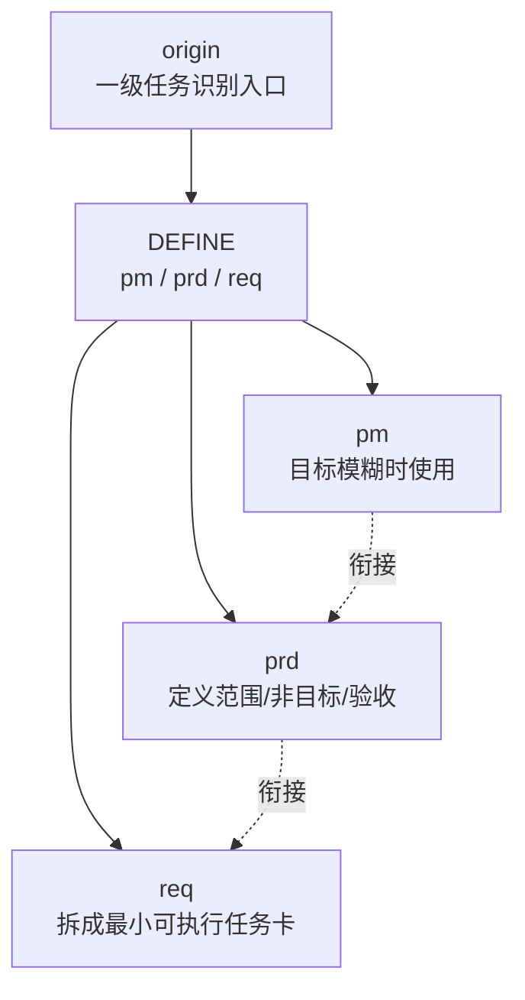
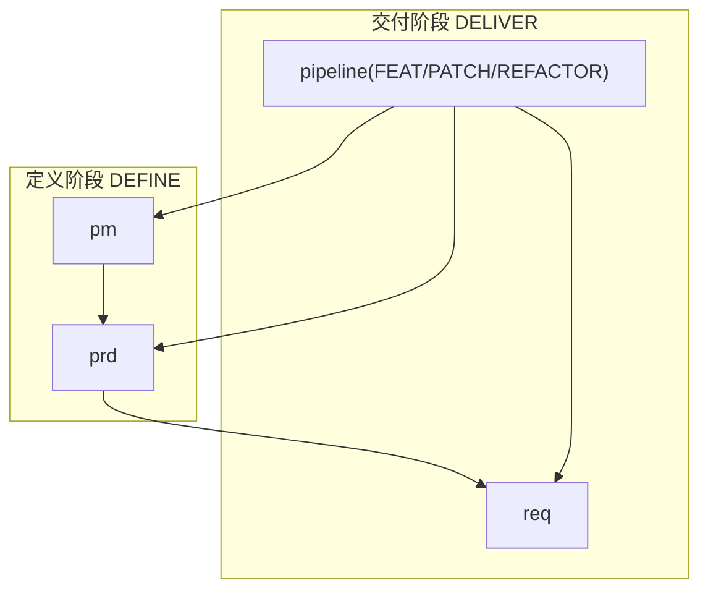
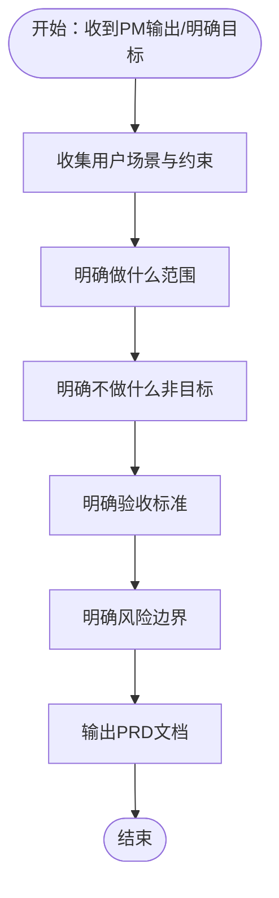
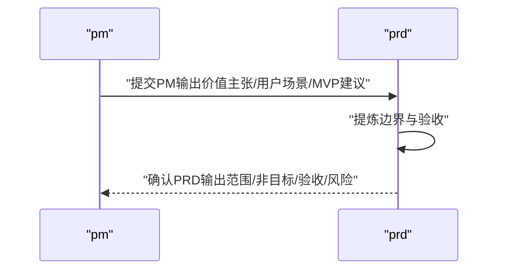
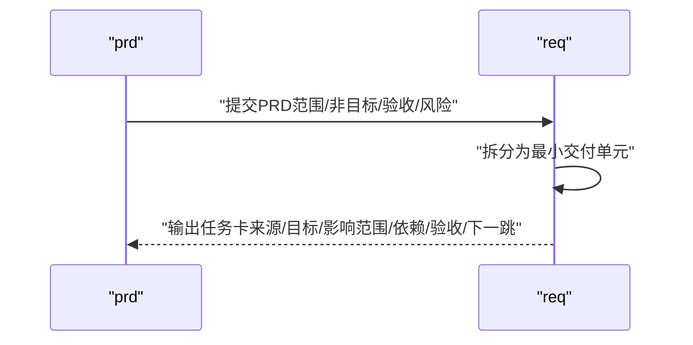
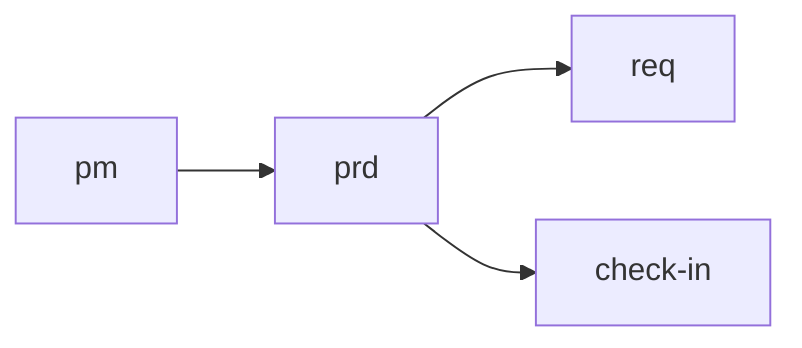

# 产品需求文档技能 (PRD)

<cite>
**本文引用的文件**
- [skills\web3-ai-agent\prd\SKILL.md](file://skills/web3-ai-agent/prd/SKILL.md)
- [skills\web3-ai-agent\pm\SKILL.md](file://skills/web3-ai-agent/pm/SKILL.md)
- [skills\web3-ai-agent\req\SKILL.md](file://skills/web3-ai-agent/req/SKILL.md)
- [skills\web3-ai-agent\SKILL.md](file://skills/web3-ai-agent/SKILL.md)
- [skills\web3-ai-agent\MAP-V3.md](file://skills/web3-ai-agent/MAP-V3.md)
- [skills\web3-ai-agent\TEMPLATES-V3.md](file://skills/web3-ai-agent/TEMPLATES-V3.md)
- [docs\Web3-AI-Agent-PRD-MVP.md](file://docs/Web3-AI-Agent-PRD-MVP.md)
</cite>

## 目录
1. [简介](#简介)
2. [项目结构](#项目结构)
3. [核心组件](#核心组件)
4. [架构总览](#架构总览)
5. [详细组件分析](#详细组件分析)
6. [依赖分析](#依赖分析)
7. [性能考量](#性能考量)
8. [故障排查指南](#故障排查指南)
9. [结论](#结论)
10. [附录](#附录)

## 简介
本文件面向“产品需求文档技能（PRD）”，系统化阐述其在AI-Agent技能体系中的定位、输入输出、执行流程、边界限制以及与PM、REQ等上下游技能的衔接关系。PRD技能专注于为功能或变更定义正式范围、非目标与验收标准，确保团队对“做什么、不做什么、如何验收、风险边界在哪里”达成一致，避免需求漂移与范围蔓延。

## 项目结构
PRD技能位于web3-ai-agent技能体系的“定义（DEFINE）”阶段，通常在FEAT正式进入交付前由PM产出初步价值主张后，由PRD将模糊目标转化为清晰边界；对于PATCH/REFACTOR，PRD可按需插入以明确变更边界与验收。

图表来源
- [skills\web3-ai-agent\MAP-V3.md:146-150](file://skills/web3-ai-agent/MAP-V3.md#L146-L150)
- [skills\web3-ai-agent\SKILL.md:106-110](file://skills/web3-ai-agent/SKILL.md#L106-L110)

章节来源
- [skills\web3-ai-agent\MAP-V3.md:146-150](file://skills/web3-ai-agent/MAP-V3.md#L146-L150)
- [skills\web3-ai-agent\SKILL.md:106-110](file://skills/web3-ai-agent/SKILL.md#L106-L110)

## 核心组件
- 适用场景
  - FEAT的正式边界定义
  - 重构影响产品边界时
  - bug根因其实是需求错误时
- 输入
  - pm输出或明确目标
  - 用户场景
  - 约束与非目标
- 输出
  - 主题PRD文档结构（背景、目标、用户场景、范围、非目标、风险边界、验收标准）
- 执行流程
  - 明确做什么
  - 明确不做什么
  - 明确验收标准
  - 明确风险边界
- 边界限制
  - 不做技术方案
  - 不直接拆成代码任务
- 与上游/下游衔接
  - 上游：pm（目标模糊时）
  - 下游：req（将PRD拆为最小可执行任务卡）

章节来源
- [skills\web3-ai-agent\prd\SKILL.md:8-54](file://skills/web3-ai-agent/prd/SKILL.md#L8-L54)

## 架构总览
PRD在整体技能流中的位置如下：

图表来源
- [skills\web3-ai-agent\SKILL.md:106-126](file://skills/web3-ai-agent/SKILL.md#L106-L126)
- [skills\web3-ai-agent\MAP-V3.md:104-131](file://skills/web3-ai-agent/MAP-V3.md#L104-L131)

章节来源
- [skills\web3-ai-agent\SKILL.md:106-126](file://skills/web3-ai-agent/SKILL.md#L106-L126)
- [skills\web3-ai-agent\MAP-V3.md:104-131](file://skills/web3-ai-agent/MAP-V3.md#L104-L131)

## 详细组件分析

### PRD技能定义与职责
- 职责聚焦于“边界”而非“实现细节”
- 通过“非目标”保证范围收敛
- 通过“验收标准”确保可验证
- 通过“风险边界”确保安全上线

图表来源
- [skills\web3-ai-agent\prd\SKILL.md:34-44](file://skills/web3-ai-agent/prd/SKILL.md#L34-L44)

章节来源
- [skills\web3-ai-agent\prd\SKILL.md:34-44](file://skills/web3-ai-agent/prd/SKILL.md#L34-L44)

### PRD与PM的衔接
- PM用于“目标模糊”时，将模糊想法整理为价值主张、用户场景与MVP方向
- PRD在此基础上进一步固化边界与验收

图表来源
- [skills\web3-ai-agent\pm\SKILL.md:45-48](file://skills/web3-ai-agent/pm/SKILL.md#L45-L48)
- [skills\web3-ai-agent\prd\SKILL.md:46-48](file://skills/web3-ai-agent/prd/SKILL.md#L46-L48)

章节来源
- [skills\web3-ai-agent\pm\SKILL.md:45-48](file://skills/web3-ai-agent/pm/SKILL.md#L45-L48)
- [skills\web3-ai-agent\prd\SKILL.md:46-48](file://skills/web3-ai-agent/prd/SKILL.md#L46-L48)

### PRD与REQ的衔接
- PRD完成后进入REQ，将PRD拆为最小可执行任务卡（FEAT/BUG/REFACTOR）
- REQ负责“可执行性”与“可验证性”的落地

图表来源
- [skills\web3-ai-agent\req\SKILL.md:36-42](file://skills/web3-ai-agent/req/SKILL.md#L36-L42)
- [skills\web3-ai-agent\prd\SKILL.md:46-48](file://skills/web3-ai-agent/prd/SKILL.md#L46-L48)

章节来源
- [skills\web3-ai-agent\req\SKILL.md:36-42](file://skills/web3-ai-agent/req/SKILL.md#L36-L42)
- [skills\web3-ai-agent\prd\SKILL.md:46-48](file://skills/web3-ai-agent/prd/SKILL.md#L46-L48)

### PRD在不同场景下的应用
- FEAT正式边界定义：在新功能开发前，用PRD固化“做什么、不做什么、如何验收、风险边界在哪里”
- 重构影响产品边界：当重构可能改变用户可见行为时，用PRD明确边界与验收
- bug根因是需求错误：当缺陷实为需求错误导致时，用PRD修正边界与验收，避免“修修补补”

章节来源
- [skills\web3-ai-agent\prd\SKILL.md:8-12](file://skills/web3-ai-agent/prd/SKILL.md#L8-L12)

### PRD文档模板与结构
- 模板结构
  - 背景
  - 目标
  - 用户场景
  - 范围
  - 非目标
  - 风险边界
  - 验收标准

章节来源
- [skills\web3-ai-agent\prd\SKILL.md:20-32](file://skills/web3-ai-agent/prd/SKILL.md#L20-L32)

### PRD最佳实践示例（基于MVP PRD）
- 背景与转型目标：明确项目服务于个人转型与MVP验证
- 用户画像：区分普通用户与开发者本人两类角色
- 使用场景：价格查询、余额查询、多轮跟进、风险边界处理
- MVP范围：基础聊天、流式输出、Tool Calling、Agent Loop v1、最小Memory、Web3工具集合、错误处理与降级回复、风险提示与免责声明
- 非目标：自动交易、真实签名、多链聚合、高级RAG、长期持久化Memory、多Agent协作、完整后台管理
- 能力边界：应该做什么 vs 不应该做什么
- Web3数据范围：允许接入的数据与来源要求
- 风险控制与免责声明：高风险提问优先返回数据参考、失败时显式说明不确定性、禁止伪造结果
- 关键流程：主流程与异常流程
- 验收标准：可验证的能力指标
- 后续迭代方向：MVP之后的演进方向

章节来源
- [docs\Web3-AI-Agent-PRD-MVP.md:1-228](file://docs/Web3-AI-Agent-PRD-MVP.md#L1-L228)

## 依赖分析
- 与PM的依赖：PM产出模糊目标，PRD将其固化为清晰边界
- 与REQ的依赖：PRD完成后进入REQ，拆为最小可执行任务卡
- 与CHECK-IN的依赖：PRD完成后进入check-in，统一规范“本阶段要解决的问题、必须掌握的上下文、采用的方案、不做什么、产物、完成标准、下一跳”

图表来源
- [skills\web3-ai-agent\SKILL.md:106-110](file://skills/web3-ai-agent/SKILL.md#L106-L110)
- [skills\web3-ai-agent\TEMPLATES-V3.md:3-23](file://skills/web3-ai-agent/TEMPLATES-V3.md#L3-L23)

章节来源
- [skills\web3-ai-agent\SKILL.md:106-110](file://skills/web3-ai-agent/SKILL.md#L106-L110)
- [skills\web3-ai-agent\TEMPLATES-V3.md:3-23](file://skills/web3-ai-agent/TEMPLATES-V3.md#L3-L23)

## 性能考量
- PRD阶段的“边界收敛”能显著减少返工与范围蔓延，间接提升交付效率
- 清晰的验收标准有助于QA与后续环节快速验证，缩短反馈周期
- 风险边界明确可降低上线后的变更成本与事故率

## 故障排查指南
- 症状：PRD缺少“非目标”
  - 原因：边界不清晰，容易导致范围蔓延
  - 处理：补充“非目标”部分，确保与范围、验收、风险边界相互印证
- 症状：PRD缺乏“验收标准”
  - 原因：无法量化验证，REQ拆分困难
  - 处理：细化可验证的行为指标与场景
- 症状：PRD未明确“风险边界”
  - 原因：上线后出现高风险问题
  - 处理：补充风险边界与应急预案
- 症状：PRD与PM脱节
  - 原因：PM未产出或PRD未承接PM输出
  - 处理：确保PM产出作为PRD输入，必要时回退PM澄清

章节来源
- [skills\web3-ai-agent\prd\SKILL.md:50-54](file://skills/web3-ai-agent/prd/SKILL.md#L50-L54)

## 结论
PRD技能是web3-ai-agent技能体系中“定义阶段”的关键节点，其核心价值在于通过“边界、非目标、验收标准、风险边界”四个维度，将模糊需求转化为可验证、可交付、可上线的正式范围。与PM、REQ、CHECK-IN的协同，确保从“价值主张”到“最小可执行任务”的顺畅流转，是保障项目质量与交付效率的重要机制。

## 附录

### PRD技能规则清单
- PRD的重点是边界，不是实现
- 没有清晰非目标的PRD视为未完成

章节来源
- [skills\web3-ai-agent\prd\SKILL.md:50-54](file://skills/web3-ai-agent/prd/SKILL.md#L50-L54)

### PRD文档模板（结构要点）
- 背景
- 目标
- 用户场景
- 范围
- 非目标
- 风险边界
- 验收标准

章节来源
- [skills\web3-ai-agent\prd\SKILL.md:20-32](file://skills/web3-ai-agent/prd/SKILL.md#L20-L32)

### PRD在技能流中的位置与规则
- FEAT默认必须有prd + req
- PATCH默认不走pm/prd
- REFACTOR默认不走pm
- 交付型任务必须先check-in

章节来源
- [skills\web3-ai-agent\MAP-V3.md:158-166](file://skills/web3-ai-agent/MAP-V3.md#L158-L166)
- [skills\web3-ai-agent\SKILL.md:106-126](file://skills/web3-ai-agent/SKILL.md#L106-L126)