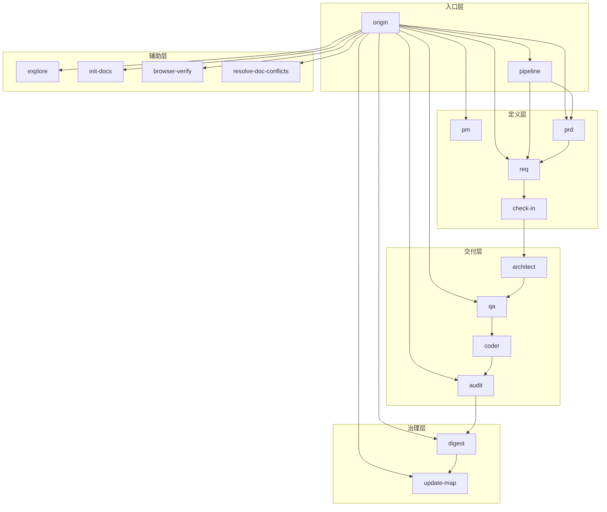
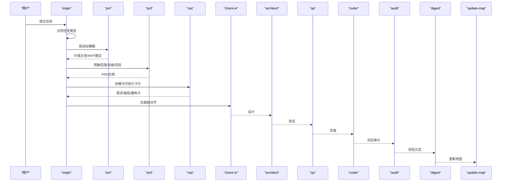
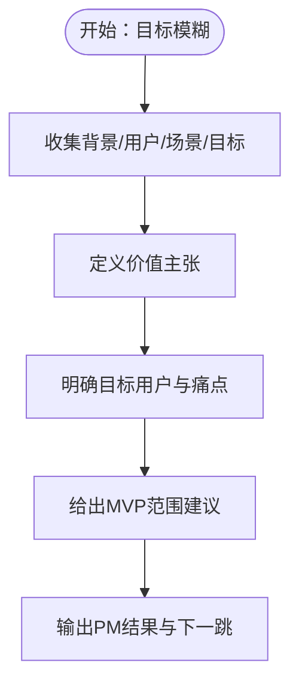
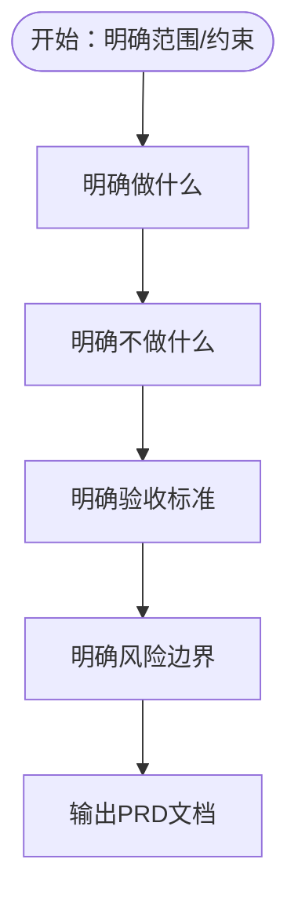
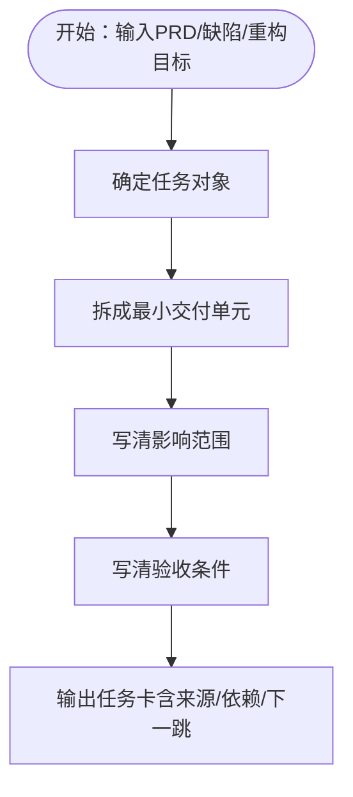
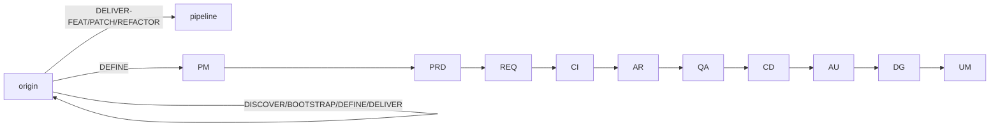

# 文档驱动技能组

<cite>
**本文引用的文件**
- [技能系统设计V3.md](file://skills/web3-ai-agent/SKILL-SYSTEM-DESIGN-V3.md)
- [技能地图V3.md](file://skills/web3-ai-agent/MAP-V3.md)
- [技能模板V3.md](file://skills/web3-ai-agent/TEMPLATES-V3.md)
- [PRD技能.md](file://skills/web3-ai-agent/prd/SKILL.md)
- [REQ技能.md](file://skills/web3-ai-agent/req/SKILL.md)
- [PM技能.md](file://skills/web3-ai-agent/pm/SKILL.md)
- [总入口技能.md](file://skills/web3-ai-agent/SKILL.md)
- [Web3-AI-Agent-PRD-MVP.md](file://Web3-AI-Agent-PRD-MVP.md)
</cite>

## 目录
1. [简介](#简介)
2. [项目结构](#项目结构)
3. [核心组件](#核心组件)
4. [架构总览](#架构总览)
5. [详细组件分析](#详细组件分析)
6. [依赖分析](#依赖分析)
7. [性能考量](#性能考量)
8. [故障排查指南](#故障排查指南)
9. [结论](#结论)
10. [附录](#附录)

## 简介
本文件面向“文档驱动技能组”，聚焦于 PRD（产品需求文档）、REQ（需求拆解）、PM（项目管理）三大核心文档技能，系统阐述其功能职责、协作机制与执行边界，并结合技能地图与模板，给出可落地的文档模板、配置选项与使用示例。目标是帮助读者以最少步骤将模糊任务转化为可实施的清晰文档与执行卡片，同时确保高风险任务具备约束、低风险任务保持高效。

## 项目结构
技能体系采用五层分层设计：
- 入口层：origin、pipeline
- 定义层：pm、prd、req、check-in
- 交付层：architect、qa、coder、audit
- 治理层：digest、update-map
- 辅助层：explore、init-docs、browser-verify、resolve-doc-conflicts

其中，PRD、REQ、PM属于“定义层”，负责将模糊输入转化为清晰边界与可执行卡片；check-in作为实施前对齐点，贯穿交付型任务。

图表来源
- [技能系统设计V3.md: 164-220:164-220](file://skills/web3-ai-agent/SKILL-SYSTEM-DESIGN-V3.md#L164-L220)
- [技能地图V3.md: 86-166:86-166](file://skills/web3-ai-agent/MAP-V3.md#L86-L166)

章节来源
- [技能系统设计V3.md: 164-220:164-220](file://skills/web3-ai-agent/SKILL-SYSTEM-DESIGN-V3.md#L164-L220)
- [技能地图V3.md: 86-166:86-166](file://skills/web3-ai-agent/MAP-V3.md#L86-L166)

## 核心组件
- PM（项目管理）：在目标模糊时，将背景、用户、场景、商业目标整理为价值主张、用户场景与MVP范围建议，强调“为什么做、对谁有价值、为什么现在做”。输出包含目标用户、核心痛点、价值主张、时机、MVP建议范围与下一跳。
- PRD（产品需求文档）：定义正式范围、非目标、验收标准与风险边界，强调“做什么、不做什么、如何验收”。输出为标准化PRD模板，包含背景、目标、用户场景、范围、非目标、风险边界、验收标准。
- REQ（需求拆解）：将PRD、缺陷描述或重构目标拆解为最小可执行任务卡，统一包含来源、目标、影响范围、依赖关系、验收标准与下一跳。输出类型包括FEAT需求卡、PATCH缺陷卡、REFACTOR重构卡。

章节来源
- [PM技能.md: 1-53:1-53](file://skills/web3-ai-agent/pm/SKILL.md#L1-L53)
- [PRD技能.md: 1-54:1-54](file://skills/web3-ai-agent/prd/SKILL.md#L1-L54)
- [REQ技能.md: 1-57:1-57](file://skills/web3-ai-agent/req/SKILL.md#L1-L57)

## 架构总览
文档驱动技能组在“定义层”内形成闭环：PM → PRD → REQ → check-in，随后进入交付层。不同任务类型在进入定义层前由origin进行一级分流，仅交付型任务进入pipeline并在定义层内按需串联PM/PRD/REQ。

图表来源
- [技能系统设计V3.md: 265-285:265-285](file://skills/web3-ai-agent/SKILL-SYSTEM-DESIGN-V3.md#L265-L285)
- [技能地图V3.md: 102-166:102-166](file://skills/web3-ai-agent/MAP-V3.md#L102-L166)

章节来源
- [技能系统设计V3.md: 265-285:265-285](file://skills/web3-ai-agent/SKILL-SYSTEM-DESIGN-V3.md#L265-L285)
- [技能地图V3.md: 102-166:102-166](file://skills/web3-ai-agent/MAP-V3.md#L102-L166)

## 详细组件分析

### PM（项目管理）技能
- 职责与边界
  - 职责：在目标模糊时，将背景、用户、场景、商业目标整理为价值主张、用户场景与MVP范围建议。
  - 边界：不写技术实现、不拆工程任务。
- 输出结构
  - 目标用户、核心痛点、价值主张、为什么现在做、MVP建议范围、下一跳。
- 使用场景
  - 目标模糊、用户价值不清、需要先判断值不值得做。
- 协作机制
  - 与PRD衔接：PM输出作为PRD输入，明确“为什么做”和“对谁有价值”。

图表来源
- [PM技能.md: 33-48:33-48](file://skills/web3-ai-agent/pm/SKILL.md#L33-L48)

章节来源
- [PM技能.md: 8-48:8-48](file://skills/web3-ai-agent/pm/SKILL.md#L8-L48)

### PRD（产品需求文档）技能
- 职责与边界
  - 职责：为功能或变更定义正式范围、非目标与验收标准，强调边界与验收。
  - 边界：不做技术方案、不直接拆成代码任务。
- 输出结构
  - 标准化PRD模板：背景、目标、用户场景、范围、非目标、风险边界、验收标准。
- 使用场景
  - FEAT的正式边界定义、重构影响产品边界时、bug根因其实是需求错误时。
- 协作机制
  - 与REQ衔接：PRD完成后进入REQ，将范围与验收转化为可执行卡片。

图表来源
- [PRD技能.md: 34-49:34-49](file://skills/web3-ai-agent/prd/SKILL.md#L34-L49)

章节来源
- [PRD技能.md: 8-49:8-49](file://skills/web3-ai-agent/prd/SKILL.md#L8-L49)

### REQ（需求拆解）技能
- 职责与边界
  - 职责：把PRD、缺陷描述或重构目标拆成最小可执行任务卡。
  - 边界：不产出架构说明、不写代码。
- 输出结构
  - 统一包含：来源、目标、影响范围、依赖关系、验收标准、下一跳。
  - 类型：FEAT需求卡、PATCH缺陷卡、REFACTOR重构卡。
- 使用场景
  - 把PRD拆成执行项、PATCH/REFACTOR的默认入口。
- 协作机制
  - 与check-in衔接：REQ完成后进入check-in，形成实施前对齐。

图表来源
- [REQ技能.md: 36-50:36-50](file://skills/web3-ai-agent/req/SKILL.md#L36-L50)

章节来源
- [REQ技能.md: 8-50:8-50](file://skills/web3-ai-agent/req/SKILL.md#L8-L50)

### 与check-in的协作
- 定位：实施前对齐点，确认“要解决什么、不解决什么、是否具备实施条件”。
- 强制输出结构：本阶段要解决的问题、必须掌握的上下文、采用的方案、不做什么、产物、完成标准、进入下一阶段前要调用的skill。
- 强制范围：交付型任务与准备进入实施的DEFINE任务必须经过check-in。

章节来源
- [技能系统设计V3.md: 395-437:395-437](file://skills/web3-ai-agent/SKILL-SYSTEM-DESIGN-V3.md#L395-L437)
- [技能模板V3.md: 3-24:3-24](file://skills/web3-ai-agent/TEMPLATES-V3.md#L3-L24)

### 与交付层的衔接
- PM/PRD/REQ完成后进入check-in，随后按任务类型进入交付层：
  - FEAT：architect → qa → coder → audit → digest → update-map
  - PATCH：req → check-in → coder → qa → digest → update-map（可按需插入architect/audit/browser-verify/prd）
  - REFACTOR：req → check-in → architect → qa → coder → audit → digest → update-map（可按需插入prd/browser-verify）

章节来源
- [技能系统设计V3.md: 288-393:288-393](file://skills/web3-ai-agent/SKILL-SYSTEM-DESIGN-V3.md#L288-L393)
- [技能地图V3.md: 102-166:102-166](file://skills/web3-ai-agent/MAP-V3.md#L102-L166)

## 依赖分析
- 任务类型依赖
  - origin负责一级分流，仅交付型任务进入pipeline；DEFINE类任务在进入实施前需PM/PRD/REQ对齐。
- 定义层内依赖
  - PM → PRD → REQ → check-in，形成“价值→范围→执行单元→实施对齐”的闭环。
- 交付层依赖
  - FEAT默认强链路较长，PATCH/REFACTOR按需插入architect/audit/browser-verify/prd，以平衡效率与风险。

图表来源
- [技能系统设计V3.md: 222-263:222-263](file://skills/web3-ai-agent/SKILL-SYSTEM-DESIGN-V3.md#L222-L263)
- [技能地图V3.md: 86-166:86-166](file://skills/web3-ai-agent/MAP-V3.md#L86-L166)

章节来源
- [技能系统设计V3.md: 222-263:222-263](file://skills/web3-ai-agent/SKILL-SYSTEM-DESIGN-V3.md#L222-L263)
- [技能地图V3.md: 86-166:86-166](file://skills/web3-ai-agent/MAP-V3.md#L86-L166)

## 性能考量
- 通过“定义层按需进入”减少不必要的文档负担：PM/PRD/REQ并非默认全跑套餐，仅在目标模糊或需要明确边界时启用。
- 交付型任务按风险等级选择执行深度：PATCH默认不走PM/PRD，REFACTOR默认不走PM，FEAT默认必须有PRD+REQ，从而在保证质量的同时提升低风险任务的交付效率。
- QA红绿灯规则与Coder自愈上限：FEAT默认先由qa执行RED，coder最多10轮自愈，超限则终止并人工介入，避免在低效循环上浪费资源。

章节来源
- [技能系统设计V3.md: 696-719:696-719](file://skills/web3-ai-agent/SKILL-SYSTEM-DESIGN-V3.md#L696-L719)

## 故障排查指南
- 未进入定义层
  - 症状：直接进入实施或治理。
  - 排查：确认origin是否正确识别任务类型；DEFINE类任务是否遗漏PM/PRD/REQ。
- PRD边界不清
  - 症状：PRD缺少“非目标”或“验收标准”。
  - 排查：依据PRD规则，确保明确“做什么、不做什么、如何验收”。
- REQ任务卡过大
  - 症状：单张卡片仍需进一步拆分。
  - 排查：遵循REQ规则，继续拆分至最小可执行单元。
- 未执行check-in
  - 症状：直接进入architect/qa/coder。
  - 排查：确认任务类型是否为交付型或准备进入实施的DEFINE；若需要，补全check-in。
- QA RED未通过且coder超限
  - 症状：coder持续自愈超过10轮仍未GREEN。
  - 排查：终止流程，输出STUCK结论并人工介入。

章节来源
- [PRD技能.md: 50-54:50-54](file://skills/web3-ai-agent/prd/SKILL.md#L50-L54)
- [REQ技能.md: 52-57:52-57](file://skills/web3-ai-agent/req/SKILL.md#L52-L57)
- [技能系统设计V3.md: 696-719:696-719](file://skills/web3-ai-agent/SKILL-SYSTEM-DESIGN-V3.md#L696-L719)

## 结论
文档驱动技能组通过PM/PRD/REQ的三层定义能力，将模糊任务转化为清晰边界与可执行卡片，并以check-in作为实施前对齐点，配合按风险分级的交付流程，实现“文档先行、高效交付、风险可控”。对于FEAT、PATCH、REFACTOR三类任务，系统分别提供不同的执行深度与插入点，既保证高质量，又避免流程冗余。

## 附录

### 文档模板与配置选项
- check-in模板（通用）
  - 本阶段要解决的问题、本阶段必须掌握的上下文、本阶段采用的方案、本阶段不做什么、本阶段产物、本阶段完成标准、进入下一阶段前要调用的skill。
- FEAT场景check-in模板
  - 针对新增能力的服务对象、主路径、业务规则、数据来源、依赖模块、异常场景、主路径方案、数据方案、降级方案、非目标、产物（需求卡/架构说明/测试清单/代码实现）、完成标准（主路径可跑通/数据来源清楚/失败场景可解释/验收标准可验证）、下一阶段skill（architect/qa/coder）。
- PATCH场景check-in模板
  - 具体bug、复现条件、预期行为、根因假设、出错模块、相关状态流/数据流、回归风险点、最小修复路径、是否补防御逻辑、是否补测试、不做什么（不顺手重构/不扩大修复范围）、产物（缺陷卡/修复代码/回归验证记录）、完成标准（稳定修复/相关回归项通过/无新增行为偏差）、下一阶段skill（coder/qa/audit）。
- REFACTOR场景check-in模板
  - 当前结构问题、重构原因、必须保持的行为、模块边界、依赖关系、兼容约束、性能或维护性瓶颈、新结构方案、迁移路径、兼容方案、不做什么（不改变对外行为/不顺手新增功能）、产物（重构卡/架构说明/回归测试清单/重构代码）、完成标准（行为等价/结构更清晰/回归项通过/风险已记录）、下一阶段skill（architect/qa/coder/audit）。

章节来源
- [技能模板V3.md: 3-152:3-152](file://skills/web3-ai-agent/TEMPLATES-V3.md#L3-L152)

### 使用示例
- 新功能但目标不清
  - 路径：origin → pm → prd → req → check-in（可暂停，不强制进入实施）。
- 新功能正式开发
  - 路径：origin → pipeline(FEAT) → pm(按需) → prd → req → check-in → architect → qa → coder → audit → digest → update-map。
- 修 bug
  - 路径：origin → pipeline(PATCH) → req → check-in → coder → qa → digest → update-map；如涉及结构变化，插入architect。
- 重构
  - 路径：origin → pipeline(REFACTOR) → req → check-in → architect → qa → coder → audit → digest → update-map；如影响用户行为或产品边界，插入prd。

章节来源
- [技能系统设计V3.md: 603-676:603-676](file://skills/web3-ai-agent/SKILL-SYSTEM-DESIGN-V3.md#L603-L676)

### 与MVP的关系
- PRD-MVP文档明确了Web3-AI-Agent的MVP范围、非目标、能力边界与验收标准，为PM/PRD/REQ提供统一输入与校验基准，确保文档与实现始终围绕最小可行边界展开。

章节来源
- [Web3-AI-Agent-PRD-MVP.md: 1-228:1-228](file://Web3-AI-Agent-PRD-MVP.md#L1-L228)