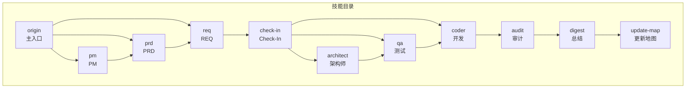
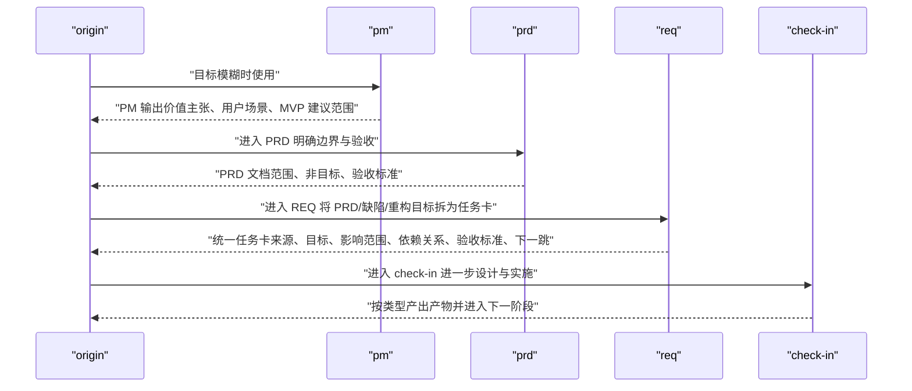
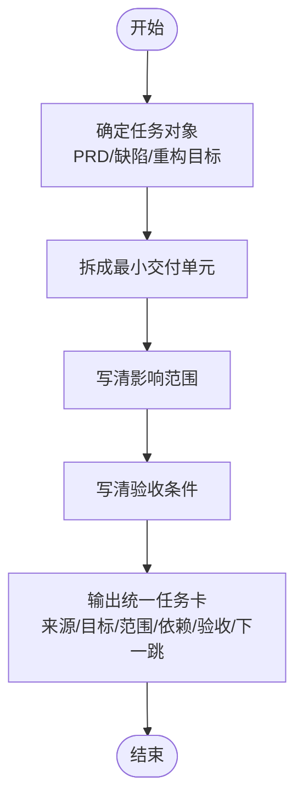
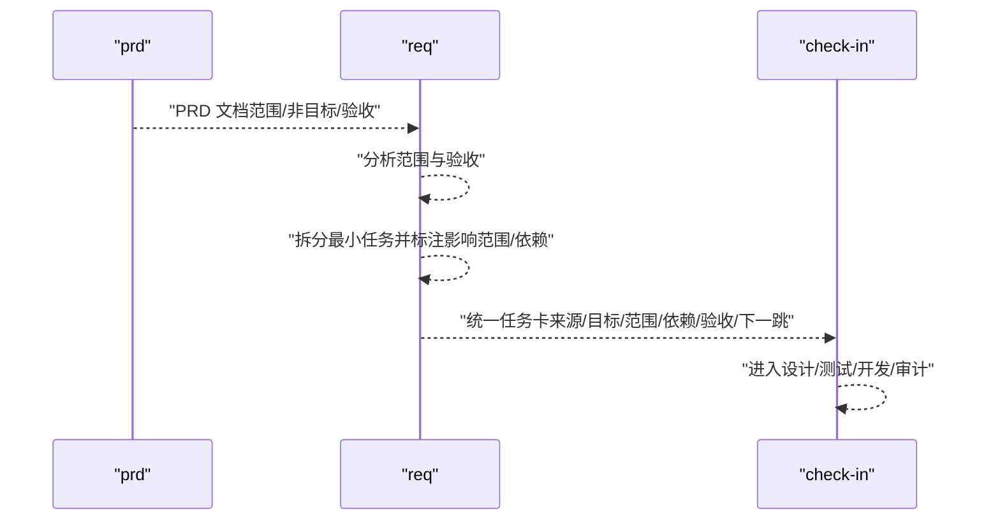
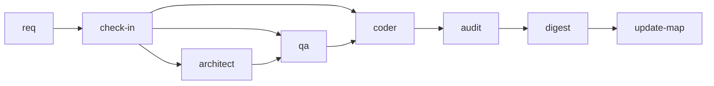
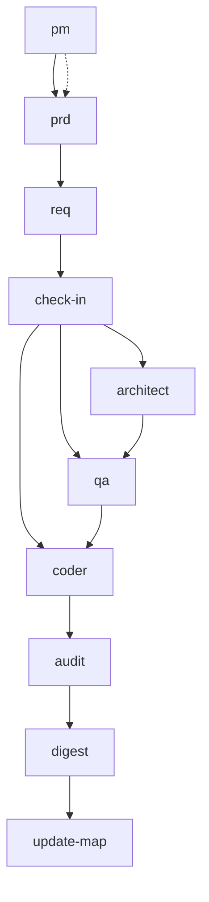

# 需求拆解技能 (REQ)

<cite>
**本文引用的文件**
- [req/SKILL.md](file://skills/web3-ai-agent/req/SKILL.md)
- [prd/SKILL.md](file://skills/web3-ai-agent/prd/SKILL.md)
- [pm/SKILL.md](file://skills/web3-ai-agent/pm/SKILL.md)
- [MAP-V3.md](file://skills/web3-ai-agent/MAP-V3.md)
- [SKILL.md](file://skills/web3-ai-agent/SKILL.md)
- [TEMPLATES-V3.md](file://skills/web3-ai-agent/TEMPLATES-V3.md)
</cite>

## 目录
1. [简介](#简介)
2. [项目结构](#项目结构)
3. [核心组件](#核心组件)
4. [架构总览](#架构总览)
5. [详细组件分析](#详细组件分析)
6. [依赖分析](#依赖分析)
7. [性能考虑](#性能考虑)
8. [故障排查指南](#故障排查指南)
9. [结论](#结论)
10. [附录](#附录)

## 简介
需求拆解技能（REQ）负责将更高层的范围定义（如 PRD、缺陷描述、重构目标）拆分为最小可执行的任务卡，并明确任务的来源、目标、影响范围、依赖关系、验收标准与下一跳。它不产出架构说明，也不直接写代码，而是作为交付型任务的“入口拆分器”，确保后续进入 check-in 并按流水线推进。

## 项目结构
本仓库以“技能”为单位组织，每个技能以独立的 SKILL.md 文档描述其职责、输入输出、流程、边界与衔接。REQ 技能位于 skills/web3-ai-agent/req 目录，与 PRD、PM、CHECK-IN、ARCHITECT、QA、CODER、AUDIT、DIGEST、UPDATE-MAP 等技能共同组成完整的交付流水线。

图表来源
- [MAP-V3.md:104-152](file://skills/web3-ai-agent/MAP-V3.md#L104-L152)
- [SKILL.md:112-152](file://skills/web3-ai-agent/SKILL.md#L112-L152)

章节来源
- [MAP-V3.md:1-166](file://skills/web3-ai-agent/MAP-V3.md#L1-L166)
- [SKILL.md:1-224](file://skills/web3-ai-agent/SKILL.md#L1-L224)

## 核心组件
- REQ 技能
  - 适用场景：将 PRD 拆为执行项；PATCH 的默认入口；REFACTOR 的默认入口
  - 输入：PRD、缺陷描述、重构目标
  - 输出：FEAT/ PATCH/ REFACTOR 类型的统一任务卡（含来源、目标、影响范围、依赖关系、验收标准、下一跳）
  - 流程：确定任务对象 → 拆成最小交付单元 → 写清影响范围 → 写清验收条件
  - 边界：不产出架构说明；不写代码
  - 衔接：进入 check-in
  - 规则：PATCH/REFACTOR 默认从 REQ 开始；若任务仍过大应继续拆分
- PRD 技能
  - 适用场景：FEAT 正式边界定义；重构影响产品边界时；bug 根因是需求错误时
  - 输入：PM 输出或明确目标、用户场景、约束与非目标
  - 输出：PRD 文档（背景、目标、用户场景、范围、非目标、风险边界、验收标准）
  - 流程：明确做什么 → 明确不做什么 → 明确验收标准 → 明确风险边界
  - 边界：不做技术方案；不直接拆成代码任务
  - 衔接：进入 REQ
  - 规则：PRD 重点是边界，不是实现；无清晰非目标的 PRD 视为未完成
- PM 技能
  - 适用场景：目标模糊；用户价值不清；需要先判断值不值得做
  - 输入：背景、目标用户、使用场景、商业或学习目标
  - 输出：PM 输出（目标用户、核心痛点、价值主张、为什么现在做、MVP 建议范围、下一跳）
  - 流程：明确用户是谁 → 明确问题是什么 → 明确为什么值得做 → 给出 MVP 范围建议
  - 边界：不写技术实现；不拆工程任务
  - 衔接：进入 PRD
  - 规则：PM 只在目标不清时使用；目标已经明确时不强制走 PM

章节来源
- [req/SKILL.md:1-57](file://skills/web3-ai-agent/req/SKILL.md#L1-L57)
- [prd/SKILL.md:1-54](file://skills/web3-ai-agent/prd/SKILL.md#L1-L54)
- [pm/SKILL.md:1-53](file://skills/web3-ai-agent/pm/SKILL.md#L1-L53)

## 架构总览
REQ 技能在整体技能系统中的定位如下：
- 作为交付型任务的“入口拆分器”，在 FEAT/PATCH/REFACTOR 三类任务中均承担“先拆后行”的职责
- 与 PRD/PM 的协作：PM 定义价值与方向，PRD 明确边界与验收，REQ 将其转化为可执行任务卡
- 与后续流程的衔接：REQ 输出统一进入 check-in，再由 check-in 分发至 architect、qa、coder、audit 等环节

图表来源
- [SKILL.md:112-152](file://skills/web3-ai-agent/SKILL.md#L112-L152)
- [MAP-V3.md:104-152](file://skills/web3-ai-agent/MAP-V3.md#L104-L152)
- [pm/SKILL.md:1-53](file://skills/web3-ai-agent/pm/SKILL.md#L1-L53)
- [prd/SKILL.md:1-54](file://skills/web3-ai-agent/prd/SKILL.md#L1-L54)
- [req/SKILL.md:1-57](file://skills/web3-ai-agent/req/SKILL.md#L1-L57)

## 详细组件分析

### REQ 技能执行流程
- 步骤一：确定任务对象
  - 来源包括 PRD、缺陷描述、重构目标
- 步骤二：拆成最小交付单元
  - 将 PRD 中的功能边界拆分为可独立交付的最小任务
- 步骤三：写清影响范围
  - 明确涉及模块、接口、数据流、第三方依赖等
- 步骤四：写清验收条件
  - 明确可验证的行为指标与通过标准

图表来源
- [req/SKILL.md:36-42](file://skills/web3-ai-agent/req/SKILL.md#L36-L42)

章节来源
- [req/SKILL.md:1-57](file://skills/web3-ai-agent/req/SKILL.md#L1-L57)

### REQ 与 PRD 的协作关系
- PRD 定义“做什么、不做什么、验收标准、风险边界”
- REQ 将 PRD 的范围与验收转化为“可执行任务卡”，并标注影响范围与依赖关系
- 二者衔接：PRD 完成后进入 REQ

图表来源
- [prd/SKILL.md:20-32](file://skills/web3-ai-agent/prd/SKILL.md#L20-L32)
- [req/SKILL.md:20-35](file://skills/web3-ai-agent/req/SKILL.md#L20-L35)
- [TEMPLATES-V3.md:25-66](file://skills/web3-ai-agent/TEMPLATES-V3.md#L25-L66)

章节来源
- [prd/SKILL.md:1-54](file://skills/web3-ai-agent/prd/SKILL.md#L1-L54)
- [req/SKILL.md:1-57](file://skills/web3-ai-agent/req/SKILL.md#L1-L57)
- [TEMPLATES-V3.md:1-152](file://skills/web3-ai-agent/TEMPLATES-V3.md#L1-L152)

### 与后续开发流程的衔接机制
- REQ 输出统一进入 check-in，按任务类型（FEAT/PATCH/REFACTOR）生成对应场景的 Check-In 模板
- FEAT：PM（按需）→ PRD → REQ → check-in → architect → qa → coder → audit → digest → update-map
- PATCH：REQ → check-in → coder → qa → digest → update-map
- REFACTOR：REQ → check-in → architect → qa → coder → audit → digest → update-map

图表来源
- [MAP-V3.md:104-152](file://skills/web3-ai-agent/MAP-V3.md#L104-L152)
- [SKILL.md:112-152](file://skills/web3-ai-agent/SKILL.md#L112-L152)

章节来源
- [MAP-V3.md:1-166](file://skills/web3-ai-agent/MAP-V3.md#L1-L166)
- [SKILL.md:1-224](file://skills/web3-ai-agent/SKILL.md#L1-L224)

### 需求卡模板与结构
- 统一字段（按类型输出）：
  - 来源：PRD/缺陷描述/重构目标
  - 目标：要达成的具体行为或指标
  - 影响范围：涉及模块、接口、数据流、第三方依赖
  - 依赖关系：前置任务、上游模块、兼容约束
  - 验收标准：可验证的行为与通过条件
  - 下一跳：进入 check-in 并按类型选择后续技能
- FEAT/PATCH/REFACTOR 的 Check-In 模板要点：
  - FEAT：明确“新增能力、服务对象、主路径”，并产出需求卡、架构说明、测试清单、代码实现
  - PATCH：聚焦“具体 bug、复现条件、预期行为、根因假设”，并产出缺陷卡、修复代码、回归验证记录
  - REFACTOR：聚焦“结构问题、重构原因、必须保持不变的行为”，并产出重构卡、架构说明、回归测试清单、重构代码

章节来源
- [req/SKILL.md:20-35](file://skills/web3-ai-agent/req/SKILL.md#L20-L35)
- [TEMPLATES-V3.md:25-151](file://skills/web3-ai-agent/TEMPLATES-V3.md#L25-L151)

### 影响范围分析方法
- 模块边界：明确改动涉及的模块与边界
- 接口影响：接口签名、参数、返回值、异常是否变化
- 数据流：输入输出、缓存、持久化、第三方数据
- 兼容性：对外行为是否保持一致，是否存在回滚风险
- 依赖关系：上游模块、工具链、配置、权限

章节来源
- [req/SKILL.md:31-32](file://skills/web3-ai-agent/req/SKILL.md#L31-L32)
- [TEMPLATES-V3.md:119-123](file://skills/web3-ai-agent/TEMPLATES-V3.md#L119-L123)

### 验收条件定义标准
- 可验证性：行为指标可观察、可测量
- 完整性：覆盖主路径、关键分支、异常场景
- 明确性：标准清晰、无歧义
- 可追溯：与 PRD 验收标准一致，可回溯到需求来源

章节来源
- [req/SKILL.md:33-34](file://skills/web3-ai-agent/req/SKILL.md#L33-L34)
- [prd/SKILL.md:30-31](file://skills/web3-ai-agent/prd/SKILL.md#L30-L31)

### 实际应用示例（基于模板与流程）
- 示例一：FEAT
  - 来源：PM 输出 + PRD
  - 目标：新增 gas price 查询能力，服务钱包模块
  - 影响范围：钱包模块、网络层、缓存层
  - 依赖关系：网络层接口、缓存策略
  - 验收标准：查询成功、失败兜底、缓存命中率
  - 下一跳：进入 FEAT 场景的 check-in
- 示例二：PATCH
  - 来源：缺陷描述（UI 不刷新）
  - 目标：修复钱包切换后 UI 不刷新
  - 影响范围：状态管理、UI 渲染、事件监听
  - 依赖关系：状态订阅、渲染触发器
  - 验收标准：切换后稳定刷新、无回归
  - 下一跳：进入 PATCH 场景的 check-in
- 示例三：REFACTOR
  - 来源：重构目标（tool 调用层重构成 registry + adapter）
  - 目标：保持行为等价，提升可维护性
  - 影响范围：工具注册、适配器接口、调用方
  - 依赖关系：兼容策略、迁移路径
  - 验收标准：行为等价、回归通过、风险记录
  - 下一跳：进入 REFACTOR 场景的 check-in

章节来源
- [TEMPLATES-V3.md:25-151](file://skills/web3-ai-agent/TEMPLATES-V3.md#L25-L151)
- [req/SKILL.md:24-26](file://skills/web3-ai-agent/req/SKILL.md#L24-L26)

## 依赖分析
- REQ 对 PRD 的依赖：PRD 提供明确的范围与验收，REQ 在此基础上拆分任务
- REQ 对 PM 的间接依赖：PM 输出可能成为 PRD 的输入，进而影响 REQ 的任务拆分
- REQ 对 check-in 的依赖：统一任务卡需进入 check-in，按类型产出相应场景的模板
- REQ 对后续技能的依赖：通过 check-in 进入 architect、qa、coder、audit 等环节

图表来源
- [MAP-V3.md:104-152](file://skills/web3-ai-agent/MAP-V3.md#L104-L152)
- [SKILL.md:112-152](file://skills/web3-ai-agent/SKILL.md#L112-L152)

章节来源
- [MAP-V3.md:1-166](file://skills/web3-ai-agent/MAP-V3.md#L1-L166)
- [SKILL.md:1-224](file://skills/web3-ai-agent/SKILL.md#L1-L224)

## 性能考虑
- 任务粒度控制：避免单卡过大，遵循“若任务仍过大应继续拆分”的规则
- 影响范围收敛：尽量减少跨模块耦合，降低回归成本
- 验收条件可验证性：提高自动化验证比例，缩短反馈周期
- 流水线并行：在满足依赖的前提下，合理安排 architect/qa/coder 的并行与串行

## 故障排查指南
- 常见问题
  - 任务卡过大：拆分为更小的可交付单元
  - 影响范围不清晰：补充模块边界、接口、数据流与依赖关系
  - 验收条件不可验证：细化行为指标，增加可观测点
  - 与 PRD 不一致：回溯 PRD 的范围与验收标准，修正任务卡
- 质量保证措施
  - 严格遵循“不产出架构说明、不写代码”的边界
  - 通过 check-in 模板固化任务卡结构，确保来源、目标、范围、依赖、验收、下一跳完整
  - 在必要时插入 architect/audit/browser-verify 等技能进行风险控制

章节来源
- [req/SKILL.md:43-57](file://skills/web3-ai-agent/req/SKILL.md#L43-L57)
- [TEMPLATES-V3.md:1-152](file://skills/web3-ai-agent/TEMPLATES-V3.md#L1-L152)

## 结论
REQ 技能是交付型任务的“入口拆分器”，通过将 PRD/缺陷/重构目标转化为统一的任务卡，明确影响范围与验收条件，并顺利衔接至 check-in 与后续流水线。其核心价值在于：规范化任务表达、降低沟通成本、提升交付质量与效率。配合 PM/PRD 的边界定义与后续 architect/qa/coder/audit 的协同，形成闭环的智能交付体系。

## 附录
- 相关技能与模板参考
  - PM 技能：目标模糊时的“价值主张、用户场景、MVP 建议范围”
  - PRD 技能：正式范围、非目标与验收标准
  - Check-In 模板：FEAT/PATCH/REFACTOR 三类场景的统一模板
  - 技能系统总览：主入口、路由规则与硬性约束

章节来源
- [pm/SKILL.md:1-53](file://skills/web3-ai-agent/pm/SKILL.md#L1-L53)
- [prd/SKILL.md:1-54](file://skills/web3-ai-agent/prd/SKILL.md#L1-L54)
- [TEMPLATES-V3.md:1-152](file://skills/web3-ai-agent/TEMPLATES-V3.md#L1-L152)
- [SKILL.md:1-224](file://skills/web3-ai-agent/SKILL.md#L1-L224)