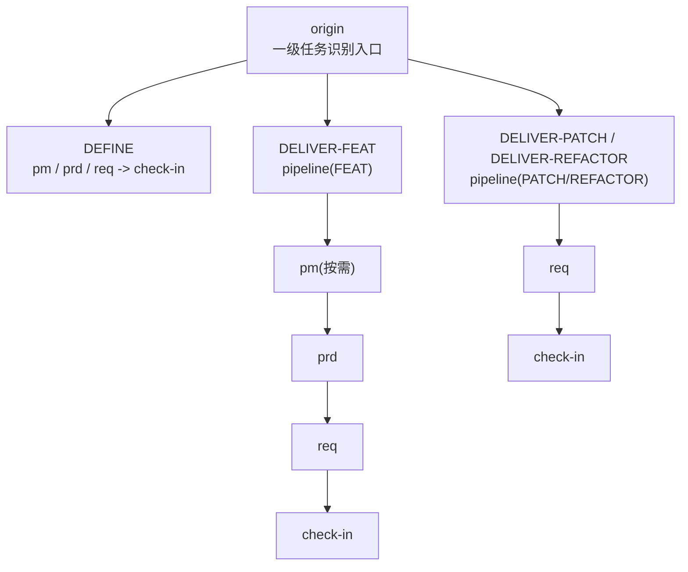
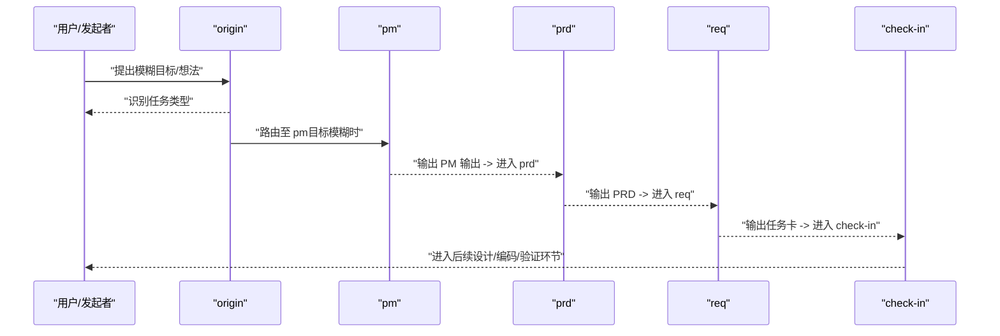
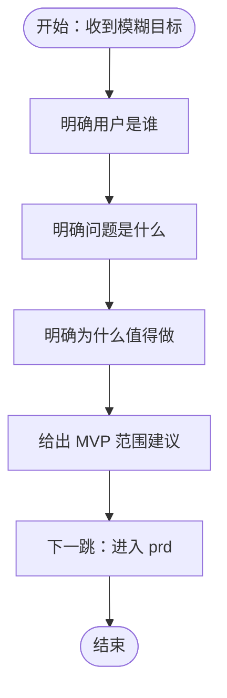
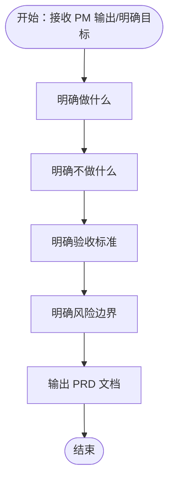
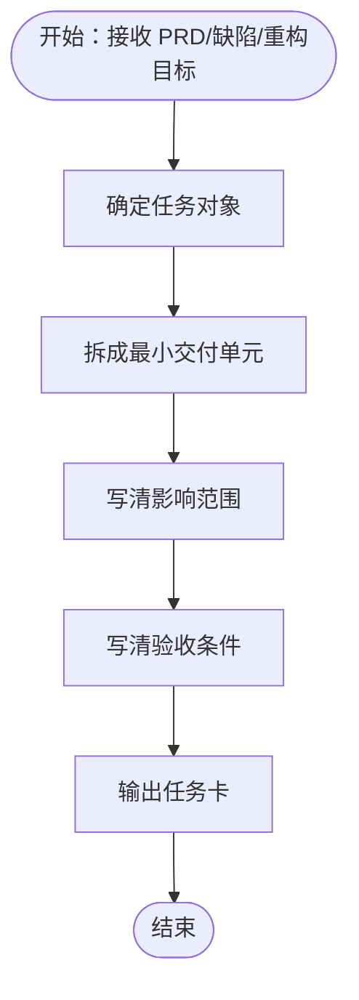
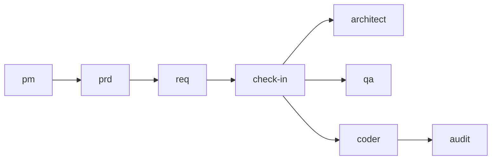
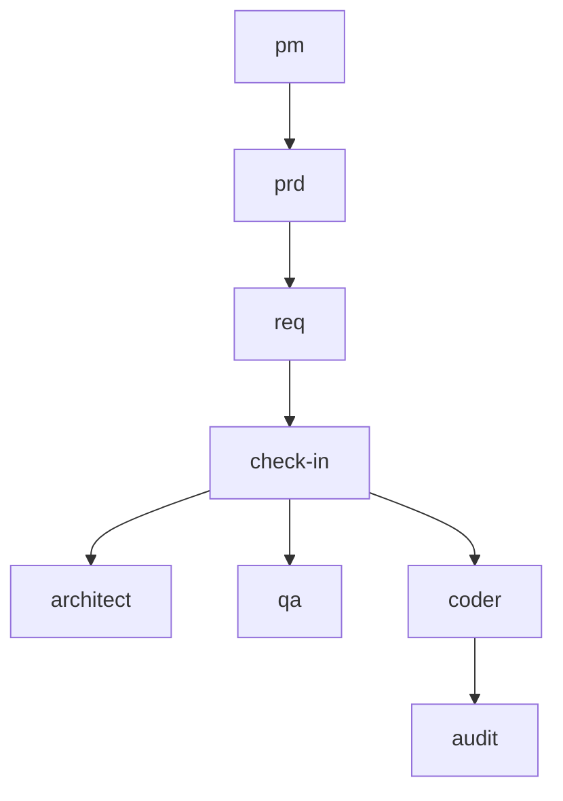

# 项目管理技能 (PM)

<cite>
**本文引用的文件**
- [PM 技能说明](file://skills/web3-ai-agent/pm/SKILL.md)
- [PRD 技能说明](file://skills/web3-ai-agent/prd/SKILL.md)
- [需求 Req 技能说明](file://skills/web3-ai-agent/req/SKILL.md)
- [架构 Architect 技能说明](file://skills/web3-ai-agent/architect/SKILL.md)
- [质量保证 QA 技能说明](file://skills/web3-ai-agent/qa/SKILL.md)
- [编码 Coder 技能说明](file://skills/web3-ai-agent/coder/SKILL.md)
- [审计 Audit 技能说明](file://skills/web3-ai-agent/audit/SKILL.md)
- [Web3-AI-Agent 总入口与流程](file://skills/web3-ai-agent/SKILL.md)
- [技能地图 V3](file://skills/web3-ai-agent/MAP-V3.md)
- [PRD MVP 模板](file://docs/Web3-AI-Agent-PRD-MVP.md)
- [技能模板 V3](file://skills/web3-ai-agent/TEMPLATES-V3.md)
</cite>

## 目录
1. [简介](#简介)
2. [项目结构](#项目结构)
3. [核心组件](#核心组件)
4. [架构总览](#架构总览)
5. [详细组件分析](#详细组件分析)
6. [依赖分析](#依赖分析)
7. [性能考量](#性能考量)
8. [故障排查指南](#故障排查指南)
9. [结论](#结论)
10. [附录](#附录)

## 简介
本文件面向 AI-Agent 项目管理（PM）技能，系统化阐述其在模糊目标阶段的价值定位、输入与输出规范、执行流程、边界与规则，以及与 PRD、Req 等上下游技能的协作关系。PM 技能旨在帮助团队在“目标模糊、用户价值不清、需要先判断值不值得做”的情况下，把模糊想法整理为可执行的用户场景、价值主张与 MVP 方向，从而为后续 PRD 正式定义范围奠定基础。

## 项目结构
PM 技能在整体 skill 体系中的位置如下：
- 一级入口：web3-ai-agent -> origin
- 任务类型识别后，DEFINE 类任务默认经由 pm -> prd -> req -> check-in
- 交付型任务（DELIVER-FEAT/PATCH/REFACTOR）在 pipeline 中按需可能再次进入 pm（如需求边界不清晰）

图表来源
- [Web3-AI-Agent 总入口与流程:92-158](file://skills/web3-ai-agent/SKILL.md#L92-L158)
- [技能地图 V3:146-156](file://skills/web3-ai-agent/MAP-V3.md#L146-L156)

章节来源
- [Web3-AI-Agent 总入口与流程:92-158](file://skills/web3-ai-agent/SKILL.md#L92-L158)
- [技能地图 V3:146-156](file://skills/web3-ai-agent/MAP-V3.md#L146-L156)

## 核心组件
- PM 技能
  - 适用场景：目标模糊、用户价值不清、需要先判断值不值得做
  - 输入：背景、目标用户、使用场景、商业或学习目标
  - 输出：PM 输出模板（目标用户、核心痛点、价值主张、为什么现在做、MVP 建议范围、下一跳）
  - 流程：明确用户是谁 -> 明确问题是什么 -> 明确为什么值得做 -> 给出 MVP 范围建议
  - 边界：不写技术实现、不拆工程任务
  - 衔接：进入 prd
  - 规则：pm 只在目标不清时使用；目标明确时可不强制走 pm

- PRD 技能
  - 适用场景：FEAT 的正式边界定义、重构影响产品边界时、bug 根因其实是需求错误时
  - 输入：pm 输出或明确目标、用户场景、约束与非目标
  - 输出：PRD 模板（背景、目标、用户场景、范围、非目标、风险边界、验收标准）
  - 流程：明确做什么 -> 明确不做什么 -> 明确验收标准 -> 明确风险边界
  - 边界：不做技术方案、不直接拆成代码任务
  - 衔接：进入 req
  - 规则：PRD 的重点是边界，不是实现；没有清晰非目标的 PRD 视为未完成

- Req 技能
  - 适用场景：把 PRD 拆成最小可执行任务卡；PATCH/REFACTOR 的默认入口
  - 输入：PRD、bug 描述、重构目标
  - 输出：需求卡/缺陷卡/重构卡（来源、目标、影响范围、依赖关系、验收标准、下一跳）
  - 流程：确定任务对象 -> 拆成最小交付单元 -> 写清影响范围 -> 写清验收条件
  - 边界：不产出架构说明、不写代码
  - 衔接：进入 check-in
  - 规则：PATCH/REFACTOR 默认从 req 开始；若任务卡仍过大，应继续拆分

章节来源
- [PM 技能说明:8-53](file://skills/web3-ai-agent/pm/SKILL.md#L8-L53)
- [PRD 技能说明:8-54](file://skills/web3-ai-agent/prd/SKILL.md#L8-L54)
- [需求 Req 技能说明:8-57](file://skills/web3-ai-agent/req/SKILL.md#L8-L57)

## 架构总览
PM 技能在整体交付流程中的关键作用：
- 在需求初期提供“价值判断与范围界定”的锚点，避免过早进入技术实现
- 与 PRD 技能形成“场景与价值 -> 正式边界”的闭环
- 为后续 Req、Architect、QA、Coder、Audit 等环节提供稳定输入

图表来源
- [Web3-AI-Agent 总入口与流程:106-126](file://skills/web3-ai-agent/SKILL.md#L106-L126)
- [PM 技能说明:45-48](file://skills/web3-ai-agent/pm/SKILL.md#L45-L48)
- [PRD 技能说明:46-49](file://skills/web3-ai-agent/prd/SKILL.md#L46-L49)
- [需求 Req 技能说明:48-51](file://skills/web3-ai-agent/req/SKILL.md#L48-L51)

## 详细组件分析

### PM 技能：用户场景分析、价值主张定义、产品语言转换
- 用户场景分析
  - 明确“用户是谁”：目标用户画像、动机、使用情境
  - 明确“问题是什么”：用户痛点、当前解决方案的不足
  - 明确“为什么值得做”：价值主张、时机、收益与风险
- 价值主张定义
  - 以“用户价值”为核心，强调“能解决什么具体问题、带来什么可感知收益”
  - 区分“应该做”和“现在就做”的驱动因素（如技术成熟度、资源可用性、竞争态势）
- 产品语言转换
  - 将“模糊想法”转化为“可衡量的用户场景 + 价值主张 + MVP 范围建议”
  - 输出 PM 输出模板，确保后续 PRD 能直接承接

图表来源
- [PM 技能说明:33-39](file://skills/web3-ai-agent/pm/SKILL.md#L33-L39)

章节来源
- [PM 技能说明:14-31](file://skills/web3-ai-agent/pm/SKILL.md#L14-L31)

### PRD 技能：正式范围、非目标与验收标准
- 正式边界定义
  - 明确“做什么”：目标、用户场景、范围
  - 明确“不做什么”：非目标、约束与风险边界
  - 明确“如何验证”：验收标准、验证策略
- 与 PM 的衔接
  - PRD 以 PM 输出或明确目标为输入，进一步收敛到可执行的正式文档
- 与 Req 的衔接
  - PRD 为 Req 拆分任务卡提供权威依据

图表来源
- [PRD 技能说明:34-40](file://skills/web3-ai-agent/prd/SKILL.md#L34-L40)

章节来源
- [PRD 技能说明:14-32](file://skills/web3-ai-agent/prd/SKILL.md#L14-L32)

### Req 技能：最小可执行任务卡
- 任务对象确定
  - 依据 PRD、缺陷描述或重构目标，确定任务类型（FEAT/BUG/REFACTOR）
- 最小交付单元
  - 将 PRD 拆分为最小可验证的“任务卡”，明确来源、目标、影响范围、依赖关系、验收标准、下一跳
- 与 Check-In 的衔接
  - 任务卡完成后进入 check-in，为后续 Architect/QA/Coder/Audit 提供稳定输入

图表来源
- [需求 Req 技能说明:36-42](file://skills/web3-ai-agent/req/SKILL.md#L36-L42)

章节来源
- [需求 Req 技能说明:14-35](file://skills/web3-ai-agent/req/SKILL.md#L14-L35)

### 与其他技能的协作关系
- PM → PRD：从“价值与场景”到“正式边界”
- PRD → Req：从“正式边界”到“最小任务卡”
- Req → Check-In：从“任务卡”到“阶段交付承诺”
- Check-In → Architect/QA/Coder/Audit：从“交付承诺”到“设计/验证/编码/审计”

图表来源
- [Web3-AI-Agent 总入口与流程:106-126](file://skills/web3-ai-agent/SKILL.md#L106-L126)
- [技能地图 V3:104-131](file://skills/web3-ai-agent/MAP-V3.md#L104-L131)

章节来源
- [Web3-AI-Agent 总入口与流程:106-126](file://skills/web3-ai-agent/SKILL.md#L106-L126)
- [技能地图 V3:104-131](file://skills/web3-ai-agent/MAP-V3.md#L104-L131)

## 依赖分析
- PM 与 PRD 的依赖
  - PM 输出是 PRD 的输入；PRD 的“非目标”是 Req 拆分的重要约束
- PRD 与 Req 的依赖
  - PRD 为 Req 提供权威边界；Req 为 Architect/QA/Coder/Audit 提供最小可执行单元
- Req 与 Check-In 的依赖
  - Req 输出任务卡后进入 Check-In，形成阶段交付承诺
- Check-In 与后续技能的依赖
  - Check-In 是 Architect/QA/Coder/Audit 的准入条件

图表来源
- [技能地图 V3:104-131](file://skills/web3-ai-agent/MAP-V3.md#L104-L131)
- [Web3-AI-Agent 总入口与流程:158-166](file://skills/web3-ai-agent/SKILL.md#L158-L166)

章节来源
- [技能地图 V3:158-166](file://skills/web3-ai-agent/MAP-V3.md#L158-L166)
- [Web3-AI-Agent 总入口与流程:158-166](file://skills/web3-ai-agent/SKILL.md#L158-L166)

## 性能考量
- 早期决策成本控制
  - PM 在需求初期介入，避免过早进入技术实现，降低后期返工成本
- 任务粒度与交付节奏
  - Req 将 PRD 拆分为最小可执行单元，有助于缩短反馈周期、提升交付频率
- 风险前置与质量门禁
  - QA 的 RED 模式与 Audit 的评分机制，确保在进入下一阶段前完成必要的质量门禁

## 故障排查指南
- PM 阶段常见问题
  - 目标仍然模糊：回到 PM，补充背景、用户、场景与目标，直至输出 PM 输出模板
  - 价值主张不清晰：聚焦用户痛点与收益，明确“为什么现在做”
- PRD 阶段常见问题
  - 非目标不清晰：PRD 视为未完成，应回退 PM/PRD，补充非目标与风险边界
  - 验收标准缺失：补充可验证的验收标准，确保 Req 可落地
- Req 阶段常见问题
  - 任务卡过大：继续拆分，遵循“最小可执行单元”原则
  - 影响范围不清：明确依赖关系与回归风险点
- Check-In 阶段常见问题
  - 未满足完成标准：回退到上一阶段，补齐上下文、方案或产物

章节来源
- [PM 技能说明:40-53](file://skills/web3-ai-agent/pm/SKILL.md#L40-L53)
- [PRD 技能说明:41-54](file://skills/web3-ai-agent/prd/SKILL.md#L41-L54)
- [需求 Req 技能说明:43-57](file://skills/web3-ai-agent/req/SKILL.md#L43-L57)
- [质量保证 QA 技能说明:51-73](file://skills/web3-ai-agent/qa/SKILL.md#L51-L73)
- [审计 Audit 技能说明:64-88](file://skills/web3-ai-agent/audit/SKILL.md#L64-L88)

## 结论
PM 技能在 AI-Agent 开发流程中扮演“价值锚点与范围守门人”的角色：在目标模糊阶段，通过用户场景挖掘、价值主张提炼与 MVP 范围建议，为 PRD 正式定义范围提供坚实基础；随后通过 Req 将 PRD 转换为最小可执行任务卡，配合 Check-In 与后续 Architect/QA/Coder/Audit，形成“从价值到实现”的闭环。PM 与 PRD 的协作关系决定了项目能否在正确的方向上高效推进。

## 附录

### PM 技能输入与输出规范
- 输入
  - 背景
  - 目标用户
  - 使用场景
  - 商业或学习目标
- 输出
  - PM 输出模板（目标用户、核心痛点、价值主张、为什么现在做、MVP 建议范围、下一跳）

章节来源
- [PM 技能说明:14-31](file://skills/web3-ai-agent/pm/SKILL.md#L14-L31)

### PRD 技能输入与输出规范
- 输入
  - pm 输出或明确目标
  - 用户场景
  - 约束与非目标
- 输出
  - PRD 模板（背景、目标、用户场景、范围、非目标、风险边界、验收标准）

章节来源
- [PRD 技能说明:14-32](file://skills/web3-ai-agent/prd/SKILL.md#L14-L32)

### Req 技能输入与输出规范
- 输入
  - PRD
  - bug 描述
  - 重构目标
- 输出
  - 需求卡/缺陷卡/重构卡（来源、目标、影响范围、依赖关系、验收标准、下一跳）

章节来源
- [需求 Req 技能说明:14-35](file://skills/web3-ai-agent/req/SKILL.md#L14-L35)

### 项目管理最佳实践
- 用户场景分析方法
  - 以“用户画像 + 使用情境 + 痛点/动机”为主线，避免陷入“技术可行但用户不关心”的陷阱
- 价值主张定义模板
  - 明确“解决什么问题”“为谁解决”“带来什么收益”“为什么现在做”
- 产品语言转换技巧
  - 将“模糊想法”转化为“可衡量的用户场景 + 价值主张 + MVP 范围建议”
- 需求优先级排序
  - 基于“用户价值 × 技术可行性 × 资源投入 × 时机窗口”综合评估
- 跨部门沟通与需求收集
  - 以 PM 输出为共识基线，PRD 为正式契约，Req 为执行依据，确保各角色在同一语义层协作

章节来源
- [PRD MVP 模板:11-228](file://docs/Web3-AI-Agent-PRD-MVP.md#L11-L228)
- [技能模板 V3:3-24](file://skills/web3-ai-agent/TEMPLATES-V3.md#L3-L24)