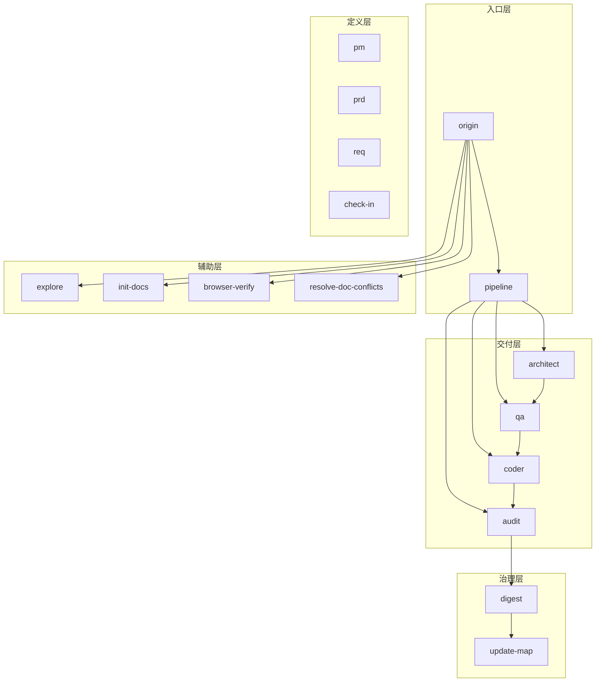
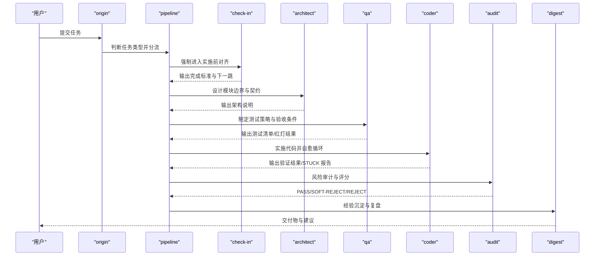
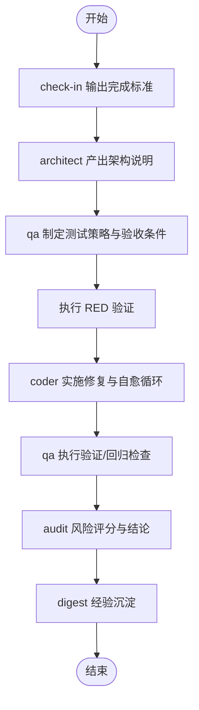
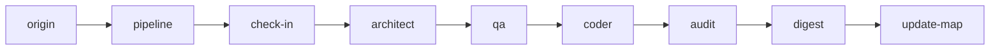

# 架构与质量保证技能

<cite>
**本文引用的文件**
- [skills/web3-ai-agent/SKILL.md](file://skills/web3-ai-agent/SKILL.md)
- [skills/web3-ai-agent/architect/SKILL.md](file://skills/web3-ai-agent/architect/SKILL.md)
- [skills/web3-ai-agent/qa/SKILL.md](file://skills/web3-ai-agent/qa/SKILL.md)
- [skills/web3-ai-agent/SKILL-SYSTEM-DESIGN-V3.md](file://skills/web3-ai-agent/SKILL-SYSTEM-DESIGN-V3.md)
- [skills/web3-ai-agent/MAP-V3.md](file://skills/web3-ai-agent/MAP-V3.md)
- [skills/web3-ai-agent/check-in/SKILL.md](file://skills/web3-ai-agent/check-in/SKILL.md)
- [skills/web3-ai-agent/coder/SKILL.md](file://skills/web3-ai-agent/coder/SKILL.md)
- [skills/web3-ai-agent/audit/SKILL.md](file://skills/web3-ai-agent/audit/SKILL.md)
- [skills/web3-ai-agent/digest/SKILL.md](file://skills/web3-ai-agent/digest/SKILL.md)
- [skills/web3-ai-agent/origin/SKILL.md](file://skills/web3-ai-agent/origin/SKILL.md)
- [skills/web3-ai-agent/pipeline/SKILL.md](file://skills/web3-ai-agent/pipeline/SKILL.md)
- [skills/web3-ai-agent/explore/SKILL.md](file://skills/web3-ai-agent/explore/SKILL.md)
- [skills/web3-ai-agent/init-docs/SKILL.md](file://skills/web3-ai-agent/init-docs/SKILL.md)
- [skills/web3-ai-agent/TEMPLATES-V3.md](file://skills/web3-ai-agent/TEMPLATES-V3.md)
</cite>

## 目录
1. [简介](#简介)
2. [项目结构](#项目结构)
3. [核心组件](#核心组件)
4. [架构总览](#架构总览)
5. [详细组件分析](#详细组件分析)
6. [依赖分析](#依赖分析)
7. [性能考虑](#性能考虑)
8. [故障排查指南](#故障排查指南)
9. [结论](#结论)
10. [附录](#附录)

## 简介
本文件面向“AI-Agent 架构与质量保证技能”的技术实现，围绕 Architect（架构设计）与 QA（质量保证）两大核心技能，系统阐述其在 Web3 AI Agent 技能体系中的定位、流程、协作关系与质量控制机制。内容涵盖：
- Architect 的系统架构设计流程：模块边界定义、接口契约制定、技术方案评估与风险识别。
- QA 的测试策略制定：红灯（RED）优先模式、验证清单设计、验收条件与风险评估。
- 两技能间的协作关系与数据传递机制：从 check-in 到 architect、qa、coder、audit、digest 的闭环。
- 最佳实践、标准流程与质量控制指标，辅以架构图、序列图与流程图。

## 项目结构
Web3 AI Agent 技能体系以“入口层 → 定义层 → 交付层 → 治理层 → 辅助层”五层分层组织，其中 Architect 与 QA 位于交付层，共同承接来自定义层与实施层的对齐与验证需求。主入口 web3-ai-agent 统一调度，按任务类型分流至不同子链路。

**图示来源**
- [skills/web3-ai-agent/SKILL.md](file://skills/web3-ai-agent/SKILL.md)
- [skills/web3-ai-agent/SKILL-SYSTEM-DESIGN-V3.md](file://skills/web3-ai-agent/SKILL-SYSTEM-DESIGN-V3.md)
- [skills/web3-ai-agent/MAP-V3.md](file://skills/web3-ai-agent/MAP-V3.md)

**章节来源**
- [skills/web3-ai-agent/SKILL.md](file://skills/web3-ai-agent/SKILL.md)
- [skills/web3-ai-agent/SKILL-SYSTEM-DESIGN-V3.md](file://skills/web3-ai-agent/SKILL-SYSTEM-DESIGN-V3.md)
- [skills/web3-ai-agent/MAP-V3.md](file://skills/web3-ai-agent/MAP-V3.md)

## 核心组件
- origin：统一入口路由，识别任务类型并决定是否进入 pipeline、是否需要 check-in。
- pipeline：仅服务于交付型任务，按 FEAT/PATCH/REFACTOR 选择执行深度。
- check-in：实施前对齐点，强制输出“问题、上下文、方案、不做什么、产物、完成标准、下一跳”。
- architect：结构设计，产出模块边界、数据流、消息流、接口契约、错误处理与风险点。
- qa：验证策略制定，FEAT 红灯优先，PATCH/REFACTOR 轻量验证或回归验证。
- coder：在边界清晰前提下实施代码，最多 10 轮自愈循环将 RED 变 GREEN。
- audit：风险审计与评分，支持轻审/重审，总分 100，>=80 通过，<60 直接拒绝。
- digest/update-map：经验沉淀与地图更新，形成闭环。

**章节来源**
- [skills/web3-ai-agent/origin/SKILL.md](file://skills/web3-ai-agent/origin/SKILL.md)
- [skills/web3-ai-agent/pipeline/SKILL.md](file://skills/web3-ai-agent/pipeline/SKILL.md)
- [skills/web3-ai-agent/check-in/SKILL.md](file://skills/web3-ai-agent/check-in/SKILL.md)
- [skills/web3-ai-agent/architect/SKILL.md](file://skills/web3-ai-agent/architect/SKILL.md)
- [skills/web3-ai-agent/qa/SKILL.md](file://skills/web3-ai-agent/qa/SKILL.md)
- [skills/web3-ai-agent/coder/SKILL.md](file://skills/web3-ai-agent/coder/SKILL.md)
- [skills/web3-ai-agent/audit/SKILL.md](file://skills/web3-ai-agent/audit/SKILL.md)
- [skills/web3-ai-agent/digest/SKILL.md](file://skills/web3-ai-agent/digest/SKILL.md)
- [skills/web3-ai-agent/MAP-V3.md](file://skills/web3-ai-agent/MAP-V3.md)

## 架构总览
Architect 与 QA 的协作遵循“先设计、后验证”的交付节奏。Architect 负责结构与契约，QA 负责验证策略与结果，Coder 将 RED 变 GREEN，Audit 决定放行与否，Digest/Update-Map 收敛经验与状态。

**图示来源**
- [skills/web3-ai-agent/SKILL.md](file://skills/web3-ai-agent/SKILL.md)
- [skills/web3-ai-agent/architect/SKILL.md](file://skills/web3-ai-agent/architect/SKILL.md)
- [skills/web3-ai-agent/qa/SKILL.md](file://skills/web3-ai-agent/qa/SKILL.md)
- [skills/web3-ai-agent/coder/SKILL.md](file://skills/web3-ai-agent/coder/SKILL.md)
- [skills/web3-ai-agent/audit/SKILL.md](file://skills/web3-ai-agent/audit/SKILL.md)
- [skills/web3-ai-agent/digest/SKILL.md](file://skills/web3-ai-agent/digest/SKILL.md)

## 详细组件分析

### Architect（架构设计）
- 适用场景：接口变化、状态流变化、模块边界变化、结构性重构。
- 输入：check-in、任务卡。
- 输出：主题架构说明，包含目标、模块边界、数据流、消息流、接口契约、错误处理、风险点。
- 流程：确定影响模块 → 定义边界与契约 → 补主路径与异常路径。
- 边界：不直接写测试、不直接承担编码。
- 衔接：进入 qa 或 coder。
- 规则：若仅为局部修补且无结构变化可跳过；若发现需求边界变化，回退 prd/req。

最佳实践
- 明确模块边界与依赖，避免跨边界耦合。
- 以接口契约为中心设计数据流与消息流，确保可测试性。
- 风险点前置识别，形成可追溯的风险清单。

**章节来源**
- [skills/web3-ai-agent/architect/SKILL.md](file://skills/web3-ai-agent/architect/SKILL.md)
- [skills/web3-ai-agent/SKILL-SYSTEM-DESIGN-V3.md](file://skills/web3-ai-agent/SKILL-SYSTEM-DESIGN-V3.md)

### QA（质量保证）
- 定位：不是“最后顺手测一下”，而是定义与执行验证策略。
- 两种工作模式：
  - RED 模式：适用于 FEAT，先写测试或验证清单，先执行 RED，RED 只需证明“当前未通过”，最多运行 2 次。
  - VERIFY 模式：适用于 PATCH/REFACTOR，验证修复与回归风险。
- 输入：check-in、架构说明、任务卡。
- 输出：测试清单、红灯结果或验证结果、回归检查点。
- 红绿规则：FEAT 先红后绿；QA 阶段先负责 RED；coder 负责把 RED 全部变成 GREEN；若 RED 直接意外通过，说明测试可能写弱了，需要修正。
- 边界：不直接写业务实现、不扩大需求范围。
- 衔接：FEAT 进入 coder；PATCH/REFACTOR 进入 coder 或 audit。
- 规则：QA 必须引用 check-in 的完成标准；REFACTOR 默认优先保障回归验证；PATCH 至少保留轻量回归检查。

测试策略与验收条件设计
- 主路径与异常路径均需覆盖。
- 验收条件必须可验证、可量化。
- 对于 FEAT，RED 验证应聚焦“当前未通过”的证据，避免过早修复导致测试失效。

风险评估机制
- 依据架构说明识别关键路径与风险点。
- 对高风险场景设置强约束与降级策略。
- 回归检查点随版本演进持续维护。

**章节来源**
- [skills/web3-ai-agent/qa/SKILL.md](file://skills/web3-ai-agent/qa/SKILL.md)
- [skills/web3-ai-agent/SKILL-SYSTEM-DESIGN-V3.md](file://skills/web3-ai-agent/SKILL-SYSTEM-DESIGN-V3.md)

### Architect 与 QA 的协作关系与数据传递
- 数据传递链：check-in → architect（架构说明）→ qa（测试策略/验收条件）→ coder（RED/GREEN 自愈）→ audit（风险评分）→ digest（复盘）。
- 协作要点：
  - architect 的模块边界与接口契约为 qa 的测试策略提供依据。
  - qa 的 RED 结果驱动 coder 的迭代修复，直至 GREEN。
  - audit 基于架构说明与实现进行风险评分，决定是否放行。

**图示来源**
- [skills/web3-ai-agent/check-in/SKILL.md](file://skills/web3-ai-agent/check-in/SKILL.md)
- [skills/web3-ai-agent/architect/SKILL.md](file://skills/web3-ai-agent/architect/SKILL.md)
- [skills/web3-ai-agent/qa/SKILL.md](file://skills/web3-ai-agent/qa/SKILL.md)
- [skills/web3-ai-agent/coder/SKILL.md](file://skills/web3-ai-agent/coder/SKILL.md)
- [skills/web3-ai-agent/audit/SKILL.md](file://skills/web3-ai-agent/audit/SKILL.md)
- [skills/web3-ai-agent/digest/SKILL.md](file://skills/web3-ai-agent/digest/SKILL.md)

## 依赖分析
- 路由依赖：origin 与 pipeline 决定是否进入交付链与执行深度。
- 强制依赖：check-in 是进入 architect/qa/coder 的前置条件。
- 顺序依赖：architect → qa → coder → audit → digest → update-map。
- 可选依赖：browser-verify、prd、audit（轻/重）按场景插入。

**图示来源**
- [skills/web3-ai-agent/SKILL.md](file://skills/web3-ai-agent/SKILL.md)
- [skills/web3-ai-agent/MAP-V3.md](file://skills/web3-ai-agent/MAP-V3.md)

**章节来源**
- [skills/web3-ai-agent/SKILL.md](file://skills/web3-ai-agent/SKILL.md)
- [skills/web3-ai-agent/MAP-V3.md](file://skills/web3-ai-agent/MAP-V3.md)

## 性能考虑
- 流程分层与按需插入：通过“只在交付型任务进入 pipeline”“check-in 仅对实施型任务强制”“audit 分轻重”等规则，减少非必要消耗。
- RED 验证次数上限：FEAT 的 RED 最多运行 2 次，避免过度验证。
- coder 自愈轮次上限：最多 10 轮，超限立即终止并输出 STUCK 报告，防止无效循环。
- 回归检查优先：PATCH/REFACTOR 默认保留轻量回归检查，降低回归风险成本。

[本节为通用性能讨论，无需列出章节来源]

## 故障排查指南
常见问题与处理
- 未通过 origin 分类：确认任务类型是否清晰，必要时先走 pm/prd/req 明确边界。
- 缺失 check-in：若未输出完成标准或“不做什么”，不得进入 architect/qa/coder。
- RED 直接通过：说明测试用例可能过弱，应回退 qa 修正测试。
- coder 超过 10 轮仍失败：输出 STUCK 报告，包含卡住原因、已尝试方案、当前阻塞点与建议人工介入方向。
- audit 评分低于阈值：
  - 60-79：软拒绝，回退 coder 修正。
  - <60：直接拒绝，终止并人工介入或重定方案。
- 回归风险高：在 PATCH/REFACTOR 中保留轻量回归检查，必要时插入 audit 或 browser-verify。

**章节来源**
- [skills/web3-ai-agent/origin/SKILL.md](file://skills/web3-ai-agent/origin/SKILL.md)
- [skills/web3-ai-agent/check-in/SKILL.md](file://skills/web3-ai-agent/check-in/SKILL.md)
- [skills/web3-ai-agent/qa/SKILL.md](file://skills/web3-ai-agent/qa/SKILL.md)
- [skills/web3-ai-agent/coder/SKILL.md](file://skills/web3-ai-agent/coder/SKILL.md)
- [skills/web3-ai-agent/audit/SKILL.md](file://skills/web3-ai-agent/audit/SKILL.md)

## 结论
Architect 与 QA 在 Web3 AI Agent 技能体系中分别承担“设计—验证”的关键职责。通过 origin/pipeline 的智能分流、check-in 的强制对齐、architect 的结构契约与 qa 的测试策略，配合 coder 的自愈循环与 audit 的风险评分，最终由 digest/update-map 完成闭环沉淀。该体系以“最少步骤送任务进正确路径、对高风险任务增加约束、保留文档沉淀但不压垮交付效率”为目标，既保证质量又提升效率。

[本节为总结性内容，无需列出章节来源]

## 附录

### 架构设计最佳实践
- 模块边界：以单一职责与清晰依赖为原则，避免跨边界耦合。
- 接口契约：以数据流与消息流为核心，明确输入/输出与异常处理。
- 技术方案评估：权衡性能、可维护性与风险，形成可验证的方案说明。
- 风险识别：前置识别关键路径与边界风险，形成可追踪的风险清单。

**章节来源**
- [skills/web3-ai-agent/architect/SKILL.md](file://skills/web3-ai-agent/architect/SKILL.md)
- [skills/web3-ai-agent/SKILL-SYSTEM-DESIGN-V3.md](file://skills/web3-ai-agent/SKILL-SYSTEM-DESIGN-V3.md)

### 质量保证标准流程与质量控制指标
- 标准流程：FEAT 先 RED，再 coder 自愈，最后 audit 评分；PATCH/REFACTOR 以回归验证为主。
- 质量控制指标：
  - RED 验证次数：FEAT ≤2 次。
  - coder 自愈轮次：≤10 轮。
  - audit 总分：100 分，>=80 通过，60-79 软拒绝，<60 直接拒绝。
  - 回归检查覆盖率：PATCH/REFACTOR 至少保留轻量回归检查。

**章节来源**
- [skills/web3-ai-agent/qa/SKILL.md](file://skills/web3-ai-agent/qa/SKILL.md)
- [skills/web3-ai-agent/coder/SKILL.md](file://skills/web3-ai-agent/coder/SKILL.md)
- [skills/web3-ai-agent/audit/SKILL.md](file://skills/web3-ai-agent/audit/SKILL.md)
- [skills/web3-ai-agent/SKILL-SYSTEM-DESIGN-V3.md](file://skills/web3-ai-agent/SKILL-SYSTEM-DESIGN-V3.md)

### 测试用例设计与质量评估方法
- 测试用例设计：
  - 主路径：覆盖典型用户场景。
  - 异常路径：覆盖边界 case、失败降级与错误处理。
  - 回归用例：针对已知问题与相似改动场景。
- 质量评估方法：
  - 可验证性：验收条件必须可量化。
  - 可重复性：测试步骤与环境要求明确。
  - 可追溯性：测试与需求/架构说明关联。

**章节来源**
- [skills/web3-ai-agent/qa/SKILL.md](file://skills/web3-ai-agent/qa/SKILL.md)
- [skills/web3-ai-agent/TEMPLATES-V3.md](file://skills/web3-ai-agent/TEMPLATES-V3.md)