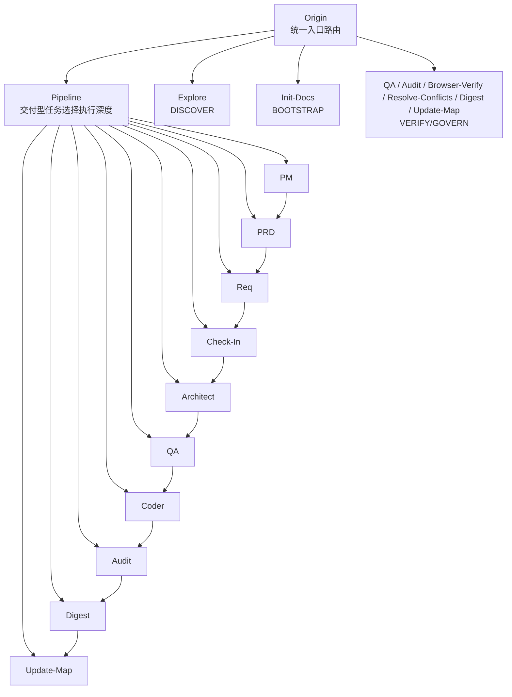
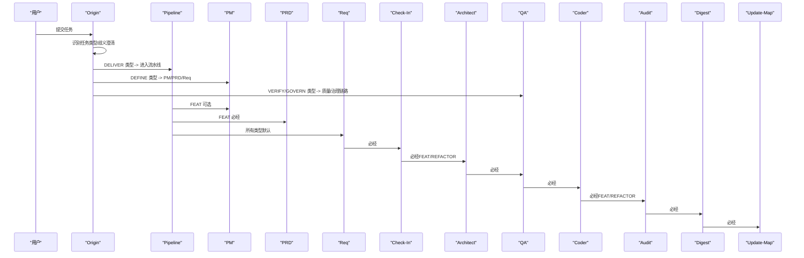
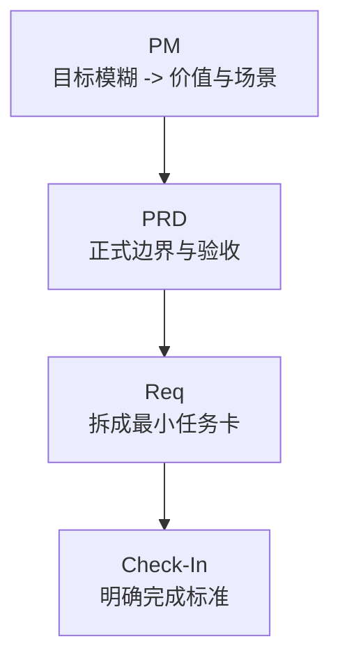
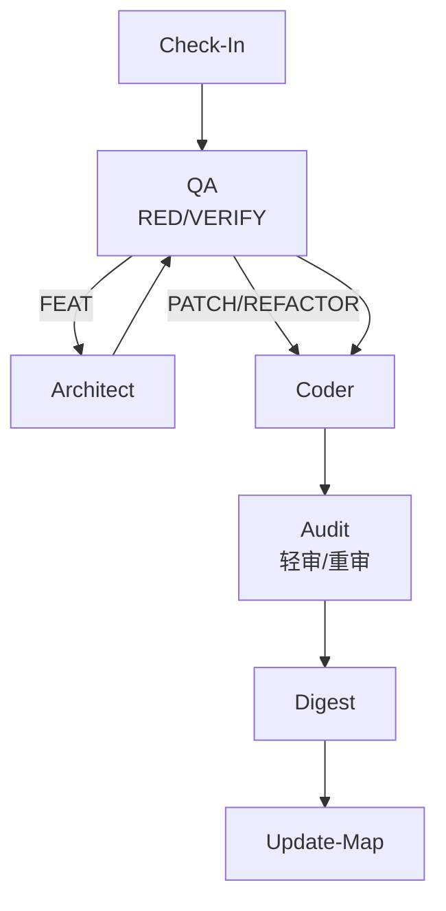
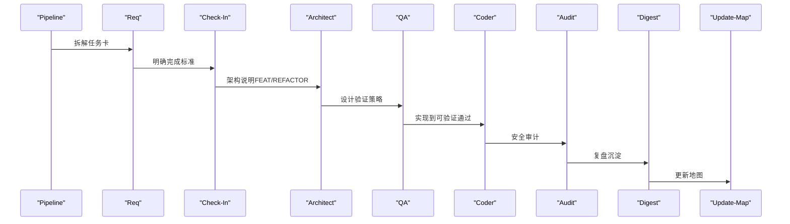
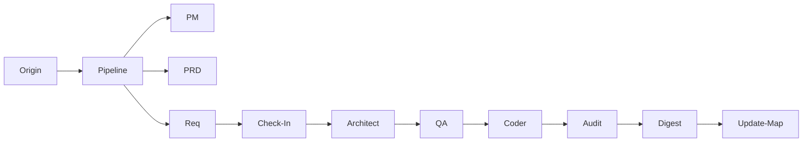

# 核心技能详解

<cite>
**本文引用的文件**
- [技能系统总览 SKILL.md](file://skills/web3-ai-agent/SKILL.md)
- [主入口 Origin SKILL.md](file://skills/web3-ai-agent/origin/SKILL.md)
- [架构设计 Architect SKILL.md](file://skills/web3-ai-agent/architect/SKILL.md)
- [安全审计 Audit SKILL.md](file://skills/web3-ai-agent/audit/SKILL.md)
- [学习门禁 Check-In SKILL.md](file://skills/web3-ai-agent/check-in/SKILL.md)
- [实现编码 Coder SKILL.md](file://skills/web3-ai-agent/coder/SKILL.md)
- [流水线 Pipeline SKILL.md](file://skills/web3-ai-agent/pipeline/SKILL.md)
- [产品需求 PM SKILL.md](file://skills/web3-ai-agent/pm/SKILL.md)
- [产品需求 PRD SKILL.md](file://skills/web3-ai-agent/prd/SKILL.md)
- [需求拆解 Req SKILL.md](file://skills/web3-ai-agent/req/SKILL.md)
- [质量保证 QA SKILL.md](file://skills/web3-ai-agent/qa/SKILL.md)
- [复盘沉淀 Digest SKILL.md](file://skills/web3-ai-agent/digest/SKILL.md)
- [初始化文档 Init-Docs SKILL.md](file://skills/web3-ai-agent/init-docs/SKILL.md)
- [地图更新 Update-Map SKILL.md](file://skills/web3-ai-agent/update-map/SKILL.md)
</cite>

## 目录
1. [简介](#简介)
2. [项目结构](#项目结构)
3. [核心组件](#核心组件)
4. [架构总览](#架构总览)
5. [详细组件分析](#详细组件分析)
6. [依赖分析](#依赖分析)
7. [性能考虑](#性能考虑)
8. [故障排查指南](#故障排查指南)
9. [结论](#结论)
10. [附录](#附录)

## 简介
本文件面向 AI-Agent 技能系统的核心技能模块，系统性阐述各技能的职责、实现机制与协作流程。重点覆盖：
- 主入口技能（Origin）的任务识别与路由
- 文档驱动技能组（PM、PRD、Req）的产品需求管理
- 架构设计技能（Architect、QA）的技术设计与质量保证
- 实现技能（Coder、Audit）的编码与安全审计
- 学习门禁技能（Check-In）与流水线技能（Pipeline）的质量控制
并提供可操作的使用方法、配置要点、最佳实践、常见问题与性能优化建议。

## 项目结构
技能系统以“主入口路由 + 分层流水线 + 质量门禁”的方式组织，形成可扩展、可裁剪的交付闭环。整体结构如下图所示：

图表来源
- [技能系统总览 SKILL.md:1-224](file://skills/web3-ai-agent/SKILL.md#L1-L224)
- [主入口 Origin SKILL.md:1-125](file://skills/web3-ai-agent/origin/SKILL.md#L1-L125)
- [流水线 Pipeline SKILL.md:1-89](file://skills/web3-ai-agent/pipeline/SKILL.md#L1-L89)

章节来源
- [技能系统总览 SKILL.md:1-224](file://skills/web3-ai-agent/SKILL.md#L1-L224)
- [主入口 Origin SKILL.md:1-125](file://skills/web3-ai-agent/origin/SKILL.md#L1-L125)
- [流水线 Pipeline SKILL.md:1-89](file://skills/web3-ai-agent/pipeline/SKILL.md#L1-L89)

## 核心组件
本节聚焦六大类核心技能及其职责边界与协作模式：
- 主入口与路由：Origin
- 文档驱动需求链：PM → PRD → Req
- 质量门禁与架构：Check-In → QA → Architect → Coder → Audit
- 交付与复盘：Pipeline → Digest → Update-Map
- 初始化与治理：Init-Docs、Browser-Verify、Resolve-Conflicts

章节来源
- [主入口 Origin SKILL.md:1-125](file://skills/web3-ai-agent/origin/SKILL.md#L1-L125)
- [学习门禁 Check-In SKILL.md:1-56](file://skills/web3-ai-agent/check-in/SKILL.md#L1-L56)
- [质量保证 QA SKILL.md:1-73](file://skills/web3-ai-agent/qa/SKILL.md#L1-L73)
- [架构设计 Architect SKILL.md:1-53](file://skills/web3-ai-agent/architect/SKILL.md#L1-L53)
- [实现编码 Coder SKILL.md:1-72](file://skills/web3-ai-agent/coder/SKILL.md#L1-L72)
- [安全审计 Audit SKILL.md:1-88](file://skills/web3-ai-agent/audit/SKILL.md#L1-L88)
- [流水线 Pipeline SKILL.md:1-89](file://skills/web3-ai-agent/pipeline/SKILL.md#L1-L89)
- [产品需求 PM SKILL.md:1-53](file://skills/web3-ai-agent/pm/SKILL.md#L1-L53)
- [产品需求 PRD SKILL.md:1-54](file://skills/web3-ai-agent/prd/SKILL.md#L1-L54)
- [需求拆解 Req SKILL.md:1-57](file://skills/web3-ai-agent/req/SKILL.md#L1-L57)
- [复盘沉淀 Digest SKILL.md:1-50](file://skills/web3-ai-agent/digest/SKILL.md#L1-L50)
- [初始化文档 Init-Docs SKILL.md:1-41](file://skills/web3-ai-agent/init-docs/SKILL.md#L1-L41)
- [地图更新 Update-Map SKILL.md:1-47](file://skills/web3-ai-agent/update-map/SKILL.md#L1-L47)

## 架构总览
下图展示从“自然语言任务”到“可交付成果”的端到端流程，强调 Origin 的任务识别与路由、Pipeline 的执行深度选择、以及质量门禁的强制约束。

图表来源
- [技能系统总览 SKILL.md:92-158](file://skills/web3-ai-agent/SKILL.md#L92-L158)
- [主入口 Origin SKILL.md:41-109](file://skills/web3-ai-agent/origin/SKILL.md#L41-L109)
- [流水线 Pipeline SKILL.md:29-58](file://skills/web3-ai-agent/pipeline/SKILL.md#L29-L58)
- [学习门禁 Check-In SKILL.md:12-17](file://skills/web3-ai-agent/check-in/SKILL.md#L12-L17)
- [质量保证 QA SKILL.md:12-28](file://skills/web3-ai-agent/qa/SKILL.md#L12-L28)
- [实现编码 Coder SKILL.md:18-37](file://skills/web3-ai-agent/coder/SKILL.md#L18-L37)
- [安全审计 Audit SKILL.md:12-32](file://skills/web3-ai-agent/audit/SKILL.md#L12-L32)
- [复盘沉淀 Digest SKILL.md:8-10](file://skills/web3-ai-agent/digest/SKILL.md#L8-L10)
- [地图更新 Update-Map SKILL.md:8-10](file://skills/web3-ai-agent/update-map/SKILL.md#L8-L10)

## 详细组件分析

### 主入口技能 Origin：任务识别与路由
- 职责
  - 对任意外部请求进行任务类型识别，避免跳过任务判断与直接进入实施链路
  - 基于任务类型决定下一跳：探索、初始化、需求澄清、流水线或质量治理
- 关键规则
  - 任务类型：DISCOVER、BOOTSTRAP、DEFINE、DELIVER-FEAT、DELIVER-PATCH、DELIVER-REFACTOR、VERIFY/GOVERN
  - 交付型任务才进入 pipeline；实施前必须 check-in；自然语言也按规则解释
- 输出与边界
  - 输出简洁的任务判断与下一跳，不代写后续产物
  - 不跳过任务分类、不直接写需求正文/代码/架构/实现

章节来源
- [主入口 Origin SKILL.md:12-28](file://skills/web3-ai-agent/origin/SKILL.md#L12-L28)
- [主入口 Origin SKILL.md:41-49](file://skills/web3-ai-agent/origin/SKILL.md#L41-L49)
- [主入口 Origin SKILL.md:111-125](file://skills/web3-ai-agent/origin/SKILL.md#L111-L125)
- [技能系统总览 SKILL.md:21-72](file://skills/web3-ai-agent/SKILL.md#L21-L72)

### 文档驱动技能组：PM → PRD → Req
- PM（产品管理）
  - 适用：目标模糊、价值不清、需先判断值不值得做
  - 输出：目标用户、核心痛点、价值主张、MVP 建议范围、下一跳
- PRD（产品需求文档）
  - 适用：FEAT 正式边界定义、重构影响产品边界、需求错误导致的缺陷
  - 输出：背景、目标、用户场景、范围、非目标、风险边界、验收标准
- Req（需求拆解）
  - 适用：把 PRD/缺陷/重构目标拆成最小可执行任务卡
  - 输出：来源、目标、影响范围、依赖关系、验收标准、下一跳

图表来源
- [产品需求 PM SKILL.md:8-38](file://skills/web3-ai-agent/pm/SKILL.md#L8-L38)
- [产品需求 PRD SKILL.md:8-38](file://skills/web3-ai-agent/prd/SKILL.md#L8-L38)
- [需求拆解 Req SKILL.md:8-41](file://skills/web3-ai-agent/req/SKILL.md#L8-L41)

章节来源
- [产品需求 PM SKILL.md:1-53](file://skills/web3-ai-agent/pm/SKILL.md#L1-L53)
- [产品需求 PRD SKILL.md:1-54](file://skills/web3-ai-agent/prd/SKILL.md#L1-L54)
- [需求拆解 Req SKILL.md:1-57](file://skills/web3-ai-agent/req/SKILL.md#L1-L57)

### 质量门禁与架构：Check-In → QA → Architect → Coder → Audit
- Check-In（学习门禁）
  - 强制适用：DELIVER-FEAT/PATCH/REFACTOR，以及准备进入实施的 DEFINE
  - 输出：本阶段要解决的问题、必须掌握的上下文、采用的方案、不做什么、产物、完成标准、进入下一阶段的 skill
  - 硬规则：无 check-in 不进入 architect/qa/coder；必须明确“不做什么”和完成标准
- QA（质量保证）
  - 两种模式：RED（FEAT/TDD 型）与 VERIFY（PATCH/REFACTOR/非 TDD 型）
  - RED：先写测试/验证清单，先执行 RED，最多运行两次；RED 验证只需证明“当前未通过”
  - VERIFY：验证修复与回归风险
  - 红绿衔接：FEAT 先 RED 后 GREEN；Coder 负责把 RED 全部变为 GREEN
- Architect（架构设计）
  - 适用：接口/状态流/模块边界变化或结构性重构
  - 输出：主题架构说明（目标、模块边界、数据流、消息流、接口契约、错误处理、风险点）
  - 流程：确定影响模块 → 定义边界与契约 → 补主路径与异常路径
- Coder（实现编码）
  - 目标：在边界已清楚前提下把任务实现到可验证通过
  - 自愈循环：最多 10 轮，每轮根据 check-in/architect/qa 实施代码、运行验证、根因分析、修复；超限输出 STUCK 报告并请求人工介入
  - 红绿衔接：FEAT 中 QA 先执行 RED，Coder 把 RED 全部变为 GREEN
- Audit（安全审计）
  - 两种模式：轻审（PATCH/低风险 REFACTOR）与重审（FEAT/高风险 PATCH/REFACTOR/Web3 高风险）
  - 评分维度：需求一致性、结构/契约一致性、安全与风险边界、代码质量、回归风险控制、文档与状态收尾、场景特定治理项
  - 阈值：>=80 通过；60-79 软拒绝回 coder；<60 直接拒绝并终止
  - 一票否决：严重安全问题、明显越界修改、关键不变量被破坏、高风险场景缺少风险提示或失败降级

图表来源
- [学习门禁 Check-In SKILL.md:12-17](file://skills/web3-ai-agent/check-in/SKILL.md#L12-L17)
- [质量保证 QA SKILL.md:12-28](file://skills/web3-ai-agent/qa/SKILL.md#L12-L28)
- [质量保证 QA SKILL.md:51-56](file://skills/web3-ai-agent/qa/SKILL.md#L51-L56)
- [架构设计 Architect SKILL.md:8-13](file://skills/web3-ai-agent/architect/SKILL.md#L8-L13)
- [实现编码 Coder SKILL.md:18-37](file://skills/web3-ai-agent/coder/SKILL.md#L18-L37)
- [安全审计 Audit SKILL.md:12-32](file://skills/web3-ai-agent/audit/SKILL.md#L12-L32)
- [安全审计 Audit SKILL.md:52-68](file://skills/web3-ai-agent/audit/SKILL.md#L52-L68)

章节来源
- [学习门禁 Check-In SKILL.md:1-56](file://skills/web3-ai-agent/check-in/SKILL.md#L1-L56)
- [质量保证 QA SKILL.md:1-73](file://skills/web3-ai-agent/qa/SKILL.md#L1-L73)
- [架构设计 Architect SKILL.md:1-53](file://skills/web3-ai-agent/architect/SKILL.md#L1-L53)
- [实现编码 Coder SKILL.md:1-72](file://skills/web3-ai-agent/coder/SKILL.md#L1-L72)
- [安全审计 Audit SKILL.md:1-88](file://skills/web3-ai-agent/audit/SKILL.md#L1-L88)

### 交付与复盘：Pipeline → Digest → Update-Map
- Pipeline（流水线）
  - 作用：为交付型任务选择合适执行深度，而非默认跑完整链路
  - 路由规则：
    - FEAT：pm(按需) → prd → req → check-in → architect → qa → coder → audit → digest → update-map
    - PATCH：req → check-in → coder → qa → digest → update-map（默认不走 pm/prd）
    - REFACTOR：req → check-in → architect → qa → coder → audit → digest → update-map（默认不走 pm）
  - 硬规则：无 check-in 不允许进入 architect/qa/coder；小任务优先短链路
- Digest（复盘沉淀）
  - 作用：记录完成项、问题、经验与后续建议，而非仅记录“改了哪些文件”
  - 输出：本轮完成了什么、遇到了什么问题、学到了什么、仍未解决的问题、下一步建议
- Update-Map（地图更新）
  - 作用：维护项目状态、索引与下一步入口
  - 输出：当前状态、影响模块/能力、新增文档、需要关注的后续入口

图表来源
- [流水线 Pipeline SKILL.md:29-58](file://skills/web3-ai-agent/pipeline/SKILL.md#L29-L58)
- [复盘沉淀 Digest SKILL.md:8-10](file://skills/web3-ai-agent/digest/SKILL.md#L8-L10)
- [地图更新 Update-Map SKILL.md:8-10](file://skills/web3-ai-agent/update-map/SKILL.md#L8-L10)

章节来源
- [流水线 Pipeline SKILL.md:1-89](file://skills/web3-ai-agent/pipeline/SKILL.md#L1-L89)
- [复盘沉淀 Digest SKILL.md:1-50](file://skills/web3-ai-agent/digest/SKILL.md#L1-L50)
- [地图更新 Update-Map SKILL.md:1-47](file://skills/web3-ai-agent/update-map/SKILL.md#L1-L47)

### 初始化与治理：Init-Docs、Browser-Verify、Resolve-Conflicts
- Init-Docs（初始化文档）
  - 适用：新项目首次建文档、历史文档迁移、重建基础索引
  - 输出：初始地图、初始索引、基础结构化文档
  - 规则：这是 BOOTSTRAP 专用 skill，完成后应交由正常 V3 链路继续演化
- Browser-Verify（浏览器验收）
  - 适用：前端/集成场景的用户界面与交互验证
- Resolve-Conflicts（文档冲突处理）
  - 适用：多轮迭代后文档版本冲突的梳理与合并

章节来源
- [初始化文档 Init-Docs SKILL.md:1-41](file://skills/web3-ai-agent/init-docs/SKILL.md#L1-L41)
- [技能系统总览 SKILL.md:154-158](file://skills/web3-ai-agent/SKILL.md#L154-L158)

## 依赖分析
- 强制依赖
  - DELIVER 类型任务必须经 Pipeline
  - 实施前必须经 Check-In
  - FEAT/REFACTOR 必须经 Architect
  - 所有交付型任务最终经 Audit → Digest → Update-Map
- 可选依赖
  - PM/PRD 可按需插入（FEAT 默认 PRD+REQ，PATCH/REFACTOR 默认不走 PM）
  - Browser-Verify、Resolve-Conflicts、Audit 轻/重审可按风险级别插入
- 耦合与内聚
  - 各技能职责清晰、边界明确，通过“任务卡/检查点/完成标准”串联，耦合度低、内聚度高
  - Origin 作为唯一入口，确保路由一致性与可审计性

图表来源
- [技能系统总览 SKILL.md:92-158](file://skills/web3-ai-agent/SKILL.md#L92-L158)
- [主入口 Origin SKILL.md:41-109](file://skills/web3-ai-agent/origin/SKILL.md#L41-L109)
- [流水线 Pipeline SKILL.md:29-58](file://skills/web3-ai-agent/pipeline/SKILL.md#L29-L58)

章节来源
- [技能系统总览 SKILL.md:160-167](file://skills/web3-ai-agent/SKILL.md#L160-L167)
- [流水线 Pipeline SKILL.md:82-89](file://skills/web3-ai-agent/pipeline/SKILL.md#L82-L89)

## 性能考虑
- 选择合适执行深度：小任务优先短链路，避免“为完整而完整”
- 精准验证：FEAT 先 RED 再 GREEN，减少无效重跑；PATCH/REFACTOR 保留轻量回归检查
- 自愈循环上限：Coder 最多 10 轮，超限及时人工介入，避免资源浪费
- 轻/重审策略：根据风险等级选择审计深度，平衡质量与效率
- 文档与状态同步：Digest 与 Update-Map 分工明确，避免重复劳动与信息滞后

## 故障排查指南
- 任务未进入流水线
  - 检查 Origin 是否正确识别任务类型；若存在歧义，先澄清再路由
  - 章节来源
    - [主入口 Origin SKILL.md:118-125](file://skills/web3-ai-agent/origin/SKILL.md#L118-L125)
- 未执行 Check-In 直接进入 Architect/QA/Coder
  - 检查是否为 DELIVER/DEFINE 准备实施的任务；如是，必须先 Check-In
  - 章节来源
    - [学习门禁 Check-In SKILL.md:51-56](file://skills/web3-ai-agent/check-in/SKILL.md#L51-L56)
    - [技能系统总览 SKILL.md:162-163](file://skills/web3-ai-agent/SKILL.md#L162-L163)
- Coder 卡住超过 10 轮
  - 查看 STUCK 报告中的卡住原因、已尝试方案、当前阻塞点与建议方向
  - 章节来源
    - [实现编码 Coder SKILL.md:39-48](file://skills/web3-ai-agent/coder/SKILL.md#L39-L48)
- Audit 评分低于阈值
  - 轻审：60-79 软拒绝，回退 Coder 修正
  - 重审：<60 直接拒绝，终止并人工介入或重定方案
  - 章节来源
    - [安全审计 Audit SKILL.md:64-68](file://skills/web3-ai-agent/audit/SKILL.md#L64-L68)
- QA 红灯与需求矛盾
  - 停止并报告，不私自改需求
  - 章节来源
    - [实现编码 Coder SKILL.md:51-53](file://skills/web3-ai-agent/coder/SKILL.md#L51-L53)
- 文档冲突或地图陈旧
  - 使用 Resolve-Conflicts 与 Update-Map 保持上下文一致
  - 章节来源
    - [技能系统总览 SKILL.md:154-158](file://skills/web3-ai-agent/SKILL.md#L154-L158)
    - [地图更新 Update-Map SKILL.md:39-46](file://skills/web3-ai-agent/update-map/SKILL.md#L39-L46)

## 结论
该技能系统通过“主入口路由 + 分层需求 + 质量门禁 + 可裁剪流水线”的设计，实现了从任务识别到交付复盘的闭环。Origin 保证路由一致性，PM/PRD/Req 明确边界与验收，Check-In/QA/Audit 构建质量防线，Pipeline/Digest/Update-Map 确保持续演进。遵循硬规则与最佳实践，可在保证质量的同时提升交付效率。

## 附录
- 推荐斜杠命令表（便于降低路由歧义）
  - /origin、/pipeline feat、/pipeline patch、/pipeline refactor、/pm、/prd、/req、/check-in、/architect、/qa、/coder、/audit、/digest、/update-map、/explore、/init-docs、/browser-verify、/resolve-doc-conflicts
  - 章节来源
    - [技能系统总览 SKILL.md:202-223](file://skills/web3-ai-agent/SKILL.md#L202-L223)