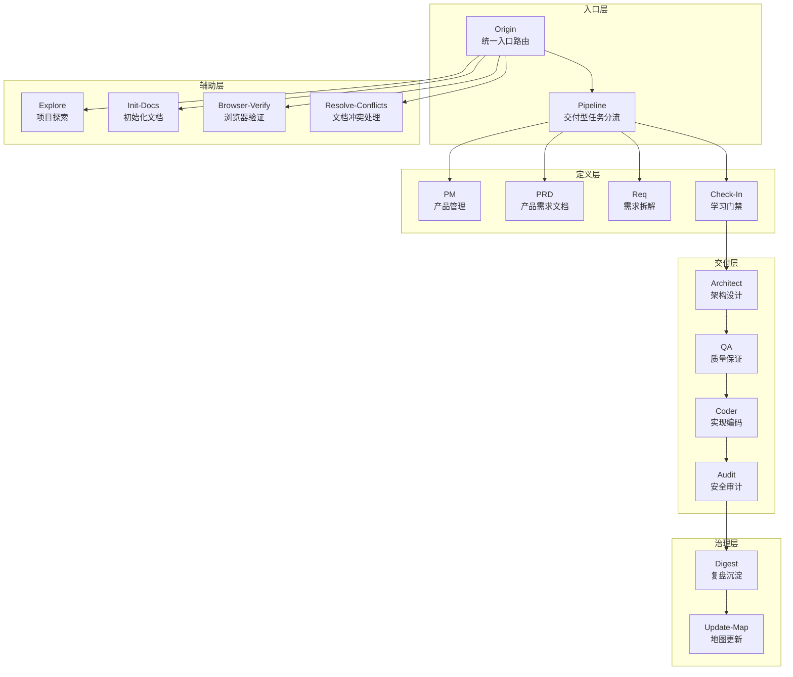
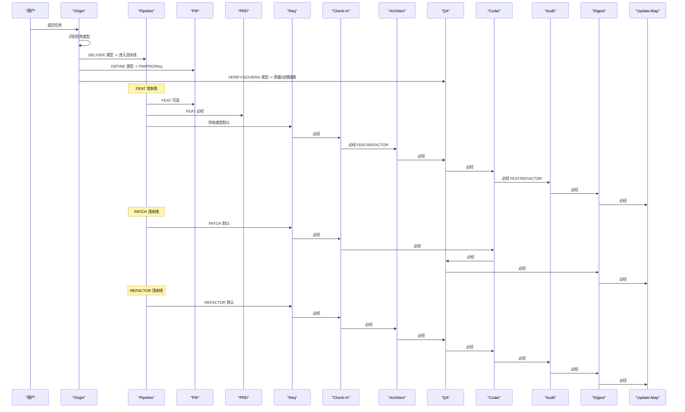
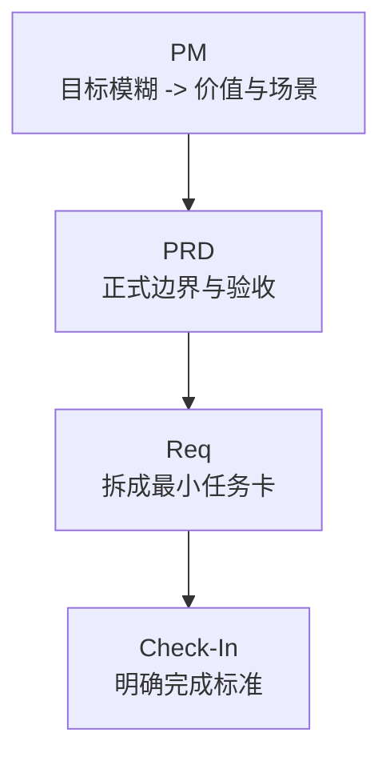
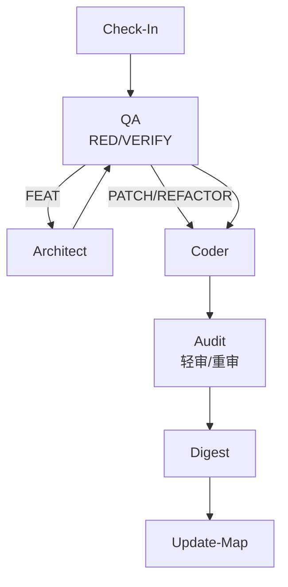
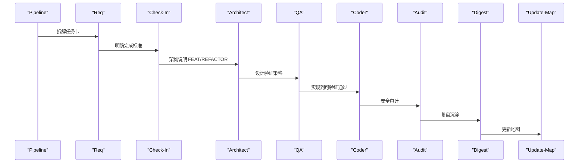
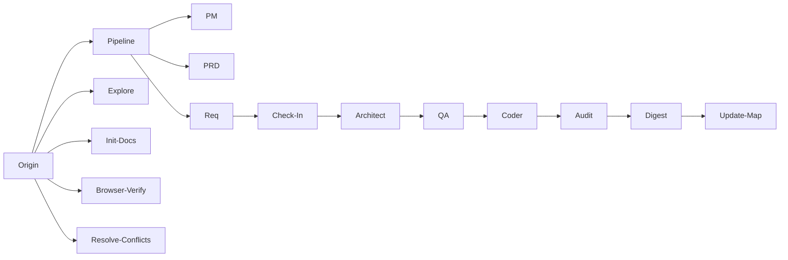

# 核心技能详解

<cite>
**本文引用的文件**
- [技能系统设计 V3 SKILL-SYSTEM-DESIGN-V3.md](file://skills/x-ray/SKILL-SYSTEM-DESIGN-V3.md)
- [技能地图 V3 MAP-V3.md](file://skills/x-ray/MAP-V3.md)
- [斜杠命令 COMMANDS.md](file://skills/x-ray/COMMANDS.md)
- [主入口 Origin SKILL.md](file://skills/x-ray/origin/SKILL.md)
- [架构设计 Architect SKILL.md](file://skills/x-ray/architect/SKILL.md)
- [安全审计 Audit SKILL.md](file://skills/x-ray/audit/SKILL.md)
- [学习门禁 Check-In SKILL.md](file://skills/x-ray/check-in/SKILL.md)
- [实现编码 Coder SKILL.md](file://skills/x-ray/coder/SKILL.md)
- [交付流水线 Pipeline SKILL.md](file://skills/x-ray/pipeline/SKILL.md)
- [产品需求 PM SKILL.md](file://skills/x-ray/pm/SKILL.md)
- [产品需求 PRD SKILL.md](file://skills/x-ray/prd/SKILL.md)
- [需求拆解 Req SKILL.md](file://skills/x-ray/req/SKILL.md)
- [质量保证 QA SKILL.md](file://skills/x-ray/qa/SKILL.md)
- [复盘沉淀 Digest SKILL.md](file://skills/x-ray/digest/SKILL.md)
- [初始化文档 Init-Docs SKILL.md](file://skills/x-ray/init-docs/SKILL.md)
</cite>

## 更新摘要
**所做更改**
- 更新技能系统为完整的 X-Ray 技能体系，包含 16 个核心技能模块
- 重新设计任务分类体系，从 3 类扩展为 7 类任务类型
- 重构执行骨架，从线性流水线改为分层路由架构
- 新增学习门禁技能，取代原有的学习门禁概念
- 完善质量门禁机制，支持轻审和重审两种模式
- 优化交付流水线，提供 FEAT、PATCH、REFACTOR 三种执行深度

## 目录
1. [简介](#简介)
2. [项目结构](#项目结构)
3. [核心组件](#核心组件)
4. [架构总览](#架构总览)
5. [详细组件分析](#详细组件分析)
6. [依赖分析](#依赖分析)
7. [性能考虑](#性能考虑)
8. [故障排查指南](#故障排查指南)
9. [结论](#结论)
10. [附录](#附录)

## 简介
本文档详细介绍 AI-Agent 技能系统的核心技能模块，该系统已扩展为完整的 X-Ray 技能体系。系统采用"主入口路由 + 分层流水线 + 质量门禁"的设计理念，通过 16 个核心技能模块实现从任务识别到交付复盘的完整闭环。

**更新** 系统从传统的 3 类任务扩展为 7 类任务类型，包括 DISCOVER、BOOTSTRAP、DEFINE、DELIVER-FEAT、DELIVER-PATCH、DELIVER-REFACTOR、VERIFY/GOVERN，实现了更精细的任务分流和执行控制。

## 项目结构
X-Ray 技能体系采用五层架构设计，将技能模块按照功能职责进行层次化组织：

**图表来源**
- [技能系统设计 V3 SKILL-SYSTEM-DESIGN-V3.md:164-220](file://skills/x-ray/SKILL-SYSTEM-DESIGN-V3.md#L164-L220)
- [技能地图 V3 MAP-V3.md:131-211](file://skills/x-ray/MAP-V3.md#L131-L211)

## 核心组件
X-Ray 技能体系包含 16 个核心技能模块，按照功能职责分为五个层次：

### 入口层技能
- **Origin**：统一入口路由，负责任务类型识别和初步分流
- **Pipeline**：交付型任务的执行深度选择器

### 定义层技能
- **PM**：产品管理，处理目标模糊和价值判断
- **PRD**：产品需求文档，定义正式边界和验收标准
- **Req**：需求拆解，将需求拆分为最小可执行任务卡
- **Check-In**：学习门禁，实施前的对齐点和门禁

### 交付层技能
- **Architect**：架构设计，处理结构变化和接口契约
- **QA**：质量保证，定义验证策略和执行验证
- **Coder**：实现编码，将设计转化为可验证的代码
- **Audit**：安全审计，风险评估和质量评分

### 治理层技能
- **Digest**：复盘沉淀，记录经验教训和后续建议
- **Update-Map**：地图更新，维护项目状态和索引

### 辅助层技能
- **Explore**：项目探索，只读导航和现状了解
- **Init-Docs**：初始化文档，新项目文档体系建设
- **Browser-Verify**：浏览器验收，前端和可视化验证
- **Resolve-Conflicts**：文档冲突处理，多轮迭代后的冲突解决

**章节来源**
- [技能系统设计 V3 SKILL-SYSTEM-DESIGN-V3.md:164-220](file://skills/x-ray/SKILL-SYSTEM-DESIGN-V3.md#L164-L220)
- [技能地图 V3 MAP-V3.md:131-211](file://skills/x-ray/MAP-V3.md#L131-L211)

## 架构总览
X-Ray 技能体系采用分层路由架构，通过七种任务类型实现智能分流：

**图表来源**
- [技能系统设计 V3 SKILL-SYSTEM-DESIGN-V3.md:265-393](file://skills/x-ray/SKILL-SYSTEM-DESIGN-V3.md#L265-L393)
- [技能地图 V3 MAP-V3.md:147-211](file://skills/x-ray/MAP-V3.md#L147-L211)

## 详细组件分析

### 主入口技能 Origin：任务识别与路由
**职责**
- 对任意外部请求进行七种任务类型的识别
- 基于任务类型决定下一跳路由
- 避免跳过任务判断和直接进入实施链路

**任务类型分类**
- **DISCOVER**：探索项目现状，只读导航
- **BOOTSTRAP**：新项目初始化和文档重建
- **DEFINE**：目标模糊和需求澄清
- **DELIVER-FEAT**：新功能开发和交付
- **DELIVER-PATCH**：Bug 修复和回归修正
- **DELIVER-REFACTOR**：重构和性能优化
- **VERIFY/GOVERN**：质量验证和治理

**路由规则**
- 纯探索、定位、盘点模块 → Explore
- 新项目初始化、文档初始化 → Init-Docs → Update-Map
- 目标、范围、验收标准不清 → PM/PRD/Req → Check-In
- 新功能、新模块、新工具接入 → Pipeline(FEAT)
- Bug 修复、回归修复 → Pipeline(PATCH)
- 结构治理、模块拆分 → Pipeline(REFACTOR)
- 纯验证、质量审查、文档冲突处理 → QA/Audit/Browser-Verify/Resolve-Conflicts/Digest/Update-Map

**章节来源**
- [主入口 Origin SKILL.md:12-28](file://skills/x-ray/origin/SKILL.md#L12-L28)
- [主入口 Origin SKILL.md:41-109](file://skills/x-ray/origin/SKILL.md#L41-L109)
- [技能系统设计 V3 SKILL-SYSTEM-DESIGN-V3.md:45-161](file://skills/x-ray/SKILL-SYSTEM-DESIGN-V3.md#L45-L161)

### 文档驱动技能组：PM → PRD → Req
**PM（产品管理）**
- **适用场景**：目标模糊、价值不清、需要判断是否值得做
- **核心输出**：目标用户、核心痛点、价值主张、MVP 建议范围、下一跳
- **关键流程**：明确用户 → 明确问题 → 明确价值 → 给出 MVP 建议

**PRD（产品需求文档）**
- **适用场景**：FEAT 正式边界定义、重构影响产品边界、需求错误导致的缺陷
- **核心输出**：背景、目标、用户场景、范围、非目标、风险边界、验收标准
- **关键流程**：明确做什么 → 明确不做什么 → 明确验收标准 → 明确风险边界

**Req（需求拆解）**
- **适用场景**：把 PRD/缺陷/重构目标拆成最小可执行任务卡
- **核心输出**：来源、目标、影响范围、依赖关系、验收标准、下一跳
- **关键流程**：确定任务对象 → 拆成最小交付单元 → 写清影响范围 → 写清验收条件

**图表来源**
- [产品需求 PM SKILL.md:8-38](file://skills/x-ray/pm/SKILL.md#L8-L38)
- [产品需求 PRD SKILL.md:8-38](file://skills/x-ray/prd/SKILL.md#L8-L38)
- [需求拆解 Req SKILL.md:8-41](file://skills/x-ray/req/SKILL.md#L8-L41)

**章节来源**
- [产品需求 PM SKILL.md:1-53](file://skills/x-ray/pm/SKILL.md#L1-L53)
- [产品需求 PRD SKILL.md:1-54](file://skills/x-ray/prd/SKILL.md#L1-L54)
- [需求拆解 Req SKILL.md:1-57](file://skills/x-ray/req/SKILL.md#L1-L57)

### 质量门禁与架构：Check-In → QA → Architect → Coder → Audit
**Check-In（学习门禁）**
- **强制适用**：DELIVER-FEAT/PATCH/REFACTOR，以及准备进入实施的 DEFINE
- **核心输出**：本阶段要解决的问题、必须掌握的上下文、采用的方案、不做什么、产物、完成标准、进入下一阶段的 skill
- **硬规则**：无 check-in 不进入 architect/qa/coder；必须明确"不做什么"和完成标准

**QA（质量保证）**
- **两种模式**：RED（FEAT/TDD 型）与 VERIFY（PATCH/REFACTOR/非 TDD 型）
- **RED 模式**：先写测试/验证清单，先执行 RED，最多运行两次；RED 验证只需证明"当前未通过"
- **VERIFY 模式**：验证修复与回归风险
- **红绿衔接**：FEAT 先 RED 后 GREEN；Coder 负责把 RED 全部变为 GREEN

**Architect（架构设计）**
- **适用场景**：接口/状态流/模块边界变化或结构性重构
- **核心输出**：主题架构说明（目标、模块边界、数据流、消息流、接口契约、错误处理、风险点）
- **关键流程**：确定影响模块 → 定义边界与契约 → 补主路径与异常路径

**Coder（实现编码）**
- **核心目标**：在边界已清楚前提下把任务实现到可验证通过
- **自愈循环**：最多 10 轮，每轮根据 check-in/architect/qa 实施代码、运行验证、根因分析、修复；超限输出 STUCK 报告并请求人工介入
- **红绿衔接**：FEAT 中 QA 先执行 RED，Coder 把 RED 全部变为 GREEN

**Audit（安全审计）**
- **两种模式**：轻审（PATCH/低风险 REFACTOR）与重审（FEAT/高风险 PATCH/REFACTOR/Web3 高风险）
- **评分维度**：需求一致性、结构/契约一致性、安全与风险边界、代码质量、回归风险控制、文档与状态收尾、场景特定治理项
- **评分阈值**：>=80 通过；60-79 软拒绝回 coder；<60 直接拒绝并终止
- **一票否决**：严重安全问题、明显越界修改、关键不变量被破坏、高风险场景缺少风险提示或失败降级

**图表来源**
- [学习门禁 Check-In SKILL.md:12-17](file://skills/x-ray/check-in/SKILL.md#L12-L17)
- [质量保证 QA SKILL.md:12-28](file://skills/x-ray/qa/SKILL.md#L12-L28)
- [质量保证 QA SKILL.md:51-56](file://skills/x-ray/qa/SKILL.md#L51-L56)
- [架构设计 Architect SKILL.md:8-13](file://skills/x-ray/architect/SKILL.md#L8-L13)
- [实现编码 Coder SKILL.md:18-37](file://skills/x-ray/coder/SKILL.md#L18-L37)
- [安全审计 Audit SKILL.md:12-32](file://skills/x-ray/audit/SKILL.md#L12-L32)
- [安全审计 Audit SKILL.md:52-68](file://skills/x-ray/audit/SKILL.md#L52-L68)

**章节来源**
- [学习门禁 Check-In SKILL.md:1-56](file://skills/x-ray/check-in/SKILL.md#L1-L56)
- [质量保证 QA SKILL.md:1-73](file://skills/x-ray/qa/SKILL.md#L1-L73)
- [架构设计 Architect SKILL.md:1-53](file://skills/x-ray/architect/SKILL.md#L1-L53)
- [实现编码 Coder SKILL.md:1-72](file://skills/x-ray/coder/SKILL.md#L1-L72)
- [安全审计 Audit SKILL.md:1-88](file://skills/x-ray/audit/SKILL.md#L1-L88)

### 交付与复盘：Pipeline → Digest → Update-Map
**Pipeline（交付流水线）**
- **核心作用**：为交付型任务选择合适执行深度，而非默认跑完整链路
- **FEAT 流水线**：pm(按需) → prd → req → check-in → architect → qa → coder → audit → digest → update-map
- **PATCH 流水线**：req → check-in → coder → qa → digest → update-map（默认不走 pm/prd）
- **REFACTOR 流水线**：req → check-in → architect → qa → coder → audit → digest → update-map（默认不走 pm）
- **硬规则**：无 check-in 不允许进入 architect/qa/coder；小任务优先短链路

**Digest（复盘沉淀）**
- **核心作用**：记录完成项、问题、经验与后续建议，而非仅记录"改了哪些文件"
- **核心输出**：本轮完成了什么、遇到了什么问题、学到了什么、仍未解决的问题、下一步建议

**Update-Map（地图更新）**
- **核心作用**：维护项目状态、索引与下一步入口
- **核心输出**：当前状态、影响模块/能力、新增文档、需要关注的后续入口

**图表来源**
- [交付流水线 Pipeline SKILL.md:29-58](file://skills/x-ray/pipeline/SKILL.md#L29-L58)
- [复盘沉淀 Digest SKILL.md:8-10](file://skills/x-ray/digest/SKILL.md#L8-L10)
- [地图更新 Update-Map SKILL.md:8-10](file://skills/x-ray/update-map/SKILL.md#L8-L10)

**章节来源**
- [交付流水线 Pipeline SKILL.md:1-89](file://skills/x-ray/pipeline/SKILL.md#L1-L89)
- [复盘沉淀 Digest SKILL.md:1-50](file://skills/x-ray/digest/SKILL.md#L1-L50)
- [地图更新 Update-Map SKILL.md:1-47](file://skills/x-ray/update-map/SKILL.md#L1-L47)

### 初始化与治理：Init-Docs、Browser-Verify、Resolve-Conflicts
**Init-Docs（初始化文档）**
- **适用场景**：新项目首次建文档、历史文档迁移、重建基础索引
- **核心输出**：初始地图、初始索引、基础结构化文档
- **关键规则**：这是 BOOTSTRAP 专用 skill，完成后应交由正常 V3 链路继续演化

**Browser-Verify（浏览器验收）**
- **适用场景**：前端/集成场景的用户界面与交互验证
- **核心作用**：在真实页面环境中验证改动的有效性和视觉一致性

**Resolve-Conflicts（文档冲突处理）**
- **适用场景**：多轮迭代后文档版本冲突的梳理与合并
- **核心作用**：处理文档合并冲突，确保知识库的一致性和完整性

**章节来源**
- [初始化文档 Init-Docs SKILL.md:1-41](file://skills/x-ray/init-docs/SKILL.md#L1-L41)
- [技能系统设计 V3 SKILL-SYSTEM-DESIGN-V3.md:593-600](file://skills/x-ray/SKILL-SYSTEM-DESIGN-V3.md#L593-L600)

## 依赖分析
X-Ray 技能体系建立了严格的依赖关系和执行规则：

### 强制依赖关系
- **DELIVER 类型任务**：必须经 Pipeline 进行执行深度选择
- **实施前任务**：必须经 Check-In 完成对齐和门禁
- **FEAT/REFACTOR 任务**：必须经 Architect 进行架构设计
- **所有交付型任务**：最终必须经 Audit → Digest → Update-Map 完成质量控制和知识沉淀

### 可选依赖关系
- **PM/PRD**：可按需插入（FEAT 默认 PRD+REQ，PATCH/REFACTOR 默认不走 PM）
- **Browser-Verify**：按需插入到审计后，主要用于前端和可视化场景
- **Resolve-Conflicts**：按需插入，处理文档冲突问题

### 执行规则
- **Origin 作为唯一入口**：确保路由一致性与可审计性
- **Check-In 的强制范围**：仅对实施型任务强制，避免流程冗余
- **Audit 的轻重模式**：根据风险等级选择审计深度，平衡质量与效率

**图表来源**
- [技能系统设计 V3 SKILL-SYSTEM-DESIGN-V3.md:265-393](file://skills/x-ray/SKILL-SYSTEM-DESIGN-V3.md#L265-L393)
- [技能地图 V3 MAP-V3.md:131-211](file://skills/x-ray/MAP-V3.md#L131-L211)

**章节来源**
- [技能系统设计 V3 SKILL-SYSTEM-DESIGN-V3.md:696-719](file://skills/x-ray/SKILL-SYSTEM-DESIGN-V3.md#L696-L719)
- [技能地图 V3 MAP-V3.md:203-211](file://skills/x-ray/MAP-V3.md#L203-L211)

## 性能考虑
X-Ray 技能体系在设计时充分考虑了性能优化：

### 执行深度优化
- **智能分流**：通过七种任务类型实现精准分流，避免不必要的流程执行
- **短链路优先**：小任务优先短链路，PATCH 和 REFACTOR 默认跳过 PM/PRD
- **按需插入**：PM/PRD 可按需插入，避免默认全跑造成的资源浪费

### 验证策略优化
- **RED 模式**：FEAT 任务先 RED 后 GREEN，减少无效重跑
- **轻量验证**：PATCH/REFACTOR 保留轻量回归检查，平衡质量与效率
- **自愈循环上限**：Coder 最多 10 轮，超限及时人工介入

### 审计策略优化
- **轻重审分离**：根据风险等级选择审计深度，FEAT 默认重审，PATCH 默认轻审
- **评分阈值**：>=80 通过，60-79 软拒绝，<60 直接拒绝，避免资源浪费

### 文档管理优化
- **Digest 与 Update-Map 分工**：明确职责边界，避免重复劳动
- **地图实时更新**：维护项目状态和索引，确保上下文一致性

## 故障排查指南

### 任务路由问题
**问题**：任务未进入正确流水线
- **检查 Origin 是否正确识别任务类型**
- **确认任务类型是否为 DELIVER-FEAT/PATCH/REFACTOR**
- **查看是否存在任务分类歧义，需要先澄清再路由**

**章节来源**
- [主入口 Origin SKILL.md:118-125](file://skills/x-ray/origin/SKILL.md#L118-L125)

### Check-In 门禁问题
**问题**：未执行 Check-In 直接进入 Architect/QA/Coder
- **检查是否为 DELIVER/DEFINE 准备实施的任务**
- **确认任务类型是否需要 Check-In 强制**
- **查看 Check-In 输出是否包含完成标准和下一跳**

**章节来源**
- [学习门禁 Check-In SKILL.md:51-56](file://skills/x-ray/check-in/SKILL.md#L51-L56)
- [技能系统设计 V3 SKILL-SYSTEM-DESIGN-V3.md:246-262](file://skills/x-ray/SKILL-SYSTEM-DESIGN-V3.md#L246-L262)

### Coder 卡住问题
**问题**：Coder 卡住超过 10 轮
- **查看 STUCK 报告中的卡住原因、已尝试方案、当前阻塞点与建议方向**
- **检查 QA 的 RED 测试是否过于宽松或过于严格**
- **确认架构设计是否合理，是否存在设计缺陷**

**章节来源**
- [实现编码 Coder SKILL.md:39-48](file://skills/x-ray/coder/SKILL.md#L39-L48)

### Audit 评分问题
**问题**：Audit 评分低于阈值
- **轻审（60-79）**：软拒绝，回退 Coder 修正
- **重审（<60）**：直接拒绝，终止并人工介入或重定方案
- **检查是否存在严重安全问题、明显越界修改、关键不变量被破坏**

**章节来源**
- [安全审计 Audit SKILL.md:64-68](file://skills/x-ray/audit/SKILL.md#L64-L68)

### QA 红灯问题
**问题**：QA 红灯与需求矛盾
- **停止并报告，不私自改需求**
- **回退到 PM/PRD/Req 重新澄清需求**
- **检查需求文档是否准确反映了用户场景**

**章节来源**
- [实现编码 Coder SKILL.md:51-53](file://skills/x-ray/coder/SKILL.md#L51-L53)

### 文档冲突问题
**问题**：文档冲突或地图陈旧
- **使用 Resolve-Conflicts 与 Update-Map 保持上下文一致**
- **检查文档版本冲突的原因和影响范围**
- **确认地图更新是否及时反映项目状态变化**

**章节来源**
- [技能系统设计 V3 SKILL-SYSTEM-DESIGN-V3.md:593-600](file://skills/x-ray/SKILL-SYSTEM-DESIGN-V3.md#L593-L600)
- [地图更新 Update-Map SKILL.md:39-46](file://skills/x-ray/update-map/SKILL.md#L39-L46)

## 结论
X-Ray 技能体系通过"主入口路由 + 分层需求 + 质量门禁 + 可裁剪流水线"的创新设计，实现了从任务识别到交付复盘的完整闭环。系统从传统的 3 类任务扩展为 7 类任务类型，提供了更精细的任务分流和执行控制。

**核心优势**：
- **智能分流**：通过七种任务类型实现精准路由，避免流程冗余
- **质量保证**：建立完整的质量门禁体系，FEAT/REFACTOR 默认重审，PATCH 默认轻审
- **执行优化**：小任务优先短链路，按需插入 PM/PRD，平衡质量与效率
- **知识沉淀**：通过 Digest 和 Update-Map 确保经验传承和状态同步

遵循硬规则与最佳实践，X-Ray 技能体系能够在保证质量的同时显著提升交付效率，为 AI-Agent 的持续演进提供了强大的技能支撑。

## 附录

### 推荐斜杠命令
为便于降低路由歧义和提高使用效率，推荐以下斜杠命令：

- **/origin**：通用任务入口，适用于所有新任务
- **/pipeline feat**：新功能开发流水线
- **/pipeline patch**：Bug 修复流水线  
- **/pipeline refactor**：重构优化流水线
- **/pm**：产品管理，处理目标模糊场景
- **/prd**：产品需求文档
- **/req**：需求拆解
- **/check-in**：学习门禁，实施前对齐
- **/architect**：架构设计
- **/qa**：质量保证
- **/coder**：实现编码
- **/audit**：安全审计
- **/digest**：复盘沉淀
- **/update-map**：地图更新
- **/explore**：项目探索
- **/init-docs**：初始化文档
- **/browser-verify**：浏览器验收
- **/resolve-doc-conflicts**：文档冲突处理

**章节来源**
- [斜杠命令 COMMANDS.md:29-50](file://skills/x-ray/COMMANDS.md#L29-L50)

### 任务类型对照表
| 任务类型 | 适用场景 | 默认执行链路 | 特殊规则 |
|---------|---------|-------------|----------|
| DISCOVER | 项目探索、模块定位、现状了解 | Explore | 仅探索，不进入实施 |
| BOOTSTRAP | 新项目初始化、文档重建 | Init-Docs → Update-Map | 仅初始化，不进入实施 |
| DEFINE | 目标模糊、需求澄清 | PM/PRD/Req → Check-In | 需要明确目标后再实施 |
| DELIVER-FEAT | 新功能开发 | Pipeline(FEAT) | 必须经过 PRD+REQ+Check-In |
| DELIVER-PATCH | Bug 修复 | Pipeline(PATCH) | 默认不走 PM/PRD |
| DELIVER-REFACTOR | 重构优化 | Pipeline(REFACTOR) | 默认不走 PM |
| VERIFY/GOVERN | 质量验证、治理 | QA/Audit/Browser-Verify/Resolve-Conflicts/Digest/Update-Map | 仅验证和治理 |

**章节来源**
- [技能系统设计 V3 SKILL-SYSTEM-DESIGN-V3.md:45-161](file://skills/x-ray/SKILL-SYSTEM-DESIGN-V3.md#L45-L161)