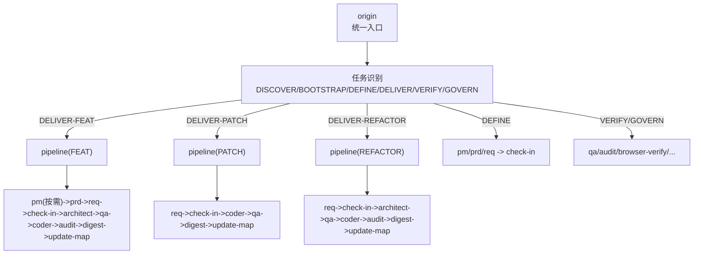
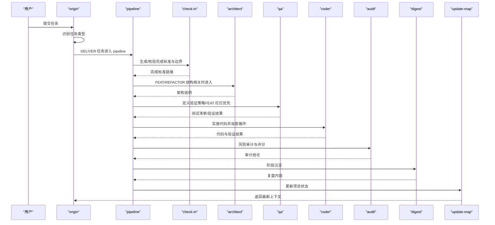
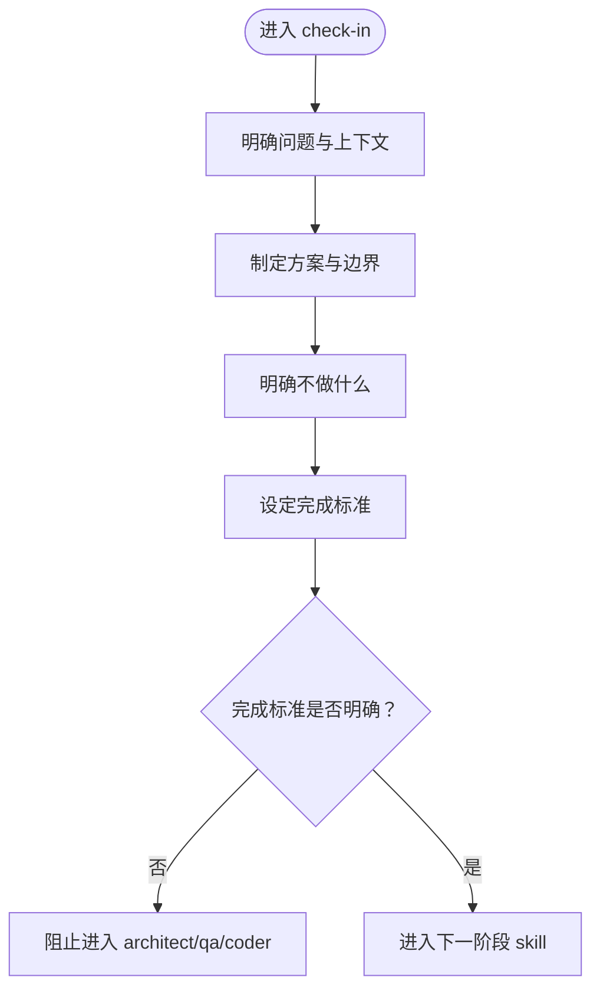
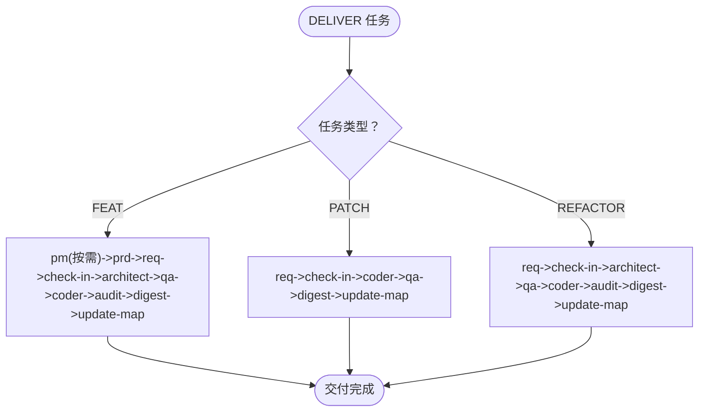
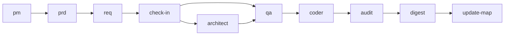

# 质量控制技能

<cite>
**本文引用的文件**
- [skills/web3-ai-agent/SKILL.md](file://skills/web3-ai-agent/SKILL.md)
- [skills/web3-ai-agent/check-in/SKILL.md](file://skills/web3-ai-agent/check-in/SKILL.md)
- [skills/web3-ai-agent/pipeline/SKILL.md](file://skills/web3-ai-agent/pipeline/SKILL.md)
- [skills/web3-ai-agent/qa/SKILL.md](file://skills/web3-ai-agent/qa/SKILL.md)
- [skills/web3-ai-agent/architect/SKILL.md](file://skills/web3-ai-agent/architect/SKILL.md)
- [skills/web3-ai-agent/coder/SKILL.md](file://skills/web3-ai-agent/coder/SKILL.md)
- [skills/web3-ai-agent/pm/SKILL.md](file://skills/web3-ai-agent/pm/SKILL.md)
- [skills/web3-ai-agent/prd/SKILL.md](file://skills/web3-ai-agent/prd/SKILL.md)
- [skills/web3-ai-agent/req/SKILL.md](file://skills/web3-ai-agent/req/SKILL.md)
- [skills/web3-ai-agent/audit/SKILL.md](file://skills/web3-ai-agent/audit/SKILL.md)
- [skills/web3-ai-agent/digest/SKILL.md](file://skills/web3-ai-agent/digest/SKILL.md)
- [skills/web3-ai-agent/update-map/SKILL.md](file://skills/web3-ai-agent/update-map/SKILL.md)
</cite>

## 目录
1. [简介](#简介)
2. [项目结构](#项目结构)
3. [核心组件](#核心组件)
4. [架构总览](#架构总览)
5. [详细组件分析](#详细组件分析)
6. [依赖分析](#依赖分析)
7. [性能考虑](#性能考虑)
8. [故障排查指南](#故障排查指南)
9. [结论](#结论)
10. [附录](#附录)

## 简介
本文件聚焦于AI-Agent质量控制体系中的两大关键技能：Check-In（学习门禁）与Pipeline（交付流水线）。前者确保任务在进入实施阶段前完成问题定义、边界确认与完成标准设定；后者在交付型任务中根据任务类型选择最优执行深度，避免不必要的长链路开销。二者共同构成项目质量控制的“前置门禁—按需执行”的双轮驱动机制，贯穿从需求到交付再到复盘的全流程。

## 项目结构
Web3 AI Agent 的技能系统以统一入口为主干，按任务类型进行路由。交付型任务统一进入 Pipeline，再依据任务类型选择必要的子技能链路；所有进入实施阶段的任务必须先通过 Check-In。

图表来源
- [skills/web3-ai-agent/SKILL.md: 21-158:21-158](file://skills/web3-ai-agent/SKILL.md#L21-L158)

章节来源
- [skills/web3-ai-agent/SKILL.md: 21-158:21-158](file://skills/web3-ai-agent/SKILL.md#L21-L158)

## 核心组件
- Check-In（学习门禁）
  - 强制适用：DELIVER-FEAT、DELIVER-PATCH、DELIVER-REFACTOR、准备进入实施的 DEFINE 任务
  - 默认不强制：DISCOVER、BOOTSTRAP、纯 VERIFY/GOVERN
  - 输出模板：问题、上下文、方案、不做什么、产物、完成标准、下一跳
  - 硬规则：无 Check-In 不进入 architect/qa/coder；必须明确“不做什么”；必须明确完成标准
- Pipeline（交付流水线）
  - 作用：为交付型任务选择最合适的执行深度，而非默认跑完整长链路
  - 路由规则：
    - FEAT：pm(按需)->prd->req->check-in->architect->qa->coder->audit->digest->update-map
    - PATCH：req->check-in->coder->qa->digest->update-map（默认不走 pm/prd）
    - REFACTOR：req->check-in->architect->qa->coder->audit->digest->update-map（默认不走 pm）
  - 判定规则：FEAT 新功能/新模块/新工具接入；PATCH bug修复/回归修复/小范围修正；REFACTOR 结构治理/模块拆分/性能或可维护性优化
  - 硬规则：无 Check-In 不允许进入 architect/qa/coder；PATCH 默认不走 pm/prd；REFACTOR 默认不走 pm；FEAT 默认必须有 prd+req；小任务优先短链路

章节来源
- [skills/web3-ai-agent/check-in/SKILL.md: 12-56:12-56](file://skills/web3-ai-agent/check-in/SKILL.md#L12-L56)
- [skills/web3-ai-agent/pipeline/SKILL.md: 8-89:8-89](file://skills/web3-ai-agent/pipeline/SKILL.md#L8-L89)

## 架构总览
质量控制技能在整体流程中的定位与协作如下：

图表来源
- [skills/web3-ai-agent/SKILL.md: 41-158:41-158](file://skills/web3-ai-agent/SKILL.md#L41-L158)
- [skills/web3-ai-agent/pipeline/SKILL.md: 29-58:29-58](file://skills/web3-ai-agent/pipeline/SKILL.md#L29-L58)
- [skills/web3-ai-agent/check-in/SKILL.md: 25-35:25-35](file://skills/web3-ai-agent/check-in/SKILL.md#L25-L35)
- [skills/web3-ai-agent/architect/SKILL.md: 15-47:15-47](file://skills/web3-ai-agent/architect/SKILL.md#L15-L47)
- [skills/web3-ai-agent/qa/SKILL.md: 39-66:39-66](file://skills/web3-ai-agent/qa/SKILL.md#L39-L66)
- [skills/web3-ai-agent/coder/SKILL.md: 12-59:12-59](file://skills/web3-ai-agent/coder/SKILL.md#L12-L59)
- [skills/web3-ai-agent/audit/SKILL.md: 34-87:34-87](file://skills/web3-ai-agent/audit/SKILL.md#L34-L87)
- [skills/web3-ai-agent/digest/SKILL.md: 12-44:12-44](file://skills/web3-ai-agent/digest/SKILL.md#L12-L44)
- [skills/web3-ai-agent/update-map/SKILL.md: 12-41:12-41](file://skills/web3-ai-agent/update-map/SKILL.md#L12-L41)

## 详细组件分析

### Check-In（学习门禁）
- 阶段前置检查机制
  - 强制前置：所有 DELIVER 任务与准备进入实施的 DEFINE 任务必须先通过 Check-In
  - 输出模板：要求明确“本阶段要解决的问题”“本阶段必须掌握的上下文”“本阶段采用的方案”“本阶段不做什么”“本阶段产物”“本阶段完成标准”“进入下一阶段前要调用的 skill”
- 问题定义与边界确认
  - 明确“不做什么”与完成标准，防止任务在边界不清时扩大 scope
  - 与 architect/qa/coder 的边界清晰划分：Check-In 不替代架构设计、质量保证与编码实现
- 完成标准设定方法
  - 完成标准必须明确，否则视为未完成
  - 完成标准应与后续 skill（如 architect/qa/coder）的输入保持一致

图表来源
- [skills/web3-ai-agent/check-in/SKILL.md: 25-56:25-56](file://skills/web3-ai-agent/check-in/SKILL.md#L25-L56)

章节来源
- [skills/web3-ai-agent/check-in/SKILL.md: 12-56:12-56](file://skills/web3-ai-agent/check-in/SKILL.md#L12-L56)

### Pipeline（交付流水线）
- 任务类型与执行深度选择
  - FEAT：默认包含 pm(按需)->prd->req->check-in->architect->qa->coder->audit->digest->update-map
  - PATCH：默认 req->check-in->coder->qa->digest->update-map，不走 pm/prd
  - REFACTOR：默认 req->check-in->architect->qa->coder->audit->digest->update-map，不走 pm
- 技能组合优化策略
  - 小任务优先短链路，避免为完整而完整
  - 按需插入：architect、audit、browser-verify、prd
- 流程控制机制
  - 严格硬规则：无 check-in 不允许进入 architect/qa/coder；不同任务类型默认路径差异明确
  - 与 QA 的衔接：FEAT 先红后绿，PATCH/REFACTOR 走轻量或回归验证

图表来源
- [skills/web3-ai-agent/pipeline/SKILL.md: 29-58:29-58](file://skills/web3-ai-agent/pipeline/SKILL.md#L29-L58)
- [skills/web3-ai-agent/SKILL.md: 160-167:160-167](file://skills/web3-ai-agent/SKILL.md#L160-L167)

章节来源
- [skills/web3-ai-agent/pipeline/SKILL.md: 8-89:8-89](file://skills/web3-ai-agent/pipeline/SKILL.md#L8-L89)
- [skills/web3-ai-agent/SKILL.md: 160-167:160-167](file://skills/web3-ai-agent/SKILL.md#L160-L167)

### QA（质量保证）
- 工作模式
  - RED 模式（FEAT 红灯优先）：先写测试或验证清单，先执行 RED，RED 只需证明“当前还没通过”，最多运行 2 次
  - VERIFY 模式（PATCH/REFACTOR 轻量验证）：验证修复与回归风险
- 红绿规则
  - FEAT 先红后绿；QA 阶段负责 RED；coder 阶段负责把 RED 全部变成 GREEN；若 RED 直接通过说明测试可能过弱，需要修正
- 与 Check-In 的衔接
  - 必须引用 check-in 的完成标准作为验证依据

章节来源
- [skills/web3-ai-agent/qa/SKILL.md: 12-73:12-73](file://skills/web3-ai-agent/qa/SKILL.md#L12-L73)

### Architect（架构）
- 适用场景：涉及接口变化、状态流变化、模块边界变化、结构性重构
- 流程：确定影响模块 -> 定义边界与契约 -> 补主路径与异常路径
- 与 Check-In 的衔接：若发现需求边界变化，回退 prd/req

章节来源
- [skills/web3-ai-agent/architect/SKILL.md: 8-53:8-53](file://skills/web3-ai-agent/architect/SKILL.md#L8-L53)

### Coder（编码）
- 自愈循环：最多 10 轮，超过则终止并输出 STUCK 报告，请求人工介入
- 与 QA 的衔接：把 RED 全部变成 GREEN；若发现 QA 的红灯与需求矛盾，停止并报告，不私自改需求
- 边界：不修改需求定义，不擅自修改验收标准，不跳过失败验证

章节来源
- [skills/web3-ai-agent/coder/SKILL.md: 12-72:12-72](file://skills/web3-ai-agent/coder/SKILL.md#L12-L72)

### Audit（审计）
- 两种模式：轻审（PATCH/低风险 REFACTOR）与重审（FEAT/高风险 PATCH/REFACTOR/涉及 Web3 安全的关键任务）
- 评分规则：总分 100，>=80 通过，60-79 软拒绝回退 coder，<60 直接拒绝并终止
- 一票否决项：严重安全问题、明显越过 check-in 的非目标、关键不变量被破坏、高风险场景缺少风险提示或失败降级

章节来源
- [skills/web3-ai-agent/audit/SKILL.md: 12-88:12-88](file://skills/web3-ai-agent/audit/SKILL.md#L12-L88)

### 其他支撑技能
- PM：目标模糊时整理价值主张、用户场景与 MVP 方向，仅在目标不清时使用
- PRD：定义正式范围、非目标与验收标准，重点是边界而非实现
- Req：把 PRD/缺陷描述/重构目标拆成最小可执行任务卡，统一包含来源、目标、影响范围、依赖关系、验收标准、下一跳
- Digest：阶段沉淀，记录完成项、问题、经验与后续建议
- Update-Map：更新项目状态、索引与下一步入口

章节来源
- [skills/web3-ai-agent/pm/SKILL.md: 8-53:8-53](file://skills/web3-ai-agent/pm/SKILL.md#L8-L53)
- [skills/web3-ai-agent/prd/SKILL.md: 8-54:8-54](file://skills/web3-ai-agent/prd/SKILL.md#L8-L54)
- [skills/web3-ai-agent/req/SKILL.md: 8-57:8-57](file://skills/web3-ai-agent/req/SKILL.md#L8-L57)
- [skills/web3-ai-agent/digest/SKILL.md: 8-50:8-50](file://skills/web3-ai-agent/digest/SKILL.md#L8-L50)
- [skills/web3-ai-agent/update-map/SKILL.md: 8-47:8-47](file://skills/web3-ai-agent/update-map/SKILL.md#L8-L47)

## 依赖分析
- 路由依赖
  - 所有 DELIVER 任务必须经由 Pipeline；DEFINE 任务经由 pm/prd/req 后进入 Check-In
- 前置依赖
  - 任何进入 architect/qa/coder 的任务必须先通过 Check-In
- 技能间衔接
  - FEAT：pm(按需)->prd->req->check-in->architect->qa->coder->audit->digest->update-map
  - PATCH：req->check-in->coder->qa->digest->update-map
  - REFACTOR：req->check-in->architect->qa->coder->audit->digest->update-map

图表来源
- [skills/web3-ai-agent/SKILL.md: 106-152:106-152](file://skills/web3-ai-agent/SKILL.md#L106-L152)
- [skills/web3-ai-agent/pipeline/SKILL.md: 29-58:29-58](file://skills/web3-ai-agent/pipeline/SKILL.md#L29-L58)

章节来源
- [skills/web3-ai-agent/SKILL.md: 106-152:106-152](file://skills/web3-ai-agent/SKILL.md#L106-L152)
- [skills/web3-ai-agent/pipeline/SKILL.md: 29-58:29-58](file://skills/web3-ai-agent/pipeline/SKILL.md#L29-L58)

## 性能考虑
- 小任务优先短链路：避免为完整而完整，减少不必要的技能调用与等待时间
- 自愈循环上限：Coder 最多 10 轮自愈，超限立即终止并输出 STUCK 报告，降低无效耗时
- 验证策略优化：FEAT 先红后绿，PATCH/REFACTOR 走轻量或回归验证，缩短反馈周期

## 故障排查指南
- Check-In 未完成
  - 症状：无法进入 architect/qa/coder
  - 处理：补充“不做什么”与完成标准，确保标准可验证
- QA 红灯异常通过
  - 症状：RED 直接通过
  - 处理：修正测试用例，确保能正确证明“当前未通过”
- Coder 卡住
  - 症状：超过 10 轮仍未通过
  - 处理：查看 STUCK 报告，定位阻塞点并请求人工介入
- Audit 低分
  - 症状：<60 分直接拒绝，60-79 软拒绝
  - 处理：回退 coder 修正，重点关注安全与风险边界、需求一致性、结构契约一致性

章节来源
- [skills/web3-ai-agent/SKILL.md: 160-167:160-167](file://skills/web3-ai-agent/SKILL.md#L160-L167)
- [skills/web3-ai-agent/qa/SKILL.md: 51-57:51-57](file://skills/web3-ai-agent/qa/SKILL.md#L51-L57)
- [skills/web3-ai-agent/coder/SKILL.md: 39-59:39-59](file://skills/web3-ai-agent/coder/SKILL.md#L39-L59)
- [skills/web3-ai-agent/audit/SKILL.md: 64-77:64-77](file://skills/web3-ai-agent/audit/SKILL.md#L64-L77)

## 结论
Check-In 与 Pipeline 在 Web3 AI Agent 质量控制体系中分别承担“前置门禁”与“按需执行”的关键职责。Check-In 通过明确问题、边界与完成标准，防止任务在实施阶段出现偏差；Pipeline 则依据任务类型选择最优执行深度，避免不必要的长链路开销。二者协同确保交付质量与效率的平衡，贯穿从需求到交付再到复盘的全过程。

## 附录
- 质量控制标准流程
  - 识别任务类型 -> DELIVER 任务进入 Pipeline -> 依据类型选择链路 -> 必经 Check-In -> 按需插入 architect/audit/browser-verify/prd -> QA 定义验证策略 -> Coder 实施与自愈 -> Audit 风险评分 -> Digest 沉淀 -> Update-Map 更新状态
- 检查清单
  - Check-In：问题、上下文、方案、不做什么、产物、完成标准、下一跳
  - QA：测试清单/验证结果、回归检查点
  - Audit：需求一致性、结构/契约一致性、安全与风险边界、代码质量、回归风险控制、文档与状态收尾、场景特定治理项
- 评估指标
  - 审计总分 >=80 通过；60-79 软拒绝；<60 直接拒绝
  - Coder 自愈轮次 <=10；RED 模式最多运行 2 次