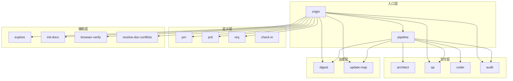
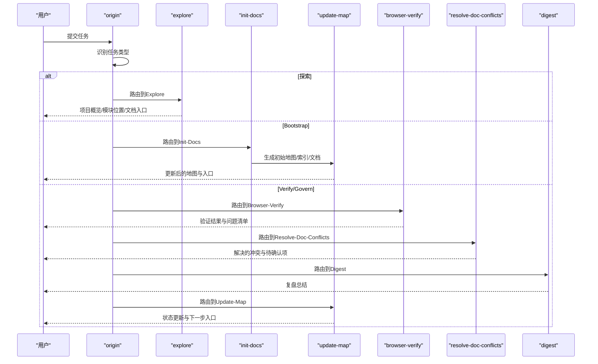
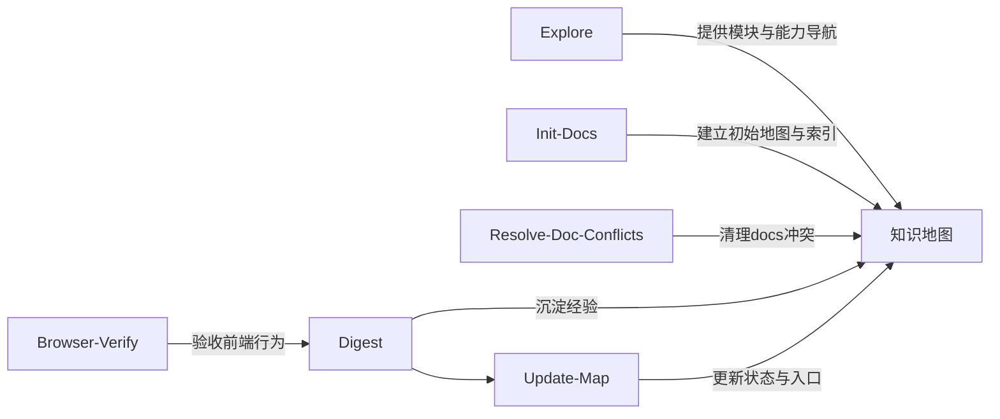

# 辅助技能详解

<cite>
**本文引用的文件**
- [explore/SKILL.md](file://skills/web3-ai-agent/explore/SKILL.md)
- [init-docs/SKILL.md](file://skills/web3-ai-agent/init-docs/SKILL.md)
- [browser-verify/SKILL.md](file://skills/web3-ai-agent/browser-verify/SKILL.md)
- [resolve-doc-conflicts/SKILL.md](file://skills/web3-ai-agent/resolve-doc-conflicts/SKILL.md)
- [digest/SKILL.md](file://skills/web3-ai-agent/digest/SKILL.md)
- [update-map/SKILL.md](file://skills/web3-ai-agent/update-map/SKILL.md)
- [SKILL.md](file://skills/web3-ai-agent/SKILL.md)
- [SKILL-SYSTEM-DESIGN-V3.md](file://skills/web3-ai-agent/SKILL-SYSTEM-DESIGN-V3.md)
- [MAP-V3.md](file://skills/web3-ai-agent/MAP-V3.md)
- [COMMANDS.md](file://skills/web3-ai-agent/COMMANDS.md)
</cite>

## 目录
1. [简介](#简介)
2. [项目结构](#项目结构)
3. [核心组件](#核心组件)
4. [架构总览](#架构总览)
5. [详细组件分析](#详细组件分析)
6. [依赖关系分析](#依赖关系分析)
7. [性能与可用性考量](#性能与可用性考量)
8. [故障排查指南](#故障排查指南)
9. [结论](#结论)
10. [附录](#附录)

## 简介
本文件聚焦于AI-Agent技能系统中的“辅助技能层”，系统性阐述以下五个技能的作用、边界、流程与协作方式：
- 探索发现技能（Explore）：只读探索，帮助新人快速理解项目、定位模块、查询现状，不进入交付链。
- 文档初始化技能（Init-Docs）：用于新项目初始化文档体系、首次建立地图，或把旧文档迁移到新的结构。
- 浏览器验证技能（Browser-Verify）：用浏览器层做可视化和交互验收，主要用于前端、交互和页面回归验证。
- 文档冲突解决技能（Resolve-Doc-Conflicts）：专门处理文档冲突，优先清理docs类冲突，避免把文档治理和代码修复混在一起。
- 复盘沉淀技能（Digest）与地图更新技能（Update-Map）：前者负责阶段性沉淀经验，后者负责维护项目状态、索引与下一步入口。

这些技能共同构成了“探索—治理—收尾”的闭环支撑，既可独立使用，也可在主链路中按需插入，确保知识地图持续演进、交付质量稳定可控。

## 项目结构
辅助技能位于技能系统“辅助层”，与“入口层”“定义层”“交付层”“治理层”共同组成完整的V3体系。辅助层的核心职责是为主链路提供只读探索、初始化、浏览器验证、文档治理能力。

图表来源
- [SKILL-SYSTEM-DESIGN-V3.md](file://skills/web3-ai-agent/SKILL-SYSTEM-DESIGN-V3.md)
- [MAP-V3.md](file://skills/web3-ai-agent/MAP-V3.md)

章节来源
- [SKILL-SYSTEM-DESIGN-V3.md](file://skills/web3-ai-agent/SKILL-SYSTEM-DESIGN-V3.md)
- [MAP-V3.md](file://skills/web3-ai-agent/MAP-V3.md)

## 核心组件
- Explore（探索发现）
  - 作用：只读探索，帮助理解项目、定位模块、查询现状，不进入交付链。
  - 关键边界：只读；不进入check-in；不直接生成需求或代码。
  - 流程要点：判断用户要看全局/模块/组件；最小化读取上下文；输出结构化答案和下一步入口。
- Init-Docs（文档初始化）
  - 作用：新项目初始化文档体系、首次建立地图，或把旧文档迁移到新的结构。
  - 关键边界：不承担具体功能开发；不代替后续digest。
  - 流程要点：扫描项目骨架；建立第一版地图和索引；生成初始文档结构；交给update-map。
- Browser-Verify（浏览器验证）
  - 作用：用浏览器层做可视化和交互验收，主要用于前端、交互和页面回归验证。
  - 关键边界：不直接改代码；不代替单元/集成测试。
  - 流程要点：进入目标页面；执行验证步骤；记录关键结果；检查可视和交互回归。
- Resolve-Doc-Conflicts（文档冲突解决）
  - 作用：专门处理文档冲突，优先清理docs类冲突。
  - 关键边界：不处理业务代码冲突；不假装理解模糊的语义冲突。
  - 流程要点：扫描冲突文件；区分生成物和手写文档；生成物优先重建；手写内容优先保留信息；输出待人工确认项。
- Digest（复盘沉淀）
  - 作用：在任务完成后做阶段沉淀，记录完成项、问题、经验和后续建议。
  - 关键边界：不代替地图更新；不替代需求文档。
  - 流程要点：总结完成项；总结偏差和问题；记录经验和限制；给出下一步建议。
- Update-Map（地图更新）
  - 作用：维护当前项目状态，让下一轮任务能基于最新上下文继续推进。
  - 关键边界：不做强复盘；不重新定义需求。
  - 流程要点：更新任务状态；更新索引或地图；更新下一步建议。

章节来源
- [explore/SKILL.md](file://skills/web3-ai-agent/explore/SKILL.md)
- [init-docs/SKILL.md](file://skills/web3-ai-agent/init-docs/SKILL.md)
- [browser-verify/SKILL.md](file://skills/web3-ai-agent/browser-verify/SKILL.md)
- [resolve-doc-conflicts/SKILL.md](file://skills/web3-ai-agent/resolve-doc-conflicts/SKILL.md)
- [digest/SKILL.md](file://skills/web3-ai-agent/digest/SKILL.md)
- [update-map/SKILL.md](file://skills/web3-ai-agent/update-map/SKILL.md)

## 架构总览
辅助技能在整个开发流程中的价值体现在：
- Explore：在“探索”阶段提供只读导航，帮助用户快速定位模块与能力，避免误入交付链。
- Init-Docs：在“Bootstrap”阶段建立初始地图与索引，为后续迭代打下文档基础。
- Browser-Verify：在“Closeout”阶段按需插入，保障前端行为与交互的可视回归。
- Resolve-Doc-Conflicts：在“Verify/Govern”阶段处理文档层面的冲突，保证知识地图一致性。
- Digest + Update-Map：在“Closeout”阶段完成经验沉淀与状态更新，形成闭环。

图表来源
- [SKILL.md](file://skills/web3-ai-agent/SKILL.md)
- [SKILL-SYSTEM-DESIGN-V3.md](file://skills/web3-ai-agent/SKILL-SYSTEM-DESIGN-V3.md)
- [MAP-V3.md](file://skills/web3-ai-agent/MAP-V3.md)

## 详细组件分析

### Explore（探索发现）
- 适用场景
  - 新人熟悉项目
  - 查询某模块在哪里
  - 理解当前结构
  - 查看当前能力地图
- 输入
  - 用户问题
  - 当前代码库或文档
- 输出
  - 项目概览
  - 模块位置
  - 相关文件或文档入口
- 流程
  - 判断用户要看全局、模块还是具体组件
  - 最小化读取上下文
  - 输出结构化答案和下一步入口
- 边界
  - 只读
  - 不进入check-in
  - 不直接生成需求或代码
- 规则
  - 先回答“是什么/在哪”，再回答“怎么改”
  - 如果用户开始提出变更诉求，引导回origin->DEFINE或pipeline

使用示例
- “帮我看看这个Web3 AI Agent项目当前有哪些模块和能力”
- “我看到钱包切换后聊天页状态没刷新，能定位一下相关模块吗？”

集成方法
- 建议通过斜杠命令“/explore”触发，或直接在主入口“web3-ai-agent”后由origin自动分流至explore。

章节来源
- [explore/SKILL.md](file://skills/web3-ai-agent/explore/SKILL.md)
- [COMMANDS.md](file://skills/web3-ai-agent/COMMANDS.md)
- [SKILL.md](file://skills/web3-ai-agent/SKILL.md)

### Init-Docs（文档初始化）
- 适用场景
  - 新项目第一次建文档
  - 历史文档迁移
  - 重建基础索引
- 输入
  - 代码库现状
  - 现有文档
- 输出
  - 初始地图
  - 初始索引
  - 基础结构化文档
- 流程
  - 扫描项目骨架
  - 建立第一版地图和索引
  - 生成初始文档结构
  - 交给update-map
- 边界
  - 不承担具体功能开发
  - 不代替后续digest
- 规则
  - 这是BOOTSTRAP专用skill
  - 初始化完成后应交由正常V3链路继续演化

使用示例
- “新项目需要建立文档体系，请生成初始地图和索引”
- “历史文档需要迁移到新的结构，如何操作？”

集成方法
- 通过“origin -> init-docs -> update-map”串联使用，确保地图与索引同步更新。

章节来源
- [init-docs/SKILL.md](file://skills/web3-ai-agent/init-docs/SKILL.md)
- [SKILL-SYSTEM-DESIGN-V3.md](file://skills/web3-ai-agent/SKILL-SYSTEM-DESIGN-V3.md)
- [MAP-V3.md](file://skills/web3-ai-agent/MAP-V3.md)

### Browser-Verify（浏览器验证）
- 适用场景
  - 前端页面验收
  - 交互流程验证
  - 可视回归检查
  - PATCH的浏览器级复验
- 输入
  - 目标页面或入口
  - 修复/改动说明
  - 验证步骤
- 输出
  - 验证结果（PASS/PARTIAL/FAIL）
  - 发现的问题
- 流程
  - 进入目标页面
  - 执行验证步骤
  - 记录关键结果
  - 检查可视和交互回归
- 边界
  - 不直接改代码
  - 不代替单元/集成测试
- 衔接
  - 通过：回到audit或closeout
  - 失败：回退coder
- 规则
  - 当前端行为需要肉眼确认时优先使用
  - 可用于FEAT/PATCH/REFACTOR，但不是每次强制

使用示例
- “帮我用浏览器验收一下聊天页这个修复”
- “页面布局在不同分辨率下是否一致？”

集成方法
- 在“Closeout”阶段按需插入，通常在audit之后进行，确保前端行为与交互得到肉眼确认。

章节来源
- [browser-verify/SKILL.md](file://skills/web3-ai-agent/browser-verify/SKILL.md)
- [SKILL-SYSTEM-DESIGN-V3.md](file://skills/web3-ai-agent/SKILL-SYSTEM-DESIGN-V3.md)
- [MAP-V3.md](file://skills/web3-ai-agent/MAP-V3.md)

### Resolve-Doc-Conflicts（文档冲突解决）
- 适用场景
  - 文档合并冲突
  - 索引或地图冲突
  - trace/审计/规划类文档冲突
- 输入
  - 冲突中的文档文件
- 输出
  - 已解决的文档冲突
  - 需要人工复核的冲突点
- 流程
  - 扫描冲突文件
  - 区分生成物和手写文档
  - 生成物优先重建
  - 手写内容优先保留信息，不盲猜
  - 输出待人工确认项
- 边界
  - 不处理业务代码冲突
  - 不假装理解模糊的语义冲突
- 规则
  - 能保留两边内容时，优先保留
  - 无法安全判断时，显式标记人工介入

使用示例
- “PR中出现文档合并冲突，如何处理？”
- “地图与索引存在冲突，需要清理哪些内容？”

集成方法
- 在“Verify/Govern”阶段使用，确保文档层面的一致性与可追溯性。

章节来源
- [resolve-doc-conflicts/SKILL.md](file://skills/web3-ai-agent/resolve-doc-conflicts/SKILL.md)
- [SKILL-SYSTEM-DESIGN-V3.md](file://skills/web3-ai-agent/SKILL-SYSTEM-DESIGN-V3.md)
- [MAP-V3.md](file://skills/web3-ai-agent/MAP-V3.md)

### Digest（复盘沉淀）
- 作用
  - 把一轮任务中真正值得保留的经验沉淀下来，而不是只记录“改了哪些文件”。
- 输入
  - 本轮产物
  - QA结果
  - Audit结论
- 输出
  - 复盘总结（完成项、问题、学到的经验、未解决问题、下一步建议）
- 流程
  - 总结完成项
  - 总结偏差和问题
  - 记录经验和限制
  - 给出下一步建议
- 边界
  - 不代替地图更新
  - 不替代需求文档
- 衔接
  - 进入update-map
- 规则
  - 重点记录“为什么卡住/为什么成功”，而不是流水账
  - PATCH可以轻量写，但不建议省略

使用示例
- “本轮任务完成后，如何沉淀经验并给出下一步建议？”
- “哪些问题是共性问题，需要在后续任务中规避？”

集成方法
- 在“Closeout”阶段与update-map配合使用，形成“经验沉淀—状态更新”的闭环。

章节来源
- [digest/SKILL.md](file://skills/web3-ai-agent/digest/SKILL.md)
- [SKILL-SYSTEM-DESIGN-V3.md](file://skills/web3-ai-agent/SKILL-SYSTEM-DESIGN-V3.md)
- [MAP-V3.md](file://skills/web3-ai-agent/MAP-V3.md)

### Update-Map（地图更新）
- 作用
  - 维护当前项目状态，让下一轮任务能基于最新上下文继续推进。
- 输入
  - 当前任务结果
  - 新增或修改的文档
  - 新增或修改的能力
- 输出
  - Map更新（当前状态、影响模块/能力、新增文档、需要关注的后续入口）
- 流程
  - 更新任务状态
  - 更新索引或地图
  - 更新下一步建议
- 边界
  - 不做强复盘
  - 不重新定义需求
- 衔接
  - 返回origin
- 规则
  - 任何改变状态的交付任务都应更新地图
  - digest负责经验，update-map负责状态，不混写

使用示例
- “任务完成后，如何更新地图与下一步入口？”
- “新增文档与能力如何反映到知识地图中？”

集成方法
- 在“Closeout”阶段最后执行，确保地图与索引与实际状态保持一致。

章节来源
- [update-map/SKILL.md](file://skills/web3-ai-agent/update-map/SKILL.md)
- [SKILL-SYSTEM-DESIGN-V3.md](file://skills/web3-ai-agent/SKILL-SYSTEM-DESIGN-V3.md)
- [MAP-V3.md](file://skills/web3-ai-agent/MAP-V3.md)

## 依赖关系分析
辅助技能之间的协作关系如下：
- Explore与Init-Docs：Explore用于探索现状，Init-Docs用于建立初始结构，二者互补，分别服务于“探索—初始化”阶段。
- Browser-Verify与Digest/Update-Map：Browser-Verify在Closeout阶段按需插入，Digest负责经验沉淀，Update-Map负责状态更新，三者共同完成“验收—沉淀—更新”的闭环。
- Resolve-Doc-Conflicts与Digest/Update-Map：Resolve-Doc-Conflicts在Verify/Govern阶段处理文档冲突，Digest与Update-Map随后进行经验沉淀与状态更新，确保知识地图一致性与可演进性。

图表来源
- [explore/SKILL.md](file://skills/web3-ai-agent/explore/SKILL.md)
- [init-docs/SKILL.md](file://skills/web3-ai-agent/init-docs/SKILL.md)
- [resolve-doc-conflicts/SKILL.md](file://skills/web3-ai-agent/resolve-doc-conflicts/SKILL.md)
- [digest/SKILL.md](file://skills/web3-ai-agent/digest/SKILL.md)
- [update-map/SKILL.md](file://skills/web3-ai-agent/update-map/SKILL.md)
- [MAP-V3.md](file://skills/web3-ai-agent/MAP-V3.md)

## 性能与可用性考量
- Explore的“最小化读取上下文”原则有助于降低响应时间，适合高频查询场景。
- Init-Docs的“扫描项目骨架—建立地图—生成初始文档—交给update-map”流程，建议在CI/CD中自动化执行，缩短初始化周期。
- Browser-Verify建议在前端改动频繁或跨浏览器回归时启用，避免在非必要场景重复执行。
- Resolve-Doc-Conflicts的“生成物优先重建、手写内容优先保留信息”策略，能有效减少误判，提高冲突解决效率。
- Digest与Update-Map的“经验沉淀—状态更新”闭环，建议在每个交付周期结束后执行，确保知识地图持续演进。

## 故障排查指南
- Explore无法定位模块
  - 检查输入是否包含“用户问题”和“当前代码库/文档”
  - 确认是否误触发了交付链，Explore不应进入check-in或生成需求
- Init-Docs生成的地图不准确
  - 检查项目骨架扫描是否覆盖全部模块
  - 确认是否及时执行update-map更新状态
- Browser-Verify结果不稳定
  - 确认目标页面是否可访问且无动态加载阻塞
  - 检查验证步骤是否覆盖关键交互路径
- Resolve-Doc-Conflicts误判
  - 明确区分生成物与手写文档，避免将手写内容盲目删除
  - 对无法安全判断的冲突，显式标记人工介入
- Digest遗漏关键信息
  - 确保记录“为什么卡住/为什么成功”的经验
  - 对PATCH等轻量任务也要保留必要摘要

章节来源
- [explore/SKILL.md](file://skills/web3-ai-agent/explore/SKILL.md)
- [init-docs/SKILL.md](file://skills/web3-ai-agent/init-docs/SKILL.md)
- [browser-verify/SKILL.md](file://skills/web3-ai-agent/browser-verify/SKILL.md)
- [resolve-doc-conflicts/SKILL.md](file://skills/web3-ai-agent/resolve-doc-conflicts/SKILL.md)
- [digest/SKILL.md](file://skills/web3-ai-agent/digest/SKILL.md)
- [update-map/SKILL.md](file://skills/web3-ai-agent/update-map/SKILL.md)

## 结论
辅助技能层通过“探索—初始化—验收—治理—沉淀—更新”的协同，为AI-Agent技能系统提供了高效、稳定的支撑能力。Explore与Init-Docs分别服务于“探索现状”和“建立基线”，Browser-Verify与Resolve-Doc-Conflicts保障前端行为与文档一致性，Digest与Update-Map则确保经验沉淀与状态更新的闭环。在实际使用中，建议结合斜杠命令与主入口路由，按需组合这些辅助技能，以获得更高的交付效率与知识治理质量。

## 附录
- 斜杠命令推荐
  - /origin：统一入口
  - /explore：探索项目
  - /init-docs：初始化文档
  - /browser-verify：浏览器验收
  - /resolve-doc-conflicts：文档冲突解决
  - /digest：复盘沉淀
  - /update-map：地图更新
- 使用示例
  - “/explore 帮我看看当前Web3 AI Agent项目有哪些模块和能力”
  - “/init-docs 新项目需要建立文档体系，请生成初始地图和索引”
  - “/browser-verify 帮我用浏览器验收一下聊天页这个修复”
  - “/resolve-doc-conflicts PR中出现文档合并冲突，如何处理？”
  - “/digest 本轮任务完成后，如何沉淀经验并给出下一步建议？”
  - “/update-map 任务完成后，如何更新地图与下一步入口？”

章节来源
- [COMMANDS.md](file://skills/web3-ai-agent/COMMANDS.md)
- [SKILL.md](file://skills/web3-ai-agent/SKILL.md)