# AI-Agent核心概念学习指南

<cite>
**本文档引用的文件**
- [README.md](file://README.md)
- [package.json](file://package.json)
- [turbo.json](file://turbo.json)
- [pnpm-workspace.yaml](file://pnpm-workspace.yaml)
- [apps/web/app/page.tsx](file://apps/web/app/page.tsx)
- [apps/web/app/layout.tsx](file://apps/web/app/layout.tsx)
- [apps/web/app/api/chat/route.ts](file://apps/web/app/api/chat/route.ts)
- [apps/web/app/api/tools/route.ts](file://apps/web/app/api/tools/route.ts)
- [apps/web/components/ChatInput.tsx](file://apps/web/components/ChatInput.tsx)
- [apps/web/components/MessageList.tsx](file://apps/web/components/MessageList.tsx)
- [apps/web/types/chat.ts](file://apps/web/types/chat.ts)
- [apps/web/package.json](file://apps/web/package.json)
- [apps/web/tailwind.config.ts](file://apps/web/tailwind.config.ts)
- [skills/x-ray/SKILL.md](file://skills/x-ray/SKILL.md)
- [skills/x-ray/MAP-V3.md](file://skills/x-ray/MAP-V3.md)
- [packages/web3-tools/package.json](file://packages/web3-tools/package.json)
</cite>

## 目录
1. [项目概述](#项目概述)
2. [项目结构](#项目结构)
3. [核心组件](#核心组件)
4. [架构概览](#架构概览)
5. [详细组件分析](#详细组件分析)
6. [依赖关系分析](#依赖关系分析)
7. [性能考虑](#性能考虑)
8. [故障排除指南](#故障排除指南)
9. [结论](#结论)

## 项目概述

Web3 AI Agent是一个面向Web3前端开发者的AI Agent项目，旨在实现从需求定义到代码交付的完整SDLC自动化流程。该项目服务于个人转型目标：从Web3前端工程师升级为AI应用工程师/Agent工程师。

### 核心能力

- **对话能力**：基础聊天界面，支持流式输出
- **Tool Calling**：调用Web3工具获取链上数据
- **Agent Loop**：理解用户意图，自主决策工具调用
- **最小Memory**：保持会话上下文连续性

### 技术栈

- **前端框架**: Next.js 14 + React + TypeScript
- **样式**: Tailwind CSS
- **AI能力**: OpenAI API
- **Web3**: ethers.js
- **开发语言**: TypeScript

**章节来源**
- [README.md:1-93](file://README.md#L1-L93)

## 项目结构

项目采用Monorepo架构，使用pnpm workspace和Turbo进行管理：

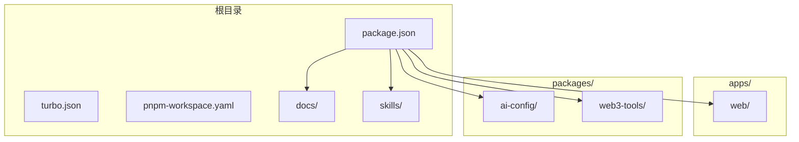

**图表来源**
- [package.json:1-28](file://package.json#L1-L28)
- [turbo.json:1-21](file://turbo.json#L1-L21)
- [pnpm-workspace.yaml:1-4](file://pnpm-workspace.yaml#L1-L4)

**章节来源**
- [README.md:26-38](file://README.md#L26-L38)
- [package.json:23-26](file://package.json#L23-L26)

## 核心组件

### 前端应用架构

Web应用采用Next.js 14构建，包含完整的聊天界面和API集成：

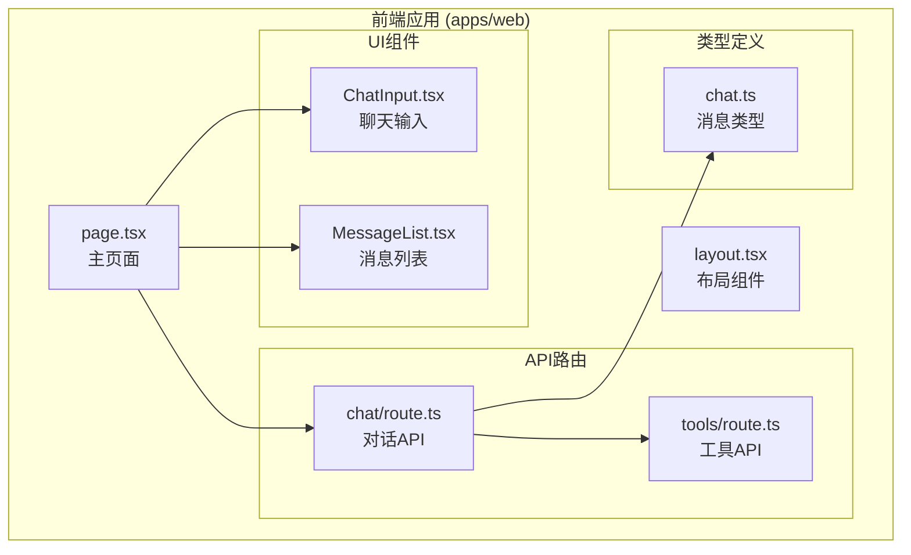

**图表来源**
- [apps/web/app/page.tsx:1-106](file://apps/web/app/page.tsx#L1-L106)
- [apps/web/app/api/chat/route.ts:1-180](file://apps/web/app/api/chat/route.ts#L1-L180)
- [apps/web/app/api/tools/route.ts:1-168](file://apps/web/app/api/tools/route.ts#L1-L168)

**章节来源**
- [apps/web/app/page.tsx:8-106](file://apps/web/app/page.tsx#L8-L106)
- [apps/web/components/ChatInput.tsx:1-74](file://apps/web/components/ChatInput.tsx#L1-L74)
- [apps/web/components/MessageList.tsx:1-44](file://apps/web/components/MessageList.tsx#L1-L44)

### AI配置系统

项目实现了统一的AI配置管理，支持多模型提供商切换：

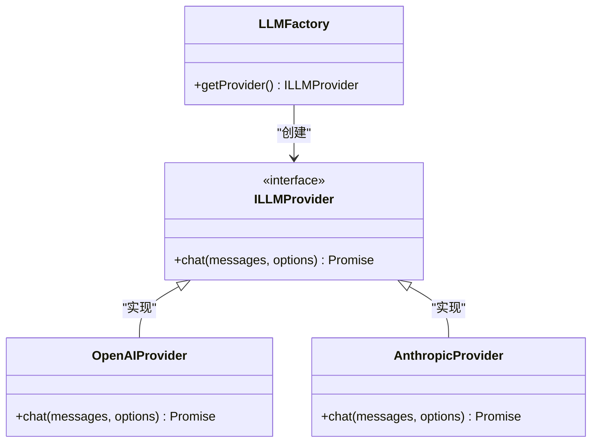

**图表来源**
- [skills/x-ray/MAP-V3.md:129-132](file://skills/x-ray/MAP-V3.md#L129-L132)

### Web3工具系统

集成多个Web3相关工具，提供区块链数据查询能力：

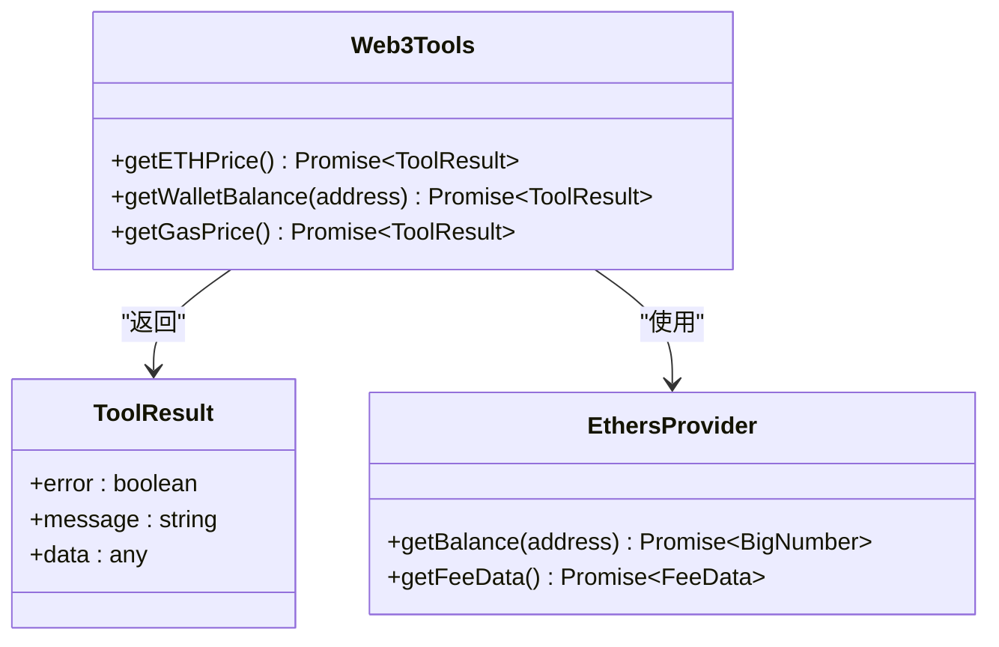

**图表来源**
- [apps/web/app/api/tools/route.ts:19-130](file://apps/web/app/api/tools/route.ts#L19-L130)

**章节来源**
- [apps/web/app/api/tools/route.ts:132-168](file://apps/web/app/api/tools/route.ts#L132-L168)

## 架构概览

项目采用分层架构设计，实现了清晰的关注点分离：

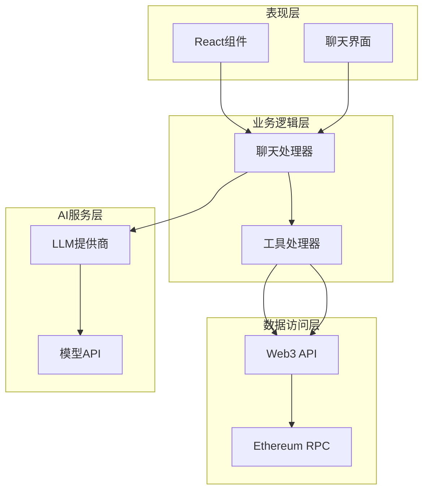

**图表来源**
- [apps/web/app/api/chat/route.ts:76-180](file://apps/web/app/api/chat/route.ts#L76-L180)
- [apps/web/app/api/tools/route.ts:132-168](file://apps/web/app/api/tools/route.ts#L132-L168)

## 详细组件分析

### 聊天API处理流程

聊天API实现了完整的Agent循环，包括意图识别、工具调用和结果处理：

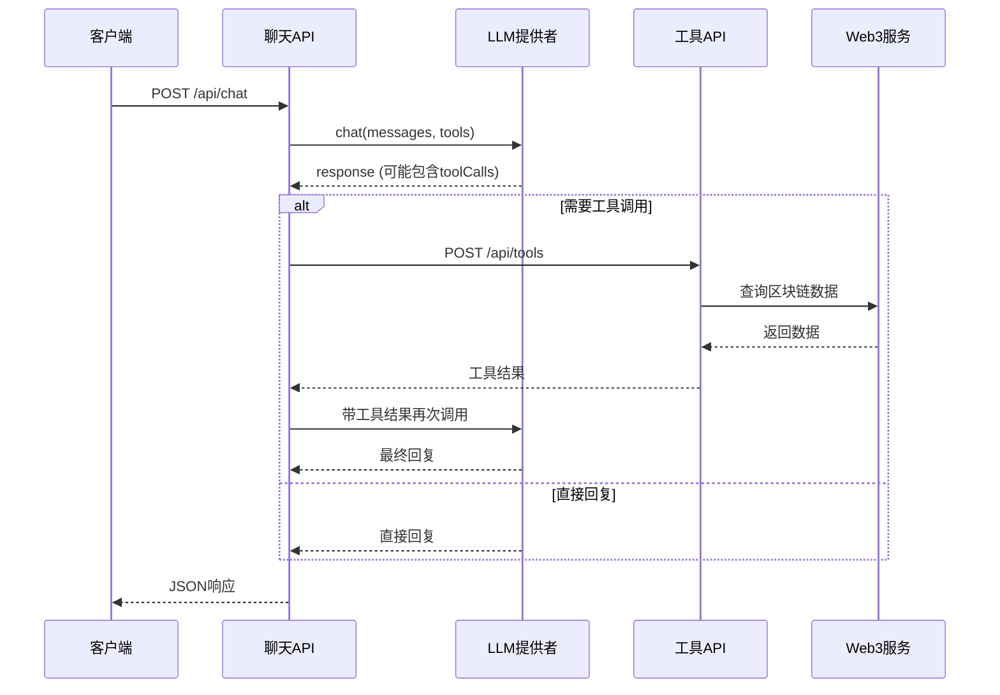

**图表来源**
- [apps/web/app/api/chat/route.ts:76-180](file://apps/web/app/api/chat/route.ts#L76-L180)

#### 工具调用算法流程

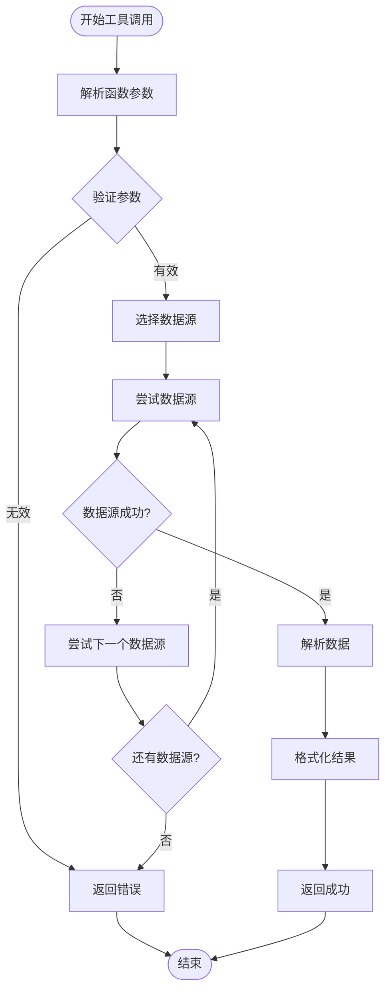

**图表来源**
- [apps/web/app/api/tools/route.ts:132-168](file://apps/web/app/api/tools/route.ts#L132-L168)

**章节来源**
- [apps/web/app/api/chat/route.ts:96-161](file://apps/web/app/api/chat/route.ts#L96-L161)

### 用户界面组件

聊天界面采用响应式设计，支持多种交互模式：

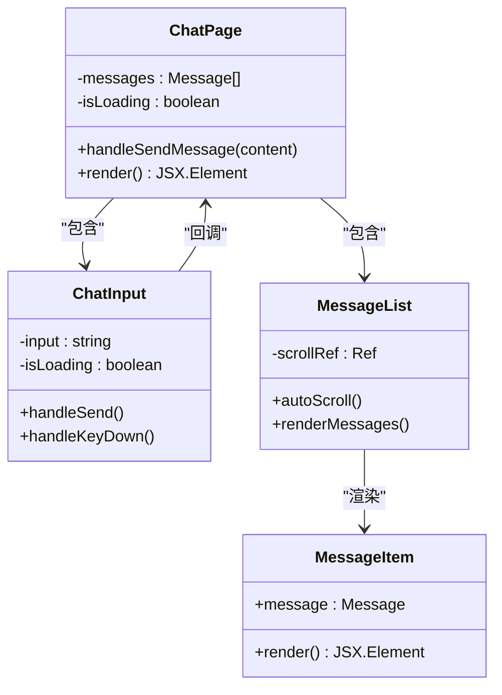

**图表来源**
- [apps/web/app/page.tsx:8-106](file://apps/web/app/page.tsx#L8-L106)
- [apps/web/components/ChatInput.tsx:10-74](file://apps/web/components/ChatInput.tsx#L10-L74)
- [apps/web/components/MessageList.tsx:12-44](file://apps/web/components/MessageList.tsx#L12-L44)

**章节来源**
- [apps/web/app/page.tsx:19-71](file://apps/web/app/page.tsx#L19-L71)
- [apps/web/components/ChatInput.tsx:13-24](file://apps/web/components/ChatInput.tsx#L13-L24)

### 类型系统设计

项目使用TypeScript确保类型安全：

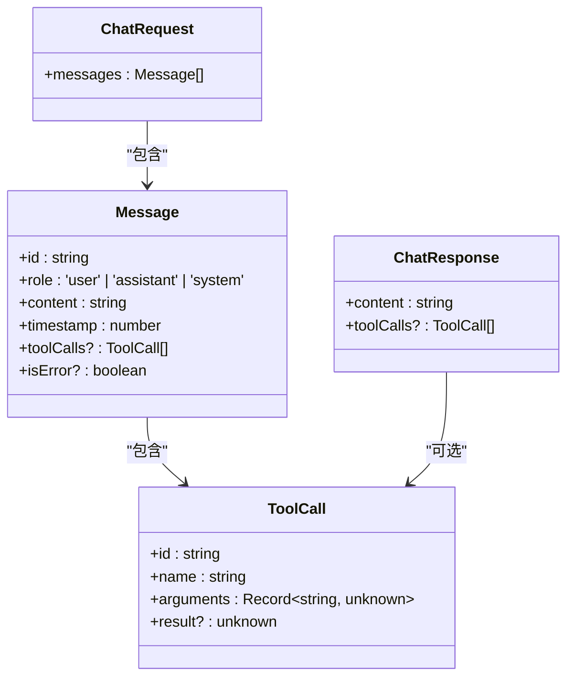

**图表来源**
- [apps/web/types/chat.ts:1-28](file://apps/web/types/chat.ts#L1-L28)

**章节来源**
- [apps/web/types/chat.ts:17-27](file://apps/web/types/chat.ts#L17-L27)

## 依赖关系分析

项目采用现代化的依赖管理策略：

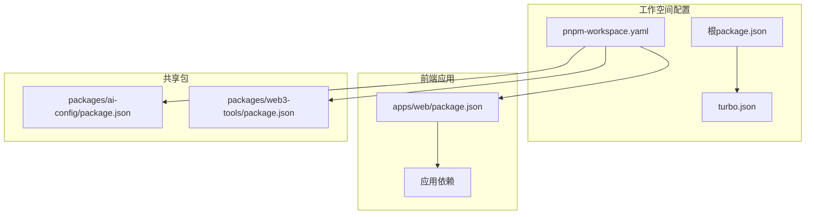

**图表来源**
- [pnpm-workspace.yaml:1-4](file://pnpm-workspace.yaml#L1-L4)
- [turbo.json:1-21](file://turbo.json#L1-L21)
- [apps/web/package.json:12-23](file://apps/web/package.json#L12-L23)

**章节来源**
- [apps/web/package.json:12-23](file://apps/web/package.json#L12-L23)
- [packages/web3-tools/package.json:13-15](file://packages/web3-tools/package.json#L13-L15)

## 性能考虑

### 缓存策略

项目实现了多层次的缓存机制：

- **代理缓存**：支持HTTP/HTTPS代理配置
- **数据源缓存**：多个Web3数据源的容错机制
- **会话缓存**：保持用户上下文连续性

### 错误处理

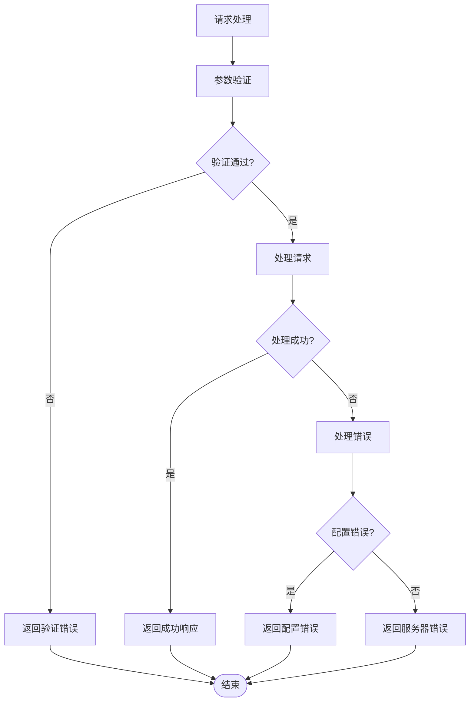

**图表来源**
- [apps/web/app/api/chat/route.ts:162-178](file://apps/web/app/api/chat/route.ts#L162-L178)

## 故障排除指南

### 常见问题诊断

1. **模型配置错误**
   - 检查环境变量配置
   - 验证API密钥有效性
   - 确认模型提供商可用性

2. **Web3连接问题**
   - 验证RPC节点URL
   - 检查网络连接
   - 确认代理设置

3. **工具调用失败**
   - 查看具体错误信息
   - 验证参数格式
   - 检查数据源可用性

**章节来源**
- [apps/web/app/api/chat/route.ts:165-177](file://apps/web/app/api/chat/route.ts#L165-L177)

### 开发环境设置

```bash
# 安装依赖
pnpm install

# 配置环境变量
cp apps/web/.env.example apps/web/.env.local

# 启动开发服务器
pnpm dev
```

**章节来源**
- [README.md:53-66](file://README.md#L53-L66)

## 结论

Web3 AI Agent项目展示了现代AI Agent系统的最佳实践，包括：

- **模块化架构**：清晰的分层设计和职责分离
- **类型安全**：完整的TypeScript类型系统
- **可扩展性**：支持多模型提供商和工具扩展
- **用户体验**：流畅的聊天界面和实时反馈

项目为学习AI Agent开发提供了优秀的参考案例，涵盖了从基础聊天到复杂工具调用的完整功能栈。通过遵循项目的设计原则和架构模式，开发者可以快速构建自己的AI Agent应用。