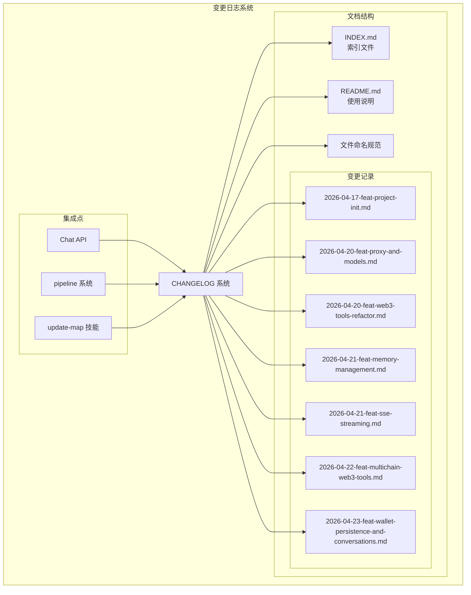
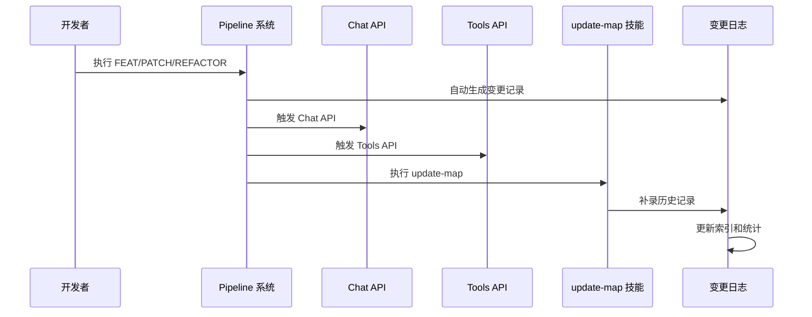

# 变更日志系统

<cite>
**本文档引用的文件**
- [docs/changelog/README.md](file://docs/changelog/README.md)
- [docs/changelog/INDEX.md](file://docs/changelog/INDEX.md)
- [docs/changelog/2026-04-17-feat-project-init.md](file://docs/changelog/2026-04-17-feat-project-init.md)
- [docs/changelog/2026-04-20-feat-proxy-and-models.md](file://docs/changelog/2026-04-20-feat-proxy-and-models.md)
- [docs/changelog/2026-04-20-feat-web3-tools-refactor.md](file://docs/changelog/2026-04-20-feat-web3-tools-refactor.md)
- [docs/changelog/2026-04-21-feat-memory-management.md](file://docs/changelog/2026-04-21-feat-memory-management.md)
- [docs/changelog/2026-04-21-feat-sse-streaming.md](file://docs/changelog/2026-04-21-feat-sse-streaming.md)
- [docs/changelog/2026-04-22-feat-multichain-web3-tools.md](file://docs/changelog/2026-04-22-feat-multichain-web3-tools.md)
- [docs/changelog/2026-04-23-feat-wallet-persistence-and-conversations.md](file://docs/changelog/2026-04-23-feat-wallet-persistence-and-conversations.md)
- [apps/web/app/config.ts](file://apps/web/app/config.ts)
- [apps/web/app/providers.tsx](file://apps/web/app/providers.tsx)
- [apps/web/app/layout.tsx](file://apps/web/app/layout.tsx)
- [apps/web/app/page.tsx](file://apps/web/app/page.tsx)
- [apps/web/lib/supabase/client.ts](file://apps/web/lib/supabase/client.ts)
- [apps/web/lib/supabase/conversations.ts](file://apps/web/lib/supabase/conversations.ts)
- [apps/web/lib/supabase/types.ts](file://apps/web/lib/supabase/types.ts)
- [apps/web/components/ConversationHistory.tsx](file://apps/web/components/ConversationHistory.tsx)
- [apps/web/components/WalletConnectButton.tsx](file://apps/web/components/WalletConnectButton.tsx)
- [supabase/init.sql](file://supabase/init.sql)
- [apps/web/types/chat.ts](file://apps/web/types/chat.ts)
- [apps/web/package.json](file://apps/web/package.json)
- [apps/web/.env.example](file://apps/web/.env.example)
- [apps/web/QUICKSTART.md](file://apps/web/QUICKSTART.md)
- [WALLET-LOGIN-SETUP.md](file://WALLET-LOGIN-SETUP.md)
- [apps/web/lib/memory/SummaryCompressionMemory.ts](file://apps/web/lib/memory/SummaryCompressionMemory.ts)
- [apps/web/lib/memory/config.ts](file://apps/web/lib/memory/config.ts)
- [apps/web/lib/memory/types.ts](file://apps/web/lib/memory/types.ts)
- [apps/web/lib/memory/index.ts](file://apps/web/lib/memory/index.ts)
- [apps/web/app/api/chat/route.ts](file://apps/web/app/api/chat/route.ts)
- [packages/web3-tools/src/index.ts](file://packages/web3-tools/src/index.ts)
- [packages/web3-tools/src/types.ts](file://packages/web3-tools/src/types.ts)
- [packages/web3-tools/src/price.ts](file://packages/web3-tools/src/price.ts)
- [packages/web3-tools/src/balance.ts](file://packages/web3-tools/src/balance.ts)
- [packages/web3-tools/src/gas.ts](file://packages/web3-tools/src/gas.ts)
- [packages/web3-tools/src/token.ts](file://packages/web3-tools/src/token.ts)
- [package.json](file://package.json)
- [turbo.json](file://turbo.json)
</cite>

## 更新摘要
**变更内容**
- 新增2026-04-23钱包连接持久化和对话历史管理功能的完整变更日志
- 更新架构概览图，包含新的钱包连接和对话管理系统
- 增强详细组件分析，涵盖wagmi配置、Supabase数据层和对话历史组件
- 更新索引系统，添加新的钱包连接和对话管理相关关键词
- 完善故障排除指南，包含SSR环境下的钱包连接问题和对话同步问题

## 目录
1. [简介](#简介)
2. [项目结构](#项目结构)
3. [核心组件](#核心组件)
4. [架构概览](#架构概览)
5. [详细组件分析](#详细组件分析)
6. [依赖关系分析](#依赖关系分析)
7. [性能考量](#性能考量)
8. [故障排除指南](#故障排除指南)
9. [结论](#结论)

## 简介

变更日志系统是 Web3 AI Agent 项目中用于记录和追踪代码变更历史的重要基础设施。该系统采用标准化的文档格式，为 AI 和开发者提供完整的变更上下文，支持自动化的变更记录生成和手动补录功能。

系统的核心目标是：
- 提供完整的项目演进历史记录
- 支持 AI 上下文理解和开发者追溯
- 实现自动化和手动相结合的变更记录机制
- 建立标准化的变更分类和文档规范

**更新** 新增了钱包连接持久化和对话历史管理功能的详细记录，包括SSR环境下的钱包连接解决方案和云端对话同步机制。

## 项目结构

变更日志系统位于 `docs/changelog/` 目录下，采用层次化的文件组织结构：



**图表来源**
- [docs/changelog/README.md:1-65](file://docs/changelog/README.md#L1-L65)
- [docs/changelog/INDEX.md:1-70](file://docs/changelog/INDEX.md#L1-L70)

**章节来源**
- [docs/changelog/README.md:1-65](file://docs/changelog/README.md#L1-L65)
- [docs/changelog/INDEX.md:1-70](file://docs/changelog/INDEX.md#L1-L70)

## 核心组件

### 变更记录文档

每个变更记录都遵循统一的结构化格式，包含以下关键要素：

#### 任务信息结构
- **类型标识**：feat/patch/refactor
- **主题描述**：简洁明了的功能说明
- **Pipeline 信息**：执行流程和质量评分
- **时间戳**：完成时间和提交信息

#### 架构设计文档
- **目标声明**：明确的技术目标和预期成果
- **模块边界**：涉及的代码模块和职责划分
- **接口契约**：重要的数据结构和方法签名
- **数据流说明**：关键业务流程的执行路径

#### 变更详情分类
系统支持三种类型的变更记录：
- **新增功能**：新特性、新模块、新接口
- **修改优化**：现有功能的改进和优化
- **删除清理**：废弃代码和过时功能的移除

**更新** 新增了钱包连接持久化和对话历史管理功能的架构设计，包括wagmi双配置策略和Supabase数据层的完整实现。

**章节来源**
- [docs/changelog/2026-04-17-feat-project-init.md:1-114](file://docs/changelog/2026-04-17-feat-project-init.md#L1-L114)
- [docs/changelog/2026-04-20-feat-proxy-and-models.md:1-106](file://docs/changelog/2026-04-20-feat-proxy-and-models.md#L1-L106)
- [docs/changelog/2026-04-20-feat-web3-tools-refactor.md:1-103](file://docs/changelog/2026-04-20-feat-web3-tools-refactor.md#L1-L103)
- [docs/changelog/2026-04-21-feat-memory-management.md:1-142](file://docs/changelog/2026-04-21-feat-memory-management.md#L1-L142)
- [docs/changelog/2026-04-21-feat-sse-streaming.md:1-133](file://docs/changelog/2026-04-21-feat-sse-streaming.md#L1-L133)
- [docs/changelog/2026-04-22-feat-multichain-web3-tools.md:1-242](file://docs/changelog/2026-04-22-feat-multichain-web3-tools.md#L1-L242)
- [docs/changelog/2026-04-23-feat-wallet-persistence-and-conversations.md:1-114](file://docs/changelog/2026-04-23-feat-wallet-persistence-and-conversations.md#L1-L114)

### 自动化触发机制

变更日志系统支持多种自动触发场景：



**图表来源**
- [docs/changelog/README.md:44-52](file://docs/changelog/README.md#L44-L52)

**章节来源**
- [docs/changelog/README.md:20-52](file://docs/changelog/README.md#L20-L52)

## 架构概览

变更日志系统采用松耦合的设计模式，与核心业务逻辑保持清晰的分离：

```mermaid
graph TB
subgraph "前端应用"
WEB[Web 应用]
CHAT[Chat 组件]
MSG[消息展示]
MEM[Memory 管理器]
WALLET[钱包连接]
CONV[对话历史]
END
subgraph "认证层"
CONFIG[wagmi 配置]
PROVIDERS[Web3 Provider]
LAYOUT[Layout SSR]
END
subgraph "数据层"
SUPABASE[Supabase 数据库]
CLIENT[Supabase 客户端]
DA_LAYER[数据访问层]
END
subgraph "AI 层"
CHAT_API[Chat API]
TOOLS_API[Tools API]
HEALTH_API[Health API]
END
subgraph "核心包"
AI_CONFIG[AI 配置包]
WEB3_TOOLS[Web3 工具包]
END
subgraph "变更日志系统"
LOG_DOC[日志文档]
AUTO_GEN[自动生成功能]
MANUAL_REC[手动记录]
INDEX_SYS[索引系统]
END
subgraph "外部集成"
PIPELINE[pipeline 系统]
UPDATE_MAP[update-map 技能]
GIT[Git 历史记录]
END
WEB --> CHAT_API
CHAT --> CHAT_API
MSG --> CHAT_API
MEM --> CHAT_API
WALLET --> CONFIG
WALLET --> PROVIDERS
WALLET --> LAYOUT
CONV --> DA_LAYER
CONFIG --> LAYOUT
PROVIDERS --> WALLET
DA_LAYER --> SUPABASE
SUPABASE --> CLIENT
CLIENT --> DA_LAYER
CHAT_API --> AI_CONFIG
CHAT_API --> WEB3_TOOLS
TOOLS_API --> WEB3_TOOLS
AI_CONFIG --> LOG_DOC
WEB3_TOOLS --> LOG_DOC
PIPELINE --> AUTO_GEN
UPDATE_MAP --> MANUAL_REC
GIT --> INDEX_SYS
AUTO_GEN --> LOG_DOC
MANUAL_REC --> LOG_DOC
INDEX_SYS --> LOG_DOC
```

**更新** 新增了钱包连接和对话历史管理模块，包括wagmi双配置策略、Supabase数据层和对话历史组件。

**图表来源**
- [apps/web/app/api/chat/route.ts:1-406](file://apps/web/app/api/chat/route.ts#L1-L406)
- [apps/web/app/api/tools/route.ts:1-50](file://apps/web/app/api/tools/route.ts#L1-L50)
- [apps/web/app/page.tsx:1-362](file://apps/web/app/page.tsx#L1-L362)
- [apps/web/app/layout.tsx:1-35](file://apps/web/app/layout.tsx#L1-L35)
- [apps/web/app/config.ts:1-59](file://apps/web/app/config.ts#L1-L59)
- [apps/web/app/providers.tsx:1-51](file://apps/web/app/providers.tsx#L1-L51)
- [apps/web/lib/supabase/conversations.ts:1-219](file://apps/web/lib/supabase/conversations.ts#L1-L219)
- [apps/web/components/ConversationHistory.tsx:1-221](file://apps/web/components/ConversationHistory.tsx#L1-L221)

**章节来源**
- [apps/web/app/api/chat/route.ts:1-406](file://apps/web/app/api/chat/route.ts#L1-L406)
- [apps/web/app/api/tools/route.ts:1-50](file://apps/web/app/api/tools/route.ts#L1-L50)
- [apps/web/app/page.tsx:1-362](file://apps/web/app/page.tsx#L1-L362)
- [apps/web/app/layout.tsx:1-35](file://apps/web/app/layout.tsx#L1-L35)
- [apps/web/app/config.ts:1-59](file://apps/web/app/config.ts#L1-L59)
- [apps/web/app/providers.tsx:1-51](file://apps/web/app/providers.tsx#L1-L51)
- [apps/web/lib/supabase/conversations.ts:1-219](file://apps/web/lib/supabase/conversations.ts#L1-L219)
- [apps/web/components/ConversationHistory.tsx:1-221](file://apps/web/components/ConversationHistory.tsx#L1-L221)

## 详细组件分析

### 文件命名和分类系统

变更日志采用严格的命名规范，确保文件的可识别性和可排序性：

#### 命名规范
```
YYYY-MM-DD-{task-type}.md
```

示例：
- `2026-04-21-feat-chat-integration.md` - 新功能
- `2026-04-22-patch-fix-auth-bug.md` - Bug 修复
- `2026-04-23-refactor-module-split.md` - 重构优化

#### 任务类型分类
- **feat**：新功能开发和重大改进
- **patch**：小规模修复和优化
- **refactor**：架构重构和代码优化

**章节来源**
- [docs/changelog/README.md:5-18](file://docs/changelog/README.md#L5-L18)

### 钱包连接持久化组件

**新增** 钱包连接持久化功能是本次更新的核心功能，解决了SSR环境下walletConnect的indexedDB错误问题，并实现了跨页面刷新的钱包连接状态持久化。

#### wagmi 双配置策略

系统采用了创新的双配置策略来解决SSR兼容性问题：

```typescript
// SSR 基础配置（仅 injected connector）
export function getConfig() {
  return createConfig({
    ssr: true,
    connectors: [
      injected({ shimDisconnect: true }),
    ],
    storage: createStorage({
      storage: cookieStorage,
    }),
  })
}

// 客户端完整配置（包含 walletConnect）
export function getFullConfig() {
  if (typeof window === 'undefined') {
    return getConfig()
  }

  return createConfig({
    connectors: [
      walletConnect({
        projectId: process.env.NEXT_PUBLIC_WALLETCONNECT_PROJECT_ID,
        metadata: {
          name: 'Web3 AI Agent',
          description: 'Web3 AI Agent DApp',
          url: window.location.origin,
        },
        showQrModal: true,
      }),
      injected({ shimDisconnect: true }),
    ],
    storage: createStorage({
      storage: cookieStorage,
    }),
  })
}
```

#### SSR 状态提取机制

通过 `cookieToInitialState` 实现了跨页面刷新的状态持久化：

```typescript
// layout.tsx 中的状态提取
const initialState = cookieToInitialState(
  getConfig(),
  (await headers()).get('cookie')
)

// 传递给 Providers 的 initialState
<Providers initialState={initialState}>{children}</Providers>
```

#### 钱包连接按钮封装

使用 RainbowKit 的 ConnectButton 实现了简化的钱包连接界面：

```typescript
export default function WalletConnectButton() {
  return (
    <ConnectButton
      accountStatus={{
        smallScreen: 'avatar',
        largeScreen: 'full',
      }}
      chainStatus="icon"
      showBalance={false}
    />
  )
}
```

#### 风险点和解决方案

- **walletConnect SSR 初始化**：通过双配置策略，在SSR阶段只使用injected connector，避免indexedDB访问
- **cookie 大小限制**：wagmi只存储连接状态（connector类型+地址），不会超过4KB限制
- **状态同步**：通过cookieStorage实现客户端和服务端的状态同步

**章节来源**
- [docs/changelog/2026-04-23-feat-wallet-persistence-and-conversations.md:11-61](file://docs/changelog/2026-04-23-feat-wallet-persistence-and-conversations.md#L11-L61)
- [apps/web/app/config.ts:1-59](file://apps/web/app/config.ts#L1-L59)
- [apps/web/app/providers.tsx:1-51](file://apps/web/app/providers.tsx#L1-L51)
- [apps/web/app/layout.tsx:1-35](file://apps/web/app/layout.tsx#L1-L35)
- [apps/web/components/WalletConnectButton.tsx:1-17](file://apps/web/components/WalletConnectButton.tsx#L1-L17)

### 对话历史管理组件

**新增** 对话历史管理功能实现了云端对话的持久化存储和跨设备同步，包括对话列表管理、消息存储和标题自动生成等功能。

#### Supabase 数据层设计

系统使用Supabase作为对话历史的云端存储，实现了完整的CRUD操作：

```typescript
// 对话管理接口
export async function getOrCreateConversation(walletAddress: string): Promise<string>
export async function createNewConversation(walletAddress: string, title?: string): Promise<string>
export async function loadMessages(conversationId: string): Promise<Message[]>
export async function saveMessages(conversationId: string, messages: Message[]): Promise<void>
export async function updateConversationTitle(id: string, title: string): Promise<void>
export function generateConversationTitle(message: string): string

// 数据库表结构
CREATE TABLE conversations (
  id UUID DEFAULT gen_random_uuid() PRIMARY KEY,
  wallet_address VARCHAR(42) NOT NULL,
  title VARCHAR(200) DEFAULT '新对话',
  created_at TIMESTAMP WITH TIME ZONE DEFAULT NOW(),
  updated_at TIMESTAMP WITH TIME ZONE DEFAULT NOW()
);

CREATE TABLE messages (
  id UUID DEFAULT gen_random_uuid() PRIMARY KEY,
  conversation_id UUID REFERENCES conversations(id) ON DELETE CASCADE,
  role VARCHAR(10) NOT NULL CHECK (role IN ('user', 'assistant', 'system')),
  content TEXT NOT NULL,
  metadata JSONB,
  created_at TIMESTAMP WITH TIME ZONE DEFAULT NOW()
);
```

#### 对话历史侧边栏组件

实现了响应式的对话历史管理界面，支持移动端和桌面端：

```typescript
// 对话历史组件
export default function ConversationHistory({
  activeConversationId,
  onSelectConversation,
  onNewConversation,
}: ConversationHistoryProps) {
  // 加载对话列表
  useEffect(() => {
    if (isConnected && address) {
      loadConversations(address)
    }
  }, [isConnected, address])

  // 监听新建对话事件 - 增量更新
  useEffect(() => {
    const handleNewConversation = (event: Event) => {
      const customEvent = event as CustomEvent
      const newConv = customEvent.detail
      if (newConv) {
        // 直接添加到列表头部，不重新加载
        setConversations((prev) => [newConv, ...prev])
      }
    }
  }, [])
}
```

#### 标题自动生成机制

实现了基于用户第一条消息的智能标题生成：

```typescript
export function generateConversationTitle(message: string): string {
  // 移除markdown格式和特殊字符
  const cleanMessage = message
    .replace(/\*\*/g, '')
    .replace(/\*/g, '')
    .replace(/\[.*?\]\(.*?\)/g, '')
    .replace(/\n/g, ' ')
    .trim()

  // 取前30个字符作为标题
  const maxLength = 30
  if (cleanMessage.length <= maxLength) {
    return cleanMessage
  }
  return cleanMessage.substring(0, maxLength) + '...'
}
```

#### 增量更新策略

为了提升用户体验，系统采用了增量更新而非全量重新加载：

- **新建对话**：直接添加到列表头部，避免重新加载整个列表
- **标题更新**：监听 `conversation-title-updated` 事件，局部更新标题
- **消息同步**：后台异步保存，不阻塞UI交互

**章节来源**
- [docs/changelog/2026-04-23-feat-wallet-persistence-and-conversations.md:11-61](file://docs/changelog/2026-04-23-feat-wallet-persistence-and-conversations.md#L11-L61)
- [apps/web/lib/supabase/conversations.ts:1-219](file://apps/web/lib/supabase/conversations.ts#L1-L219)
- [apps/web/lib/supabase/client.ts:1-14](file://apps/web/lib/supabase/client.ts#L1-L14)
- [apps/web/lib/supabase/types.ts:1-73](file://apps/web/lib/supabase/types.ts#L1-L73)
- [apps/web/components/ConversationHistory.tsx:1-221](file://apps/web/components/ConversationHistory.tsx#L1-L221)
- [supabase/init.sql:1-78](file://supabase/init.sql#L1-L78)

### 索引和统计系统

索引系统提供了多层次的信息检索能力：

```mermaid
graph LR
subgraph "索引层级"
DATE[按日期索引]
TYPE[按类型索引]
MODULE[按模块索引]
KEYWORD[按关键词索引]
END
subgraph "统计信息"
COUNT[总数统计]
DISTRIBUTION[类型分布]
MODULE_STATS[模块统计]
END
DATE --> COUNT
TYPE --> DISTRIBUTION
MODULE --> MODULE_STATS
KEYWORD --> COUNT
```

**更新** 新增了钱包连接和对话管理相关的关键词索引，包括wagmi、RainbowKit、cookieStorage、SSR持久化、Supabase等。

**图表来源**
- [docs/changelog/INDEX.md:21-55](file://docs/changelog/INDEX.md#L21-L55)

**章节来源**
- [docs/changelog/INDEX.md:1-70](file://docs/changelog/INDEX.md#L1-L70)

### 自动化生成流程

系统实现了完整的自动化变更记录生成机制：

#### 自动触发条件
1. **Pipeline 完成**：FEAT/PATCH/REFACTOR 任务完成后
2. **update-map 执行**：技能更新时
3. **架构设计完成**：特定架构变更完成后

#### 生成内容
- 任务基本信息（类型、主题、Pipeline）
- 架构设计内容（执行了架构技能）
- 变更详情（新增、修改、删除、修复）
- 影响范围（破坏性变更、迁移需求）
- 上下文标记（关键词、相关文档、后续建议）

**章节来源**
- [docs/changelog/README.md:20-36](file://docs/changelog/README.md#L20-L36)
- [docs/changelog/README.md:44-52](file://docs/changelog/README.md#L44-L52)

### 手动补录机制

对于历史记录的补录，系统提供了完整的指导流程：

#### 补录场景
- Git 历史恢复的架构设计
- 早期未记录的重要变更
- 架构演进的关键节点

#### 补录流程
1. **历史分析**：基于 Git 历史分析变更内容
2. **架构重建**：还原当时的架构设计决策
3. **文档编写**：按照标准格式编写变更记录
4. **索引更新**：更新索引文件和统计信息

**章节来源**
- [docs/changelog/README.md:54-65](file://docs/changelog/README.md#L54-L65)

## 依赖关系分析

变更日志系统与项目其他组件存在密切的依赖关系：

```mermaid
graph TB
subgraph "核心依赖"
TURBO[turbo.json<br/>构建配置]
PKG[package.json<br/>工作区配置]
CHAT_API[Chat API<br/>主要入口]
TOOLS_API[Tools API<br/>工具入口]
MEM_LIB[Memory Library<br/>内存管理模块]
WEB3_TOOLS[Web3 Tools<br/>多链工具包]
WALLET_DEPS[wallet-connect<br/>依赖包]
SUPABASE_DEPS[supabase-js<br/>依赖包]
END
subgraph "日志系统"
LOG_README[README.md<br/>使用说明]
LOG_INDEX[INDEX.md<br/>索引系统]
LOG_DOCS[变更记录<br/>具体文档]
END
subgraph "外部系统"
PIPELINE[pipeline 系统]
UPDATE_MAP[update-map 技能]
GIT[Git 版本控制]
END
TURBO --> CHAT_API
TURBO --> TOOLS_API
TURBO --> MEM_LIB
TURBO --> WEB3_TOOLS
TURBO --> WALLET_DEPS
TURBO --> SUPABASE_DEPS
PKG --> TURBO
CHAT_API --> LOG_DOCS
TOOLS_API --> LOG_DOCS
MEM_LIB --> LOG_DOCS
WEB3_TOOLS --> LOG_DOCS
WALLET_DEPS --> LOG_DOCS
SUPABASE_DEPS --> LOG_DOCS
PIPELINE --> LOG_README
UPDATE_MAP --> LOG_INDEX
GIT --> LOG_INDEX
LOG_README --> LOG_DOCS
LOG_INDEX --> LOG_DOCS
```

**更新** 新增了钱包连接和Supabase相关的依赖关系，体现了钱包连接持久化和对话历史管理功能的重要性。

**图表来源**
- [turbo.json:1-21](file://turbo.json#L1-L21)
- [package.json:1-28](file://package.json#L1-L28)
- [apps/web/package.json:1-44](file://apps/web/package.json#L1-L44)
- [apps/web/app/api/chat/route.ts:1-406](file://apps/web/app/api/chat/route.ts#L1-L406)
- [apps/web/app/api/tools/route.ts:1-50](file://apps/web/app/api/tools/route.ts#L1-L50)
- [apps/web/lib/memory/index.ts:1-4](file://apps/web/lib/memory/index.ts#L1-L4)
- [packages/web3-tools/src/index.ts:1-10](file://packages/web3-tools/src/index.ts#L1-L10)

**章节来源**
- [turbo.json:1-21](file://turbo.json#L1-L21)
- [package.json:1-28](file://package.json#L1-L28)
- [apps/web/package.json:1-44](file://apps/web/package.json#L1-L44)

### 包依赖关系

各核心包之间的依赖关系体现了清晰的模块化设计：

#### AI 配置包依赖
- **openai**：OpenAI API 客户端
- **@anthropic-ai/sdk**：Anthropic Claude API 客户端

#### Web3 工具包依赖
- **ethers**：以太坊区块链交互库
- **node-fetch**：HTTP 请求库（替代原生 fetch）
- **https-proxy-agent**：HTTP 代理支持

#### 钱包连接依赖
- **@rainbow-me/rainbowkit**：钱包连接UI组件库
- **wagmi**：以太坊钱包连接框架
- **@tanstack/react-query**：React 状态管理

#### Supabase 依赖
- **@supabase/supabase-js**：Supabase 客户端SDK

**更新** 新增了钱包连接和Supabase相关的依赖包，支持钱包连接持久化和对话历史管理功能。

**章节来源**
- [packages/ai-config/package.json:13-16](file://packages/ai-config/package.json#L13-L16)
- [packages/web3-tools/package.json:13-17](file://packages/web3-tools/package.json#L13-L17)
- [apps/web/package.json:12-31](file://apps/web/package.json#L12-L31)

## 性能考量

变更日志系统在设计时充分考虑了性能和可维护性：

### 存储效率
- **文本格式**：使用 Markdown 格式，占用空间小
- **结构化数据**：统一的文档结构便于解析和处理
- **增量更新**：支持增量索引更新，避免全量重建

### 访问性能
- **静态文件**：文档为静态文件，访问速度快
- **索引优化**：多维度索引系统支持快速检索
- **缓存友好**：适合 CDN 缓存和本地缓存

### 维护成本
- **模板化**：标准化的文档模板降低维护成本
- **自动化**：减少人工维护的工作量
- **版本控制**：与 Git 集成，天然支持版本追踪

**更新** 钱包连接持久化和对话历史管理功能显著提升了系统的性能和用户体验：
- **SSR 兼容性**：通过双配置策略解决indexedDB访问问题
- **状态持久化**：使用cookieStorage实现跨页面刷新的状态保持
- **云端同步**：Supabase实现对话历史的云端存储和同步
- **增量更新**：对话列表的局部更新避免全量重新加载
- **异步保存**：后台异步保存消息，不阻塞UI交互

## 故障排除指南

### 常见问题及解决方案

#### 变更记录未生成
**症状**：执行 pipeline 后未生成变更记录
**可能原因**：
- 环境变量配置错误
- 权限不足
- 网络连接问题

**解决方案**：
1. 检查环境变量配置
2. 验证权限设置
3. 确认网络连接状态

#### 索引不准确
**症状**：索引文件与实际文档不匹配
**可能原因**：
- 手动修改了文件名
- 未更新索引文件
- 文件编码问题

**解决方案**：
1. 按照命名规范重命名文件
2. 手动更新索引文件
3. 检查文件编码格式

#### 文档格式错误
**症状**：文档无法正确渲染
**可能原因**：
- Markdown 语法错误
- 缺少必需字段
- 格式不规范

**解决方案**：
1. 使用 Markdown 校验工具
2. 检查必需字段完整性
3. 参考标准模板格式

**更新** 新增了钱包连接和对话管理相关的故障排除指南：

#### 钱包连接问题
**症状**：钱包连接丢失或SSR环境下报错
**可能原因**：
- indexedDB 访问权限问题
- cookie 配置错误
- 项目ID配置错误
- SSR 环境下walletConnect初始化

**解决方案**：
1. **indexedDB 错误**：确认使用双配置策略，SSR阶段只使用injected connector
2. **cookie 配置错误**：检查NEXT_PUBLIC_WALLETCONNECT_PROJECT_ID环境变量
3. **项目ID错误**：在WalletConnect控制台创建项目并获取Project ID
4. **SSR兼容性**：确保在客户端环境才初始化walletConnect

#### 对话历史同步问题
**症状**：对话历史无法加载或保存失败
**可能原因**：
- Supabase 连接配置错误
- 数据库表结构不匹配
- RLS 策略配置问题
- 网络连接不稳定

**解决方案**：
1. **Supabase 配置**：检查NEXT_PUBLIC_SUPABASE_URL和NEXT_PUBLIC_SUPABASE_ANON_KEY
2. **数据库初始化**：执行supabase/init.sql创建必要的表和索引
3. **RLS 策略**：确认行级安全策略配置正确
4. **网络问题**：检查Supabase服务可用性和网络连接

#### 类型安全问题
**症状**：TypeScript 编译错误或运行时类型错误
**可能原因**：
- Supabase 类型定义不匹配
- JSONB 字段类型处理
- 异步操作类型安全

**解决方案**：
1. **类型定义**：使用Database接口确保类型安全
2. **JSONB 处理**：正确处理metadata字段的JSONB类型
3. **异步操作**：使用Promise和async/await确保类型安全

#### 性能问题
**症状**：页面加载缓慢或对话列表刷新卡顿
**可能原因**：
- 全量重新加载对话列表
- 同步保存消息阻塞UI
- 大量对话导致查询性能下降

**解决方案**：
1. **增量更新**：使用CustomEvent实现对话列表的局部更新
2. **异步保存**：后台异步保存消息，不阻塞UI交互
3. **查询优化**：添加适当的索引和查询限制

**章节来源**
- [docs/changelog/README.md:31-36](file://docs/changelog/README.md#L31-L36)
- [apps/web/app/config.ts:5,28:5-28](file://apps/web/app/config.ts#L5-L28)
- [apps/web/lib/supabase/client.ts:5-10](file://apps/web/lib/supabase/client.ts#L5-L10)
- [apps/web/lib/supabase/conversations.ts:14,50:14-50](file://apps/web/lib/supabase/conversations.ts#L14-L50)
- [supabase/init.sql:6,15:6-15](file://supabase/init.sql#L6-L15)

### 调试支持

系统提供了完善的调试和诊断功能：

#### 钱包连接调试
在 Providers 组件中实现了详细的wagmi配置调试：
- 确保客户端有完整的connector列表
- 配置QueryClient的缓存策略
- 设置RainbowKit的主题和尺寸

#### 对话历史调试
在页面组件中实现了完整的对话管理调试：
- 监听钱包连接状态变化
- 处理对话加载和保存错误
- 实时更新流式消息内容

#### Supabase 调试
在数据访问层实现了详细的数据库操作调试：
- 每个API调用的错误处理
- 数据转换和验证
- 异步操作的Promise链式处理

**更新** 钱包连接和对话历史管理功能包含了详细的调试支持：
- wagmi双配置策略的调试日志
- SSR状态提取的错误处理
- Supabase数据库操作的详细日志
- 对话历史增量更新的事件监听

**章节来源**
- [apps/web/app/providers.tsx:10-51](file://apps/web/app/providers.tsx#L10-L51)
- [apps/web/app/page.tsx:64,108:64-108](file://apps/web/app/page.tsx#L64-L108)
- [apps/web/lib/supabase/conversations.ts:14,219:14-219](file://apps/web/lib/supabase/conversations.ts#L14-L219)

## 结论

变更日志系统作为 Web3 AI Agent 项目的重要基础设施，展现了良好的设计和实现：

### 系统优势
- **标准化程度高**：统一的文档格式和命名规范
- **自动化程度好**：支持多种自动触发场景
- **可扩展性强**：模块化设计便于功能扩展
- **维护成本低**：模板化和自动化减少维护工作

**更新** 新增了钱包连接持久化和对话历史管理功能，进一步增强了系统的智能化水平和用户体验。

### 技术特色
- **多维度索引**：支持按日期、类型、模块、关键词等多种方式检索
- **智能统计**：自动统计各类变更的数量和分布
- **关键词提取**：自动提取和管理关键词索引
- **历史补录**：支持历史记录的补录和还原
- **内存管理**：实现了 L3 摘要压缩模式，有效降低 Token 消耗
- **多链架构**：支持5条链的统一查询，具备良好的扩展性
- **SSR 兼容**：通过双配置策略解决walletConnect的SSR兼容性问题
- **云端同步**：使用Supabase实现对话历史的云端存储和跨设备同步
- **增量更新**：对话列表的局部更新提升用户体验
- **异步处理**：后台异步保存消息，不阻塞UI交互

### 发展建议
1. **增强搜索功能**：可以考虑添加全文搜索引擎
2. **可视化展示**：增加变更趋势和统计图表
3. **版本对比**：提供不同版本间的变更对比功能
4. **API 接口**：对外提供变更日志的 API 接口
5. **内存管理优化**：实现超时控制和更精确的 Token 阈值管理
6. **多链扩展**：支持更多 L2 链和跨链协议
7. **Token 元数据**：实现链上 Token 元数据查询
8. **单元测试**：添加全面的单元测试覆盖
9. **钱包连接优化**：实现扫码连接支持（需解决SSR兼容性）
10. **对话管理增强**：添加对话搜索、过滤和导出功能
11. **降级策略**：实现Supabase失败时的localStorage降级
12. **AI 摘要**：对话标题生成可接入AI模型实现智能摘要

**更新** 针对钱包连接和对话管理功能的发展建议：
- 实现钱包扫码连接功能（需解决SSR兼容性）
- 添加对话搜索和过滤功能
- 实现Supabase失败时的localStorage降级策略
- 对话标题生成可接入AI模型实现智能摘要
- 添加对话导出/导入功能
- 优化移动端对话历史侧边栏体验

该系统为项目的长期发展奠定了坚实的基础，既满足了当前的需求，也为未来的扩展预留了充足的空间。钱包连接持久化和对话历史管理功能的成功实施，标志着系统在用户体验和数据持久化方面达到了新的高度。