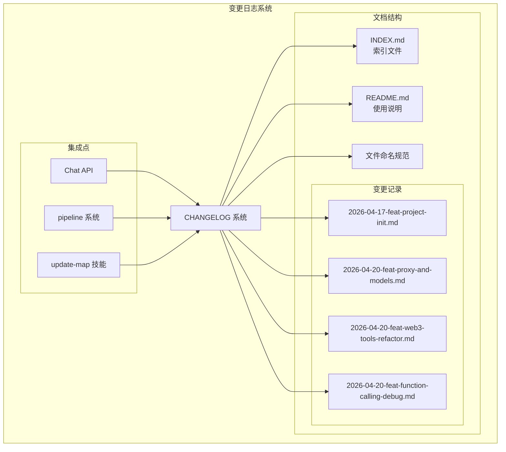
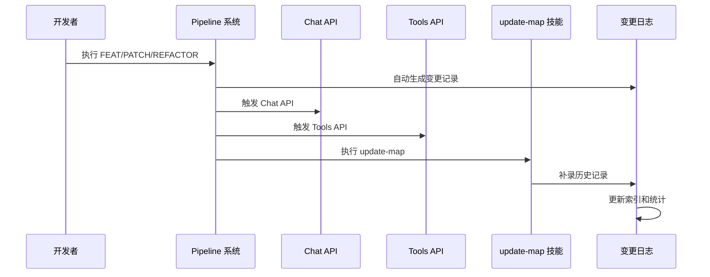
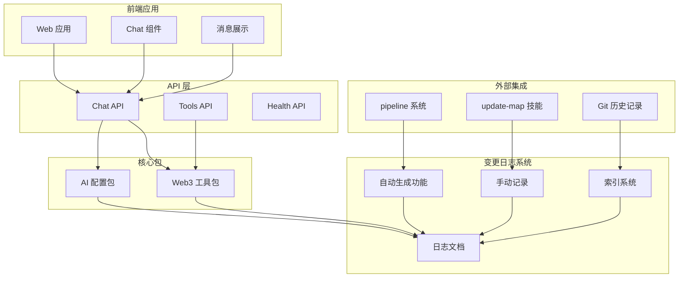
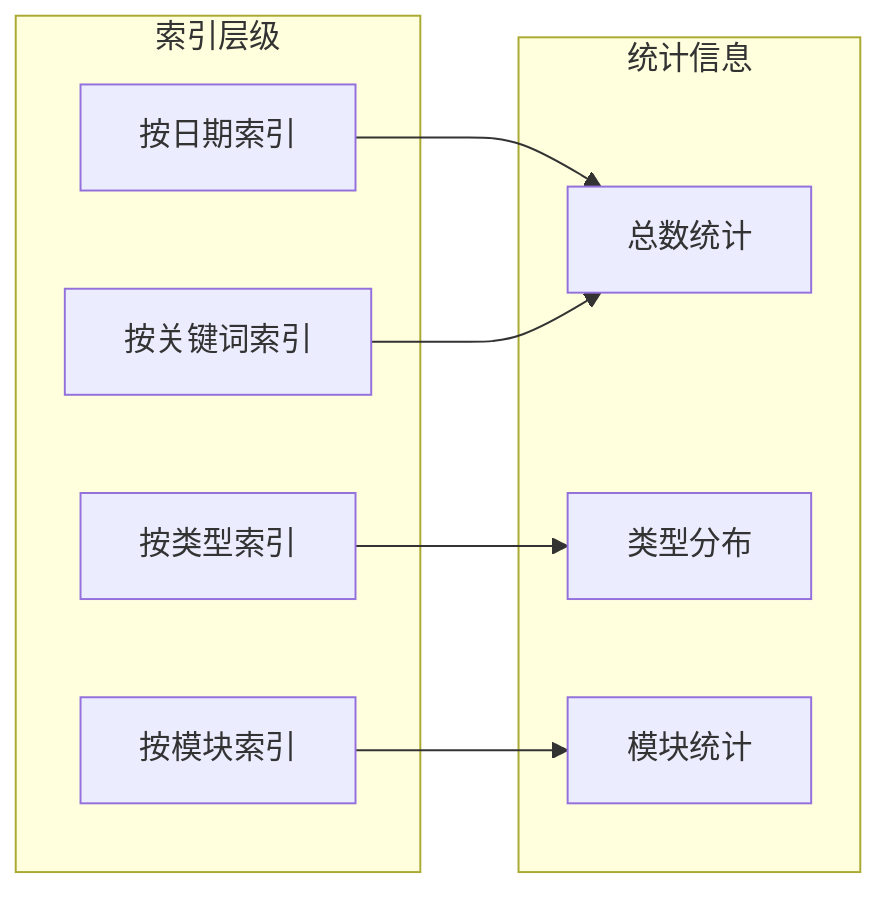
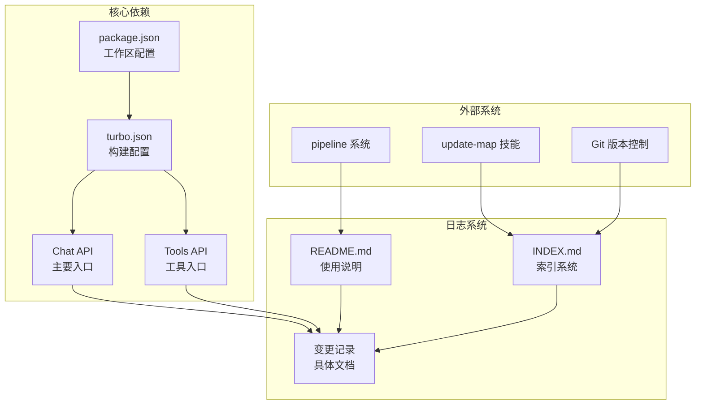

# 变更日志系统

<cite>
**本文档引用的文件**
- [docs/changelog/README.md](file://docs/changelog/README.md)
- [docs/changelog/INDEX.md](file://docs/changelog/INDEX.md)
- [docs/changelog/2026-04-17-feat-project-init.md](file://docs/changelog/2026-04-17-feat-project-init.md)
- [docs/changelog/2026-04-20-feat-proxy-and-models.md](file://docs/changelog/2026-04-20-feat-proxy-and-models.md)
- [docs/changelog/2026-04-20-feat-web3-tools-refactor.md](file://docs/changelog/2026-04-20-feat-web3-tools-refactor.md)
- [docs/changelog/2026-04-20-feat-function-calling-debug.md](file://docs/changelog/2026-04-20-feat-function-calling-debug.md)
- [package.json](file://package.json)
- [turbo.json](file://turbo.json)
- [apps/web/app/api/chat/route.ts](file://apps/web/app/api/chat/route.ts)
- [apps/web/app/api/tools/route.ts](file://apps/web/app/api/tools/route.ts)
- [apps/web/app/page.tsx](file://apps/web/app/page.tsx)
- [packages/ai-config/package.json](file://packages/ai-config/package.json)
- [packages/web3-tools/package.json](file://packages/web3-tools/package.json)
</cite>

## 目录
1. [简介](#简介)
2. [项目结构](#项目结构)
3. [核心组件](#核心组件)
4. [架构概览](#架构概览)
5. [详细组件分析](#详细组件分析)
6. [依赖关系分析](#依赖关系分析)
7. [性能考量](#性能考量)
8. [故障排除指南](#故障排除指南)
9. [结论](#结论)

## 简介

变更日志系统是 Web3 AI Agent 项目中用于记录和追踪代码变更历史的重要基础设施。该系统采用标准化的文档格式，为 AI 和开发者提供完整的变更上下文，支持自动化的变更记录生成和手动补录功能。

系统的核心目标是：
- 提供完整的项目演进历史记录
- 支持 AI 上下文理解和开发者追溯
- 实现自动化和手动相结合的变更记录机制
- 建立标准化的变更分类和文档规范

## 项目结构

变更日志系统位于 `docs/changelog/` 目录下，采用层次化的文件组织结构：



**图表来源**
- [docs/changelog/README.md:1-65](file://docs/changelog/README.md#L1-L65)
- [docs/changelog/INDEX.md:1-61](file://docs/changelog/INDEX.md#L1-L61)

**章节来源**
- [docs/changelog/README.md:1-65](file://docs/changelog/README.md#L1-L65)
- [docs/changelog/INDEX.md:1-61](file://docs/changelog/INDEX.md#L1-L61)

## 核心组件

### 变更记录文档

每个变更记录都遵循统一的结构化格式，包含以下关键要素：

#### 任务信息结构
- **类型标识**：feat/patch/refactor
- **主题描述**：简洁明了的功能说明
- **Pipeline 信息**：执行流程和质量评分
- **时间戳**：完成时间和提交信息

#### 架构设计文档
- **目标声明**：明确的技术目标和预期成果
- **模块边界**：涉及的代码模块和职责划分
- **接口契约**：重要的数据结构和方法签名
- **数据流说明**：关键业务流程的执行路径

#### 变更详情分类
系统支持三种类型的变更记录：
- **新增功能**：新特性、新模块、新接口
- **修改优化**：现有功能的改进和优化
- **删除清理**：废弃代码和过时功能的移除

**章节来源**
- [docs/changelog/2026-04-17-feat-project-init.md:1-114](file://docs/changelog/2026-04-17-feat-project-init.md#L1-L114)
- [docs/changelog/2026-04-20-feat-proxy-and-models.md:1-106](file://docs/changelog/2026-04-20-feat-proxy-and-models.md#L1-L106)
- [docs/changelog/2026-04-20-feat-web3-tools-refactor.md:1-103](file://docs/changelog/2026-04-20-feat-web3-tools-refactor.md#L1-L103)
- [docs/changelog/2026-04-20-feat-function-calling-debug.md:1-59](file://docs/changelog/2026-04-20-feat-function-calling-debug.md#L1-L59)

### 自动化触发机制

变更日志系统支持多种自动触发场景：



**图表来源**
- [docs/changelog/README.md:44-52](file://docs/changelog/README.md#L44-L52)

**章节来源**
- [docs/changelog/README.md:20-52](file://docs/changelog/README.md#L20-L52)

## 架构概览

变更日志系统采用松耦合的设计模式，与核心业务逻辑保持清晰的分离：



**图表来源**
- [apps/web/app/api/chat/route.ts:1-219](file://apps/web/app/api/chat/route.ts#L1-L219)
- [apps/web/app/api/tools/route.ts:1-50](file://apps/web/app/api/tools/route.ts#L1-L50)
- [packages/ai-config/package.json:1-23](file://packages/ai-config/package.json#L1-L23)
- [packages/web3-tools/package.json:1-25](file://packages/web3-tools/package.json#L1-L25)

**章节来源**
- [apps/web/app/api/chat/route.ts:1-219](file://apps/web/app/api/chat/route.ts#L1-L219)
- [apps/web/app/api/tools/route.ts:1-50](file://apps/web/app/api/tools/route.ts#L1-L50)
- [packages/ai-config/package.json:1-23](file://packages/ai-config/package.json#L1-L23)
- [packages/web3-tools/package.json:1-25](file://packages/web3-tools/package.json#L1-L25)

## 详细组件分析

### 文件命名和分类系统

变更日志采用严格的命名规范，确保文件的可识别性和可排序性：

#### 命名规范
```
YYYY-MM-DD-{task-type}.md
```

示例：
- `2026-04-21-feat-chat-integration.md` - 新功能
- `2026-04-22-patch-fix-auth-bug.md` - Bug 修复
- `2026-04-23-refactor-module-split.md` - 重构优化

#### 任务类型分类
- **feat**：新功能开发和重大改进
- **patch**：小规模修复和优化
- **refactor**：架构重构和代码优化

**章节来源**
- [docs/changelog/README.md:5-18](file://docs/changelog/README.md#L5-L18)

### 索引和统计系统

索引系统提供了多层次的信息检索能力：



**图表来源**
- [docs/changelog/INDEX.md:21-55](file://docs/changelog/INDEX.md#L21-L55)

**章节来源**
- [docs/changelog/INDEX.md:1-61](file://docs/changelog/INDEX.md#L1-L61)

### 自动化生成流程

系统实现了完整的自动化变更记录生成机制：

#### 自动触发条件
1. **Pipeline 完成**：FEAT/PATCH/REFACTOR 任务完成后
2. **update-map 执行**：技能更新时
3. **架构设计完成**：特定架构变更完成后

#### 生成内容
- 任务基本信息（类型、主题、Pipeline）
- 架构设计内容（执行了架构技能）
- 变更详情（新增、修改、删除、修复）
- 影响范围（破坏性变更、迁移需求）
- 上下文标记（关键词、相关文档、后续建议）

**章节来源**
- [docs/changelog/README.md:20-36](file://docs/changelog/README.md#L20-L36)
- [docs/changelog/README.md:44-52](file://docs/changelog/README.md#L44-L52)

### 手动补录机制

对于历史记录的补录，系统提供了完整的指导流程：

#### 补录场景
- Git 历史恢复的架构设计
- 早期未记录的重要变更
- 架构演进的关键节点

#### 补录流程
1. **历史分析**：基于 Git 历史分析变更内容
2. **架构重建**：还原当时的架构设计决策
3. **文档编写**：按照标准格式编写变更记录
4. **索引更新**：更新索引文件和统计信息

**章节来源**
- [docs/changelog/README.md:54-65](file://docs/changelog/README.md#L54-L65)

## 依赖关系分析

变更日志系统与项目其他组件存在密切的依赖关系：



**图表来源**
- [turbo.json:1-21](file://turbo.json#L1-L21)
- [package.json:1-28](file://package.json#L1-L28)
- [apps/web/app/api/chat/route.ts:1-219](file://apps/web/app/api/chat/route.ts#L1-L219)
- [apps/web/app/api/tools/route.ts:1-50](file://apps/web/app/api/tools/route.ts#L1-L50)

**章节来源**
- [turbo.json:1-21](file://turbo.json#L1-L21)
- [package.json:1-28](file://package.json#L1-L28)

### 包依赖关系

各核心包之间的依赖关系体现了清晰的模块化设计：

#### AI 配置包依赖
- **openai**：OpenAI API 客户端
- **@anthropic-ai/sdk**：Anthropic Claude API 客户端

#### Web3 工具包依赖
- **ethers**：以太坊区块链交互库
- **node-fetch**：HTTP 请求库（替代原生 fetch）
- **https-proxy-agent**：HTTP 代理支持

**章节来源**
- [packages/ai-config/package.json:13-16](file://packages/ai-config/package.json#L13-L16)
- [packages/web3-tools/package.json:13-17](file://packages/web3-tools/package.json#L13-L17)

## 性能考量

变更日志系统在设计时充分考虑了性能和可维护性：

### 存储效率
- **文本格式**：使用 Markdown 格式，占用空间小
- **结构化数据**：统一的文档结构便于解析和处理
- **增量更新**：支持增量索引更新，避免全量重建

### 访问性能
- **静态文件**：文档为静态文件，访问速度快
- **索引优化**：多维度索引系统支持快速检索
- **缓存友好**：适合 CDN 缓存和本地缓存

### 维护成本
- **模板化**：标准化的文档模板降低维护成本
- **自动化**：减少人工维护的工作量
- **版本控制**：与 Git 集成，天然支持版本追踪

## 故障排除指南

### 常见问题及解决方案

#### 变更记录未生成
**症状**：执行 pipeline 后未生成变更记录
**可能原因**：
- 环境变量配置错误
- 权限不足
- 网络连接问题

**解决方案**：
1. 检查环境变量配置
2. 验证权限设置
3. 确认网络连接状态

#### 索引不准确
**症状**：索引文件与实际文档不匹配
**可能原因**：
- 手动修改了文件名
- 未更新索引文件
- 文件编码问题

**解决方案**：
1. 按照命名规范重命名文件
2. 手动更新索引文件
3. 检查文件编码格式

#### 文档格式错误
**症状**：文档无法正确渲染
**可能原因**：
- Markdown 语法错误
- 缺少必需字段
- 格式不规范

**解决方案**：
1. 使用 Markdown 校验工具
2. 检查必需字段完整性
3. 参考标准模板格式

**章节来源**
- [docs/changelog/README.md:31-36](file://docs/changelog/README.md#L31-L36)

### 调试支持

系统提供了完善的调试和诊断功能：

#### 调试日志
在 Chat API 中实现了详细的 Function Calling 调试日志：
- 第一次 API 调用的完整消息流
- 工具定义和调用过程
- 第二次 API 调用的最终回复

#### 错误处理
- 区分配置错误和其他错误类型
- 提供友好的错误提示信息
- 支持详细的错误堆栈追踪

**章节来源**
- [apps/web/app/api/chat/route.ts:107-118](file://apps/web/app/api/chat/route.ts#L107-L118)
- [apps/web/app/api/chat/route.ts:180-189](file://apps/web/app/api/chat/route.ts#L180-L189)
- [apps/web/app/api/chat/route.ts:201-217](file://apps/web/app/api/chat/route.ts#L201-L217)

## 结论

变更日志系统作为 Web3 AI Agent 项目的重要基础设施，展现了良好的设计和实现：

### 系统优势
- **标准化程度高**：统一的文档格式和命名规范
- **自动化程度好**：支持多种自动触发场景
- **可扩展性强**：模块化设计便于功能扩展
- **维护成本低**：模板化和自动化减少维护工作

### 技术特色
- **多维度索引**：支持按日期、类型、模块、关键词等多种方式检索
- **智能统计**：自动统计各类变更的数量和分布
- **关键词提取**：自动提取和管理关键词索引
- **历史补录**：支持历史记录的补录和还原

### 发展建议
1. **增强搜索功能**：可以考虑添加全文搜索引擎
2. **可视化展示**：增加变更趋势和统计图表
3. **版本对比**：提供不同版本间的变更对比功能
4. **API 接口**：对外提供变更日志的 API 接口

该系统为项目的长期发展奠定了坚实的基础，既满足了当前的需求，也为未来的扩展预留了充足的空间。