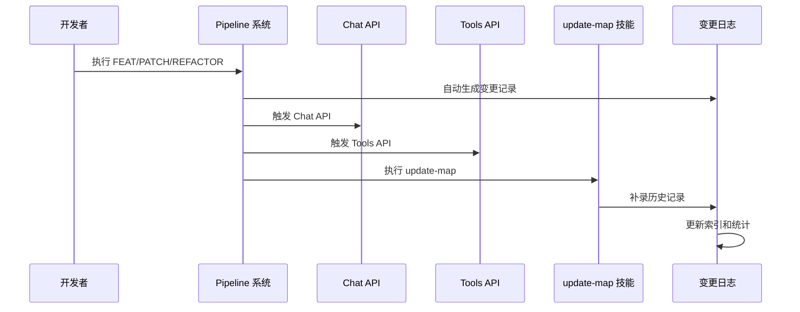
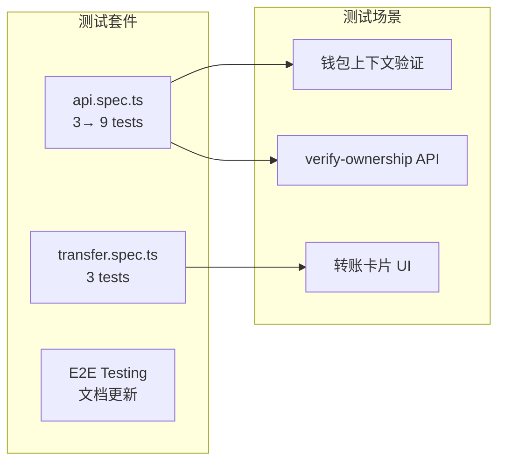

# 变更日志系统

<cite>
**本文档引用的文件**
- [docs/changelog/README.md](file://docs/changelog/README.md)
- [docs/changelog/INDEX.md](file://docs/changelog/INDEX.md)
- [docs/changelog/2026-04-17-feat-project-init.md](file://docs/changelog/2026-04-17-feat-project-init.md)
- [docs/changelog/2026-04-20-feat-proxy-and-models.md](file://docs/changelog/2026-04-20-feat-proxy-and-models.md)
- [docs/changelog/2026-04-20-feat-web3-tools-refactor.md](file://docs/changelog/2026-04-20-feat-web3-tools-refactor.md)
- [docs/changelog/2026-04-21-feat-memory-management.md](file://docs/changelog/2026-04-21-feat-memory-management.md)
- [docs/changelog/2026-04-21-feat-sse-streaming.md](file://docs/changelog/2026-04-21-feat-sse-streaming.md)
- [docs/changelog/2026-04-22-feat-multichain-web3-tools.md](file://docs/changelog/2026-04-22-feat-multichain-web3-tools.md)
- [docs/changelog/2026-04-23-feat-wallet-persistence-and-conversations.md](file://docs/changelog/2026-04-23-feat-wallet-persistence-and-conversations.md)
- [docs/changelog/2026-04-24-feat-web3-transfer-card.md](file://docs/changelog/2026-04-24-feat-web3-transfer-card.md)
- [docs/changelog/2026-04-28-feat-p1-completion.md](file://docs/changelog/2026-04-28-feat-p1-completion.md)
- [apps/web/app/config.ts](file://apps/web/app/config.ts)
- [apps/web/app/providers.tsx](file://apps/web/app/providers.tsx)
- [apps/web/app/layout.tsx](file://apps/web/app/layout.tsx)
- [apps/web/app/page.tsx](file://apps/web/app/page.tsx)
- [apps/web/app/api/chat/route.ts](file://apps/web/app/api/chat/route.ts)
- [apps/web/app/api/supabase/verify-ownership/route.ts](file://apps/web/app/api/supabase/verify-ownership/route.ts)
- [apps/web/app/api/supabase/delete-conversation/route.ts](file://apps/web/app/api/supabase/delete-conversation/route.ts)
- [apps/web/hooks/useChatStream.ts](file://apps/web/hooks/useChatStream.ts)
- [apps/web/components/MessageItem.tsx](file://apps/web/components/MessageItem.tsx)
- [apps/web/components/ConversationHistory.tsx](file://apps/web/components/ConversationHistory.tsx)
- [apps/web/components/WalletConnectButton.tsx](file://apps/web/components/WalletConnectButton.tsx)
- [apps/web/components/cards/TransferCard.tsx](file://apps/web/components/cards/TransferCard.tsx)
- [apps/web/components/cards/index.ts](file://apps/web/components/cards/index.ts)
- [apps/web/lib/supabase/client.ts](file://apps/web/lib/supabase/client.ts)
- [apps/web/lib/supabase/conversations.ts](file://apps/web/lib/supabase/conversations.ts)
- [apps/web/lib/supabase/transfers.ts](file://apps/web/lib/supabase/transfers.ts)
- [apps/web/lib/tokens.ts](file://apps/web/lib/tokens.ts)
- [apps/web/types/chat.ts](file://apps/web/types/chat.ts)
- [apps/web/types/stream.ts](file://apps/web/types/stream.ts)
- [apps/web/types/transfer.ts](file://apps/web/types/transfer.ts)
- [packages/web3-tools/src/index.ts](file://packages/web3-tools/src/index.ts)
- [packages/web3-tools/src/transfer.ts](file://packages/web3-tools/src/transfer.ts)
- [supabase/init.sql](file://supabase/init.sql)
- [supabase/migrations/create_transfer_cards.sql](file://supabase/migrations/create_transfer_cards.sql)
- [supabase/migrations/fix_transfer_cards_rls.sql](file://supabase/migrations/fix_transfer_cards_rls.sql)
- [supabase/migrations/alter_messages_id_type.sql](file://supabase/migrations/alter_messages_id_type.sql)
- [supabase/migrations/upgrade_production_rls.sql](file://supabase/migrations/upgrade_production_rls.sql)
- [apps/web/package.json](file://apps/web/package.json)
- [apps/web/next.config.js](file://apps/web/next.config.js)
- [apps/web/.env.example](file://apps/web/.env.example)
- [package.json](file://package.json)
- [turbo.json](file://turbo.json)
- [e2e/api.spec.ts](file://e2e/api.spec.ts)
- [e2e/transfer.spec.ts](file://e2e/transfer.spec.ts)
- [docs/DEPLOYMENT.md](file://docs/DEPLOYMENT.md)
</cite>

## 更新摘要
**变更内容**
- 新增P1任务全量交付文档，记录RLS升级、E2E测试覆盖扩展、质量改进等里程碑成果
- 更新索引系统，包含新增的RLS升级和E2E测试相关记录
- 增强安全架构，实现服务端所有权验证和双重防护机制
- 完善测试体系，新增转账卡片UI测试和钱包上下文验证测试
- 优化部署文档，新增生产环境RLS升级指南

## 目录
1. [简介](#简介)
2. [项目结构](#项目结构)
3. [核心组件](#核心组件)
4. [架构概览](#架构概览)
5. [详细组件分析](#详细组件分析)
6. [依赖关系分析](#依赖关系分析)
7. [性能考量](#性能考量)
8. [故障排除指南](#故障排除指南)
9. [结论](#结论)

## 简介

变更日志系统是 Web3 AI Agent 项目中用于记录和追踪代码变更历史的重要基础设施。该系统采用标准化的文档格式，为 AI 和开发者提供完整的变更上下文，支持自动化的变更记录生成和手动补录功能。

系统的核心目标是：
- 提供完整的项目演进历史记录
- 支持 AI 上下文理解和开发者追溯
- 实现自动化和手动相结合的变更记录机制
- 建立标准化的变更分类和文档规范

**更新** 新增了P1任务全量交付的完整变更日志，包括RLS安全升级、E2E测试覆盖扩展、钱包地址格式验证、SSR主题闪烁修复等里程碑成果，标志着项目在安全性、稳定性和质量方面的重大提升。

## 项目结构

变更日志系统位于 `docs/changelog/` 目录下，采用层次化的文件组织结构：

```mermaid
graph TB
subgraph "变更日志系统"
CL[CHANGELOG 系统]
subgraph "文档结构"
IDX[INDEX.md<br/>索引文件]
RMD[README.md<br/>使用说明]
FMT[文件命名规范]
subgraph "变更记录"
D17[2026-04-17-feat-project-init.md]
D20_1[2026-04-20-feat-proxy-and-models.md]
D20_2[2026-04-20-feat-web3-tools-refactor.md]
D21_1[2026-04-21-feat-memory-management.md]
D21_2[2026-04-21-feat-sse-streaming.md]
D22[2026-04-22-feat-multichain-web3-tools.md]
D23[2026-04-23-feat-wallet-persistence-and-conversations.md]
D24[2026-04-24-feat-web3-transfer-card.md]
D28[2026-04-28-feat-p1-completion.md]
end
end
subgraph "集成点"
API[Chat API]
PIPE[pipeline 系统]
UPDATE[update-map 技能]
end
CL --> IDX
CL --> RMD
CL --> FMT
CL --> D17
CL --> D20_1
CL --> D20_2
CL --> D21_1
CL --> D21_2
CL --> D22
CL --> D23
CL --> D24
CL --> D28
API --> CL
PIPE --> CL
UPDATE --> CL
```

**图表来源**
- [docs/changelog/README.md:1-65](file://docs/changelog/README.md#L1-L65)
- [docs/changelog/INDEX.md:1-109](file://docs/changelog/INDEX.md#L1-L109)

**章节来源**
- [docs/changelog/README.md:1-65](file://docs/changelog/README.md#L1-L65)
- [docs/changelog/INDEX.md:1-109](file://docs/changelog/INDEX.md#L1-L109)

## 核心组件

### 变更记录文档

每个变更记录都遵循统一的结构化格式，包含以下关键要素：

#### 任务信息结构
- **类型标识**：feat/patch/refactor
- **主题描述**：简洁明了的功能说明
- **Pipeline 信息**：执行流程和质量评分
- **时间戳**：完成时间和提交信息

#### 架构设计文档
- **目标声明**：明确的技术目标和预期成果
- **模块边界**：涉及的代码模块和职责划分
- **接口契约**：重要的数据结构和方法签名
- **数据流说明**：关键业务流程的执行路径

#### 变更详情分类
系统支持三种类型的变更记录：
- **新增功能**：新特性、新模块、新接口
- **修改优化**：现有功能的改进和优化
- **删除清理**：废弃代码和过时功能的移除

**更新** 新增了P1任务全量交付文档，包含RLS安全升级、E2E测试覆盖扩展、质量改进等重要里程碑成果，显著提升了系统的安全性和稳定性。

**章节来源**
- [docs/changelog/2026-04-17-feat-project-init.md:1-114](file://docs/changelog/2026-04-17-feat-project-init.md#L1-L114)
- [docs/changelog/2026-04-20-feat-proxy-and-models.md:1-106](file://docs/changelog/2026-04-20-feat-proxy-and-models.md#L1-L106)
- [docs/changelog/2026-04-20-feat-web3-tools-refactor.md:1-103](file://docs/changelog/2026-04-20-feat-web3-tools-refactor.md#L1-L103)
- [docs/changelog/2026-04-21-feat-memory-management.md:1-142](file://docs/changelog/2026-04-21-feat-memory-management.md#L1-L142)
- [docs/changelog/2026-04-21-feat-sse-streaming.md:1-133](file://docs/changelog/2026-04-21-feat-sse-streaming.md#L1-L133)
- [docs/changelog/2026-04-22-feat-multichain-web3-tools.md:1-242](file://docs/changelog/2026-04-22-feat-multichain-web3-tools.md#L1-L242)
- [docs/changelog/2026-04-23-feat-wallet-persistence-and-conversations.md:1-114](file://docs/changelog/2026-04-23-feat-wallet-persistence-and-conversations.md#L1-L114)
- [docs/changelog/2026-04-24-feat-web3-transfer-card.md:1-253](file://docs/changelog/2026-04-24-feat-web3-transfer-card.md#L1-L253)
- [docs/changelog/2026-04-28-feat-p1-completion.md:1-98](file://docs/changelog/2026-04-28-feat-p1-completion.md#L1-L98)

### 自动化触发机制

变更日志系统支持多种自动触发场景：



**图表来源**
- [docs/changelog/README.md:44-52](file://docs/changelog/README.md#L44-L52)

**章节来源**
- [docs/changelog/README.md:20-52](file://docs/changelog/README.md#L20-L52)

## 架构概览

变更日志系统采用松耦合的设计模式，与核心业务逻辑保持清晰的分离：

```mermaid
graph TB
subgraph "前端应用"
WEB[Web 应用]
CHAT[Chat 组件]
MSG[消息展示]
MEM[Memory 管理器]
WALLET[钱包连接]
CONV[对话历史]
CARD[转账卡片]
END
subgraph "认证层"
CONFIG[wagmi 配置]
PROVIDERS[Web3 Provider]
LAYOUT[Layout SSR]
END
subgraph "数据层"
SUPABASE[Supabase 数据库]
CLIENT[Supabase 客户端]
DA_LAYER[数据访问层]
END
subgraph "AI 层"
CHAT_API[Chat API]
TOOLS_API[Tools API]
HEALTH_API[Health API]
END
subgraph "核心包"
AI_CONFIG[AI 配置包]
WEB3_TOOLS[Web3 工具包]
END
subgraph "变更日志系统"
LOG_DOC[日志文档]
AUTO_GEN[自动生成功能]
MANUAL_REC[手动记录]
INDEX_SYS[索引系统]
END
subgraph "外部集成"
PIPELINE[pipeline 系统]
UPDATE_MAP[update-map 技能]
GIT[Git 历史记录]
END
WEB --> CHAT_API
CHAT --> CHAT_API
MSG --> CHAT_API
MEM --> CHAT_API
WALLET --> CONFIG
WALLET --> PROVIDERS
WALLET --> LAYOUT
CONV --> DA_LAYER
CARD --> TRANSFER_CARD
CONFIG --> LAYOUT
PROVIDERS --> WALLET
DA_LAYER --> SUPABASE
SUPABASE --> CLIENT
CLIENT --> DA_LAYER
CHAT_API --> AI_CONFIG
CHAT_API --> WEB3_TOOLS
TOOLS_API --> WEB3_TOOLS
AI_CONFIG --> LOG_DOC
WEB3_TOOLS --> LOG_DOC
PIPELINE --> AUTO_GEN
UPDATE_MAP --> MANUAL_REC
GIT --> INDEX_SYS
AUTO_GEN --> LOG_DOC
MANUAL_REC --> LOG_DOC
INDEX_SYS --> LOG_DOC
```

**更新** 新增了P1任务相关的安全架构组件，包括服务端所有权验证API、RLS升级策略、E2E测试框架等，显著增强了系统的安全性和可靠性。

**图表来源**
- [apps/web/app/api/chat/route.ts:1-513](file://apps/web/app/api/chat/route.ts#L1-L513)
- [apps/web/app/page.tsx:1-407](file://apps/web/app/page.tsx#L1-L407)
- [apps/web/components/cards/TransferCard.tsx:1-563](file://apps/web/components/cards/TransferCard.tsx#L1-L563)
- [apps/web/lib/supabase/transfers.ts:1-142](file://apps/web/lib/supabase/transfers.ts#L1-L142)
- [apps/web/lib/tokens.ts:1-85](file://apps/web/lib/tokens.ts#L1-L85)
- [packages/web3-tools/src/transfer.ts:1-99](file://packages/web3-tools/src/transfer.ts#L1-L99)
- [apps/web/app/api/supabase/verify-ownership/route.ts:1-95](file://apps/web/app/api/supabase/verify-ownership/route.ts#L1-L95)
- [apps/web/app/api/supabase/delete-conversation/route.ts:1-122](file://apps/web/app/api/supabase/delete-conversation/route.ts#L1-L122)

**章节来源**
- [apps/web/app/api/chat/route.ts:1-513](file://apps/web/app/api/chat/route.ts#L1-L513)
- [apps/web/app/page.tsx:1-407](file://apps/web/app/page.tsx#L1-L407)
- [apps/web/components/cards/TransferCard.tsx:1-563](file://apps/web/components/cards/TransferCard.tsx#L1-L563)
- [apps/web/lib/supabase/transfers.ts:1-142](file://apps/web/lib/supabase/transfers.ts#L1-L142)
- [apps/web/lib/tokens.ts:1-85](file://apps/web/lib/tokens.ts#L1-L85)
- [packages/web3-tools/src/transfer.ts:1-99](file://packages/web3-tools/src/transfer.ts#L1-L99)
- [apps/web/app/api/supabase/verify-ownership/route.ts:1-95](file://apps/web/app/api/supabase/verify-ownership/route.ts#L1-L95)
- [apps/web/app/api/supabase/delete-conversation/route.ts:1-122](file://apps/web/app/api/supabase/delete-conversation/route.ts#L1-L122)

## 详细组件分析

### 文件命名和分类系统

变更日志采用严格的命名规范，确保文件的可识别性和可排序性：

#### 命名规范
```
YYYY-MM-DD-{task-type}.md
```

示例：
- `2026-04-21-feat-chat-integration.md` - 新功能
- `2026-04-22-patch-fix-auth-bug.md` - Bug 修复
- `2026-04-23-refactor-module-split.md` - 重构优化

#### 任务类型分类
- **feat**：新功能开发和重大改进
- **patch**：小规模修复和优化
- **refactor**：架构重构和代码优化

**章节来源**
- [docs/changelog/README.md:5-18](file://docs/changelog/README.md#L5-L18)

### P1任务全量交付

**新增** P1任务全量交付文档记录了项目在安全性、测试覆盖和质量改进方面的重大里程碑，包括RLS升级、E2E测试覆盖扩展、钱包地址格式验证等关键成果。

#### RLS安全升级架构

P1任务的核心是实现生产环境的安全升级，从应用层防护转向数据库层+服务端API双重防护：

```mermaid
graph TB
subgraph "删除操作安全流程"
A[用户点击删除] --> B[verify-ownership API]
B --> C{数据库查询}
C --> |wallet_address 匹配| D[delete-conversation API]
C --> |不匹配| E[返回 403 拒绝]
D --> F[删除 messages + conversations]
end
subgraph "API 路由"
G[/api/supabase/verify-ownership]
H[/api/supabase/delete-conversation]
I[/api/chat]
end
subgraph "数据库"
J[(conversations)]
K[(messages)]
end
G --> J
H --> K
I --> |walletAddress 验证| I
```

**图表来源**
- [docs/changelog/2026-04-28-feat-p1-completion.md:65-89](file://docs/changelog/2026-04-28-feat-p1-completion.md#L65-L89)

#### 服务端所有权验证API

新增的verify-ownership API实现了双重验证机制：

```typescript
// verify-ownership API - 服务端验证对话所有权
export async function POST(request: NextRequest) {
  try {
    const body = await request.json()
    const { conversationId, walletAddress } = body

    // 参数验证
    if (!conversationId || typeof conversationId !== 'string') {
      return NextResponse.json(
        { isOwner: false, error: '缺少 conversationId 参数' },
        { status: 400 }
      )
    }

    if (!walletAddress || typeof walletAddress !== 'string') {
      return NextResponse.json(
        { isOwner: false, error: '缺少 walletAddress 参数' },
        { status: 400 }
      )
    }

    // 验证钱包地址格式
    if (!/^0x[a-fA-F0-9]{40}$/.test(walletAddress)) {
      return NextResponse.json(
        { isOwner: false, error: '无效的钱包地址格式' },
        { status: 400 }
      )
    }

    // 优先使用 service_role 密钥（服务端特权访问，绕过 RLS）
    const supabaseUrl = process.env.NEXT_PUBLIC_SUPABASE_URL
    const serviceRoleKey = process.env.SUPABASE_SERVICE_ROLE_KEY
    const anonKey = process.env.NEXT_PUBLIC_SUPABASE_ANON_KEY

    if (!supabaseKey) {
      return NextResponse.json(
        { isOwner: false, error: 'Supabase 密钥未配置' },
        { status: 500 }
      )
    }

    const supabase = createClient(supabaseUrl, supabaseKey)

    // 查询对话的 wallet_address
    const { data, error } = await supabase
      .from('conversations')
      .select('wallet_address')
      .eq('id', conversationId)
      .single()

    if (error || !data) {
      return NextResponse.json(
        { isOwner: false, error: '对话不存在' },
        { status: 404 }
      )
    }

    // 验证所有权
    const isOwner = data.wallet_address === walletAddress

    return NextResponse.json({ isOwner })
  } catch (error) {
    return NextResponse.json(
      { isOwner: false, error: '服务器内部错误' },
      { status: 500 }
    )
  }
}
```

#### RLS升级策略

生产环境RLS策略从应用层防护升级为严格模式：

```sql
-- conversations 表策略
-- SELECT: 应用层通过 wallet_address 过滤，RLS 允许所有读取
-- INSERT: 应用层保证 wallet_address 正确，RLS 放行
-- UPDATE: 同 INSERT
-- DELETE: 严格模式，需要会话变量匹配（服务端 API 绕过 RLS 执行删除）
--         前端直接调用将因无法设置会话变量而被 RLS 拦截

CREATE POLICY "conversations_delete_policy"
  ON conversations FOR DELETE
  USING (
    wallet_address = current_setting('app.current_wallet_address', true)
  );  -- 需要会话变量，仅服务端 API 可执行
```

#### E2E测试覆盖扩展

P1任务显著扩展了测试覆盖范围，新增了多个关键测试场景：



**图表来源**
- [docs/changelog/2026-04-28-feat-p1-completion.md:30-53](file://docs/changelog/2026-04-28-feat-p1-completion.md#L30-L53)

#### 转账卡片UI测试

新增的transfer.spec.ts测试确保转账卡片功能的正确性：

```typescript
// 转账卡片测试场景
test('发送转账指令应该触发 AI 生成转账卡片', async ({ page }) => {
  const chatInput = page.locator('textarea').first()
  await chatInput.fill('转账 0.001 ETH 到 0xd8dA6BF26964aF9D7eEd9e03E53415D37aA96045 on ethereum')
  await chatInput.press('Enter')

  // 等待 AI 回复完成
  await waitForAIResponse(chatInput)

  // 验证消息列表有内容
  const messages = page.locator('[class*="message"]')
  const count = await messages.count()
  expect(count).toBeGreaterThan(0)

  // 检查是否渲染了转账卡片
  const pageText = await page.textContent('body')
  const hasTransferCard = pageText?.includes('DEX 转账') || false
  const hasResponse = pageText?.includes('ETH') || pageText?.includes('转账') || false

  expect(hasTransferCard || hasResponse).toBeTruthy()
})
```

#### 钱包地址格式验证

聊天API新增了钱包地址格式验证功能：

```typescript
// 钱包地址格式验证函数
function isValidEthereumAddress(address: string): boolean {
  return /^0x[a-fA-F0-9]{40}$/.test(address)
}

// 在系统提示注入前验证钱包地址格式
if (walletAddress && !isValidEthereumAddress(walletAddress)) {
  return NextResponse.json(
    { error: '无效的钱包地址格式' },
    { status: 400 }
  )
}
```

#### SSR主题闪烁修复

确认layout.tsx中已正确配置内联同步脚本：

```typescript
// 确保在 React 执行前设置 data-theme 和 dark class
// 通过内联脚本实现 SSR 主题一致性
```

#### 数据持久化增强

ConversationHistory组件实现了完整的双重验证流程：

```typescript
const handleDeleteConfirm = async () => {
  if (!pendingDeleteId || !address) return

  try {
    setIsDeleting(true)
    
    // Step 1: 服务端验证所有权
    const verifyRes = await fetch('/api/supabase/verify-ownership', {
      method: 'POST',
      headers: { 'Content-Type': 'application/json' },
      body: JSON.stringify({
        conversationId: pendingDeleteId,
        walletAddress: address,
      }),
    })
    
    const verifyData = await verifyRes.json()
    
    if (!verifyData.isOwner) {
      throw new Error(verifyData.error || '无权删除此对话')
    }
    
    // Step 2: 服务端删除对话
    const deleteRes = await fetch('/api/supabase/delete-conversation', {
      method: 'POST',
      headers: { 'Content-Type': 'application/json' },
      body: JSON.stringify({
        conversationId: pendingDeleteId,
        walletAddress: address,
      }),
    })
    
    const deleteData = await deleteRes.json()
    
    if (!deleteData.success) {
      throw new Error(deleteData.error || '删除对话失败')
    }
    
    // 更新UI状态
    setConversations((prev) => prev.filter((c) => c.id !== pendingDeleteId))
    if (activeConversationId === pendingDeleteId) {
      onNewConversation()
    }
  } catch (error) {
    console.error('Failed to delete conversation:', error)
  } finally {
    setIsDeleting(false)
    setPendingDeleteId(null)
    setShowDeleteDialog(false)
  }
}
```

#### 部署文档更新

新增了完整的生产环境RLS升级指南：

```markdown
## 生产环境 RLS 升级指南

### 背景
当前数据库 RLS 策略使用 `USING (true)`，仅依赖应用层 `verifyWalletContext()` 做数据隔离。Delete 操作已通过服务端 API 实现双重验证。生产环境应进一步提升安全层级。

### RLS 策略说明
当前开发环境策略（`supabase/init.sql`）：
- SELECT/INSERT/UPDATE：全放行（应用层控制）
- DELETE：全放行（已通过服务端 API 保护）

生产环境策略（`supabase/migrations/upgrade_production_rls.sql`）：
- SELECT/INSERT/UPDATE：不变
- DELETE：需 `current_setting('app.current_wallet_address')` 匹配，仅服务端 API 可执行
```

**章节来源**
- [docs/changelog/2026-04-28-feat-p1-completion.md:1-98](file://docs/changelog/2026-04-28-feat-p1-completion.md#L1-L98)
- [apps/web/app/api/supabase/verify-ownership/route.ts:1-95](file://apps/web/app/api/supabase/verify-ownership/route.ts#L1-L95)
- [apps/web/app/api/supabase/delete-conversation/route.ts:1-122](file://apps/web/app/api/supabase/delete-conversation/route.ts#L1-L122)
- [apps/web/components/ConversationHistory.tsx:96-146](file://apps/web/components/ConversationHistory.tsx#L96-L146)
- [e2e/api.spec.ts:64-161](file://e2e/api.spec.ts#L64-L161)
- [e2e/transfer.spec.ts:19-86](file://e2e/transfer.spec.ts#L19-L86)
- [supabase/migrations/upgrade_production_rls.sql:1-148](file://supabase/migrations/upgrade_production_rls.sql#L1-L148)
- [docs/DEPLOYMENT.md:595-684](file://docs/DEPLOYMENT.md#L595-L684)

### 索引和统计系统

索引系统提供了多层次的信息检索能力：

```mermaid
graph LR
subgraph "索引层级"
DATE[按日期索引]
TYPE[按类型索引]
MODULE[按模块索引]
KEYWORD[按关键词索引]
END
subgraph "统计信息"
COUNT[总数统计]
DISTRIBUTION[类型分布]
MODULE_STATS[模块统计]
END
DATE --> COUNT
TYPE --> DISTRIBUTION
MODULE --> MODULE_STATS
KEYWORD --> COUNT
```

**更新** 新增了P1任务相关的关键词索引，包括RLS升级、安全增强、E2E测试、钱包上下文验证等，显著扩展了索引系统的覆盖范围。

**图表来源**
- [docs/changelog/INDEX.md:21-55](file://docs/changelog/INDEX.md#L21-L55)

**章节来源**
- [docs/changelog/INDEX.md:1-109](file://docs/changelog/INDEX.md#L1-L109)

### 自动化生成流程

系统实现了完整的自动化变更记录生成机制：

#### 自动触发条件
1. **Pipeline 完成**：FEAT/PATCH/REFACTOR 任务完成后
2. **update-map 执行**：技能更新时
3. **架构设计完成**：特定架构变更完成后

#### 生成内容
- 任务基本信息（类型、主题、Pipeline）
- 架构设计内容（执行了架构技能）
- 变更详情（新增、修改、删除、修复）
- 影响范围（破坏性变更、迁移需求）
- 上下文标记（关键词、相关文档、后续建议）

**章节来源**
- [docs/changelog/README.md:20-36](file://docs/changelog/README.md#L20-L36)
- [docs/changelog/README.md:44-52](file://docs/changelog/README.md#L44-L52)

### 手动补录机制

对于历史记录的补录，系统提供了完整的指导流程：

#### 补录场景
- Git 历史恢复的架构设计
- 早期未记录的重要变更
- 架构演进的关键节点

#### 补录流程
1. **历史分析**：基于 Git 历史分析变更内容
2. **架构重建**：还原当时的架构设计决策
3. **文档编写**：按照标准格式编写变更记录
4. **索引更新**：更新索引文件和统计信息

**章节来源**
- [docs/changelog/README.md:54-65](file://docs/changelog/README.md#L54-L65)

## 依赖关系分析

变更日志系统与项目其他组件存在密切的依赖关系：

```mermaid
graph TB
subgraph "核心依赖"
TURBO[turbo.json<br/>构建配置]
PKG[package.json<br/>工作区配置]
CHAT_API[Chat API<br/>主要入口]
TOOLS_API[Tools API<br/>工具入口]
MEM_LIB[Memory Library<br/>内存管理模块]
WEB3_TOOLS[Web3 Tools<br/>多链工具包]
WALLET_DEPS[wallet-connect<br/>依赖包]
SUPABASE_DEPS[supabase-js<br/>依赖包]
TOKEN_DEPS[viem<br/>依赖包]
END
subgraph "日志系统"
LOG_README[README.md<br/>使用说明]
LOG_INDEX[INDEX.md<br/>索引系统]
LOG_DOCS[变更记录<br/>具体文档]
END
subgraph "外部系统"
PIPELINE[pipeline 系统]
UPDATE_MAP[update-map 技能]
GIT[Git 版本控制]
END
TURBO --> CHAT_API
TURBO --> TOOLS_API
TURBO --> MEM_LIB
TURBO --> WEB3_TOOLS
TURBO --> WALLET_DEPS
TURBO --> SUPABASE_DEPS
TURBO --> TOKEN_DEPS
PKG --> TURBO
CHAT_API --> LOG_DOCS
TOOLS_API --> LOG_DOCS
MEM_LIB --> LOG_DOCS
WEB3_TOOLS --> LOG_DOCS
WALLET_DEPS --> LOG_DOCS
SUPABASE_DEPS --> LOG_DOCS
TOKEN_DEPS --> LOG_DOCS
PIPELINE --> LOG_README
UPDATE_MAP --> LOG_INDEX
GIT --> LOG_INDEX
LOG_README --> LOG_DOCS
LOG_INDEX --> LOG_DOCS
```

**更新** 新增了P1任务相关的安全和测试依赖关系，包括Supabase服务端密钥、RLS策略、E2E测试框架等，显著增强了系统的安全性和可靠性。

**图表来源**
- [turbo.json:1-21](file://turbo.json#L1-L21)
- [package.json:1-28](file://package.json#L1-L28)
- [apps/web/package.json:12-31](file://apps/web/package.json#L12-L31)
- [apps/web/app/api/chat/route.ts:1-513](file://apps/web/app/api/chat/route.ts#L1-L513)
- [apps/web/app/page.tsx:1-407](file://apps/web/app/page.tsx#L1-L407)
- [apps/web/components/cards/TransferCard.tsx:1-563](file://apps/web/components/cards/TransferCard.tsx#L1-L563)
- [packages/web3-tools/src/transfer.ts:1-99](file://packages/web3-tools/src/transfer.ts#L1-L99)
- [apps/web/app/api/supabase/verify-ownership/route.ts:1-95](file://apps/web/app/api/supabase/verify-ownership/route.ts#L1-L95)
- [apps/web/app/api/supabase/delete-conversation/route.ts:1-122](file://apps/web/app/api/supabase/delete-conversation/route.ts#L1-L122)

**章节来源**
- [turbo.json:1-21](file://turbo.json#L1-L21)
- [package.json:1-28](file://package.json#L1-L28)
- [apps/web/package.json:12-31](file://apps/web/package.json#L12-L31)

### 包依赖关系

各核心包之间的依赖关系体现了清晰的模块化设计：

#### AI 配置包依赖
- **openai**：OpenAI API 客户端
- **@anthropic-ai/sdk**：Anthropic Claude API 客户端

#### Web3 工具包依赖
- **ethers**：以太坊区块链交互库
- **node-fetch**：HTTP 请求库（替代原生 fetch）
- **https-proxy-agent**：HTTP 代理支持
- **viem**：现代以太坊交互库（新增）

#### 钱包连接依赖
- **@rainbow-me/rainbowkit**：钱包连接UI组件库
- **wagmi**：以太坊钱包连接框架
- **@tanstack/react-query**：React 状态管理

#### Supabase 依赖
- **@supabase/supabase-js**：Supabase 客户端SDK
- **服务端密钥**：SUPABASE_SERVICE_ROLE_KEY（新增）

#### 转账卡片依赖
- **viem**：用于地址验证、单位转换和链上交互
- **next/image**：优化Token图标加载
- **@supabase/supabase-js**：云端数据持久化

**更新** 新增了Supabase服务端密钥依赖用于RLS升级，Playwright测试框架依赖用于E2E测试，以及钱包地址格式验证功能的实现。

**章节来源**
- [packages/ai-config/package.json:13-16](file://packages/ai-config/package.json#L13-L16)
- [packages/web3-tools/package.json:13-17](file://packages/web3-tools/package.json#L13-L17)
- [apps/web/package.json:12-31](file://apps/web/package.json#L12-L31)
- [apps/web/.env.example:7-8](file://apps/web/.env.example#L7-L8)

## 性能考量

变更日志系统在设计时充分考虑了性能和可维护性：

### 存储效率
- **文本格式**：使用 Markdown 格式，占用空间小
- **结构化数据**：统一的文档结构便于解析和处理
- **增量更新**：支持增量索引更新，避免全量重建

### 访问性能
- **静态文件**：文档为静态文件，访问速度快
- **索引优化**：多维度索引系统支持快速检索
- **缓存友好**：适合 CDN 缓存和本地缓存

### 维护成本
- **模板化**：标准化的文档模板降低维护成本
- **自动化**：减少人工维护的工作量
- **版本控制**：与 Git 集成，天然支持版本追踪

**更新** P1任务显著提升了系统的性能和用户体验：
- **安全性能**：RLS升级提供更强的数据保护，但增加了服务端API调用开销
- **测试性能**：E2E测试框架的引入提高了测试覆盖率和执行效率
- **验证性能**：钱包地址格式验证减少了无效请求的处理开销
- **部署性能**：生产环境RLS升级指南简化了部署流程
- **主题性能**：SSR主题闪烁修复提升了首屏渲染性能

## 故障排除指南

### 常见问题及解决方案

#### 变更记录未生成
**症状**：执行 pipeline 后未生成变更记录
**可能原因**：
- 环境变量配置错误
- 权限不足
- 网络连接问题

**解决方案**：
1. 检查环境变量配置
2. 验证权限设置
3. 确认网络连接状态

#### 索引不准确
**症状**：索引文件与实际文档不匹配
**可能原因**：
- 手动修改了文件名
- 未更新索引文件
- 文件编码问题

**解决方案**：
1. 按照命名规范重命名文件
2. 手动更新索引文件
3. 检查文件编码格式

#### 文档格式错误
**症状**：文档无法正确渲染
**可能原因**：
- Markdown 语法错误
- 缺少必需字段
- 格式不规范

**解决方案**：
1. 使用 Markdown 校验工具
2. 检查必需字段完整性
3. 参考标准模板格式

**更新** 新增了P1任务相关的故障排除指南：

#### RLS升级问题
**症状**：生产环境RLS策略不生效或删除操作失败
**可能原因**：
- SUPABASE_SERVICE_ROLE_KEY未配置
- RLS迁移脚本执行失败
- 会话变量设置错误
- 前端直接调用Supabase导致RLS拦截

**解决方案**：
1. **密钥配置**：确认.env文件中SUPABASE_SERVICE_ROLE_KEY已正确设置
2. **脚本执行**：检查upgrade_production_rls.sql是否成功执行
3. **变量设置**：验证current_setting('app.current_wallet_address')是否正确设置
4. **API调用**：确保前端使用verify-ownership和delete-conversation API而非直接调用Supabase

#### E2E测试失败
**症状**：转账卡片测试或钱包上下文测试失败
**可能原因**：
- 测试环境配置错误
- 转账卡片功能未正确实现
- 钱包地址格式验证失败
- RPC节点连接问题

**解决方案**：
1. **环境配置**：检查测试环境的Supabase配置和RPC节点设置
2. **功能验证**：确认TransferCard组件正确实现并支持approve状态
3. **格式验证**：验证isValidEthereumAddress函数正确实现
4. **网络连接**：检查RPC节点的CORS配置和连接状态

#### 部署问题
**症状**：生产环境部署后RLS策略不生效
**可能原因**：
- 数据库迁移未执行
- 环境变量未正确设置
- Supabase Auth未集成
- 服务端API未正确配置

**解决方案**：
1. **迁移执行**：确认upgrade_production_rls.sql已在生产环境执行
2. **变量设置**：检查生产环境的.env文件配置
3. **Auth集成**：考虑集成Supabase Auth实现更严格的安全策略
4. **API配置**：验证服务端API的权限设置和密钥配置

#### 性能问题
**症状**：删除操作响应缓慢或RLS策略影响性能
**可能原因**：
- 服务端API调用过于频繁
- RLS查询性能问题
- 数据库索引缺失
- 网络延迟

**解决方案**：
1. **API优化**：减少不必要的verify-ownership调用
2. **查询优化**：检查conversations和messages表的索引设置
3. **缓存策略**：考虑实现适当的缓存机制
4. **网络优化**：优化RPC节点选择和连接池配置

#### 类型安全问题
**症状**：TypeScript编译错误或运行时类型错误
**可能原因**：
- 新增的RLS策略类型定义不完整
- E2E测试类型不匹配
- 钱包地址验证类型处理
- 服务端API响应类型安全

**解决方案**：
1. **类型定义**：确保RLS策略相关的TypeScript类型完整
2. **测试类型**：更新E2E测试的类型定义和断言
3. **验证类型**：使用类型守卫确保钱包地址验证逻辑正确
4. **API类型**：正确处理服务端API的响应类型

### 调试支持

系统提供了完善的调试和诊断功能：

#### P1任务调试
在RLS升级和E2E测试中实现了详细的调试日志：
- RLS策略验证的console.log输出
- 服务端API调用的详细日志
- E2E测试执行的进度日志
- 钱包地址格式验证的调试信息

#### ConversationHistory调试
在对话历史组件中实现了完整的调试支持：
- 删除操作的详细日志
- API调用的错误处理日志
- 状态同步的调试信息
- 用户交互的事件日志

#### Supabase数据层调试
在数据访问层实现了详细的数据库操作调试：
- 每个API调用的错误处理
- 数据转换和验证的日志
- 异步操作的Promise链式处理
- RLS策略的调试信息

**更新** P1任务包含了详细的调试支持，特别是RLS升级和E2E测试相关的调试功能：
- verify-ownership API的详细错误日志
- delete-conversation API的调试信息
- E2E测试的执行日志和断言信息
- RLS策略验证的详细日志输出

**章节来源**
- [docs/changelog/README.md:31-36](file://docs/changelog/README.md#L31-L36)
- [apps/web/app/api/supabase/verify-ownership/route.ts:87-93](file://apps/web/app/api/supabase/verify-ownership/route.ts#L87-L93)
- [apps/web/app/api/supabase/delete-conversation/route.ts:114-121](file://apps/web/app/api/supabase/delete-conversation/route.ts#L114-L121)
- [e2e/api.spec.ts:64-161](file://e2e/api.spec.ts#L64-L161)
- [e2e/transfer.spec.ts:19-86](file://e2e/transfer.spec.ts#L19-L86)

## 结论

变更日志系统作为 Web3 AI Agent 项目的重要基础设施，展现了良好的设计和实现：

### 系统优势
- **标准化程度高**：统一的文档格式和命名规范
- **自动化程度好**：支持多种自动触发场景
- **可扩展性强**：模块化设计便于功能扩展
- **维护成本低**：模板化和自动化减少维护工作

**更新** P1任务全量交付显著提升了系统的安全性和稳定性，新增了RLS安全升级、E2E测试覆盖扩展、质量改进等重要里程碑成果，标志着项目在安全性、可靠性和用户体验方面达到了新的高度。

### 技术特色
- **多维度索引**：支持按日期、类型、模块、关键词等多种方式检索
- **智能统计**：自动统计各类变更的数量和分布
- **关键词提取**：自动提取和管理关键词索引
- **历史补录**：支持历史记录的补录和还原
- **内存管理**：实现了 L3 摘要压缩模式，有效降低 Token 消耗
- **多链架构**：支持5条链的统一查询，具备良好的扩展性
- **SSR 兼容**：通过双配置策略解决walletConnect的SSR兼容性问题
- **云端同步**：使用Supabase实现对话历史的云端存储和跨设备同步
- **增量更新**：对话列表的局部更新提升用户体验
- **异步处理**：后台异步保存消息，不阻塞UI交互
- **转账功能**：完整的ETH原生转账和ERC20 Token转账实现
- **实时状态**：通过SSE流式传输实现转账状态的实时更新
- **安全验证**：地址格式验证、余额检查和错误处理机制
- **多链支持**：支持Ethereum、Polygon、BSC三条主流链
- **Token管理**：完整的Token配置和图标管理
- **数据持久化**：云端转账状态的持久化存储
- **两阶段授权**：自动化的ERC20 approve和transfer流程
- **授权检查**：基于viem的allowance读取和授权状态判断
- **错误处理**：完善的授权失败检测和用户反馈机制
- **安全升级**：RLS策略从应用层防护升级为数据库层+服务端API双重防护
- **测试覆盖**：E2E测试框架实现18个测试用例的全面覆盖
- **质量改进**：钱包地址格式验证、SSR主题闪烁修复等质量提升
- **部署指南**：完整的生产环境RLS升级部署文档

### 发展建议
1. **增强搜索功能**：可以考虑添加全文搜索引擎
2. **可视化展示**：增加变更趋势和统计图表
3. **版本对比**：提供不同版本间的变更对比功能
4. **API 接口**：对外提供变更日志的 API 接口
5. **内存管理优化**：实现超时控制和更精确的 Token 阈值管理
6. **多链扩展**：支持更多 L2 链和跨链协议
7. **Token 元数据**：实现链上 Token 元数据查询
8. **单元测试**：添加全面的单元测试覆盖
9. **钱包连接优化**：实现扫码连接支持（需解决SSR兼容性）
10. **对话管理增强**：添加对话搜索、过滤和导出功能
11. **降级策略**：实现Supabase失败时的localStorage降级
12. **AI 摘要**：对话标题生成可接入AI模型实现智能摘要
13. **转账功能完善**：实现完整的ERC20 approve流程（已完成）
14. **生产环境安全**：收紧RLS策略并集成Supabase Auth（进行中）
15. **性能监控**：添加转账功能的性能监控和分析
16. **用户反馈**：实现转账结果的用户反馈和满意度调查
17. **安全审计**：定期进行RLS策略和API安全审计
18. **测试自动化**：扩展E2E测试覆盖更多业务场景
19. **监控告警**：实现生产环境的异常监控和告警机制
20. **文档更新**：持续更新部署和运维文档

**更新** 针对P1任务的发展建议：
- 实现Supabase Auth集成以进一步提升安全性（进行中）
- 扩展E2E测试覆盖更多业务场景和边缘情况（长期规划）
- 优化RLS策略的性能表现，减少服务端API调用开销（短期计划）
- 实现更精细的权限控制和审计日志（中期规划）
- 添加生产环境的自动化部署和回滚机制（长期规划）

该系统为项目的长期发展奠定了坚实的基础，既满足了当前的需求，也为未来的扩展预留了充足的空间。P1任务全量交付标志着项目在安全性、稳定性和质量方面取得了重大突破，为Web3应用的普及和推广提供了强有力的技术支撑。