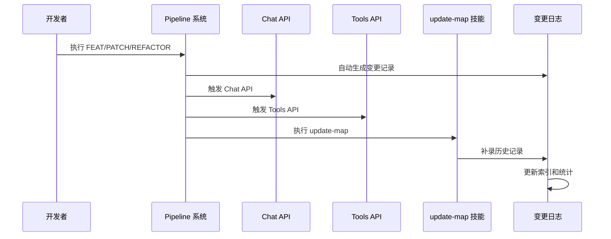

# 变更日志系统

<cite>
**本文档引用的文件**
- [docs/changelog/README.md](file://docs/changelog/README.md)
- [docs/changelog/INDEX.md](file://docs/changelog/INDEX.md)
- [docs/changelog/2026-04-17-feat-project-init.md](file://docs/changelog/2026-04-17-feat-project-init.md)
- [docs/changelog/2026-04-20-feat-proxy-and-models.md](file://docs/changelog/2026-04-20-feat-proxy-and-models.md)
- [docs/changelog/2026-04-20-feat-web3-tools-refactor.md](file://docs/changelog/2026-04-20-feat-web3-tools-refactor.md)
- [docs/changelog/2026-04-21-feat-memory-management.md](file://docs/changelog/2026-04-21-feat-memory-management.md)
- [docs/changelog/2026-04-21-feat-sse-streaming.md](file://docs/changelog/2026-04-21-feat-sse-streaming.md)
- [docs/changelog/2026-04-22-feat-multichain-web3-tools.md](file://docs/changelog/2026-04-22-feat-multichain-web3-tools.md)
- [docs/changelog/2026-04-23-feat-wallet-persistence-and-conversations.md](file://docs/changelog/2026-04-23-feat-wallet-persistence-and-conversations.md)
- [docs/changelog/2026-04-24-feat-web3-transfer-card.md](file://docs/changelog/2026-04-24-feat-web3-transfer-card.md)
- [apps/web/app/config.ts](file://apps/web/app/config.ts)
- [apps/web/app/providers.tsx](file://apps/web/app/providers.tsx)
- [apps/web/app/layout.tsx](file://apps/web/app/layout.tsx)
- [apps/web/app/page.tsx](file://apps/web/app/page.tsx)
- [apps/web/app/api/chat/route.ts](file://apps/web/app/api/chat/route.ts)
- [apps/web/hooks/useChatStream.ts](file://apps/web/hooks/useChatStream.ts)
- [apps/web/components/MessageItem.tsx](file://apps/web/components/MessageItem.tsx)
- [apps/web/components/ConversationHistory.tsx](file://apps/web/components/ConversationHistory.tsx)
- [apps/web/components/WalletConnectButton.tsx](file://apps/web/components/WalletConnectButton.tsx)
- [apps/web/components/cards/TransferCard.tsx](file://apps/web/components/cards/TransferCard.tsx)
- [apps/web/components/cards/index.ts](file://apps/web/components/cards/index.ts)
- [apps/web/lib/supabase/client.ts](file://apps/web/lib/supabase/client.ts)
- [apps/web/lib/supabase/conversations.ts](file://apps/web/lib/supabase/conversations.ts)
- [apps/web/lib/supabase/transfers.ts](file://apps/web/lib/supabase/transfers.ts)
- [apps/web/lib/tokens.ts](file://apps/web/lib/tokens.ts)
- [apps/web/types/chat.ts](file://apps/web/types/chat.ts)
- [apps/web/types/stream.ts](file://apps/web/types/stream.ts)
- [apps/web/types/transfer.ts](file://apps/web/types/transfer.ts)
- [packages/web3-tools/src/index.ts](file://packages/web3-tools/src/index.ts)
- [packages/web3-tools/src/transfer.ts](file://packages/web3-tools/src/transfer.ts)
- [supabase/init.sql](file://supabase/init.sql)
- [supabase/migrations/create_transfer_cards.sql](file://supabase/migrations/create_transfer_cards.sql)
- [supabase/migrations/fix_transfer_cards_rls.sql](file://supabase/migrations/fix_transfer_cards_rls.sql)
- [supabase/migrations/alter_messages_id_type.sql](file://supabase/migrations/alter_messages_id_type.sql)
- [apps/web/package.json](file://apps/web/package.json)
- [apps/web/next.config.js](file://apps/web/next.config.js)
- [package.json](file://package.json)
- [turbo.json](file://turbo.json)
</cite>

## 更新摘要
**变更内容**
- 新增完整的ERC20代币批准工作流程，包括allowance和approve函数支持
- 实现自动化的两阶段授权流程，支持'approving'状态
- 增强错误处理机制，支持授权失败的自动检测
- 完善TransferStatus类型定义，新增approving状态
- 优化ERC20转账流程，实现授权检查和自动转账

## 目录
1. [简介](#简介)
2. [项目结构](#项目结构)
3. [核心组件](#核心组件)
4. [架构概览](#架构概览)
5. [详细组件分析](#详细组件分析)
6. [依赖关系分析](#依赖关系分析)
7. [性能考量](#性能考量)
8. [故障排除指南](#故障排除指南)
9. [结论](#结论)

## 简介

变更日志系统是 Web3 AI Agent 项目中用于记录和追踪代码变更历史的重要基础设施。该系统采用标准化的文档格式，为 AI 和开发者提供完整的变更上下文，支持自动化的变更记录生成和手动补录功能。

系统的核心目标是：
- 提供完整的项目演进历史记录
- 支持 AI 上下文理解和开发者追溯
- 实现自动化和手动相结合的变更记录机制
- 建立标准化的变更分类和文档规范

**更新** 新增了Web3转账卡片功能的完整变更日志，包括完整的转账组件实现、AI工具集成、云端数据持久化机制以及新增的ERC20代币批准工作流程。

## 项目结构

变更日志系统位于 `docs/changelog/` 目录下，采用层次化的文件组织结构：

```mermaid
graph TB
subgraph "变更日志系统"
CL[CHANGELOG 系统]
subgraph "文档结构"
IDX[INDEX.md<br/>索引文件]
RMD[README.md<br/>使用说明]
FMT[文件命名规范]
subgraph "变更记录"
D17[2026-04-17-feat-project-init.md]
D20_1[2026-04-20-feat-proxy-and-models.md]
D20_2[2026-04-20-feat-web3-tools-refactor.md]
D21_1[2026-04-21-feat-memory-management.md]
D21_2[2026-04-21-feat-sse-streaming.md]
D22[2026-04-22-feat-multichain-web3-tools.md]
D23[2026-04-23-feat-wallet-persistence-and-conversations.md]
D24[2026-04-24-feat-web3-transfer-card.md]
end
end
subgraph "集成点"
API[Chat API]
PIPE[pipeline 系统]
UPDATE[update-map 技能]
end
CL --> IDX
CL --> RMD
CL --> FMT
CL --> D17
CL --> D20_1
CL --> D20_2
CL --> D21_1
CL --> D21_2
CL --> D22
CL --> D23
CL --> D24
API --> CL
PIPE --> CL
UPDATE --> CL
```

**图表来源**
- [docs/changelog/README.md:1-65](file://docs/changelog/README.md#L1-L65)
- [docs/changelog/INDEX.md:1-70](file://docs/changelog/INDEX.md#L1-L70)

**章节来源**
- [docs/changelog/README.md:1-65](file://docs/changelog/README.md#L1-L65)
- [docs/changelog/INDEX.md:1-70](file://docs/changelog/INDEX.md#L1-L70)

## 核心组件

### 变更记录文档

每个变更记录都遵循统一的结构化格式，包含以下关键要素：

#### 任务信息结构
- **类型标识**：feat/patch/refactor
- **主题描述**：简洁明了的功能说明
- **Pipeline 信息**：执行流程和质量评分
- **时间戳**：完成时间和提交信息

#### 架构设计文档
- **目标声明**：明确的技术目标和预期成果
- **模块边界**：涉及的代码模块和职责划分
- **接口契约**：重要的数据结构和方法签名
- **数据流说明**：关键业务流程的执行路径

#### 变更详情分类
系统支持三种类型的变更记录：
- **新增功能**：新特性、新模块、新接口
- **修改优化**：现有功能的改进和优化
- **删除清理**：废弃代码和过时功能的移除

**更新** 新增了Web3转账卡片功能的架构设计，包括TransferCard组件、AI工具集成、数据持久化机制以及新增的ERC20代币批准工作流程。

**章节来源**
- [docs/changelog/2026-04-17-feat-project-init.md:1-114](file://docs/changelog/2026-04-17-feat-project-init.md#L1-L114)
- [docs/changelog/2026-04-20-feat-proxy-and-models.md:1-106](file://docs/changelog/2026-04-20-feat-proxy-and-models.md#L1-L106)
- [docs/changelog/2026-04-20-feat-web3-tools-refactor.md:1-103](file://docs/changelog/2026-04-20-feat-web3-tools-refactor.md#L1-L103)
- [docs/changelog/2026-04-21-feat-memory-management.md:1-142](file://docs/changelog/2026-04-21-feat-memory-management.md#L1-L142)
- [docs/changelog/2026-04-21-feat-sse-streaming.md:1-133](file://docs/changelog/2026-04-21-feat-sse-streaming.md#L1-L133)
- [docs/changelog/2026-04-22-feat-multichain-web3-tools.md:1-242](file://docs/changelog/2026-04-22-feat-multichain-web3-tools.md#L1-L242)
- [docs/changelog/2026-04-23-feat-wallet-persistence-and-conversations.md:1-114](file://docs/changelog/2026-04-23-feat-wallet-persistence-and-conversations.md#L1-L114)
- [docs/changelog/2026-04-24-feat-web3-transfer-card.md:1-253](file://docs/changelog/2026-04-24-feat-web3-transfer-card.md#L1-L253)

### 自动化触发机制

变更日志系统支持多种自动触发场景：



**图表来源**
- [docs/changelog/README.md:44-52](file://docs/changelog/README.md#L44-L52)

**章节来源**
- [docs/changelog/README.md:20-52](file://docs/changelog/README.md#L20-L52)

## 架构概览

变更日志系统采用松耦合的设计模式，与核心业务逻辑保持清晰的分离：

```mermaid
graph TB
subgraph "前端应用"
WEB[Web 应用]
CHAT[Chat 组件]
MSG[消息展示]
MEM[Memory 管理器]
WALLET[钱包连接]
CONV[对话历史]
CARD[转账卡片]
END
subgraph "认证层"
CONFIG[wagmi 配置]
PROVIDERS[Web3 Provider]
LAYOUT[Layout SSR]
END
subgraph "数据层"
SUPABASE[Supabase 数据库]
CLIENT[Supabase 客户端]
DA_LAYER[数据访问层]
END
subgraph "AI 层"
CHAT_API[Chat API]
TOOLS_API[Tools API]
HEALTH_API[Health API]
END
subgraph "核心包"
AI_CONFIG[AI 配置包]
WEB3_TOOLS[Web3 工具包]
END
subgraph "变更日志系统"
LOG_DOC[日志文档]
AUTO_GEN[自动生成功能]
MANUAL_REC[手动记录]
INDEX_SYS[索引系统]
END
subgraph "外部集成"
PIPELINE[pipeline 系统]
UPDATE_MAP[update-map 技能]
GIT[Git 历史记录]
END
WEB --> CHAT_API
CHAT --> CHAT_API
MSG --> CHAT_API
MEM --> CHAT_API
WALLET --> CONFIG
WALLET --> PROVIDERS
WALLET --> LAYOUT
CONV --> DA_LAYER
CARD --> TRANSFER_CARD
CONFIG --> LAYOUT
PROVIDERS --> WALLET
DA_LAYER --> SUPABASE
SUPABASE --> CLIENT
CLIENT --> DA_LAYER
CHAT_API --> AI_CONFIG
CHAT_API --> WEB3_TOOLS
TOOLS_API --> WEB3_TOOLS
AI_CONFIG --> LOG_DOC
WEB3_TOOLS --> LOG_DOC
PIPELINE --> AUTO_GEN
UPDATE_MAP --> MANUAL_REC
GIT --> INDEX_SYS
AUTO_GEN --> LOG_DOC
MANUAL_REC --> LOG_DOC
INDEX_SYS --> LOG_DOC
```

**更新** 新增了转账卡片模块，包括TransferCard组件、转账工具函数和Supabase数据层的完整实现，以及新增的ERC20代币批准工作流程。

**图表来源**
- [apps/web/app/api/chat/route.ts:1-513](file://apps/web/app/api/chat/route.ts#L1-L513)
- [apps/web/app/page.tsx:1-407](file://apps/web/app/page.tsx#L1-L407)
- [apps/web/components/cards/TransferCard.tsx:1-563](file://apps/web/components/cards/TransferCard.tsx#L1-L563)
- [apps/web/lib/supabase/transfers.ts:1-142](file://apps/web/lib/supabase/transfers.ts#L1-L142)
- [apps/web/lib/tokens.ts:1-85](file://apps/web/lib/tokens.ts#L1-L85)
- [packages/web3-tools/src/transfer.ts:1-99](file://packages/web3-tools/src/transfer.ts#L1-L99)

**章节来源**
- [apps/web/app/api/chat/route.ts:1-513](file://apps/web/app/api/chat/route.ts#L1-L513)
- [apps/web/app/page.tsx:1-407](file://apps/web/app/page.tsx#L1-L407)
- [apps/web/components/cards/TransferCard.tsx:1-563](file://apps/web/components/cards/TransferCard.tsx#L1-L563)
- [apps/web/lib/supabase/transfers.ts:1-142](file://apps/web/lib/supabase/transfers.ts#L1-L142)
- [apps/web/lib/tokens.ts:1-85](file://apps/web/lib/tokens.ts#L1-L85)
- [packages/web3-tools/src/transfer.ts:1-99](file://packages/web3-tools/src/transfer.ts#L1-L99)

## 详细组件分析

### 文件命名和分类系统

变更日志采用严格的命名规范，确保文件的可识别性和可排序性：

#### 命名规范
```
YYYY-MM-DD-{task-type}.md
```

示例：
- `2026-04-21-feat-chat-integration.md` - 新功能
- `2026-04-22-patch-fix-auth-bug.md` - Bug 修复
- `2026-04-23-refactor-module-split.md` - 重构优化

#### 任务类型分类
- **feat**：新功能开发和重大改进
- **patch**：小规模修复和优化
- **refactor**：架构重构和代码优化

**章节来源**
- [docs/changelog/README.md:5-18](file://docs/changelog/README.md#L5-L18)

### Web3转账卡片组件

**新增** Web3转账卡片功能是本次更新的核心功能，实现了完整的链上转账操作界面，支持ETH原生转账和ERC20 Token转账，并新增了完整的ERC20代币批准工作流程。

#### TransferCard 组件架构

TransferCard是一个完整的转账卡片组件，实现了从用户交互到链上交易的全流程，包括新增的ERC20代币批准工作流程：

```typescript
// TransferCard 组件 Props
interface TransferCardProps {
  data: TransferData
  conversationId?: string
  onUpdate?: (data: TransferData) => void
}

// 转账数据结构
interface TransferData {
  id: string
  from: string
  to: string
  tokenSymbol: string
  tokenAddress?: string
  amount: string
  chain: 'ethereum' | 'polygon' | 'bsc'
  status: 'pending' | 'approving' | 'signing' | 'confirmed' | 'failed'
  txHash?: string
  error?: string
}
```

#### 支持的链和网络配置

系统支持三大主流EVM链，每条链都有完整的配置：

```typescript
const CHAIN_CONFIGS: Record<string, {
  name: string
  chainId: number
  explorer: string
  nativeToken: string
  iconColor: string
}> = {
  ethereum: {
    name: 'Ethereum',
    chainId: 1,
    explorer: 'https://etherscan.io/tx/',
    nativeToken: 'ETH',
    iconColor: '#627EEA'
  },
  polygon: {
    name: 'Polygon',
    chainId: 137,
    explorer: 'https://polygonscan.com/tx/',
    nativeToken: 'MATIC',
    iconColor: '#8247E5'
  },
  bsc: {
    name: 'BSC',
    chainId: 56,
    explorer: 'https://bscscan.com/tx/',
    nativeToken: 'BNB',
    iconColor: '#F3BA2F'
  }
}
```

#### 状态管理和生命周期

TransferCard实现了完整的状态管理，包括五种转账状态，新增了'approving'状态：

```typescript
const STATUS_CONFIG: Record<TransferStatus, { label: string; color: string; dotColor: string }> = {
  pending: { label: '待确认', color: 'text-orange-600', dotColor: 'bg-orange-500' },
  approving: { label: '授权中', color: 'text-blue-600', dotColor: 'bg-blue-500' },
  signing: { label: '确认中', color: 'text-blue-600', dotColor: 'bg-blue-500' },
  confirmed: { label: '已确认', color: 'text-green-600', dotColor: 'bg-green-500' },
  failed: { label: '失败', color: 'text-red-600', dotColor: 'bg-red-500' }
}
```

#### ETH原生转账流程

ETH原生转账使用`useSendTransaction`钩子：

```typescript
// ETH 原生转账
const { sendTransaction, isPending: isSigningETH } = useSendTransaction()

// 发送交易
sendTransaction(
  {
    to: data.to as `0x${string}`,
    value: parseEther(data.amount)
  },
  {
    onSuccess: (hash) => {
      setTxHash(hash)
      // 更新数据库状态
      transferService.updateTransferCardStatus(data.id, 'signing', hash)
    },
    onError: (err) => {
      handleTransferError(err)
    }
  }
)
```

#### ERC20转账流程

ERC20转账使用`useWriteContract`钩子，支持合约转账和自动化的两阶段授权流程：

```typescript
// ERC20 转账
const { writeContract, isPending: isSigningERC20 } = useWriteContract()

// ERC20 最小 ABI (含 allowance 和 approve)
const ERC20_ABI = [
  {
    name: 'transfer',
    type: 'function',
    stateMutability: 'nonpayable',
    inputs: [
      { name: 'to', type: 'address' },
      { name: 'amount', type: 'uint256' }
    ],
    outputs: [{ name: '', type: 'bool' }]
  },
  {
    name: 'decimals',
    type: 'function',
    stateMutability: 'view',
    inputs: [],
    outputs: [{ name: '', type: 'uint8' }]
  },
  {
    name: 'allowance',
    type: 'function',
    stateMutability: 'view',
    inputs: [
      { name: 'owner', type: 'address' },
      { name: 'spender', type: 'address' }
    ],
    outputs: [{ name: '', type: 'uint256' }]
  },
  {
    name: 'approve',
    type: 'function',
    stateMutability: 'nonpayable',
    inputs: [
      { name: 'spender', type: 'address' },
      { name: 'amount', type: 'uint256' }
    ],
    outputs: [{ name: '', type: 'bool' }]
  }
]

// 读取授权额度
const { data: allowance } = useReadContract({
  address: tokenConfig?.address as `0x${string}`,
  abi: ERC20_ABI,
  functionName: 'allowance',
  args: address ? [address, address] : undefined,
  query: {
    enabled: !isNative && !!address && status === 'pending' && !!tokenConfig
  }
})

// 判断是否需要授权
useEffect(() => {
  if (!isNative && allowance !== undefined && tokenConfig && status === 'pending') {
    const allowanceAmt = parseFloat(formatUnits(allowance, tokenConfig.decimals))
    setNeedsApproval(allowanceAmt < parseFloat(data.amount))
  }
}, [allowance, isNative, tokenConfig, data.amount, status])

// 监听授权确认并自动发起转账
useEffect(() => {
  if (!approveReceipt || !approveTxHash) return
  
  if (approveReceipt.status === 'success') {
    // 授权成功,清除状态,自动转账
    setNeedsApproval(false)
    setApproveTxHash(undefined)
    setStatus('pending') // 回到 pending 状态后自动触发 transfer
    // 立即执行转账
    executeERC20Transfer()
  } else {
    setStatus('failed')
    setError('Token 授权失败')
  }
}, [approveReceipt])

// 写入合约转账
writeContract(
  {
    address: tokenConfig.address as `0x${string}`,
    abi: ERC20_ABI,
    functionName: 'transfer',
    args: [
      data.to as `0x${string}`,
      parseUnits(data.amount, tokenConfig.decimals)
    ]
  }
)
```

#### 余额验证和Gas估算

组件内置了完整的余额验证机制：

```typescript
// 余额验证
useEffect(() => {
  if (status === 'pending' && tokenBalance && !isBalanceChecked) {
    const balanceNum = parseFloat(formatUnits(tokenBalance.value, tokenBalance.decimals))
    const amountNum = parseFloat(data.amount)

    if (balanceNum < amountNum) {
      setBalanceError(`余额不足，当前余额: ${balanceNum.toFixed(4)} ${data.tokenSymbol}`)
    } else if (!isNative && nativeBalance) {
      // ERC20 转账需要检查 Gas 费
      const ethBalance = parseFloat(formatUnits(nativeBalance.value, nativeBalance.decimals))
      if (ethBalance < 0.001) {
        setBalanceError(`Gas 费不足，需要约 0.001 ${nativeBalance.symbol}`)
      }
    }

    setIsBalanceChecked(true)
  }
}, [tokenBalance, nativeBalance, status, isBalanceChecked])
```

#### 错误处理和用户反馈

实现了全面的错误处理机制，包括新增的授权失败检测：

```typescript
const handleTransferError = (err: any) => {
  let errorMsg = '未知错误'

  if (err.message?.includes('User rejected') || err.message?.includes('user rejected')) {
    errorMsg = '用户取消签名'
  } else if (err.message?.includes('insufficient funds')) {
    errorMsg = '余额不足'
  } else if (err.message?.includes('gas required exceeds')) {
    errorMsg = 'Gas 费不足'
  } else if (err.message?.includes('network')) {
    errorMsg = '网络错误，请稍后重试'
  } else if (err.shortMessage) {
    errorMsg = err.shortMessage
  } else if (err.message) {
    errorMsg = err.message
  }

  setStatus('failed')
  setError(errorMsg)

  if (conversationId && data.id) {
    transferService.updateTransferCardStatus(data.id, 'failed', undefined, errorMsg)
  }
}
```

#### 用户界面设计

TransferCard采用了现代化的卡片设计，支持新增的授权状态：

```typescript
return (
  <div className="rounded-2xl border border-gray-200 bg-white p-5" style={{ minWidth: '300px' }}>
    {/* 顶部: 标题 + 状态 */}
    <div className="flex items-center justify-between mb-4">
      <span className="text-sm text-gray-500">DEX 转账</span>
      <div className="flex items-center gap-1.5">
        <span className={`w-2 h-2 rounded-full ${statusConfig.dotColor}`} />
        <span className={`text-sm font-medium ${statusConfig.color}`}>
          {statusConfig.label}
        </span>
      </div>
    </div>

    {/* 币种 + 金额 + 网络 */}
    <div className="flex items-center justify-between mb-6 pb-6 border-b border-gray-100">
      <div className="flex items-center gap-2">
        <div className="w-9 h-9 rounded-full bg-gray-100 flex items-center justify-center overflow-hidden">
          <Image 
            src={getTokenIconUrl()} 
            alt={data.tokenSymbol}
            width={36}
            height={36}
            className="w-full h-full object-cover"
            unoptimized
          />
        </div>
        <div>
          <span className="text-lg font-bold text-gray-900">{data.tokenSymbol}</span>
          <div className="text-xs text-gray-500 -mt-0.5">{CHAIN_CONFIGS[data.chain]?.name || data.chain}</div>
        </div>
      </div>
      <span className="text-2xl font-bold text-gray-900">{data.amount}</span>
    </div>

    {/* 发送地址 */}
    <div className="mb-4">
      <div className="flex items-center justify-between">
        <span className="text-sm text-gray-500">发送地址</span>
        <span className="text-sm text-gray-900 font-mono font-medium">{shortenAddress(data.from)}</span>
      </div>
    </div>

    {/* 接收地址 */}
    <div className="mb-4">
      <div className="flex items-center justify-between">
        <span className="text-sm text-gray-500">接收地址</span>
        <span className="text-sm text-gray-900 font-mono font-medium">{shortenAddress(data.to)}</span>
      </div>
    </div>

    {/* 交易哈希 (仅成功后显示) */}
    {status === 'confirmed' && txHash && (
      <div className="mb-4">
        <div className="flex items-center justify-between">
          <span className="text-sm text-gray-500">交易哈希</span>
          <span className="text-sm text-gray-900 font-mono font-medium">{shortenAddress(txHash)}</span>
        </div>
      </div>
    )}

    {/* 错误提示 */}
    {displayError && (
      <div className="mb-4 p-2 bg-red-50 rounded-xl flex items-start gap-2">
        <svg className="w-5 h-5 text-red-500 flex-shrink-0 mt-0.5" fill="currentColor" viewBox="0 0 20 20">
          <path fillRule="evenodd" d="M18 10a8 8 0 11-16 0 8 8 0 0116 0zm-7 4a1 1 0 11-2 0 1 1 0 012 0zm-1-9a1 1 0 00-1 1v4a1 1 0 102 0V6a1 1 0 00-1-1z" clipRule="evenodd" />
        </svg>
        <span className="text-sm text-red-600">{displayError}</span>
      </div>
    )}

    {/* 底部按钮 - 授权按钮：余额不足不影响，只需要 Gas */}
    {status === 'pending' && !isNative && needsApproval && (
      <button
        onClick={handleConfirm}
        disabled={isSigning}
        className="w-full h-10 bg-blue-600 text-white font-semibold text-base rounded-xl hover:bg-blue-700 disabled:bg-gray-300 disabled:cursor-not-allowed transition-colors"
      >
        授权 {data.tokenSymbol}
      </button>
    )}

    {/* 底部按钮 - 转账按钮：需要检查余额 */}
    {status === 'pending' && (isNative || !needsApproval) && (
      <button
        onClick={handleConfirm}
        disabled={!!displayError || isSigning}
        className="w-full h-10 bg-black text-white font-semibold text-base rounded-xl hover:bg-gray-800 disabled:bg-gray-300 disabled:cursor-not-allowed transition-colors"
      >
        {isSigning ? '签名中...' : !isNative ? '确认转账' : '确认'}
      </button>
    )}

    {status === 'approving' && (
      <button
        disabled
        className="w-full h-10 bg-gray-300 text-gray-500 font-semibold text-base rounded-xl cursor-not-allowed flex items-center justify-center gap-2"
      >
        <div className="w-5 h-5 border-2 border-gray-500 border-t-transparent rounded-full animate-spin" />
        授权中...
      </button>
    )}

    {status === 'signing' && (
      <button
        disabled
        className="w-full h-10 bg-gray-300 text-gray-500 font-semibold text-base rounded-xl cursor-not-allowed flex items-center justify-center gap-2"
      >
        <div className="w-5 h-5 border-2 border-gray-500 border-t-transparent rounded-full animate-spin" />
        签名中...
      </button>
    )}

    {status === 'confirmed' && txHash && (
      <a
        href={getExplorerUrl()}
        target="_blank"
        rel="noopener noreferrer"
        className="w-full h-10 bg-blue-50 text-blue-600 font-semibold text-base rounded-xl hover:bg-blue-100 transition-colors flex items-center justify-center gap-2"
      >
        <svg className="w-5 h-5" fill="none" stroke="currentColor" viewBox="0 0 24 24">
          <path strokeLinecap="round" strokeLinejoin="round" strokeWidth={2} d="M10 6H6a2 2 0 00-2 2v10a2 2 0 002 2h10a2 2 0 002-2v-4M14 4h6m0 0v6m0-6L10 14" />
        </svg>
        查看交易
      </a>
    )}

    {status === 'failed' && (
      <button
        onClick={handleRetry}
        className="w-full h-10 bg-black text-white font-semibold text-base rounded-xl hover:bg-gray-800 transition-colors"
      >
        重试
      </button>
    )}
  </div>
)
```

#### Token配置管理

系统支持多链Token配置：

```typescript
// 主流 Token 配置(以太坊主网)
export const TOKENS: ChainTokens = {
  ethereum: {
    USDT: {
      symbol: 'USDT',
      name: 'Tether USD',
      address: '0xdAC17F958D2ee523a2206206994597C13D831ec7',
      decimals: 6,
      logoUri: 'https://assets.coingecko.com/coins/images/325/small/Tether-logo.png'
    },
    USDC: {
      symbol: 'USDC',
      name: 'USD Coin',
      address: '0xA0b86991c6218b36c1d19D4a2e9Eb0cE3606eB48',
      decimals: 6,
      logoUri: 'https://assets.coingecko.com/coins/images/6319/small/USD_Coin_icon.png'
    }
  },
  polygon: {
    USDT: {
      symbol: 'USDT',
      name: 'Tether USD',
      address: '0xc2132D05D31c914a87C6611C10748AEb04B58e8F',
      decimals: 6,
      logoUri: 'https://assets.coingecko.com/coins/images/325/small/Tether-logo.png'
    }
  }
}
```

#### AI工具集成

在Chat API中新增了转账卡片工具：

```typescript
{
  type: 'function',
  function: {
    name: 'createTransferCard',
    description: '当用户表达转账意图时调用，生成转账卡片数据。支持 ETH 原生转账和 ERC20 Token 转账。',
    parameters: {
      type: 'object',
      properties: {
        to: {
          type: 'string',
          description: '接收地址（0x 开头的以太坊地址）',
        },
        tokenSymbol: {
          type: 'string',
          description: 'Token 符号（ETH, USDT, USDC 等）',
        },
        amount: {
          type: 'string',
          description: '转账金额（字符串格式，如 "100", "0.5"）',
        },
        chain: {
          type: 'string',
          enum: ['ethereum', 'polygon', 'bsc'],
          description: '区块链名称',
        },
      },
      required: ['to', 'tokenSymbol', 'amount', 'chain'],
    },
  },
}
```

#### SSE流式传输支持

useChatStream Hook新增了transfer_data事件处理：

```typescript
case 'transfer_data':
  if (chunk.transferData) {
    console.log('[useChatStream] 收到 transfer_data:', chunk.transferData)
    transferDataRef.current = chunk.transferData  // 同步更新 ref
    setTransferData(chunk.transferData)
  }
  break
```

#### 数据持久化

Supabase数据层实现了完整的转账卡片CRUD操作：

```typescript
// 创建转账卡片记录
export async function createTransferCard(params: CreateTransferCardParams): Promise<string> {
  // 使用 upsert 避免重复插入
  const { data, error } = await supabase
    .from('transfer_cards')
    .upsert({
      id: params.messageId,  // 使用 message_id 作为主键
      conversation_id: params.conversationId,
      message_id: params.messageId,
      from_address: params.fromAddress,
      to_address: params.toAddress,
      token_symbol: params.tokenSymbol,
      token_address: params.tokenAddress,
      amount: params.amount,
      chain: params.chain,
      status: 'pending'
    }, {
      onConflict: 'id',
    })
    .select('id')
    .single()

  if (error) {
    throw new Error(`创建转账记录失败: ${error.message}`)
  }

  return data.id
}

// 更新转账卡片状态
export async function updateTransferCardStatus(
  cardId: string,
  status: TransferStatus,
  txHash?: string,
  errorMessage?: string
): Promise<void> {
  const updateData: any = {
    status,
    updated_at: new Date().toISOString()
  }

  if (txHash !== undefined) {
    updateData.tx_hash = txHash
  }

  if (errorMessage !== undefined) {
    updateData.error_message = errorMessage
  }

  const { error } = await supabase
    .from('transfer_cards')
    .update(updateData)
    .eq('id', cardId)

  if (error) {
    console.error('Failed to update transfer card status:', error)
    throw new Error(`更新转账状态失败: ${error.message}`)
  }
}
```

#### 数据库迁移

新增了转账卡片相关的数据库迁移脚本：

```sql
-- 创建转账卡片表
CREATE TABLE IF NOT EXISTS transfer_cards (
  id UUID PRIMARY KEY DEFAULT gen_random_uuid(),
  conversation_id UUID REFERENCES conversations(id) ON DELETE CASCADE,
  message_id TEXT NOT NULL,  -- 关联 Message 的 id
  
  -- 转账信息
  from_address TEXT NOT NULL,
  to_address TEXT NOT NULL,
  token_symbol TEXT NOT NULL,  -- 'ETH', 'USDT', 'USDC'
  token_address TEXT,          -- ERC20 合约地址(NULL 表示原生币)
  amount TEXT NOT NULL,        -- 字符串避免精度丢失
  chain TEXT NOT NULL,         -- 'ethereum', 'polygon', 'bsc'
  
  -- 交易状态
  status TEXT NOT NULL DEFAULT 'pending',  -- pending/approving/signing/confirmed/failed
  tx_hash TEXT,                -- 交易哈希
  error_message TEXT,          -- 失败原因
  
  -- 时间戳
  created_at TIMESTAMP WITH TIME ZONE DEFAULT NOW(),
  updated_at TIMESTAMP WITH TIME ZONE DEFAULT NOW()
);

-- 添加 RLS 策略
ALTER TABLE transfer_cards ENABLE ROW LEVEL SECURITY;
CREATE POLICY "Users can view own transfer cards"
  ON transfer_cards FOR SELECT
  USING (
    conversation_id IN (
      SELECT id FROM conversations WHERE wallet_address = auth.jwt()->>'wallet_address'
    )
  );
```

**章节来源**
- [docs/changelog/2026-04-24-feat-web3-transfer-card.md:11-253](file://docs/changelog/2026-04-24-feat-web3-transfer-card.md#L11-L253)
- [apps/web/components/cards/TransferCard.tsx:1-563](file://apps/web/components/cards/TransferCard.tsx#L1-L563)
- [apps/web/types/transfer.ts:1-20](file://apps/web/types/transfer.ts#L1-L20)
- [apps/web/lib/tokens.ts:1-85](file://apps/web/lib/tokens.ts#L1-L85)
- [apps/web/lib/supabase/transfers.ts:1-142](file://apps/web/lib/supabase/transfers.ts#L1-L142)
- [apps/web/app/api/chat/route.ts:92-118](file://apps/web/app/api/chat/route.ts#L92-L118)
- [apps/web/hooks/useChatStream.ts:158-164](file://apps/web/hooks/useChatStream.ts#L158-L164)
- [apps/web/components/MessageItem.tsx:44-76](file://apps/web/components/MessageItem.tsx#L44-L76)
- [supabase/migrations/create_transfer_cards.sql:1-70](file://supabase/migrations/create_transfer_cards.sql#L1-L70)
- [supabase/migrations/fix_transfer_cards_rls.sql:1-29](file://supabase/migrations/fix_transfer_cards_rls.sql#L1-L29)

### 索引和统计系统

索引系统提供了多层次的信息检索能力：

```mermaid
graph LR
subgraph "索引层级"
DATE[按日期索引]
TYPE[按类型索引]
MODULE[按模块索引]
KEYWORD[按关键词索引]
END
subgraph "统计信息"
COUNT[总数统计]
DISTRIBUTION[类型分布]
MODULE_STATS[模块统计]
END
DATE --> COUNT
TYPE --> DISTRIBUTION
MODULE --> MODULE_STATS
KEYWORD --> COUNT
```

**更新** 新增了转账卡片相关的关键词索引，包括TransferCard、Web3转账、ERC20、ETH转账、Supabase持久化、approve授权等。

**图表来源**
- [docs/changelog/INDEX.md:21-55](file://docs/changelog/INDEX.md#L21-L55)

**章节来源**
- [docs/changelog/INDEX.md:1-70](file://docs/changelog/INDEX.md#L1-L70)

### 自动化生成流程

系统实现了完整的自动化变更记录生成机制：

#### 自动触发条件
1. **Pipeline 完成**：FEAT/PATCH/REFACTOR 任务完成后
2. **update-map 执行**：技能更新时
3. **架构设计完成**：特定架构变更完成后

#### 生成内容
- 任务基本信息（类型、主题、Pipeline）
- 架构设计内容（执行了架构技能）
- 变更详情（新增、修改、删除、修复）
- 影响范围（破坏性变更、迁移需求）
- 上下文标记（关键词、相关文档、后续建议）

**章节来源**
- [docs/changelog/README.md:20-36](file://docs/changelog/README.md#L20-L36)
- [docs/changelog/README.md:44-52](file://docs/changelog/README.md#L44-L52)

### 手动补录机制

对于历史记录的补录，系统提供了完整的指导流程：

#### 补录场景
- Git 历史恢复的架构设计
- 早期未记录的重要变更
- 架构演进的关键节点

#### 补录流程
1. **历史分析**：基于 Git 历史分析变更内容
2. **架构重建**：还原当时的架构设计决策
3. **文档编写**：按照标准格式编写变更记录
4. **索引更新**：更新索引文件和统计信息

**章节来源**
- [docs/changelog/README.md:54-65](file://docs/changelog/README.md#L54-L65)

## 依赖关系分析

变更日志系统与项目其他组件存在密切的依赖关系：

```mermaid
graph TB
subgraph "核心依赖"
TURBO[turbo.json<br/>构建配置]
PKG[package.json<br/>工作区配置]
CHAT_API[Chat API<br/>主要入口]
TOOLS_API[Tools API<br/>工具入口]
MEM_LIB[Memory Library<br/>内存管理模块]
WEB3_TOOLS[Web3 Tools<br/>多链工具包]
WALLET_DEPS[wallet-connect<br/>依赖包]
SUPABASE_DEPS[supabase-js<br/>依赖包]
TOKEN_DEPS[viem<br/>依赖包]
END
subgraph "日志系统"
LOG_README[README.md<br/>使用说明]
LOG_INDEX[INDEX.md<br/>索引系统]
LOG_DOCS[变更记录<br/>具体文档]
END
subgraph "外部系统"
PIPELINE[pipeline 系统]
UPDATE_MAP[update-map 技能]
GIT[Git 版本控制]
END
TURBO --> CHAT_API
TURBO --> TOOLS_API
TURBO --> MEM_LIB
TURBO --> WEB3_TOOLS
TURBO --> WALLET_DEPS
TURBO --> SUPABASE_DEPS
TURBO --> TOKEN_DEPS
PKG --> TURBO
CHAT_API --> LOG_DOCS
TOOLS_API --> LOG_DOCS
MEM_LIB --> LOG_DOCS
WEB3_TOOLS --> LOG_DOCS
WALLET_DEPS --> LOG_DOCS
SUPABASE_DEPS --> LOG_DOCS
TOKEN_DEPS --> LOG_DOCS
PIPELINE --> LOG_README
UPDATE_MAP --> LOG_INDEX
GIT --> LOG_INDEX
LOG_README --> LOG_DOCS
LOG_INDEX --> LOG_DOCS
```

**更新** 新增了转账卡片功能相关的依赖关系，包括viem、Next.js Image优化和CoinGecko域名白名单，以及新增的ERC20代币批准工作流程。

**图表来源**
- [turbo.json:1-21](file://turbo.json#L1-L21)
- [package.json:1-28](file://package.json#L1-L28)
- [apps/web/package.json:12-31](file://apps/web/package.json#L12-L31)
- [apps/web/app/api/chat/route.ts:1-513](file://apps/web/app/api/chat/route.ts#L1-L513)
- [apps/web/app/page.tsx:1-407](file://apps/web/app/page.tsx#L1-L407)
- [apps/web/components/cards/TransferCard.tsx:1-563](file://apps/web/components/cards/TransferCard.tsx#L1-L563)
- [packages/web3-tools/src/transfer.ts:1-99](file://packages/web3-tools/src/transfer.ts#L1-L99)

**章节来源**
- [turbo.json:1-21](file://turbo.json#L1-L21)
- [package.json:1-28](file://package.json#L1-L28)
- [apps/web/package.json:12-31](file://apps/web/package.json#L12-L31)

### 包依赖关系

各核心包之间的依赖关系体现了清晰的模块化设计：

#### AI 配置包依赖
- **openai**：OpenAI API 客户端
- **@anthropic-ai/sdk**：Anthropic Claude API 客户端

#### Web3 工具包依赖
- **ethers**：以太坊区块链交互库
- **node-fetch**：HTTP 请求库（替代原生 fetch）
- **https-proxy-agent**：HTTP 代理支持
- **viem**：现代以太坊交互库（新增）

#### 钱包连接依赖
- **@rainbow-me/rainbowkit**：钱包连接UI组件库
- **wagmi**：以太坊钱包连接框架
- **@tanstack/react-query**：React 状态管理

#### Supabase 依赖
- **@supabase/supabase-js**：Supabase 客户端SDK

#### 转账卡片依赖
- **viem**：用于地址验证、单位转换和链上交互
- **next/image**：优化Token图标加载
- **@supabase/supabase-js**：云端数据持久化

**更新** 新增了viem依赖用于转账功能，Next.js Image优化用于Token图标加载，以及CoinGecko域名白名单配置。新增的ERC20代币批准工作流程完全基于viem库实现。

**章节来源**
- [packages/ai-config/package.json:13-16](file://packages/ai-config/package.json#L13-L16)
- [packages/web3-tools/package.json:13-17](file://packages/web3-tools/package.json#L13-L17)
- [apps/web/package.json:12-31](file://apps/web/package.json#L12-L31)
- [apps/web/components/cards/TransferCard.tsx:4-8](file://apps/web/components/cards/TransferCard.tsx#L4-L8)

## 性能考量

变更日志系统在设计时充分考虑了性能和可维护性：

### 存储效率
- **文本格式**：使用 Markdown 格式，占用空间小
- **结构化数据**：统一的文档结构便于解析和处理
- **增量更新**：支持增量索引更新，避免全量重建

### 访问性能
- **静态文件**：文档为静态文件，访问速度快
- **索引优化**：多维度索引系统支持快速检索
- **缓存友好**：适合 CDN 缓存和本地缓存

### 维护成本
- **模板化**：标准化的文档模板降低维护成本
- **自动化**：减少人工维护的工作量
- **版本控制**：与 Git 集成，天然支持版本追踪

**更新** 转账卡片功能显著提升了系统的性能和用户体验：
- **状态持久化**：使用Supabase实现转账状态的云端同步
- **实时更新**：通过SSE流式传输实现实时状态更新
- **缓存优化**：Token配置和链配置的本地缓存
- **错误处理**：完善的错误处理和用户反馈机制
- **资源优化**：Next.js Image组件优化Token图标加载
- **网络优化**：使用支持CORS的RPC节点
- **授权优化**：基于viem的allowance检查和自动授权流程
- **两阶段授权**：自动化的approve和transfer流程减少用户操作

## 故障排除指南

### 常见问题及解决方案

#### 变更记录未生成
**症状**：执行 pipeline 后未生成变更记录
**可能原因**：
- 环境变量配置错误
- 权限不足
- 网络连接问题

**解决方案**：
1. 检查环境变量配置
2. 验证权限设置
3. 确认网络连接状态

#### 索引不准确
**症状**：索引文件与实际文档不匹配
**可能原因**：
- 手动修改了文件名
- 未更新索引文件
- 文件编码问题

**解决方案**：
1. 按照命名规范重命名文件
2. 手动更新索引文件
3. 检查文件编码格式

#### 文档格式错误
**症状**：文档无法正确渲染
**可能原因**：
- Markdown 语法错误
- 缺少必需字段
- 格式不规范

**解决方案**：
1. 使用 Markdown 校验工具
2. 检查必需字段完整性
3. 参考标准模板格式

**更新** 新增了转账卡片功能相关的故障排除指南，特别是新增的ERC20代币批准工作流程：

#### 转账功能问题
**症状**：转账卡片无法正常工作或转账失败
**可能原因**：
- 钱包连接状态异常
- 地址格式验证失败
- 链ID不匹配
- 余额不足
- RPC节点CORS错误
- Token配置缺失
- ERC20授权失败

**解决方案**：
1. **钱包连接**：确认钱包已连接且账户地址正确
2. **地址验证**：检查接收地址格式是否为0x开头的42位十六进制
3. **链匹配**：确认钱包网络与目标链一致
4. **余额检查**：确保ETH余额足够支付Gas费用
5. **RPC配置**：确认使用支持CORS的RPC节点
6. **Token配置**：检查Token配置是否存在且正确
7. **授权检查**：确认allowance大于等于转账金额
8. **授权流程**：检查approve交易是否成功确认

#### SSE流式传输问题
**症状**：transfer_data事件无法正确接收
**可能原因**：
- 流式传输格式错误
- 事件解析失败
- 状态同步问题

**解决方案**：
1. **事件格式**：确认SSE事件格式符合transfer_data类型
2. **解析逻辑**：检查parseSSEEvent函数的事件解析逻辑
3. **状态同步**：使用useRef确保transferDataRef的同步更新

#### 数据持久化问题
**症状**：转账状态无法正确保存或恢复
**可能原因**：
- Supabase连接配置错误
- RLS策略冲突
- 数据库迁移失败
- 消息ID不一致

**解决方案**：
1. **连接配置**：检查NEXT_PUBLIC_SUPABASE_URL和NEXT_PUBLIC_SUPABASE_ANON_KEY
2. **RLS策略**：确认行级安全策略配置正确
3. **数据库迁移**：执行create_transfer_cards.sql和fix_transfer_cards_rls.sql
4. **消息ID**：确保使用message.id而不是自动生成的UUID

#### 性能问题
**症状**：转账界面响应缓慢或状态更新延迟
**可能原因**：
- 状态更新过于频繁
- 余额查询过于频繁
- 图标加载缓慢
- RPC请求过多
- 授权检查过于频繁

**解决方案**：
1. **状态更新**：使用节流机制避免频繁状态更新
2. **余额查询**：合理设置查询间隔，避免过度查询
3. **图片优化**：使用Next.js Image组件优化图标加载
4. **RPC优化**：合理使用RPC节点，避免频繁请求
5. **授权优化**：合理设置allowance查询频率

#### 类型安全问题
**症状**：TypeScript编译错误或运行时类型错误
**可能原因**：
- TransferData类型定义不完整
- Token配置类型不匹配
- RPC返回类型处理
- 异步操作类型安全
- 新增的approving状态类型不匹配

**解决方案**：
1. **类型定义**：确保TransferData包含所有必要字段，包括新增的approving状态
2. **类型检查**：使用类型守卫确保Token配置存在
3. **RPC类型**：正确处理viem库的返回类型
4. **异步类型**：使用Promise和async/await确保类型安全
5. **状态类型**：确保TransferStatus类型包含approving枚举值

#### ERC20授权问题
**症状**：授权功能无法正常工作或授权失败
**可能原因**：
- allowance读取失败
- approve交易未确认
- 授权金额不正确
- 授权地址错误
- 授权超时

**解决方案**：
1. **allowance检查**：确认useReadContract正确读取allowance值
2. **approve确认**：检查useWaitForTransactionReceipt监听approve交易确认
3. **金额验证**：确认parseUnits转换后的授权金额正确
4. **地址验证**：确认授权地址为当前钱包地址
5. **超时处理**：实现approve交易超时检测和错误处理

**章节来源**
- [docs/changelog/README.md:31-36](file://docs/changelog/README.md#L31-L36)
- [apps/web/components/cards/TransferCard.tsx:146-163](file://apps/web/components/cards/TransferCard.tsx#L146-L163)
- [apps/web/hooks/useChatStream.ts:158-181](file://apps/web/hooks/useChatStream.ts#L158-L181)
- [apps/web/lib/supabase/transfers.ts:20-79](file://apps/web/lib/supabase/transfers.ts#L20-L79)
- [supabase/migrations/create_transfer_cards.sql:1-70](file://supabase/migrations/create_transfer_cards.sql#L1-L70)

### 调试支持

系统提供了完善的调试和诊断功能：

#### 转账卡片调试
在TransferCard组件中实现了详细的调试日志：
- 状态变化的console.log输出
- 错误处理的详细日志
- RPC调用的调试信息
- Token配置的验证日志
- 授权流程的详细日志

#### SSE流式传输调试
在useChatStream Hook中实现了完整的调试支持：
- SSE事件的详细解析日志
- transfer_data事件的接收日志
- 状态同步的调试信息
- 错误处理的详细日志

#### Supabase数据层调试
在数据访问层实现了详细的数据库操作调试：
- 每个API调用的错误处理
- 数据转换和验证的日志
- 异步操作的Promise链式处理
- RLS策略的调试信息

**更新** 转账卡片功能包含了详细的调试支持，特别是新增的ERC20代币批准工作流程：
- TransferCard组件的状态变化日志，包括新增的approving状态
- wagmi钩子的调试信息
- viem库的类型安全检查
- Supabase数据库操作的详细日志
- SSE流式传输的事件解析日志
- 授权流程的详细调试信息

**章节来源**
- [apps/web/components/cards/TransferCard.tsx:146-163](file://apps/web/components/cards/TransferCard.tsx#L146-L163)
- [apps/web/hooks/useChatStream.ts:158-181](file://apps/web/hooks/useChatStream.ts#L158-L181)
- [apps/web/lib/supabase/transfers.ts:20-79](file://apps/web/lib/supabase/transfers.ts#L20-L79)

## 结论

变更日志系统作为 Web3 AI Agent 项目的重要基础设施，展现了良好的设计和实现：

### 系统优势
- **标准化程度高**：统一的文档格式和命名规范
- **自动化程度好**：支持多种自动触发场景
- **可扩展性强**：模块化设计便于功能扩展
- **维护成本低**：模板化和自动化减少维护工作

**更新** 新增了Web3转账卡片功能，包括完整的ERC20代币批准工作流程，进一步增强了系统的智能化水平和用户体验。

### 技术特色
- **多维度索引**：支持按日期、类型、模块、关键词等多种方式检索
- **智能统计**：自动统计各类变更的数量和分布
- **关键词提取**：自动提取和管理关键词索引
- **历史补录**：支持历史记录的补录和还原
- **内存管理**：实现了 L3 摘要压缩模式，有效降低 Token 消耗
- **多链架构**：支持5条链的统一查询，具备良好的扩展性
- **SSR 兼容**：通过双配置策略解决walletConnect的SSR兼容性问题
- **云端同步**：使用Supabase实现对话历史的云端存储和跨设备同步
- **增量更新**：对话列表的局部更新提升用户体验
- **异步处理**：后台异步保存消息，不阻塞UI交互
- **转账功能**：完整的ETH原生转账和ERC20 Token转账实现
- **实时状态**：通过SSE流式传输实现转账状态的实时更新
- **安全验证**：地址格式验证、余额检查和错误处理机制
- **多链支持**：支持Ethereum、Polygon、BSC三条主流链
- **Token管理**：完整的Token配置和图标管理
- **数据持久化**：云端转账状态的持久化存储
- **两阶段授权**：自动化的ERC20 approve和transfer流程
- **授权检查**：基于viem的allowance读取和授权状态判断
- **错误处理**：完善的授权失败检测和用户反馈机制

### 发展建议
1. **增强搜索功能**：可以考虑添加全文搜索引擎
2. **可视化展示**：增加变更趋势和统计图表
3. **版本对比**：提供不同版本间的变更对比功能
4. **API 接口**：对外提供变更日志的 API 接口
5. **内存管理优化**：实现超时控制和更精确的 Token 阈值管理
6. **多链扩展**：支持更多 L2 链和跨链协议
7. **Token 元数据**：实现链上 Token 元数据查询
8. **单元测试**：添加全面的单元测试覆盖
9. **钱包连接优化**：实现扫码连接支持（需解决SSR兼容性）
10. **对话管理增强**：添加对话搜索、过滤和导出功能
11. **降级策略**：实现Supabase失败时的localStorage降级
12. **AI 摘要**：对话标题生成可接入AI模型实现智能摘要
13. **转账功能完善**：实现完整的ERC20 approve流程（已完成）
14. **生产环境安全**：收紧RLS策略并集成Supabase Auth（进行中）
15. **性能监控**：添加转账功能的性能监控和分析
16. **用户反馈**：实现转账结果的用户反馈和满意度调查

**更新** 针对转账卡片功能的发展建议：
- 实现完整的ERC20 approve流程（已完成）
- 生产环境收紧RLS策略并集成Supabase Auth（进行中）
- 添加Supabase数据访问层的单元测试（进行中）
- 支持批量转账、交易历史记录页面、Gas估算优化（长期规划）
- 实现转账失败的自动重试机制
- 添加转账限额和风控检查
- 支持多签钱包的转账功能
- 实现转账历史的导出和打印功能

该系统为项目的长期发展奠定了坚实的基础，既满足了当前的需求，也为未来的扩展预留了充足的空间。Web3转账卡片功能的成功实施，特别是新增的ERC20代币批准工作流程，标志着系统在去中心化金融和用户体验方面达到了新的高度，为Web3应用的普及和推广提供了强有力的技术支撑。