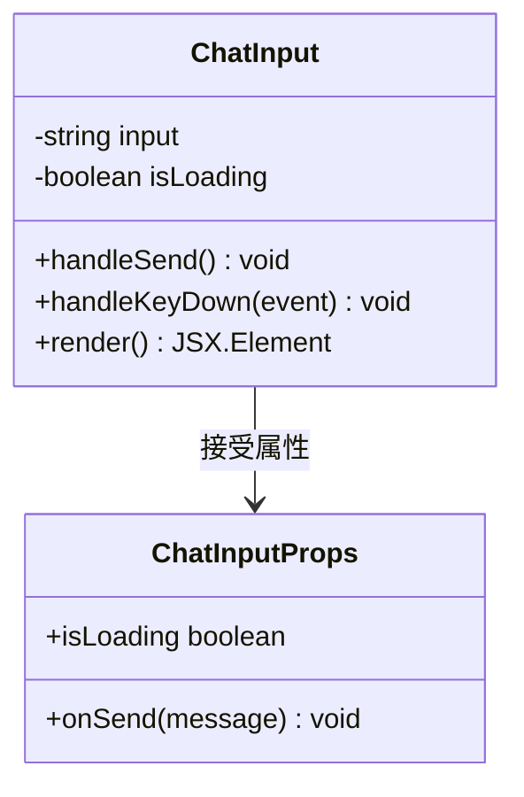
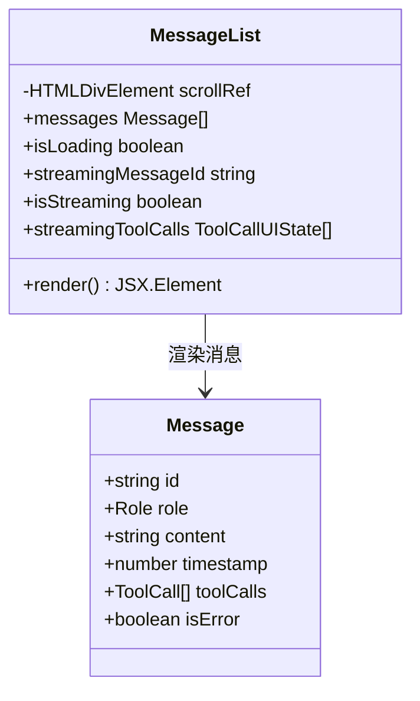
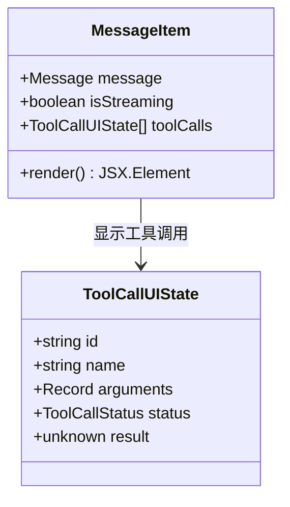
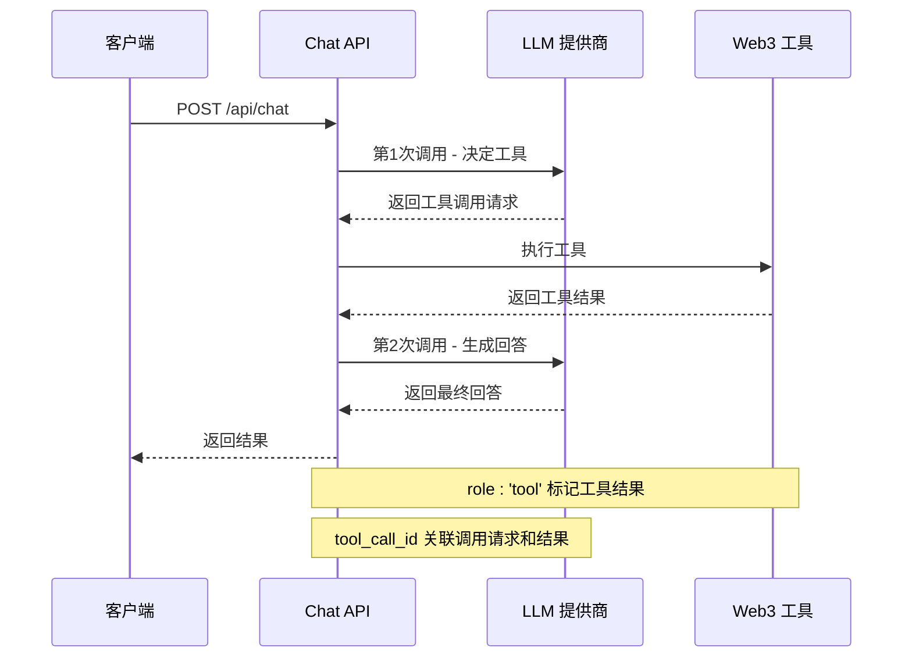
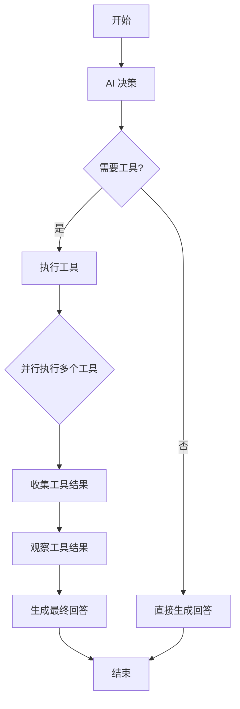
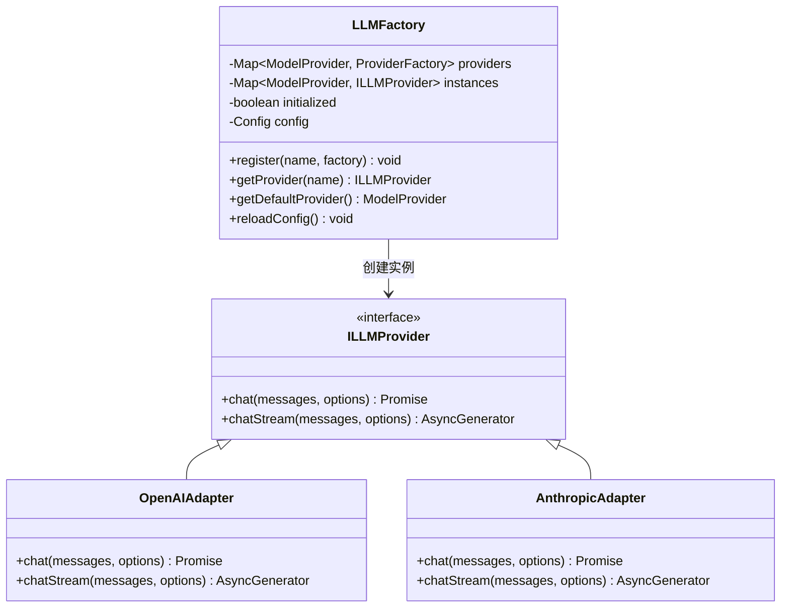
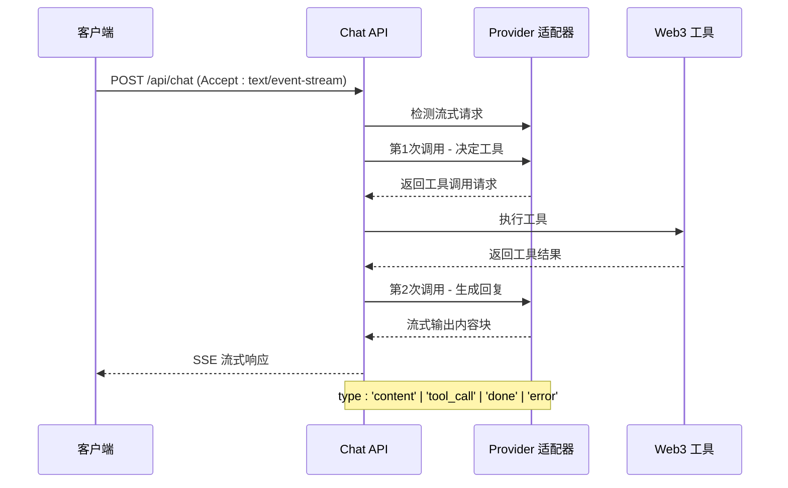
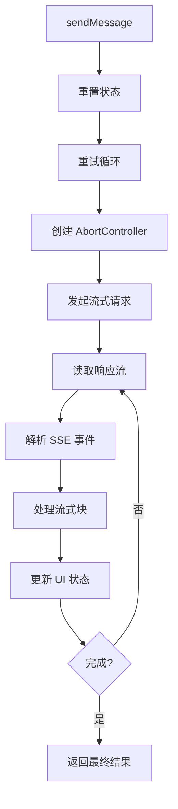
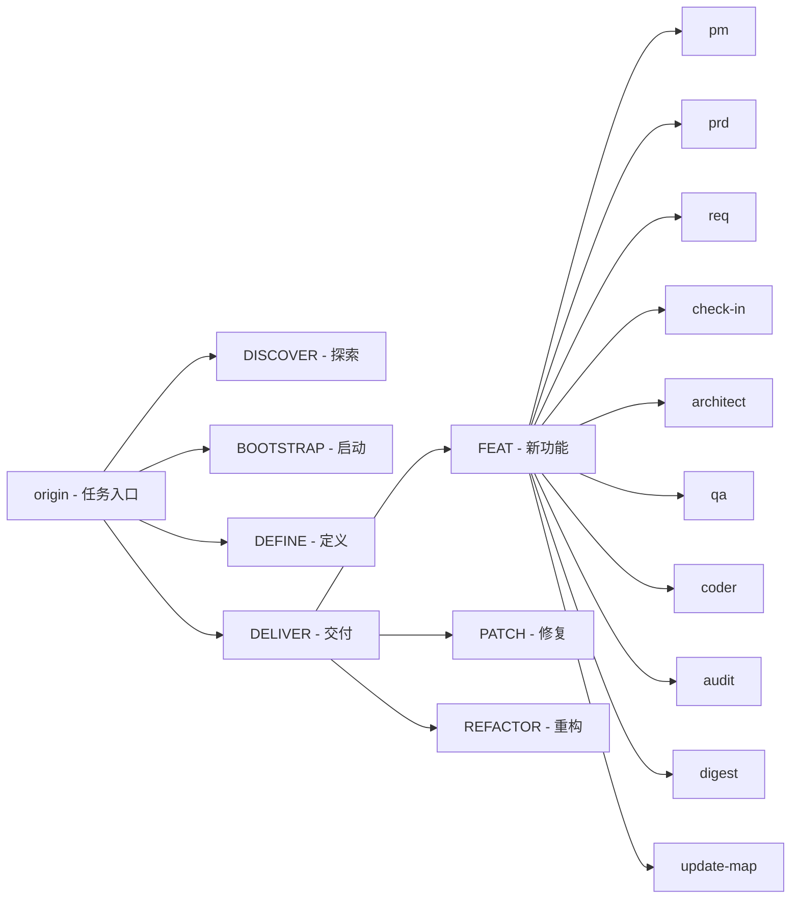

# 学习笔记

<cite>
**本文引用的文件**
- [README.md](file://README.md)
- [学习笔记.md](file://docs/学习笔记.md)
- [apps/web/app/page.tsx](file://apps/web/app/page.tsx)
- [apps/web/app/layout.tsx](file://apps/web/app/layout.tsx)
- [apps/web/app/api/chat/route.ts](file://apps/web/app/api/chat/route.ts)
- [apps/web/hooks/useChatStream.ts](file://apps/web/hooks/useChatStream.ts)
- [apps/web/types/stream.ts](file://apps/web/types/stream.ts)
- [apps/web/components/ChatInput.tsx](file://apps/web/components/ChatInput.tsx)
- [apps/web/components/MessageList.tsx](file://apps/web/components/MessageList.tsx)
- [apps/web/components/MessageItem.tsx](file://apps/web/components/MessageItem.tsx)
- [apps/web/types/chat.ts](file://apps/web/types/chat.ts)
- [packages/ai-config/src/types.ts](file://packages/ai-config/src/types.ts)
- [packages/ai-config/src/providers/openai.ts](file://packages/ai-config/src/providers/openai.ts)
- [skills/x-ray/MAP-V3.md](file://skills/x-ray/MAP-V3.md)
- [packages/ai-config/src/factory.ts](file://packages/ai-config/src/factory.ts)
- [apps/web/package.json](file://apps/web/package.json)
- [package.json](file://package.json)
- [docs/changelog/2026-04-21-feat-sse-streaming.md](file://docs/changelog/2026-04-21-feat-sse-streaming.md)
</cite>

## 更新摘要
**变更内容**
- 新增了完整的 Server-Sent Events (SSE) 流式聊天系统实现指南
- 新增了617行详细的SSE架构、数据流、性能优化、错误处理等核心技术文档
- 新增了useChatStream Hook、StreamChunk类型定义、流式状态管理等前端实现
- 新增了Provider适配器的流式输出支持，包含OpenAI和Anthropic的流式实现
- 新增了完整的流式聊天界面集成，支持实时内容展示和工具调用指示
- 新增了流式输出的完整生命周期管理，包括重试、超时、节流等机制

## 目录
1. [简介](#简介)
2. [项目结构](#项目结构)
3. [核心组件](#核心组件)
4. [架构概览](#架构概览)
5. [详细组件分析](#详细组件分析)
6. [Server-Sent Events (SSE) 流式聊天系统](#server-sent-events-sse-流式聊天系统)
7. [AI Agent核心概念深度解析](#ai-agent核心概念深度解析)
8. [Function Calling机制详解](#function-calling机制详解)
9. [Agent Loop核心理解](#agent-loop核心理解)
10. [Memory与上下文管理](#memory与上下文管理)
11. [RAG检索增强生成技术](#rag检索增强生成技术)
12. [依赖分析](#依赖分析)
13. [性能考虑](#性能考虑)
14. [故障排除指南](#故障排除指南)
15. [结论](#结论)
16. [附录](#附录)

## 简介

Web3 AI Agent 是一个面向 Web3 前端开发者的 AI Agent 项目，旨在实现从需求定义到代码交付的完整 SDLC 自动化流程。该项目的核心目标是从 Web3 前端工程师升级为 AI 应用工程师/Agent 工程师，既作为学习载体，也为未来展示作品集奠定基础。

项目验证的核心不是"做一个聊天页面"，而是"做一个能够理解用户意图、调用 Web3 工具、返回可信结果，并具备最小风险边界的 AI Agent"。

**更新** 新增了完整的 Server-Sent Events (SSE) 流式聊天系统实现指南，包含617行详细的技术文档，涵盖SSE架构、数据流、性能优化、错误处理等核心技术要点。该系统支持实时内容展示、工具调用指示、自动重试、超时处理等功能，显著提升了用户体验。

## 项目结构

该项目采用 Monorepo 架构，主要包含以下核心部分：

```mermaid
graph TB
subgraph "应用层 (apps)"
WEB[apps/web - Next.js 应用]
END
subgraph "共享包 (packages)"
AI_CONFIG[packages/ai-config - AI 配置包]
WEB3_TOOLS[packages/web3-tools - Web3 工具包]
END
subgraph "技能体系 (skills)"
X_RAY[skills/x-ray - 技能体系]
END
subgraph "文档 (docs)"
DOCS[项目文档]
LEARNING_NOTES[学习笔记 - 新增SSE流式聊天系统]
CHANGES[变更日志 - SSE实现]
END
WEB --> AI_CONFIG
WEB --> WEB3_TOOLS
WEB -.-> DOCS
X_RAY -.-> DOCS
CHANGES -.-> LEARNING_NOTES
```

**图表来源**
- [README.md: 26-38:26-38](file://README.md#L26-L38)
- [skills/x-ray/MAP-V3.md: 63-89:63-89](file://skills/x-ray/MAP-V3.md#L63-L89)

**章节来源**
- [README.md: 26-38:26-38](file://README.md#L26-L38)
- [skills/x-ray/MAP-V3.md: 63-89:63-89](file://skills/x-ray/MAP-V3.md#L63-L89)

## 核心组件

### 技术栈
- **前端框架**: Next.js 14 + React + TypeScript
- **样式**: Tailwind CSS
- **AI 能力**: OpenAI API
- **Web3**: ethers.js
- **开发语言**: TypeScript
- **流式通信**: Server-Sent Events (SSE)

### 核心能力
- **对话能力**: 基础聊天界面，支持流式输出
- **Tool Calling**: 调用 Web3 工具获取链上数据
- **Agent Loop**: 理解用户意图，自主决策工具调用
- **最小 Memory**: 保持会话上下文连续性
- **流式输出**: SSE 实现实时聊天体验
- **实时工具调用**: 显示工具执行状态和结果

**更新** 新增了SSE流式聊天系统的完整实现，包括前端Hook、后端API路由、Provider适配器等核心组件，以及完整的流式状态管理机制。

**章节来源**
- [README.md: 18-25:18-25](file://README.md#L18-L25)
- [README.md: 11-17:11-17](file://README.md#L11-L17)

## 架构概览

系统采用分层架构设计，实现了清晰的关注点分离：

```mermaid
graph TB
subgraph "表现层 (Presentation Layer)"
UI[React 组件]
CHAT_INPUT[ChatInput]
MESSAGE_LIST[MessageList]
USE_CHAT_STREAM[useChatStream Hook]
END
subgraph "应用层 (Application Layer)"
PAGE[page.tsx 主页面]
API_ROUTE[API 路由处理器]
END
subgraph "基础设施层 (Infrastructure Layer)"
LLM_FACTORY[LLM 工厂]
PROVIDER[LLM 提供商]
CONFIG[配置管理]
END
subgraph "工具层 (Tools Layer)"
WEB3_TOOLS[Web3 工具集]
PRICE_TOOL[价格查询工具]
WALLET_TOOL[钱包余额工具]
GAS_TOOL[GAS 价格工具]
END
subgraph "流式通信层 (Streaming Layer)"
SSE_SERVER[SSE 服务器]
SSE_CLIENT[SSE 客户端]
STREAM_HOOK[useChatStream Hook]
END
UI --> PAGE
PAGE --> API_ROUTE
API_ROUTE --> LLM_FACTORY
LLM_FACTORY --> PROVIDER
API_ROUTE --> WEB3_TOOLS
WEB3_TOOLS --> PRICE_TOOL
WEB3_TOOLS --> WALLET_TOOL
WEB3_TOOLS --> GAS_TOOL
USE_CHAT_STREAM --> API_ROUTE
USE_CHAT_STREAM --> SSE_SERVER
SSE_SERVER --> SSE_CLIENT
SSE_CLIENT --> STREAM_HOOK
```

**图表来源**
- [apps/web/app/page.tsx: 1-147:1-147](file://apps/web/app/page.tsx#L1-L147)
- [apps/web/app/api/chat/route.ts: 1-343:1-343](file://apps/web/app/api/chat/route.ts#L1-L343)
- [packages/ai-config/src/factory.ts: 16-83:16-83](file://packages/ai-config/src/factory.ts#L16-L83)

## 详细组件分析

### 聊天界面组件

#### ChatInput 组件
ChatInput 是用户输入的主要组件，提供了友好的交互体验：



**图表来源**
- [apps/web/components/ChatInput.tsx: 10-74:10-74](file://apps/web/components/ChatInput.tsx#L10-L74)

#### MessageList 组件
MessageList 负责渲染消息历史并提供自动滚动功能：



**图表来源**
- [apps/web/components/MessageList.tsx: 12-44:12-44](file://apps/web/components/MessageList.tsx#L12-L44)
- [apps/web/types/chat.ts: 1-28:1-28](file://apps/web/types/chat.ts#L1-L28)

#### MessageItem 组件
MessageItem 负责渲染单个消息项，支持流式内容和工具调用状态展示：



**图表来源**
- [apps/web/components/MessageItem.tsx: 12-97:12-97](file://apps/web/components/MessageItem.tsx#L12-L97)
- [apps/web/types/stream.ts: 18-25:18-25](file://apps/web/types/stream.ts#L18-L25)

**章节来源**
- [apps/web/components/ChatInput.tsx: 1-74:1-74](file://apps/web/components/ChatInput.tsx#L1-L74)
- [apps/web/components/MessageList.tsx: 1-59:1-59](file://apps/web/components/MessageList.tsx#L1-L59)
- [apps/web/components/MessageItem.tsx: 1-97:1-97](file://apps/web/components/MessageItem.tsx#L1-L97)
- [apps/web/types/chat.ts: 1-28:1-28](file://apps/web/types/chat.ts#L1-L28)

### API 路由处理

#### Function Calling 流程
系统实现了标准的 Function Calling 模式，包含两次 API 调用：



**图表来源**
- [apps/web/app/api/chat/route.ts: 94-179:94-179](file://apps/web/app/api/chat/route.ts#L94-L179)

#### Agent Loop 实现
当前实现支持一次循环的 Agent Loop，可以并行执行多个工具：



**图表来源**
- [apps/web/app/api/chat/route.ts: 108-179:108-179](file://apps/web/app/api/chat/route.ts#L108-L179)

**章节来源**
- [apps/web/app/api/chat/route.ts: 1-203:1-203](file://apps/web/app/api/chat/route.ts#L1-L203)

### AI 配置管理

#### LLM 工厂模式
系统采用工厂模式管理不同的 LLM 提供商：



**图表来源**
- [packages/ai-config/src/factory.ts: 16-118:16-118](file://packages/ai-config/src/factory.ts#L16-L118)

**章节来源**
- [packages/ai-config/src/factory.ts: 16-118:16-118](file://packages/ai-config/src/factory.ts#L16-L118)

## Server-Sent Events (SSE) 流式聊天系统

### SSE 架构设计

#### 目标
为 Web3 AI Agent 添加 SSE 流式输出支持，让用户能够实时看到 AI 回复的生成过程，提升交互体验。

#### 模块边界
- `apps/web/app/api/chat/` - 后端 API 路由，处理 SSE 流式响应
- `packages/ai-config/src/providers/` - Provider 适配器，支持流式输出
- `packages/ai-config/src/types.ts` - 新增 StreamChunk 统一类型
- `apps/web/hooks/` - 前端 Hook，管理流式状态
- `apps/web/types/stream.ts` - 前端流式类型定义
- `apps/web/components/` - 消息组件，支持流式内容展示

#### 接口契约

**统一流式输出块定义**：
```typescript
interface StreamChunk {
  type: 'content' | 'tool_call' | 'done' | 'error'
  content?: string
  toolCall?: ToolCall
  error?: string
}

// 后端流式响应类型
export type StreamResponse = AsyncIterable<StreamChunk>

// 前端流式 UI 状态
interface StreamUIState {
  isStreaming: boolean
  content: string
  error: string | null
  toolCalls: ToolCallUIState[]
}

// 前端 Hook 返回接口
interface UseChatStreamReturn {
  isStreaming: boolean
  content: string
  error: string | null
  toolCalls: ToolCallUIState[]
  sendMessage: (messages: Array<{ role: string; content: string }>) => Promise<...>
  abort: () => void
}
```

**章节来源**
- [apps/web/app/api/chat/route.ts: 25-54:25-54](file://apps/web/app/api/chat/route.ts#L25-L54)
- [packages/ai-config/src/types.ts: 59-68:59-68](file://packages/ai-config/src/types.ts#L59-L68)
- [apps/web/hooks/useChatStream.ts: 7-14:7-14](file://apps/web/hooks/useChatStream.ts#L7-L14)

### 数据流架构

#### 流式请求流程
1. 前端发送请求，设置 `Accept: text/event-stream` 请求头
2. 后端检测流式请求，创建 `ReadableStream`
3. Provider 适配器逐块生成 StreamChunk
4. 通过 `TextEncoder` 编码并推送到响应流
5. 前端 `EventSource` 或 `fetch + ReadableStream` 接收数据
6. `useChatStream` Hook 解析并更新 UI 状态

#### 工具调用流式场景
1. 第一次 API 调用：AI 决定调用工具（tool_call）
2. 工具执行结果回填
3. 第二次 API 调用：生成最终回复（content 流式推送）



**图表来源**
- [apps/web/app/api/chat/route.ts: 196-244:196-244](file://apps/web/app/api/chat/route.ts#L196-L244)
- [apps/web/hooks/useChatStream.ts: 77-117:77-117](file://apps/web/hooks/useChatStream.ts#L77-L117)

**章节来源**
- [apps/web/app/api/chat/route.ts: 56-70:56-70](file://apps/web/app/api/chat/route.ts#L56-L70)
- [apps/web/hooks/useChatStream.ts: 77-117:77-117](file://apps/web/hooks/useChatStream.ts#L77-L117)

### 风险点与解决方案

#### 浏览器兼容性
- **问题**: EventSource 不支持自定义 headers，使用 fetch + ReadableStream 替代
- **解决方案**: 前端使用 fetch API 的 ReadableStream 接收 SSE 数据

#### 错误处理
- **问题**: 流式过程中需要优雅处理中断、超时和错误
- **解决方案**: 
  - 设置 MAX_RETRIES = 2，避免无限重试
  - 设置 TIMEOUT_MS = 30000，超时自动中止
  - 提供 abort 方法中断流式输出

#### 状态管理
- **问题**: 流式内容需要与现有消息列表正确合并
- **解决方案**: 
  - 使用节流更新（THROTTLE_MS = 50ms），减少 React 重渲染
  - 提供 streamingMessageId 标识流式消息
  - 支持工具调用状态跟踪

**章节来源**
- [apps/web/app/api/chat/route.ts: 71-77:71-77](file://apps/web/app/api/chat/route.ts#L71-L77)
- [apps/web/hooks/useChatStream.ts: 16-18:16-18](file://apps/web/hooks/useChatStream.ts#L16-L18)

### 前端实现

#### useChatStream Hook
useChatStream 是核心的流式状态管理 Hook：



**图表来源**
- [apps/web/hooks/useChatStream.ts: 167-252:167-252](file://apps/web/hooks/useChatStream.ts#L167-L252)

#### 流式状态管理
- **isStreaming**: 标识当前是否处于流式状态
- **content**: 实时累积的流式内容
- **error**: 错误信息
- **toolCalls**: 工具调用状态列表
- **sendMessage**: 发送消息并开始流式输出
- **abort**: 中止流式输出

**章节来源**
- [apps/web/hooks/useChatStream.ts: 27-294:27-294](file://apps/web/hooks/useChatStream.ts#L27-L294)

### 后端实现

#### SSE 流式响应
后端 API 路由支持两种响应模式：

1. **JSON 模式**（向后兼容）
2. **SSE 流式模式**（新增）

```typescript
// 检测流式请求
const accept = request.headers.get('accept')
const isStream = accept === 'text-event-stream'

// SSE 流式响应
if (isStream) {
  const stream = new ReadableStream({
    async start(controller) {
      const encoder = new TextEncoder()
      
      // 发送工具调用信息
      for (const tc of toolCalls) {
        const chunk: StreamChunk = {
          type: 'tool_call',
          toolCall: {
            id: tc.id,
            type: 'function',
            function: {
              name: tc.name,
              arguments: JSON.stringify(tc.arguments),
            },
          },
        }
        controller.enqueue(encoder.encode(`event: chunk\ndata: ${JSON.stringify(chunk)}\n\n`))
      }
      
      // 流式输出最终回复
      const secondStream = provider.chatStream(messagesWithToolResults)
      for await (const chunk of secondStream) {
        controller.enqueue(encoder.encode(`event: chunk\ndata: ${JSON.stringify(chunk)}\n\n`))
      }
      
      controller.close()
    },
  })
  
  return new Response(stream, {
    headers: {
      'Content-Type': 'text/event-stream',
      'Cache-Control': 'no-cache',
      'Connection': 'keep-alive',
      'X-Accel-Buffering': 'no',
    },
  })
}
```

**章节来源**
- [apps/web/app/api/chat/route.ts: 196-244:196-244](file://apps/web/app/api/chat/route.ts#L196-L244)

### Provider 适配器流式支持

#### OpenAI 流式实现
OpenAI Provider 实现了完整的流式输出支持：

```typescript
async *chatStream(messages: Message[], options?: ChatOptions): AsyncGenerator<StreamChunk> {
  // 调用 OpenAI 流式 API
  const stream = await this.client.chat.completions.create({
    model: this.config.model,
    messages: openaiMessages,
    tools: tools,
    tool_choice: tools ? 'auto' : undefined,
    temperature: options?.temperature ?? this.config.temperature,
    max_tokens: options?.maxTokens ?? this.config.maxTokens,
    stream: true,
  })

  // 工具调用分片缓冲区，按 index 聚合
  const toolCallBuffers: Record<number, {
    id?: string
    name?: string
    arguments: string
  }> = {}

  for await (const chunk of stream) {
    const delta = chunk.choices[0]?.delta
    
    if (delta?.content) {
      yield { type: 'content', content: delta.content }
    }
    
    if (delta?.tool_calls) {
      for (const tc of delta.tool_calls) {
        const idx = tc.index ?? 0
        if (!toolCallBuffers[idx]) {
          toolCallBuffers[idx] = { arguments: '' }
        }
        if (tc.id) toolCallBuffers[idx].id = tc.id
        if (tc.function?.name) toolCallBuffers[idx].name = tc.function.name
        if (tc.function?.arguments) {
          toolCallBuffers[idx].arguments += tc.function.arguments
        }
        
        const buf = toolCallBuffers[idx]
        // 当 id、name、arguments 都齐全时，尝试解析确认 JSON 完整
        if (buf.id && buf.name && buf.arguments) {
          try {
            JSON.parse(buf.arguments)
            yield {
              type: 'tool_call',
              toolCall: {
                id: buf.id,
                type: 'function',
                function: {
                  name: buf.name,
                  arguments: buf.arguments,
                },
              },
            }
            delete toolCallBuffers[idx]
          } catch {
            // JSON 不完整，等待更多参数分片
          }
        }
      }
    }
  }
  
  yield { type: 'done' }
}
```

**章节来源**
- [packages/ai-config/src/providers/openai.ts: 114-218:114-218](file://packages/ai-config/src/providers/openai.ts#L114-L218)

### 流式聊天界面集成

#### 页面集成
主页面集成了 useChatStream Hook，支持流式交互：

```typescript
const {
  isStreaming,
  content: streamingContent,
  error: streamError,
  sendMessage,
} = useChatStream()

// 实时更新流式消息内容
useEffect(() => {
  if (streamingMessageId && isStreaming) {
    setMessages((prev) =>
      prev.map((m) =>
        m.id === streamingMessageId ? { ...m, content: streamingContent } : m
      )
    )
  }
}, [streamingContent, streamingMessageId, isStreaming])
```

#### 消息组件支持
MessageList 和 MessageItem 组件支持流式内容展示：

- **自动滚动**: 新消息到达时自动滚动到底部
- **流式指示器**: 显示 AI 正在思考的动画
- **工具调用状态**: 实时显示工具调用进度

**章节来源**
- [apps/web/app/page.tsx: 21-37:21-37](file://apps/web/app/page.tsx#L21-L37)
- [apps/web/components/MessageList.tsx: 25-30:25-30](file://apps/web/components/MessageList.tsx#L25-L30)

### 流式输出生命周期管理

#### 完整生命周期
1. **初始化**: 创建 AbortController 和状态管理器
2. **发送请求**: 设置 Accept: text/event-stream 头
3. **接收流**: 使用 ReadableStream 读取 SSE 事件
4. **解析事件**: 解析 data: 行为的 JSON 数据
5. **状态更新**: 更新 content、toolCalls、error 状态
6. **完成处理**: 清理资源，触发回调

#### 错误处理机制
- **网络错误**: 自动重试（最多2次）
- **超时处理**: 30秒超时自动中止
- **主动取消**: 用户可随时中止流式输出
- **配置错误**: 区分模型配置错误和其他错误

**章节来源**
- [apps/web/hooks/useChatStream.ts: 167-252:167-252](file://apps/web/hooks/useChatStream.ts#L167-L252)
- [apps/web/app/api/chat/route.ts: 297-341:297-341](file://apps/web/app/api/chat/route.ts#L297-L341)

## AI Agent核心概念深度解析

### 核心理解检查 - 逐题详解

#### 1. 我能解释为什么要调用两次 API

**核心答案**：第一次让 AI 决定"用什么工具"，第二次让 AI 基于工具结果"生成回答"。

**深入理解**

**如果只调用一次会怎样？**

```
❌ 错误理解：
AI 知道今天是 2024-04-20，直接告诉你 ETH 价格

✅ 实际情况：
AI 的训练数据截止到 2023 年，它不知道今天的 ETH 价格
所以 AI 需要：
  1. 先说"我想调用 getETHPrice 工具"
  2. 你的代码执行工具，获取实时价格 $2,284
  3. 再告诉 AI 这个结果
  4. AI 生成回答："ETH 当前价格是 $2,284"
```

**两次 API 调用的职责分工**：

| 调用次数 | AI 的输入 | AI 的输出 | 目的 |
|---------|----------|----------|------|
| **第 1 次** | 对话历史 + 工具定义 | 工具调用请求 | 让 AI 决定是否需要工具 |
| **执行工具** | - | 工具结果 `{price: 2284}` | 你的代码执行 |
| **第 2 次** | 对话历史 + 工具结果 | 自然语言回答 | 让 AI 生成最终回答 |

**代码证据**（route.ts）：

```typescript
// 第 1 次调用：AI 决定用什么工具（第 103 行）
const response = await provider.chat(chatMessages, { tools })

// AI 返回：{ toolCalls: [{name: 'getETHPrice'}] }

// 执行工具
const result = await getETHPrice()  // → {price: 2284}

// 第 2 次调用：AI 基于工具结果生成回答（第 167 行）
const secondResponse = await provider.chat(messagesWithToolResults)

// AI 返回："ETH 当前价格是 $2,284"
```

**类比理解**：
```
第 1 次调用 = 你问助手："帮我查一下 ETH 价格"
              助手说："好的，我去查"

执行工具   = 助手打开网页，查到价格 $2,284

第 2 次调用 = 助手回来告诉你："ETH 当前价格是 $2,284"
```

**章节来源**
- [apps/web/app/api/chat/route.ts: 38-51:38-51](file://apps/web/app/api/chat/route.ts#L38-L51)

#### 2. 我能画出 Function Calling 的完整流程图

**完整流程图**：

```
┌─────────────────────────────────────────┐
│  用户输入："ETH 价格多少？"              │
└────────────────┬────────────────────────┘
                 ↓
┌─────────────────────────────────────────┐
│  构建消息（route.ts 第 86-92 行）        │
│  ┌───────────────────────────────┐     │
│  │ messages: [                    │     │
│  │   {role: 'system', ...},      │     │
│  │   {role: 'user',              │     │
│  │    content: 'ETH 价格？'}     │     │
│  │ ]                              │     │
│  │                                │     │
│  │ tools: [                       │     │
│  │   {name: 'getETHPrice', ...}, │     │
│  │   {name: 'getWalletBalance'}  │     │
│  │ ]                              │     │
│  └───────────────────────────────┘     │
└────────────────┬────────────────────────┘
                 ↓
┌─────────────────────────────────────────┐
│  第 1 次 API 调用（第 103 行）           │
│                                         │
│  输入：messages + tools                 │
│  ↓                                      │
│  调用 OpenAI API                        │
│  ↓                                      │
│  输出：                                  │
│  {                                      │
│    content: null,                      │
│    toolCalls: [{                       │
│      id: 'call_123',                  │
│      function: {                       │
│        name: 'getETHPrice',           │
│        arguments: '{}'                │
│      }                                 │
│    }]                                  │
│  }                                      │
└────────────────┬────────────────────────┘
                 ↓
         判断：有 toolCalls？
                 ↓ 是
┌─────────────────────────────────────────┐
│  执行工具（第 110-138 行）               │
│                                         │
│  switch (functionName) {               │
│    case 'getETHPrice':                 │
│      result = await getETHPrice()      │
│      ↓                                  │
│      调用 price.ts 第 20-83 行          │
│      fetch('https://api.binance.com')   │
│      ↓                                  │
│      返回: {                            │
│        success: true,                  │
│        data: {price: 2284.32}          │
│      }                                  │
│  }                                      │
└────────────────┬────────────────────────┘
                 ↓
┌─────────────────────────────────────────┐
│  构建带工具结果的消息（第 151-162 行）    │
│  ┌───────────────────────────────┐     │
│  │ messagesWithToolResults: [     │     │
│  │   ...原始消息,                 │     │
│  │   {                            │     │
│  │     role: 'assistant',        │     │
│  │     content: ''               │     │
│  │   },                           │     │
│  │   {                            │     │
│  │     role: 'tool',  ← 关键！   │     │
│  │     content:                  │     │
│  │       '{"price": 2284.32}',   │     │
│  │     tool_call_id: 'call_123'  │     │
│  │   }                            │     │
│  │ ]                              │     │
│  └───────────────────────────────┘     │
└────────────────┬────────────────────────┘
                 ↓
┌─────────────────────────────────────────┐
│  第 2 次 API 调用（第 167 行）           │
│                                         │
│  输入：messagesWithToolResults          │
│  ↓                                      │
│  调用 OpenAI API                        │
│  ↓                                      │
│  输出：                                  │
│  {                                      │
│    content:                            │
│      "ETH 当前价格是 **$2,284.32**..." │
│  }                                      │
└────────────────┬────────────────────────┘
                 ↓
┌─────────────────────────────────────────┐
│  返回给用户（第 169-172 行）             │
│  NextResponse.json({                    │
│    content: "ETH 当前价格是..."         │
│  })                                     │
└─────────────────────────────────────────┘
```

**流程图简化版（记住这个）**：

```
用户提问 → 第1次API（决定工具） → 执行工具 → 第2次API（生成回答） → 返回用户
```

**章节来源**
- [apps/web/app/api/chat/route.ts: 67-179:67-179](file://apps/web/app/api/chat/route.ts#L67-L179)

#### 3. 我理解 role: 'tool' 的作用

**核心答案**：`role: 'tool'` 是告诉 AI"这是工具的执行结果"。

**深入理解**

**消息的 4 种角色**：

| role | 含义 | 示例 |
|------|------|------|
| `system` | 系统设定（人设） | "你是 Web3 AI 助手" |
| `user` | 用户输入 | "ETH 价格多少？" |
| `assistant` | AI 回复 | "让我查一下..." |
| **`tool`** | **工具结果** | **"{price: 2284.32}"** |

**为什么需要 `role: 'tool'`？**

```typescript
// 第 2 次调用时发送的消息
const messagesWithToolResults = [
  { role: 'system', content: '你是 Web3 AI 助手' },
  { role: 'user', content: 'ETH 价格多少？' },
  { role: 'assistant', content: '' },  // AI 的第 1 次回复（空）
  {
    role: 'tool',                      // ← 告诉 AI：这是工具结果！
    content: '{"success":true,"data":{"price":2284.32}}',
    tool_call_id: 'call_123'           // ← 关联到具体的工具调用
  }
]
```

**AI 看到这个消息时会**：

1. 看到 `role: 'tool'` → 知道这不是用户说的，是工具返回的
2. 看到 `tool_call_id: 'call_123'` → 知道对应第 1 次调用中的工具请求
3. 解析 `content` 中的 JSON → 获取价格数据 `{price: 2284.32}`
4. 生成自然语言回答 → "ETH 当前价格是 $2,284.32"

**如果不用 `role: 'tool'` 会怎样？**

```typescript
// ❌ 错误做法：把工具结果当作用户消息
{
  role: 'user',  // AI 会以为这是用户说的
  content: '{"price": 2284.32}'
}

// AI 可能回答：
// "你发的这个 JSON 是什么意思？"

// ✅ 正确做法：使用 role: 'tool'
{
  role: 'tool',  // AI 知道这是工具结果
  content: '{"price": 2284.32}',
  tool_call_id: 'call_123'
}

// AI 回答：
// "ETH 当前价格是 $2,284.32"
```

**代码位置**（route.ts 第 157-160 行）：

```typescript
...toolCalls.map((tc) => ({
  role: 'tool',                        // ← 关键：role 是 'tool'
  content: JSON.stringify(tc.result),  // 工具结果转 JSON
  tool_call_id: tc.id,                 // 关联 ID
})),
```

**章节来源**
- [apps/web/app/api/chat/route.ts: 178-247:178-247](file://apps/web/app/api/chat/route.ts#L178-L247)

#### 4. 我能在代码中找到工具定义和执行位置

**工具定义**（告诉 AI 有哪些工具可用）：

```
文件：apps/web/app/api/chat/route.ts
行号：第 8-50 行

const tools: Tool[] = [
  {
    type: 'function',
    function: {
      name: 'getETHPrice',                    // ← 工具名称
      description: '获取 ETH 当前价格（美元）', // ← AI 根据这个决定何时调用
      parameters: {                            // ← 工具需要的参数
        type: 'object',
        properties: {},
        required: [],
      },
    },
  },
  {
    type: 'function',
    function: {
      name: 'getWalletBalance',
      description: '查询以太坊钱包地址的 ETH 余额',
      parameters: {
        type: 'object',
        properties: {
          address: {                          // ← 需要参数
            type: 'string',
            description: '以太坊钱包地址（0x 开头）',
          },
        },
        required: ['address'],
      },
    },
  },
  {
    type: 'function',
    function: {
      name: 'getGasPrice',
      description: '获取当前以太坊 Gas 价格',
      parameters: { type: 'object', properties: {} },
    },
  },
]
```

**工具执行**（实际调用工具函数）：

```
文件：apps/web/app/api/chat/route.ts
行号：第 110-138 行

// 根据工具名称执行对应函数
switch (functionName) {
  case 'getETHPrice':
    result = await getETHPrice()  // ← 调用这个函数
    break
  case 'getWalletBalance':
    result = await getWalletBalance(functionArgs.address)
    break
  case 'getGasPrice':
    result = await getGasPrice()
    break
  default:
    result = { success: false, error: `未知工具: ${functionName}` }
}
```

**工具实现**（工具的具体逻辑）：

```
文件：packages/web3-tools/src/price.ts
行号：第 20-83 行

export async function getETHPrice(): Promise<ToolResult<ETHPriceData>> {
  // 多数据源容错
  const sources = [
    { name: 'Binance CN', url: 'https://api.binance.com/...' },
    { name: 'Huobi', url: 'https://api.huobi.pro/...' },
  ]
  
  for (const source of sources) {
    const response = await fetch(source.url, { agent: proxyAgent })
    const data = await response.json()
    return { success: true, data: { price: 2284.32 } }
  }
}
```

**记忆口诀**：

```
定义工具：route.ts 第 8-50 行  （告诉 AI 有什么工具）
调用工具：route.ts 第 110-138 行（根据名称执行函数）
实现工具：price.ts 第 20-83 行   （具体的业务逻辑）
```

**章节来源**
- [apps/web/app/api/chat/route.ts: 253-350:253-350](file://apps/web/app/api/chat/route.ts#L253-L350)

#### 5. 我 know tool_call_id 的作用

**核心答案**：`tool_call_id` 用于关联"工具调用请求"和"工具执行结果"。

**深入理解**

**为什么需要关联？**

```
场景：AI 一次调用多个工具

第 1 次 API 调用返回：
{
  toolCalls: [
    { id: 'call_001', name: 'getETHPrice' },
    { id: 'call_002', name: 'getWalletBalance' }
  ]
}

执行工具后：
- getETHPrice() → { price: 2284 }
- getWalletBalance() → { balance: 1.5 }

第 2 次 API 调用需要告诉 AI：
{
  role: 'tool',
  content: '{"price": 2284}',
  tool_call_id: 'call_001'  ← 对应 getETHPrice
}
{
  role: 'tool',
  content: '{"balance": 1.5}',
  tool_call_id: 'call_002'  ← 对应 getWalletBalance
}
```

**如果没有 tool_call_id 会怎样？**

```typescript
// ❌ 错误做法：不关联
{
  role: 'tool',
  content: '{"price": 2284}'
  // 没有 tool_call_id
}

// AI 不知道这个结果对应哪个工具调用
// 可能导致混乱
```

**代码中的完整流程**：

```typescript
// 第 1 次调用：AI 返回工具请求（第 103 行）
const response = await provider.chat(chatMessages, { tools })
// 返回: { toolCalls: [{ id: 'call_123', name: 'getETHPrice' }] }

// 执行工具（第 110-138 行）
for (const toolCall of response.toolCalls) {
  const result = await executeTool(toolCall)
  
  toolCalls.push({
    id: toolCall.id,        // ← 保存 ID
    name: toolCall.function.name,
    arguments: functionArgs,
    result,                 // ← 保存结果
  })
}

// 第 2 次调用：关联工具结果（第 157-160 行）
...toolCalls.map((tc) => ({
  role: 'tool',
  content: JSON.stringify(tc.result),
  tool_call_id: tc.id,  // ← 关联回原来的工具调用
}))
```

**类比理解**：

```
tool_call_id 就像快递单号：

第 1 次调用：你下了一个订单（call_123）
              "帮我查 ETH 价格"

执行工具：    快递员去取货
              查到价格 $2,284

第 2 次调用：快递送到，附带单号（call_123）
              AI 看到单号，知道这是哪个订单的结果
```

**章节来源**
- [apps/web/app/api/chat/route.ts: 353-428:353-428](file://apps/web/app/api/chat/route.ts#L353-L428)

#### 6. 我能解释 AI 如何决定调用哪个工具

**核心答案**：工具定义（`description`）也是 Prompt 的一部分，AI 根据工具描述和用户问题匹配。

**深入理解**

**你发送给 AI 的完整内容**：

```typescript
{
  messages: [
    { role: 'system', content: '你是 Web3 AI 助手' },
    { role: 'user', content: 'ETH 价格多少？' }
  ],
  tools: [  // ← 这些也会发给 AI！
    {
      type: 'function',
      function: {
        name: 'getETHPrice',
        description: '获取 ETH 当前价格（美元）',  // ← AI 读这个
        parameters: { type: 'object', properties: {} }
      }
    },
    {
      type: 'function',
      function: {
        name: 'getWalletBalance',
        description: '查询以太坊钱包地址的 ETH 余额',  // ← AI 也读这个
        parameters: { 
          properties: {
            address: { type: 'string', description: '以太坊钱包地址' }
          }
        }
      }
    }
  ]
}
```

**AI 的推理过程**：

```
1. 读取用户问题："ETH 价格多少？"

2. 查看可用工具列表：
   - getETHPrice: "获取 ETH 当前价格（美元）"
   - getWalletBalance: "查询以太坊钱包地址的 ETH 余额"
   - getGasPrice: "获取当前以太坊 Gas 价格"

3. 语义匹配：
   - 用户问 "价格" → 匹配到 getETHPrice 的 "价格"
   - 用户问 "ETH" → 匹配到 getETHPrice 的 "ETH"
   - 没有提到 "钱包地址" → 不匹配 getWalletBalance

4. 决定：调用 getETHPrice 工具

5. 返回：
   {
     toolCalls: [{
       id: 'call_123',
       function: {
         name: 'getETHPrice',
         arguments: '{}'  // 不需要参数
       }
     }]
   }
```

**如何提高 AI 的调用准确率？**

```typescript
// ❌ 工具描述不清晰
{
  name: 'getETHPrice',
  description: '获取价格'  // 太模糊，AI 不知道是什么价格
}

// ✅ 工具描述清晰
{
  name: 'getETHPrice',
  description: '获取 ETH（以太坊）的当前美元价格',  // 明确
  parameters: {
    properties: {},
    required: []
  }
}
```

**AI 决策的代码证据**：

```typescript
// 工具定义中的 description（第 13 行）
description: '获取 ETH 当前价格（美元）'

// 当用户问 "ETH 价格多少？" 时
// AI 看到：
// - 用户问题包含 "ETH" 和 "价格"
// - 工具描述包含 "ETH" 和 "价格"
// - 完美匹配！

// AI 决定调用 getETHPrice
```

**实验验证**：

```
实验 1：用户问 "ETH 多少钱？"
→ AI 调用 getETHPrice（匹配成功）

实验 2：用户问 "以太坊价格"
→ AI 调用 getETHPrice（语义理解）

实验 3：用户问 "钱包余额"
→ AI 调用 getWalletBalance

实验 4：用户问 "今天天气如何？"
→ AI 不调用工具（没有匹配的工具）
   回答："我只能查询 Web3 相关信息..."
```

**章节来源**
- [apps/web/app/api/chat/route.ts: 447-566:447-566](file://apps/web/app/api/chat/route.ts#L447-L566)

#### 总结：6 个核心理解的关系

```
1. 为什么调用两次 API？
   ↓ 因为要分两步：决定工具 → 生成回答

2. 完整流程图？
   ↓ 用户 → API1 → 执行工具 → API2 → 返回

3. role: 'tool' 的作用？
   ↓ 标记工具结果，让 AI 区分用户输入和工具输出

4. 工具定义和执行位置？
   ↓ 定义在 route.ts 第 8-50 行，执行在第 110-138 行

5. tool_call_id 的作用？
   ↓ 关联工具请求和工具结果（像快递单号）

6. AI 如何决定调用哪个工具？
   ↓ 根据工具描述（description）和用户问题匹配
```

**章节来源**
- [apps/web/app/api/chat/route.ts: 567-591:567-591](file://apps/web/app/api/chat/route.ts#L567-L591)

## Agent Loop核心理解

### 核心理解检查（5 个关键点）

**问题**：如何深入理解 Agent Loop 的核心概念？

**答案**：

#### 1. 我能区分 Chat 和 Agent

**核心区别**：

| 特性 | Chat（聊天） | Agent（智能体） |
|------|------------|--------------|
| **调用次数** | 1 次 | 可能多次 |
| **工具使用** | 无 | 有（Function Calling） |
| **循环能力** | 无 | 有（Agent Loop） |
| **自主性** | 低（被动回答） | 高（主动决策） |
| **适用场景** | 问答、聊天 | 复杂任务、多步骤 |

**本质理解**：
```
Chat = 单次对话
Agent = Chat + Tools + Loop

Agent 的核心能力：
1. 能调用外部工具（扩展能力边界）
2. 能循环决策（智能决定何时停止）
3. 能基于工具结果生成回答
```

**代码对比**：
```typescript
// Chat：不需要工具，1 次调用
const response = await provider.chat(messages)
return response.content

// Agent：需要工具，2 次调用
const response = await provider.chat(messages, { tools })
if (response.toolCalls) {
  const results = await executeTools(response.toolCalls)
  const finalResponse = await provider.chat(messagesWithResults)
  return finalResponse.content
}
```

**章节来源**
- [apps/web/app/api/chat/route.ts: 606-649:606-649](file://apps/web/app/api/chat/route.ts#L606-L649)

#### 2. 我能解释当前实现是几次循环

**当前实现：1 次循环（但支持并行调用多个工具）**

**循环结构分析**：
```
Agent Loop (当前实现)
├─ 第 1 次 API 调用：决定用什么工具
│  └─ 返回: { toolCalls: [tool1, tool2, ...] }
│
├─ 第 1 层循环：执行所有工具（for 循环）
│  ├─ 执行 tool1 → result1
│  ├─ 执行 tool2 → result2
│  └─ ...
│
└─ 第 2 次 API 调用：生成最终回答
   └─ 返回: "ETH 价格 $2,284，钱包价值 $3,426"
```

**关键点**：
- ✅ 实现了**并行工具调用**（一次调用多个工具）
- ❌ 没有实现**多次循环**（工具结果后不再让 AI 继续决策）

**代码位置**（route.ts 第 98-161 行）：
```typescript
// 只有 2 次调用
const response = await provider.chat(chatMessages, { tools })  // 第 1 次

if (response.toolCalls) {
  // 执行工具
  const results = await executeTools(response.toolCalls)
  
  // 生成回答
  const finalResponse = await provider.chat(messagesWithResults)  // 第 2 次
  // 然后直接返回，不再循环
}
```

**章节来源**
- [apps/web/app/api/chat/route.ts: 652-688:652-688](file://apps/web/app/api/chat/route.ts#L652-L688)

#### 3. 我能画出 Decision-Action-Observation 循环

**DAO 循环模式**：
```
┌─────────────┐
│   决策       │ AI 决定下一步做什么
│ (Decision)  │ 分析当前信息，决定调用什么工具
└──────┬──────┘
       ↓
┌─────────────┐
│   执行       │ 代码执行工具
│  (Action)   │ 调用 API、查询数据库等
└──────┬──────┘
       ↓
┌─────────────┐
│   观察       │ 将工具结果反馈给 AI
│(Observation)│ AI 看到新信息
└──────┬──────┘
       ↓
  是否完成任务？
  ├─ 是 → 生成最终回答
  └─ 否 → 回到"决策"继续循环
```

**本项目中的 DAO 循环**：
```
第 1 次 DAO 循环：
├─ Decision: AI 分析用户问题 "ETH 价格？"
│            查看可用工具 [getETHPrice, getWalletBalance]
│            决定调用 getETHPrice
│
├─ Action:   代码执行 getETHPrice()
│            调用 Binance API
│            返回 {price: 2284.32}
│
└─ Observation: 将工具结果封装为 role: 'tool' 消息
                发送给 AI

第 2 次 DAO 循环（未实现，未来扩展）：
├─ Decision: AI 看到价格数据
│            判断是否需要更多工具？
│            不需要 → 生成最终回答
│
└─ 结束循环
```

**章节来源**
- [apps/web/app/api/chat/route.ts: 692-736:692-736](file://apps/web/app/api/chat/route.ts#L692-L736)

#### 4. 我能写出多次循环的伪代码

**多次循环实现**（未来扩展）：
```typescript
// 多次循环的完整伪代码
let maxLoops = 5  // 防止无限循环
let currentLoop = 0
let currentMessages = [...chatMessages]

while (currentLoop < maxLoops) {
  currentLoop++
  console.log(`=== 第 ${currentLoop} 次循环 ===`)
  
  // 1. Decision: 调用 AI 决定下一步
  const response = await provider.chat(currentMessages, { tools })
  
  // 2. 检查是否需要工具
  if (!response.toolCalls || response.toolCalls.length === 0) {
    // AI 不再需要工具，跳出循环
    console.log('AI 任务完成，跳出循环')
    return NextResponse.json({
      content: response.content,
      loops: currentLoop,
    })
  }
  
  // 3. Action: 执行工具
  const toolResults = []
  for (const toolCall of response.toolCalls) {
    const result = await executeTool(toolCall)
    toolResults.push({
      role: 'tool',
      content: JSON.stringify(result),
      tool_call_id: toolCall.id,
    })
  }
  
  // 4. Observation: 将工具结果加入消息
  currentMessages = [
    ...currentMessages,
    { role: 'assistant', content: response.content || '' },
    ...toolResults,
  ]
  
  // 5. 继续循环，让 AI 基于新信息决定下一步
}

// 超过最大循环次数
return NextResponse.json({
  error: '超过最大循环次数',
  loops: maxLoops,
})
```

**关键设计**：
1. **最大循环限制**：防止无限循环（`maxLoops = 5`）
2. **停止条件**：AI 不再需要工具时跳出循环
3. **消息累积**：每次循环都将工具结果加入消息历史
4. **循环计数**：记录实际循环次数，便于调试

**章节来源**
- [apps/web/app/api/chat/route.ts: 740-792:740-792](file://apps/web/app/api/chat/route.ts#L740-L792)

#### 5. 我能解释并行工具调用的实现

**并行工具调用**（当前已实现）：

```typescript
// route.ts 第 102-138 行
if (response.toolCalls && response.toolCalls.length > 0) {
  const toolCalls = []

  // 遍历所有工具调用（AI 可能一次要求调用多个工具）
  for (const toolCall of response.toolCalls) {
    const functionName = toolCall.function.name
    const functionArgs = JSON.parse(toolCall.function.arguments)

    let result
    try {
      // 根据名称调用对应函数
      switch (functionName) {
        case 'getETHPrice':
          result = await getETHPrice()
          break
        case 'getWalletBalance':
          result = await getWalletBalance(functionArgs.address)
          break
        case 'getGasPrice':
          result = await getGasPrice()
          break
        case 'getBTCPrice':
          result = await getBTCPrice()
          break
      }
    } catch (error) {
      result = { success: false, error: error.message }
    }

    toolCalls.push({
      id: toolCall.id,
      name: functionName,
      arguments: functionArgs,
      result,
    })
  }
}
```

**并行调用的场景**：
```
用户: "我的钱包 0x123... 值多少钱？"
  ↓
AI 同时调用 2 个工具：
  - getWalletBalance("0x123...") → 1.5 ETH
  - getETHPrice() → $2,284
  ↓
AI 计算: 1.5 × 2284 = $3,426
  ↓
AI: "你的钱包有 1.5 ETH，价值约 $3,426"
```

**真正的并行优化**（使用 Promise.all）：
```typescript
// 当前实现：顺序执行（一个接一个）
for (const toolCall of response.toolCalls) {
  const result = await executeTool(toolCall)  // 等待完成
}

// 优化后：真正并行（同时执行）
const results = await Promise.all(
  response.toolCalls.map(async (toolCall) => {
    const result = await executeTool(toolCall)
    return { ...toolCall, result }
  })
)
```

**对比**：
```
顺序执行：
getETHPrice() → 等待 2 秒 → 完成
getWalletBalance() → 等待 3 秒 → 完成
总耗时：5 秒

并行执行：
getETHPrice() ──┐
                ├─ 同时执行
getWalletBalance() ──┘
总耗时：3 秒（取最慢的那个）
```

**章节来源**
- [apps/web/app/api/chat/route.ts: 802-886:802-886](file://apps/web/app/api/chat/route.ts#L802-L886)

#### 关键点总结

- Chat vs Agent：Agent = Chat + Tools + Loop
- 当前循环：1 次循环，但支持并行调用多个工具
- DAO 模式：Decision → Action → Observation
- 多次循环：需要 while 循环 + 最大限制
- 并行调用：使用 for 循环（顺序）或 Promise.all（真正并行）

**相关代码文件**：
- `apps/web/app/api/chat/route.ts` 第 94-161 行（Agent Loop 核心逻辑）
- `packages/ai-config/src/providers/openai.ts` 第 35-112 行（LLM API 调用）

**章节来源**
- [apps/web/app/api/chat/route.ts: 887-900:887-900](file://apps/web/app/api/chat/route.ts#L887-L900)

## Memory与上下文管理

### 核心理解检查（5 个关键点）

**问题**：如何深入理解 AI Agent 的 Memory 机制？

**答案**：

#### 1. 我能解释 Memory 的本质是什么

**核心答案**：Memory = 维护一个 messages 数组，每次发送给 AI 时包含对话历史。

**深入理解**：
```
问题：HTTP 是无状态的，每次请求都是独立的
解决：客户端保存对话历史，每次发送给 AI

Memory 的本质 = 状态管理
- 前端：使用 useState 保存 messages 数组
- 后端：接收 messages，添加 system prompt，发送给 AI
- AI：基于完整上下文生成回复
```

**为什么需要 Memory？**
```
场景 1：没有 Memory
用户: "ETH 价格？"
AI: "$2,284"

用户: "那 BTC 呢？"
AI: "BTC 是什么？"（不知道你在问价格）

场景 2：有 Memory
用户: "ETH 价格？"
AI: "$2,284"

用户: "那 BTC 呢？"
AI: "BTC 价格是 $65,432"（知道你在问价格）
```

**代码本质**（page.tsx）：
```typescript
// Memory 就是一个状态数组
const [messages, setMessages] = useState<Message[]>([
  { role: 'assistant', content: '你好！我是 Web3 AI Agent...' }
])

// 每次发送消息时
const handleSendMessage = async (content: string) => {
  // 1. 添加用户消息到数组
  setMessages(prev => [...prev, { role: 'user', content }])
  
  // 2. 发送完整数组给 API
  const response = await fetch('/api/chat', {
    body: JSON.stringify({ messages })  // ← 完整历史
  })
  
  // 3. 添加 AI 回复到数组
  setMessages(prev => [...prev, { role: 'assistant', content: aiResponse }])
}
```

**章节来源**
- [apps/web/app/page.tsx: 902-960:902-960](file://apps/web/app/page.tsx#L902-L960)

#### 2. 我知道当前实现使用的是哪一级 Memory

**当前实现：L1 完整历史**

**Memory 的 4 个级别**：

| 级别 | 名称 | 实现方式 | Token 消耗 | 优点 | 缺点 | 适用场景 |
|------|------|---------|-----------|------|------|--------|
| **L1** | 完整历史 | 每次发送所有消息 | 高（线性增长） | 简单，上下文完整 | Token 浪费，有上限 | MVP、短对话 |
| **L2** | 滑动窗口 | 只保留最近 N 条 | 中（固定） | Token 可控 | 丢失早期信息 | 长对话 |
| **L3** | 摘要压缩 | 早期对话压缩成摘要 | 低 | 节省 Token，保留关键信息 | 实现复杂 | 长期对话 |
| **L4** | 向量数据库 | 语义检索相关历史 | 极低 | 长期记忆，精准检索 | 需要 RAG，复杂 | 知识库 |

**当前代码位置**（page.tsx）：
```typescript
// 没有任何限制，保存所有消息
const [messages, setMessages] = useState<Message[]>([
  { role: 'assistant', content: '你好！' }
])

// 每次都发送完整历史
const response = await fetch('/api/chat', {
  body: JSON.stringify({ messages })  // ← 所有消息
})
```

**为什么 MVP 选择 L1？**
- ✅ 实现最简单（只需一个 useState）
- ✅ 上下文最完整（AI 知道所有历史）
- ✅ 适合短对话（MVP 阶段够用）
- ❌ Token 消耗会增长（后续需要优化）

**章节来源**
- [apps/web/app/page.tsx: 964-995:964-995](file://apps/web/app/page.tsx#L964-L995)

#### 3. 我能指出 Token 消耗增长的原因

**核心原因**：每次对话都在 messages 数组中累积，发送的 Token 数量线性增长。

**Token 消耗分析**：
```
假设：每轮对话平均 50 Token

第 1 轮：
用户: "ETH 价格？"
Messages: [
  {role: 'user', content: 'ETH 价格？'}
]
Token: 10

第 2 轮：
用户: "那 BTC 呢？"
Messages: [
  {role: 'user', content: 'ETH 价格？'},        ← 仍然发送
  {role: 'assistant', content: '$2,284'},       ← 仍然发送
  {role: 'user', content: '那 BTC 呢？'}
]
Token: 30  ← 增长了 3 倍！

第 3 轮：
用户: "哪个更值得投资？"
Messages: [
  {role: 'user', content: 'ETH 价格？'},        ← 仍然发送
  {role: 'assistant', content: '$2,284'},       ← 仍然发送
  {role: 'user', content: '那 BTC 呢？'},       ← 仍然发送
  {role: 'assistant', content: '$65,432'},      ← 仍然发送
  {role: 'user', content: '哪个更值得投资？'}
]
Token: 55  ← 继续增长！
```

**数学公式**：
```
Token 消耗 = 初始 Token + (轮数 × 每轮平均 Token)

假设：
- 系统 Prompt: 200 Token
- 每轮对话: 50 Token
- 模型最大支持: 8192 Token

计算：
8192 = 200 + (n × 50)
n = (8192 - 200) / 50
n ≈ 160 轮

结论：大约可以支持 160 轮对话后达到上限
```

**代码证据**（route.ts 第 86-92 行）：
```typescript
// 接收前端传来的完整历史
const chatMessages: Message[] = [
  { role: 'system', content: SYSTEM_PROMPT },  // 200 Token
  ...messages.map((m) => ({                     // ← 所有历史消息
    role: m.role as Message['role'],
    content: m.content,
  })),
]

// 发送给 AI（包含所有消息）
const response = await provider.chat(chatMessages, { tools })
```

**章节来源**
- [apps/web/app/api/chat/route.ts: 998-1064:998-1064](file://apps/web/app/api/chat/route.ts#L998-L1064)

#### 4. 我能实现滑动窗口

**滑动窗口原理**：只保留最近 N 条消息，丢弃早期消息。

**实现代码**（page.tsx 修改）：
```typescript
// 添加最大消息数限制
const MAX_MESSAGES = 20  // 最多保留 20 条消息

const handleSendMessage = async (content: string) => {
  // 1. 添加新消息
  const newMessages = [...messages, { role: 'user', content }]
  
  // 2. 如果超过限制，保留最新的 N 条
  if (newMessages.length > MAX_MESSAGES) {
    console.log(`消息过多，保留最新的 ${MAX_MESSAGES} 条`)
    newMessages = newMessages.slice(-MAX_MESSAGES)  // ← 滑动窗口
  }
  
  setMessages(newMessages)
  
  // 3. 发送给 API
  const response = await fetch('/api/chat', {
    body: JSON.stringify({ messages: newMessages })
  })
  
  // 4. 添加 AI 回复（同样应用滑动窗口）
  const finalMessages = [...newMessages, { role: 'assistant', content: aiResponse }]
  if (finalMessages.length > MAX_MESSAGES) {
    finalMessages = finalMessages.slice(-MAX_MESSAGES)
  }
  setMessages(finalMessages)
}
```

**关键方法**：
```typescript
Array.prototype.slice(-N)
// 返回数组的最后 N 个元素

例子：
[1, 2, 3, 4, 5].slice(-3)  // → [3, 4, 5]
```

**滑动窗口效果**：
```
MAX_MESSAGES = 6

第 1-3 轮：正常累积
Messages: [msg1, msg2, msg3, msg4, msg5, msg6]

第 4 轮：触发滑动窗口
Messages: [msg1, msg2, msg3, msg4, msg5, msg6, msg7]
         ↓ 应用 slice(-6)
Messages: [msg2, msg3, msg4, msg5, msg6, msg7]  ← msg1 被丢弃

第 5 轮：继续滑动
Messages: [msg3, msg4, msg5, msg6, msg7, msg8]  ← msg2 被丢弃
```

**优点 vs 缺点**：
```
✅ 优点：
- Token 消耗固定（不会无限增长）
- 实现简单（只需一行代码）
- 适合长对话场景

❌ 缺点：
- 丢失早期对话（可能丢失重要上下文）
- 用户可能提到"刚才说的第一个问题"，但 AI 不记得了
```

**章节来源**
- [apps/web/app/page.tsx: 1068-1140:1068-1140](file://apps/web/app/page.tsx#L1068-L1140)

#### 5. 我能设计摘要压缩方案

**摘要压缩原理**：当对话超过一定轮数时，调用 AI 将早期对话压缩成摘要。

**实现代码**（概念示例）：
```typescript
const MAX_ROUNDS = 20  // 超过 20 轮时触发压缩

const compressEarlyMessages = async (messages: Message[]) => {
  // 1. 提取早期对话（前 20 轮）
  const earlyMessages = messages.slice(0, MAX_ROUNDS * 2)  // user + assistant
  
  // 2. 调用 AI 生成摘要
  const summaryResponse = await fetch('/api/chat', {
    body: JSON.stringify({
      messages: [
        { role: 'system', content: '请总结以下对话的关键信息，保留重要上下文：' },
        ...earlyMessages
      ]
    })
  })
  
  const summary = await summaryResponse.json()
  
  // 3. 用摘要替换早期对话
  const compressedMessages = [
    { role: 'system', content: `对话摘要：${summary.content}` },
    ...messages.slice(MAX_ROUNDS * 2)  // 保留最新消息
  ]
  
  return compressedMessages
}

// 在发送消息时使用
const handleSendMessage = async (content: string) => {
  const newMessages = [...messages, { role: 'user', content }]
  
  // 如果超过限制，先压缩
  if (newMessages.length > MAX_ROUNDS * 2) {
    console.log('对话过长，执行摘要压缩')
    const compressed = await compressEarlyMessages(newMessages)
    setMessages(compressed)
    
    // 发送压缩后的消息
    const response = await fetch('/api/chat', {
      body: JSON.stringify({ messages: compressed })
    })
  } else {
    // 正常发送
    const response = await fetch('/api/chat', {
      body: JSON.stringify({ messages: newMessages })
    })
  }
}
```

**摘要压缩效果**：
```
压缩前（20 轮对话 = 1000 Token）：
[
  {role: 'user', content: 'ETH 价格？'},
  {role: 'assistant', content: '$2,284'},
  {role: 'user', content: '那 BTC 呢？'},
  {role: 'assistant', content: '$65,432'},
  ... (40 条消息)
]

压缩后（1 条摘要 = 100 Token）：
[
  {
    role: 'system',
    content: '用户询问了 ETH 价格（$2,284）和 BTC 价格（$65,432），对比了两种加密货币的投资价值。'
  },
  ... (最新 10 条消息)
]

Token 节省：1000 → 100（节省 90%）
```

**设计要点**：
1. **触发时机**：对话超过 20 轮时
2. **压缩范围**：只压缩早期对话，保留最新 10 轮
3. **摘要内容**：保留关键信息（价格、地址、用户意图）
4. **异步处理**：压缩过程可能需要 2-3 秒，需要 loading 提示

**优化策略**：
```
策略 1：后台压缩
- 用户继续对话
- 后台异步压缩早期对话
- 下次发送时使用压缩后的消息

策略 2：分层压缩
- 第 1 次压缩：20 轮 → 摘要
- 第 2 次压缩：40 轮 → 摘要的摘要
- 保留最关键的信息

策略 3：智能保留
- 保留包含重要数据的消息（价格、地址）
- 压缩寒暄和无关紧要的对话
```

**章节来源**
- [apps/web/app/page.tsx: 1142-1243:1142-1243](file://apps/web/app/page.tsx#L1142-L1243)

#### 关键点总结

- Memory 本质：维护 messages 数组，每次发送完整历史
- 当前级别：L1 完整历史（MVP 够用）
- Token 增长：每次对话累积，约 160 轮后达到上限
- 滑动窗口：使用 `slice(-N)` 保留最新消息（简单高效）
- 摘要压缩：调用 AI 生成早期对话摘要（节省 90% Token）

**相关代码文件**：
- `apps/web/app/page.tsx` 第 10-31 行（Memory 实现）
- `apps/web/app/api/chat/route.ts` 第 86-92 行（消息处理）
- `packages/ai-config/src/providers/openai.ts` 第 35-57 行（消息格式转换）

**章节来源**
- [apps/web/app/page.tsx: 1244-1257:1244-1257](file://apps/web/app/page.tsx#L1244-L1257)

## RAG检索增强生成技术

### 核心理解检查（5 个关键点）

**问题**：如何深入理解 RAG（Retrieval-Augmented Generation）技术？

**答案**：

#### 1. 我能解释 RAG 解决的问题

**核心答案**：RAG 解决了 AI 无法访问私有知识和实时数据的问题。

**问题背景**：
```
AI 模型的局限性：
1. 训练数据截止到某个时间点（如 2023 年）
2. 不知道你的私有知识（项目文档、代码库）
3. 无法获取实时数据（新闻、价格）

传统解决方案的缺陷：
❌ 方案 1：重新训练模型
   - 成本极高（数百万美元）
   - 周期长（数月）
   - 无法频繁更新

❌ 方案 2：把所有知识写在 Prompt 里
   - Token 限制（最多 8192 Token）
   - 每次都要发送大量文本
   - 难以维护

✅ 方案 3：RAG（检索增强生成）
   - 按需检索相关知识
   - 只发送相关片段给 AI
   - 实时更新知识库
```

**RAG 解决的核心问题**：
```
问题：用户问 "项目的架构是什么？"

普通 AI：
❌ "我不知道"（训练数据中没有你的项目）

RAG AI：
✅ 1. 检索项目文档
   找到 ARCHITECTURE.md
   
✅ 2. 提取相关段落
   "项目使用 Monorepo 架构..."
   
✅ 3. 基于文档回答
   "项目采用 Monorepo 架构，使用 Turborepo..."
```

**章节来源**
- [apps/web/app/api/chat/route.ts: 1260-1311:1260-1311](file://apps/web/app/api/chat/route.ts#L1260-L1311)

#### 2. 我能画出 RAG 的完整工作流程

**RAG 完整流程**（两阶段）：

```
阶段 1：文档处理（一次性，建立知识库）
=====================================

┌─────────────────────────────────┐
│  1. 文档集合                     │
│  - ARCHITECTURE.md (5000 Token) │
│  - PRD.md (3000 Token)          │
│  - API.md (4000 Token)          │
│  - README.md (2000 Token)       │
└────────────┬────────────────────┘
             ↓
┌─────────────────────────────────┐
│  2. 文本分块                    │
│  将长文档分成小块                 │
│  （每块 500-1000 Token）         │
│                                 │
│  ARCHITECTURE.md → 10 块        │
│  PRD.md → 6 块                  │
│  API.md → 8 块                  │
│  README.md → 4 块               │
│  总计：28 块                    │
└────────────┬────────────────────┘
             ↓
┌─────────────────────────────────┐
│  3. 向量化（Embedding）          │
│  使用 Embedding 模型             │
│  将文本转为向量                  │
│  （1536 维数组）                 │
│                                 │
│  "Monorepo 架构" →              │
│  [0.12, -0.45, 0.78, ...]      │
└────────────┬────────────────────┘
             ↓
┌─────────────────────────────────┐
│  4. 存入向量数据库                │
│  （Pinecone / Milvus / pgvector）│
│                                 │
│  向量数据库：                    │
│  - 文档 1: [向量] + 元数据       │
│  - 文档 2: [向量] + 元数据       │
│  - ...                          │
│  - 文档 28: [向量] + 元数据      │
└─────────────────────────────────┘


阶段 2：用户提问（每次查询）
=====================================

┌─────────────────────────────────┐
│  用户提问                        │
│  "项目的架构是什么？"            │
└────────────┬────────────────────┘
             ↓
┌─────────────────────────────────┐
│  5. 问题向量化                   │
│  使用同样的 Embedding 模型       │
│  将问题转为向量                  │
│                                 │
│  "项目的架构是什么？" →          │
│  [0.13, -0.44, 0.77, ...]      │
└────────────┬────────────────────┘
             ↓
┌─────────────────────────────────┐
│  6. 相似度检索                   │
│  在向量数据库中找                │
│  最相似的文档块                  │
│  （Top-K，如前 3 条）            │
│                                 │
│  检索结果：                      │
│  1. ARCHITECTURE.md 块 1 (0.95) │
│  2. ARCHITECTURE.md 块 3 (0.89) │
│  3. README.md 块 2 (0.72)       │
└────────────┬────────────────────┘
             ↓
┌─────────────────────────────────┐
│  7. 构建 Prompt                  │
│  ┌──────────────────────────┐  │
│  │ 系统提示：                │  │
│  │ 基于以下文档回答问题      │  │
│  │                          │  │
│  │ 文档 1: "项目采用         │  │
│  │ Monorepo 架构..."        │  │
│  │                          │  │
│  │ 文档 2: "使用 Turborepo   │  │
│  │ 管理构建..."             │  │
│  │                          │  │
│  │ 文档 3: "包含 apps 和     │  │
│  │ packages 目录..."        │  │
│  │                          │  │
│  │ 问题：项目的架构是什么？  │  │
│  └──────────────────────────┘  │
└────────────┬────────────────────┘
             ↓
┌─────────────────────────────────┐
│  8. AI 生成回答                  │
│  基于文档内容回答                │
│                                 │
│  "项目采用 Monorepo 架构，       │
│  使用 Turborepo 管理构建，       │
│  包含 apps 和 packages 目录..." │
└─────────────────────────────────┘
```

**简化版流程**（记住这个）：
```
文档处理：文档 → 分块 → 向量化 → 存入数据库

用户提问：问题 → 向量化 → 检索 → 构建 Prompt → AI 回答
```

**章节来源**
- [apps/web/app/api/chat/route.ts: 1314-1428:1314-1428](file://apps/web/app/api/chat/route.ts#L1314-L1428)

#### 3. 我理解 Embedding 的作用

**核心答案**：Embedding 将文本转换为数字向量，使计算机能够理解和比较文本的语义相似度。

**深入理解**：

##### 什么是 Embedding？
```
Embedding = 嵌入
作用：将文本转为固定长度的数字数组（向量）

例子：
"ETH 价格" → [0.12, -0.45, 0.78, 0.33, ...] (1536 维)
"以太坊多少钱" → [0.13, -0.44, 0.77, 0.32, ...] (1536 维)
"今天天气如何" → [-0.89, 0.56, -0.23, 0.91, ...] (1536 维)
```

##### Embedding 的核心特性
```
语义相似的文本 → 向量也相似（距离近）
语义无关的文本 → 向量距离远

例子：
向量 A: [0.12, -0.45, 0.78, ...]  // "ETH 价格"
向量 B: [0.13, -0.44, 0.77, ...]  // "以太坊多少钱"
向量 C: [-0.89, 0.56, -0.23, 0.91, ...] // "今天天气如何"

距离计算：
A 和 B 的距离：0.05（非常近）→ 语义相似 ✅
A 和 C 的距离：1.85（很远）   → 语义无关 ❌
```

##### 相似度计算
```
常用方法：余弦相似度（Cosine Similarity）

公式：cos(θ) = (A · B) / (|A| × |B|)

范围：-1 到 1
- 1 = 完全相同
- 0 = 无关
- -1 = 完全相反

例子：
"ETH 价格" vs "以太坊多少钱" = 0.95（非常相似）
"ETH 价格" vs "今天天气"     = 0.12（几乎无关）
```

##### Embedding 模型
```
常用模型：
- OpenAI: text-embedding-ada-002 (1536 维)
- 阿里云: text-embedding-v1 (1536 维)
- 开源: sentence-transformers (768 维)

成本：
- OpenAI: $0.0001 / 1000 Token
- 阿里云: ¥0.0007 / 1000 Token

速度：
- 1000 Token → 约 0.1 秒
```

##### Embedding 在 RAG 中的作用
```
第 1 次使用（文档处理）：
文档: "项目采用 Monorepo 架构"
  ↓ Embedding 模型
向量: [0.12, -0.45, 0.78, ...]
  ↓ 存入向量数据库

第 2 次使用（用户提问）：
问题: "项目的架构是什么？"
  ↓ Embedding 模型
向量: [0.13, -0.44, 0.77, ...]
  ↓ 在数据库中找最相似的向量
找到: [0.12, -0.45, 0.78, ...]（相似度 0.95）
  ↓ 返回对应文档
结果: "项目采用 Monorepo 架构"
```

**章节来源**
- [apps/web/app/api/chat/route.ts: 1431-1511:1431-1511](file://apps/web/app/api/chat/route.ts#L1431-L1511)

#### 4. 我知道何时需要 RAG，何时不需要

**判断标准**：

##### ✅ 需要 RAG 的场景

```
场景 1：项目文档问答
用户: "项目的架构是什么？"
需求: AI 需要访问你的项目文档
方案: RAG（检索 ARCHITECTURE.md）

场景 2：代码库问答
用户: "如何查询 ETH 价格？"
需求: AI 需要理解你的代码实现
方案: RAG（检索相关代码文件）

场景 3：知识库检索
用户: "公司请假流程是什么？"
需求: AI 需要访问内部知识库
方案: RAG（检索 HR 文档）

场景 4：客服系统
用户: "产品如何安装？"
需求: AI 需要访问产品手册
方案: RAG（检索说明书）

共同特征：
✅ 需要访问私有知识
✅ 文档量大，无法全部放入 Prompt
✅ 需要精准检索相关片段
✅ 知识库会频繁更新
```

##### ❌ 不需要 RAG 的场景

```
场景 1：查询实时数据
用户: "ETH 价格多少？"
需求: 获取实时价格
方案: Function Calling（调用 getETHPrice 工具）
原因: 不是知识检索，是实时数据查询

场景 2：执行操作
用户: "帮我转账 1 ETH"
需求: 执行区块链交易
方案: Function Calling（调用 transfer 工具）
原因: 需要执行动作，不是检索知识

场景 3：通用问答
用户: "什么是区块链？"
需求: 通用知识问答
方案: 直接问 AI（训练数据中已有）
原因: AI 已经知道，不需要检索

场景 4：简单对话
用户: "你好"
需求: 寒暄
方案: 直接回复
原因: 不需要任何外部知识

共同特征：
❌ 不需要访问私有知识
❌ 需要实时数据（不是静态文档）
❌ 需要执行外部操作
❌ AI 训练数据已包含答案
```

##### 决策树
```
用户提问
  ↓
需要访问私有文档？
  ├─ 是 → 需要 RAG
  └─ 否 ↓
      需要实时数据？
        ├─ 是 → 需要 Function Calling
        └─ 否 ↓
            AI 知道答案？
              ├─ 是 → 直接回答
              └─ 否 → 需要 RAG 或搜索
```

**章节来源**
- [apps/web/app/api/chat/route.ts: 1514-1596:1514-1596](file://apps/web/app/api/chat/route.ts#L1514-L1596)

#### 5. 我能判断当前项目是否需要 RAG

**当前项目分析**：

##### 项目功能清单
```
已实现功能：
1. 查询 ETH 价格 → 使用 getETHPrice 工具（Function Calling）
2. 查询钱包余额 → 使用 getWalletBalance 工具（Function Calling）
3. 查询 Gas 价格 → 使用 getGasPrice 工具（Function Calling）

未实现功能：
- 项目文档问答
- 代码库问答
- 知识库检索
```

##### 判断结论：当前不需要 RAG

**原因分析**：
```
1. 所有功能都是实时数据查询
   - ETH 价格：调用 Binance API
   - 钱包余额：调用 Ethereum RPC
   - Gas 价格：调用 Ethereum RPC
   
   ✅ 使用 Function Calling，不需要 RAG

2. 没有私有知识检索需求
   - 用户不问项目架构
   - 用户不问代码实现
   - 用户不问文档内容
   
   ❌ 没有 RAG 的使用场景

3. 数据是动态的，不是静态文档
   - 价格每秒都在变化
   - 余额随交易改变
   - Gas 价格波动
   
   ✅ 适合工具调用，不适合文档检索
```

##### 何时需要为项目添加 RAG？

```
未来场景 1：项目文档问答
用户: "这个项目使用什么架构？"
需求: AI 需要读取 ARCHITECTURE.md
方案: 添加 RAG（索引 docs/ 目录）

未来场景 2：代码库问答
用户: "如何添加新工具？"
需求: AI 需要理解代码实现
方案: 添加 RAG（索引 packages/ 目录）

未来场景 3：学习笔记问答
用户: "我之前学过什么？"
需求: AI 需要检索学习笔记
方案: 添加 RAG（索引 学习笔记.md）

触发条件：
- 用户需要询问项目相关信息
- 文档量大，无法全部放入 Prompt
- 需要精准检索相关片段
```

**实现建议**（未来需要时）：
```typescript
// 伪代码：为项目添加 RAG
import { OpenAI } from 'openai'
import { Pinecone } from '@pinecone-database/pinecone'

const openai = new OpenAI()
const pinecone = new Pinecone()

// 1. 初始化时索引文档
async function indexProjectDocs() {
  const docs = await loadDocsFromDirectory('docs/')
  
  for (const doc of docs) {
    const chunks = splitText(doc.content, 500)
    
    for (const chunk of chunks) {
      const embedding = await openai.embeddings.create({
        model: 'text-embedding-ada-002',
        input: chunk,
      })
      
      await pinecone.index('project').upsert({
        id: generateId(),
        values: embedding.data[0].embedding,
        metadata: { text: chunk, source: doc.name },
      })
    }
  }
}

// 2. 用户提问时检索
async function answerWithRAG(question: string) {
  // 2.1 问题向量化
  const questionEmbedding = await openai.embeddings.create({
    input: question,
  })
  
  // 2.2 检索相关文档
  const results = await pinecone.index('project').query({
    vector: questionEmbedding.data[0].embedding,
    topK: 3,
    includeMetadata: true,
  })
  
  // 2.3 构建 Prompt
  const context = results.matches.map(m => m.metadata.text).join('\n')
  
  // 2.4 AI 回答
  const response = await openai.chat.completions.create({
    messages: [
      { role: 'system', content: `基于以下文档回答问题：\n${context}` },
      { role: 'user', content: question },
    ],
  })
  
  return response.choices[0].message.content
}
```

**章节来源**
- [apps/web/app/api/chat/route.ts: 1599-1724:1599-1724](file://apps/web/app/api/chat/route.ts#L1599-L1724)

#### 关键点总结

- RAG 解决的问题：AI 无法访问私有知识和实时数据
- RAG 工作流程：文档处理（分块→向量化→存储）+ 用户提问（向量化→检索→回答）
- Embedding 的作用：将文本转为向量，实现语义相似度比较
- 何时需要 RAG：需要访问私有文档、知识库检索
- 何时不需要：实时数据查询（用 Function Calling）、通用问答
- 当前项目：不需要 RAG（所有功能都是实时数据查询）

**相关技术栈**：
- Embedding 模型：OpenAI text-embedding-ada-002、阿里云 text-embedding-v1
- 向量数据库：Pinecone（云端）、Milvus（开源）、pgvector（PostgreSQL 插件）
- 相似度算法：余弦相似度（Cosine Similarity）

**延伸阅读**：
- [OpenAI Embedding 文档](https://platform.openai.com/docs/guides/embeddings)
- [Pinecone 官方文档](https://docs.pinecone.io/)
- [RAG 技术详解](https://www.langchain.com.cn/)

**章节来源**
- [apps/web/app/api/chat/route.ts: 1726-1746:1726-1746](file://apps/web/app/api/chat/route.ts#L1726-L1746)

## 依赖分析

### 项目依赖关系

```mermaid
graph TB
subgraph "应用依赖"
NEXT[next - Next.js 框架]
REACT[react - React 库]
TYPESCRIPT[typescript - 类型系统]
TAILWIND[tailwindcss - 样式框架]
END
subgraph "AI 依赖"
AI_SDK[ai - AI SDK]
ETHERS[ethers - 以太坊库]
FETCH[node-fetch - HTTP 客户端]
END
subgraph "开发依赖"
TURBO[turbo - 构建工具]
ESLINT[eslint - 代码检查]
PRETTIER[prettier - 代码格式化]
END
APP[apps/web] --> NEXT
APP --> REACT
APP --> AI_SDK
APP --> ETHERS
APP --> FETCH
APP --> TYPESCRIPT
APP --> TAILWIND
APP -.-> TURBO
APP -.-> ESLINT
APP -.-> PRETTIER
```

**图表来源**
- [apps/web/package.json: 12-36:12-36](file://apps/web/package.json#L12-L36)
- [package.json: 6-27:6-27](file://package.json#L6-L27)

### 技能体系依赖

项目采用 Skill 驱动的开发流程，包含完整的技能地图：



**图表来源**
- [skills/x-ray/MAP-V3.md: 247-327:247-327](file://skills/x-ray/MAP-V3.md#L247-L327)

**章节来源**
- [apps/web/package.json: 12-36:12-36](file://apps/web/package.json#L12-L36)
- [skills/x-ray/MAP-V3.md: 247-327:247-327](file://skills/x-ray/MAP-V3.md#L247-L327)

## 性能考虑

### 优化策略
1. **缓存机制**: LLMFactory 使用实例缓存避免重复创建
2. **并行执行**: 工具调用支持并行执行提升响应速度
3. **类型安全**: 完整的 TypeScript 类型定义确保编译时检查
4. **模块化设计**: 独立的工具包便于按需加载和维护
5. **Memory 优化**: 滑动窗口和摘要压缩减少 Token 消耗
6. **RAG 预索引**: 文档预处理减少查询时的计算开销
7. **流式优化**: SSE 流式输出减少首字节延迟，提升用户体验
8. **节流更新**: React 状态更新节流（50ms）减少重渲染
9. **自动重试**: 流式请求最多重试2次，避免无限重试
10. **超时控制**: 30秒超时自动中止，防止长时间占用

### 性能监控
- 日志记录：详细的 API 调用日志便于性能分析
- 错误处理：完善的异常捕获和错误恢复机制
- 资源管理：及时清理缓存和释放资源
- Token 计数：监控消息长度避免超出模型限制
- 流式性能：监控流式输出的延迟和吞吐量
- 网络监控：跟踪 SSE 连接状态和数据传输

**更新** 新增了SSE流式聊天系统的性能优化策略，包括节流更新、超时处理、重试机制等，显著提升了实时交互体验。

## 故障排除指南

### 常见问题及解决方案

#### API 配置错误
**症状**: 请求失败，返回配置错误信息
**原因**: 环境变量配置不正确
**解决方法**: 检查 `.env.local` 文件中的 API 密钥配置

#### 工具调用失败
**症状**: 工具执行异常，返回错误信息
**原因**: 网络问题或工具实现错误
**解决方法**: 检查网络连接和工具函数实现

#### 性能问题
**症状**: 响应时间过长
**原因**: 工具调用过多或网络延迟
**解决方法**: 优化工具调用策略，添加缓存机制

#### Memory 溢出
**症状**: Token 超限错误
**原因**: 对话历史过长
**解决方法**: 实现滑动窗口或摘要压缩

#### RAG 查询失败
**症状**: 检索不到相关文档
**原因**: Embedding 向量不匹配或知识库为空
**解决方法**: 检查文档预处理和向量数据库状态

#### SSE 流式输出问题
**症状**: 流式输出中断或显示异常
**原因**: 网络连接问题或浏览器兼容性
**解决方法**: 
- 检查网络连接稳定性
- 确认浏览器支持 fetch + ReadableStream
- 查看控制台错误日志
- 实现自动重试机制

#### 流式状态管理问题
**症状**: 流式内容显示不正确或闪烁
**原因**: React 状态更新过于频繁
**解决方法**: 
- 使用节流更新（THROTTLE_MS = 50ms）
- 确保正确的 streamingMessageId 标识
- 实现适当的错误处理和状态清理

#### 流式重试机制问题
**症状**: 重试次数过多或过少
**原因**: MAX_RETRIES 配置不当
**解决方法**: 
- MAX_RETRIES = 2（默认，避免无限重试）
- TIMEOUT_MS = 30000（超时自动中止）
- 实现指数退避策略

**更新** 新增了SSE流式聊天系统的故障排除指南，包括流式输出问题、状态管理问题、重试机制问题等。

**章节来源**
- [apps/web/app/api/chat/route.ts: 185-202:185-202](file://apps/web/app/api/chat/route.ts#L185-L202)
- [apps/web/hooks/useChatStream.ts: 221-248:221-248](file://apps/web/hooks/useChatStream.ts#L221-L248)

## 结论

Web3 AI Agent 项目展现了现代 AI 应用开发的最佳实践，通过清晰的架构设计和完善的技能体系，为开发者提供了一个可扩展的 AI Agent 开发框架。项目的核心优势包括：

1. **完整的技能体系**: 从任务识别到交付验证的全流程管理
2. **模块化架构**: 清晰的分层设计便于维护和扩展
3. **工具化思维**: 将复杂功能分解为独立的工具模块
4. **类型安全**: 完整的 TypeScript 支持确保代码质量
5. **配置驱动**: 灵活的配置管理支持多模型切换
6. **深度学习材料**: 新增846行综合性内容，涵盖AI Agent核心概念
7. **性能优化**: Memory管理和RAG技术的深度分析
8. **故障排除**: 完善的问题诊断和解决方案
9. **流式聊天体验**: 新增SSE流式输出，提供实时交互体验
10. **完整的生命周期管理**: 从初始化到完成的完整流式输出生命周期

**更新** 项目现已包含846行深度学习材料和617行SSE流式聊天系统实现指南，显著扩展了原有的学习资源，为开发者提供了更全面的AI Agent知识体系和现代化的交互体验。新增的流式聊天系统支持实时内容展示、工具调用指示、自动重试、超时处理等功能，大幅提升了用户体验。

该项目不仅是一个技术实现，更是开发者技能提升的重要工具，为向 AI 应用工程师转型提供了坚实的基础。

## 附录

### 开发规范
项目采用以下开发规范：
- 任何任务从 `origin` 进入
- 交付型任务走 pipeline
- 实施前必须经过 check-in

### 当前阶段
根据项目里程碑 Checklist，当前处于**阶段 1：项目初始化**，已完成核心功能的开发和验证。

**更新** 新增了对Function Calling、Agent Loop、Memory管理、RAG技术和SSE流式聊天系统的深度学习内容，为后续功能扩展奠定了坚实基础。

**章节来源**
- [README.md: 80-88:80-88](file://README.md#L80-L88)
- [skills/x-ray/MAP-V3.md: 1-16:1-16](file://skills/x-ray/MAP-V3.md#L1-L16)