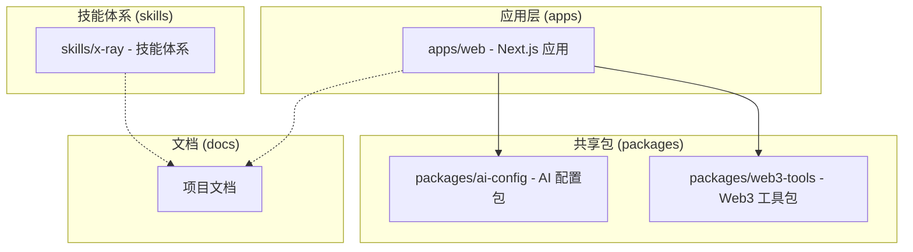
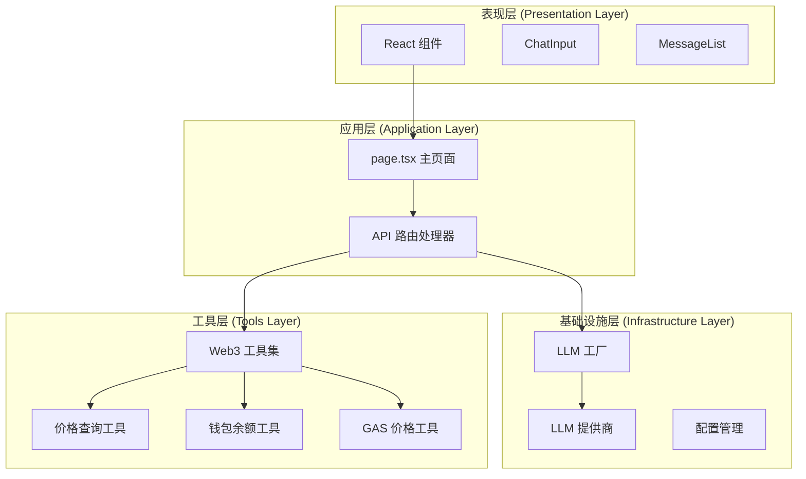
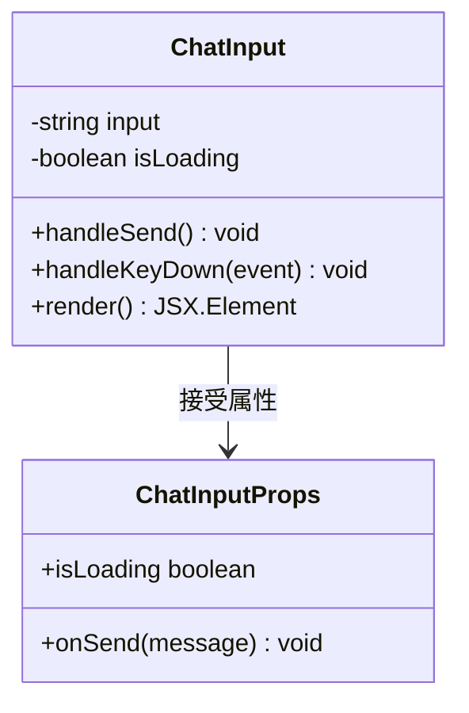
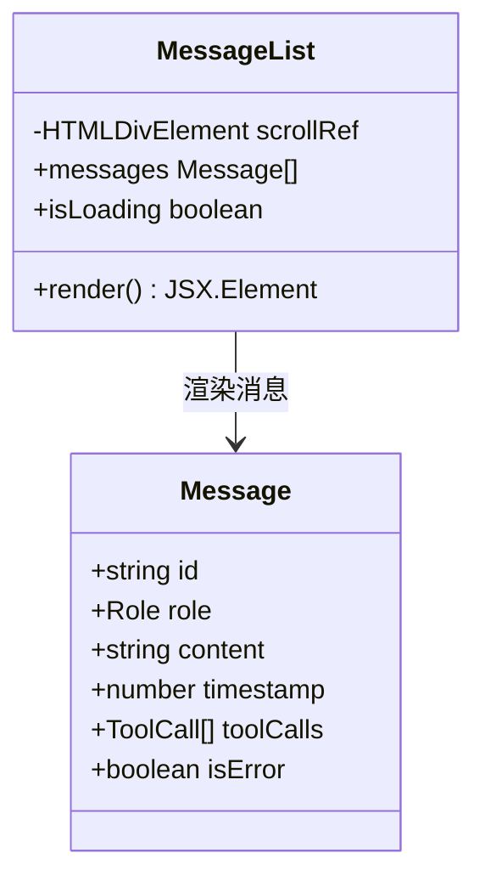
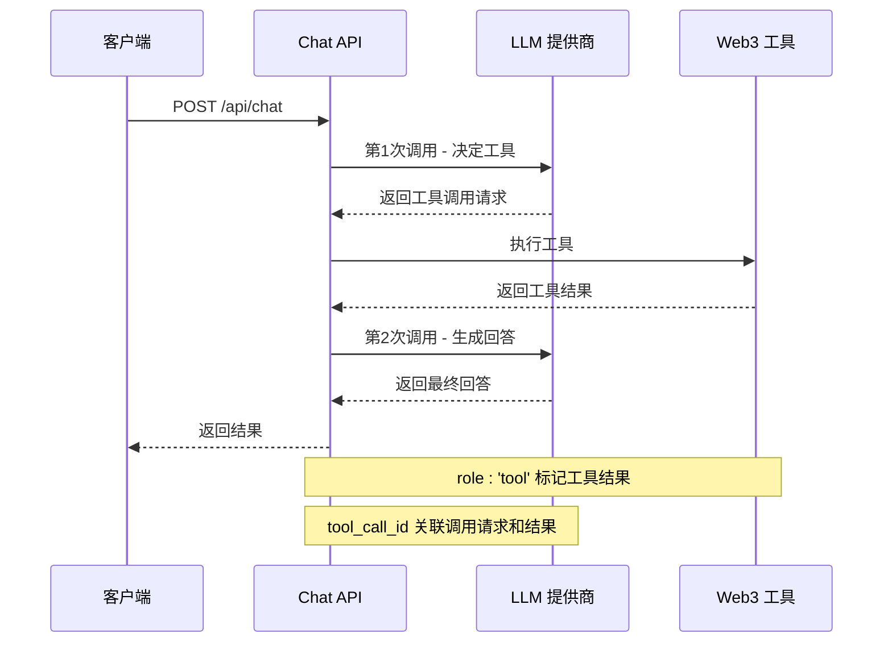
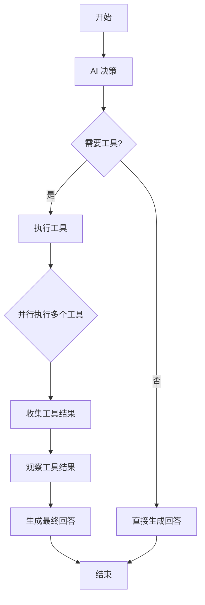
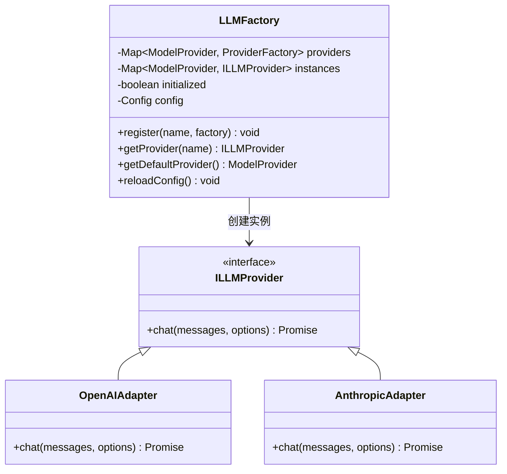
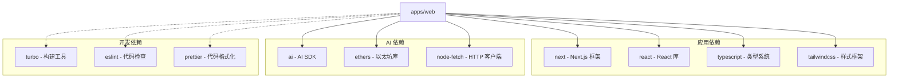
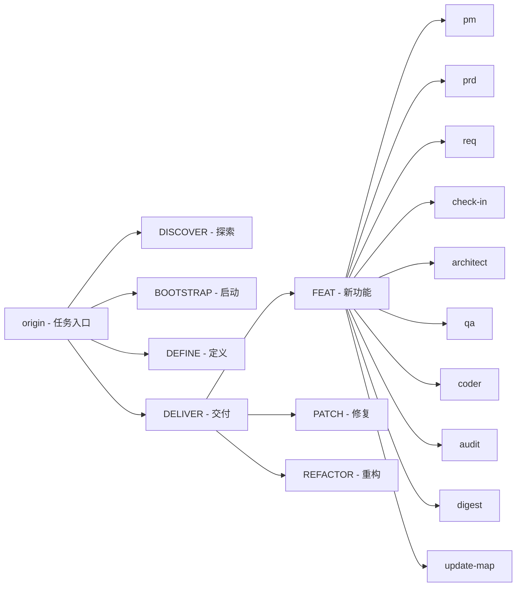

# 学习笔记

<cite>
**本文引用的文件**
- [README.md](file://README.md)
- [学习笔记.md](file://docs/学习笔记.md)
- [apps/web/app/page.tsx](file://apps/web/app/page.tsx)
- [apps/web/app/layout.tsx](file://apps/web/app/layout.tsx)
- [apps/web/app/api/chat/route.ts](file://apps/web/app/api/chat/route.ts)
- [apps/web/components/ChatInput.tsx](file://apps/web/components/ChatInput.tsx)
- [apps/web/components/MessageList.tsx](file://apps/web/components/MessageList.tsx)
- [apps/web/types/chat.ts](file://apps/web/types/chat.ts)
- [skills/x-ray/MAP-V3.md](file://skills/x-ray/MAP-V3.md)
- [packages/ai-config/src/factory.ts](file://packages/ai-config/src/factory.ts)
- [apps/web/package.json](file://apps/web/package.json)
- [package.json](file://package.json)
</cite>

## 目录
1. [简介](#简介)
2. [项目结构](#项目结构)
3. [核心组件](#核心组件)
4. [架构概览](#架构概览)
5. [详细组件分析](#详细组件分析)
6. [依赖分析](#依赖分析)
7. [性能考虑](#性能考虑)
8. [故障排除指南](#故障排除指南)
9. [结论](#结论)
10. [附录](#附录)

## 简介

Web3 AI Agent 是一个面向 Web3 前端开发者的 AI Agent 项目，旨在实现从需求定义到代码交付的完整 SDLC 自动化流程。该项目的核心目标是从 Web3 前端工程师升级为 AI 应用工程师/Agent 工程师，既作为学习载体，也为未来展示作品集奠定基础。

项目验证的核心不是"做一个聊天页面"，而是"做一个能够理解用户意图、调用 Web3 工具、返回可信结果，并具备最小风险边界的 AI Agent"。

## 项目结构

该项目采用 Monorepo 架构，主要包含以下核心部分：

**图表来源**
- [README.md: 26-38:26-38](file://README.md#L26-L38)
- [skills/x-ray/MAP-V3.md: 63-89:63-89](file://skills/x-ray/MAP-V3.md#L63-L89)

**章节来源**
- [README.md: 26-38:26-38](file://README.md#L26-L38)
- [skills/x-ray/MAP-V3.md: 63-89:63-89](file://skills/x-ray/MAP-V3.md#L63-L89)

## 核心组件

### 技术栈
- **前端框架**: Next.js 14 + React + TypeScript
- **样式**: Tailwind CSS
- **AI 能力**: OpenAI API
- **Web3**: ethers.js
- **开发语言**: TypeScript

### 核心能力
- **对话能力**: 基础聊天界面，支持流式输出
- **Tool Calling**: 调用 Web3 工具获取链上数据
- **Agent Loop**: 理解用户意图，自主决策工具调用
- **最小 Memory**: 保持会话上下文连续性

**章节来源**
- [README.md: 18-25:18-25](file://README.md#L18-L25)
- [README.md: 11-17:11-17](file://README.md#L11-L17)

## 架构概览

系统采用分层架构设计，实现了清晰的关注点分离：

**图表来源**
- [apps/web/app/page.tsx: 1-106:1-106](file://apps/web/app/page.tsx#L1-L106)
- [apps/web/app/api/chat/route.ts: 1-203:1-203](file://apps/web/app/api/chat/route.ts#L1-L203)
- [packages/ai-config/src/factory.ts: 16-83:16-83](file://packages/ai-config/src/factory.ts#L16-L83)

## 详细组件分析

### 聊天界面组件

#### ChatInput 组件
ChatInput 是用户输入的主要组件，提供了友好的交互体验：

**图表来源**
- [apps/web/components/ChatInput.tsx: 10-74:10-74](file://apps/web/components/ChatInput.tsx#L10-L74)

#### MessageList 组件
MessageList 负责渲染消息历史并提供自动滚动功能：

**图表来源**
- [apps/web/components/MessageList.tsx: 12-44:12-44](file://apps/web/components/MessageList.tsx#L12-L44)
- [apps/web/types/chat.ts: 1-28:1-28](file://apps/web/types/chat.ts#L1-L28)

**章节来源**
- [apps/web/components/ChatInput.tsx: 1-74:1-74](file://apps/web/components/ChatInput.tsx#L1-L74)
- [apps/web/components/MessageList.tsx: 1-44:1-44](file://apps/web/components/MessageList.tsx#L1-L44)
- [apps/web/types/chat.ts: 1-28:1-28](file://apps/web/types/chat.ts#L1-L28)

### API 路由处理

#### Function Calling 流程
系统实现了标准的 Function Calling 模式，包含两次 API 调用：

**图表来源**
- [apps/web/app/api/chat/route.ts: 94-179:94-179](file://apps/web/app/api/chat/route.ts#L94-L179)

#### Agent Loop 实现
当前实现支持一次循环的 Agent Loop，可以并行执行多个工具：

**图表来源**
- [apps/web/app/api/chat/route.ts: 108-179:108-179](file://apps/web/app/api/chat/route.ts#L108-L179)

**章节来源**
- [apps/web/app/api/chat/route.ts: 1-203:1-203](file://apps/web/app/api/chat/route.ts#L1-L203)

### AI 配置管理

#### LLM 工厂模式
系统采用工厂模式管理不同的 LLM 提供商：

**图表来源**
- [packages/ai-config/src/factory.ts: 16-118:16-118](file://packages/ai-config/src/factory.ts#L16-L118)

**章节来源**
- [packages/ai-config/src/factory.ts: 16-118:16-118](file://packages/ai-config/src/factory.ts#L16-L118)

## 依赖分析

### 项目依赖关系

**图表来源**
- [apps/web/package.json: 12-36:12-36](file://apps/web/package.json#L12-L36)
- [package.json: 6-27:6-27](file://package.json#L6-L27)

### 技能体系依赖

项目采用 Skill 驱动的开发流程，包含完整的技能地图：

**图表来源**
- [skills/x-ray/MAP-V3.md: 247-327:247-327](file://skills/x-ray/MAP-V3.md#L247-L327)

**章节来源**
- [apps/web/package.json: 12-36:12-36](file://apps/web/package.json#L12-L36)
- [skills/x-ray/MAP-V3.md: 247-327:247-327](file://skills/x-ray/MAP-V3.md#L247-L327)

## 性能考虑

### 优化策略
1. **缓存机制**: LLMFactory 使用实例缓存避免重复创建
2. **并行执行**: 工具调用支持并行执行提升响应速度
3. **类型安全**: 完整的 TypeScript 类型定义确保编译时检查
4. **模块化设计**: 独立的工具包便于按需加载和维护

### 性能监控
- 日志记录：详细的 API 调用日志便于性能分析
- 错误处理：完善的异常捕获和错误恢复机制
- 资源管理：及时清理缓存和释放资源

## 故障排除指南

### 常见问题及解决方案

#### API 配置错误
**症状**: 请求失败，返回配置错误信息
**原因**: 环境变量配置不正确
**解决方法**: 检查 `.env.local` 文件中的 API 密钥配置

#### 工具调用失败
**症状**: 工具执行异常，返回错误信息
**原因**: 网络问题或工具实现错误
**解决方法**: 检查网络连接和工具函数实现

#### 性能问题
**症状**: 响应时间过长
**原因**: 工具调用过多或网络延迟
**解决方法**: 优化工具调用策略，添加缓存机制

**章节来源**
- [apps/web/app/api/chat/route.ts: 185-202:185-202](file://apps/web/app/api/chat/route.ts#L185-L202)

## 结论

Web3 AI Agent 项目展现了现代 AI 应用开发的最佳实践，通过清晰的架构设计和完善的技能体系，为开发者提供了一个可扩展的 AI Agent 开发框架。项目的核心优势包括：

1. **完整的技能体系**: 从任务识别到交付验证的全流程管理
2. **模块化架构**: 清晰的分层设计便于维护和扩展
3. **工具化思维**: 将复杂功能分解为独立的工具模块
4. **类型安全**: 完整的 TypeScript 支持确保代码质量
5. **配置驱动**: 灵活的配置管理支持多模型切换

该项目不仅是一个技术实现，更是开发者技能提升的重要工具，为向 AI 应用工程师转型提供了坚实的基础。

## 附录

### 开发规范
项目采用以下开发规范：
- 任何任务从 `origin` 进入
- 交付型任务走 pipeline
- 实施前必须经过 check-in

### 当前阶段
根据项目里程碑 Checklist，当前处于**阶段 1：项目初始化**，已完成核心功能的开发和验证。

**章节来源**
- [README.md: 80-88:80-88](file://README.md#L80-L88)
- [skills/x-ray/MAP-V3.md: 1-16:1-16](file://skills/x-ray/MAP-V3.md#L1-L16)