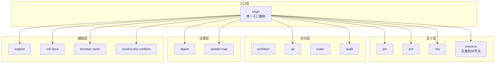
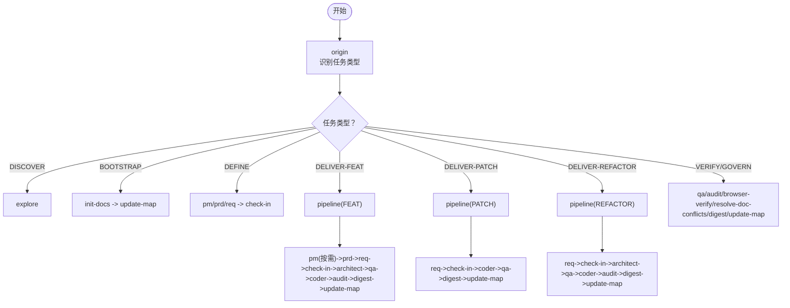
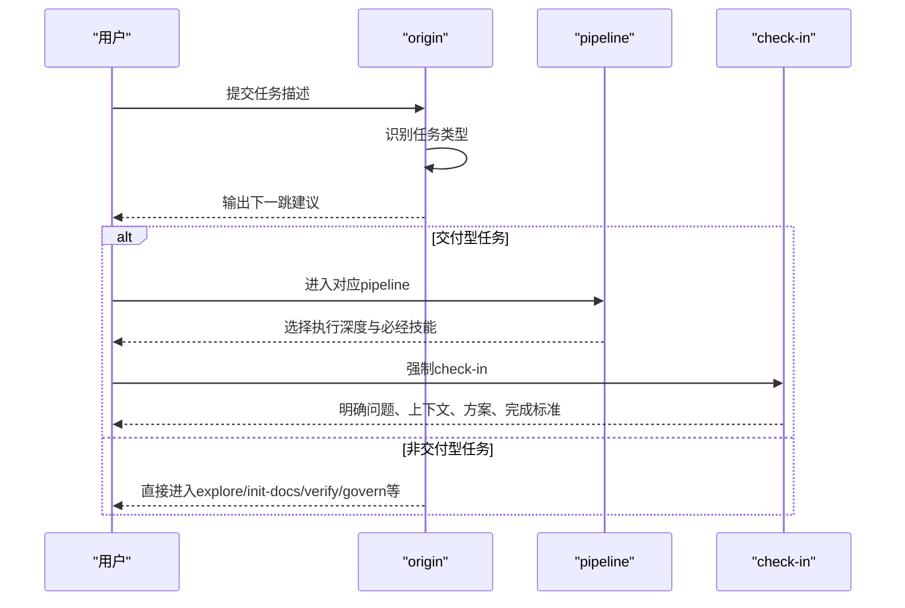
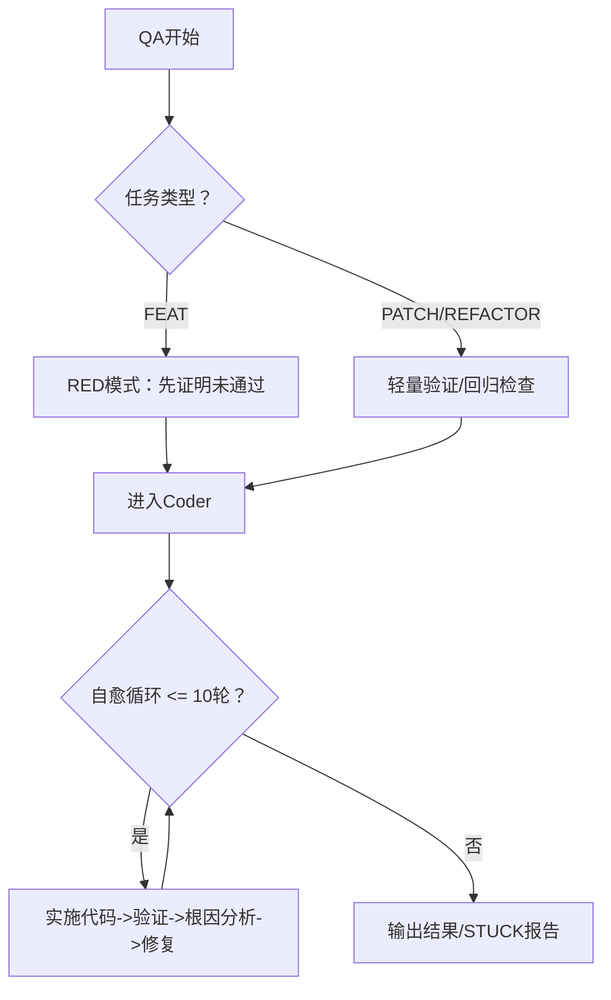
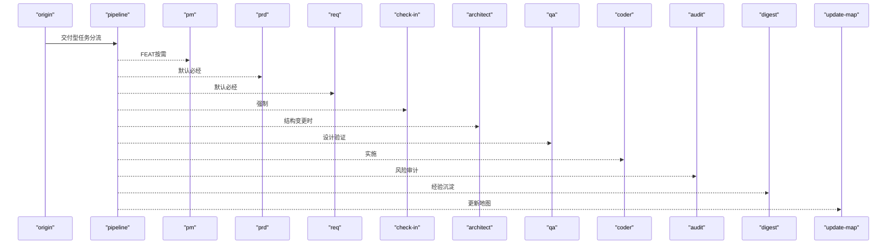
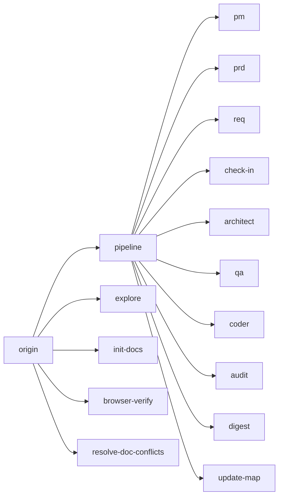

# 整体架构概览

<cite>
**本文档引用的文件**
- [SKILL-SYSTEM-DESIGN-V3.md](file://skills/web3-ai-agent/SKILL-SYSTEM-DESIGN-V3.md)
- [MAP-V3.md](file://skills/web3-ai-agent/MAP-V3.md)
- [COMMANDS.md](file://skills/web3-ai-agent/COMMANDS.md)
- [SKILL.md](file://skills/web3-ai-agent/SKILL.md)
- [origin/ SKILL.md](file://skills/web3-ai-agent/origin/ SKILL.md)
- [check-in/ SKILL.md](file://skills/web3-ai-agent/check-in/ SKILL.md)
- [pipeline/ SKILL.md](file://skills/web3-ai-agent/pipeline/ SKILL.md)
- [architect/ SKILL.md](file://skills/web3-ai-agent/architect/ SKILL.md)
- [qa/ SKILL.md](file://skills/web3-ai-agent/qa/ SKILL.md)
- [coder/ SKILL.md](file://skills/web3-ai-agent/coder/ SKILL.md)
- [audit/ SKILL.md](file://skills/web3-ai-agent/audit/ SKILL.md)
- [digest/ SKILL.md](file://skills/web3-ai-agent/digest/ SKILL.md)
</cite>

## 目录
1. [简介](#简介)
2. [项目结构](#项目结构)
3. [核心组件](#核心组件)
4. [架构总览](#架构总览)
5. [详细组件分析](#详细组件分析)
6. [依赖分析](#依赖分析)
7. [性能考虑](#性能考虑)
8. [故障排查指南](#故障排查指南)
9. [结论](#结论)
10. [附录](#附录)

## 简介
本文件面向AI-Agent技能系统（Web3 AI Agent）的总体架构，聚焦于V3版本的12个核心技能模块，提供高层视图与系统化说明。内容涵盖：
- 任务类型与路由规则
- 技能分层与协作机制
- 主入口路由与学习门禁（check-in）机制
- 质量保证体系（QA红绿灯、Coder自愈、Audit评分）
- 系统上下文图与组件关系图
- 模块化设计与可扩展性

## 项目结构
该项目采用“技能即模块”的分层组织方式，围绕12个核心skill构建可插拔的执行骨架。主入口统一由origin进行任务识别与分流，随后根据任务类型进入相应链路；交付型任务进一步通过pipeline选择执行深度（FEAT/PATCH/REFACTOR），并在必要节点强制check-in，最终由architect/qa/coder/audit/digest/update-map完成闭环。

图表来源
- [MAP-V3.md:1-166](file://skills/web3-ai-agent/MAP-V3.md#L1-L166)
- [SKILL-SYSTEM-DESIGN-V3.md:164-220](file://skills/web3-ai-agent/SKILL-SYSTEM-DESIGN-V3.md#L164-L220)

章节来源
- [MAP-V3.md:1-166](file://skills/web3-ai-agent/MAP-V3.md#L1-L166)
- [SKILL-SYSTEM-DESIGN-V3.md:164-220](file://skills/web3-ai-agent/SKILL-SYSTEM-DESIGN-V3.md#L164-L220)

## 核心组件
本节概述12个核心技能模块的职责与协作边界，遵循“入口层-定义层-交付层-治理层-辅助层”的五层结构。

- 入口层
  - origin：统一入口路由，识别任务类型并决定下一跳，不直接进入实施链路。
  - pipeline：仅服务于交付型任务，按FEAT/PATCH/REFACTOR选择执行深度与必经/可跳过技能。

- 定义层
  - pm/prd/req：将模糊意图转化为清晰可实施对象；check-in作为实施前对齐点，强制适用于实施型任务。

- 交付层
  - architect：结构设计，定义模块边界、数据/消息流与接口契约。
  - qa：质量保证，FEAT优先RED模式，定义验证清单；PATCH/REFACTOR执行轻量验证或回归检查。
  - coder：在边界明确前提下实施代码，最多10轮自愈循环将RED变为GREEN。
  - audit：风险审计与评分，支持轻审/重审，>=80通过，<60直接拒绝。

- 治理层
  - digest：阶段沉淀，记录完成项、问题、经验与建议。
  - update-map：更新文档索引、状态与下一步入口。

- 辅助层
  - explore：只读探索，定位模块与能力。
  - init-docs：初始化文档体系。
  - browser-verify：浏览器层验收。
  - resolve-doc-conflicts：文档冲突治理。

章节来源
- [SKILL-SYSTEM-DESIGN-V3.md:439-601](file://skills/web3-ai-agent/SKILL-SYSTEM-DESIGN-V3.md#L439-L601)
- [origin/ SKILL.md:1-125](file://skills/web3-ai-agent/origin/ SKILL.md#L1-L125)
- [pipeline/ SKILL.md:1-89](file://skills/web3-ai-agent/pipeline/ SKILL.md#L1-L89)
- [check-in/ SKILL.md:1-56](file://skills/web3-ai-agent/check-in/ SKILL.md#L1-L56)
- [architect/ SKILL.md:1-53](file://skills/web3-ai-agent/architect/ SKILL.md#L1-L53)
- [qa/ SKILL.md:1-73](file://skills/web3-ai-agent/qa/ SKILL.md#L1-L73)
- [coder/ SKILL.md:1-72](file://skills/web3-ai-agent/coder/ SKILL.md#L1-L72)
- [audit/ SKILL.md:1-88](file://skills/web3-ai-agent/audit/ SKILL.md#L1-L88)
- [digest/ SKILL.md:1-50](file://skills/web3-ai-agent/digest/ SKILL.md#L1-L50)

## 架构总览
V3的核心思想是“分流的操作系统”，而非单一长链路。系统通过origin进行一级任务识别，再由pipeline进行二级执行分流，结合check-in门禁与质量保证规则，形成可扩展的模块化执行骨架。

图表来源
- [MAP-V3.md:86-166](file://skills/web3-ai-agent/MAP-V3.md#L86-L166)
- [SKILL-SYSTEM-DESIGN-V3.md:222-286](file://skills/web3-ai-agent/SKILL-SYSTEM-DESIGN-V3.md#L222-L286)

章节来源
- [MAP-V3.md:86-166](file://skills/web3-ai-agent/MAP-V3.md#L86-L166)
- [SKILL-SYSTEM-DESIGN-V3.md:222-286](file://skills/web3-ai-agent/SKILL-SYSTEM-DESIGN-V3.md#L222-L286)

## 详细组件分析

### 入口路由与学习门禁（check-in）
- origin负责将任意外部请求进行任务分类与下一跳决策，严格禁止跳过任务判断与直接进入实施链路。
- check-in作为“实施前对齐点”，强制适用于DELIVER-FEAT/PATCH/REFACTOR以及准备进入实施的DEFINE任务；对DISCOVER/BOOTSTRAP/纯VERIFY/GOVERN不强制。

图表来源
- [origin/ SKILL.md:41-125](file://skills/web3-ai-agent/origin/ SKILL.md#L41-L125)
- [check-in/ SKILL.md:12-56](file://skills/web3-ai-agent/check-in/ SKILL.md#L12-L56)
- [pipeline/ SKILL.md:29-89](file://skills/web3-ai-agent/pipeline/ SKILL.md#L29-L89)

章节来源
- [origin/ SKILL.md:41-125](file://skills/web3-ai-agent/origin/ SKILL.md#L41-L125)
- [check-in/ SKILL.md:12-56](file://skills/web3-ai-agent/check-in/ SKILL.md#L12-L56)
- [pipeline/ SKILL.md:29-89](file://skills/web3-ai-agent/pipeline/ SKILL.md#L29-L89)

### 质量保证体系（QA、Coder、Audit）
- QA：FEAT优先RED模式，定义测试边界；PATCH/REFACTOR执行轻量验证或回归检查。
- Coder：最多10轮自愈循环，将RED全部变为GREEN；超限输出STUCK报告并请求人工介入。
- Audit：支持轻审/重审，总分100分，>=80通过，60-79软拒绝回退修正，<60直接拒绝；严重安全问题可一票否决。

图表来源
- [qa/ SKILL.md:12-73](file://skills/web3-ai-agent/qa/ SKILL.md#L12-L73)
- [coder/ SKILL.md:18-72](file://skills/web3-ai-agent/coder/ SKILL.md#L18-L72)
- [audit/ SKILL.md:12-88](file://skills/web3-ai-agent/audit/ SKILL.md#L12-L88)

章节来源
- [qa/ SKILL.md:12-73](file://skills/web3-ai-agent/qa/ SKILL.md#L12-L73)
- [coder/ SKILL.md:18-72](file://skills/web3-ai-agent/coder/ SKILL.md#L18-L72)
- [audit/ SKILL.md:12-88](file://skills/web3-ai-agent/audit/ SKILL.md#L12-L88)

### 三类交付Pipeline（FEAT/PATCH/REFACTOR）
- FEAT：默认先pm（按需）、prd、req，再check-in，随后architect/qa/coder/audit/digest/update-map。
- PATCH：默认req、check-in、coder、qa、digest、update-map；可按需插入architect/audit/browser-verify/prd。
- REFACTOR：默认req、check-in、architect、qa、coder、audit、digest、update-map；可按需插入prd/browser-verify。

图表来源
- [SKILL-SYSTEM-DESIGN-V3.md:288-393](file://skills/web3-ai-agent/SKILL-SYSTEM-DESIGN-V3.md#L288-L393)
- [pipeline/ SKILL.md:29-89](file://skills/web3-ai-agent/pipeline/ SKILL.md#L29-L89)

章节来源
- [SKILL-SYSTEM-DESIGN-V3.md:288-393](file://skills/web3-ai-agent/SKILL-SYSTEM-DESIGN-V3.md#L288-L393)
- [pipeline/ SKILL.md:29-89](file://skills/web3-ai-agent/pipeline/ SKILL.md#L29-L89)

### 治理与辅助能力
- 治理层：digest负责沉淀经验，update-map负责更新索引与状态。
- 辅助层：explore提供只读导航，init-docs负责文档体系初始化，browser-verify用于浏览器验收，resolve-doc-conflicts处理文档冲突。

章节来源
- [digest/ SKILL.md:1-50](file://skills/web3-ai-agent/digest/ SKILL.md#L1-L50)
- [SKILL-SYSTEM-DESIGN-V3.md:201-220](file://skills/web3-ai-agent/SKILL-SYSTEM-DESIGN-V3.md#L201-L220)

## 依赖分析
- 耦合关系
  - origin与所有技能存在“路由依赖”，但不直接耦合具体实现。
  - pipeline对DELIVER-FEAT/PATCH/REFACTOR三类任务进行分流，内部依赖pm/prd/req/check-in/architect/qa/coder/audit/digest/update-map。
  - 质量保证链路（qa->coder->audit）形成强依赖闭环，确保交付质量。
- 可扩展性
  - 新增技能只需遵循分层与路由规则，即可无缝接入主骨架。
  - 可按需插入architect/audit/browser-verify/prd等技能，不影响主链路稳定性。

图表来源
- [SKILL-SYSTEM-DESIGN-V3.md:164-220](file://skills/web3-ai-agent/SKILL-SYSTEM-DESIGN-V3.md#L164-L220)
- [MAP-V3.md:86-166](file://skills/web3-ai-agent/MAP-V3.md#L86-L166)

章节来源
- [SKILL-SYSTEM-DESIGN-V3.md:164-220](file://skills/web3-ai-agent/SKILL-SYSTEM-DESIGN-V3.md#L164-L220)
- [MAP-V3.md:86-166](file://skills/web3-ai-agent/MAP-V3.md#L86-L166)

## 性能考虑
- 路由分流：通过origin与pipeline两级分流，避免所有任务走长链路，提升整体吞吐。
- 质量前置：QA RED模式在实现前定义测试边界，降低后期返工成本。
- 自愈循环上限：Coder最多10轮自愈，防止无效耗时；超限立即终止并输出STUCK报告，减少资源浪费。
- 轻审/重审：根据任务风险级别选择审计强度，平衡效率与安全。

## 故障排查指南
- 未通过origin路由
  - 症状：无法进入任何技能或链路。
  - 排查：确认是否直接跳过origin；检查任务描述是否足够明确。
  - 参考：[SKILL.md:21-91](file://skills/web3-ai-agent/SKILL.md#L21-L91)
- 缺失check-in
  - 症状：无法进入architect/qa/coder。
  - 排查：确认DELIVER/DEFINE任务是否已通过check-in；检查check-in输出是否包含完成标准。
  - 参考：[check-in/ SKILL.md:51-56](file://skills/web3-ai-agent/check-in/ SKILL.md#L51-L56)
- QA RED未通过
  - 症状：coder无法推进或频繁失败。
  - 排查：确认RED测试是否合理；检查需求边界是否与实现一致；必要时回退prd/req。
  - 参考：[qa/ SKILL.md:51-73](file://skills/web3-ai-agent/qa/ SKILL.md#L51-L73)
- Coder超限STUCK
  - 症状：连续10轮未能通过验证。
  - 排查：查看STUCK报告中的阻塞点与建议；评估是否需要人工介入或调整方案。
  - 参考：[coder/ SKILL.md:39-72](file://skills/web3-ai-agent/coder/ SKILL.md#L39-L72)
- Audit直接拒绝
  - 症状：<60分或存在一票否决项。
  - 排查：关注安全与风险边界、关键不变量、调试残留等问题；必要时回退coder或终止。
  - 参考：[audit/ SKILL.md:70-88](file://skills/web3-ai-agent/audit/ SKILL.md#L70-L88)

章节来源
- [SKILL.md:21-91](file://skills/web3-ai-agent/SKILL.md#L21-L91)
- [check-in/ SKILL.md:51-56](file://skills/web3-ai-agent/check-in/ SKILL.md#L51-L56)
- [qa/ SKILL.md:51-73](file://skills/web3-ai-agent/qa/ SKILL.md#L51-L73)
- [coder/ SKILL.md:39-72](file://skills/web3-ai-agent/coder/ SKILL.md#L39-L72)
- [audit/ SKILL.md:70-88](file://skills/web3-ai-agent/audit/ SKILL.md#L70-L88)

## 结论
V3版本通过“入口路由+实施门禁+质量保证+治理沉淀”的五层架构，实现了可扩展、可分流、可演进的AI-Agent技能系统。其核心优势在于：
- 明确的任务类型与路由规则，避免流程冗余
- 强制check-in与质量前置，降低交付风险
- 可插拔的技能组合，支持不同任务级别的执行深度
- 清晰的治理闭环，持续沉淀经验并更新知识地图

## 附录
- 斜杠命令约定（便于统一输入与降低歧义）
  - 推荐命令：/origin、/pipeline feat/patch/refactor、/pm、/prd、/req、/check-in、/architect、/qa、/coder、/audit、/digest、/update-map、/explore、/init-docs、/browser-verify、/resolve-doc-conflicts
  - 参考：[COMMANDS.md:20-50](file://skills/web3-ai-agent/COMMANDS.md#L20-L50)

章节来源
- [COMMANDS.md:20-50](file://skills/web3-ai-agent/COMMANDS.md#L20-L50)