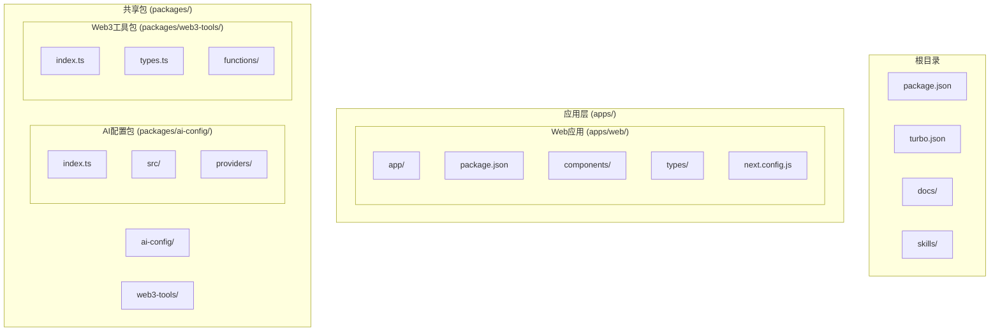
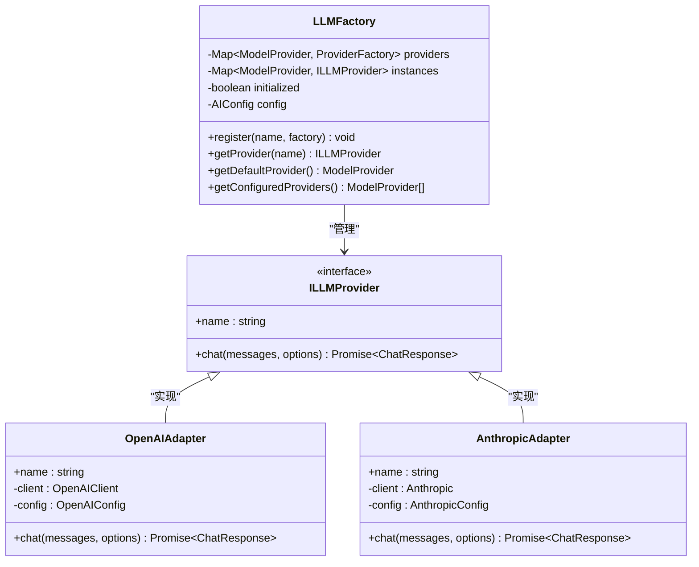
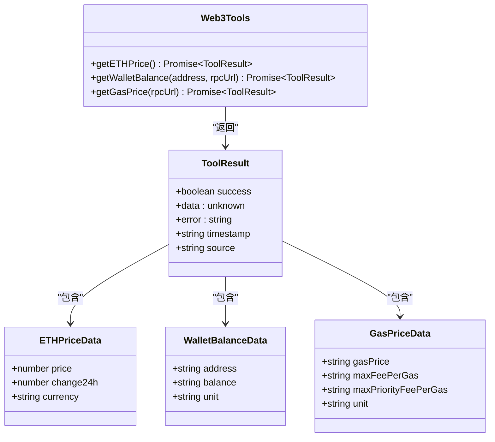
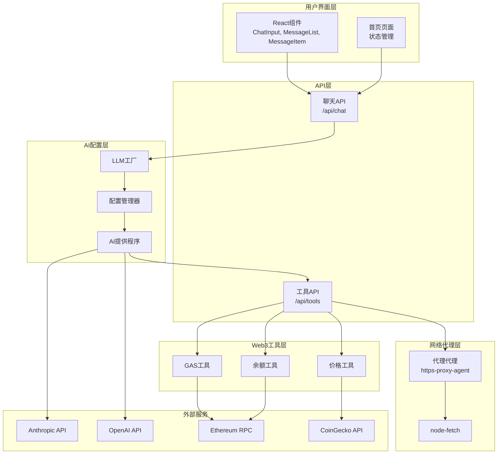
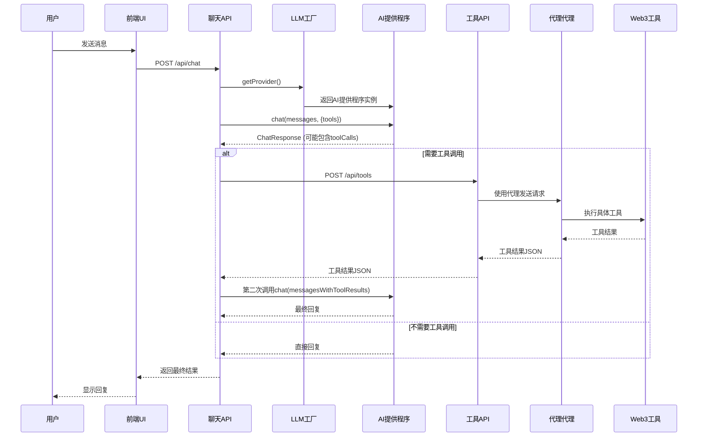
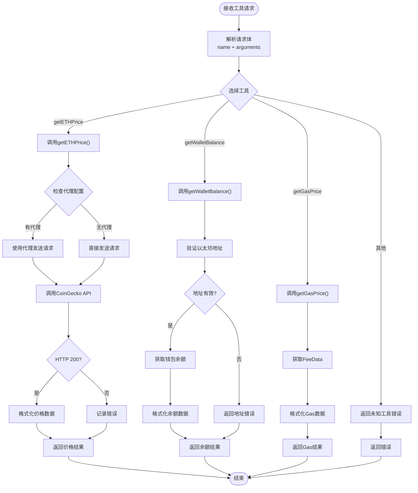
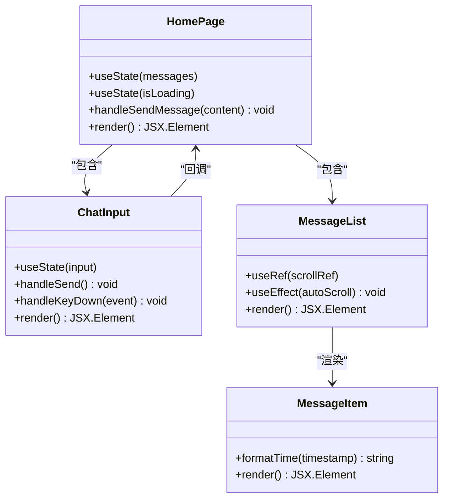
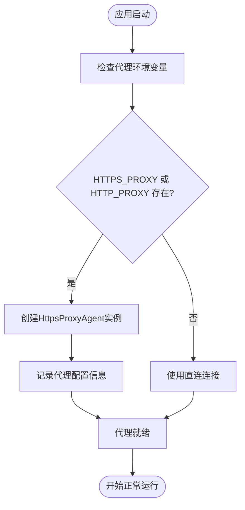
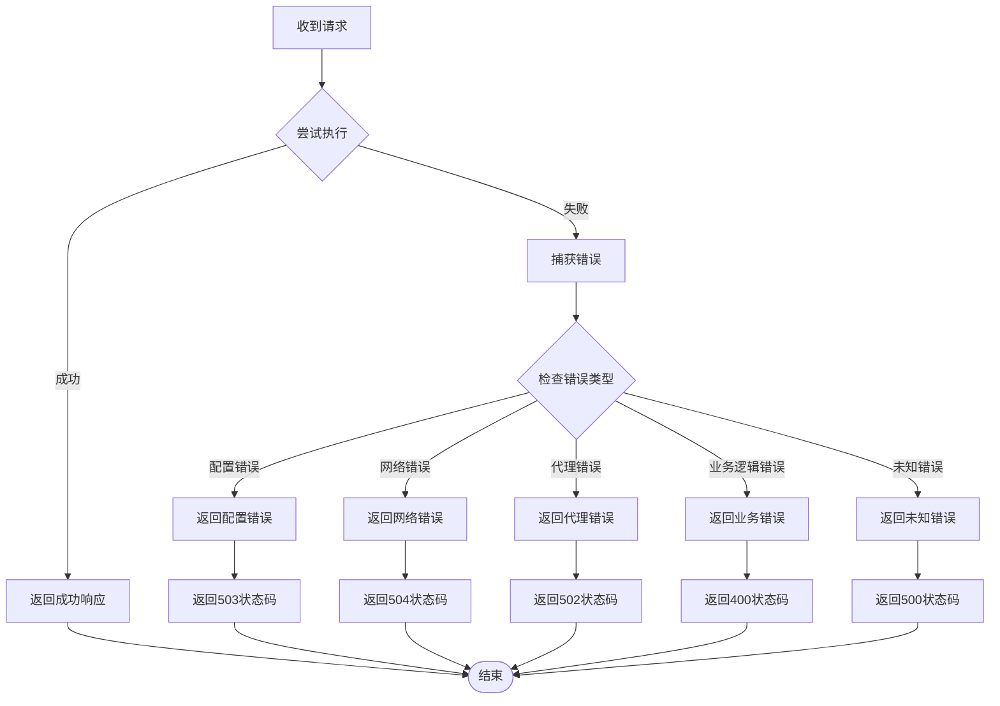

# AI提供程序集成

<cite>
**本文档引用的文件**
- [README.md](file://README.md)
- [package.json](file://package.json)
- [turbo.json](file://turbo.json)
- [apps/web/package.json](file://apps/web/package.json)
- [packages/ai-config/package.json](file://packages/ai-config/package.json)
- [packages/web3-tools/package.json](file://packages/web3-tools/package.json)
- [apps/web/app/api/chat/route.ts](file://apps/web/app/api/chat/route.ts)
- [apps/web/app/api/tools/route.ts](file://apps/web/app/api/tools/route.ts)
- [apps/web/app/page.tsx](file://apps/web/app/page.tsx)
- [apps/web/types/chat.ts](file://apps/web/types/chat.ts)
- [apps/web/components/ChatInput.tsx](file://apps/web/components/ChatInput.tsx)
- [apps/web/components/MessageList.tsx](file://apps/web/components/MessageList.tsx)
- [apps/web/components/MessageItem.tsx](file://apps/web/components/MessageItem.tsx)
- [packages/ai-config/src/index.ts](file://packages/ai-config/src/index.ts)
- [packages/ai-config/src/factory.ts](file://packages/ai-config/src/factory.ts)
- [packages/ai-config/src/config.ts](file://packages/ai-config/src/config.ts)
- [packages/ai-config/src/types.ts](file://packages/ai-config/src/types.ts)
- [packages/ai-config/src/providers/anthropic.ts](file://packages/ai-config/src/providers/anthropic.ts)
- [packages/web3-tools/src/index.ts](file://packages/web3-tools/src/index.ts)
- [packages/web3-tools/src/types.ts](file://packages/web3-tools/src/types.ts)
- [packages/web3-tools/src/gas.ts](file://packages/web3-tools/src/gas.ts)
- [packages/web3-tools/src/balance.ts](file://packages/web3-tools/src/balance.ts)
</cite>

## 更新摘要
**变更内容**
- 新增代理支持功能，增强VPN和网络限制环境下的AI模型访问能力
- 在工具API中集成https-proxy-agent和node-fetch依赖
- 改进网络请求的代理配置和错误处理机制
- 增强工具调用的网络访问能力和稳定性

## 目录
1. [项目简介](#项目简介)
2. [项目结构](#项目结构)
3. [核心组件](#核心组件)
4. [架构概览](#架构概览)
5. [详细组件分析](#详细组件分析)
6. [代理支持功能](#代理支持功能)
7. [依赖关系分析](#依赖关系分析)
8. [性能考虑](#性能考虑)
9. [故障排除指南](#故障排除指南)
10. [结论](#结论)

## 项目简介

Web3 AI Agent 是一个面向 Web3 前端开发者的 AI Agent 项目，实现了从需求定义到代码交付的完整 SDLC 自动化流程。该项目的核心目标是帮助开发者从传统的 Web3 前端工程师升级为 AI 应用工程师/Agent 工程师。

### 核心能力
- **对话能力**：基础聊天界面，支持流式输出
- **Tool Calling**：调用 Web3 工具获取链上数据
- **Agent Loop**：理解用户意图，自主决策工具调用
- **最小 Memory**：保持会话上下文连续性
- **代理支持**：支持VPN和网络限制环境下的AI模型访问

### 技术栈
- **前端框架**: Next.js 14 + React + TypeScript
- **样式**: Tailwind CSS
- **AI 能力**: OpenAI API, Anthropic Claude
- **Web3**: ethers.js
- **网络代理**: https-proxy-agent, node-fetch
- **开发语言**: TypeScript

## 项目结构

该项目采用 Monorepo 架构，主要包含以下模块：



**图表来源**
- [package.json:1-28](file://package.json#L1-L28)
- [turbo.json:1-21](file://turbo.json#L1-L21)

**章节来源**
- [README.md:26-38](file://README.md#L26-L38)
- [package.json:23-26](file://package.json#L23-L26)

## 核心组件

### AI配置管理器

AI配置管理器是整个系统的核心，负责管理不同的AI提供程序（OpenAI和Anthropic），并提供统一的接口。



**图表来源**
- [packages/ai-config/src/factory.ts:16-97](file://packages/ai-config/src/factory.ts#L16-L97)
- [packages/ai-config/src/providers/anthropic.ts:13-48](file://packages/ai-config/src/providers/anthropic.ts#L13-L48)

### Web3工具集

Web3工具集提供了与以太坊区块链交互的能力，包括价格查询、钱包余额查询和Gas价格查询。



**图表来源**
- [packages/web3-tools/src/index.ts:1-6](file://packages/web3-tools/src/index.ts#L1-L6)
- [packages/web3-tools/src/types.ts:3-33](file://packages/web3-tools/src/types.ts#L3-L33)

**章节来源**
- [packages/ai-config/src/index.ts:1-19](file://packages/ai-config/src/index.ts#L1-L19)
- [packages/web3-tools/src/index.ts:1-6](file://packages/web3-tools/src/index.ts#L1-L6)

## 架构概览

系统采用分层架构设计，从用户界面到AI提供程序再到Web3工具的完整链路：



**图表来源**
- [apps/web/app/api/chat/route.ts:76-179](file://apps/web/app/api/chat/route.ts#L76-L179)
- [apps/web/app/api/tools/route.ts:99-134](file://apps/web/app/api/tools/route.ts#L99-L134)
- [packages/ai-config/src/factory.ts:59-83](file://packages/ai-config/src/factory.ts#L59-L83)

## 详细组件分析

### 聊天API组件

聊天API是整个系统的入口点，负责处理用户的聊天请求并协调AI提供程序和Web3工具。



**图表来源**
- [apps/web/app/api/chat/route.ts:76-179](file://apps/web/app/api/chat/route.ts#L76-L179)

#### 工具定义和系统提示

系统通过预定义的工具和系统提示来指导AI的行为：

| 工具名称 | 功能描述 | 参数要求 |
|---------|----------|----------|
| getETHPrice | 获取 ETH 当前价格（美元） | 无参数 |
| getWalletBalance | 查询以太坊钱包地址的 ETH 余额 | address: string (必需) |
| getGasPrice | 获取当前以太坊 Gas 价格 | 无参数 |

系统提示确保AI遵循特定的行为准则和安全边界。

**章节来源**
- [apps/web/app/api/chat/route.ts:6-49](file://apps/web/app/api/chat/route.ts#L6-L49)
- [apps/web/app/api/chat/route.ts:51-74](file://apps/web/app/api/chat/route.ts#L51-L74)

### 工具API组件

工具API负责执行具体的Web3操作，包括价格查询、余额查询和Gas价格查询。现已集成代理支持功能。



**图表来源**
- [apps/web/app/api/tools/route.ts:99-134](file://apps/web/app/api/tools/route.ts#L99-L134)
- [apps/web/app/api/tools/route.ts:106-121](file://apps/web/app/api/tools/route.ts#L106-L121)

#### 错误处理机制

工具API实现了完善的错误处理机制：

1. **网络请求错误**：捕获API调用失败并返回结构化错误
2. **参数验证错误**：验证输入参数的有效性
3. **区块链交互错误**：处理RPC节点连接和查询失败
4. **格式化错误**：确保返回数据的结构一致性
5. **代理配置错误**：处理代理连接和认证问题

**章节来源**
- [apps/web/app/api/tools/route.ts:100-133](file://apps/web/app/api/tools/route.ts#L100-L133)

### 前端组件系统

前端采用React组件化架构，提供用户友好的交互体验。



**图表来源**
- [apps/web/app/page.tsx:8-71](file://apps/web/app/page.tsx#L8-L71)
- [apps/web/components/ChatInput.tsx:10-73](file://apps/web/components/ChatInput.tsx#L10-L73)
- [apps/web/components/MessageList.tsx:12-43](file://apps/web/components/MessageList.tsx#L12-L43)

#### 状态管理

前端使用React的useState和useEffect hooks进行状态管理：

1. **消息状态**：维护完整的对话历史
2. **加载状态**：控制用户交互的可用性
3. **自动滚动**：确保最新消息始终可见

**章节来源**
- [apps/web/app/page.tsx:19-71](file://apps/web/app/page.tsx#L19-L71)
- [apps/web/components/MessageList.tsx:15-20](file://apps/web/components/MessageList.tsx#L15-L20)

## 代理支持功能

### 代理配置机制

系统现在支持通过环境变量配置代理，以适应不同网络环境的需求：



**图表来源**
- [apps/web/app/api/tools/route.ts:6-12](file://apps/web/app/api/tools/route.ts#L6-L12)

### 代理使用场景

代理功能主要用于以下场景：

1. **VPN环境**：通过代理服务器访问被限制的外部API
2. **企业网络**：绕过防火墙和网络过滤
3. **地理位置限制**：访问特定地区的数据源
4. **网络稳定性**：通过代理提高连接的稳定性

### 代理配置选项

| 环境变量 | 类型 | 描述 | 示例值 |
|---------|------|------|--------|
| HTTPS_PROXY | string | HTTPS代理服务器地址 | `http://proxy.example.com:8080` |
| HTTP_PROXY | string | HTTP代理服务器地址 | `http://proxy.example.com:8080` |

### 代理兼容性

系统支持多种代理协议和认证方式：

- **HTTP代理**：支持Basic认证
- **HTTPS代理**：支持TLS隧道
- **SOCKS代理**：支持SOCKS4/SOCKS5
- **PAC文件**：支持自动代理配置

**章节来源**
- [apps/web/app/api/tools/route.ts:3-8](file://apps/web/app/api/tools/route.ts#L3-L8)

## 依赖关系分析

### 包依赖关系

```mermaid
graph TB
subgraph "应用依赖"
WebApp[apps/web]
NextJS[Next.js 14]
React[React ^18.2.0]
AI[ai ^3.0.0]
Ethers[ethers ^6.11.0]
ProxyAgent[https-proxy-agent ^9.0.0]
NodeFetch[node-fetch ^3]
ProxyAgentLib[proxy-agent ^8.0.1]
end
subgraph "共享包依赖"
AIConfig[@web3-ai-agent/ai-config]
Web3Tools[@web3-ai-agent/web3-tools]
end
subgraph "AI配置包依赖"
OpenAI[openai ^4.28.0]
Anthropic[@anthropic-ai/sdk ^0.24.0]
end
subgraph "Web3工具包依赖"
EthersDep[ethers ^6.11.0]
end
WebApp --> AIConfig
WebApp --> Web3Tools
WebApp --> NextJS
WebApp --> React
WebApp --> AI
WebApp --> Ethers
WebApp --> ProxyAgent
WebApp --> NodeFetch
WebApp --> ProxyAgentLib
AIConfig --> OpenAI
AIConfig --> Anthropic
Web3Tools --> EthersDep
```

**图表来源**
- [apps/web/package.json:12-20](file://apps/web/package.json#L12-L20)
- [packages/ai-config/package.json:13-16](file://packages/ai-config/package.json#L13-L16)
- [packages/web3-tools/package.json:13-15](file://packages/web3-tools/package.json#L13-L15)

### 开发工具链

项目使用现代化的开发工具链确保代码质量和开发效率：

| 工具 | 版本 | 用途 |
|------|------|------|
| pnpm | ^8.15.0 | 包管理器 |
| Turbo | ^2.0.0 | Monorepo构建工具 |
| TypeScript | ^5 | 类型系统 |
| ESLint | ^8 | 代码质量检查 |
| Prettier | ^3.2.5 | 代码格式化 |
| Tailwind CSS | ^3.4.1 | 样式框架 |

**章节来源**
- [package.json:13-18](file://package.json#L13-L18)
- [apps/web/package.json:5-11](file://apps/web/package.json#L5-L11)

## 性能考虑

### 缓存策略

系统实现了多层缓存策略来优化性能：

1. **API缓存**：工具API使用Next.js的revalidate机制缓存外部API响应
2. **实例缓存**：LLM工厂缓存AI提供程序实例，避免重复创建
3. **RPC节点缓存**：Web3工具使用公共RPC节点减少连接开销
4. **代理连接池**：代理客户端支持连接复用

### 异步处理

采用异步编程模式确保用户体验：

1. **流式响应**：支持AI模型的流式输出
2. **并发工具调用**：多个工具调用可以并行执行
3. **代理连接复用**：通过连接池提高代理请求效率
4. **错误隔离**：单个工具调用失败不影响整体流程

### 资源管理

1. **内存管理**：及时清理不再使用的消息历史
2. **网络资源**：合理设置超时和重试机制
3. **计算资源**：限制同时进行的工具调用数量
4. **代理资源**：管理代理连接的生命周期

## 故障排除指南

### 常见配置问题

| 问题 | 原因 | 解决方案 |
|------|------|----------|
| API Key未配置 | 环境变量缺失 | 检查OPENAI_API_KEY或ANTHROPIC_API_KEY |
| RPC节点连接失败 | 网络问题或节点不可用 | 更换RPC节点URL或检查网络连接 |
| 代理连接失败 | 代理服务器不可用或认证失败 | 检查代理URL和凭据 |
| 工具调用超时 | 外部API响应慢 | 增加超时时间或使用备用API |
| 地址格式错误 | 以太坊地址无效 | 验证地址格式是否正确 |

### 错误处理流程



**图表来源**
- [apps/web/app/api/chat/route.ts:162-178](file://apps/web/app/api/chat/route.ts#L162-L178)

### 调试技巧

1. **日志记录**：在关键位置添加详细的日志信息
2. **状态监控**：监控API响应时间和成功率
3. **错误追踪**：使用错误追踪工具定位问题
4. **性能分析**：定期分析系统性能瓶颈
5. **代理调试**：启用代理库的debug模式进行问题排查

**章节来源**
- [apps/web/app/api/chat/route.ts:162-178](file://apps/web/app/api/chat/route.ts#L162-L178)

## 结论

Web3 AI Agent 项目展示了现代AI应用开发的最佳实践，通过模块化的架构设计和完善的错误处理机制，为Web3开发者提供了一个强大的AI工具平台。

### 主要优势

1. **模块化设计**：清晰的分层架构便于维护和扩展
2. **多提供程序支持**：灵活的AI提供程序切换机制
3. **完善的工具集**：覆盖Web3开发的核心需求
4. **健壮的错误处理**：确保系统的稳定性和可靠性
5. **现代化技术栈**：采用最新的开发工具和最佳实践
6. **代理支持**：增强VPN和网络限制环境下的AI模型访问能力

### 未来发展

项目目前处于MVP阶段，未来可以考虑的功能扩展：

1. **更多AI提供程序**：支持更多的AI模型和服务
2. **增强的工具集**：添加更多Web3相关的工具
3. **智能路由**：根据用户需求自动选择最佳工具组合
4. **性能优化**：进一步提升系统的响应速度和吞吐量
5. **安全增强**：加强系统的安全防护和权限控制
6. **代理优化**：支持更多代理协议和认证方式
7. **网络适配**：自动检测和适配不同的网络环境

通过持续的迭代和优化，Web3 AI Agent 有望成为Web3开发领域的重要工具，帮助开发者更高效地构建去中心化应用。