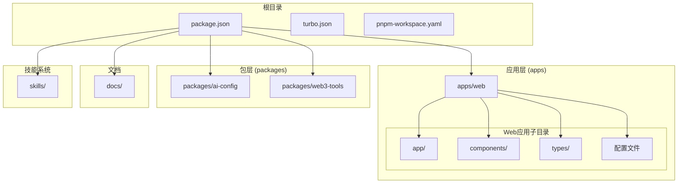
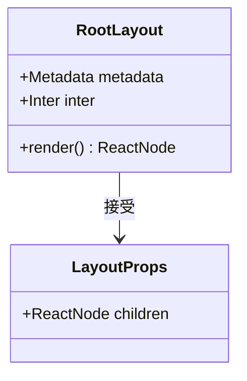
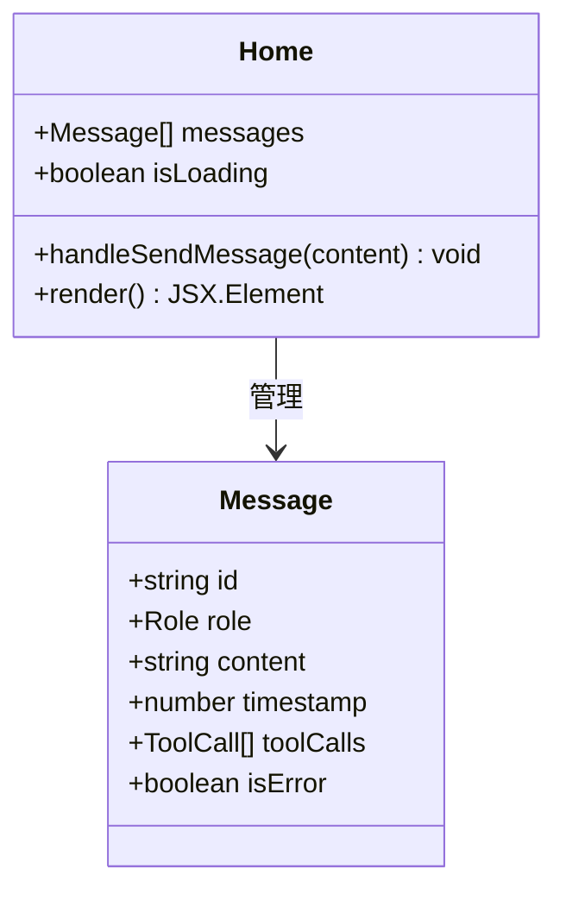
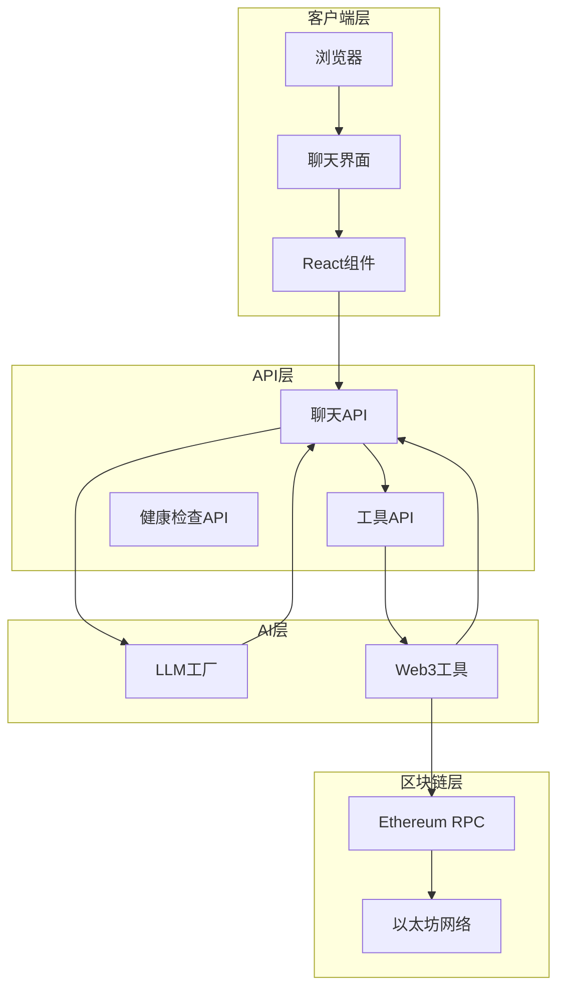
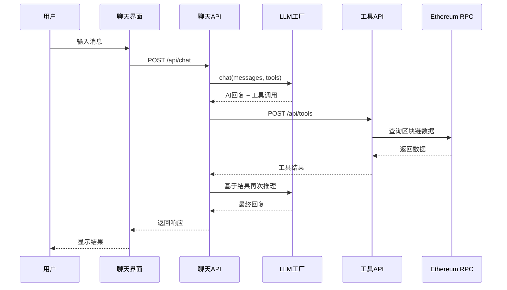
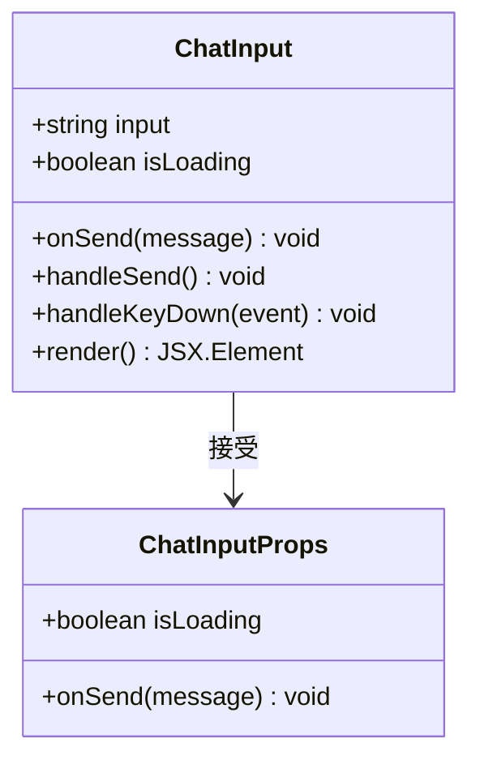
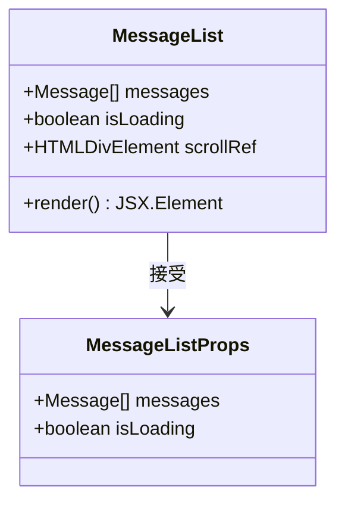
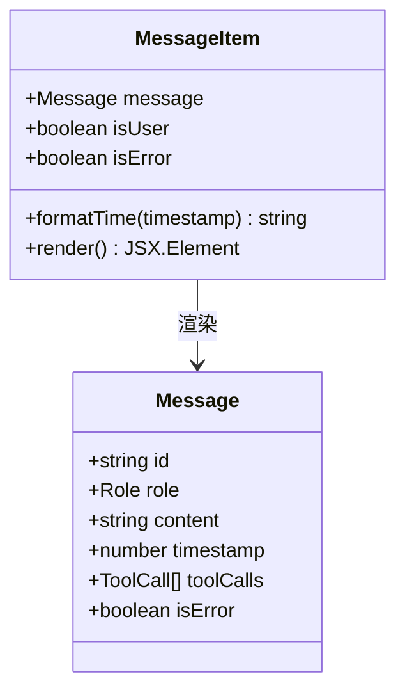
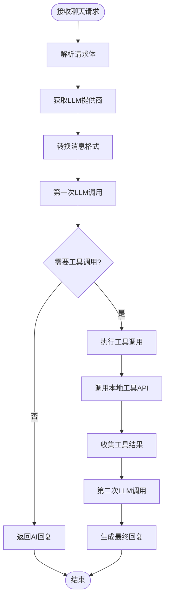
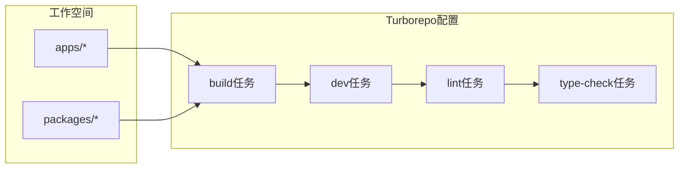

# Web应用程序

<cite>
**本文档引用的文件**
- [apps/web/app/layout.tsx](file://apps/web/app/layout.tsx)
- [apps/web/app/page.tsx](file://apps/web/app/page.tsx)
- [apps/web/app/api/chat/route.ts](file://apps/web/app/api/chat/route.ts)
- [apps/web/app/api/tools/route.ts](file://apps/web/app/api/tools/route.ts)
- [apps/web/types/chat.ts](file://apps/web/types/chat.ts)
- [apps/web/components/ChatInput.tsx](file://apps/web/components/ChatInput.tsx)
- [apps/web/components/MessageList.tsx](file://apps/web/components/MessageList.tsx)
- [apps/web/components/MessageItem.tsx](file://apps/web/components/MessageItem.tsx)
- [apps/web/package.json](file://apps/web/package.json)
- [apps/web/next.config.js](file://apps/web/next.config.js)
- [apps/web/tailwind.config.ts](file://apps/web/tailwind.config.ts)
- [apps/web/postcss.config.js](file://apps/web/postcss.config.js)
- [package.json](file://package.json)
- [turbo.json](file://turbo.json)
- [pnpm-workspace.yaml](file://pnpm-workspace.yaml)
</cite>

## 目录
1. [简介](#简介)
2. [项目结构](#项目结构)
3. [核心组件](#核心组件)
4. [架构概览](#架构概览)
5. [详细组件分析](#详细组件分析)
6. [依赖关系分析](#依赖关系分析)
7. [性能考虑](#性能考虑)
8. [故障排除指南](#故障排除指南)
9. [结论](#结论)

## 简介

这是一个基于 Next.js 的 Web3 AI Agent 应用程序，旨在为用户提供 Web3 相关的信息查询服务。该应用能够理解用户意图、调用 Web3 工具、并返回可信的结果。主要功能包括：

- 查询 ETH 实时价格
- 查询以太坊钱包余额
- 查询当前 Gas 价格
- 智能对话交互
- 工具调用和结果展示

应用采用现代化的技术栈，包括 Next.js 14、TypeScript、Tailwind CSS 和 Ethers.js，构建了一个响应式的 Web3 信息查询平台。

## 项目结构

该项目采用 Monorepo 结构，使用 Turborepo 进行管理，包含以下主要目录：



**图表来源**
- [package.json:1-28](file://package.json#L1-L28)
- [turbo.json:1-21](file://turbo.json#L1-L21)
- [pnpm-workspace.yaml:1-4](file://pnpm-workspace.yaml#L1-L4)

**章节来源**
- [package.json:1-28](file://package.json#L1-L28)
- [turbo.json:1-21](file://turbo.json#L1-L21)
- [pnpm-workspace.yaml:1-4](file://pnpm-workspace.yaml#L1-L4)

## 核心组件

### 应用布局组件

应用布局组件负责设置全局元数据和字体配置：



**图表来源**
- [apps/web/app/layout.tsx:1-23](file://apps/web/app/layout.tsx#L1-L23)

### 主页面组件

主页面组件实现了完整的聊天界面，包含消息列表、输入框和状态管理：



**图表来源**
- [apps/web/app/page.tsx:1-106](file://apps/web/app/page.tsx#L1-L106)
- [apps/web/types/chat.ts:1-28](file://apps/web/types/chat.ts#L1-L28)

**章节来源**
- [apps/web/app/layout.tsx:1-23](file://apps/web/app/layout.tsx#L1-L23)
- [apps/web/app/page.tsx:1-106](file://apps/web/app/page.tsx#L1-L106)
- [apps/web/types/chat.ts:1-28](file://apps/web/types/chat.ts#L1-L28)

## 架构概览

该应用程序采用客户端-服务器架构，结合了 AI 模型推理和 Web3 工具调用：



**图表来源**
- [apps/web/app/api/chat/route.ts:1-180](file://apps/web/app/api/chat/route.ts#L1-L180)
- [apps/web/app/api/tools/route.ts:1-135](file://apps/web/app/api/tools/route.ts#L1-L135)

### 数据流序列图



**图表来源**
- [apps/web/app/page.tsx:19-71](file://apps/web/app/page.tsx#L19-L71)
- [apps/web/app/api/chat/route.ts:76-180](file://apps/web/app/api/chat/route.ts#L76-L180)

## 详细组件分析

### 聊天输入组件

聊天输入组件提供了用户友好的消息输入界面，支持键盘快捷键和加载状态控制：



**图表来源**
- [apps/web/components/ChatInput.tsx:1-74](file://apps/web/components/ChatInput.tsx#L1-L74)

### 消息列表组件

消息列表组件负责渲染所有聊天消息，并提供自动滚动功能：



**图表来源**
- [apps/web/components/MessageList.tsx:1-44](file://apps/web/components/MessageList.tsx#L1-L44)

### 消息项组件

消息项组件根据消息类型和状态渲染不同的样式和内容：



**图表来源**
- [apps/web/components/MessageItem.tsx:1-75](file://apps/web/components/MessageItem.tsx#L1-L75)
- [apps/web/types/chat.ts:1-28](file://apps/web/types/chat.ts#L1-L28)

### 聊天API处理器

聊天API处理器实现了核心的AI推理逻辑，包括工具调用和结果处理：



**图表来源**
- [apps/web/app/api/chat/route.ts:76-180](file://apps/web/app/api/chat/route.ts#L76-L180)

**章节来源**
- [apps/web/components/ChatInput.tsx:1-74](file://apps/web/components/ChatInput.tsx#L1-L74)
- [apps/web/components/MessageList.tsx:1-44](file://apps/web/components/MessageList.tsx#L1-L44)
- [apps/web/components/MessageItem.tsx:1-75](file://apps/web/components/MessageItem.tsx#L1-L75)
- [apps/web/app/api/chat/route.ts:1-180](file://apps/web/app/api/chat/route.ts#L1-L180)

## 依赖关系分析

### 技术栈依赖

应用程序使用了现代前端技术栈，具有清晰的依赖层次结构：

```mermaid
graph TB
subgraph "运行时依赖"
Next[Next.js 14.2.0]
React[React ^18.2.0]
Ethers[Ethers ^6.11.0]
AI[AI SDK ^3.0.0]
end
subgraph "工作区包"
AIConfig[@web3-ai-agent/ai-config]
Web3Tools[@web3-ai-agent/web3-tools]
end
subgraph "开发依赖"
TypeScript[TypeScript ^5]
Tailwind[Tailwind CSS ^3.4.1]
PostCSS[PostCSS ^8.4.35]
ESLint[ESLint ^8]
end
Next --> React
Next --> AI
Next --> Ethers
Next --> AIConfig
Next --> Web3Tools
```

**图表来源**
- [apps/web/package.json:12-32](file://apps/web/package.json#L12-L32)

### Monorepo 管理

项目使用 Turborepo 进行多包管理，实现了高效的构建和开发流程：



**图表来源**
- [turbo.json:1-21](file://turbo.json#L1-L21)
- [pnpm-workspace.yaml:1-4](file://pnpm-workspace.yaml#L1-L4)

**章节来源**
- [apps/web/package.json:12-32](file://apps/web/package.json#L12-L32)
- [turbo.json:1-21](file://turbo.json#L1-L21)
- [pnpm-workspace.yaml:1-4](file://pnpm-workspace.yaml#L1-L4)

## 性能考虑

### 缓存策略

应用实现了多层次的缓存机制来优化性能：

1. **API 缓存**: 使用 Next.js 的 revalidate 机制缓存外部 API 响应
2. **区块链数据缓存**: 通过 RPC 提供商的内置缓存减少网络请求
3. **组件渲染优化**: 使用 React 的 memoization 和状态管理避免不必要的重渲染

### 网络优化

- **并发工具调用**: 支持同时执行多个工具调用以提高响应速度
- **错误恢复**: 实现了健壮的错误处理和重试机制
- **资源压缩**: 使用 Tailwind CSS 和 PostCSS 优化样式文件大小

### 移动端适配

应用采用了响应式设计，确保在各种设备上都有良好的用户体验：

- **自适应布局**: 使用 Flexbox 和 Grid 实现灵活的布局
- **触摸友好**: 优化了触摸交互元素的尺寸和间距
- **性能优化**: 在移动设备上限制动画效果以节省资源

## 故障排除指南

### 常见问题及解决方案

#### 1. LLM 配置错误

**症状**: API 返回配置错误信息
**原因**: 缺少必要的环境变量或 API 密钥配置
**解决方案**: 
- 检查 `.env` 文件中的 LLM 配置
- 确认 API 密钥的有效性
- 验证网络连接和代理设置

#### 2. 区块链 RPC 连接失败

**症状**: 钱包余额查询或 Gas 价格获取失败
**原因**: RPC 服务不可用或网络问题
**解决方案**:
- 切换到备用 RPC 提供商
- 检查防火墙和网络设置
- 验证 RPC URL 的正确性

#### 3. 工具调用超时

**症状**: 工具执行时间过长或无响应
**原因**: 外部 API 响应慢或网络延迟
**解决方案**:
- 实现超时机制和重试逻辑
- 使用负载均衡的 RPC 提供商
- 优化工具调用的并发数量

**章节来源**
- [apps/web/app/api/chat/route.ts:162-178](file://apps/web/app/api/chat/route.ts#L162-L178)
- [apps/web/app/api/tools/route.ts:124-133](file://apps/web/app/api/tools/route.ts#L124-L133)

## 结论

这个 Web3 AI Agent 应用程序展示了现代 Web3 应用开发的最佳实践，成功地将 AI 智能推理与区块链数据查询相结合。项目具有以下特点：

### 技术优势
- **模块化架构**: 清晰的组件分离和职责划分
- **类型安全**: 完整的 TypeScript 类型定义
- **性能优化**: 多层次的缓存和优化策略
- **可扩展性**: 基于 Monorepo 的包管理架构

### 功能特色
- **智能工具调用**: AI 模型能够自动选择和执行合适的工具
- **实时数据**: 支持实时的区块链数据查询
- **用户友好**: 直观的聊天界面和流畅的交互体验
- **错误处理**: 健壮的错误处理和用户反馈机制

### 发展前景
该应用程序为 Web3 开发者提供了一个强大的信息查询平台，未来可以扩展更多 Web3 工具和服务，进一步提升用户体验和功能性。通过持续的优化和功能扩展，这个项目有望成为 Web3 生态系统中的重要工具。