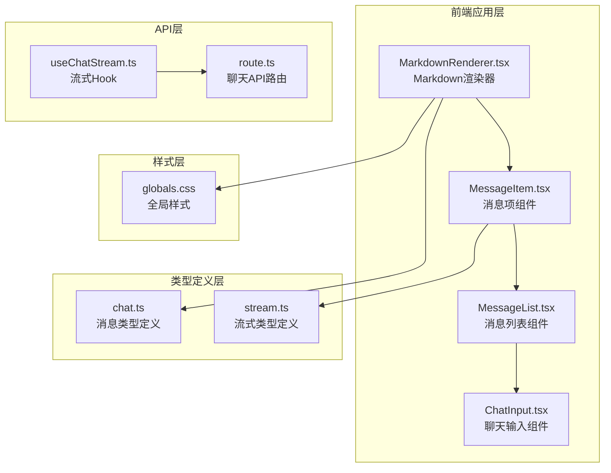
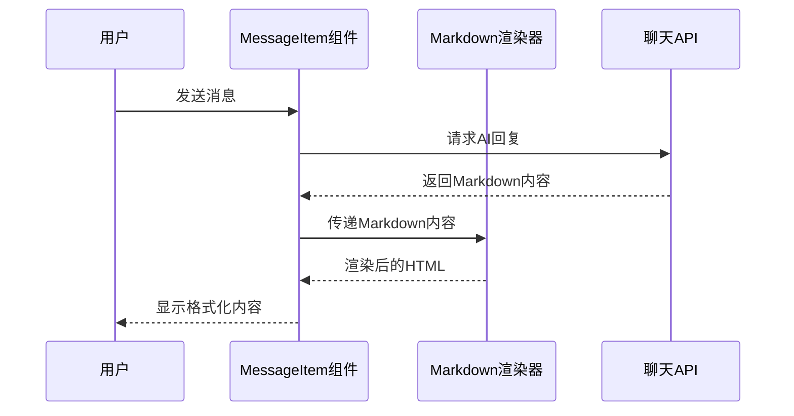
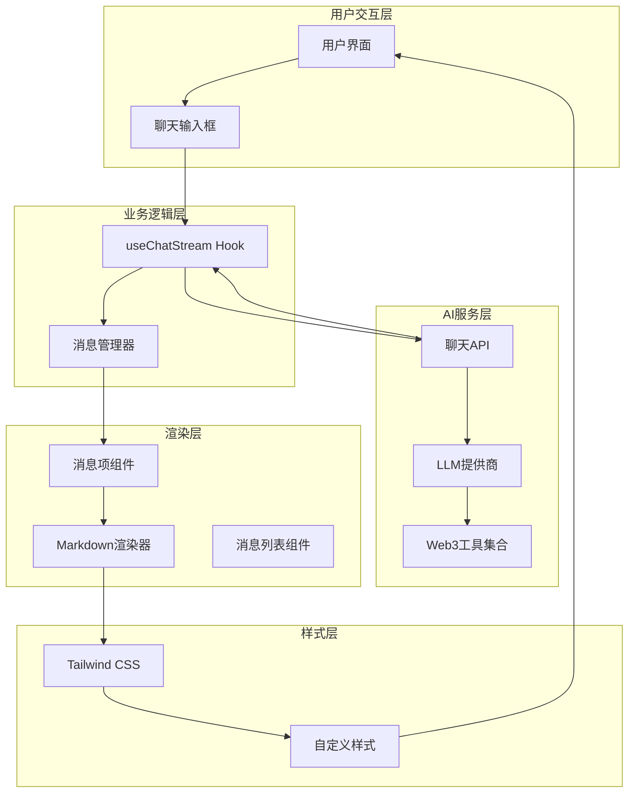
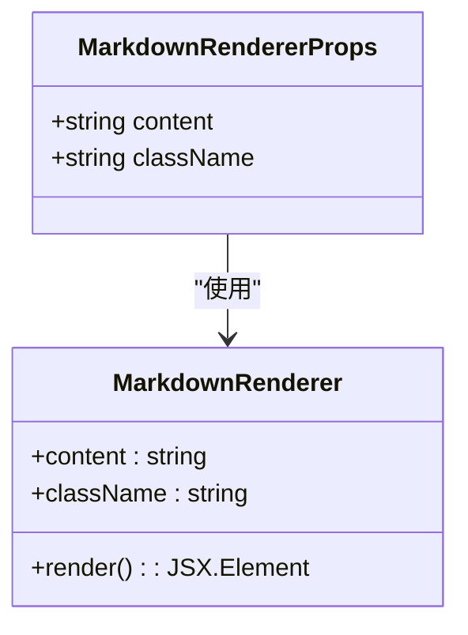
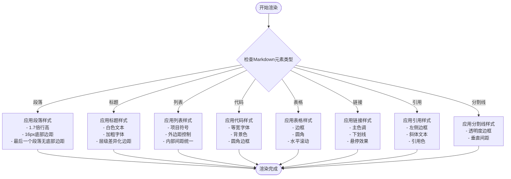
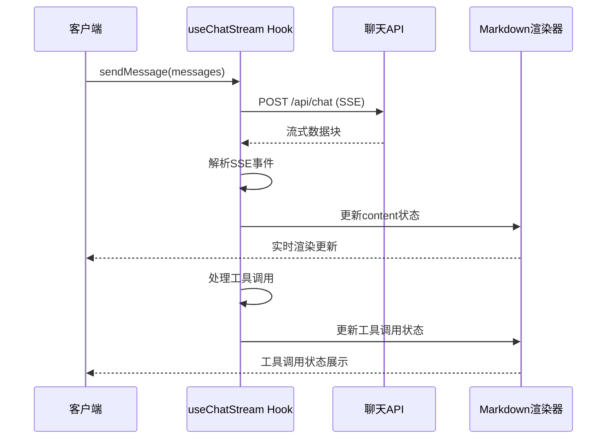

# Markdown渲染功能

<cite>
**本文档引用的文件**
- [MarkdownRenderer.tsx](file://apps/web/components/MarkdownRenderer.tsx)
- [MessageItem.tsx](file://apps/web/components/MessageItem.tsx)
- [page.tsx](file://apps/web/app/page.tsx)
- [useChatStream.ts](file://apps/web/hooks/useChatStream.ts)
- [route.ts](file://apps/web/app/api/chat/route.ts)
- [chat.ts](file://apps/web/types/chat.ts)
- [stream.ts](file://apps/web/types/stream.ts)
- [globals.css](file://apps/web/app/globals.css)
- [package.json](file://apps/web/package.json)
</cite>

## 目录
1. [简介](#简介)
2. [项目结构](#项目结构)
3. [核心组件](#核心组件)
4. [架构概览](#架构概览)
5. [详细组件分析](#详细组件分析)
6. [依赖关系分析](#依赖关系分析)
7. [性能考虑](#性能考虑)
8. [故障排除指南](#故障排除指南)
9. [结论](#结论)

## 简介

Web3 AI Agent项目中的Markdown渲染功能是一个关键的前端组件，负责将AI助手生成的Markdown格式文本转换为美观、可读的HTML内容。该功能不仅支持标准的Markdown语法，还通过GitHub Flavored Markdown (GFM) 扩展提供了表格、任务列表等高级特性，为用户提供专业的信息展示体验。

该渲染系统采用React组件化设计，结合Tailwind CSS样式框架，实现了响应式布局和现代化的视觉效果。从技术架构上看，它通过流式API与后端AI服务集成，支持实时内容更新和工具调用状态展示。

## 项目结构

Markdown渲染功能在整个项目架构中位于前端应用层的核心位置，主要涉及以下文件和模块：



**图表来源**
- [MarkdownRenderer.tsx:1-119](file://apps/web/components/MarkdownRenderer.tsx#L1-L119)
- [MessageItem.tsx:1-152](file://apps/web/components/MessageItem.tsx#L1-L152)
- [useChatStream.ts:1-295](file://apps/web/hooks/useChatStream.ts#L1-L295)

**章节来源**
- [MarkdownRenderer.tsx:1-119](file://apps/web/components/MarkdownRenderer.tsx#L1-L119)
- [MessageItem.tsx:1-152](file://apps/web/components/MessageItem.tsx#L1-L152)
- [page.tsx:1-217](file://apps/web/app/page.tsx#L1-L217)

## 核心组件

### MarkdownRenderer 组件

MarkdownRenderer是整个渲染系统的核心组件，负责将原始Markdown文本转换为结构化的HTML元素。该组件采用了高度定制化的渲染策略，针对不同Markdown元素提供了专门的样式处理。

#### 主要特性

1. **GFM扩展支持**: 通过remark-gfm插件启用GitHub Flavored Markdown的所有特性
2. **自定义样式映射**: 为每个Markdown元素提供特定的CSS类名
3. **内联代码处理**: 区分内联代码和代码块的不同渲染方式
4. **响应式表格**: 支持水平滚动的表格展示

#### 关键实现细节

组件的核心渲染逻辑基于ReactMarkdown库，通过components属性定义了每个Markdown元素的自定义渲染函数。例如，标题元素被渲染为带有特定样式的HTML元素，列表元素则应用了项目符号和间距控制。

**章节来源**
- [MarkdownRenderer.tsx:11-118](file://apps/web/components/MarkdownRenderer.tsx#L11-L118)

### MessageItem 组件

MessageItem组件负责渲染单个消息项，包括用户消息和AI助手消息。该组件集成了Markdown渲染功能，并提供了工具调用状态的可视化展示。

#### 渲染流程



**图表来源**
- [MessageItem.tsx:77-81](file://apps/web/components/MessageItem.tsx#L77-L81)
- [useChatStream.ts:167-252](file://apps/web/hooks/useChatStream.ts#L167-L252)

**章节来源**
- [MessageItem.tsx:13-151](file://apps/web/components/MessageItem.tsx#L13-L151)

## 架构概览

Markdown渲染功能在整个系统架构中扮演着重要的桥梁角色，连接着AI服务、流式传输和用户界面三个关键层面。



**图表来源**
- [useChatStream.ts:27-294](file://apps/web/hooks/useChatStream.ts#L27-L294)
- [route.ts:135-405](file://apps/web/app/api/chat/route.ts#L135-L405)
- [MarkdownRenderer.tsx:11-118](file://apps/web/components/MarkdownRenderer.tsx#L11-L118)

## 详细组件分析

### MarkdownRenderer 组件深度分析

#### 类型定义和接口

组件采用TypeScript接口定义，确保类型安全性和开发体验：



**图表来源**
- [MarkdownRenderer.tsx:6-9](file://apps/web/components/MarkdownRenderer.tsx#L6-L9)

#### 渲染策略分析

组件实现了针对不同Markdown元素的专门渲染策略：

| Markdown元素 | 渲染组件 | 样式特点 | 特殊处理 |
|-------------|----------|----------|----------|
| 段落(p) | HTML段落标签 | 1.7倍行高，底部边距 | 最后一个段落移除底部边距 |
| 标题(h1-h3) | HTML标题标签 | 白色文本，加粗字体 | 不同层级有不同的上下边距 |
| 列表(ul, ol) | HTML列表标签 | 项目符号，外边距控制 | 内部间距统一 |
| 代码(code) | HTML代码标签 | 等宽字体，背景色 | 区分内联和块级代码 |
| 表格(table) | HTML表格标签 | 边框，圆角，滚动支持 | 响应式设计 |

#### 样式系统集成

Markdown渲染器与Tailwind CSS系统深度集成，通过CSS类名实现主题一致性：



**图表来源**
- [MarkdownRenderer.tsx:17-111](file://apps/web/components/MarkdownRenderer.tsx#L17-L111)

**章节来源**
- [MarkdownRenderer.tsx:11-118](file://apps/web/components/MarkdownRenderer.tsx#L11-L118)

### MessageItem 组件与Markdown集成

MessageItem组件展示了Markdown渲染功能在实际应用场景中的集成方式：

#### 渲染条件判断

组件根据消息角色决定渲染方式：
- 用户消息：直接显示原始文本（无需Markdown解析）
- AI助手消息：通过MarkdownRenderer进行格式化渲染

#### 工具调用状态展示

除了Markdown内容渲染外，MessageItem还集成了工具调用状态的可视化展示，为用户提供完整的交互反馈。

**章节来源**
- [MessageItem.tsx:77-81](file://apps/web/components/MessageItem.tsx#L77-L81)

### 流式渲染集成

Markdown渲染功能与流式API完美集成，支持实时内容更新：



**图表来源**
- [useChatStream.ts:77-117](file://apps/web/hooks/useChatStream.ts#L77-L117)
- [route.ts:260-297](file://apps/web/app/api/chat/route.ts#L260-L297)

**章节来源**
- [useChatStream.ts:120-164](file://apps/web/hooks/useChatStream.ts#L120-L164)

## 依赖关系分析

### 核心依赖库

Markdown渲染功能依赖于以下关键库：

```mermaid
graph LR
subgraph "渲染核心"
A[react-markdown@10.1.0]
B[remark-gfm@4.0.1]
end
subgraph "样式系统"
C[Tailwind CSS]
D[自定义CSS]
end
subgraph "类型定义"
E[@types/react@18.3.28]
F[@types/mdast@4.0.4]
end
A --> B
A --> C
A --> D
A --> E
A --> F
```

**图表来源**
- [package.json:23-24](file://apps/web/package.json#L23-L24)

### 依赖版本兼容性

系统确保了依赖库之间的版本兼容性，特别是react-markdown与其插件生态系统的协调工作。

**章节来源**
- [package.json:12-37](file://apps/web/package.json#L12-L37)

## 性能考虑

### 渲染优化策略

1. **按需渲染**: 只对AI助手的消息进行Markdown解析，避免对用户消息重复处理
2. **状态更新节流**: 使用节流机制控制频繁的状态更新，提升渲染性能
3. **内存管理**: 合理管理流式数据的缓冲区，避免内存泄漏

### 流式渲染性能

流式渲染通过SSE技术实现实时内容更新，采用了以下性能优化措施：

- **增量更新**: 只更新变化的部分内容，而非重新渲染整个消息列表
- **缓冲区管理**: 合理管理SSE事件的缓冲区，确保数据完整性
- **错误恢复**: 实现自动重试机制，提高流式连接的稳定性

## 故障排除指南

### 常见问题及解决方案

#### Markdown渲染异常

**问题**: Markdown内容无法正确渲染
**可能原因**:
- 缺少remark-gfm插件依赖
- 样式类名冲突
- 内容格式不符合规范

**解决方案**:
1. 检查依赖安装状态
2. 验证样式类名的正确性
3. 确认Markdown内容格式

#### 流式渲染延迟

**问题**: 实时内容更新出现延迟
**可能原因**:
- 网络连接不稳定
- 服务器响应时间过长
- 客户端节流设置过于保守

**解决方案**:
1. 检查网络连接质量
2. 优化服务器响应时间
3. 调整节流参数设置

**章节来源**
- [useChatStream.ts:167-252](file://apps/web/hooks/useChatStream.ts#L167-L252)

## 结论

Web3 AI Agent项目的Markdown渲染功能展现了现代前端开发的最佳实践。通过精心设计的组件架构、完善的类型系统和高效的流式处理机制，该功能为用户提供了专业、流畅的信息展示体验。

该渲染系统的主要优势包括：

1. **技术先进性**: 采用最新的React和Next.js技术栈
2. **用户体验**: 提供实时、响应式的交互体验
3. **可维护性**: 清晰的组件分离和类型定义
4. **扩展性**: 易于添加新的Markdown元素支持
5. **性能优化**: 通过节流和增量更新提升渲染效率

未来可以考虑的功能增强方向包括：
- 更丰富的Markdown元素支持
- 自定义主题系统
- 更好的无障碍访问支持
- 性能监控和分析功能