# TransferCard转账卡片组件

<cite>
**本文档引用的文件**
- [TransferCard.tsx](file://apps/web/components/cards/TransferCard.tsx)
- [transfer.ts](file://apps/web/types/transfer.ts)
- [transfers.ts](file://apps/web/lib/supabase/transfers.ts)
- [tokens.ts](file://apps/web/lib/tokens.ts)
- [client.ts](file://apps/web/lib/supabase/client.ts)
- [create_transfer_cards.sql](file://supabase/migrations/create_transfer_cards.sql)
- [fix_transfer_cards_rls.sql](file://supabase/migrations/fix_transfer_cards_rls.sql)
- [route.ts](file://apps/web/app/api/tools/route.ts)
- [MessageItem.tsx](file://apps/web/components/MessageItem.tsx)
- [useChatStream.ts](file://apps/web/hooks/useChatStream.ts)
- [2026-04-24-feat-web3-transfer-card.md](file://docs/changelog/2026-04-24-feat-web3-transfer-card.md)
</cite>

## 目录
1. [简介](#简介)
2. [项目结构](#项目结构)
3. [核心组件](#核心组件)
4. [架构概览](#架构概览)
5. [详细组件分析](#详细组件分析)
6. [依赖关系分析](#依赖关系分析)
7. [性能考虑](#性能考虑)
8. [故障排除指南](#故障排除指南)
9. [结论](#结论)

## 简介

TransferCard转账卡片组件是Web3 AI Agent项目中的核心功能模块，它实现了基于自然语言的链上转账功能。该组件允许用户通过简单的自然语言指令（如"转 0.01 USDT 到 0x..."）来创建转账请求，并提供完整的转账流程管理，包括ETH原生转账和ERC20代币转账。

该组件集成了钱包连接、交易签名、状态管理和数据持久化等功能，为用户提供了一站式的Web3转账体验。组件采用React Hooks模式，充分利用了wagmi和viem等现代Web3开发工具库。

## 项目结构

TransferCard组件位于应用的组件层次结构中，与聊天系统紧密集成：

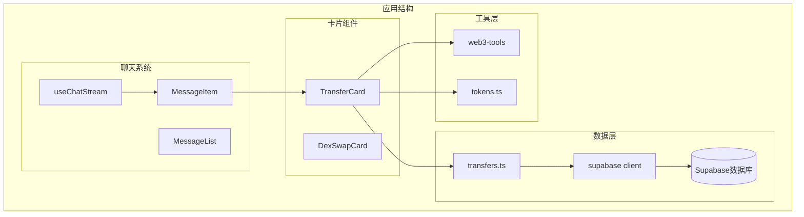

**图表来源**
- [TransferCard.tsx:1-601](file://apps/web/components/cards/TransferCard.tsx#L1-L601)
- [MessageItem.tsx:45-76](file://apps/web/components/MessageItem.tsx#L45-L76)
- [transfers.ts:1-142](file://apps/web/lib/supabase/transfers.ts#L1-L142)

**章节来源**
- [TransferCard.tsx:1-601](file://apps/web/components/cards/TransferCard.tsx#L1-L601)
- [MessageItem.tsx:45-76](file://apps/web/components/MessageItem.tsx#L45-L76)

## 核心组件

### TransferCard组件架构

TransferCard是一个功能完整的React组件，具有以下核心特性：

#### 状态管理
- **转账状态**: pending、approving、signing、confirmed、failed
- **链配置**: 支持以太坊、Polygon、BSC三大主流链
- **Token配置**: 内置主流Token配置，支持ERC20和原生币种
- **钱包集成**: 通过wagmi hooks实现钱包连接和交易签名

#### 主要功能模块

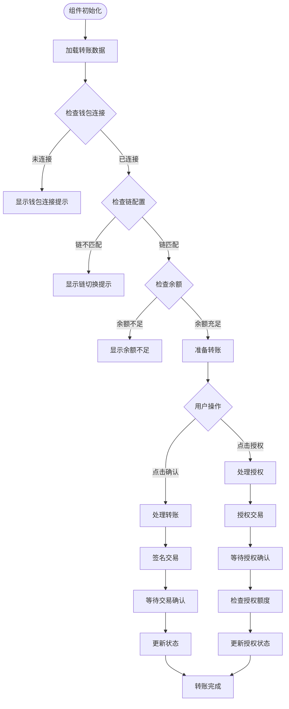

**图表来源**
- [TransferCard.tsx:301-392](file://apps/web/components/cards/TransferCard.tsx#L301-L392)
- [TransferCard.tsx:248-268](file://apps/web/components/cards/TransferCard.tsx#L248-L268)

**章节来源**
- [TransferCard.tsx:98-601](file://apps/web/components/cards/TransferCard.tsx#L98-L601)

## 架构概览

TransferCard组件采用了分层架构设计，确保了良好的可维护性和扩展性：

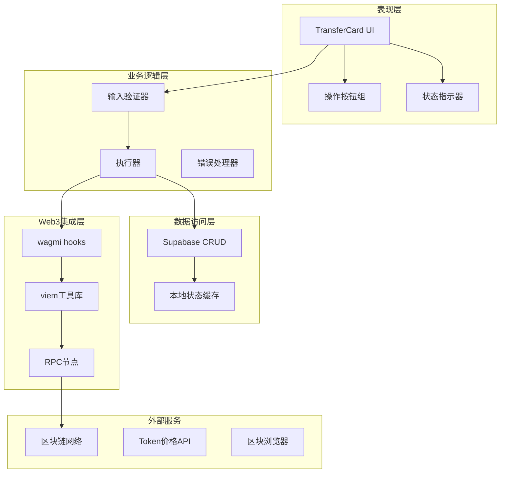

**图表来源**
- [TransferCard.tsx:117-392](file://apps/web/components/cards/TransferCard.tsx#L117-L392)
- [transfers.ts:20-79](file://apps/web/lib/supabase/transfers.ts#L20-L79)

### 数据流架构

组件的数据流遵循严格的单向数据流原则：

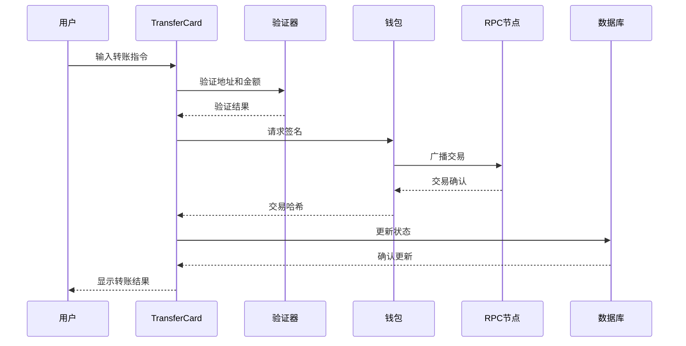

**图表来源**
- [TransferCard.tsx:301-392](file://apps/web/components/cards/TransferCard.tsx#L301-L392)
- [transfers.ts:51-79](file://apps/web/lib/supabase/transfers.ts#L51-L79)

**章节来源**
- [TransferCard.tsx:1-601](file://apps/web/components/cards/TransferCard.tsx#L1-L601)

## 详细组件分析

### 组件类图

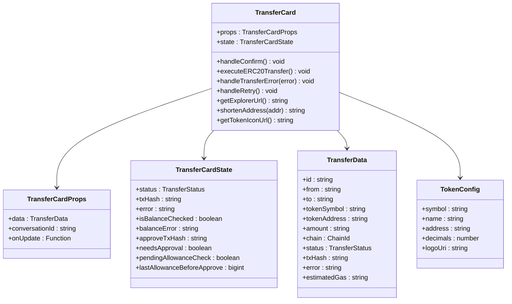

**图表来源**
- [TransferCard.tsx:11-15](file://apps/web/components/cards/TransferCard.tsx#L11-L15)
- [transfer.ts:7-19](file://apps/web/types/transfer.ts#L7-L19)

### 状态转换流程

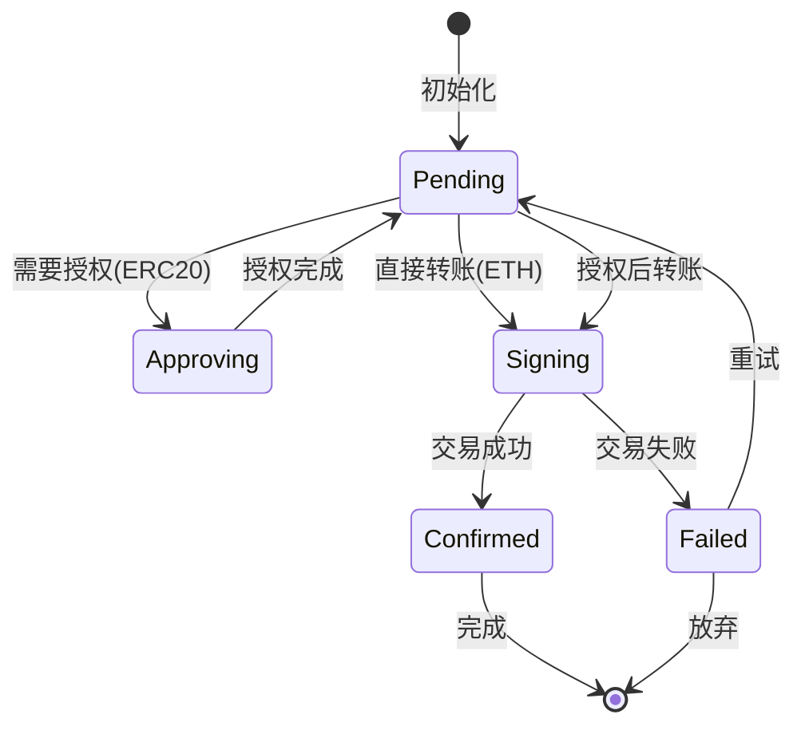

**图表来源**
- [TransferCard.tsx:90-96](file://apps/web/components/cards/TransferCard.tsx#L90-L96)
- [transfer.ts:3](file://apps/web/types/transfer.ts#L3)

### 核心功能实现

#### 余额检查机制

组件实现了多层次的余额检查机制：

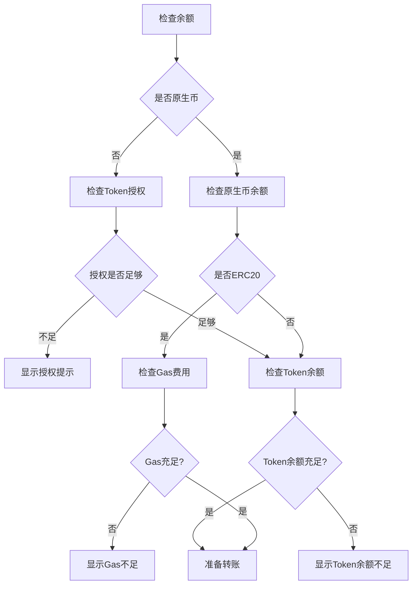

**图表来源**
- [TransferCard.tsx:200-246](file://apps/web/components/cards/TransferCard.tsx#L200-L246)

#### 错误处理策略

组件采用分级错误处理策略：

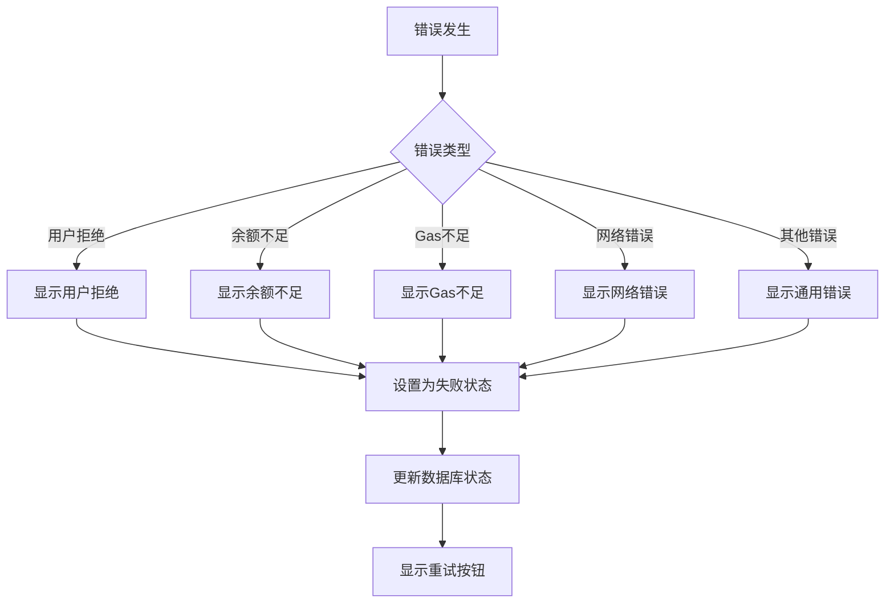

**图表来源**
- [TransferCard.tsx:394-418](file://apps/web/components/cards/TransferCard.tsx#L394-L418)

**章节来源**
- [TransferCard.tsx:153-183](file://apps/web/components/cards/TransferCard.tsx#L153-L183)
- [TransferCard.tsx:394-418](file://apps/web/components/cards/TransferCard.tsx#L394-L418)

## 依赖关系分析

### 外部依赖

TransferCard组件依赖多个关键外部库：

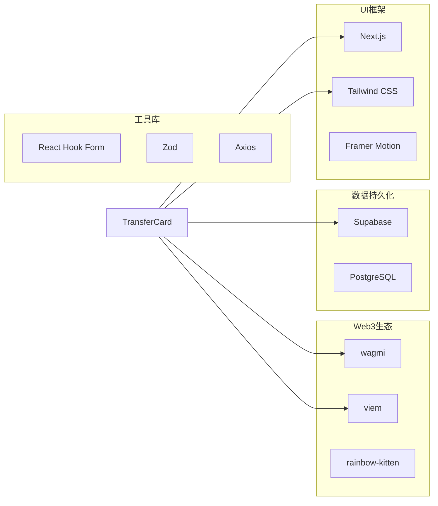

**图表来源**
- [TransferCard.tsx:3-8](file://apps/web/components/cards/TransferCard.tsx#L3-L8)

### 内部依赖关系

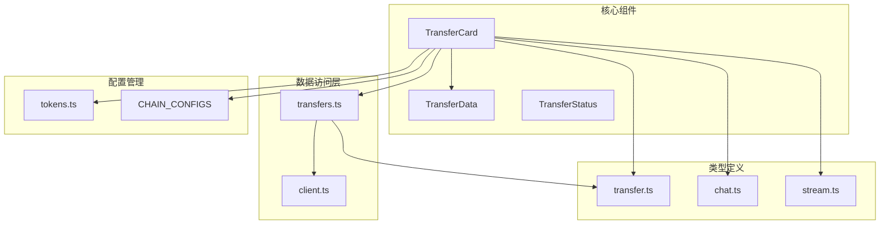

**图表来源**
- [TransferCard.tsx:6-8](file://apps/web/components/cards/TransferCard.tsx#L6-L8)
- [transfers.ts:3-4](file://apps/web/lib/supabase/transfers.ts#L3-L4)

**章节来源**
- [TransferCard.tsx:1-601](file://apps/web/components/cards/TransferCard.tsx#L1-L601)
- [transfers.ts:1-142](file://apps/web/lib/supabase/transfers.ts#L1-L142)

## 性能考虑

### 优化策略

TransferCard组件采用了多项性能优化策略：

#### 1. 状态最小化
- 使用useState钩子管理必要状态
- 避免不必要的重渲染
- 合理的状态合并

#### 2. 计算优化
- 使用useMemo缓存计算结果
- 避免在渲染过程中进行昂贵计算
- 合理的依赖数组设置

#### 3. 网络请求优化
- 条件化API调用
- 防抖和节流机制
- 请求去重

#### 4. 内存管理
- 及时清理事件监听器
- 合理的定时器管理
- 避免内存泄漏

### 性能监控

组件实现了基本的性能监控机制：

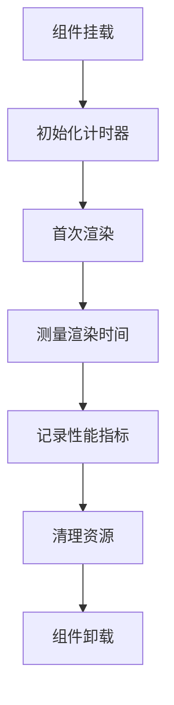

**图表来源**
- [TransferCard.tsx:248-268](file://apps/web/components/cards/TransferCard.tsx#L248-L268)

## 故障排除指南

### 常见问题及解决方案

#### 1. 钱包连接问题
- **症状**: "请先连接钱包"
- **原因**: 用户未连接钱包
- **解决**: 引导用户连接钱包，检查钱包扩展安装

#### 2. 地址格式错误
- **症状**: "接收地址格式错误"
- **原因**: 地址不符合EVM地址格式
- **解决**: 验证地址格式，使用isAddress函数

#### 3. 余额不足
- **症状**: "余额不足"或"GAS费用不足"
- **原因**: 账户余额不足以支付转账或Gas费用
- **解决**: 提示用户充值，检查账户余额

#### 4. 链不匹配
- **症状**: "请切换到 [链名称] 网络"
- **原因**: 用户连接的钱包网络与目标链不匹配
- **解决**: 引导用户切换到正确的网络

#### 5. 交易失败
- **症状**: "交易执行失败"
- **原因**: 签名被拒绝或网络错误
- **解决**: 检查错误详情，提供重试选项

### 调试技巧

#### 1. 开发者工具
- 使用浏览器开发者工具检查网络请求
- 查看控制台错误信息
- 监控钱包扩展日志

#### 2. 日志记录
- 在关键步骤添加日志
- 记录状态变化
- 跟踪异步操作

#### 3. 错误边界
- 实现错误边界组件
- 提供友好的错误提示
- 支持错误报告

**章节来源**
- [TransferCard.tsx:394-418](file://apps/web/components/cards/TransferCard.tsx#L394-L418)

## 结论

TransferCard转账卡片组件是一个功能完整、架构清晰的Web3应用组件。它成功地将复杂的区块链转账流程简化为用户友好的界面，同时保持了高度的安全性和可靠性。

### 主要成就

1. **用户体验优化**: 通过直观的界面设计和流畅的交互流程，大大降低了Web3转账的使用门槛

2. **技术架构先进**: 采用现代化的React Hooks模式和最佳实践，确保了代码的可维护性和可扩展性

3. **安全性保障**: 实现了多层次的安全检查和错误处理机制，有效保护了用户的资产安全

4. **性能优化**: 通过合理的状态管理和网络请求优化，提供了流畅的用户体验

### 技术亮点

- **完整的状态管理**: 支持从pending到confirmed的完整生命周期
- **智能的余额检查**: 自动检测余额和Gas费用，提供实时反馈
- **灵活的错误处理**: 针对不同类型的错误提供相应的处理策略
- **数据持久化**: 通过Supabase实现状态的持久化存储

### 未来发展

该组件为未来的功能扩展奠定了良好的基础，可以进一步增强的功能包括：

- **批量转账支持**: 支持一次性转账多个地址
- **交易历史记录**: 提供完整的转账历史查询
- **高级安全功能**: 实现多重签名和授权机制
- **跨链转账**: 支持不同区块链之间的资产转移

TransferCard组件代表了Web3应用开发的最佳实践，为构建更加用户友好的去中心化应用提供了宝贵的参考。