# Web3企业风格界面

<cite>
**本文档引用的文件**
- [apps/web/package.json](file://apps/web/package.json)
- [apps/web/app/layout.tsx](file://apps/web/app/layout.tsx)
- [apps/web/app/page.tsx](file://apps/web/app/page.tsx)
- [apps/web/components/ChatInput.tsx](file://apps/web/components/ChatInput.tsx)
- [apps/web/components/MessageList.tsx](file://apps/web/components/MessageList.tsx)
- [apps/web/components/MessageItem.tsx](file://apps/web/components/MessageItem.tsx)
- [apps/web/components/MarkdownRenderer.tsx](file://apps/web/components/MarkdownRenderer.tsx)
- [apps/web/components/SettingsPanel.tsx](file://apps/web/components/SettingsPanel.tsx)
- [apps/web/components/ConversationHistory.tsx](file://apps/web/components/ConversationHistory.tsx)
- [apps/web/hooks/useChatStream.ts](file://apps/web/hooks/useChatStream.ts)
- [apps/web/lib/memory/index.ts](file://apps/web/lib/memory/index.ts)
- [apps/web/lib/memory/types.ts](file://apps/web/lib/memory/types.ts)
- [apps/web/types/chat.ts](file://apps/web/types/chat.ts)
- [apps/web/types/stream.ts](file://apps/web/types/stream.ts)
- [apps/web/app/api/chat/route.ts](file://apps/web/app/api/chat/route.ts)
- [apps/web/tailwind.config.ts](file://apps/web/tailwind.config.ts)
- [apps/web/app/globals.css](file://apps/web/app/globals.css)
- [apps/web/lib/theme/ThemeContext.tsx](file://apps/web/lib/theme/ThemeContext.tsx)
- [apps/web/lib/theme/ThemeProvider.tsx](file://apps/web/lib/theme/ThemeProvider.tsx)
- [apps/web/lib/theme/types.ts](file://apps/web/lib/theme/types.ts)
- [packages/ai-config/package.json](file://packages/ai-config/package.json)
- [packages/web3-tools/package.json](file://packages/web3-tools/package.json)
</cite>

## 更新摘要
**所做更改**
- 更新了UI组件现代化部分，重点反映MessageItem、ChatInput、ConversationHistory等组件的样式更新
- 新增了CSS变量系统统一管理的主题设计说明
- 增加了主题切换机制和响应式设计的详细说明
- 补充了现代化UI设计元素的技术实现细节

## 目录
1. [项目简介](#项目简介)
2. [项目结构](#项目结构)
3. [核心组件](#核心组件)
4. [架构概览](#架构概览)
5. [详细组件分析](#详细组件分析)
6. [依赖关系分析](#依赖关系分析)
7. [性能考虑](#性能考虑)
8. [故障排除指南](#故障排除指南)
9. [结论](#结论)

## 项目简介

Web3 AI Agent 是一个基于Next.js构建的企业级Web3智能助手界面，专注于为用户提供去中心化金融相关的实时信息服务。该系统集成了AI大语言模型和Web3工具，能够查询多种加密货币价格、链上余额、Gas费用和Token信息。

### 主要特性
- **Web3企业风格设计**：采用深色主题和科技蓝配色方案，统一使用CSS变量系统
- **实时流式响应**：支持SSE流式传输，提供流畅的交互体验
- **多链支持**：覆盖以太坊、Polygon、BSC、比特币、Solana等主流区块链
- **智能记忆管理**：支持摘要压缩和滑动窗口两种记忆策略
- **工具调用集成**：内置多种Web3工具，自动执行链上数据查询
- **现代化UI组件**：MessageItem、ChatInput、ConversationHistory等组件全面现代化升级

## 项目结构

该项目采用Monorepo架构，主要包含以下模块：

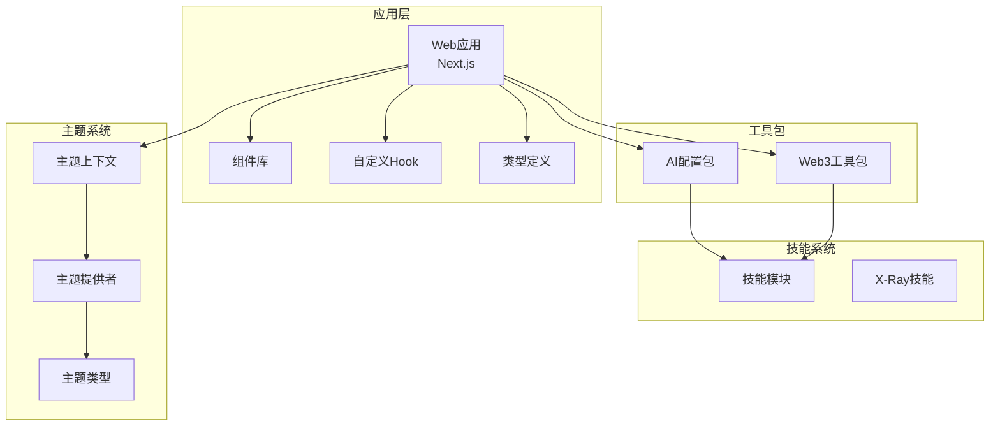

**图表来源**
- [apps/web/package.json:1-38](file://apps/web/package.json#L1-L38)
- [packages/ai-config/package.json:1-23](file://packages/ai-config/package.json#L1-L23)
- [packages/web3-tools/package.json:1-25](file://packages/web3-tools/package.json#L1-L25)

**章节来源**
- [apps/web/package.json:1-38](file://apps/web/package.json#L1-L38)
- [apps/web/app/layout.tsx:1-23](file://apps/web/app/layout.tsx#L1-L23)

## 核心组件

### 应用入口组件

主页面组件负责协调整个聊天界面的状态管理和数据流：

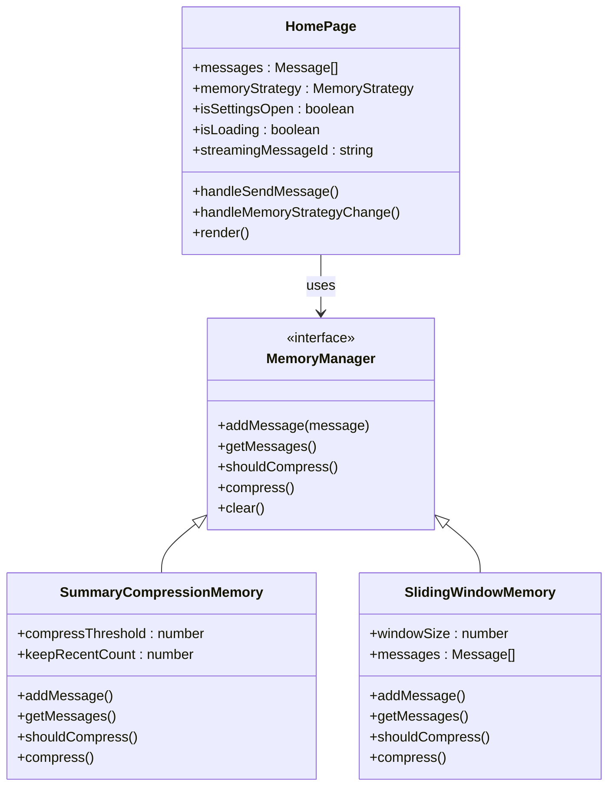

**图表来源**
- [apps/web/app/page.tsx:15-133](file://apps/web/app/page.tsx#L15-L133)
- [apps/web/lib/memory/types.ts:12-37](file://apps/web/lib/memory/types.ts#L12-L37)

### 聊天组件体系

系统采用组件化设计，每个组件都有明确的职责分工：

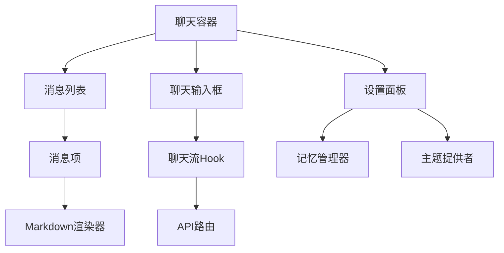

**图表来源**
- [apps/web/components/ChatInput.tsx:10-74](file://apps/web/components/ChatInput.tsx#L10-L74)
- [apps/web/components/MessageList.tsx:16-59](file://apps/web/components/MessageList.tsx#L16-L59)
- [apps/web/components/MessageItem.tsx:13-152](file://apps/web/components/MessageItem.tsx#L13-L152)
- [apps/web/hooks/useChatStream.ts:27-295](file://apps/web/hooks/useChatStream.ts#L27-L295)

**章节来源**
- [apps/web/app/page.tsx:15-217](file://apps/web/app/page.tsx#L15-L217)
- [apps/web/components/ChatInput.tsx:1-74](file://apps/web/components/ChatInput.tsx#L1-L74)
- [apps/web/components/MessageList.tsx:1-59](file://apps/web/components/MessageList.tsx#L1-L59)

## 架构概览

系统采用前后端分离的架构设计，前端使用Next.js构建，后端通过API路由处理请求：

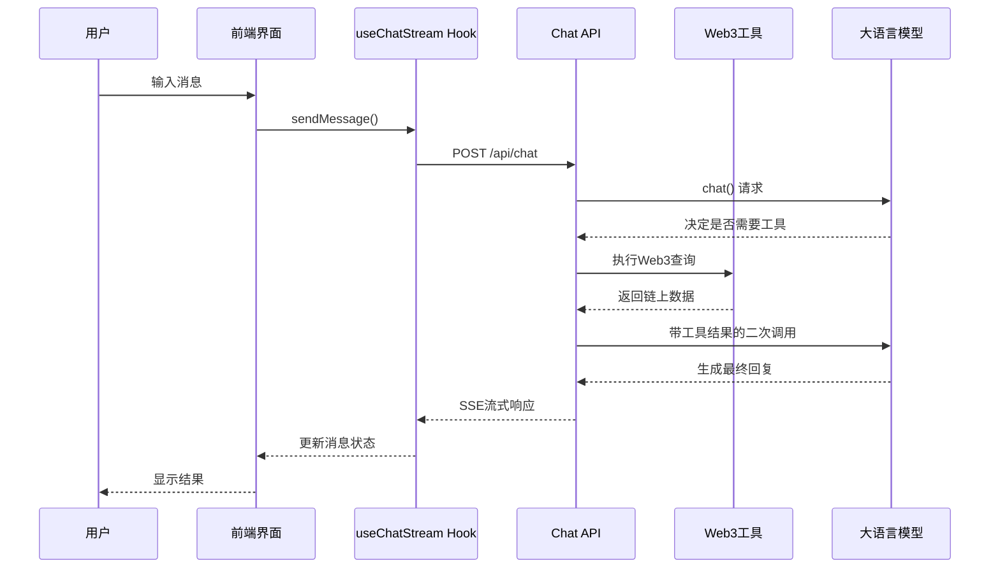

**图表来源**
- [apps/web/hooks/useChatStream.ts:167-252](file://apps/web/hooks/useChatStream.ts#L167-L252)
- [apps/web/app/api/chat/route.ts:135-405](file://apps/web/app/api/chat/route.ts#L135-L405)

### 数据流架构

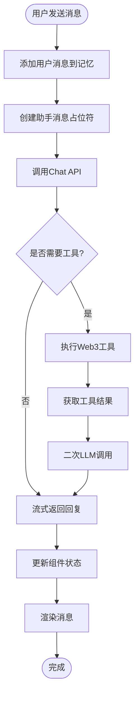

**图表来源**
- [apps/web/app/page.tsx:63-133](file://apps/web/app/page.tsx#L63-L133)
- [apps/web/app/api/chat/route.ts:170-319](file://apps/web/app/api/chat/route.ts#L170-L319)

**章节来源**
- [apps/web/app/api/chat/route.ts:135-406](file://apps/web/app/api/chat/route.ts#L135-L406)
- [apps/web/hooks/useChatStream.ts:77-117](file://apps/web/hooks/useChatStream.ts#L77-L117)

## 详细组件分析

### 记忆管理系统

系统实现了两种不同的记忆管理策略，用于优化对话上下文：

#### 摘要压缩记忆 (L3 Compression)

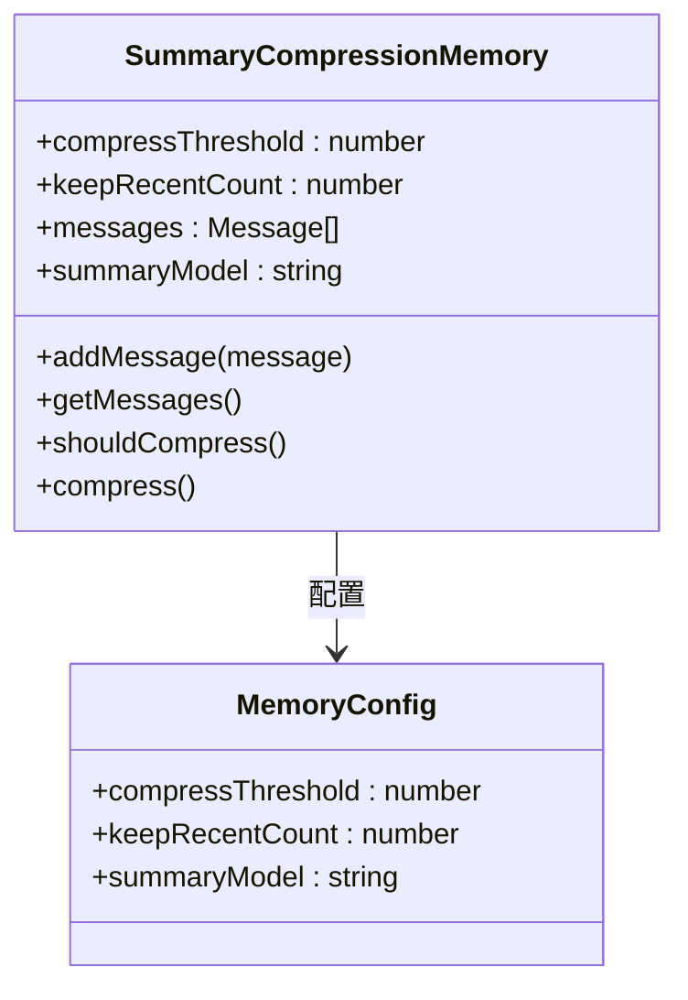

**图表来源**
- [apps/web/lib/memory/types.ts:3-10](file://apps/web/lib/memory/types.ts#L3-L10)
- [apps/web/lib/memory/index.ts:1-5](file://apps/web/lib/memory/index.ts#L1-L5)

#### 滑动窗口记忆 (L2 Sliding Window)

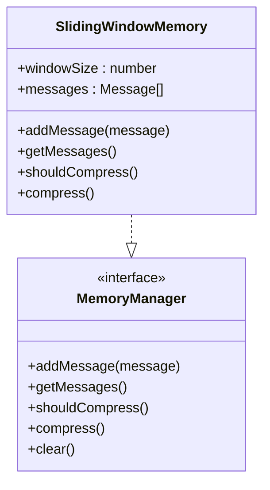

**图表来源**
- [apps/web/lib/memory/types.ts:12-37](file://apps/web/lib/memory/types.ts#L12-L37)
- [apps/web/lib/memory/index.ts:2-2](file://apps/web/lib/memory/index.ts#L2-L2)

### 流式通信机制

系统使用Server-Sent Events (SSE) 实现高效的流式通信：

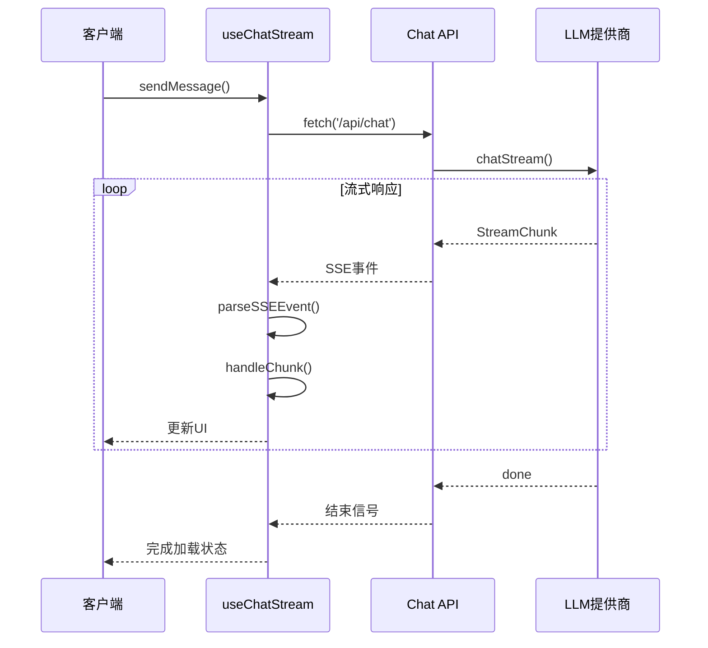

**图表来源**
- [apps/web/hooks/useChatStream.ts:77-117](file://apps/web/hooks/useChatStream.ts#L77-L117)
- [apps/web/app/api/chat/route.ts:260-297](file://apps/web/app/api/chat/route.ts#L260-L297)

### Web3工具集成

系统集成了多种Web3工具，支持不同类型的区块链查询：

| 工具名称 | 功能描述 | 支持链 |
|---------|----------|--------|
| getTokenPrice | 获取加密货币价格 | ETH, BTC, SOL, MATIC, BNB |
| getBalance | 查询钱包余额 | Ethereum, Polygon, BSC, Bitcoin, Solana |
| getGasPrice | 获取Gas费用 | Ethereum, Polygon, BSC |
| getTokenInfo | 查询Token元数据 | Ethereum, Polygon, BSC |

### 主题系统与CSS变量

系统采用现代化的CSS变量系统，实现了统一的主题管理：

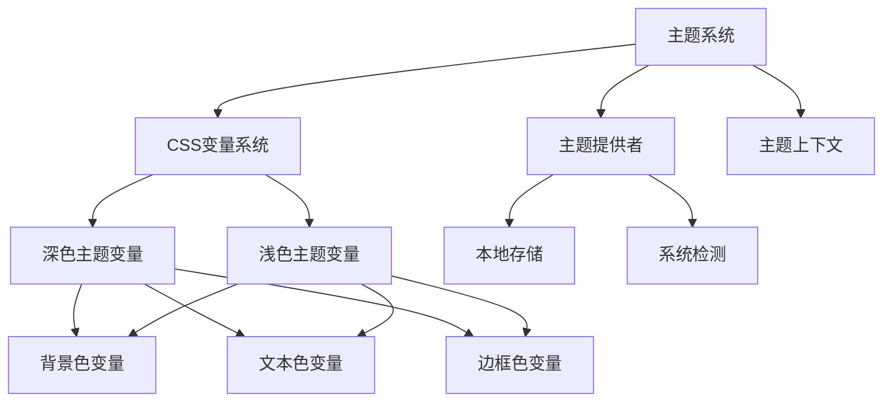

**图表来源**
- [apps/web/app/globals.css:5-48](file://apps/web/app/globals.css#L5-L48)
- [apps/web/lib/theme/ThemeProvider.tsx:13-82](file://apps/web/lib/theme/ThemeProvider.tsx#L13-L82)
- [apps/web/lib/theme/ThemeContext.tsx:6-20](file://apps/web/lib/theme/ThemeContext.tsx#L6-L20)

**章节来源**
- [apps/web/app/api/chat/route.ts:8-101](file://apps/web/app/api/chat/route.ts#L8-L101)
- [apps/web/hooks/useChatStream.ts:167-252](file://apps/web/hooks/useChatStream.ts#L167-L252)

## 依赖关系分析

### 技术栈依赖

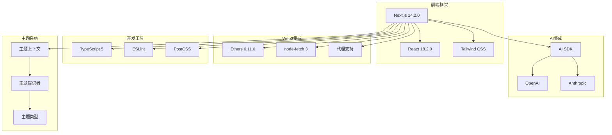

**图表来源**
- [apps/web/package.json:12-36](file://apps/web/package.json#L12-L36)
- [packages/ai-config/package.json:13-16](file://packages/ai-config/package.json#L13-L16)
- [packages/web3-tools/package.json:13-17](file://packages/web3-tools/package.json#L13-L17)

### 组件间依赖关系

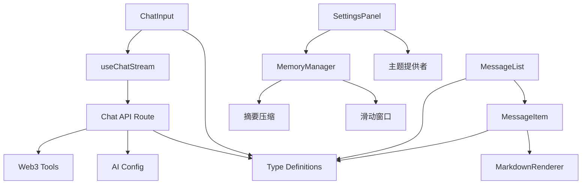

**图表来源**
- [apps/web/components/ChatInput.tsx:3-8](file://apps/web/components/ChatInput.tsx#L3-L8)
- [apps/web/components/MessageList.tsx:4-6](file://apps/web/components/MessageList.tsx#L4-L6)
- [apps/web/components/MessageItem.tsx:3-5](file://apps/web/components/MessageItem.tsx#L3-L5)
- [apps/web/hooks/useChatStream.ts:3-6](file://apps/web/hooks/useChatStream.ts#L3-L6)

**章节来源**
- [apps/web/package.json:12-36](file://apps/web/package.json#L12-L36)
- [apps/web/lib/memory/index.ts:1-5](file://apps/web/lib/memory/index.ts#L1-L5)

## 性能考虑

### 流式处理优化

系统采用了多项性能优化措施：

1. **节流更新机制**：每50ms更新一次流式内容，避免频繁的DOM操作
2. **内存管理**：使用AbortController及时取消过期请求
3. **重试机制**：最多重试2次，每次间隔1秒
4. **超时控制**：30秒超时限制，防止长时间阻塞

### 内存策略优化

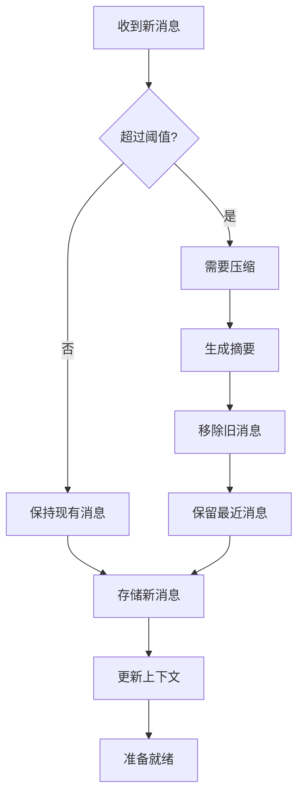

**图表来源**
- [apps/web/hooks/useChatStream.ts:16-18](file://apps/web/hooks/useChatStream.ts#L16-L18)
- [apps/web/lib/memory/types.ts:4-7](file://apps/web/lib/memory/types.ts#L4-L7)

### 缓存和状态管理

- **组件状态缓存**：使用React状态管理消息和加载状态
- **工具调用缓存**：工具调用结果通过消息传递系统缓存
- **样式缓存**：Tailwind CSS类名预编译，减少运行时计算
- **主题状态缓存**：localStorage存储主题偏好设置

## 故障排除指南

### 常见问题及解决方案

#### API请求失败

**症状**：聊天界面显示错误消息，无法获取响应

**可能原因**：
1. LLM提供商配置错误
2. 网络连接问题
3. API密钥无效

**解决步骤**：
1. 检查环境变量配置
2. 验证网络连接
3. 重新生成API密钥

#### 流式响应中断

**症状**：消息显示不完整，加载状态持续

**可能原因**：
1. SSE连接超时
2. 服务器负载过高
3. 客户端AbortController触发

**解决步骤**：
1. 检查服务器日志
2. 降低并发请求
3. 重试发送消息

#### 记忆管理异常

**症状**：对话上下文混乱，历史消息丢失

**可能原因**：
1. 记忆策略配置错误
2. 内存溢出
3. 并发访问冲突

**解决步骤**：
1. 切换到滑动窗口策略
2. 清空记忆缓存
3. 检查并发访问逻辑

#### 主题切换问题

**症状**：主题切换不生效或状态不同步

**可能原因**：
1. localStorage访问权限问题
2. CSS变量未正确更新
3. 主题提供者初始化失败

**解决步骤**：
1. 检查浏览器localStorage状态
2. 刷新页面强制重新应用主题
3. 重新登录钱包连接

**章节来源**
- [apps/web/hooks/useChatStream.ts:221-248](file://apps/web/hooks/useChatStream.ts#L221-L248)
- [apps/web/app/api/chat/route.ts:360-404](file://apps/web/app/api/chat/route.ts#L360-L404)

## 结论

Web3 AI Agent项目展现了现代Web3应用的最佳实践，成功地将企业级界面设计与AI技术相结合。系统具有以下优势：

### 技术亮点
- **架构清晰**：采用Monorepo架构，模块化程度高
- **性能优秀**：流式处理和内存优化确保流畅体验
- **扩展性强**：插件化的工具系统支持功能扩展
- **用户体验佳**：企业风格设计和响应式布局
- **现代化UI**：统一的CSS变量系统和主题管理
- **主题灵活**：深色/浅色/系统主题自由切换

### 应用价值
- **企业适用性**：深色主题和专业设计适合企业环境
- **功能完整性**：覆盖Web3核心需求的完整工具链
- **开发效率**：完善的类型定义和错误处理机制
- **维护友好**：清晰的代码结构和文档支持
- **可访问性**：良好的对比度和色彩系统
- **可扩展性**：模块化的主题系统便于功能扩展

该系统为Web3领域的AI应用提供了优秀的参考实现，无论是作为生产环境部署还是学习研究都具有很高的价值。