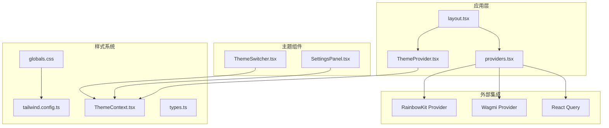
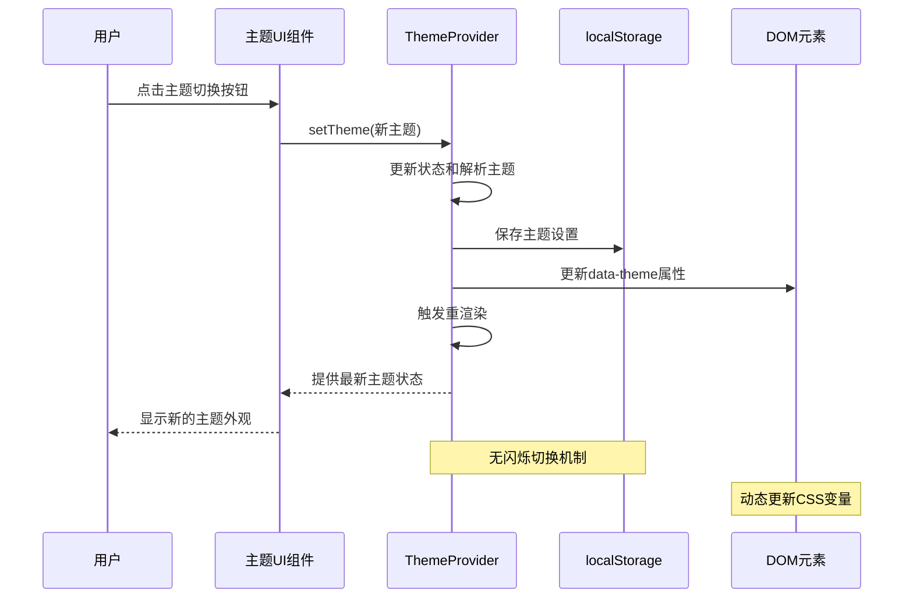
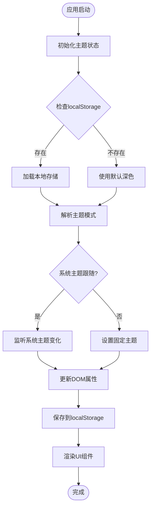
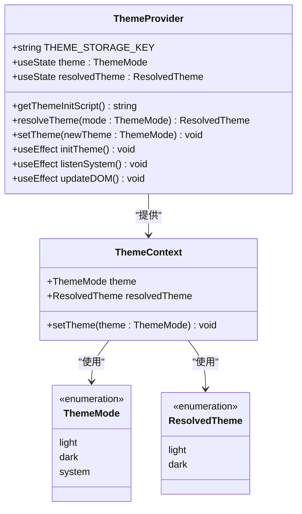
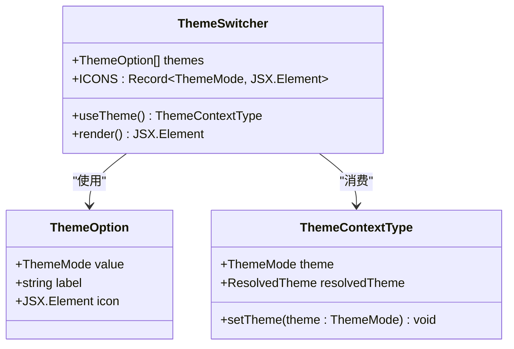
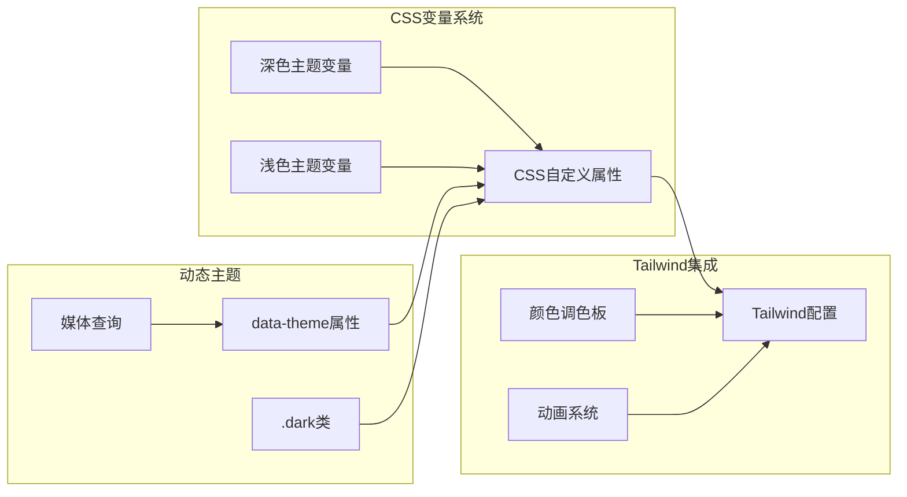
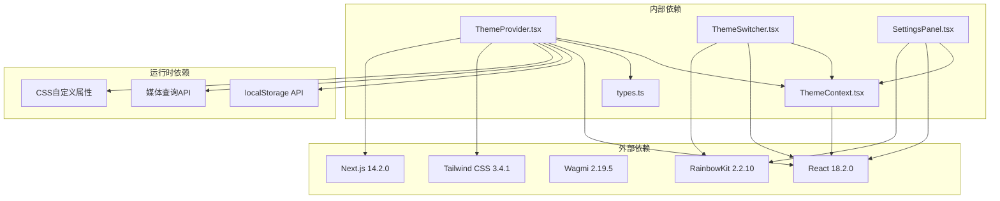

# Quantum Nexus主题系统

<cite>
**本文档引用的文件**
- [ThemeSwitcher.tsx](file://apps/web/components/ThemeSwitcher.tsx)
- [ThemeProvider.tsx](file://apps/web/lib/theme/ThemeProvider.tsx)
- [ThemeContext.tsx](file://apps/web/lib/theme/ThemeContext.tsx)
- [types.ts](file://apps/web/lib/theme/types.ts)
- [layout.tsx](file://apps/web/app/layout.tsx)
- [providers.tsx](file://apps/web/app/providers.tsx)
- [globals.css](file://apps/web/app/globals.css)
- [tailwind.config.ts](file://apps/web/tailwind.config.ts)
- [SettingsPanel.tsx](file://apps/web/components/SettingsPanel.tsx)
- [ThemeProvider.test.tsx](file://apps/web/lib/theme/ThemeProvider.test.tsx)
- [package.json](file://apps/web/package.json)
</cite>

## 目录
1. [项目概述](#项目概述)
2. [项目结构](#项目结构)
3. [核心组件](#核心组件)
4. [架构概览](#架构概览)
5. [详细组件分析](#详细组件分析)
6. [依赖关系分析](#依赖关系分析)
7. [性能考虑](#性能考虑)
8. [故障排除指南](#故障排除指南)
9. [结论](#结论)

## 项目概述

Quantum Nexus主题系统是一个专为Web3 AI Agent设计的现代化主题管理系统，融合了量子科技与网络节点的设计理念。该系统提供了完整的深色/浅色主题切换功能，支持系统主题跟随，并集成了RainbowKit钱包连接组件的主题适配。

系统采用React Hooks和Context API构建，实现了无闪烁的主题切换体验，通过CSS自定义属性和Tailwind CSS实现了丰富的视觉效果，包括渐变色彩、发光效果和动画过渡。

## 项目结构

**图表来源**
- [layout.tsx:1-64](file://apps/web/app/layout.tsx#L1-L64)
- [providers.tsx:1-76](file://apps/web/app/providers.tsx#L1-L76)
- [ThemeProvider.tsx:1-110](file://apps/web/lib/theme/ThemeProvider.tsx#L1-L110)

**章节来源**
- [layout.tsx:1-64](file://apps/web/app/layout.tsx#L1-L64)
- [package.json:1-51](file://apps/web/package.json#L1-L51)

## 核心组件

### 主题提供者（ThemeProvider）

主题提供者是整个主题系统的核心，负责管理主题状态、处理主题切换逻辑，并确保无闪烁的用户体验。

**主要功能：**
- 管理主题状态（light/dark/system）
- 处理系统主题跟随逻辑
- 管理localStorage持久化
- 处理DOM元素的data-theme属性
- 实现媒体查询监听

### 主题切换器（ThemeSwitcher）

提供用户友好的主题切换界面，支持三种主题模式的可视化选择。

**特性：**
- 图标化的主题预览
- 激活状态的渐变背景
- 悬停效果和动画过渡
- 实时主题状态显示

### 设置面板（SettingsPanel）

集成主题管理和其他设置选项的综合面板。

**功能模块：**
- 主题模式选择
- Memory策略配置
- 多语言支持预留
- 版本信息显示

**章节来源**
- [ThemeProvider.tsx:34-110](file://apps/web/lib/theme/ThemeProvider.tsx#L34-L110)
- [ThemeSwitcher.tsx:36-121](file://apps/web/components/ThemeSwitcher.tsx#L36-L121)
- [SettingsPanel.tsx:49-320](file://apps/web/components/SettingsPanel.tsx#L49-L320)

## 架构概览

**图表来源**
- [ThemeProvider.tsx:86-98](file://apps/web/lib/theme/ThemeProvider.tsx#L86-L98)
- [ThemeSwitcher.tsx:73](file://apps/web/components/ThemeSwitcher.tsx#L73)

### 数据流分析

**图表来源**
- [ThemeProvider.tsx:48-98](file://apps/web/lib/theme/ThemeProvider.tsx#L48-L98)
- [layout.tsx:36-54](file://apps/web/app/layout.tsx#L36-L54)

## 详细组件分析

### 主题提供者实现

**图表来源**
- [ThemeProvider.tsx:34-110](file://apps/web/lib/theme/ThemeProvider.tsx#L34-L110)
- [ThemeContext.tsx:6-21](file://apps/web/lib/theme/ThemeContext.tsx#L6-L21)
- [types.ts:4-9](file://apps/web/lib/theme/types.ts#L4-L9)

### 主题切换器组件

**图表来源**
- [ThemeSwitcher.tsx:36-121](file://apps/web/components/ThemeSwitcher.tsx#L36-L121)
- [ThemeContext.tsx:6-21](file://apps/web/lib/theme/ThemeContext.tsx#L6-L21)

### 样式系统架构

**图表来源**
- [globals.css:10-106](file://apps/web/app/globals.css#L10-L106)
- [tailwind.config.ts:10-96](file://apps/web/tailwind.config.ts#L10-L96)

**章节来源**
- [ThemeProvider.tsx:12-28](file://apps/web/lib/theme/ThemeProvider.tsx#L12-L28)
- [ThemeSwitcher.tsx:12-34](file://apps/web/components/ThemeSwitcher.tsx#L12-L34)
- [globals.css:108-571](file://apps/web/app/globals.css#L108-L571)

## 依赖关系分析

**图表来源**
- [package.json:14-33](file://apps/web/package.json#L14-L33)
- [ThemeProvider.tsx:1-21](file://apps/web/lib/theme/ThemeProvider.tsx#L1-L21)
- [ThemeContext.tsx:1-21](file://apps/web/lib/theme/ThemeContext.tsx#L1-L21)

**章节来源**
- [package.json:14-33](file://apps/web/package.json#L14-L33)
- [ThemeProvider.tsx:1-21](file://apps/web/lib/theme/ThemeProvider.tsx#L1-L21)

## 性能考虑

### 无闪烁渲染优化

系统采用了多重策略来避免主题切换时的闪烁问题：

1. **服务端预渲染**：在layout.tsx中通过内联脚本预设主题
2. **客户端同步**：ThemeProvider在客户端同步初始化主题状态
3. **DOM属性优先**：通过data-theme属性确保CSS变量正确应用

### 内存管理

- 使用useCallback优化主题切换函数
- 媒体查询监听器在组件卸载时自动清理
- localStorage访问使用防抖策略

### 渲染性能

- CSS变量替换比JavaScript动态样式更高效
- Tailwind CSS的原子化类减少CSS体积
- 动画使用GPU加速的transform和opacity属性

## 故障排除指南

### 常见问题及解决方案

**问题1：主题切换后页面闪烁**
- 检查layout.tsx中的内联脚本是否正确执行
- 确认localStorage中是否有正确的主题设置
- 验证CSS变量是否正确应用到根元素

**问题2：系统主题跟随无效**
- 检查浏览器的深色模式设置
- 确认媒体查询监听器是否正常工作
- 验证resolveTheme函数的逻辑

**问题3：RainbowKit主题不匹配**
- 确认RainbowKitProviderWrapper中的主题配置
- 检查mounted状态是否正确设置
- 验证主题切换时的条件判断逻辑

**章节来源**
- [ThemeProvider.test.tsx:1-125](file://apps/web/lib/theme/ThemeProvider.test.tsx#L1-L125)
- [layout.tsx:36-54](file://apps/web/app/layout.tsx#L36-L54)
- [providers.tsx:45-75](file://apps/web/app/providers.tsx#L45-L75)

## 结论

Quantum Nexus主题系统通过精心设计的架构实现了现代化的用户体验。系统不仅提供了完整的主题切换功能，还通过以下特点展现了其技术优势：

1. **无缝用户体验**：通过内联脚本和客户端同步确保无闪烁主题切换
2. **灵活的主题管理**：支持系统主题跟随、深色/浅色手动切换
3. **丰富的视觉效果**：结合Tailwind CSS和CSS变量实现动态色彩系统
4. **良好的可扩展性**：模块化的组件设计便于功能扩展
5. **完善的测试覆盖**：包含单元测试和集成测试确保系统稳定性

该主题系统为Web3 AI Agent项目奠定了坚实的视觉基础，为用户提供了一致且现代化的交互体验。