# Web应用程序

<cite>
**本文档引用的文件**
- [apps/web/app/layout.tsx](file://apps/web/app/layout.tsx)
- [apps/web/app/providers.tsx](file://apps/web/app/providers.tsx)
- [apps/web/app/page.tsx](file://apps/web/app/page.tsx)
- [apps/web/app/api/chat/route.ts](file://apps/web/app/api/chat/route.ts)
- [apps/web/app/api/tools/route.ts](file://apps/web/app/api/tools/route.ts)
- [apps/web/components/ChatInput.tsx](file://apps/web/components/ChatInput.tsx)
- [apps/web/components/MessageList.tsx](file://apps/web/components/MessageList.tsx)
- [apps/web/components/MessageItem.tsx](file://apps/web/components/MessageItem.tsx)
- [apps/web/components/MarkdownRenderer.tsx](file://apps/web/components/MarkdownRenderer.tsx)
- [apps/web/components/SettingsPanel.tsx](file://apps/web/components/SettingsPanel.tsx)
- [apps/web/components/ThemeSwitcher.tsx](file://apps/web/components/ThemeSwitcher.tsx)
- [apps/web/components/ConfirmDialog.tsx](file://apps/web/components/ConfirmDialog.tsx)
- [apps/web/components/WalletConnectButton.tsx](file://apps/web/components/WalletConnectButton.tsx)
- [apps/web/components/ConversationHistory.tsx](file://apps/web/components/ConversationHistory.tsx)
- [apps/web/lib/theme/ThemeProvider.tsx](file://apps/web/lib/theme/ThemeProvider.tsx)
- [apps/web/lib/theme/ThemeContext.tsx](file://apps/web/lib/theme/ThemeContext.tsx)
- [apps/web/lib/theme/types.ts](file://apps/web/lib/theme/types.ts)
- [apps/web/hooks/useChatStream.ts](file://apps/web/hooks/useChatStream.ts)
- [apps/web/lib/memory/SummaryCompressionMemory.ts](file://apps/web/lib/memory/SummaryCompressionMemory.ts)
- [apps/web/lib/memory/SlidingWindowMemory.ts](file://apps/web/lib/memory/SlidingWindowMemory.ts)
- [apps/web/lib/memory/config.ts](file://apps/web/lib/memory/config.ts)
- [apps/web/lib/memory/types.ts](file://apps/web/lib/memory/types.ts)
- [apps/web/lib/memory/index.ts](file://apps/web/lib/memory/index.ts)
- [apps/web/types/chat.ts](file://apps/web/types/chat.ts)
- [apps/web/lib/supabase/client.ts](file://apps/web/lib/supabase/client.ts)
- [apps/web/app/globals.css](file://apps/web/app/globals.css)
- [apps/web/tailwind.config.ts](file://apps/web/tailwind.config.ts)
- [apps/web/package.json](file://apps/web/package.json)
- [apps/web/next.config.js](file://apps/web/next.config.js)
- [apps/web/postcss.config.js](file://apps/web/postcss.config.js)
- [package.json](file://package.json)
- [turbo.json](file://turbo.json)
- [pnpm-workspace.yaml](file://pnpm-workspace.yaml)
</cite>

## 更新摘要
**变更内容**
- 新增完整的UI增强系统，包括ConfirmDialog组件和ThemeSwitcher组件
- 实现全局主题系统（lib/theme架构），支持浅色、深色和跟随系统三种主题模式
- 新增钱包上下文注入功能，实现AI对用户钱包地址的感知
- 完善设置面板，集成主题切换功能
- 增强UI组件体系，提升用户交互体验
- 优化主题提供者架构，实现响应式主题切换
- 改进连接状态管理，断开连接时清空UI但保留云端数据

## 目录
1. [简介](#简介)
2. [项目结构](#项目结构)
3. [核心组件](#核心组件)
4. [架构概览](#架构概览)
5. [详细组件分析](#详细组件分析)
6. [主题系统](#主题系统)
7. [确认对话框组件](#确认对话框组件)
8. [钱包上下文注入](#钱包上下文注入)
9. [内存管理策略](#内存管理策略)
10. [UI设计与样式](#ui设计与样式)
11. [依赖关系分析](#依赖关系分析)
12. [性能考虑](#性能考虑)
13. [故障排除指南](#故障排除指南)
14. [结论](#结论)

## 简介

这是一个基于 Next.js 的 Web3 AI Agent 应用程序，旨在为用户提供 Web3 相关的信息查询服务。该应用能够理解用户意图、调用 Web3 工具、并返回可信的结果。主要功能包括：

- 查询 ETH 实时价格
- 查询以太坊钱包余额
- 查询当前 Gas 价格
- 智能对话交互
- 工具调用和结果展示
- **新增**：完整的Markdown语法渲染支持
- **新增**：内存策略管理设置面板
- **新增**：Web3企业风格的现代化UI设计
- **新增**：完整的主题系统支持
- **新增**：统一的确认对话框组件
- **新增**：钱包上下文注入功能，实现AI对用户钱包地址的感知

应用采用现代化的技术栈，包括 Next.js 14、TypeScript、Tailwind CSS 和 Ethers.js，构建了一个响应式的 Web3 信息查询平台，具备企业级的设计风格和用户体验。

## 项目结构

该项目采用 Monorepo 结构，使用 Turborepo 进行管理，包含以下主要目录：

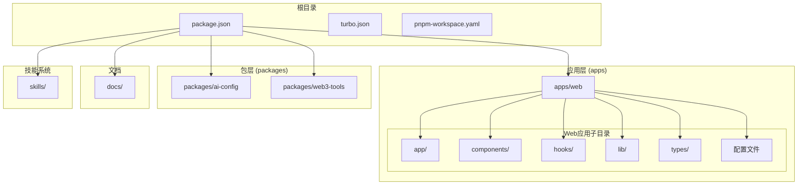
```mermaid
graph TB
subgraph "根目录"
Root[package.json]
Turbo[turbo.json]
Workspace[pnpm-workspace.yaml]
end
subgraph "应用层 (apps)"
WebApp[apps/web]
subgraph "Web应用子目录"
App[app/]
Components[components/]
Hooks[hooks/]
Lib[lib/]
Types[types/]
Config[配置文件]
end
end
subgraph "包层 (packages)"
AIConfig[packages/ai-config]
Web3Tools[packages/web3-tools]
end
subgraph "文档"
Docs[docs/]
end
subgraph "技能系统"
Skills[skills/]
end
Root --> WebApp
Root --> AIConfig
Root --> Web3Tools
Root --> Docs
Root --> Skills
WebApp --> App
WebApp --> Components
WebApp --> Hooks
WebApp --> Lib
WebApp --> Types
WebApp --> Config
```

**图表来源**
- [package.json:1-28](file://package.json#L1-L28)
- [turbo.json:1-21](file://turbo.json#L1-L21)
- [pnpm-workspace.yaml:1-4](file://pnpm-workspace.yaml#L1-L4)

**章节来源**
- [package.json:1-28](file://package.json#L1-L28)
- [turbo.json:1-21](file://turbo.json#L1-L21)
- [pnpm-workspace.yaml:1-4](file://pnpm-workspace.yaml#L1-L4)

## 核心组件

### 应用布局组件

应用布局组件负责设置全局元数据和字体配置：

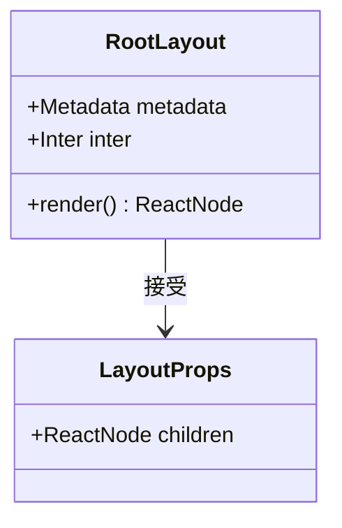
```mermaid
classDiagram
class RootLayout {
+Metadata metadata
+Inter inter
+render() ReactNode
}
class LayoutProps {
+ReactNode children
}
RootLayout --> LayoutProps : 接受
```

**图表来源**
- [apps/web/app/layout.tsx:1-38](file://apps/web/app/layout.tsx#L1-L38)

### 主页面组件

主页面组件实现了完整的聊天界面，包含消息列表、输入框、设置面板和状态管理：

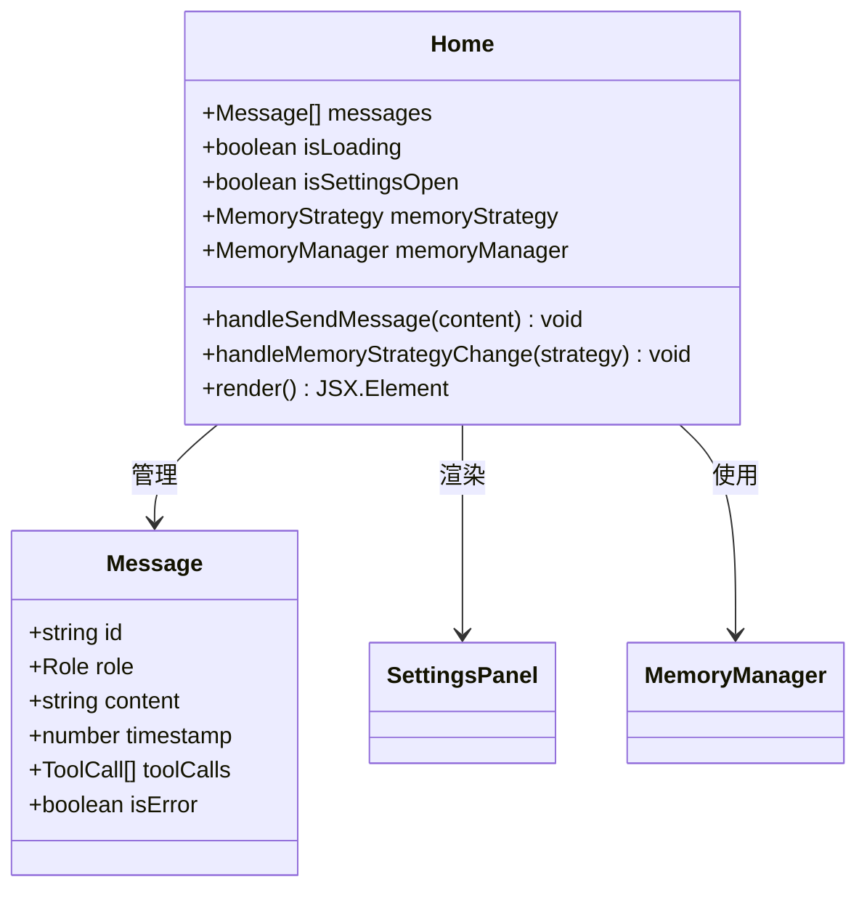
```mermaid
classDiagram
class Home {
+Message[] messages
+boolean isLoading
+boolean isSettingsOpen
+MemoryStrategy memoryStrategy
+MemoryManager memoryManager
+handleSendMessage(content) void
+handleMemoryStrategyChange(strategy) void
+render() JSX.Element
}
class Message {
+string id
+Role role
+string content
+number timestamp
+ToolCall[] toolCalls
+boolean isError
}
Home --> Message : 管理
Home --> SettingsPanel : 渲染
Home --> MemoryManager : 使用
```

**图表来源**
- [apps/web/app/page.tsx:1-376](file://apps/web/app/page.tsx#L1-L376)
- [apps/web/types/chat.ts:1-29](file://apps/web/types/chat.ts#L1-L29)

**章节来源**
- [apps/web/app/layout.tsx:1-38](file://apps/web/app/layout.tsx#L1-L38)
- [apps/web/app/page.tsx:1-376](file://apps/web/app/page.tsx#L1-L376)
- [apps/web/types/chat.ts:1-29](file://apps/web/types/chat.ts#L1-L29)

## 架构概览

该应用程序采用客户端-服务器架构，结合了 AI 模型推理和 Web3 工具调用：

```mermaid
graph TB
subgraph "客户端层"
Browser[浏览器]
ChatUI[聊天界面]
Components[React组件]
SettingsPanel[设置面板]
MarkdownRenderer[Markdown渲染器]
MemoryManager[内存管理器]
ThemeSystem[主题系统]
ConfirmDialog[确认对话框]
WalletContext[钱包上下文]
RainbowKit[钱包连接]
</subgraph>
subgraph "API层"
ChatAPI[聊天API]
ToolsAPI[工具API]
HealthAPI[健康检查API]
</subgraph>
subgraph "AI层"
LLMFactory[LLM工厂]
Tools[Web3工具]
MemoryStrategies[内存策略]
</subgraph>
subgraph "区块链层"
EthereumRPC[Ethereum RPC]
BlockChain[以太坊网络]
</subgraph>
Browser --> ChatUI
ChatUI --> Components
ChatUI --> SettingsPanel
ChatUI --> MarkdownRenderer
ChatUI --> MemoryManager
ChatUI --> ThemeSystem
ChatUI --> ConfirmDialog
ChatUI --> WalletContext
ChatUI --> RainbowKit
Components --> ChatAPI
SettingsPanel --> MemoryManager
SettingsPanel --> ThemeSystem
MarkdownRenderer --> ChatAPI
MemoryManager --> ChatAPI
ThemeSystem --> Providers
ConfirmDialog --> ChatUI
WalletContext --> ChatAPI
RainbowKit --> WalletContext
ChatAPI --> LLMFactory
ChatAPI --> ToolsAPI
ToolsAPI --> Tools
Tools --> EthereumRPC
EthereumRPC --> BlockChain
LLMFactory --> ChatAPI
Tools --> ChatAPI
MemoryStrategies --> MemoryManager
```

**图表来源**
- [apps/web/app/api/chat/route.ts:1-424](file://apps/web/app/api/chat/route.ts#L1-L424)
- [apps/web/app/api/tools/route.ts:1-135](file://apps/web/app/api/tools/route.ts#L1-L135)

### 数据流序列图

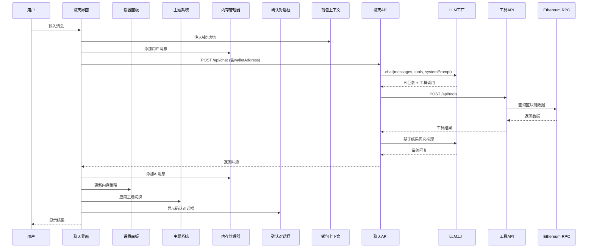
```mermaid
sequenceDiagram
participant User as 用户
participant UI as 聊天界面
participant Settings as 设置面板
participant Theme as 主题系统
participant Memory as 内存管理器
participant Dialog as 确认对话框
participant Wallet as 钱包上下文
participant ChatAPI as 聊天API
participant LLM as LLM工厂
participant ToolsAPI as 工具API
participant RPC as Ethereum RPC
User->>UI : 输入消息
UI->>Wallet : 注入钱包地址
UI->>Memory : 添加用户消息
UI->>ChatAPI : POST /api/chat (含walletAddress)
ChatAPI->>LLM : chat(messages, tools, systemPrompt)
LLM-->>ChatAPI : AI回复 + 工具调用
ChatAPI->>ToolsAPI : POST /api/tools
ToolsAPI->>RPC : 查询区块链数据
RPC-->>ToolsAPI : 返回数据
ToolsAPI-->>ChatAPI : 工具结果
ChatAPI->>LLM : 基于结果再次推理
LLM-->>ChatAPI : 最终回复
ChatAPI-->>UI : 返回响应
UI->>Memory : 添加AI消息
UI->>Settings : 更新内存策略
UI->>Theme : 应用主题切换
UI->>Dialog : 显示确认对话框
UI-->>User : 显示结果
```

**图表来源**
- [apps/web/app/page.tsx:190-282](file://apps/web/app/page.tsx#L190-L282)
- [apps/web/app/api/chat/route.ts:150-319](file://apps/web/app/api/chat/route.ts#L150-L319)

## 详细组件分析

### 聊天输入组件

聊天输入组件提供了用户友好的消息输入界面，支持键盘快捷键和加载状态控制：

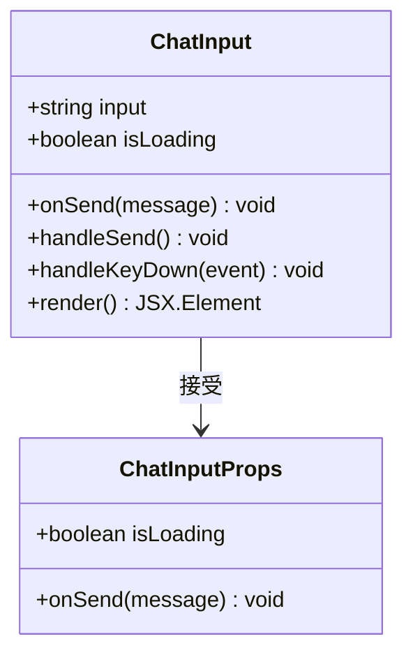
```mermaid
classDiagram
class ChatInput {
+string input
+boolean isLoading
+onSend(message) void
+handleSend() void
+handleKeyDown(event) void
+render() JSX.Element
}
class ChatInputProps {
+onSend(message) void
+boolean isLoading
}
ChatInput --> ChatInputProps : 接受
```

**图表来源**
- [apps/web/components/ChatInput.tsx:1-74](file://apps/web/components/ChatInput.tsx#L1-L74)

### 消息列表组件

消息列表组件负责渲染所有聊天消息，并提供自动滚动功能：

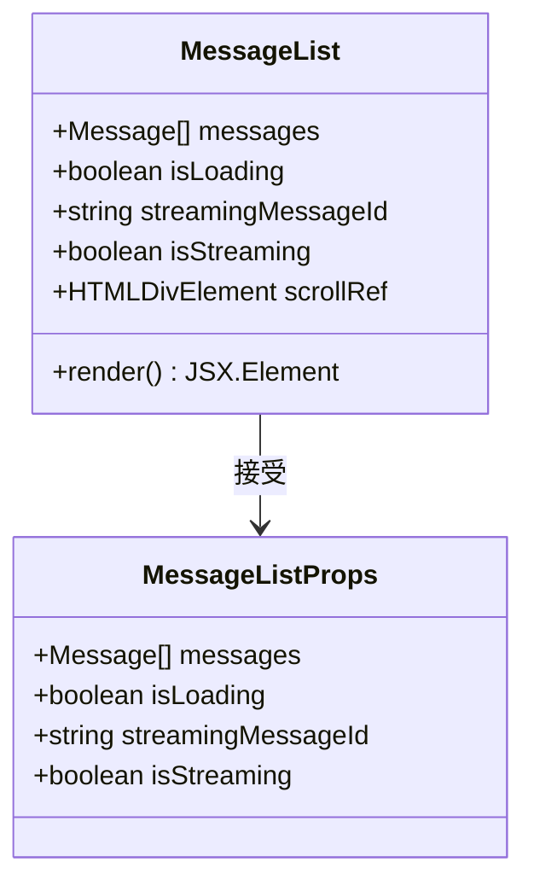
```mermaid
classDiagram
class MessageList {
+Message[] messages
+boolean isLoading
+string streamingMessageId
+boolean isStreaming
+HTMLDivElement scrollRef
+render() JSX.Element
}
class MessageListProps {
+Message[] messages
+boolean isLoading
+string streamingMessageId
+boolean isStreaming
}
MessageList --> MessageListProps : 接受
```

**图表来源**
- [apps/web/components/MessageList.tsx:1-44](file://apps/web/components/MessageList.tsx#L1-L44)

### 消息项组件

消息项组件根据消息类型和状态渲染不同的样式和内容，现已集成Markdown渲染功能：

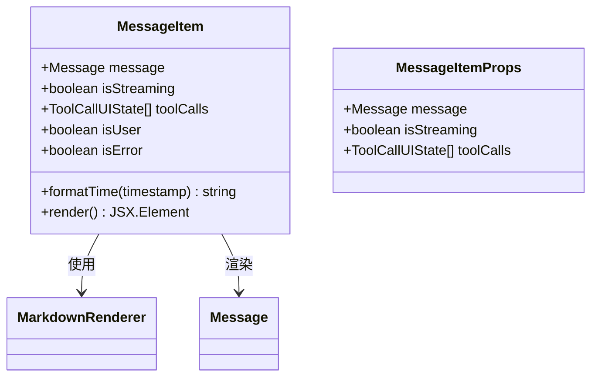
```mermaid
classDiagram
class MessageItem {
+Message message
+boolean isStreaming
+ToolCallUIState[] toolCalls
+boolean isUser
+boolean isError
+formatTime(timestamp) string
+render() JSX.Element
}
class MessageItemProps {
+Message message
+boolean isStreaming
+ToolCallUIState[] toolCalls
}
MessageItem --> MarkdownRenderer : 使用
MessageItem --> Message : 渲染
```

**图表来源**
- [apps/web/components/MessageItem.tsx:1-152](file://apps/web/components/MessageItem.tsx#L1-L152)
- [apps/web/types/chat.ts:1-29](file://apps/web/types/chat.ts#L1-L29)

### Markdown渲染器组件

**新增** Markdown渲染器组件提供了完整的Markdown语法支持，包括标题、列表、代码块、表格等：

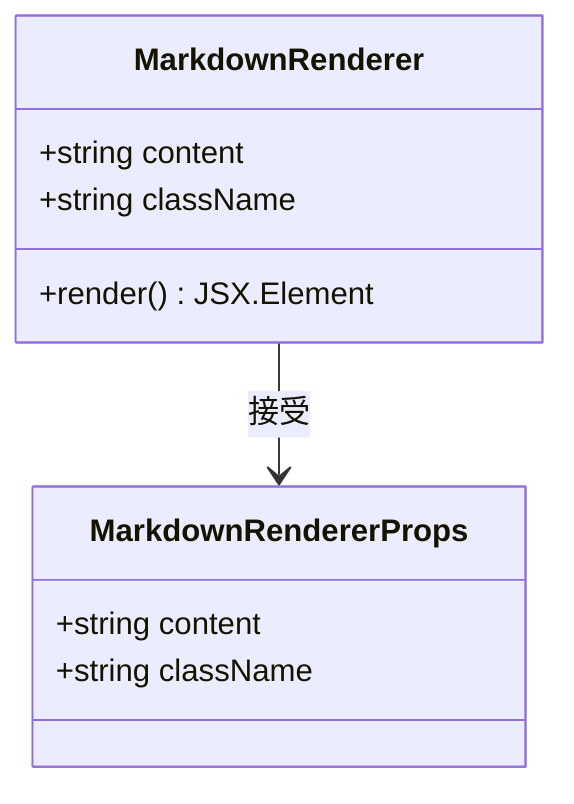
```mermaid
classDiagram
class MarkdownRenderer {
+string content
+string className
+render() JSX.Element
}
class MarkdownRendererProps {
+string content
+string className
}
MarkdownRenderer --> MarkdownRendererProps : 接受
```

**图表来源**
- [apps/web/components/MarkdownRenderer.tsx:1-119](file://apps/web/components/MarkdownRenderer.tsx#L1-L119)

### 设置面板组件

**新增** 设置面板组件提供了内存策略管理和用户偏好设置，现已集成主题切换功能：

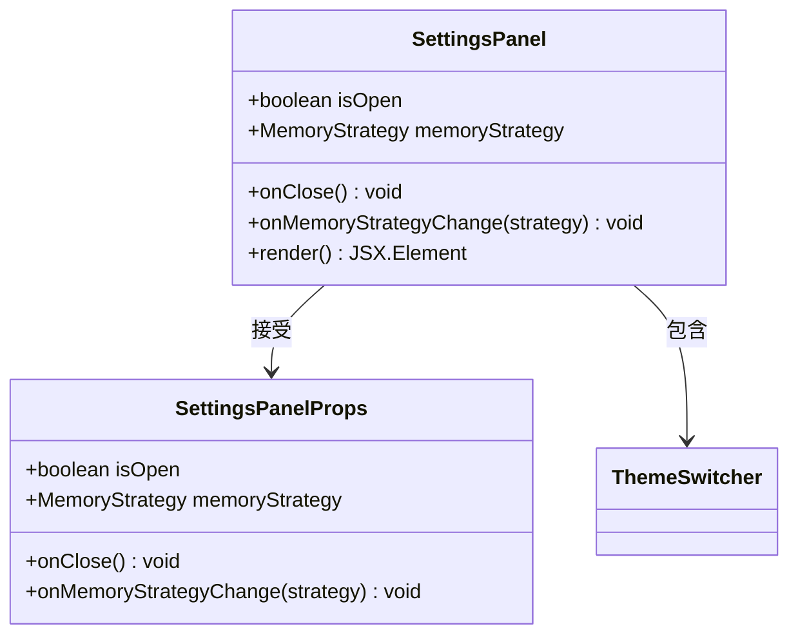
```mermaid
classDiagram
class SettingsPanel {
+boolean isOpen
+MemoryStrategy memoryStrategy
+onClose() void
+onMemoryStrategyChange(strategy) void
+render() JSX.Element
}
class SettingsPanelProps {
+boolean isOpen
+onClose() void
+MemoryStrategy memoryStrategy
+onMemoryStrategyChange(strategy) void
}
SettingsPanel --> SettingsPanelProps : 接受
SettingsPanel --> ThemeSwitcher : 包含
```

**图表来源**
- [apps/web/components/SettingsPanel.tsx:1-231](file://apps/web/components/SettingsPanel.tsx#L1-L231)

### 主题切换器组件

**新增** 主题切换器组件提供了直观的主题模式选择界面：

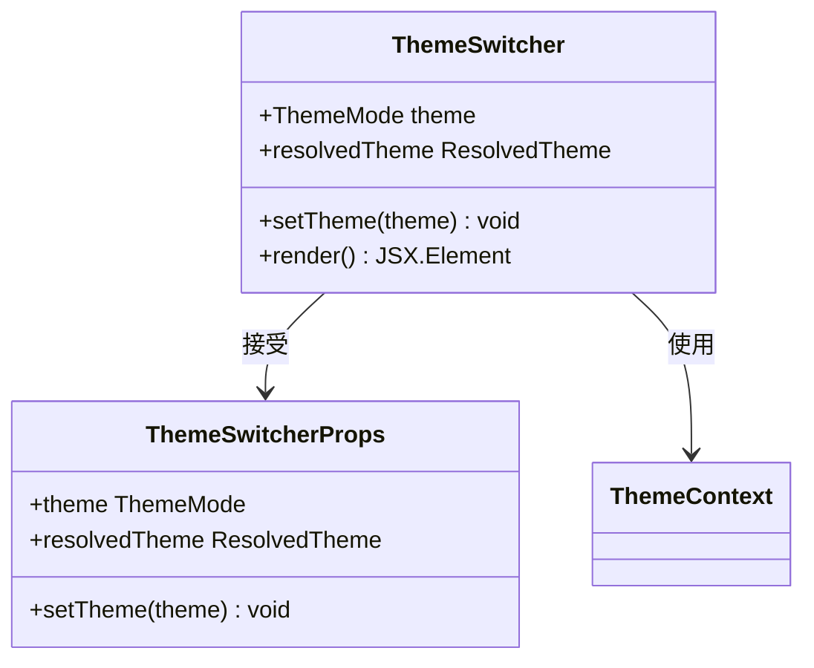
```mermaid
classDiagram
class ThemeSwitcher {
+ThemeMode theme
+setTheme(theme) void
+resolvedTheme ResolvedTheme
+render() JSX.Element
}
class ThemeSwitcherProps {
+theme ThemeMode
+setTheme(theme) void
+resolvedTheme ResolvedTheme
}
ThemeSwitcher --> ThemeSwitcherProps : 接受
ThemeSwitcher --> ThemeContext : 使用
```

**图表来源**
- [apps/web/components/ThemeSwitcher.tsx:1-42](file://apps/web/components/ThemeSwitcher.tsx#L1-L42)

### 确认对话框组件

**新增** 确认对话框组件提供了统一的用户确认交互体验：

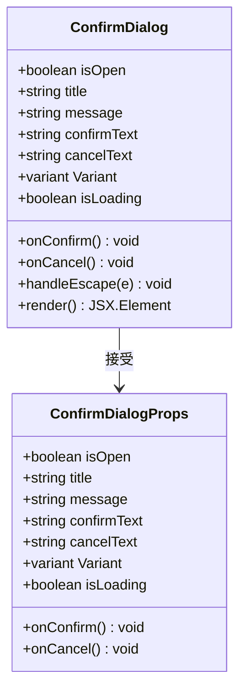
```mermaid
classDiagram
class ConfirmDialog {
+boolean isOpen
+string title
+string message
+string confirmText
+string cancelText
+variant Variant
+boolean isLoading
+onConfirm() void
+onCancel() void
+handleEscape(e) void
+render() JSX.Element
}
class ConfirmDialogProps {
+boolean isOpen
+string title
+string message
+string confirmText
+string cancelText
+variant Variant
+boolean isLoading
+onConfirm() void
+onCancel() void
}
ConfirmDialog --> ConfirmDialogProps : 接受
```

**图表来源**
- [apps/web/components/ConfirmDialog.tsx:1-101](file://apps/web/components/ConfirmDialog.tsx#L1-L101)

### 聊天API处理器

聊天API处理器实现了核心的AI推理逻辑，包括工具调用和结果处理：

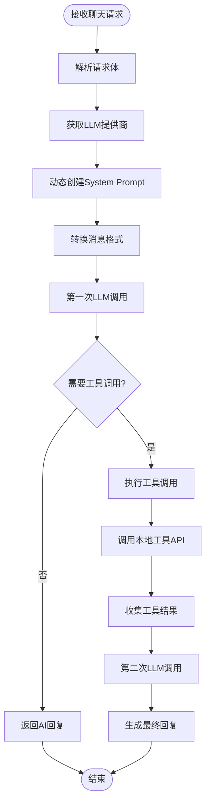
```mermaid
flowchart TD
Start([接收聊天请求]) --> ParseBody["解析请求体"]
ParseBody --> GetProvider["获取LLM提供商"]
GetProvider --> CreatePrompt["动态创建System Prompt"]
CreatePrompt --> ConvertMessages["转换消息格式"]
ConvertMessages --> FirstCall["第一次LLM调用"]
FirstCall --> NeedTools{"需要工具调用?"}
NeedTools --> |否| ReturnReply["返回AI回复"]
NeedTools --> |是| ExecuteTools["执行工具调用"]
ExecuteTools --> CallLocalTools["调用本地工具API"]
CallLocalTools --> CollectResults["收集工具结果"]
CollectResults --> SecondCall["第二次LLM调用"]
SecondCall --> FinalReply["生成最终回复"]
ReturnReply --> End([结束])
FinalReply --> End
```

**图表来源**
- [apps/web/app/api/chat/route.ts:150-319](file://apps/web/app/api/chat/route.ts#L150-L319)

**章节来源**
- [apps/web/components/ChatInput.tsx:1-74](file://apps/web/components/ChatInput.tsx#L1-L74)
- [apps/web/components/MessageList.tsx:1-44](file://apps/web/components/MessageList.tsx#L1-L44)
- [apps/web/components/MessageItem.tsx:1-152](file://apps/web/components/MessageItem.tsx#L1-L152)
- [apps/web/components/MarkdownRenderer.tsx:1-119](file://apps/web/components/MarkdownRenderer.tsx#L1-L119)
- [apps/web/components/SettingsPanel.tsx:1-231](file://apps/web/components/SettingsPanel.tsx#L1-L231)
- [apps/web/components/ThemeSwitcher.tsx:1-42](file://apps/web/components/ThemeSwitcher.tsx#L1-L42)
- [apps/web/components/ConfirmDialog.tsx:1-101](file://apps/web/components/ConfirmDialog.tsx#L1-L101)
- [apps/web/app/api/chat/route.ts:1-424](file://apps/web/app/api/chat/route.ts#L1-L424)

## 主题系统

### 主题提供者架构

应用程序实现了完整的主题系统，支持多种主题模式的动态切换：

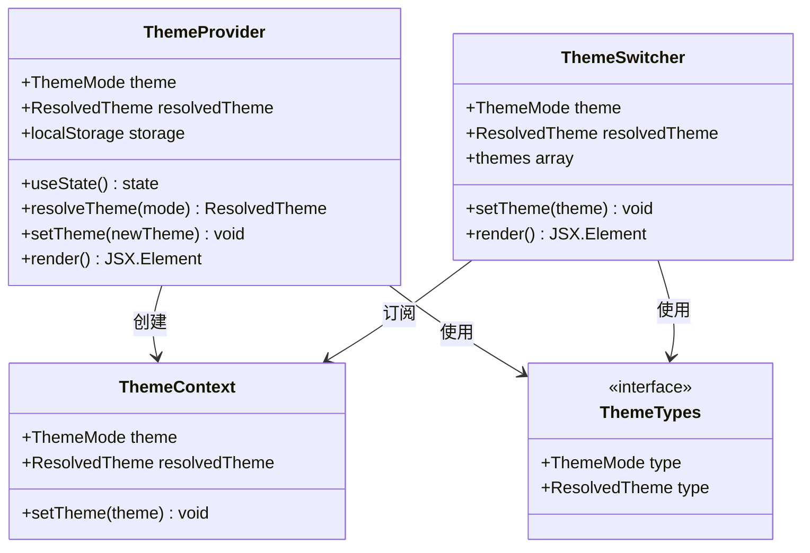
```mermaid
classDiagram
class ThemeProvider {
+ThemeMode theme
+ResolvedTheme resolvedTheme
+useState() state
+localStorage storage
+resolveTheme(mode) ResolvedTheme
+setTheme(newTheme) void
+render() JSX.Element
}
class ThemeContext {
+ThemeMode theme
+setTheme(theme) void
+ResolvedTheme resolvedTheme
}
class ThemeSwitcher {
+ThemeMode theme
+setTheme(theme) void
+ResolvedTheme resolvedTheme
+themes array
+render() JSX.Element
}
class ThemeTypes {
<<interface>>
+ThemeMode type
+ResolvedTheme type
}
ThemeProvider --> ThemeContext : 创建
ThemeProvider --> ThemeTypes : 使用
ThemeSwitcher --> ThemeContext : 订阅
ThemeSwitcher --> ThemeTypes : 使用
```

**图表来源**
- [apps/web/lib/theme/ThemeProvider.tsx:1-83](file://apps/web/lib/theme/ThemeProvider.tsx#L1-L83)
- [apps/web/lib/theme/ThemeContext.tsx:1-21](file://apps/web/lib/theme/ThemeContext.tsx#L1-L21)
- [apps/web/lib/theme/types.ts:1-10](file://apps/web/lib/theme/types.ts#L1-L10)
- [apps/web/components/ThemeSwitcher.tsx:1-42](file://apps/web/components/ThemeSwitcher.tsx#L1-L42)

### 主题模式支持

应用程序支持三种主题模式，每种模式都有其特定的使用场景：

| 模式类型 | 描述 | 特点 | 适用场景 |
|---------|------|------|----------|
| light | 浅色主题 | 明亮的界面，适合白天使用 | 日常办公、明亮环境 |
| dark | 深色主题 | 深色背景，减少眼部疲劳 | 夜晚使用、长时间工作 |
| system | 跟随系统 | 自动检测系统主题设置 | 多设备同步、用户偏好 |

### 主题持久化存储

主题设置通过 localStorage 实现持久化存储，确保用户偏好的一致性：

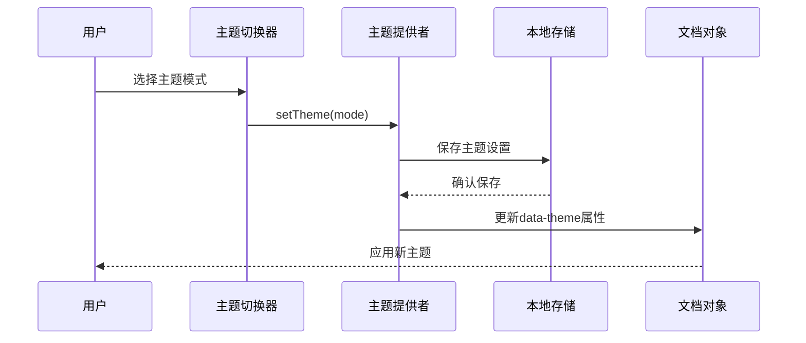
```mermaid
sequenceDiagram
participant User as 用户
participant ThemeSwitcher as 主题切换器
participant ThemeProvider as 主题提供者
participant LocalStorage as 本地存储
participant DOM as 文档对象
User->>ThemeSwitcher : 选择主题模式
ThemeSwitcher->>ThemeProvider : setTheme(mode)
ThemeProvider->>LocalStorage : 保存主题设置
LocalStorage-->>ThemeProvider : 确认保存
ThemeProvider->>DOM : 更新data-theme属性
DOM-->>User : 应用新主题
```

**图表来源**
- [apps/web/lib/theme/ThemeProvider.tsx:17-22](file://apps/web/lib/theme/ThemeProvider.tsx#L17-L22)
- [apps/web/lib/theme/ThemeProvider.tsx:47-56](file://apps/web/lib/theme/ThemeProvider.tsx#L47-L56)

**章节来源**
- [apps/web/lib/theme/ThemeProvider.tsx:1-83](file://apps/web/lib/theme/ThemeProvider.tsx#L1-L83)
- [apps/web/lib/theme/ThemeContext.tsx:1-21](file://apps/web/lib/theme/ThemeContext.tsx#L1-L21)
- [apps/web/lib/theme/types.ts:1-10](file://apps/web/lib/theme/types.ts#L1-L10)
- [apps/web/components/ThemeSwitcher.tsx:1-42](file://apps/web/components/ThemeSwitcher.tsx#L1-L42)

## 确认对话框组件

### 组件架构设计

确认对话框组件提供了统一的用户确认交互界面，支持多种变体和状态：

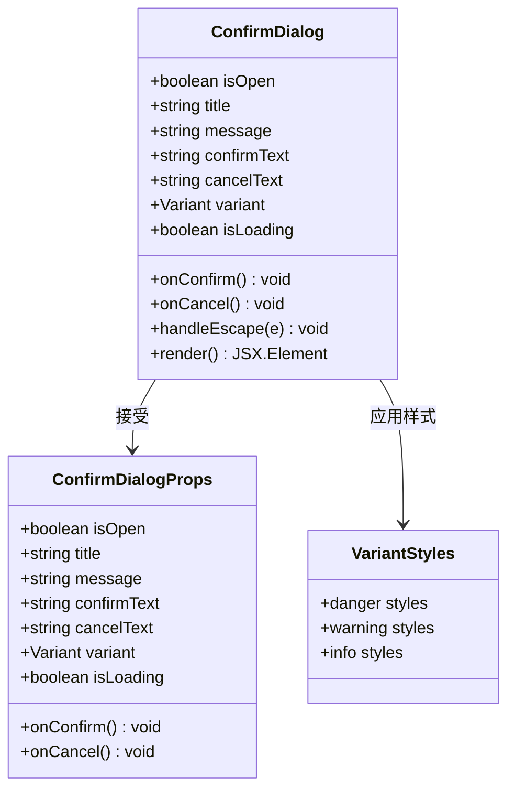
```mermaid
classDiagram
class ConfirmDialog {
+boolean isOpen
+string title
+string message
+string confirmText
+string cancelText
+Variant variant
+boolean isLoading
+onConfirm() void
+onCancel() void
+handleEscape(e) void
+render() JSX.Element
}
class ConfirmDialogProps {
+boolean isOpen
+string title
+string message
+string confirmText
+string cancelText
+Variant variant
+boolean isLoading
+onConfirm() void
+onCancel() void
}
class VariantStyles {
+danger styles
+warning styles
+info styles
}
ConfirmDialog --> ConfirmDialogProps : 接受
ConfirmDialog --> VariantStyles : 应用样式
```

**图表来源**
- [apps/web/components/ConfirmDialog.tsx:1-101](file://apps/web/components/ConfirmDialog.tsx#L1-L101)

### 对话框变体系统

组件支持三种预设的对话框变体，每种变体都有特定的视觉风格和用途：

| 变体类型 | 颜色方案 | 用途 | 触发条件 |
|---------|----------|------|----------|
| danger | 红色系 | 危险操作确认（删除、清除） | 数据删除、账户注销 |
| warning | 黄色系 | 警告性操作确认 | 设置更改、重要提醒 |
| info | 紫色系 | 信息提示和确认 | 功能说明、更新提示 |

### 交互行为设计

确认对话框实现了完整的用户交互体验，包括键盘导航和状态反馈：

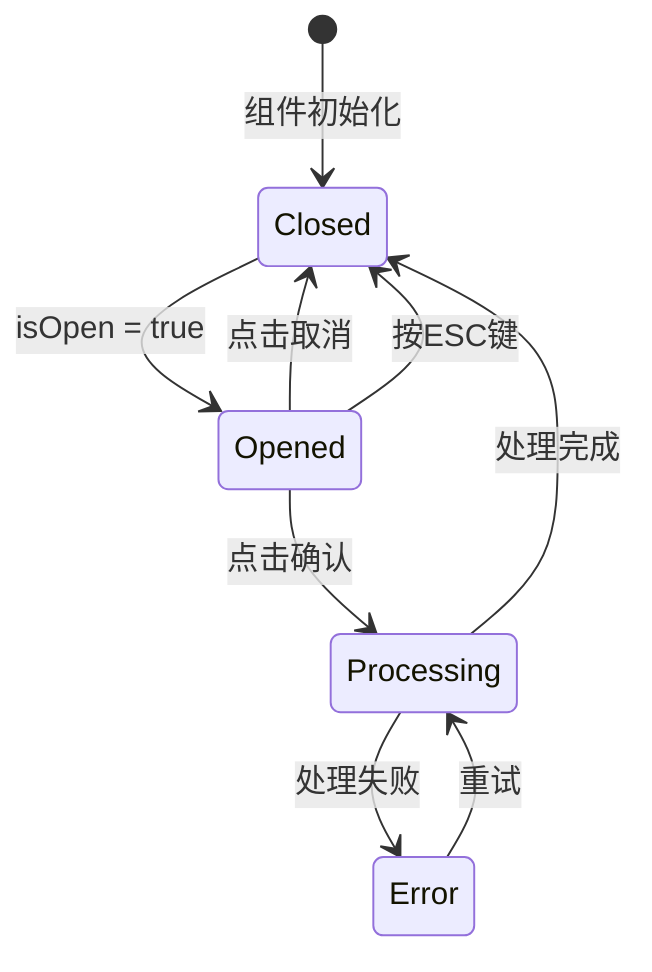
```mermaid
stateDiagram-v2
[*] --> Closed : 组件初始化
Closed --> Opened : isOpen = true
Opened --> Processing : 点击确认
Processing --> Closed : 处理完成
Opened --> Closed : 点击取消
Opened --> Closed : 按ESC键
Processing --> Error : 处理失败
Error --> Processing : 重试
```

**图表来源**
- [apps/web/components/ConfirmDialog.tsx:28-40](file://apps/web/components/ConfirmDialog.tsx#L28-L40)
- [apps/web/components/ConfirmDialog.tsx:75-96](file://apps/web/components/ConfirmDialog.tsx#L75-L96)

**章节来源**
- [apps/web/components/ConfirmDialog.tsx:1-101](file://apps/web/components/ConfirmDialog.tsx#L1-L101)

## 钱包上下文注入

### 上下文注入流程

应用程序实现了钱包上下文注入功能，使AI能够感知当前用户的钱包地址：

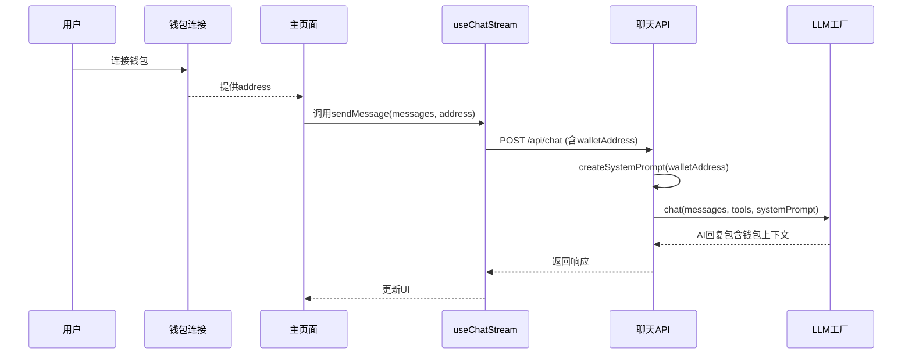
```mermaid
sequenceDiagram
participant User as 用户
participant Wallet as 钱包连接
participant Page as 主页面
participant Hook as useChatStream
participant API as 聊天API
participant LLM as LLM工厂
User->>Wallet : 连接钱包
Wallet-->>Page : 提供address
Page->>Hook : 调用sendMessage(messages, address)
Hook->>API : POST /api/chat (含walletAddress)
API->>API : createSystemPrompt(walletAddress)
API->>LLM : chat(messages, tools, systemPrompt)
LLM-->>API : AI回复包含钱包上下文
API-->>Hook : 返回响应
Hook-->>Page : 更新UI
```

**图表来源**
- [apps/web/app/page.tsx:65-74](file://apps/web/app/page.tsx#L65-L74)
- [apps/web/hooks/useChatStream.ts:167-200](file://apps/web/hooks/useChatStream.ts#L167-L200)
- [apps/web/app/api/chat/route.ts:135-159](file://apps/web/app/api/chat/route.ts#L135-L159)

### 系统Prompt动态生成

API层实现了动态系统Prompt生成，根据是否存在钱包地址调整AI的行为：

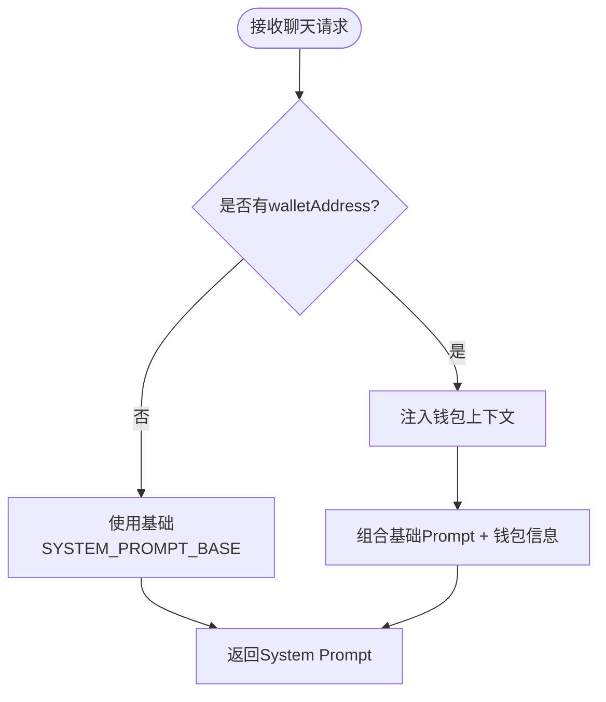
```mermaid
flowchart TD
Start([接收聊天请求]) --> CheckWallet{"是否有walletAddress?"}
CheckWallet --> |否| BasePrompt["使用基础SYSTEM_PROMPT_BASE"]
CheckWallet --> |是| InjectContext["注入钱包上下文"]
InjectContext --> CombinePrompt["组合基础Prompt + 钱包信息"]
BasePrompt --> ReturnPrompt["返回System Prompt"]
CombinePrompt --> ReturnPrompt
```

**图表来源**
- [apps/web/app/api/chat/route.ts:135-148](file://apps/web/app/api/chat/route.ts#L135-L148)

### 连接状态管理

应用程序改进了连接状态管理，断开连接时清空UI但保留云端数据：

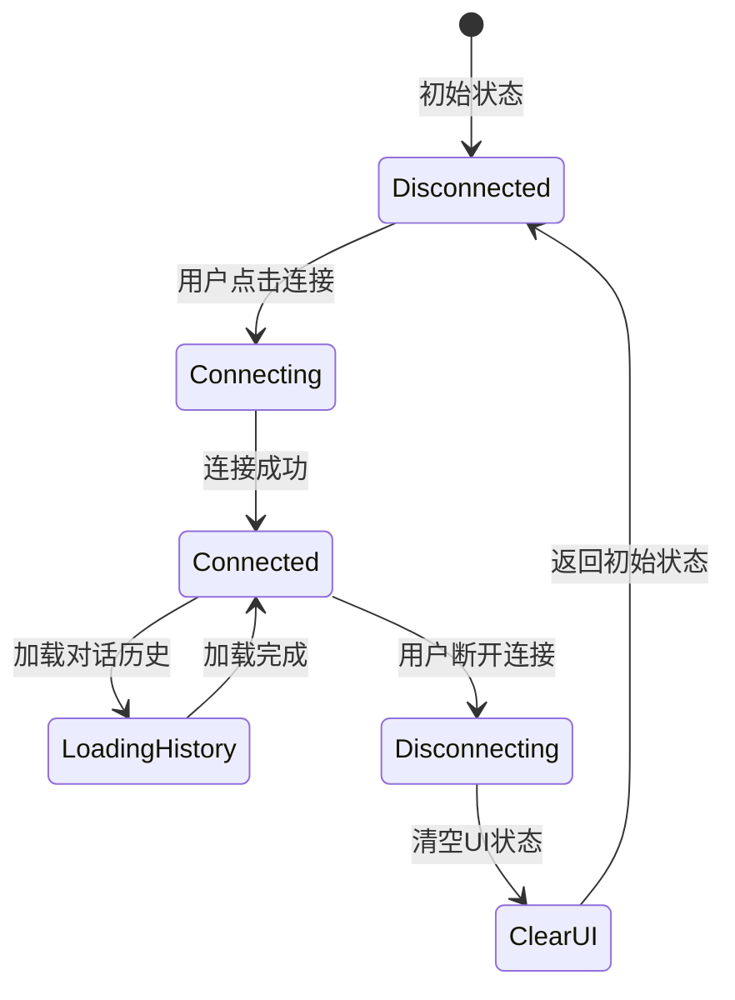
```mermaid
stateDiagram-v2
[*] --> Disconnected : 初始状态
Disconnected --> Connecting : 用户点击连接
Connecting --> Connected : 连接成功
Connected --> LoadingHistory : 加载对话历史
LoadingHistory --> Connected : 加载完成
Connected --> Disconnecting : 用户断开连接
Disconnecting --> ClearUI : 清空UI状态
ClearUI --> Disconnected : 返回初始状态
```

**图表来源**
- [apps/web/app/page.tsx:64-84](file://apps/web/app/page.tsx#L64-L84)

**章节来源**
- [apps/web/app/page.tsx:65-74](file://apps/web/app/page.tsx#L65-L74)
- [apps/web/hooks/useChatStream.ts:167-200](file://apps/web/hooks/useChatStream.ts#L167-L200)
- [apps/web/app/api/chat/route.ts:135-159](file://apps/web/app/api/chat/route.ts#L135-L159)
- [apps/web/lib/supabase/client.ts:34-53](file://apps/web/lib/supabase/client.ts#L34-L53)

## 内存管理策略

### 内存管理器架构

应用程序实现了两种内存管理策略，支持动态切换：

```mermaid
classDiagram
class MemoryManager {
<<interface>>
+addMessage(message) void
+getMessages() Message[]
+shouldCompress() boolean
+compress() Promise~void~
+clear() void
}
class SummaryCompressionMemory {
+Message[] originalMessages
+string summary
+MemoryConfig config
+isCompressing boolean
+addMessage(message) void
+getMessages() Message[]
+shouldCompress() boolean
+compress() Promise~void~
+generateSummary(messages) Promise~string~
+clear() void
}
class SlidingWindowMemory {
+Message[] messages
+number windowSize
+addMessage(message) void
+getMessages() Message[]
+shouldCompress() boolean
+compress() Promise~void~
+clear() void
}
MemoryManager <|.. SummaryCompressionMemory
MemoryManager <|.. SlidingWindowMemory
```

**图表来源**
- [apps/web/lib/memory/types.ts:12-37](file://apps/web/lib/memory/types.ts#L12-L37)
- [apps/web/lib/memory/SummaryCompressionMemory.ts:5-110](file://apps/web/lib/memory/SummaryCompressionMemory.ts#L5-L110)
- [apps/web/lib/memory/SlidingWindowMemory.ts:11-56](file://apps/web/lib/memory/SlidingWindowMemory.ts#L11-L56)

### 内存配置管理

内存管理器支持可配置的参数，包括压缩阈值、保留消息数和摘要模型：

```mermaid
classDiagram
class MemoryConfig {
+number compressThreshold
+number keepRecentCount
+string summaryModel
}
class Config {
+defaultMemoryConfig MemoryConfig
+createMemoryConfig(overrides) MemoryConfig
}
Config --> MemoryConfig : 创建
```

**图表来源**
- [apps/web/lib/memory/config.ts:3-14](file://apps/web/lib/memory/config.ts#L3-L14)

### 内存策略对比

| 策略类型 | 描述 | 压缩阈值 | 保留消息数 | 额外API调用 | 上下文质量 | 性能开销 |
|---------|------|----------|------------|-------------|------------|----------|
| L3摘要压缩 | 当消息达到阈值时，使用AI生成摘要，保留最近消息 | 10条 | 5条 | 是 | 高 | 中等 |
| L2滑动窗口 | 只保留最近N条消息，超出自动丢弃 | 无 | N条 | 否 | 中 | 极低 |

**章节来源**
- [apps/web/lib/memory/SummaryCompressionMemory.ts:1-111](file://apps/web/lib/memory/SummaryCompressionMemory.ts#L1-L111)
- [apps/web/lib/memory/SlidingWindowMemory.ts:1-57](file://apps/web/lib/memory/SlidingWindowMemory.ts#L1-L57)
- [apps/web/lib/memory/config.ts:1-15](file://apps/web/lib/memory/config.ts#L1-L15)
- [apps/web/lib/memory/types.ts:1-38](file://apps/web/lib/memory/types.ts#L1-L38)

## UI设计与样式

### Web3企业风格设计

应用程序采用了现代化的Web3企业风格设计，具有以下特点：

- **科技蓝色调**：使用渐变的科技蓝色作为主色调，体现Web3技术特性
- **深色主题**：采用深色背景，减少视觉疲劳，适合长时间使用
- **毛玻璃效果**：大量使用backdrop-blur和透明度效果
- **微妙动画**：包含发光脉冲、滑入动画等微交互效果
- **响应式设计**：适配各种屏幕尺寸和设备

### 样式系统架构

```mermaid
graph TB
subgraph "样式层次"
Globals[globals.css]
Tailwind[tailwind.config.ts]
Components[组件样式]
Animations[动画效果]
Effects[视觉效果]
Theme[主题系统]
</subgraph>
subgraph "颜色系统"
Primary[primary: 科技蓝]
Web3[web3: 区块链品牌色]
Dark[dark: 深色主题]
Light[light: 浅色主题]
System[system: 系统主题]
</subgraph>
subgraph "动画系统"
Glow[glow-pulse]
SlideIn[slide-in]
Cursor[pulse-cursor]
Selection[selection]
</subgraph>
Globals --> Tailwind
Tailwind --> Components
Tailwind --> Animations
Tailwind --> Effects
Tailwind --> Theme
Components --> Primary
Components --> Web3
Components --> Dark
Components --> Light
Components --> System
Animations --> Glow
Animations --> SlideIn
Effects --> Cursor
Effects --> Selection
```

**图表来源**
- [apps/web/app/globals.css:1-118](file://apps/web/app/globals.css#L1-L118)
- [apps/web/tailwind.config.ts:1-54](file://apps/web/tailwind.config.ts#L1-L54)

### 主题系统集成

主题系统与现有UI组件完美集成，实现了响应式的主题切换：

```mermaid
sequenceDiagram
participant User as 用户
participant ThemeSwitcher as 主题切换器
participant ThemeProvider as 主题提供者
participant RainbowKit as 钱包组件库
participant UI as 用户界面
User->>ThemeSwitcher : 选择主题模式
ThemeSwitcher->>ThemeProvider : setTheme(mode)
ThemeProvider->>ThemeProvider : 解析主题模式
ThemeProvider->>RainbowKit : 更新钱包组件主题
RainbowKit-->>UI : 应用新主题样式
UI-->>User : 显示更新后的界面
```

**图表来源**
- [apps/web/app/providers.tsx:45-68](file://apps/web/app/providers.tsx#L45-L68)
- [apps/web/lib/theme/ThemeProvider.tsx:47-56](file://apps/web/lib/theme/ThemeProvider.tsx#L47-L56)

### Markdown渲染样式

Markdown渲染器提供了完整的语法支持和美观的样式：

- **标题层级**：h1-h3使用不同的字体大小和颜色
- **列表样式**：支持有序和无序列表，带项目符号
- **代码块**：支持内联代码和代码块，带语法高亮
- **表格**：响应式表格，支持滚动
- **链接**：悬停效果和下划线动画
- **引用**：左侧边框和斜体样式

**章节来源**
- [apps/web/app/globals.css:1-118](file://apps/web/app/globals.css#L1-L118)
- [apps/web/tailwind.config.ts:1-54](file://apps/web/tailwind.config.ts#L1-L54)
- [apps/web/components/MarkdownRenderer.tsx:1-119](file://apps/web/components/MarkdownRenderer.tsx#L1-L119)
- [apps/web/components/ThemeSwitcher.tsx:1-42](file://apps/web/components/ThemeSwitcher.tsx#L1-L42)

## 依赖关系分析

### 技术栈依赖

应用程序使用了现代前端技术栈，具有清晰的依赖层次结构：

```mermaid
graph TB
subgraph "运行时依赖"
Next[Next.js 14.2.0]
React[React ^18.2.0]
Ethers[Ethers ^6.11.0]
AI[AI SDK ^3.0.0]
Markdown[react-markdown ^9.0.0]
Remark[remark-gfm ^4.0.0]
RainbowKit[RainbowKit ^1.3.0]
TanStackQuery[@tanstack/react-query ^5.0.0]
Wagmi[wagmi ^1.4.0]
</subgraph>
subgraph "工作区包"
AIConfig[@web3-ai-agent/ai-config]
Web3Tools[@web3-ai-agent/web3-tools]
</subgraph>
subgraph "开发依赖"
TypeScript[TypeScript ^5]
Tailwind[Tailwind CSS ^3.4.1]
PostCSS[PostCSS ^8.4.35]
ESLint[ESLint ^8]
</subgraph>
Next --> React
Next --> AI
Next --> Ethers
Next --> AIConfig
Next --> Web3Tools
Next --> Markdown
Next --> Remark
Next --> RainbowKit
Next --> TanStackQuery
Next --> Wagmi
```

**图表来源**
- [apps/web/package.json:12-32](file://apps/web/package.json#L12-L32)

### Monorepo 管理

项目使用 Turborepo 进行多包管理，实现了高效的构建和开发流程：

```mermaid
graph LR
subgraph "Turborepo配置"
Build[build任务]
Dev[dev任务]
Lint[lint任务]
TypeCheck[type-check任务]
</subgraph>
subgraph "工作空间"
Apps[apps/*]
Packages[packages/*]
</subgraph>
Build --> Dev
Dev --> Lint
Lint --> TypeCheck
Apps --> Build
Packages --> Build
```

**图表来源**
- [turbo.json:1-21](file://turbo.json#L1-L21)
- [pnpm-workspace.yaml:1-4](file://pnpm-workspace.yaml#L1-L4)

**章节来源**
- [apps/web/package.json:12-32](file://apps/web/package.json#L12-L32)
- [turbo.json:1-21](file://turbo.json#L1-L21)
- [pnpm-workspace.yaml:1-4](file://pnpm-workspace.yaml#L1-L4)

## 性能考虑

### 缓存策略

应用实现了多层次的缓存机制来优化性能：

1. **API 缓存**: 使用 Next.js 的 revalidate 机制缓存外部 API 响应
2. **区块链数据缓存**: 通过 RPC 提供商的内置缓存减少网络请求
3. **组件渲染优化**: 使用 React 的 memoization 和状态管理避免不必要的重渲染
4. **内存管理优化**: 支持两种内存策略，平衡性能和上下文质量
5. **主题持久化**: 使用 localStorage 减少主题切换的计算开销
6. **钱包上下文缓存**: 使用内存变量存储当前钱包地址，避免重复验证

### 网络优化

- **并发工具调用**: 支持同时执行多个工具调用以提高响应速度
- **流式输出**: 使用SSE实现流式响应，提供更好的用户体验
- **错误恢复**: 实现了健壮的错误处理和重试机制
- **资源压缩**: 使用 Tailwind CSS 和 PostCSS 优化样式文件大小
- **连接持久化**: 通过cookie实现跨页面刷新的连接持久化

### 移动端适配

应用采用了响应式设计，确保在各种设备上都有良好的用户体验：

- **自适应布局**: 使用 Flexbox 和 Grid 实现灵活的布局
- **触摸友好**: 优化了触摸交互元素的尺寸和间距
- **性能优化**: 在移动设备上限制动画效果以节省资源
- **内存策略**: 支持轻量级的滑动窗口策略，适合移动设备

## 故障排除指南

### 常见问题及解决方案

#### 1. LLM 配置错误

**症状**: API 返回配置错误信息
**原因**: 缺少必要的环境变量或 API 密钥配置
**解决方案**:
- 检查 `.env` 文件中的 LLM 配置
- 确认 API 密钥的有效性
- 验证网络连接和代理设置

#### 2. 区块链 RPC 连接失败

**症状**: 钱包余额查询或 Gas 价格获取失败
**原因**: RPC 服务不可用或网络问题
**解决方案**:
- 切换到备用 RPC 提供商
- 检查防火墙和网络设置
- 验证 RPC URL 的正确性

#### 3. 工具调用超时

**症状**: 工具执行时间过长或无响应
**原因**: 外部 API 响应慢或网络延迟
**解决方案**:
- 实现超时机制和重试逻辑
- 使用负载均衡的 RPC 提供商
- 优化工具调用的并发数量

#### 4. 内存管理问题

**症状**: 内存使用过高或上下文丢失
**原因**: 内存策略配置不当
**解决方案**:
- 切换到滑动窗口策略以减少内存使用
- 调整压缩阈值和保留消息数
- 监控内存使用情况并定期清理

#### 5. 主题系统问题

**症状**: 主题切换无效或显示异常
**原因**: localStorage 权限问题或主题提供者配置错误
**解决方案**:
- 检查浏览器的 localStorage 权限
- 验证 ThemeProvider 的正确嵌套
- 确认主题模式的兼容性

#### 6. 确认对话框问题

**症状**: 对话框无法关闭或点击无效
**原因**: 事件处理冲突或状态管理问题
**解决方案**:
- 检查对话框的 isOpen 状态
- 验证事件监听器的正确绑定
- 确认阻止事件冒泡的实现

#### 7. 钱包上下文问题

**症状**: AI无法识别用户钱包地址或余额查询失败
**原因**: 钱包地址格式验证失败或上下文未正确注入
**解决方案**:
- 检查钱包连接状态和地址格式
- 验证 setWalletContext 的调用时机
- 确认 sendMessage 是否正确传递 walletAddress

**章节来源**
- [apps/web/app/api/chat/route.ts:360-404](file://apps/web/app/api/chat/route.ts#L360-L404)
- [apps/web/app/api/tools/route.ts:124-133](file://apps/web/app/api/tools/route.ts#L124-L133)
- [apps/web/lib/memory/SummaryCompressionMemory.ts:48-74](file://apps/web/lib/memory/SummaryCompressionMemory.ts#L48-L74)
- [apps/web/lib/theme/ThemeProvider.tsx:17-22](file://apps/web/lib/theme/ThemeProvider.tsx#L17-L22)
- [apps/web/components/ConfirmDialog.tsx:28-40](file://apps/web/components/ConfirmDialog.tsx#L28-L40)
- [apps/web/lib/supabase/client.ts:34-53](file://apps/web/lib/supabase/client.ts#L34-L53)

## 结论

这个 Web3 AI Agent 应用程序展示了现代 Web3 应用开发的最佳实践，成功地将 AI 智能推理与区块链数据查询相结合。项目具有以下特点：

### 技术优势
- **模块化架构**: 清晰的组件分离和职责划分
- **类型安全**: 完整的 TypeScript 类型定义
- **性能优化**: 多层次的缓存和优化策略
- **可扩展性**: 基于 Monorepo 的包管理架构
- **内存管理**: 支持两种策略的智能内存管理
- **UI设计**: 采用Web3企业风格的现代化界面
- **主题系统**: 完整的多主题支持和响应式切换
- **交互体验**: 统一的确认对话框组件
- **钱包集成**: 完整的钱包上下文注入功能

### 功能特色
- **智能工具调用**: AI 模型能够自动选择和执行合适的工具
- **实时数据**: 支持实时的区块链数据查询
- **Markdown渲染**: 完整的Markdown语法支持
- **内存策略管理**: 用户可自定义的内存管理策略
- **流式输出**: SSE流式响应提供更好的用户体验
- **响应式设计**: 适配各种设备和屏幕尺寸
- **主题定制**: 支持浅色、深色和跟随系统的主题切换
- **确认交互**: 统一的确认对话框提供更好的用户体验
- **钱包感知**: AI能够感知用户钱包地址，简化余额查询流程
- **连接管理**: 断开连接时优雅清空UI但保留云端数据

### 发展前景
该应用程序为 Web3 开发者提供了一个强大的信息查询平台，未来可以扩展更多 Web3 工具和服务，进一步提升用户体验和功能性。通过持续的优化和功能扩展，这个项目有望成为 Web3 生态系统中的重要工具。

**更新** 本次更新重点集成了完整的主题系统，包括主题提供者、主题切换器和响应式主题切换；新增了确认对话框组件，提供了统一的用户确认交互体验；完善了UI组件体系，显著提升了用户交互体验和界面的专业度；实现了钱包上下文注入功能，使AI能够感知用户钱包地址，简化了余额查询等操作。