# Web应用程序

<cite>
**本文档引用的文件**
- [apps/web/app/layout.tsx](file://apps/web/app/layout.tsx)
- [apps/web/app/page.tsx](file://apps/web/app/page.tsx)
- [apps/web/app/api/chat/route.ts](file://apps/web/app/api/chat/route.ts)
- [apps/web/app/api/tools/route.ts](file://apps/web/app/api/tools/route.ts)
- [apps/web/components/ChatInput.tsx](file://apps/web/components/ChatInput.tsx)
- [apps/web/components/MessageList.tsx](file://apps/web/components/MessageList.tsx)
- [apps/web/components/MessageItem.tsx](file://apps/web/components/MessageItem.tsx)
- [apps/web/components/MarkdownRenderer.tsx](file://apps/web/components/MarkdownRenderer.tsx)
- [apps/web/components/SettingsPanel.tsx](file://apps/web/components/SettingsPanel.tsx)
- [apps/web/hooks/useChatStream.ts](file://apps/web/hooks/useChatStream.ts)
- [apps/web/lib/memory/SummaryCompressionMemory.ts](file://apps/web/lib/memory/SummaryCompressionMemory.ts)
- [apps/web/lib/memory/SlidingWindowMemory.ts](file://apps/web/lib/memory/SlidingWindowMemory.ts)
- [apps/web/lib/memory/config.ts](file://apps/web/lib/memory/config.ts)
- [apps/web/lib/memory/types.ts](file://apps/web/lib/memory/types.ts)
- [apps/web/lib/memory/index.ts](file://apps/web/lib/memory/index.ts)
- [apps/web/types/chat.ts](file://apps/web/types/chat.ts)
- [apps/web/app/globals.css](file://apps/web/app/globals.css)
- [apps/web/tailwind.config.ts](file://apps/web/tailwind.config.ts)
- [apps/web/package.json](file://apps/web/package.json)
- [apps/web/next.config.js](file://apps/web/next.config.js)
- [apps/web/postcss.config.js](file://apps/web/postcss.config.js)
- [package.json](file://package.json)
- [turbo.json](file://turbo.json)
- [pnpm-workspace.yaml](file://pnpm-workspace.yaml)
</cite>

## 更新摘要
**变更内容**
- 新增Markdown渲染功能，提供完整的Markdown语法支持
- 新增设置面板组件，支持内存策略管理
- UI美化改进，采用Web3企业风格设计
- 增强内存管理系统，支持L3摘要压缩和L2滑动窗口策略
- 流式输出光标动画和工具调用卡片动画

## 目录
1. [简介](#简介)
2. [项目结构](#项目结构)
3. [核心组件](#核心组件)
4. [架构概览](#架构概览)
5. [详细组件分析](#详细组件分析)
6. [内存管理策略](#内存管理策略)
7. [UI设计与样式](#ui设计与样式)
8. [依赖关系分析](#依赖关系分析)
9. [性能考虑](#性能考虑)
10. [故障排除指南](#故障排除指南)
11. [结论](#结论)

## 简介

这是一个基于 Next.js 的 Web3 AI Agent 应用程序，旨在为用户提供 Web3 相关的信息查询服务。该应用能够理解用户意图、调用 Web3 工具、并返回可信的结果。主要功能包括：

- 查询 ETH 实时价格
- 查询以太坊钱包余额
- 查询当前 Gas 价格
- 智能对话交互
- 工具调用和结果展示
- **新增**：完整的Markdown语法渲染支持
- **新增**：内存策略管理设置面板
- **新增**：Web3企业风格的现代化UI设计

应用采用现代化的技术栈，包括 Next.js 14、TypeScript、Tailwind CSS 和 Ethers.js，构建了一个响应式的 Web3 信息查询平台，具备企业级的设计风格和用户体验。

## 项目结构

该项目采用 Monorepo 结构，使用 Turborepo 进行管理，包含以下主要目录：

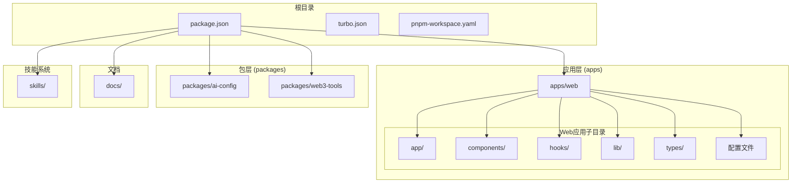

**图表来源**
- [package.json:1-28](file://package.json#L1-L28)
- [turbo.json:1-21](file://turbo.json#L1-L21)
- [pnpm-workspace.yaml:1-4](file://pnpm-workspace.yaml#L1-L4)

**章节来源**
- [package.json:1-28](file://package.json#L1-L28)
- [turbo.json:1-21](file://turbo.json#L1-L21)
- [pnpm-workspace.yaml:1-4](file://pnpm-workspace.yaml#L1-L4)

## 核心组件

### 应用布局组件

应用布局组件负责设置全局元数据和字体配置：

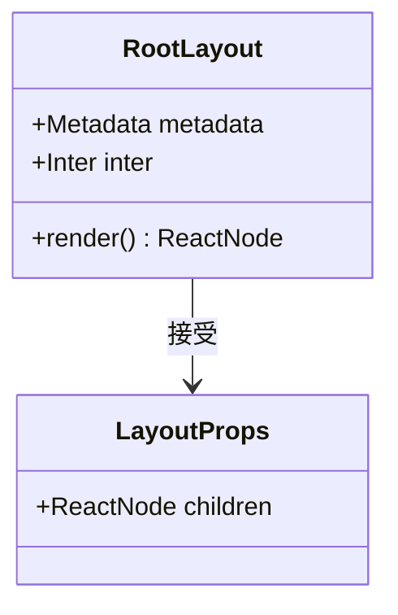

**图表来源**
- [apps/web/app/layout.tsx:1-23](file://apps/web/app/layout.tsx#L1-L23)

### 主页面组件

主页面组件实现了完整的聊天界面，包含消息列表、输入框、设置面板和状态管理：

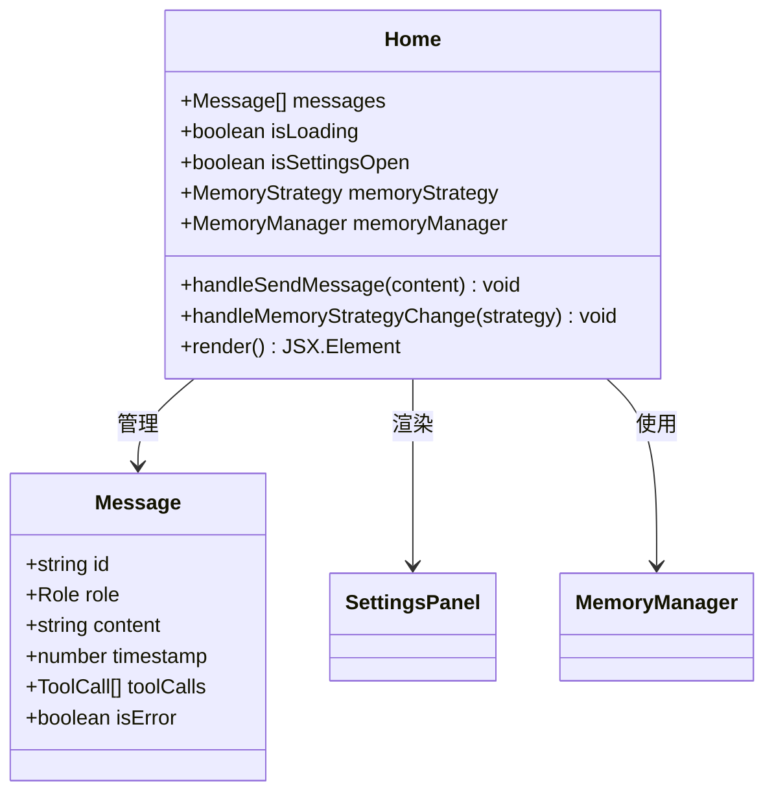

**图表来源**
- [apps/web/app/page.tsx:1-217](file://apps/web/app/page.tsx#L1-L217)
- [apps/web/types/chat.ts:1-28](file://apps/web/types/chat.ts#L1-L28)

**章节来源**
- [apps/web/app/layout.tsx:1-23](file://apps/web/app/layout.tsx#L1-L23)
- [apps/web/app/page.tsx:1-217](file://apps/web/app/page.tsx#L1-L217)
- [apps/web/types/chat.ts:1-28](file://apps/web/types/chat.ts#L1-L28)

## 架构概览

该应用程序采用客户端-服务器架构，结合了 AI 模型推理和 Web3 工具调用：

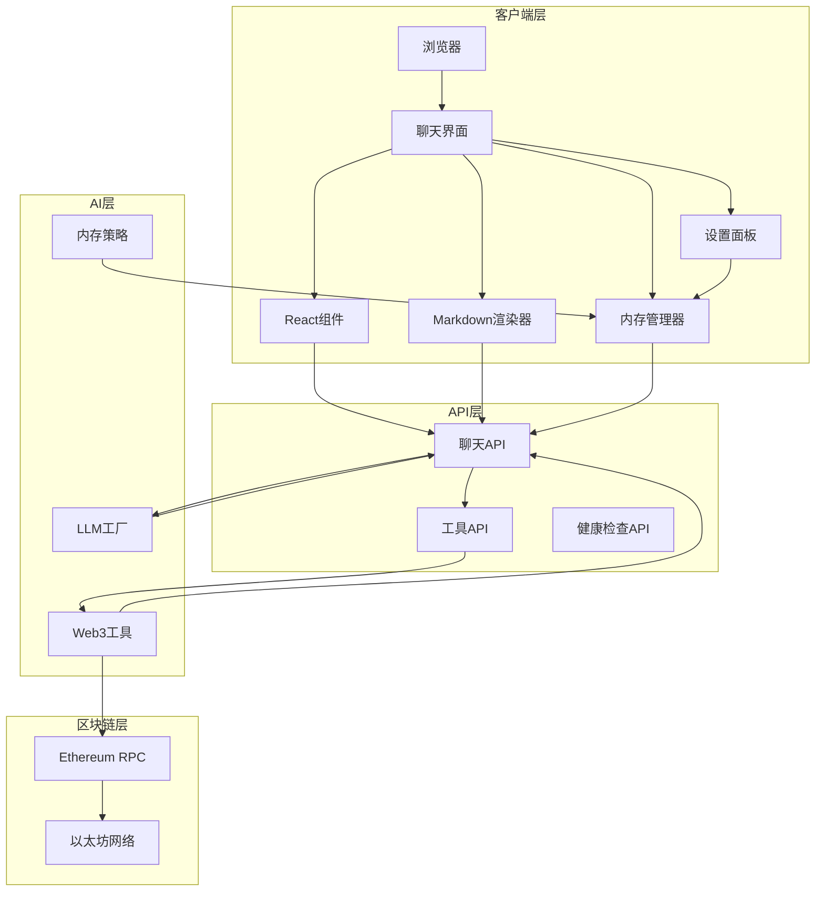

**图表来源**
- [apps/web/app/api/chat/route.ts:1-406](file://apps/web/app/api/chat/route.ts#L1-L406)
- [apps/web/app/api/tools/route.ts:1-135](file://apps/web/app/api/tools/route.ts#L1-L135)

### 数据流序列图

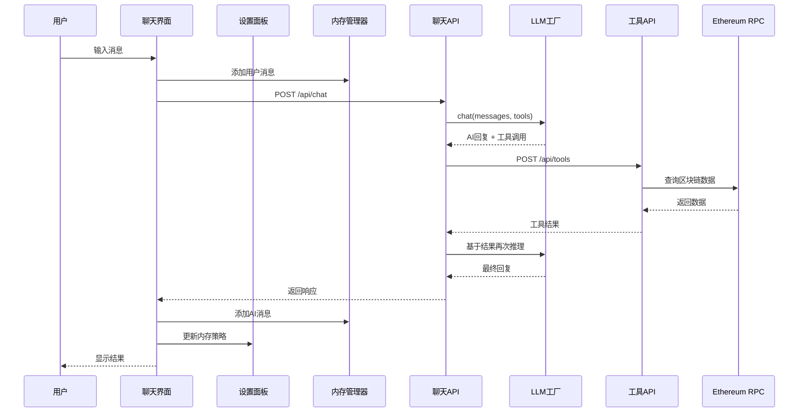

**图表来源**
- [apps/web/app/page.tsx:63-133](file://apps/web/app/page.tsx#L63-L133)
- [apps/web/app/api/chat/route.ts:156-319](file://apps/web/app/api/chat/route.ts#L156-L319)

## 详细组件分析

### 聊天输入组件

聊天输入组件提供了用户友好的消息输入界面，支持键盘快捷键和加载状态控制：

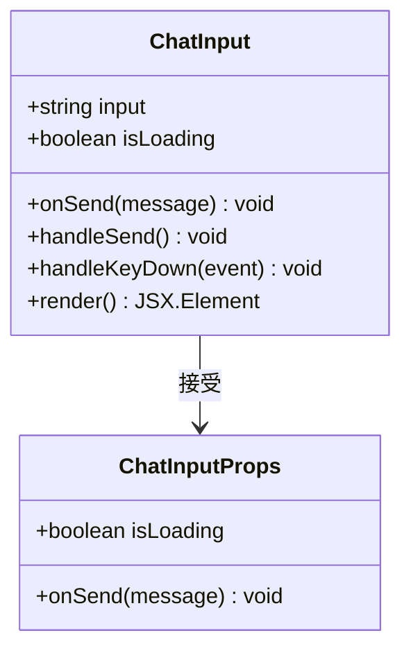

**图表来源**
- [apps/web/components/ChatInput.tsx:1-74](file://apps/web/components/ChatInput.tsx#L1-L74)

### 消息列表组件

消息列表组件负责渲染所有聊天消息，并提供自动滚动功能：

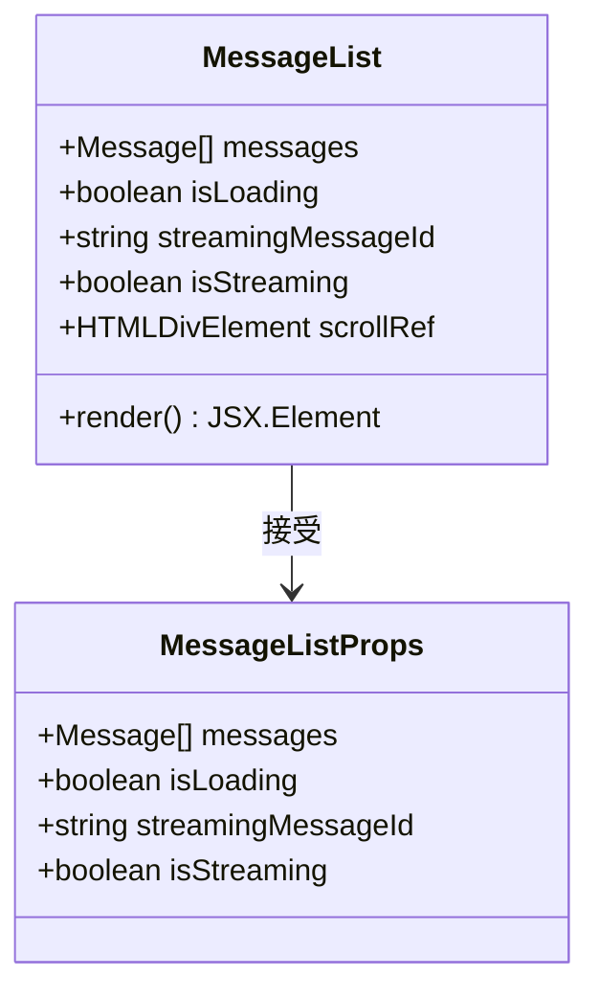

**图表来源**
- [apps/web/components/MessageList.tsx:1-44](file://apps/web/components/MessageList.tsx#L1-L44)

### 消息项组件

消息项组件根据消息类型和状态渲染不同的样式和内容，现已集成Markdown渲染功能：

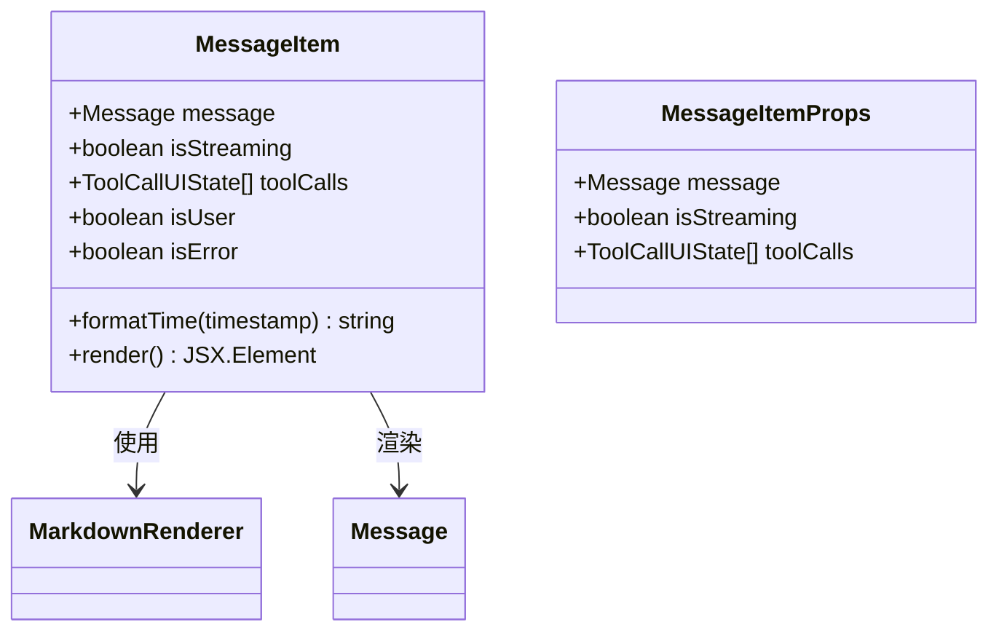

**图表来源**
- [apps/web/components/MessageItem.tsx:1-152](file://apps/web/components/MessageItem.tsx#L1-L152)
- [apps/web/types/chat.ts:1-28](file://apps/web/types/chat.ts#L1-L28)

### Markdown渲染器组件

**新增** Markdown渲染器组件提供了完整的Markdown语法支持，包括标题、列表、代码块、表格等：

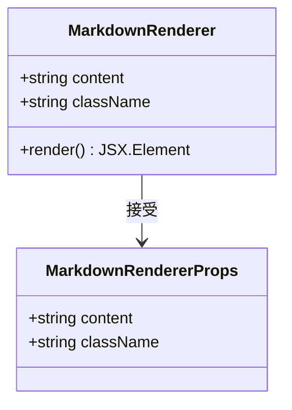

**图表来源**
- [apps/web/components/MarkdownRenderer.tsx:1-119](file://apps/web/components/MarkdownRenderer.tsx#L1-L119)

### 设置面板组件

**新增** 设置面板组件提供了内存策略管理和用户偏好设置：

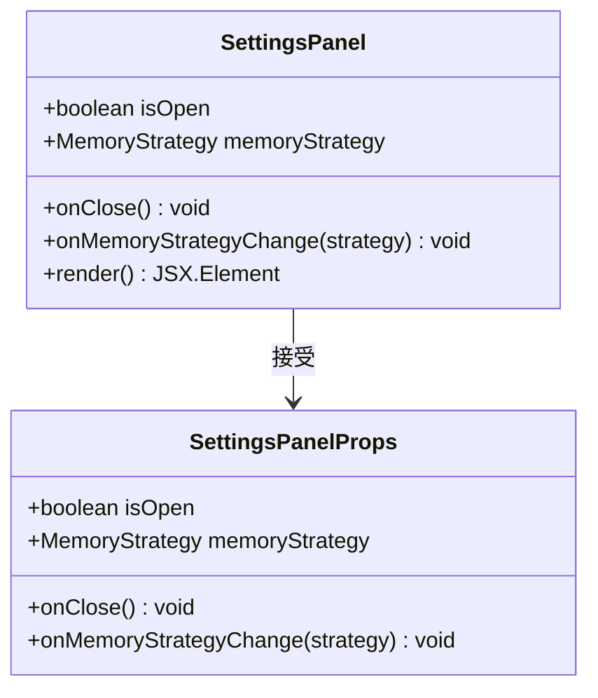

**图表来源**
- [apps/web/components/SettingsPanel.tsx:1-192](file://apps/web/components/SettingsPanel.tsx#L1-L192)

### 聊天API处理器

聊天API处理器实现了核心的AI推理逻辑，包括工具调用和结果处理：

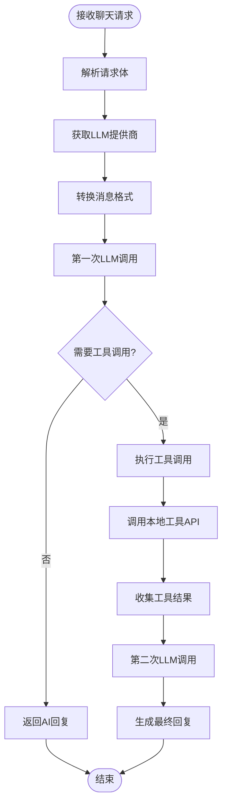

**图表来源**
- [apps/web/app/api/chat/route.ts:156-319](file://apps/web/app/api/chat/route.ts#L156-L319)

**章节来源**
- [apps/web/components/ChatInput.tsx:1-74](file://apps/web/components/ChatInput.tsx#L1-L74)
- [apps/web/components/MessageList.tsx:1-44](file://apps/web/components/MessageList.tsx#L1-L44)
- [apps/web/components/MessageItem.tsx:1-152](file://apps/web/components/MessageItem.tsx#L1-L152)
- [apps/web/components/MarkdownRenderer.tsx:1-119](file://apps/web/components/MarkdownRenderer.tsx#L1-L119)
- [apps/web/components/SettingsPanel.tsx:1-192](file://apps/web/components/SettingsPanel.tsx#L1-L192)
- [apps/web/app/api/chat/route.ts:1-406](file://apps/web/app/api/chat/route.ts#L1-L406)

## 内存管理策略

### 内存管理器架构

应用程序实现了两种内存管理策略，支持动态切换：

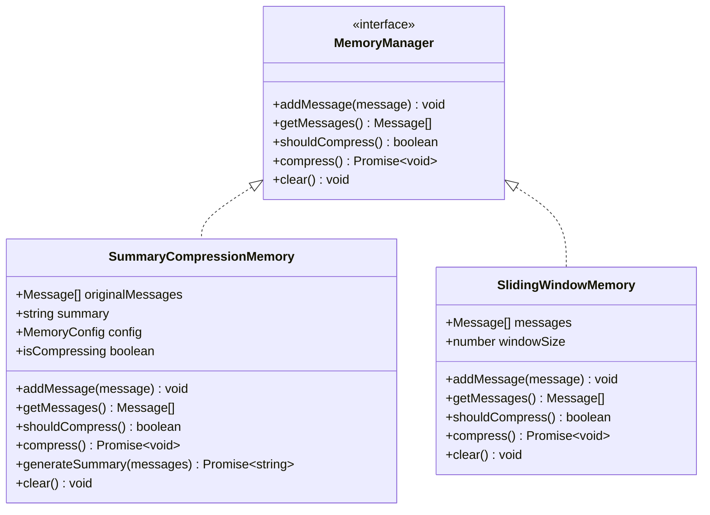

**图表来源**
- [apps/web/lib/memory/types.ts:12-37](file://apps/web/lib/memory/types.ts#L12-L37)
- [apps/web/lib/memory/SummaryCompressionMemory.ts:5-110](file://apps/web/lib/memory/SummaryCompressionMemory.ts#L5-L110)
- [apps/web/lib/memory/SlidingWindowMemory.ts:11-56](file://apps/web/lib/memory/SlidingWindowMemory.ts#L11-L56)

### 内存配置管理

内存管理器支持可配置的参数，包括压缩阈值、保留消息数和摘要模型：

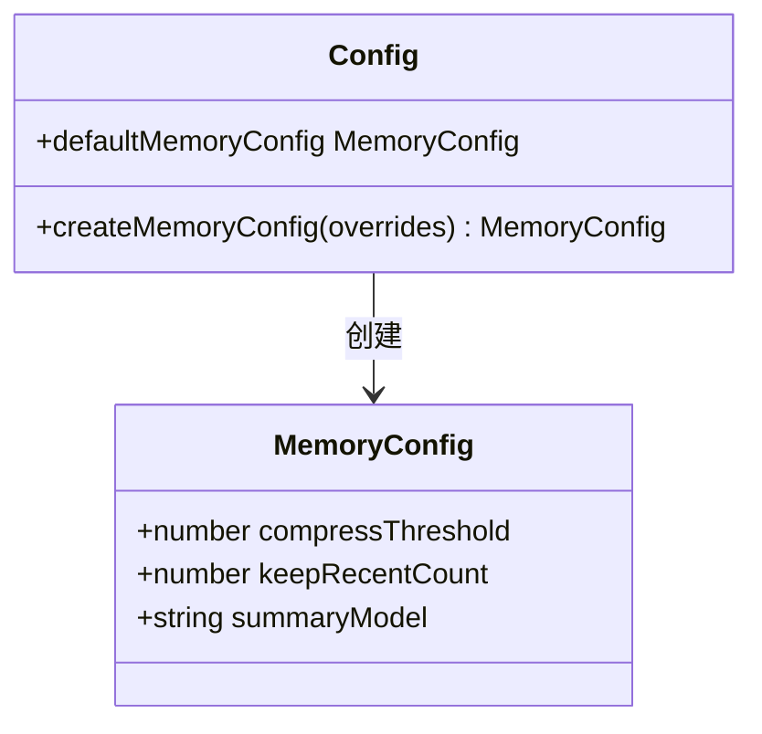

**图表来源**
- [apps/web/lib/memory/config.ts:3-14](file://apps/web/lib/memory/config.ts#L3-L14)

### 内存策略对比

| 策略类型 | 描述 | 压缩阈值 | 保留消息数 | 额外API调用 | 上下文质量 | 性能开销 |
|---------|------|----------|------------|-------------|------------|----------|
| L3摘要压缩 | 当消息达到阈值时，使用AI生成摘要，保留最近消息 | 10条 | 5条 | 是 | 高 | 中等 |
| L2滑动窗口 | 只保留最近N条消息，超出自动丢弃 | 无 | N条 | 否 | 中 | 极低 |

**章节来源**
- [apps/web/lib/memory/SummaryCompressionMemory.ts:1-111](file://apps/web/lib/memory/SummaryCompressionMemory.ts#L1-L111)
- [apps/web/lib/memory/SlidingWindowMemory.ts:1-57](file://apps/web/lib/memory/SlidingWindowMemory.ts#L1-L57)
- [apps/web/lib/memory/config.ts:1-15](file://apps/web/lib/memory/config.ts#L1-L15)
- [apps/web/lib/memory/types.ts:1-38](file://apps/web/lib/memory/types.ts#L1-L38)

## UI设计与样式

### Web3企业风格设计

应用程序采用了现代化的Web3企业风格设计，具有以下特点：

- **科技蓝色调**：使用渐变的科技蓝色作为主色调，体现Web3技术特性
- **深色主题**：采用深色背景，减少视觉疲劳，适合长时间使用
- **毛玻璃效果**：大量使用backdrop-blur和透明度效果
- **微妙动画**：包含发光脉冲、滑入动画等微交互效果
- **响应式设计**：适配各种屏幕尺寸和设备

### 样式系统架构

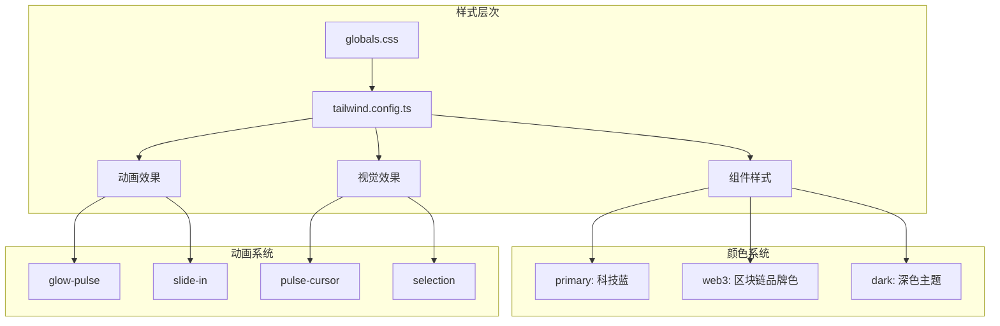

**图表来源**
- [apps/web/app/globals.css:1-118](file://apps/web/app/globals.css#L1-L118)
- [apps/web/tailwind.config.ts:1-54](file://apps/web/tailwind.config.ts#L1-L54)

### Markdown渲染样式

Markdown渲染器提供了完整的语法支持和美观的样式：

- **标题层级**：h1-h3使用不同的字体大小和颜色
- **列表样式**：支持有序和无序列表，带项目符号
- **代码块**：支持内联代码和代码块，带语法高亮
- **表格**：响应式表格，支持滚动
- **链接**：悬停效果和下划线动画
- **引用**：左侧边框和斜体样式

**章节来源**
- [apps/web/app/globals.css:1-118](file://apps/web/app/globals.css#L1-L118)
- [apps/web/tailwind.config.ts:1-54](file://apps/web/tailwind.config.ts#L1-L54)
- [apps/web/components/MarkdownRenderer.tsx:1-119](file://apps/web/components/MarkdownRenderer.tsx#L1-L119)

## 依赖关系分析

### 技术栈依赖

应用程序使用了现代前端技术栈，具有清晰的依赖层次结构：

```mermaid
graph TB
subgraph "运行时依赖"
Next[Next.js 14.2.0]
React[React ^18.2.0]
Ethers[Ethers ^6.11.0]
AI[AI SDK ^3.0.0]
Markdown[react-markdown ^9.0.0]
Remark[remark-gfm ^4.0.0]
end
subgraph "工作区包"
AIConfig[@web3-ai-agent/ai-config]
Web3Tools[@web3-ai-agent/web3-tools]
end
subgraph "开发依赖"
TypeScript[TypeScript ^5]
Tailwind[Tailwind CSS ^3.4.1]
PostCSS[PostCSS ^8.4.35]
ESLint[ESLint ^8]
end
Next --> React
Next --> AI
Next --> Ethers
Next --> AIConfig
Next --> Web3Tools
Next --> Markdown
Next --> Remark
```

**图表来源**
- [apps/web/package.json:12-32](file://apps/web/package.json#L12-L32)

### Monorepo 管理

项目使用 Turborepo 进行多包管理，实现了高效的构建和开发流程：

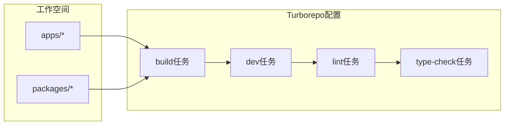

**图表来源**
- [turbo.json:1-21](file://turbo.json#L1-L21)
- [pnpm-workspace.yaml:1-4](file://pnpm-workspace.yaml#L1-L4)

**章节来源**
- [apps/web/package.json:12-32](file://apps/web/package.json#L12-L32)
- [turbo.json:1-21](file://turbo.json#L1-L21)
- [pnpm-workspace.yaml:1-4](file://pnpm-workspace.yaml#L1-L4)

## 性能考虑

### 缓存策略

应用实现了多层次的缓存机制来优化性能：

1. **API 缓存**: 使用 Next.js 的 revalidate 机制缓存外部 API 响应
2. **区块链数据缓存**: 通过 RPC 提供商的内置缓存减少网络请求
3. **组件渲染优化**: 使用 React 的 memoization 和状态管理避免不必要的重渲染
4. **内存管理优化**: 支持两种内存策略，平衡性能和上下文质量

### 网络优化

- **并发工具调用**: 支持同时执行多个工具调用以提高响应速度
- **流式输出**: 使用SSE实现流式响应，提供更好的用户体验
- **错误恢复**: 实现了健壮的错误处理和重试机制
- **资源压缩**: 使用 Tailwind CSS 和 PostCSS 优化样式文件大小

### 移动端适配

应用采用了响应式设计，确保在各种设备上都有良好的用户体验：

- **自适应布局**: 使用 Flexbox 和 Grid 实现灵活的布局
- **触摸友好**: 优化了触摸交互元素的尺寸和间距
- **性能优化**: 在移动设备上限制动画效果以节省资源
- **内存策略**: 支持轻量级的滑动窗口策略，适合移动设备

## 故障排除指南

### 常见问题及解决方案

#### 1. LLM 配置错误

**症状**: API 返回配置错误信息
**原因**: 缺少必要的环境变量或 API 密钥配置
**解决方案**:
- 检查 `.env` 文件中的 LLM 配置
- 确认 API 密钥的有效性
- 验证网络连接和代理设置

#### 2. 区块链 RPC 连接失败

**症状**: 钱包余额查询或 Gas 价格获取失败
**原因**: RPC 服务不可用或网络问题
**解决方案**:
- 切换到备用 RPC 提供商
- 检查防火墙和网络设置
- 验证 RPC URL 的正确性

#### 3. 工具调用超时

**症状**: 工具执行时间过长或无响应
**原因**: 外部 API 响应慢或网络延迟
**解决方案**:
- 实现超时机制和重试逻辑
- 使用负载均衡的 RPC 提供商
- 优化工具调用的并发数量

#### 4. 内存管理问题

**症状**: 内存使用过高或上下文丢失
**原因**: 内存策略配置不当
**解决方案**:
- 切换到滑动窗口策略以减少内存使用
- 调整压缩阈值和保留消息数
- 监控内存使用情况并定期清理

**章节来源**
- [apps/web/app/api/chat/route.ts:360-404](file://apps/web/app/api/chat/route.ts#L360-L404)
- [apps/web/app/api/tools/route.ts:124-133](file://apps/web/app/api/tools/route.ts#L124-L133)
- [apps/web/lib/memory/SummaryCompressionMemory.ts:48-74](file://apps/web/lib/memory/SummaryCompressionMemory.ts#L48-L74)

## 结论

这个 Web3 AI Agent 应用程序展示了现代 Web3 应用开发的最佳实践，成功地将 AI 智能推理与区块链数据查询相结合。项目具有以下特点：

### 技术优势
- **模块化架构**: 清晰的组件分离和职责划分
- **类型安全**: 完整的 TypeScript 类型定义
- **性能优化**: 多层次的缓存和优化策略
- **可扩展性**: 基于 Monorepo 的包管理架构
- **内存管理**: 支持两种策略的智能内存管理
- **UI设计**: 采用Web3企业风格的现代化界面

### 功能特色
- **智能工具调用**: AI 模型能够自动选择和执行合适的工具
- **实时数据**: 支持实时的区块链数据查询
- **Markdown渲染**: 完整的Markdown语法支持
- **内存策略管理**: 用户可自定义的内存管理策略
- **流式输出**: SSE流式响应提供更好的用户体验
- **响应式设计**: 适配各种设备和屏幕尺寸

### 发展前景
该应用程序为 Web3 开发者提供了一个强大的信息查询平台，未来可以扩展更多 Web3 工具和服务，进一步提升用户体验和功能性。通过持续的优化和功能扩展，这个项目有望成为 Web3 生态系统中的重要工具。

**更新** 本次更新重点增强了Markdown渲染功能、设置了内存策略管理面板，并对整体UI进行了Web3企业风格的美化改进，显著提升了用户体验和专业度。