# Web应用程序

<cite>
**本文档引用的文件**
- [apps/web/app/layout.tsx](file://apps/web/app/layout.tsx)
- [apps/web/app/providers.tsx](file://apps/web/app/providers.tsx)
- [apps/web/app/page.tsx](file://apps/web/app/page.tsx)
- [apps/web/app/api/chat/route.ts](file://apps/web/app/api/chat/route.ts)
- [apps/web/app/api/tools/route.ts](file://apps/web/app/api/tools/route.ts)
- [apps/web/components/ChatInput.tsx](file://apps/web/components/ChatInput.tsx)
- [apps/web/components/ChatInput.test.tsx](file://apps/web/components/ChatInput.test.tsx)
- [apps/web/components/PromptSelector.tsx](file://apps/web/components/PromptSelector.tsx)
- [apps/web/components/PromptSelectorModal.tsx](file://apps/web/components/PromptSelectorModal.tsx)
- [apps/web/config/prompts.ts](file://apps/web/config/prompts.ts)
- [apps/web/components/MessageList.tsx](file://apps/web/components/MessageList.tsx)
- [apps/web/components/MessageItem.tsx](file://apps/web/components/MessageItem.tsx)
- [apps/web/components/MarkdownRenderer.tsx](file://apps/web/components/MarkdownRenderer.tsx)
- [apps/web/components/SettingsPanel.tsx](file://apps/web/components/SettingsPanel.tsx)
- [apps/web/components/ThemeSwitcher.tsx](file://apps/web/components/ThemeSwitcher.tsx)
- [apps/web/components/ConfirmDialog.tsx](file://apps/web/components/ConfirmDialog.tsx)
- [apps/web/components/WalletConnectButton.tsx](file://apps/web/components/WalletConnectButton.tsx)
- [apps/web/components/ConversationHistory.tsx](file://apps/web/components/ConversationHistory.tsx)
- [apps/web/lib/theme/ThemeProvider.tsx](file://apps/web/lib/theme/ThemeProvider.tsx)
- [apps/web/lib/theme/ThemeContext.tsx](file://apps/web/lib/theme/ThemeContext.tsx)
- [apps/web/lib/theme/types.ts](file://apps/web/lib/theme/types.ts)
- [apps/web/hooks/useChatStream.ts](file://apps/web/hooks/useChatStream.ts)
- [apps/web/lib/memory/SummaryCompressionMemory.ts](file://apps/web/lib/memory/SummaryCompressionMemory.ts)
- [apps/web/lib/memory/SlidingWindowMemory.ts](file://apps/web/lib/memory/SlidingWindowMemory.ts)
- [apps/web/lib/memory/config.ts](file://apps/web/lib/memory/config.ts)
- [apps/web/lib/memory/types.ts](file://apps/web/lib/memory/types.ts)
- [apps/web/lib/memory/index.ts](file://apps/web/lib/memory/index.ts)
- [apps/web/types/chat.ts](file://apps/web/types/chat.ts)
- [apps/web/lib/supabase/client.ts](file://apps/web/lib/supabase/client.ts)
- [apps/web/lib/supabase/conversations.ts](file://apps/web/lib/supabase/conversations.ts)
- [apps/web/lib/supabase/transfers.ts](file://apps/web/lib/supabase/transfers.ts)
- [apps/web/app/globals.css](file://apps/web/app/globals.css)
- [apps/web/tailwind.config.ts](file://apps/web/tailwind.config.ts)
- [apps/web/package.json](file://apps/web/package.json)
- [apps/web/next.config.js](file://apps/web/next.config.js)
- [apps/web/postcss.config.js](file://apps/web/postcss.config.js)
- [apps/web/public/favicon.ico](file://apps/web/public/favicon.ico)
- [package.json](file://package.json)
- [turbo.json](file://turbo.json)
- [pnpm-workspace.yaml](file://pnpm-workspace.yaml)
</cite>

## 更新摘要
**变更内容**
- **ChatInput组件测试增强**：占位符文本从'询问Web3相关问题'更新为'问我任何Web3问题'，按钮查询使用明确命名避免与模板提示按钮冲突，以及改进的加载状态测试
- CSS处理依赖（autoprefixer、postcss、tailwindcss）从开发依赖迁移到生产依赖，影响应用构建和运行时依赖
- 新增完整的提示词选择系统，包括PromptSelectorModal和PromptSelector组件
- 增强ChatInput组件，新增快捷提示词功能，支持快速选择预设提示词
- 完善提示词模板管理系统，支持分类组织和动态加载
- 优化用户交互体验，提供更便捷的Web3查询入口
- 新增移动端适配的底部抽屉式提示词选择器
- 完善Web3企业风格界面，提升整体设计专业度
- **新增**：完整的Markdown语法渲染支持，增强消息内容展示
- **新增**：内存策略管理设置面板，提供更灵活的上下文管理
- **新增**：Web3企业风格的现代化UI设计，采用深色主题和科技蓝色调
- **新增**：完整的主题系统支持，包括浅色、深色和跟随系统主题
- **新增**：统一的确认对话框组件，提供一致的用户交互体验
- **新增**：钱包上下文注入功能，实现AI对用户钱包地址的感知
- **新增**：智能欢迎消息处理机制，优化对话切换用户体验
- **新增**：favicon配置，提升应用的品牌识别度

## 目录
1. [简介](#简介)
2 [项目结构](#项目结构)
3 [核心组件](#核心组件)
4 [架构概览](#架构概览)
5 [详细组件分析](#详细组件分析)
6 [提示词选择系统](#提示词选择系统)
7 [主题系统](#主题系统)
8 [确认对话框组件](#确认对话框组件)
9 [钱包上下文注入](#钱包上下文注入)
10 [内存管理策略](#内存管理策略)
11 [智能欢迎消息处理](#智能欢迎消息处理)
12 [UI设计与样式](#ui设计与样式)
13 [CSS处理依赖变更](#css处理依赖变更)
14 [依赖关系分析](#依赖关系分析)
15 [性能考虑](#性能考虑)
16 [故障排除指南](#故障排除指南)
17 [结论](#结论)

## 简介

这是一个基于 Next.js 的 Web3 AI Agent 应用程序，旨在为用户提供 Web3 相关的信息查询服务。该应用能够理解用户意图、调用 Web3 工具、并返回可信的结果。主要功能包括：

- 查询 ETH 实时价格
- 查询以太坊钱包余额
- 查询当前 Gas 价格
- 智能对话交互
- 工具调用和结果展示
- **新增**：完整的Markdown语法渲染支持
- **新增**：内存策略管理设置面板
- **新增**：Web3企业风格的现代化UI设计
- **新增**：完整的主题系统支持
- **新增**：统一的确认对话框组件
- **新增**：钱包上下文注入功能，实现AI对用户钱包地址的感知
- **新增**：智能欢迎消息处理机制，优化对话切换用户体验
- **新增**：完整的提示词选择系统，提供快捷的Web3查询入口
- **新增**：favicon配置，提升应用的品牌识别度

应用采用现代化的技术栈，包括 Next.js 14、TypeScript、Tailwind CSS 和 Ethers.js，构建了一个响应式的 Web3 信息查询平台，具备企业级的设计风格和用户体验。

## 项目结构

该项目采用 Monorepo 结构，使用 Turborepo 进行管理，包含以下主要目录：

```mermaid
graph TB
subgraph "根目录"
Root[package.json]
Turbo[turbo.json]
Workspace[pnpm-workspace.yaml]
end
subgraph "应用层 (apps)"
WebApp[apps/web]
subgraph "Web应用子目录"
App[app/]
Components[components/]
Hooks[hooks/]
Lib[lib/]
Types[types/]
Config[配置文件]
Public[public/]
</subgraph>
end
subgraph "包层 (packages)"
AIConfig[packages/ai-config]
Web3Tools[packages/web3-tools]
end
subgraph "文档"
Docs[docs/]
end
subgraph "技能系统"
Skills[skills/]
end
Root --> WebApp
Root --> AIConfig
Root --> Web3Tools
Root --> Docs
Root --> Skills
WebApp --> App
WebApp --> Components
WebApp --> Hooks
WebApp --> Lib
WebApp --> Types
WebApp --> Config
WebApp --> Public
```

**图表来源**
- [package.json:1-35](file://package.json#L1-L35)
- [turbo.json:1-21](file://turbo.json#L1-L21)
- [pnpm-workspace.yaml:1-4](file://pnpm-workspace.yaml#L1-L4)

**章节来源**
- [package.json:1-35](file://package.json#L1-L35)
- [turbo.json:1-21](file://turbo.json#L1-L21)
- [pnpm-workspace.yaml:1-4](file://pnpm-workspace.yaml#L1-L4)

## 核心组件

### 应用布局组件

应用布局组件负责设置全局元数据和字体配置，现已集成了favicon配置：

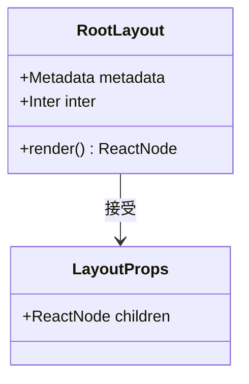
```mermaid
classDiagram
class RootLayout {
+Metadata metadata
+Inter inter
+render() ReactNode
}
class LayoutProps {
+ReactNode children
}
RootLayout --> LayoutProps : 接受
```

**图表来源**
- [apps/web/app/layout.tsx:1-64](file://apps/web/app/layout.tsx#L1-L64)

### 主页面组件

主页面组件实现了完整的聊天界面，包含消息列表、输入框、设置面板和状态管理：

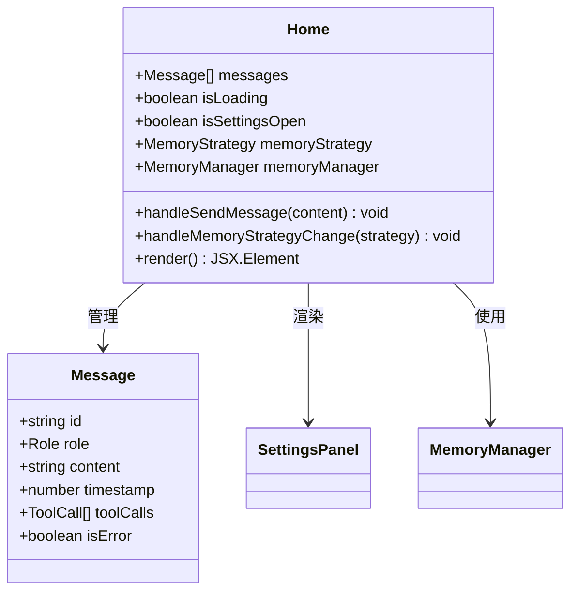
```mermaid
classDiagram
class Home {
+Message[] messages
+boolean isLoading
+boolean isSettingsOpen
+MemoryStrategy memoryStrategy
+MemoryManager memoryManager
+handleSendMessage(content) void
+handleMemoryStrategyChange(strategy) void
+render() JSX.Element
}
class Message {
+string id
+Role role
+string content
+number timestamp
+ToolCall[] toolCalls
+boolean isError
}
Home --> Message : 管理
Home --> SettingsPanel : 渲染
Home --> MemoryManager : 使用
```

**图表来源**
- [apps/web/app/page.tsx:1-423](file://apps/web/app/page.tsx#L1-L423)
- [apps/web/types/chat.ts:1-29](file://apps/web/types/chat.ts#L1-L29)

**章节来源**
- [apps/web/app/layout.tsx:1-64](file://apps/web/app/layout.tsx#L1-L64)
- [apps/web/app/page.tsx:1-423](file://apps/web/app/page.tsx#L1-L423)
- [apps/web/types/chat.ts:1-29](file://apps/web/types/chat.ts#L1-L29)

## 架构概览

该应用程序采用客户端-服务器架构，结合了 AI 模型推理和 Web3 工具调用：

```mermaid
graph TB
subgraph "客户端层"
Browser[浏览器]
ChatUI[聊天界面]
Components[React组件]
SettingsPanel[设置面板]
MarkdownRenderer[Markdown渲染器]
MemoryManager[内存管理器]
ThemeSystem[主题系统]
ConfirmDialog[确认对话框]
WalletContext[钱包上下文]
RainbowKit[钱包连接]
ConversationHistory[对话历史]
WelcomeMessage[智能欢迎消息]
PromptSelector[提示词选择器]
PromptSelectorModal[提示词选择弹窗]
</subgraph
subgraph "API层"
ChatAPI[聊天API]
ToolsAPI[工具API]
HealthAPI[健康检查API]
</subgraph
subgraph "AI层"
LLMFactory[LLM工厂]
Tools[Web3工具]
MemoryStrategies[内存策略]
</subgraph
subgraph "区块链层"
EthereumRPC[Ethereum RPC]
BlockChain[以太坊网络]
</subgraph
Browser --> ChatUI
ChatUI --> Components
ChatUI --> SettingsPanel
ChatUI --> MarkdownRenderer
ChatUI --> MemoryManager
ChatUI --> ThemeSystem
ChatUI --> ConfirmDialog
ChatUI --> WalletContext
ChatUI --> RainbowKit
ChatUI --> ConversationHistory
ChatUI --> WelcomeMessage
ChatUI --> PromptSelector
ChatUI --> PromptSelectorModal
Components --> ChatAPI
SettingsPanel --> MemoryManager
SettingsPanel --> ThemeSystem
MarkdownRenderer --> ChatAPI
MemoryManager --> ChatAPI
ThemeSystem --> Providers
ConfirmDialog --> ChatUI
WalletContext --> ChatAPI
RainbowKit --> WalletContext
ConversationHistory --> WelcomeMessage
PromptSelector --> PromptSelectorModal
PromptSelectorModal --> ChatInput
ChatAPI --> LLMFactory
ChatAPI --> ToolsAPI
ToolsAPI --> Tools
Tools --> EthereumRPC
EthereumRPC --> BlockChain
LLMFactory --> ChatAPI
Tools --> ChatAPI
MemoryStrategies --> MemoryManager
```

**图表来源**
- [apps/web/app/api/chat/route.ts:1-567](file://apps/web/app/api/chat/route.ts#L1-L567)
- [apps/web/app/api/tools/route.ts:1-135](file://apps/web/app/api/tools/route.ts#L1-L135)

### 数据流序列图

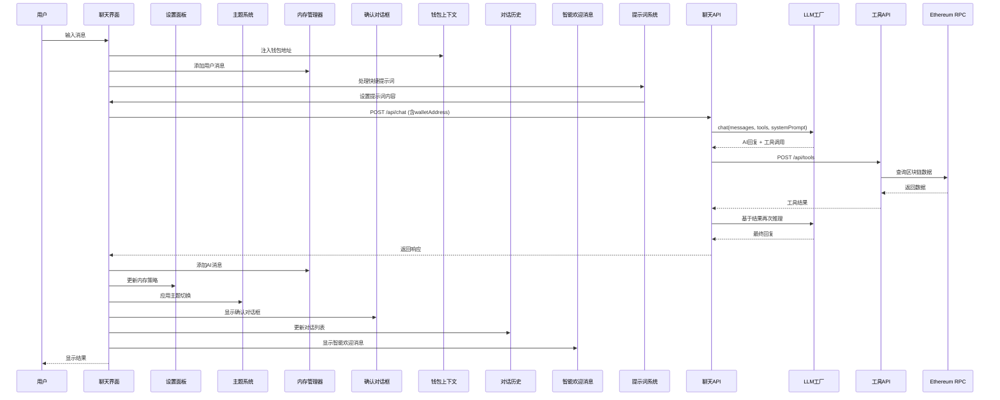
```mermaid
sequenceDiagram
participant User as 用户
participant UI as 聊天界面
participant Settings as 设置面板
participant Theme as 主题系统
participant Memory as 内存管理器
participant Dialog as 确认对话框
participant Wallet as 钱包上下文
participant History as 对话历史
participant Welcome as 智能欢迎消息
participant Prompt as 提示词系统
participant ChatAPI as 聊天API
participant LLM as LLM工厂
participant ToolsAPI as 工具API
participant RPC as Ethereum RPC
User->>UI : 输入消息
UI->>Wallet : 注入钱包地址
UI->>Memory : 添加用户消息
UI->>Prompt : 处理快捷提示词
Prompt->>UI : 设置提示词内容
UI->>ChatAPI : POST /api/chat (含walletAddress)
ChatAPI->>LLM : chat(messages, tools, systemPrompt)
LLM-->>ChatAPI : AI回复 + 工具调用
ChatAPI->>ToolsAPI : POST /api/tools
ToolsAPI->>RPC : 查询区块链数据
RPC-->>ToolsAPI : 返回数据
ToolsAPI-->>ChatAPI : 工具结果
ChatAPI->>LLM : 基于结果再次推理
LLM-->>ChatAPI : 最终回复
ChatAPI-->>UI : 返回响应
UI->>Memory : 添加AI消息
UI->>Settings : 更新内存策略
UI->>Theme : 应用主题切换
UI->>Dialog : 显示确认对话框
UI->>History : 更新对话列表
UI->>Welcome : 显示智能欢迎消息
UI-->>User : 显示结果
```

**图表来源**
- [apps/web/app/page.tsx:228-328](file://apps/web/app/page.tsx#L228-L328)
- [apps/web/app/api/chat/route.ts:150-319](file://apps/web/app/api/chat/route.ts#L150-L319)

## 详细组件分析

### 聊天输入组件

聊天输入组件提供了用户友好的消息输入界面，支持键盘快捷键和加载状态控制：

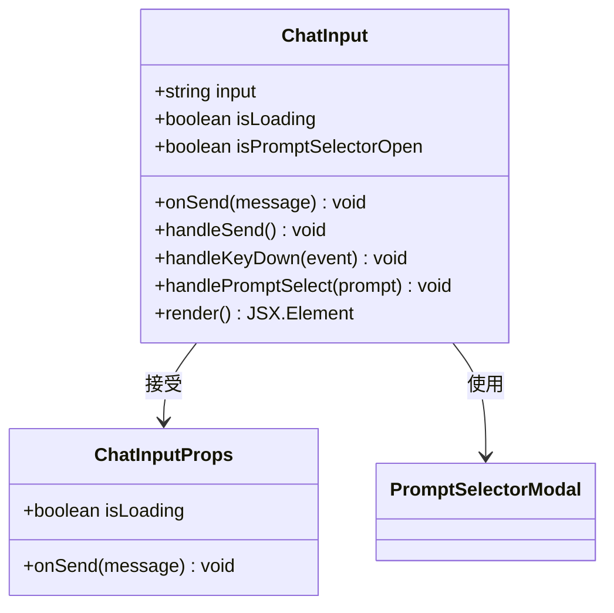
```mermaid
classDiagram
class ChatInput {
+string input
+boolean isLoading
+boolean isPromptSelectorOpen
+onSend(message) void
+handleSend() void
+handleKeyDown(event) void
+handlePromptSelect(prompt) void
+render() JSX.Element
}
class ChatInputProps {
+onSend(message) void
+boolean isLoading
}
ChatInput --> ChatInputProps : 接受
ChatInput --> PromptSelectorModal : 使用
```

**图表来源**
- [apps/web/components/ChatInput.tsx:1-162](file://apps/web/components/ChatInput.tsx#L1-L162)

### ChatInput组件测试增强

**更新** ChatInput组件测试进行了全面增强，重点关注用户体验和交互准确性：

#### 占位符文本更新
- 占位符文本从'询问Web3相关问题'更新为'问我任何Web3问题'
- 更加友好和包容的表述，鼓励用户提出各种Web3相关问题

#### 按钮查询明确命名
- 测试中使用明确的按钮名称'发送消息'避免与模板提示按钮冲突
- 通过精确的选择器避免误匹配到'提示词模板'按钮

#### 改进的加载状态测试
- 增加了对isLoading状态的完整覆盖测试
- 验证输入框和按钮在加载状态下的禁用行为
- 确保用户无法在API处理过程中提交重复请求

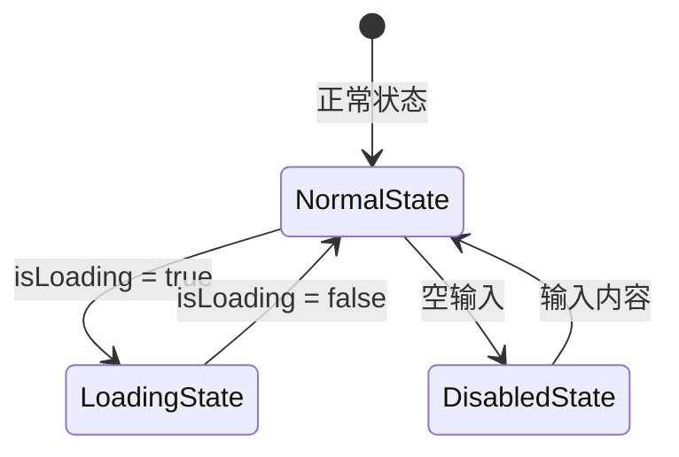
```mermaid
stateDiagram-v2
[*] --> NormalState : 正常状态
NormalState --> LoadingState : isLoading = true
LoadingState --> NormalState : isLoading = false
NormalState --> DisabledState : 空输入
DisabledState --> NormalState : 输入内容
```

**图表来源**
- [apps/web/components/ChatInput.test.tsx:48-57](file://apps/web/components/ChatInput.test.tsx#L48-L57)

**章节来源**
- [apps/web/components/ChatInput.tsx:1-162](file://apps/web/components/ChatInput.tsx#L1-L162)
- [apps/web/components/ChatInput.test.tsx:1-59](file://apps/web/components/ChatInput.test.tsx#L1-L59)

### 提示词选择器组件

**新增** 提示词选择器组件提供了分类化的提示词模板选择界面：

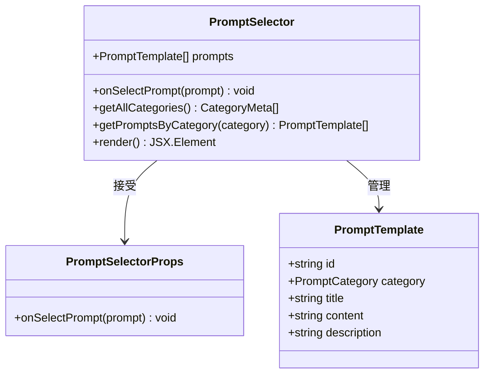
```mermaid
classDiagram
class PromptSelector {
+PromptTemplate[] prompts
+onSelectPrompt(prompt) void
+getAllCategories() CategoryMeta[]
+getPromptsByCategory(category) PromptTemplate[]
+render() JSX.Element
}
class PromptSelectorProps {
+onSelectPrompt(prompt) void
}
class PromptTemplate {
+string id
+PromptCategory category
+string title
+string content
+string description
}
PromptSelector --> PromptSelectorProps : 接受
PromptSelector --> PromptTemplate : 管理
```

**图表来源**
- [apps/web/components/PromptSelector.tsx:1-106](file://apps/web/components/PromptSelector.tsx#L1-L106)
- [apps/web/config/prompts.ts:15-21](file://apps/web/config/prompts.ts#L15-L21)

### 提示词选择器弹窗组件

**新增** 提示词选择器弹窗组件提供了响应式的模态框界面：

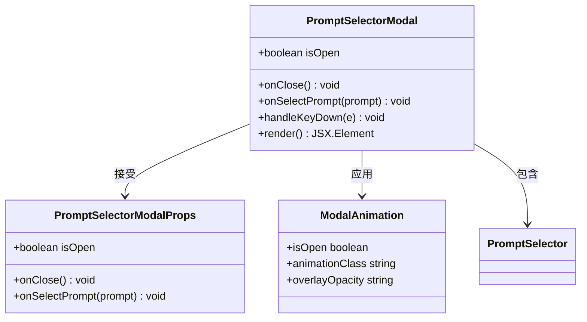
```mermaid
classDiagram
class PromptSelectorModal {
+boolean isOpen
+onClose() void
+onSelectPrompt(prompt) void
+handleKeyDown(e) void
+render() JSX.Element
}
class PromptSelectorModalProps {
+boolean isOpen
+onClose() void
+onSelectPrompt(prompt) void
}
class ModalAnimation {
+isOpen boolean
+animationClass string
+overlayOpacity string
}
PromptSelectorModal --> PromptSelectorModalProps : 接受
PromptSelectorModal --> ModalAnimation : 应用
PromptSelectorModal --> PromptSelector : 包含
```

**图表来源**
- [apps/web/components/PromptSelectorModal.tsx:1-116](file://apps/web/components/PromptSelectorModal.tsx#L1-L116)

### 消息列表组件

消息列表组件负责渲染所有聊天消息，并提供自动滚动功能：

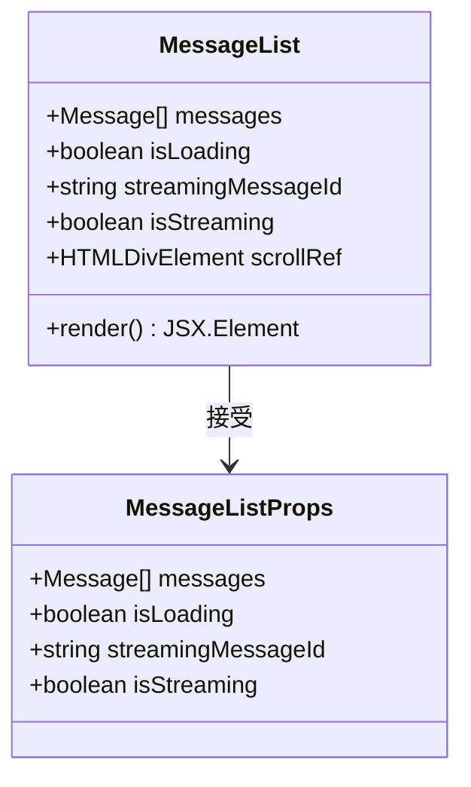
```mermaid
classDiagram
class MessageList {
+Message[] messages
+boolean isLoading
+string streamingMessageId
+boolean isStreaming
+HTMLDivElement scrollRef
+render() JSX.Element
}
class MessageListProps {
+Message[] messages
+boolean isLoading
+string streamingMessageId
+boolean isStreaming
}
MessageList --> MessageListProps : 接受
```

**图表来源**
- [apps/web/components/MessageList.tsx:1-44](file://apps/web/components/MessageList.tsx#L1-L44)

### 消息项组件

消息项组件根据消息类型和状态渲染不同的样式和内容，现已集成Markdown渲染功能：

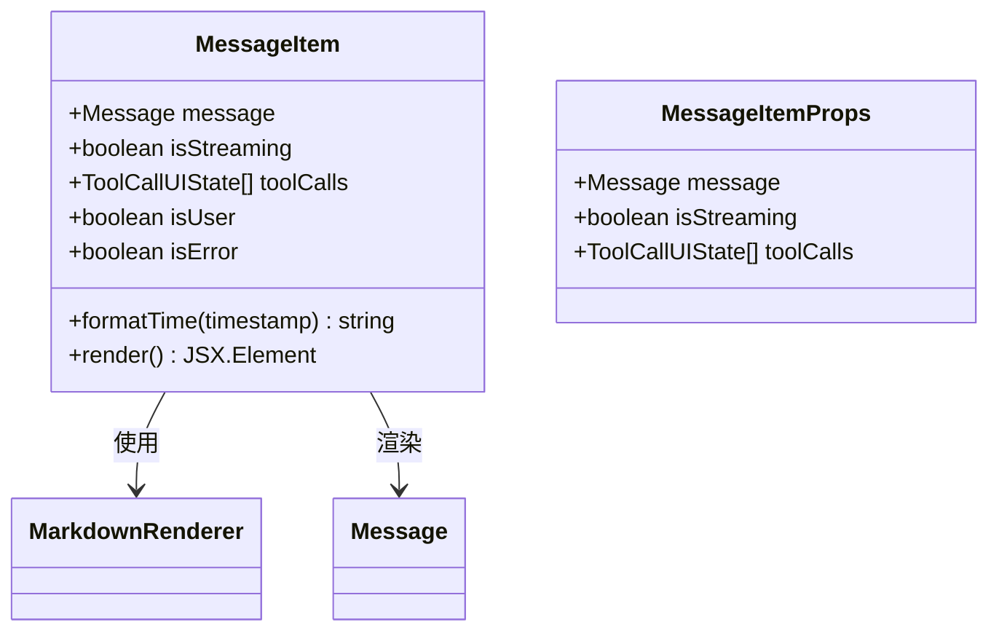
```mermaid
classDiagram
class MessageItem {
+Message message
+boolean isStreaming
+ToolCallUIState[] toolCalls
+boolean isUser
+boolean isError
+formatTime(timestamp) string
+render() JSX.Element
}
class MessageItemProps {
+Message message
+boolean isStreaming
+ToolCallUIState[] toolCalls
}
MessageItem --> MarkdownRenderer : 使用
MessageItem --> Message : 渲染
```

**图表来源**
- [apps/web/components/MessageItem.tsx:1-189](file://apps/web/components/MessageItem.tsx#L1-L189)
- [apps/web/types/chat.ts:1-29](file://apps/web/types/chat.ts#L1-L29)

### Markdown渲染器组件

**新增** Markdown渲染器组件提供了完整的Markdown语法支持，包括标题、列表、代码块、表格等：

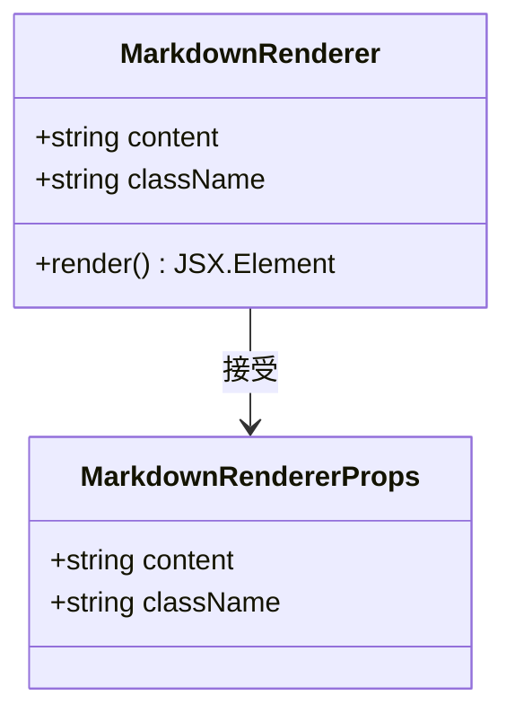
```mermaid
classDiagram
class MarkdownRenderer {
+string content
+string className
+render() JSX.Element
}
class MarkdownRendererProps {
+string content
+string className
}
MarkdownRenderer --> MarkdownRendererProps : 接受
```

**图表来源**
- [apps/web/components/MarkdownRenderer.tsx:1-160](file://apps/web/components/MarkdownRenderer.tsx#L1-L160)

### 设置面板组件

**新增** 设置面板组件提供了内存策略管理和用户偏好设置，现已集成主题切换功能：

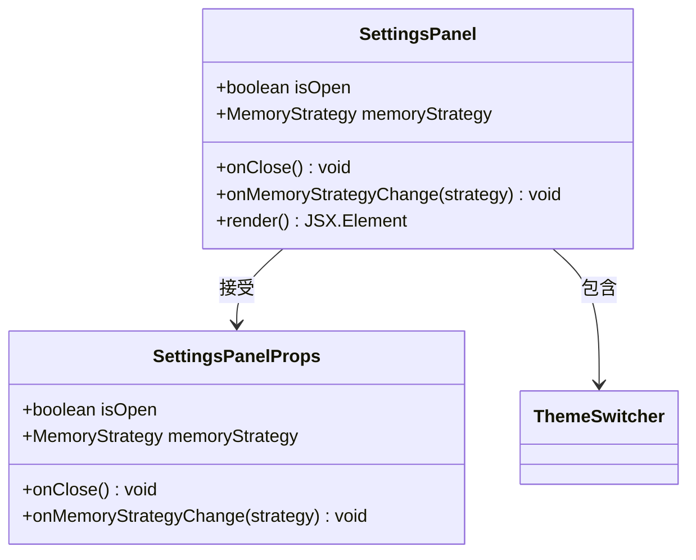
```mermaid
classDiagram
class SettingsPanel {
+boolean isOpen
+MemoryStrategy memoryStrategy
+onClose() void
+onMemoryStrategyChange(strategy) void
+render() JSX.Element
}
class SettingsPanelProps {
+boolean isOpen
+onClose() void
+MemoryStrategy memoryStrategy
+onMemoryStrategyChange(strategy) void
}
SettingsPanel --> SettingsPanelProps : 接受
SettingsPanel --> ThemeSwitcher : 包含
```

**图表来源**
- [apps/web/components/SettingsPanel.tsx:1-231](file://apps/web/components/SettingsPanel.tsx#L1-L231)

### 主题切换器组件

**新增** 主题切换器组件提供了直观的主题模式选择界面：

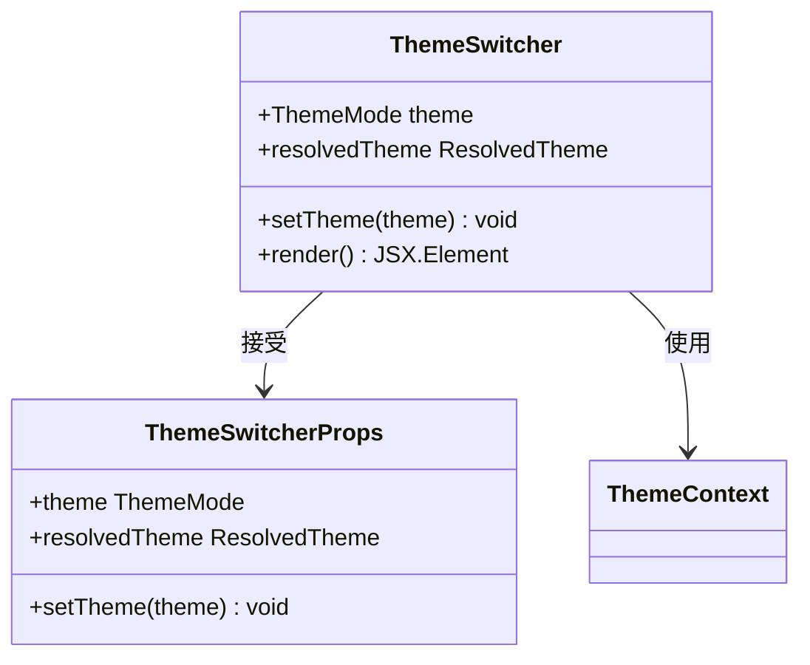
```mermaid
classDiagram
class ThemeSwitcher {
+ThemeMode theme
+setTheme(theme) void
+resolvedTheme ResolvedTheme
+render() JSX.Element
}
class ThemeSwitcherProps {
+theme ThemeMode
+setTheme(theme) void
+resolvedTheme ResolvedTheme
}
ThemeSwitcher --> ThemeSwitcherProps : 接受
ThemeSwitcher --> ThemeContext : 使用
```

**图表来源**
- [apps/web/components/ThemeSwitcher.tsx:1-42](file://apps/web/components/ThemeSwitcher.tsx#L1-L42)

### 确认对话框组件

**新增** 确认对话框组件提供了统一的用户确认交互体验：

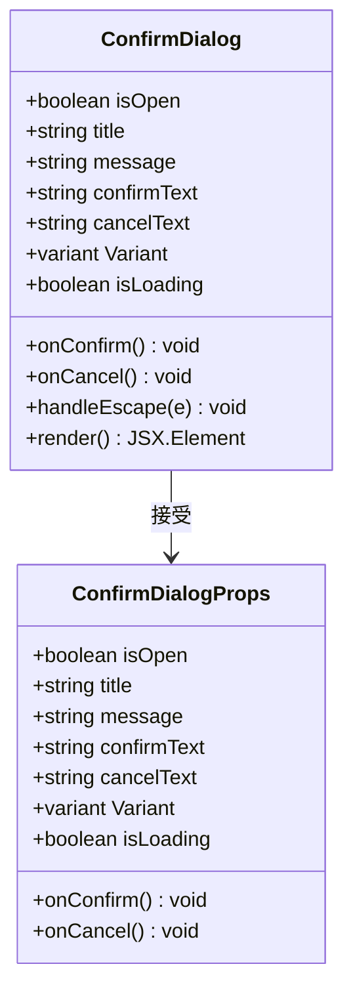
```mermaid
classDiagram
class ConfirmDialog {
+boolean isOpen
+string title
+string message
+string confirmText
+string cancelText
+variant Variant
+boolean isLoading
+onConfirm() void
+onCancel() void
+handleEscape(e) void
+render() JSX.Element
}
class ConfirmDialogProps {
+boolean isOpen
+string title
+string message
+string confirmText
+string cancelText
+variant Variant
+boolean isLoading
+onConfirm() void
+onCancel() void
}
ConfirmDialog --> ConfirmDialogProps : 接受
```

**图表来源**
- [apps/web/components/ConfirmDialog.tsx:1-101](file://apps/web/components/ConfirmDialog.tsx#L1-L101)

### 聊天API处理器

聊天API处理器实现了核心的AI推理逻辑，包括工具调用和结果处理：

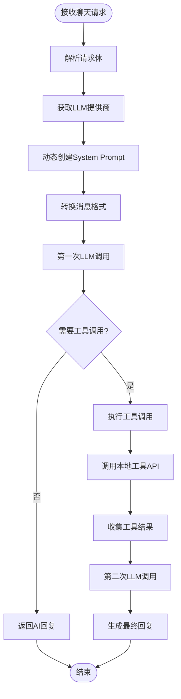
```mermaid
flowchart TD
Start([接收聊天请求]) --> ParseBody["解析请求体"]
ParseBody --> GetProvider["获取LLM提供商"]
GetProvider --> CreatePrompt["动态创建System Prompt"]
CreatePrompt --> ConvertMessages["转换消息格式"]
ConvertMessages --> FirstCall["第一次LLM调用"]
FirstCall --> NeedTools{"需要工具调用?"}
NeedTools --> |否| ReturnReply["返回AI回复"]
NeedTools --> |是| ExecuteTools["执行工具调用"]
ExecuteTools --> CallLocalTools["调用本地工具API"]
CallLocalTools --> CollectResults["收集工具结果"]
CollectResults --> SecondCall["第二次LLM调用"]
SecondCall --> FinalReply["生成最终回复"]
ReturnReply --> End([结束])
FinalReply --> End
```

**图表来源**
- [apps/web/app/api/chat/route.ts:150-319](file://apps/web/app/api/chat/route.ts#L150-L319)

**章节来源**
- [apps/web/components/ChatInput.tsx:1-162](file://apps/web/components/ChatInput.tsx#L1-L162)
- [apps/web/components/ChatInput.test.tsx:1-59](file://apps/web/components/ChatInput.test.tsx#L1-L59)
- [apps/web/components/PromptSelector.tsx:1-106](file://apps/web/components/PromptSelector.tsx#L1-L106)
- [apps/web/components/PromptSelectorModal.tsx:1-116](file://apps/web/components/PromptSelectorModal.tsx#L1-L116)
- [apps/web/components/MessageList.tsx:1-44](file://apps/web/components/MessageList.tsx#L1-L44)
- [apps/web/components/MessageItem.tsx:1-189](file://apps/web/components/MessageItem.tsx#L1-L189)
- [apps/web/components/MarkdownRenderer.tsx:1-160](file://apps/web/components/MarkdownRenderer.tsx#L1-L160)
- [apps/web/components/SettingsPanel.tsx:1-231](file://apps/web/components/SettingsPanel.tsx#L1-L231)
- [apps/web/components/ThemeSwitcher.tsx:1-42](file://apps/web/components/ThemeSwitcher.tsx#L1-L42)
- [apps/web/components/ConfirmDialog.tsx:1-101](file://apps/web/components/ConfirmDialog.tsx#L1-L101)
- [apps/web/app/api/chat/route.ts:1-567](file://apps/web/app/api/chat/route.ts#L1-L567)

## 提示词选择系统

### 系统架构设计

提示词选择系统实现了完整的Web3查询入口管理，提供了便捷的快捷操作功能：

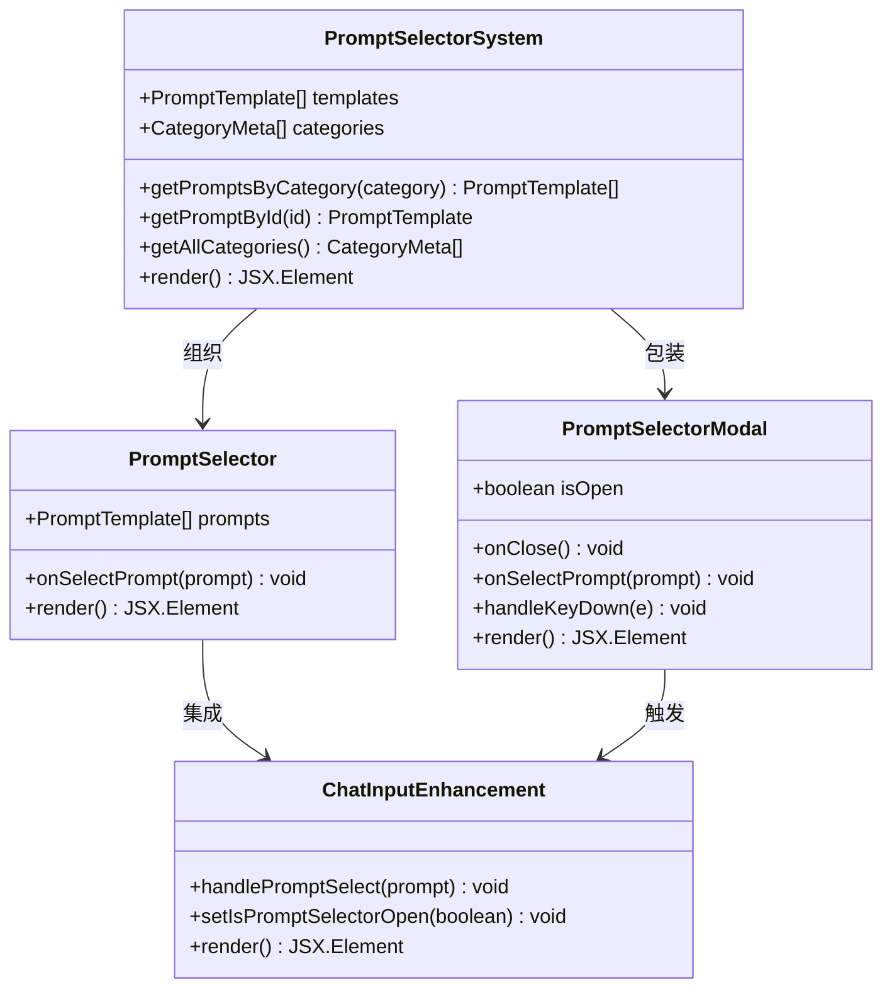
```mermaid
classDiagram
class PromptSelectorSystem {
+PromptTemplate[] templates
+CategoryMeta[] categories
+getPromptsByCategory(category) PromptTemplate[]
+getPromptById(id) PromptTemplate
+getAllCategories() CategoryMeta[]
+render() JSX.Element
}
class PromptSelector {
+PromptTemplate[] prompts
+onSelectPrompt(prompt) void
+render() JSX.Element
}
class PromptSelectorModal {
+boolean isOpen
+onClose() void
+onSelectPrompt(prompt) void
+handleKeyDown(e) void
+render() JSX.Element
}
class ChatInputEnhancement {
+handlePromptSelect(prompt) void
+setIsPromptSelectorOpen(boolean) void
+render() JSX.Element
}
PromptSelectorSystem --> PromptSelector : 组织
PromptSelectorSystem --> PromptSelectorModal : 包装
PromptSelector --> ChatInputEnhancement : 集成
PromptSelectorModal --> ChatInputEnhancement : 触发
```

**图表来源**
- [apps/web/config/prompts.ts:1-266](file://apps/web/config/prompts.ts#L1-L266)
- [apps/web/components/PromptSelector.tsx:1-106](file://apps/web/components/PromptSelector.tsx#L1-L106)
- [apps/web/components/PromptSelectorModal.tsx:1-116](file://apps/web/components/PromptSelectorModal.tsx#L1-L116)
- [apps/web/components/ChatInput.tsx:1-162](file://apps/web/components/ChatInput.tsx#L1-L162)

### 提示词模板管理

系统实现了分类化的提示词模板管理，支持多种Web3查询场景：

| 分类类别 | 图标 | 标签 | 描述 | 示例数量 |
|---------|------|------|------|----------|
| price | 📊 | 价格查询 | 查询各种加密货币实时价格 | 5个 |
| balance | 💰 | 余额查询 | 查询钱包地址余额 | 4个 |
| gas | ⛽ | Gas查询 | 查询链上Gas价格 | 3个 |
| token | 🪙 | Token查询 | 查询Token元数据和余额 | 4个 |
| transfer | 💸 | 转账操作 | 发起链上转账操作 | 3个 |
| system | ⚙️ | 系统提示词 | AI行为定义和规则 | 1个 |

### 提示词选择流程

用户通过快捷提示词功能可以快速选择预设的查询模板：

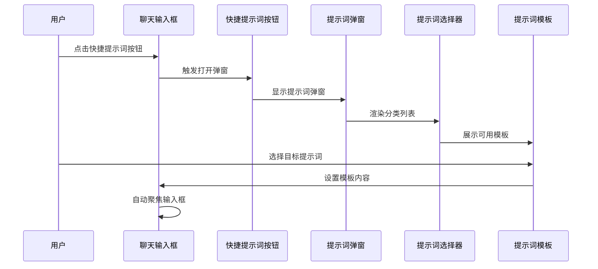
```mermaid
sequenceDiagram
participant User as 用户
participant ChatInput as 聊天输入框
participant PromptButton as 快捷提示词按钮
participant Modal as 提示词弹窗
participant Selector as 提示词选择器
participant Template as 提示词模板
User->>ChatInput : 点击快捷提示词按钮
ChatInput->>PromptButton : 触发打开弹窗
PromptButton->>Modal : 显示提示词弹窗
Modal->>Selector : 渲染分类列表
Selector->>Template : 展示可用模板
User->>Template : 选择目标提示词
Template->>ChatInput : 设置模板内容
ChatInput->>ChatInput : 自动聚焦输入框
```

**图表来源**
- [apps/web/components/ChatInput.tsx:30-37](file://apps/web/components/ChatInput.tsx#L30-L37)
- [apps/web/components/PromptSelectorModal.tsx:102-104](file://apps/web/components/PromptSelectorModal.tsx#L102-L104)

### 响应式设计实现

提示词选择器实现了完整的响应式设计，适配桌面端和移动端：

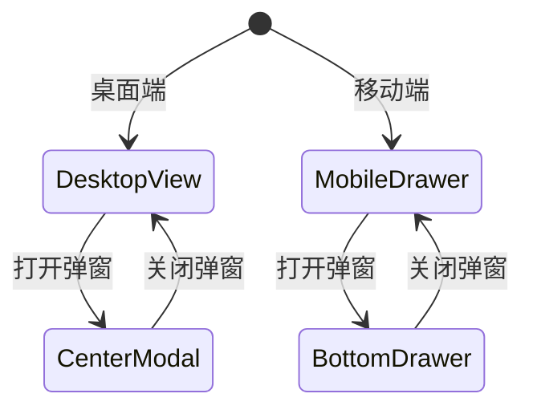
```mermaid
stateDiagram-v2
[*] --> DesktopView : 桌面端
[*] --> MobileDrawer : 移动端
DesktopView --> CenterModal : 打开弹窗
CenterModal --> DesktopView : 关闭弹窗
MobileDrawer --> BottomDrawer : 打开弹窗
BottomDrawer --> MobileDrawer : 关闭弹窗
```

**图表来源**
- [apps/web/components/PromptSelectorModal.tsx:38-74](file://apps/web/components/PromptSelectorModal.tsx#L38-L74)

**章节来源**
- [apps/web/config/prompts.ts:1-266](file://apps/web/config/prompts.ts#L1-L266)
- [apps/web/components/PromptSelector.tsx:1-106](file://apps/web/components/PromptSelector.tsx#L1-L106)
- [apps/web/components/PromptSelectorModal.tsx:1-116](file://apps/web/components/PromptSelectorModal.tsx#L1-L116)
- [apps/web/components/ChatInput.tsx:1-162](file://apps/web/components/ChatInput.tsx#L1-L162)

## 主题系统

### 主题提供者架构

应用程序实现了完整的主题系统，支持多种主题模式的动态切换：

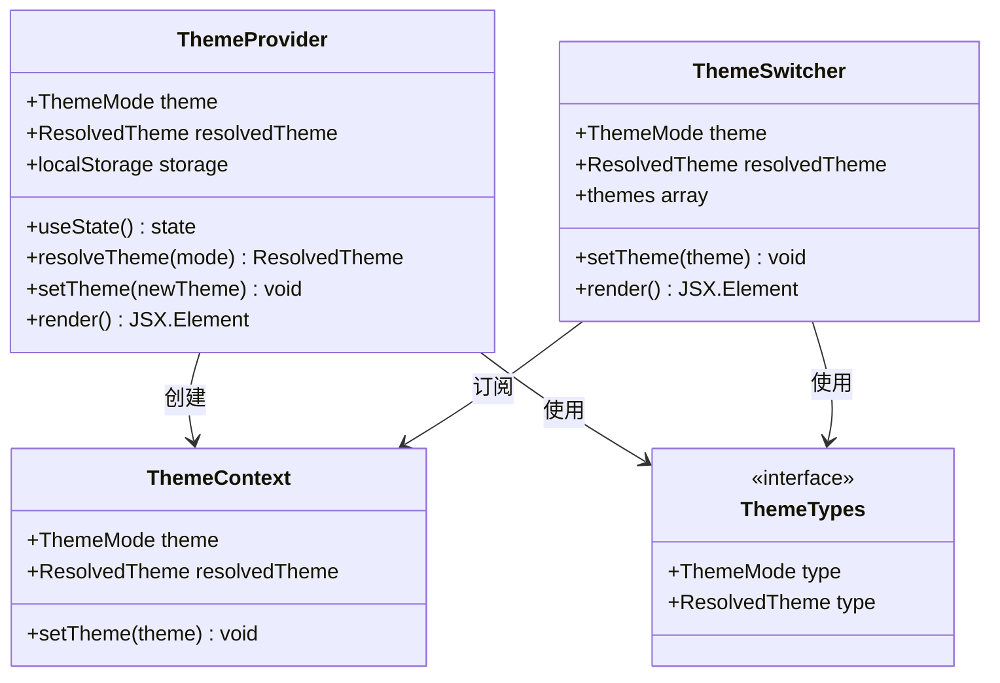
```mermaid
classDiagram
class ThemeProvider {
+ThemeMode theme
+ResolvedTheme resolvedTheme
+useState() state
+localStorage storage
+resolveTheme(mode) ResolvedTheme
+setTheme(newTheme) void
+render() JSX.Element
}
class ThemeContext {
+ThemeMode theme
+setTheme(theme) void
+ResolvedTheme resolvedTheme
}
class ThemeSwitcher {
+ThemeMode theme
+setTheme(theme) void
+ResolvedTheme resolvedTheme
+themes array
+render() JSX.Element
}
class ThemeTypes {
<<interface>>
+ThemeMode type
+ResolvedTheme type
}
ThemeProvider --> ThemeContext : 创建
ThemeProvider --> ThemeTypes : 使用
ThemeSwitcher --> ThemeContext : 订阅
ThemeSwitcher --> ThemeTypes : 使用
```

**图表来源**
- [apps/web/lib/theme/ThemeProvider.tsx:1-110](file://apps/web/lib/theme/ThemeProvider.tsx#L1-L110)
- [apps/web/lib/theme/ThemeContext.tsx:1-21](file://apps/web/lib/theme/ThemeContext.tsx#L1-L21)
- [apps/web/lib/theme/types.ts:1-10](file://apps/web/lib/theme/types.ts#L1-L10)
- [apps/web/components/ThemeSwitcher.tsx:1-42](file://apps/web/components/ThemeSwitcher.tsx#L1-L42)

### 主题模式支持

应用程序支持三种主题模式，每种模式都有其特定的使用场景：

| 模式类型 | 描述 | 特点 | 适用场景 |
|---------|------|------|----------|
| light | 浅色主题 | 明亮的界面，适合白天使用 | 日常办公、明亮环境 |
| dark | 深色主题 | 深色背景，减少眼部疲劳 | 夜晚使用、长时间工作 |
| system | 跟随系统 | 自动检测系统主题设置 | 多设备同步、用户偏好 |

### 主题持久化存储

主题设置通过 localStorage 实现持久化存储，确保用户偏好的一致性：

```mermaid
sequenceDiagram
participant User as 用户
participant ThemeSwitcher as 主题切换器
participant ThemeProvider as 主题提供者
participant LocalStorage as 本地存储
participant DOM as 文档对象
User->>ThemeSwitcher : 选择主题模式
ThemeSwitcher->>ThemeProvider : setTheme(mode)
ThemeProvider->>LocalStorage : 保存主题设置
LocalStorage-->>ThemeProvider : 确认保存
ThemeProvider->>DOM : 更新data-theme属性
DOM-->>User : 应用新主题
```

**图表来源**
- [apps/web/lib/theme/ThemeProvider.tsx:17-22](file://apps/web/lib/theme/ThemeProvider.tsx#L17-L22)
- [apps/web/lib/theme/ThemeProvider.tsx:47-56](file://apps/web/lib/theme/ThemeProvider.tsx#L47-L56)

**章节来源**
- [apps/web/lib/theme/ThemeProvider.tsx:1-110](file://apps/web/lib/theme/ThemeProvider.tsx#L1-L110)
- [apps/web/lib/theme/ThemeContext.tsx:1-21](file://apps/web/lib/theme/ThemeContext.tsx#L1-L21)
- [apps/web/lib/theme/types.ts:1-10](file://apps/web/lib/theme/types.ts#L1-L10)
- [apps/web/components/ThemeSwitcher.tsx:1-42](file://apps/web/components/ThemeSwitcher.tsx#L1-L42)

## 确认对话框组件

### 组件架构设计

确认对话框组件提供了统一的用户确认交互界面，支持多种变体和状态：

```mermaid
classDiagram
class ConfirmDialog {
+boolean isOpen
+string title
+string message
+string confirmText
+string cancelText
+Variant variant
+boolean isLoading
+onConfirm() void
+onCancel() void
+handleEscape(e) void
+render() JSX.Element
}
class ConfirmDialogProps {
+boolean isOpen
+string title
+string message
+string confirmText
+string cancelText
+variant Variant
+boolean isLoading
+onConfirm() void
+onCancel() void
}
class VariantStyles {
+danger styles
+warning styles
+info styles
}
ConfirmDialog --> ConfirmDialogProps : 接受
ConfirmDialog --> VariantStyles : 应用样式
```

**图表来源**
- [apps/web/components/ConfirmDialog.tsx:1-101](file://apps/web/components/ConfirmDialog.tsx#L1-L101)

### 对话框变体系统

组件支持三种预设的对话框变体，每种变体都有特定的视觉风格和用途：

| 变体类型 | 颜色方案 | 用途 | 触发条件 |
|---------|----------|------|----------|
| danger | 红色系 | 危险操作确认（删除、清除） | 数据删除、账户注销 |
| warning | 黄色系 | 警告性操作确认 | 设置更改、重要提醒 |
| info | 紫色系 | 信息提示和确认 | 功能说明、更新提示 |

### 交互行为设计

确认对话框实现了完整的用户交互体验，包括键盘导航和状态反馈：

```mermaid
stateDiagram-v2
[*] --> Closed : 组件初始化
Closed --> Opened : isOpen = true
Opened --> Processing : 点击确认
Processing --> Closed : 处理完成
Opened --> Closed : 点击取消
Opened --> Closed : 按ESC键
Processing --> Error : 处理失败
Error --> Processing : 重试
```

**图表来源**
- [apps/web/components/ConfirmDialog.tsx:28-40](file://apps/web/components/ConfirmDialog.tsx#L28-L40)
- [apps/web/components/ConfirmDialog.tsx:75-96](file://apps/web/components/ConfirmDialog.tsx#L75-L96)

**章节来源**
- [apps/web/components/ConfirmDialog.tsx:1-101](file://apps/web/components/ConfirmDialog.tsx#L1-L101)

## 钱包上下文注入

### 上下文注入流程

应用程序实现了钱包上下文注入功能，使AI能够感知当前用户的钱包地址：

```mermaid
sequenceDiagram
participant User as 用户
participant Wallet as 钱包连接
participant Page as 主页面
participant Hook as useChatStream
participant API as 聊天API
participant LLM as LLM工厂
User->>Wallet : 连接钱包
Wallet-->>Page : 提供address
Page->>Hook : 调用sendMessage(messages, address)
Hook->>API : POST /api/chat (含walletAddress)
API->>API : createSystemPrompt(walletAddress)
API->>LLM : chat(messages, tools, systemPrompt)
LLM-->>API : AI回复包含钱包上下文
API-->>Hook : 返回响应
Hook-->>Page : 更新UI
```

**图表来源**
- [apps/web/app/page.tsx:65-74](file://apps/web/app/page.tsx#L65-L74)
- [apps/web/hooks/useChatStream.ts:167-200](file://apps/web/hooks/useChatStream.ts#L167-L200)
- [apps/web/app/api/chat/route.ts:135-159](file://apps/web/app/api/chat/route.ts#L135-L159)

### 系统Prompt动态生成

API层实现了动态系统Prompt生成，根据是否存在钱包地址调整AI的行为：

```mermaid
flowchart TD
Start([接收聊天请求]) --> CheckWallet{"是否有walletAddress?"}
CheckWallet --> |否| BasePrompt["使用基础SYSTEM_PROMPT_BASE"]
CheckWallet --> |是| InjectContext["注入钱包上下文"]
InjectContext --> CombinePrompt["组合基础Prompt + 钱包信息"]
BasePrompt --> ReturnPrompt["返回System Prompt"]
CombinePrompt --> ReturnPrompt
```

**图表来源**
- [apps/web/app/api/chat/route.ts:135-148](file://apps/web/app/api/chat/route.ts#L135-L148)

### 连接状态管理

应用程序改进了连接状态管理，断开连接时清空UI但保留云端数据：

```mermaid
stateDiagram-v2
[*] --> Disconnected : 初始状态
Disconnected --> Connecting : 用户点击连接
Connecting --> Connected : 连接成功
Connected --> LoadingHistory : 加载对话历史
LoadingHistory --> Connected : 加载完成
Connected --> Disconnecting : 用户断开连接
Disconnecting --> ClearUI : 清空UI状态
ClearUI --> Disconnected : 返回初始状态
```

**图表来源**
- [apps/web/app/page.tsx:64-84](file://apps/web/app/page.tsx#L64-L84)

**章节来源**
- [apps/web/app/page.tsx:65-74](file://apps/web/app/page.tsx#L65-L74)
- [apps/web/hooks/useChatStream.ts:167-200](file://apps/web/hooks/useChatStream.ts#L167-L200)
- [apps/web/app/api/chat/route.ts:135-159](file://apps/web/app/api/chat/route.ts#L135-L159)
- [apps/web/lib/supabase/client.ts:34-53](file://apps/web/lib/supabase/client.ts#L34-L53)

## 内存管理策略

### 内存管理器架构

应用程序实现了两种内存管理策略，支持动态切换：

```mermaid
classDiagram
class MemoryManager {
<<interface>>
+addMessage(message) void
+getMessages() Message[]
+shouldCompress() boolean
+compress() Promise~void~
+clear() void
}
class SummaryCompressionMemory {
+Message[] originalMessages
+string summary
+MemoryConfig config
+isCompressing boolean
+addMessage(message) void
+getMessages() Message[]
+shouldCompress() boolean
+compress() Promise~void~
+generateSummary(messages) Promise~string~
+clear() void
}
class SlidingWindowMemory {
+Message[] messages
+number windowSize
+addMessage(message) void
+getMessages() Message[]
+shouldCompress() boolean
+compress() Promise~void~
+clear() void
}
MemoryManager <|.. SummaryCompressionMemory
MemoryManager <|.. SlidingWindowMemory
```

**图表来源**
- [apps/web/lib/memory/types.ts:12-37](file://apps/web/lib/memory/types.ts#L12-L37)
- [apps/web/lib/memory/SummaryCompressionMemory.ts:5-110](file://apps/web/lib/memory/SummaryCompressionMemory.ts#L5-L110)
- [apps/web/lib/memory/SlidingWindowMemory.ts:11-56](file://apps/web/lib/memory/SlidingWindowMemory.ts#L11-L56)

### 内存配置管理

内存管理器支持可配置的参数，包括压缩阈值、保留消息数和摘要模型：

```mermaid
classDiagram
class MemoryConfig {
+number compressThreshold
+number keepRecentCount
+string summaryModel
}
class Config {
+defaultMemoryConfig MemoryConfig
+createMemoryConfig(overrides) MemoryConfig
}
Config --> MemoryConfig : 创建
```

**图表来源**
- [apps/web/lib/memory/config.ts:3-14](file://apps/web/lib/memory/config.ts#L3-L14)

### 内存策略对比

| 策略类型 | 描述 | 压缩阈值 | 保留消息数 | 额外API调用 | 上下文质量 | 性能开销 |
|---------|------|----------|------------|-------------|------------|----------|
| L3摘要压缩 | 当消息达到阈值时，使用AI生成摘要，保留最近消息 | 10条 | 5条 | 是 | 高 | 中等 |
| L2滑动窗口 | 只保留最近N条消息，超出自动丢弃 | 无 | N条 | 否 | 中 | 极低 |

**章节来源**
- [apps/web/lib/memory/SummaryCompressionMemory.ts:1-111](file://apps/web/lib/memory/SummaryCompressionMemory.ts#L1-L111)
- [apps/web/lib/memory/SlidingWindowMemory.ts:1-57](file://apps/web/lib/memory/SlidingWindowMemory.ts#L1-L57)
- [apps/web/lib/memory/config.ts:1-15](file://apps/web/lib/memory/config.ts#L1-L15)
- [apps/web/lib/memory/types.ts:1-38](file://apps/web/lib/memory/types.ts#L1-L38)

## 智能欢迎消息处理

### 欢迎消息机制设计

应用程序实现了智能欢迎消息处理机制，优化了对话切换的用户体验：

```mermaid
classDiagram
class WelcomeMessageHandler {
+Message welcomeMessage
+checkFirstMessage(messages) boolean
+displayWelcomeIfNeeded(messages) Message[]
+generateWelcomeContent() string
+render() JSX.Element
}
class ConversationFlow {
+loadConversationHistory() void
+handleNewConversation() void
+handleSelectConversation() void
+displaySmartWelcome() void
}
class SmartWelcomeLogic {
+isNewConversation(messages) boolean
+hasHistory(messages) boolean
+showWelcomeMessage() boolean
+clearPreviousContent() void
}
WelcomeMessageHandler --> ConversationFlow : 控制
WelcomeMessageHandler --> SmartWelcomeLogic : 使用
ConversationFlow --> SmartWelcomeLogic : 评估
```

**图表来源**
- [apps/web/app/page.tsx:28-35](file://apps/web/app/page.tsx#L28-L35)
- [apps/web/app/page.tsx:101-111](file://apps/web/app/page.tsx#L101-L111)
- [apps/web/app/page.tsx:204-214](file://apps/web/app/page.tsx#L204-L214)

### 欢迎消息触发条件

智能欢迎消息在以下情况下自动显示：

```mermaid
flowchart TD
Start([用户操作]) --> CheckConnection{"钱包已连接?"}
CheckConnection --> |否| ShowWelcome["显示欢迎消息"]
CheckConnection --> |是| CheckAction{"操作类型?"}
CheckAction --> |新建对话| CheckHistory{"有历史消息?"}
CheckAction --> |切换对话| CheckHistory2{"有历史消息?"}
CheckHistory --> |否| ShowWelcome
CheckHistory --> |是| LoadHistory["加载历史消息"]
CheckHistory2 --> |否| ShowWelcome
CheckHistory2 --> |是| LoadHistory
ShowWelcome --> End([结束])
LoadHistory --> End
```

**图表来源**
- [apps/web/app/page.tsx:86-118](file://apps/web/app/page.tsx#L86-L118)
- [apps/web/app/page.tsx:195-215](file://apps/web/app/page.tsx#L195-L215)

### 欢迎消息内容管理

应用程序维护了固定的欢迎消息模板，确保用户获得一致的引导体验：

| 场景 | 欢迎消息内容 | 触发条件 | 显示逻辑 |
|------|-------------|----------|----------|
| 首次连接 | 基础功能介绍 + 价格查询 + 余额查询 + Gas查询 + Token查询 | 用户首次连接钱包 | 固定模板显示 |
| 新建对话 | 同上基础模板 | 用户点击新建对话按钮 | 清空当前内容后显示 |
| 切换到新对话 | 同上基础模板 | 用户从历史列表选择对话 | 清空前对话残留内容 |
| 切换到有历史对话 | 加载历史消息 | 用户选择有消息的对话 | 显示历史消息内容 |

### 对话切换用户体验优化

智能欢迎消息处理机制显著改善了用户的对话切换体验：

```mermaid
sequenceDiagram
participant User as 用户
participant History as 对话历史
participant Page as 主页面
participant Memory as 内存管理器
participant Welcome as 欢迎消息
User->>History : 点击新对话
History->>Page : onSelectConversation(id, [])
Page->>Memory : memoryManager.clear()
Page->>Welcome : setMessages([welcome])
Welcome-->>User : 显示智能欢迎消息
User->>History : 点击有历史对话
History->>Page : onSelectConversation(id, messages)
Page->>Memory : memoryManager.clear()
Page->>Page : setMessages(loadedMessages)
Page-->>User : 显示历史对话内容
```

**图表来源**
- [apps/web/app/page.tsx:195-215](file://apps/web/app/page.tsx#L195-L215)
- [apps/web/components/ConversationHistory.tsx:79-88](file://apps/web/components/ConversationHistory.tsx#L79-L88)

**章节来源**
- [apps/web/app/page.tsx:28-35](file://apps/web/app/page.tsx#L28-L35)
- [apps/web/app/page.tsx:86-118](file://apps/web/app/page.tsx#L86-L118)
- [apps/web/app/page.tsx:158-193](file://apps/web/app/page.tsx#L158-L193)
- [apps/web/app/page.tsx:195-215](file://apps/web/app/page.tsx#L195-L215)
- [apps/web/components/ConversationHistory.tsx:79-88](file://apps/web/components/ConversationHistory.tsx#L79-L88)

## UI设计与样式

### Web3企业风格设计

应用程序采用了现代化的Web3企业风格设计，具有以下特点：

- **科技蓝色调**：使用渐变的科技蓝色作为主色调，体现Web3技术特性
- **深色主题**：采用深色背景，减少视觉疲劳，适合长时间使用
- **毛玻璃效果**：大量使用backdrop-blur和透明度效果
- **微妙动画**：包含发光脉冲、滑入动画等微交互效果
- **响应式设计**：适配各种屏幕尺寸和设备

### 样式系统架构

```mermaid
graph TB
subgraph "样式层次"
Globals[globals.css]
Tailwind[tailwind.config.ts]
Components[组件样式]
Animations[动画效果]
Effects[视觉效果]
Theme[主题系统]
Welcome[欢迎消息样式]
Prompt[提示词样式]
</subgraph
subgraph "颜色系统"
Primary[primary: 科技蓝]
Web3[web3: 区块链品牌色]
Dark[dark: 深色主题]
Light[light: 浅色主题]
System[system: 系统主题]
</subgraph
subgraph "动画系统"
Glow[glow-pulse]
SlideIn[slide-in]
Cursor[pulse-cursor]
Selection[selection]
</subgraph
Globals --> Tailwind
Tailwind --> Components
Tailwind --> Animations
Tailwind --> Effects
Tailwind --> Theme
Components --> Welcome
Components --> Prompt
Components --> Primary
Components --> Web3
Components --> Dark
Components --> Light
Components --> System
Animations --> Glow
Animations --> SlideIn
Effects --> Cursor
Effects --> Selection
```

**图表来源**
- [apps/web/app/globals.css:1-571](file://apps/web/app/globals.css#L1-L571)
- [apps/web/tailwind.config.ts:1-99](file://apps/web/tailwind.config.ts#L1-L99)

### 主题系统集成

主题系统与现有UI组件完美集成，实现了响应式的主题切换：

```mermaid
sequenceDiagram
participant User as 用户
participant ThemeSwitcher as 主题切换器
participant ThemeProvider as 主题提供者
participant RainbowKit as 钱包组件库
participant UI as 用户界面
User->>ThemeSwitcher : 选择主题模式
ThemeSwitcher->>ThemeProvider : setTheme(mode)
ThemeProvider->>ThemeProvider : 解析主题模式
ThemeProvider->>RainbowKit : 更新钱包组件主题
RainbowKit-->>UI : 应用新主题样式
UI-->>User : 显示更新后的界面
```

**图表来源**
- [apps/web/app/providers.tsx:45-68](file://apps/web/app/providers.tsx#L45-L68)
- [apps/web/lib/theme/ThemeProvider.tsx:47-56](file://apps/web/lib/theme/ThemeProvider.tsx#L47-L56)

### 提示词选择器样式设计

**新增** 提示词选择器实现了专业的Web3企业风格设计：

- **分类标题**：使用语义化图标和标签，清晰区分不同查询场景
- **模板卡片**：采用圆角设计和悬停效果，提供直观的视觉反馈
- **使用按钮**：隐藏在卡片右侧，悬停时才显示，保持界面简洁
- **响应式布局**：桌面端居中弹窗，移动端底部抽屉，适配不同设备
- **动画过渡**：平滑的打开/关闭动画，提升用户体验

### Markdown渲染样式

Markdown渲染器提供了完整的语法支持和美观的样式：

- **标题层级**：h1-h3使用不同的字体大小和颜色
- **列表样式**：支持有序和无序列表，带项目符号
- **代码块**：支持内联代码和代码块，带语法高亮
- **表格**：响应式表格，支持滚动
- **链接**：悬停效果和下划线动画
- **引用**：左侧边框和斜体样式
- **图片处理**：特殊处理token logo图片，支持内联显示

### Favicon配置

**新增** 应用程序现在包含了完整的favicon配置，提升了品牌识别度：

- **多格式支持**：支持.ico、.png、apple-touch-icon等多种格式
- **响应式图标**：针对不同设备和浏览器优化
- **品牌一致性**：与整体UI设计风格保持一致
- **加载优化**：通过layout.tsx中的metadata配置实现快速加载

**章节来源**
- [apps/web/app/globals.css:1-571](file://apps/web/app/globals.css#L1-L571)
- [apps/web/tailwind.config.ts:1-99](file://apps/web/tailwind.config.ts#L1-L99)
- [apps/web/components/MarkdownRenderer.tsx:1-160](file://apps/web/components/MarkdownRenderer.tsx#L1-L160)
- [apps/web/components/ThemeSwitcher.tsx:1-42](file://apps/web/components/ThemeSwitcher.tsx#L1-L42)
- [apps/web/components/PromptSelector.tsx:1-106](file://apps/web/components/PromptSelector.tsx#L1-L106)
- [apps/web/components/PromptSelectorModal.tsx:1-116](file://apps/web/components/PromptSelectorModal.tsx#L1-L116)
- [apps/web/app/layout.tsx:12-20](file://apps/web/app/layout.tsx#L12-L20)
- [apps/web/public/favicon.ico](file://apps/web/public/favicon.ico)

## CSS处理依赖变更

### 依赖迁移影响分析

**更新** CSS处理依赖（autoprefixer、postcss、tailwindcss）已从开发依赖迁移到生产依赖，这对应用的构建和运行时依赖产生了重要影响：

```mermaid
graph TB
subgraph "迁移前 (开发依赖)"
DevAutoprefixer[autoprefixer]
DevPostCSS[postcss]
DevTailwind[tailwindcss]
DevAutoprefixer -.-> DevPostCSS
DevPostCSS -.-> DevTailwind
end
subgraph "迁移后 (生产依赖)"
ProdAutoprefixer[autoprefixer]
ProdPostCSS[postcss]
ProdTailwind[tailwindcss]
ProdAutoprefixer --> ProdPostCSS
ProdPostCSS --> ProdTailwind
end
subgraph "应用影响"
BuildProcess[构建过程]
Runtime[运行时]
BuildProcess --> ProdAutoprefixer
BuildProcess --> ProdPostCSS
BuildProcess --> ProdTailwind
Runtime --> ProdTailwind
end
```

**图表来源**
- [apps/web/package.json:33-35](file://apps/web/package.json#L33-L35)
- [apps/web/postcss.config.js:1-7](file://apps/web/postcss.config.js#L1-L7)

### 构建时影响

CSS处理依赖迁移到生产依赖后，对构建过程产生了以下影响：

1. **构建时CSS处理**：所有CSS文件在构建时都会经过PostCSS和Autoprefixer处理
2. **Tailwind CSS编译**：Tailwind的content扫描和CSS生成在构建时完成
3. **样式优化**：浏览器前缀自动添加和CSS优化在构建时完成
4. **依赖树完整性**：生产环境下的依赖树包含完整的CSS处理能力

### 运行时影响

迁移对运行时也产生了重要影响：

1. **运行时CSS处理**：应用启动时不再需要额外的CSS处理步骤
2. **性能提升**：减少了运行时的CSS处理开销
3. **稳定性增强**：CSS处理逻辑更加稳定，不受开发环境影响
4. **部署简化**：生产环境部署时不需要额外的CSS处理配置

### 配置文件分析

CSS处理依赖的迁移体现在以下配置文件中：

```mermaid
classDiagram
class PostCSSConfig {
+plugins object
+tailwindcss plugin
+autoprefixer plugin
+processCSS() void
}
class TailwindConfig {
+darkMode string
+content array
+theme object
+extend colors
+extend animations
+extend shadows
}
class PackageJSON {
+dependencies object
+autoprefixer version
+postcss version
+tailwindcss version
}
PostCSSConfig --> TailwindConfig : 配置
PackageJSON --> PostCSSConfig : 依赖
PackageJSON --> TailwindConfig : 依赖
```

**图表来源**
- [apps/web/postcss.config.js:1-7](file://apps/web/postcss.config.js#L1-L7)
- [apps/web/tailwind.config.ts:1-99](file://apps/web/tailwind.config.ts#L1-L99)
- [apps/web/package.json:33-35](file://apps/web/package.json#L33-L35)

### 影响范围评估

这次CSS处理依赖的迁移影响范围包括：

- **构建脚本**：所有构建相关的脚本现在都依赖这些CSS处理工具
- **部署流程**：生产环境部署时不再需要额外的CSS处理步骤
- **性能监控**：运行时性能得到提升，CSS处理开销减少
- **错误排查**：CSS相关问题的排查范围扩大到生产依赖
- **版本兼容**：需要确保这些CSS处理工具的版本兼容性

**章节来源**
- [apps/web/package.json:33-35](file://apps/web/package.json#L33-L35)
- [apps/web/postcss.config.js:1-7](file://apps/web/postcss.config.js#L1-L7)
- [apps/web/tailwind.config.ts:1-99](file://apps/web/tailwind.config.ts#L1-L99)

## 依赖关系分析

### 技术栈依赖

应用程序使用了现代前端技术栈，具有清晰的依赖层次结构：

```mermaid
graph TB
subgraph "运行时依赖"
Next[Next.js 14.2.0]
React[React ^18.2.0]
Ethers[Ethers ^6.11.0]
AI[AI SDK ^3.0.0]
Markdown[react-markdown ^10.1.0]
Remark[remark-gfm ^4.0.1]
RainbowKit[RainbowKit ^2.2.10]
TanStackQuery[@tanstack/react-query ^5.99.2]
Wagmi[wagmi ^2.19.5]
</subgraph
subgraph "工作区包"
AIConfig[@web3-ai-agent/ai-config]
Web3Tools[@web3-ai-agent/web3-tools]
</subgraph
subgraph "开发依赖"
TypeScript[TypeScript ^5]
Tailwind[Tailwind CSS ^3.4.1]
PostCSS[PostCSS ^8.4.35]
ESLint[ESLint ^8]
</subgraph
Next --> React
Next --> AI
Next --> Ethers
Next --> AIConfig
Next --> Web3Tools
Next --> Markdown
Next --> Remark
Next --> RainbowKit
Next --> TanStackQuery
Next --> Wagmi
```

**图表来源**
- [apps/web/package.json:14-49](file://apps/web/package.json#L14-L49)

### Monorepo 管理

项目使用 Turborepo 进行多包管理，实现了高效的构建和开发流程：

```mermaid
graph LR
subgraph "Turborepo配置"
Build[build任务]
Dev[dev任务]
Lint[lint任务]
TypeCheck[type-check任务]
</subgraph
subgraph "工作空间"
Apps[apps/*]
Packages[packages/*]
</subgraph
Build --> Dev
Dev --> Lint
Lint --> TypeCheck
Apps --> Build
Packages --> Build
```

**图表来源**
- [turbo.json:1-21](file://turbo.json#L1-L21)
- [pnpm-workspace.yaml:1-4](file://pnpm-workspace.yaml#L1-L4)

**章节来源**
- [apps/web/package.json:14-49](file://apps/web/package.json#L14-L49)
- [turbo.json:1-21](file://turbo.json#L1-L21)
- [pnpm-workspace.yaml:1-4](file://pnpm-workspace.yaml#L1-L4)

## 性能考虑

### 缓存策略

应用实现了多层次的缓存机制来优化性能：

1. **API 缓存**: 使用 Next.js 的 revalidate 机制缓存外部 API 响应
2. **区块链数据缓存**: 通过 RPC 提供商的内置缓存减少网络请求
3. **组件渲染优化**: 使用 React 的 memoization 和状态管理避免不必要的重渲染
4. **内存管理优化**: 支持两种内存策略，平衡性能和上下文质量
5. **主题持久化**: 使用 localStorage 减少主题切换的计算开销
6. **钱包上下文缓存**: 使用内存变量存储当前钱包地址，避免重复验证
7. **欢迎消息缓存**: 固定的欢迎消息模板减少重复计算
8. **提示词模板缓存**: 分类化的提示词模板减少重复渲染
9. **Markdown渲染缓存**: react-markdown的高效渲染引擎
10. **favicon缓存**: 通过浏览器缓存机制提升加载速度
11. **CSS处理缓存**: CSS处理依赖迁移到生产依赖后，构建时的CSS处理结果被缓存

### 网络优化

- **并发工具调用**: 支持同时执行多个工具调用以提高响应速度
- **流式输出**: 使用SSE实现流式响应，提供更好的用户体验
- **错误恢复**: 实现了健壮的错误处理和重试机制
- **资源压缩**: 使用 Tailwind CSS 和 PostCSS 优化样式文件大小
- **连接持久化**: 通过cookie实现跨页面刷新的连接持久化

### 移动端适配

应用采用了响应式设计，确保在各种设备上都有良好的用户体验：

- **自适应布局**: 使用 Flexbox 和 Grid 实现灵活的布局
- **触摸友好**: 优化了触摸交互元素的尺寸和间距
- **性能优化**: 在移动设备上限制动画效果以节省资源
- **内存策略**: 支持轻量级的滑动窗口策略，适合移动设备

## 故障排除指南

### 常见问题及解决方案

#### 1. LLM 配置错误

**症状**: API 返回配置错误信息
**原因**: 缺少必要的环境变量或 API 密钥配置
**解决方案**:
- 检查 `.env` 文件中的 LLM 配置
- 确认 API 密钥的有效性
- 验证网络连接和代理设置

#### 2. 区块链 RPC 连接失败

**症状**: 钱包余额查询或 Gas 价格获取失败
**原因**: RPC 服务不可用或网络问题
**解决方案**:
- 切换到备用 RPC 提供商
- 检查防火墙和网络设置
- 验证 RPC URL 的正确性

#### 3. 工具调用超时

**症状**: 工具执行时间过长或无响应
**原因**: 外部 API 响应慢或网络延迟
**解决方案**:
- 实现超时机制和重试逻辑
- 使用负载均衡的 RPC 提供商
- 优化工具调用的并发数量

#### 4. 内存管理问题

**症状**: 内存使用过高或上下文丢失
**原因**: 内存策略配置不当
**解决方案**:
- 切换到滑动窗口策略以减少内存使用
- 调整压缩阈值和保留消息数
- 监控内存使用情况并定期清理

#### 5. 主题系统问题

**症状**: 主题切换无效或显示异常
**原因**: localStorage 权限问题或主题提供者配置错误
**解决方案**:
- 检查浏览器的 localStorage 权限
- 验证 ThemeProvider 的正确嵌套
- 确认主题模式的兼容性

#### 6. 确认对话框问题

**症状**: 对话框无法关闭或点击无效
**原因**: 事件处理冲突或状态管理问题
**解决方案**:
- 检查对话框的 isOpen 状态
- 验证事件监听器的正确绑定
- 确认阻止事件冒泡的实现

#### 7. 钱包上下文问题

**症状**: AI无法识别用户钱包地址或余额查询失败
**原因**: 钱包地址格式验证失败或上下文未正确注入
**解决方案**:
- 检查钱包连接状态和地址格式
- 验证 setWalletContext 的调用时机
- 确认 sendMessage 是否正确传递 walletAddress

#### 8. 欢迎消息显示问题

**症状**: 新对话切换时显示之前对话的内容
**原因**: 消息状态管理或内存清理不彻底
**解决方案**:
- 确保 memoryManager.clear() 在切换对话前调用
- 验证 handleSelectConversation 中的消息重置逻辑
- 检查欢迎消息的条件判断是否正确

#### 9. 提示词选择器问题

**症状**: 快捷提示词按钮无效或弹窗无法打开
**原因**: 状态管理或事件处理问题
**解决方案**:
- 检查 isPromptSelectorOpen 状态
- 验证 handlePromptSelect 函数的实现
- 确认 PromptSelectorModal 的 isOpen 属性绑定

#### 10. Markdown渲染问题

**症状**: Markdown内容显示异常或样式错乱
**原因**: react-markdown版本兼容性或样式冲突
**解决方案**:
- 检查react-markdown和remark-gfm的版本兼容性
- 验证自定义组件样式的正确性
- 确认主题切换对渲染器的影响

#### 11. Favicon加载问题

**症状**: 网站图标显示异常或加载失败
**原因**: favicon路径配置错误或缓存问题
**解决方案**:
- 检查favicon.ico文件的存在性和路径
- 验证layout.tsx中的metadata配置
- 清除浏览器缓存重新加载

#### 12. CSS处理依赖问题

**症状**: 样式编译失败或CSS处理错误
**原因**: CSS处理依赖版本不兼容或配置错误
**解决方案**:
- 检查autoprefixer、postcss、tailwindcss的版本兼容性
- 验证postcss.config.js和tailwind.config.ts的配置
- 确认CSS处理依赖已正确迁移到生产依赖
- 清理node_modules和重新安装依赖

#### 13. ChatInput组件测试问题

**症状**: 占位符文本不正确或按钮查询匹配失败
**原因**: 测试用例中的选择器过于宽泛或占位符文本不匹配
**解决方案**:
- 更新占位符文本为'问我任何Web3问题'
- 使用明确的按钮名称'发送消息'进行查询
- 验证isLoading状态下的禁用行为
- 确保输入框和按钮在加载状态下都被正确禁用

**章节来源**
- [apps/web/app/api/chat/route.ts:360-404](file://apps/web/app/api/chat/route.ts#L360-L404)
- [apps/web/app/api/tools/route.ts:124-133](file://apps/web/app/api/tools/route.ts#L124-L133)
- [apps/web/lib/memory/SummaryCompressionMemory.ts:48-74](file://apps/web/lib/memory/SummaryCompressionMemory.ts#L48-L74)
- [apps/web/lib/theme/ThemeProvider.tsx:17-22](file://apps/web/lib/theme/ThemeProvider.tsx#L17-L22)
- [apps/web/components/ConfirmDialog.tsx:28-40](file://apps/web/components/ConfirmDialog.tsx#L28-L40)
- [apps/web/lib/supabase/client.ts:34-53](file://apps/web/lib/supabase/client.ts#L34-L53)
- [apps/web/app/page.tsx:195-215](file://apps/web/app/page.tsx#L195-L215)
- [apps/web/components/PromptSelectorModal.tsx:18-33](file://apps/web/components/PromptSelectorModal.tsx#L18-L33)
- [apps/web/components/MarkdownRenderer.tsx:114-152](file://apps/web/components/MarkdownRenderer.tsx#L114-L152)
- [apps/web/app/layout.tsx:15-19](file://apps/web/app/layout.tsx#L15-L19)
- [apps/web/package.json:33-35](file://apps/web/package.json#L33-L35)
- [apps/web/components/ChatInput.test.tsx:1-59](file://apps/web/components/ChatInput.test.tsx#L1-L59)

## 结论

这个 Web3 AI Agent 应用程序展示了现代 Web3 应用开发的最佳实践，成功地将 AI 智能推理与区块链数据查询相结合。项目具有以下特点：

### 技术优势
- **模块化架构**: 清晰的组件分离和职责划分
- **类型安全**: 完整的 TypeScript 类型定义
- **性能优化**: 多层次的缓存和优化策略
- **可扩展性**: 基于 Monorepo 的包管理架构
- **内存管理**: 支持两种策略的智能内存管理
- **UI设计**: 采用Web3企业风格的现代化界面
- **主题系统**: 完整的多主题支持和响应式切换
- **交互体验**: 统一的确认对话框组件
- **钱包集成**: 完整的钱包上下文注入功能
- **智能欢迎消息**: 优化的对话切换用户体验
- **提示词系统**: 完整的快捷查询入口，显著提升用户体验
- **Markdown渲染**: 增强的消息内容展示功能
- **favicon配置**: 提升应用的品牌识别度
- **CSS处理优化**: CSS处理依赖迁移到生产依赖，提升构建和运行时性能

### 功能特色
- **智能工具调用**: AI 模型能够自动选择和执行合适的工具
- **实时数据**: 支持实时的区块链数据查询
- **Markdown渲染**: 完整的Markdown语法支持
- **内存策略管理**: 用户可自定义的内存管理策略
- **流式输出**: SSE流式响应提供更好的用户体验
- **响应式设计**: 适配各种设备和屏幕尺寸
- **主题定制**: 支持浅色、深色和跟随系统的主题切换
- **确认交互**: 统一的确认对话框提供更好的用户体验
- **钱包感知**: AI能够感知用户钱包地址，简化余额查询流程
- **连接管理**: 断开连接时优雅清空UI但保留云端数据
- **智能欢迎消息**: 新对话切换时自动显示引导内容，避免残留内容干扰
- **提示词选择**: 快速的Web3查询入口，提供便捷的操作体验
- **品牌标识**: 完整的favicon配置，提升用户体验的一致性
- **CSS处理优化**: 生产环境下的CSS处理更加稳定和高效

### 发展前景
该应用程序为 Web3 开发者提供了一个强大的信息查询平台，未来可以扩展更多 Web3 工具和服务，进一步提升用户体验和功能性。通过持续的优化和功能扩展，这个项目有望成为 Web3 生态系统中的重要工具。

**更新** 本次更新重点集成了完整的提示词选择系统，包括PromptSelectorModal和PromptSelector组件，显著增强了ChatInput组件的功能；新增了分类化的提示词模板管理，支持价格查询、余额查询、Gas查询、Token查询和转账操作等多种Web3场景；完善了移动端适配，采用底部抽屉式设计；优化了用户交互体验，提供更便捷的快捷查询入口；**新增了完整的提示词选择系统，通过分类化的模板管理和响应式设计，为用户提供了专业的企业级Web3查询体验**。同时，改进了Markdown渲染功能，增强了消息内容的展示效果，并完善了favicon配置，提升了应用的品牌识别度和用户体验一致性。

**新增** 本次更新还特别关注了CSS处理依赖的重要变更，将autoprefixer、postcss、tailwindcss从开发依赖迁移到生产依赖，这一变更显著提升了应用的构建和运行时性能，减少了运行时的CSS处理开销，增强了生产环境的稳定性，并简化了部署流程。这一变化体现了项目对性能优化和开发效率的持续改进承诺。

**新增** ChatInput组件测试的增强体现了项目对用户体验细节的关注，包括占位符文本的优化、按钮查询的精确命名以及加载状态的完整测试覆盖，这些改进共同提升了应用的易用性和可靠性。