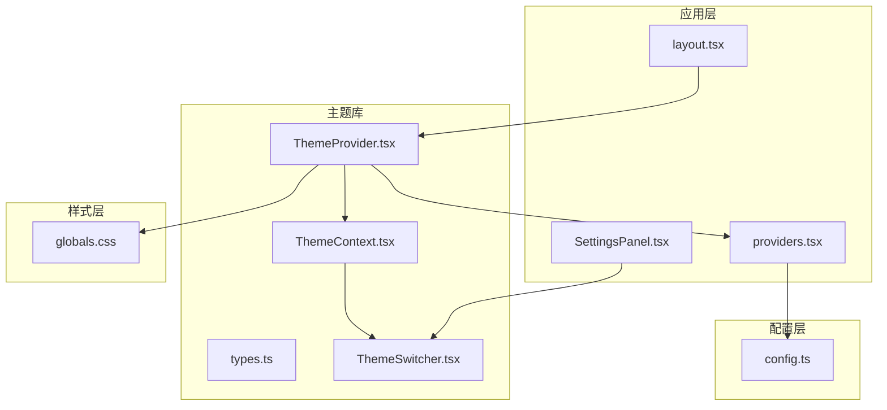
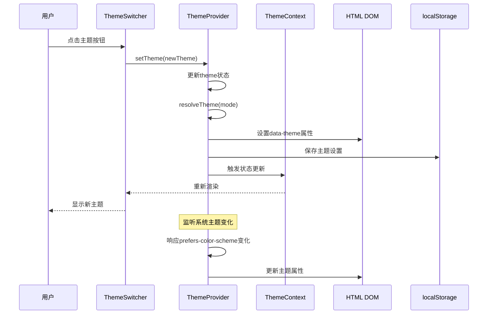
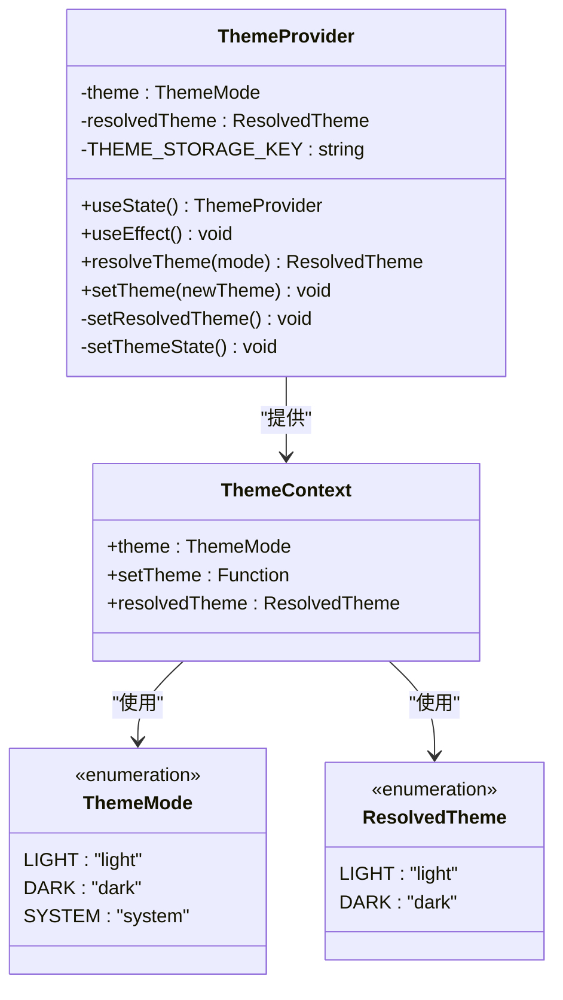
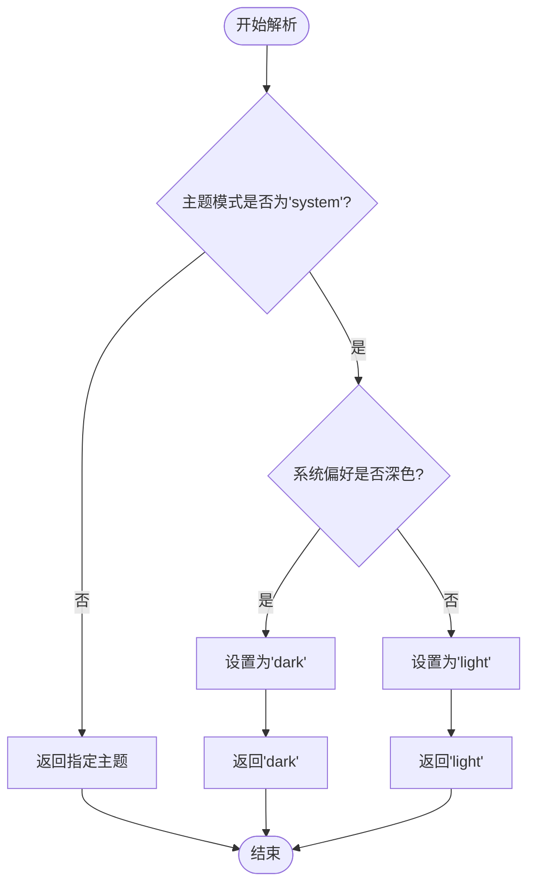
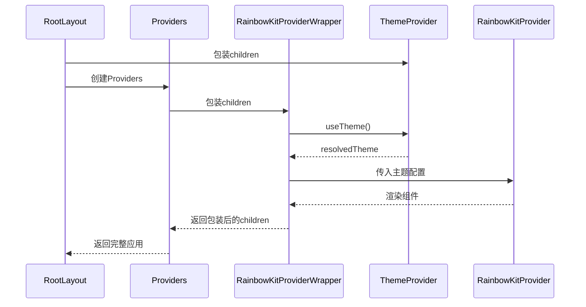
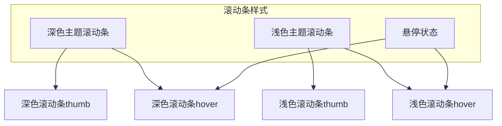
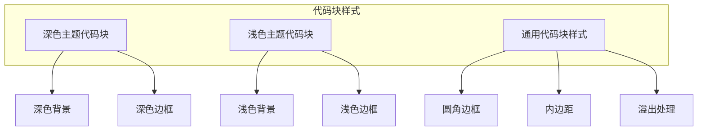
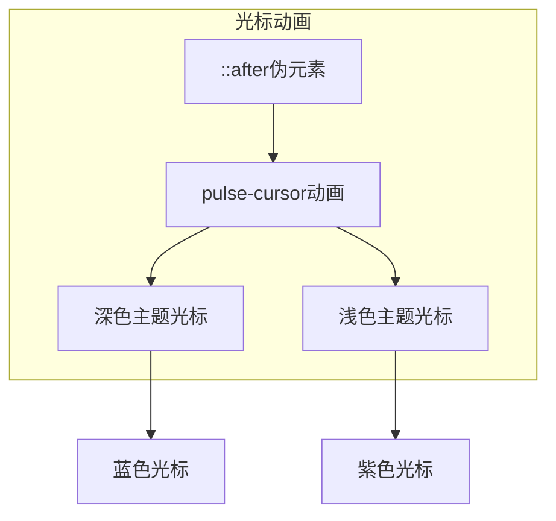
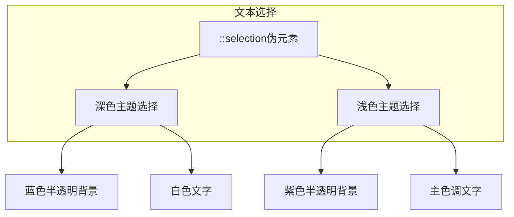
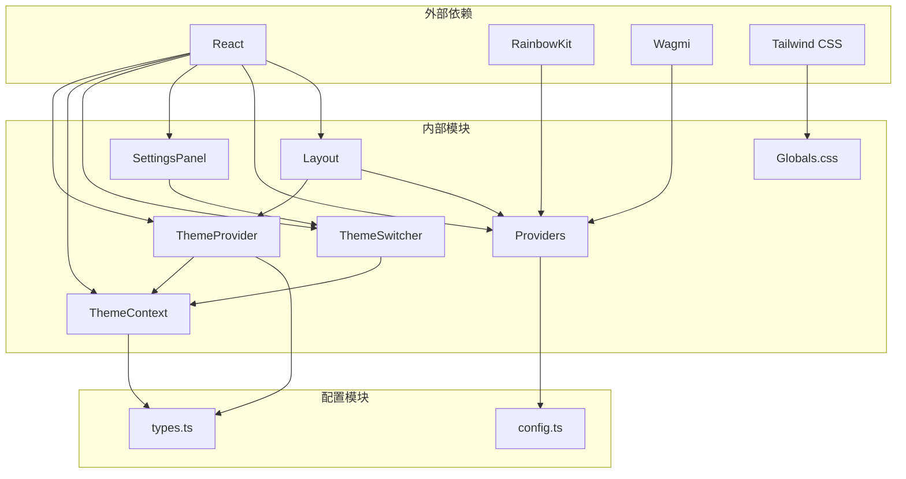

# 主题系统实现

<cite>
**本文档引用的文件**
- [ThemeSwitcher.tsx](file://apps/web/components/ThemeSwitcher.tsx)
- [ThemeProvider.tsx](file://apps/web/lib/theme/ThemeProvider.tsx)
- [ThemeContext.tsx](file://apps/web/lib/theme/ThemeContext.tsx)
- [types.ts](file://apps/web/lib/theme/types.ts)
- [providers.tsx](file://apps/web/app/providers.tsx)
- [layout.tsx](file://apps/web/app/layout.tsx)
- [globals.css](file://apps/web/app/globals.css)
- [SettingsPanel.tsx](file://apps/web/components/SettingsPanel.tsx)
- [config.ts](file://apps/web/app/config.ts)
</cite>

## 更新摘要
**变更内容**
- 新增全面的CSS变量主题系统支持
- 添加滚动条主题适配功能
- 实现代码块主题样式切换
- 集成光标动画主题适配
- 优化文本选择主题样式
- 增强RainbowKit组件主题一致性

## 目录
1. [简介](#简介)
2. [项目结构](#项目结构)
3. [核心组件](#核心组件)
4. [架构概览](#架构概览)
5. [详细组件分析](#详细组件分析)
6. [CSS变量主题系统](#css变量主题系统)
7. [依赖关系分析](#依赖关系分析)
8. [性能考虑](#性能考虑)
9. [故障排除指南](#故障排除指南)
10. [结论](#结论)

## 简介

本文档详细分析了AI Agent项目中的主题系统实现。该系统提供了完整的深色/浅色/系统跟随主题切换功能，集成了RainbowKit钱包连接组件的主题适配，并通过CSS变量实现了平滑的主题切换动画效果。

**更新** 主题系统已进行全面升级，新增了滚动条、代码块、光标动画和文本选择等全方位的主题适配功能，通过CSS变量系统实现了更加精细和一致的主题体验。

主题系统采用React Context模式构建，具有以下特点：
- 支持三种主题模式：深色、浅色、系统跟随
- 自动检测系统主题偏好并实时响应变化
- 本地存储持久化用户偏好设置
- 与RainbowKit组件库无缝集成
- 基于CSS变量的主题切换机制
- 全面的UI组件主题适配

## 项目结构

主题系统主要分布在以下目录结构中：



**图表来源**
- [layout.tsx:17-37](file://apps/web/app/layout.tsx#L17-L37)
- [ThemeProvider.tsx:13-67](file://apps/web/lib/theme/ThemeProvider.tsx#L13-L67)
- [ThemeContext.tsx:12-20](file://apps/web/lib/theme/ThemeContext.tsx#L12-L20)

**章节来源**
- [layout.tsx:1-38](file://apps/web/app/layout.tsx#L1-L38)
- [providers.tsx:1-69](file://apps/web/app/providers.tsx#L1-L69)

## 核心组件

### 主题提供者 (ThemeProvider)

主题提供者是整个主题系统的核心组件，负责管理主题状态和提供主题相关的功能。

**关键特性：**
- 状态管理：维护当前主题模式和解析后的实际主题
- 生命周期：处理主题初始化、系统主题监听、状态持久化
- DOM操作：动态更新HTML元素的主题属性
- 本地存储：使用localStorage保存用户偏好设置

**状态结构：**
- `theme`: 当前主题模式 ('light' | 'dark' | 'system')
- `resolvedTheme`: 解析后的实际主题 ('light' | 'dark')

**章节来源**
- [ThemeProvider.tsx:13-67](file://apps/web/lib/theme/ThemeProvider.tsx#L13-L67)

### 主题上下文 (ThemeContext)

提供React Context接口，封装主题状态和操作方法。

**导出方法：**
- `useTheme()`: 获取主题上下文钩子
- `ThemeContext`: 主题上下文对象

**错误处理：**
- 提供明确的错误提示，确保在Provider外部使用时能及时发现

**章节来源**
- [ThemeContext.tsx:12-20](file://apps/web/lib/theme/ThemeContext.tsx#L12-L20)

### 主题切换器 (ThemeSwitcher)

用户界面组件，提供直观的主题切换按钮。

**支持的主题：**
- 系统跟随 (🖥️)
- 浅色模式 (☀️)  
- 深色模式 (🌙)

**交互设计：**
- 响应式网格布局
- 视觉反馈：选中状态的紫色边框和背景
- 实时显示当前解析后的主题

**章节来源**
- [ThemeSwitcher.tsx:6-41](file://apps/web/components/ThemeSwitcher.tsx#L6-L41)

## 架构概览

主题系统的整体架构采用分层设计，确保各组件职责清晰且松耦合。



**图表来源**
- [ThemeSwitcher.tsx:22-28](file://apps/web/components/ThemeSwitcher.tsx#L22-L28)
- [ThemeProvider.tsx:58-60](file://apps/web/lib/theme/ThemeProvider.tsx#L58-L60)
- [ThemeProvider.tsx:47-56](file://apps/web/lib/theme/ThemeProvider.tsx#L47-L56)

## 详细组件分析

### 主题提供者实现分析

主题提供者使用React Hooks实现完整的主题管理逻辑：



**图表来源**
- [ThemeProvider.tsx:13-67](file://apps/web/lib/theme/ThemeProvider.tsx#L13-L67)
- [ThemeContext.tsx:6-10](file://apps/web/lib/theme/ThemeContext.tsx#L6-L10)
- [types.ts:4-9](file://apps/web/lib/theme/types.ts#L4-L9)

#### 主题解析算法

主题解析过程采用递归解析策略：



**图表来源**
- [ThemeProvider.tsx:25-30](file://apps/web/lib/theme/ThemeProvider.tsx#L25-L30)

**章节来源**
- [ThemeProvider.tsx:18-56](file://apps/web/lib/theme/ThemeProvider.tsx#L18-L56)

### RainbowKit主题集成

主题系统与RainbowKit钱包连接组件深度集成，确保UI一致性：



**图表来源**
- [providers.tsx:45-68](file://apps/web/app/providers.tsx#L45-L68)
- [layout.tsx:31-33](file://apps/web/app/layout.tsx#L31-L33)

**章节来源**
- [providers.tsx:45-68](file://apps/web/app/providers.tsx#L45-L68)

## CSS变量主题系统

**更新** 主题系统已实现全面的CSS变量主题适配，覆盖了滚动条、代码块、光标动画和文本选择等多个UI组件。

### CSS变量定义

系统使用CSS变量实现主题切换，支持深色和浅色两种主题模式：

```mermaid
graph LR
subgraph "CSS变量定义"
DarkRoot[:root, [data-theme='dark']]
LightRoot:[data-theme='light']
end
subgraph "颜色变量"
Foreground[--foreground-rgb]
BackgroundStart[--background-start-rgb]
BackgroundEnd[--background-end-rgb]
AccentColor[--accent-color]
BgPrimary[--bg-primary]
BgSecondary[--bg-secondary]
BgTertiary[--bg-tertiary]
TextColorPrimary[--text-primary]
TextColorSecondary[--text-secondary]
TextColorMuted[--text-muted]
BorderColor[--border-color]
end
subgraph "组件样式"
Body[body样式]
Scrollbar[滚动条样式]
Markdown[Markdown样式]
Cursor[光标动画]
Selection[文本选择]
end
DarkRoot --> Foreground
DarkRoot --> BackgroundStart
DarkRoot --> BackgroundEnd
DarkRoot --> AccentColor
DarkRoot --> BgPrimary
DarkRoot --> BgSecondary
DarkRoot --> BgTertiary
DarkRoot --> TextColorPrimary
DarkRoot --> TextColorSecondary
DarkRoot --> TextColorMuted
DarkRoot --> BorderColor
LightRoot --> Foreground
LightRoot --> BackgroundStart
LightRoot --> BackgroundEnd
LightRoot --> AccentColor
LightRoot --> BgPrimary
LightRoot --> BgSecondary
LightRoot --> BgTertiary
LightRoot --> TextColorPrimary
LightRoot --> TextColorSecondary
LightRoot --> TextColorMuted
LightRoot --> BorderColor
Foreground --> Body
BackgroundStart --> Body
BackgroundEnd --> Body
AccentColor --> Body
BgPrimary --> Body
BgSecondary --> Body
BgTertiary --> Body
TextColorPrimary --> Body
TextColorSecondary --> Body
TextColorMuted --> Body
BorderColor --> Body
AccentColor --> Scrollbar
AccentColor --> Markdown
AccentColor --> Cursor
AccentColor --> Selection
```

**图表来源**
- [globals.css:5-34](file://apps/web/app/globals.css#L5-L34)
- [globals.css:48-175](file://apps/web/app/globals.css#L48-L175)

### 滚动条主题适配

系统为深色和浅色主题分别定义了滚动条样式：



**图表来源**
- [globals.css:48-71](file://apps/web/app/globals.css#L48-L71)

### 代码块主题样式

Markdown代码块根据主题自动调整样式：



**图表来源**
- [globals.css:87-110](file://apps/web/app/globals.css#L87-L110)

### 光标动画主题适配

流式输出光标动画根据主题调整颜色：



**图表来源**
- [globals.css:113-133](file://apps/web/app/globals.css#L113-L133)

### 文本选择主题样式

文本选择高亮效果根据主题自动适配：



**图表来源**
- [globals.css:165-175](file://apps/web/app/globals.css#L165-L175)

**章节来源**
- [globals.css:1-175](file://apps/web/app/globals.css#L1-L175)

## 依赖关系分析

主题系统的依赖关系呈现清晰的层次结构：



**图表来源**
- [layout.tsx:8](file://apps/web/app/layout.tsx#L8)
- [providers.tsx:4](file://apps/web/app/providers.tsx#L4)
- [config.ts:1](file://apps/web/app/config.ts#L1)

**章节来源**
- [layout.tsx:1-38](file://apps/web/app/layout.tsx#L1-L38)
- [providers.tsx:1-69](file://apps/web/app/providers.tsx#L1-L69)

## 性能考虑

主题系统在性能方面采用了多项优化措施：

### 内存优化
- 使用`useCallback`缓存回调函数，避免不必要的重新渲染
- 通过`useMemo`优化昂贵的计算操作
- 合理的事件监听器清理，防止内存泄漏

### 渲染优化
- 主题切换采用CSS变量而非DOM属性修改，减少重排重绘
- 使用节流机制控制频繁的状态更新
- 按需渲染主题切换器组件

### 存储优化
- 本地存储使用异步读取，避免阻塞主线程
- 主题状态持久化，减少重复的初始化开销

## 故障排除指南

### 常见问题及解决方案

**问题1：主题切换无效**
- 检查`data-theme`属性是否正确设置
- 确认CSS变量是否正确加载
- 验证localStorage权限是否正常

**问题2：系统主题跟随失效**
- 检查浏览器的`prefers-color-scheme`支持
- 确认媒体查询监听器是否正常工作
- 验证主题解析函数的逻辑

**问题3：RainbowKit主题不匹配**
- 检查主题提供者的包装层级
- 确认`resolvedTheme`状态的正确传递
- 验证主题配置对象的格式

**问题4：CSS变量样式未生效**
- 检查`:root`选择器的优先级
- 确认[data-theme='...']选择器的正确性
- 验证CSS变量的命名规范

**章节来源**
- [ThemeProvider.tsx:33-44](file://apps/web/lib/theme/ThemeProvider.tsx#L33-L44)
- [providers.tsx:45-68](file://apps/web/app/providers.tsx#L45-L68)

## 结论

该主题系统实现了完整的主题管理功能，具有以下优势：

1. **用户体验优秀**：支持多种主题模式，提供平滑的切换动画
2. **技术实现先进**：采用React Context模式，符合现代React开发最佳实践
3. **可扩展性强**：基于CSS变量的设计便于后续功能扩展
4. **集成度高**：与RainbowKit等第三方组件无缝集成
5. **性能表现佳**：通过多项优化措施确保良好的运行性能
6. **界面一致性**：全面覆盖滚动条、代码块、光标动画、文本选择等UI组件的主题适配

**更新** 系统在保持简洁性的同时，提供了足够的灵活性来满足不同用户的需求，是一个设计良好、实现优雅的主题管理系统。新的CSS变量实现确保了所有UI组件都能在不同主题下保持一致的视觉效果和交互体验。