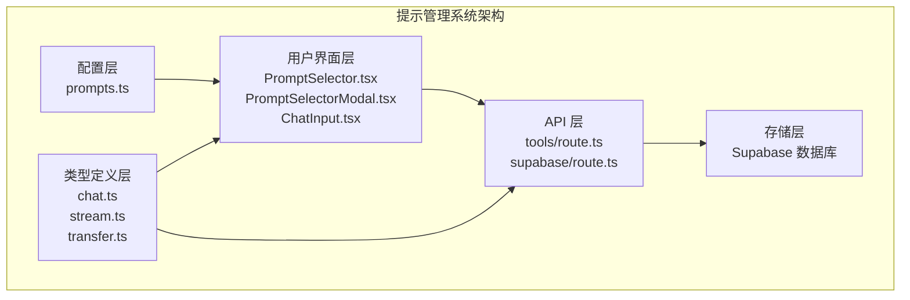
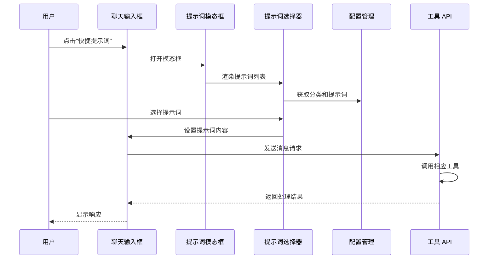
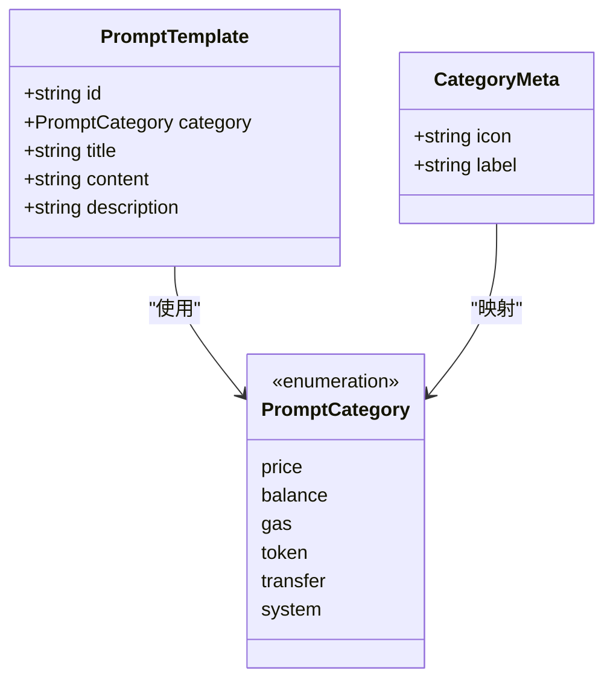
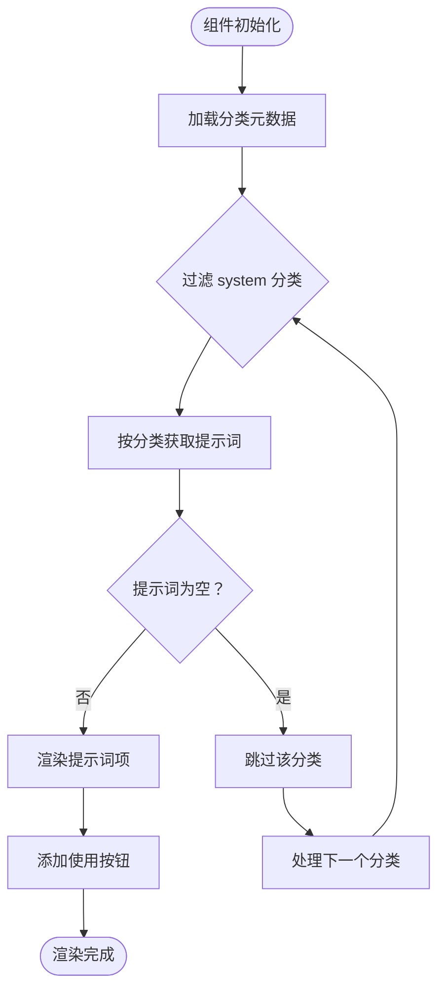
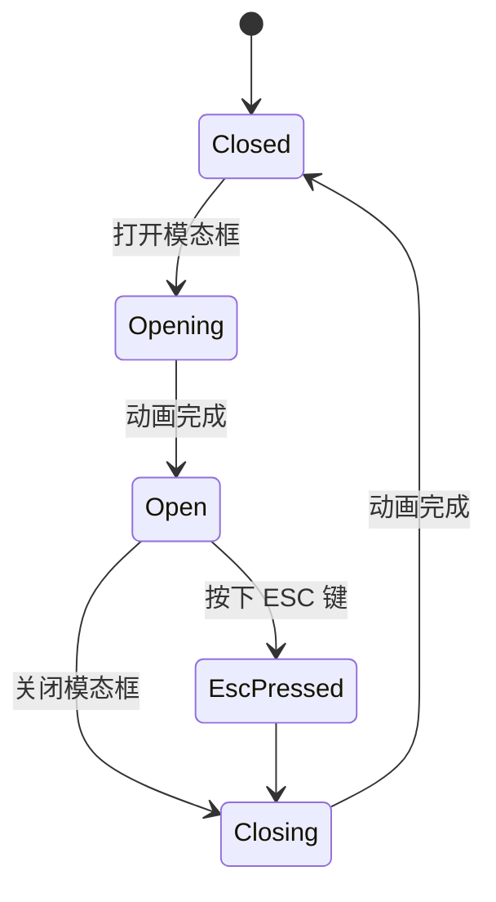
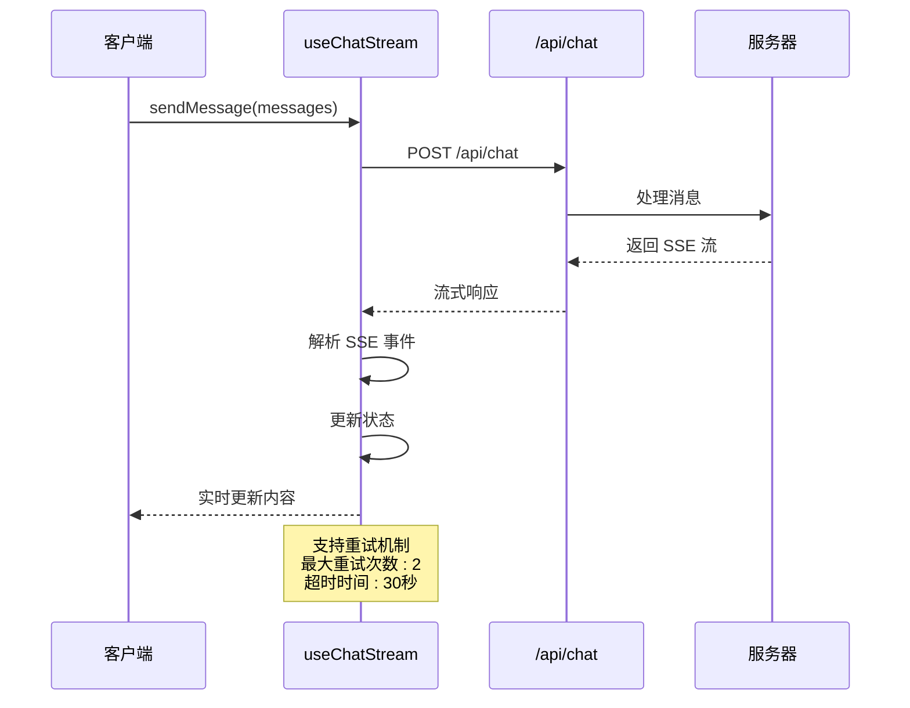
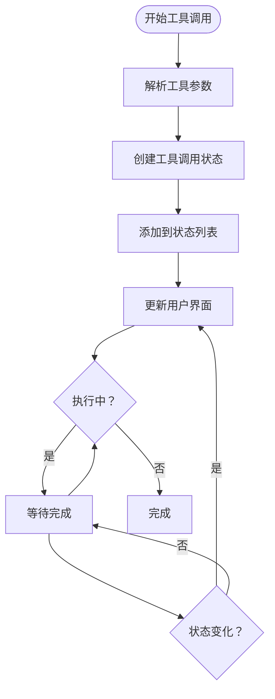
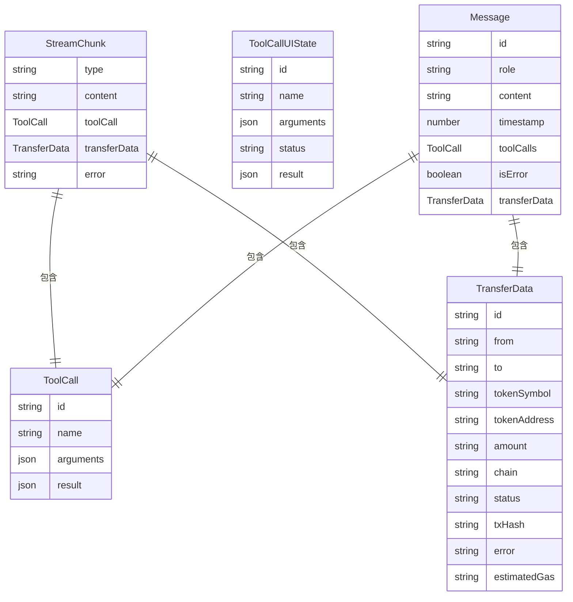
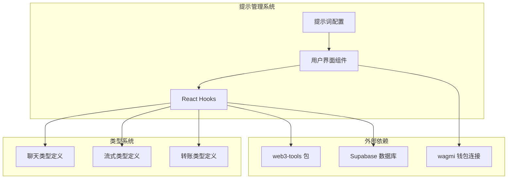
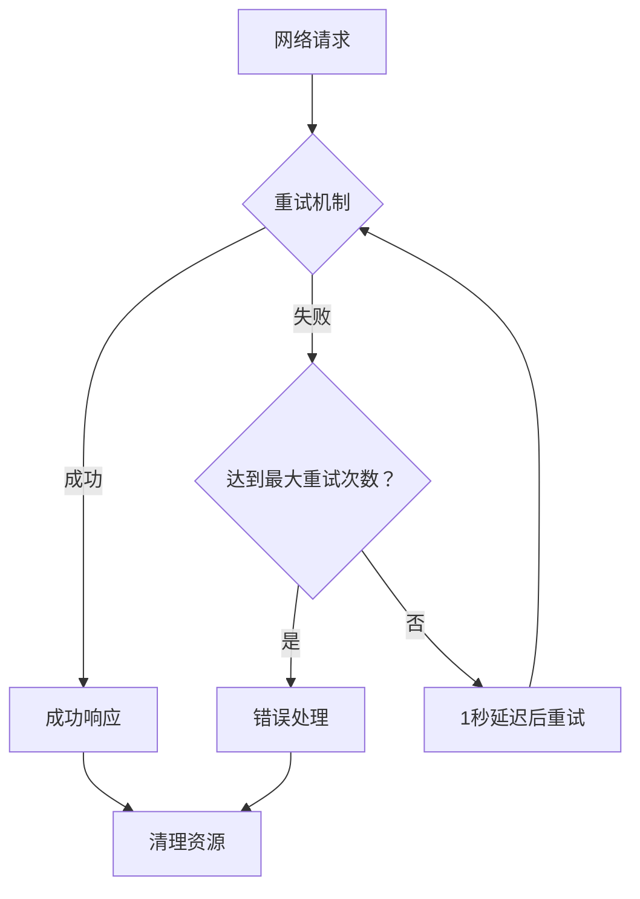

# 提示管理系统

<cite>
**本文档引用的文件**
- [apps/web/config/prompts.ts](file://apps/web/config/prompts.ts)
- [apps/web/components/PromptSelector.tsx](file://apps/web/components/PromptSelector.tsx)
- [apps/web/components/PromptSelectorModal.tsx](file://apps/web/components/PromptSelectorModal.tsx)
- [apps/web/components/ChatInput.tsx](file://apps/web/components/ChatInput.tsx)
- [apps/web/hooks/useChatStream.ts](file://apps/web/hooks/useChatStream.ts)
- [apps/web/types/chat.ts](file://apps/web/types/chat.ts)
- [apps/web/types/stream.ts](file://apps/web/types/stream.ts)
- [apps/web/types/transfer.ts](file://apps/web/types/transfer.ts)
- [apps/web/app/api/tools/route.ts](file://apps/web/app/api/tools/route.ts)
- [apps/web/app/api/supabase/verify-ownership/route.ts](file://apps/web/app/api/supabase/verify-ownership/route.ts)
- [apps/web/app/api/supabase/delete-conversation/route.ts](file://apps/web/app/api/supabase/delete-conversation/route.ts)
- [apps/web/components/MessageList.tsx](file://apps/web/components/MessageList.tsx)
- [apps/web/components/MessageItem.tsx](file://apps/web/components/MessageItem.tsx)
</cite>

## 目录
1. [简介](#简介)
2. [项目结构](#项目结构)
3. [核心组件](#核心组件)
4. [架构概览](#架构概览)
5. [详细组件分析](#详细组件分析)
6. [依赖关系分析](#依赖关系分析)
7. [性能考虑](#性能考虑)
8. [故障排除指南](#故障排除指南)
9. [结论](#结论)

## 简介

提示管理系统是 Web3 AI Agent 项目中的核心功能模块，负责管理和提供预定义的提示词模板。该系统通过统一的配置文件管理各种场景的提示词，包括价格查询、余额查询、Gas 查询、Token 查询和转账操作等，为用户提供便捷的快速提示词选择功能。

系统采用模块化设计，将提示词模板集中管理，支持按分类组织和动态筛选，同时提供了完整的前端交互界面和后端工具调用支持。

## 项目结构

提示管理系统主要分布在以下目录结构中：

**图表来源**
- [apps/web/config/prompts.ts:1-266](file://apps/web/config/prompts.ts#L1-L266)
- [apps/web/components/PromptSelector.tsx:1-77](file://apps/web/components/PromptSelector.tsx#L1-L77)
- [apps/web/app/api/tools/route.ts:1-65](file://apps/web/app/api/tools/route.ts#L1-L65)

**章节来源**
- [apps/web/config/prompts.ts:1-266](file://apps/web/config/prompts.ts#L1-L266)
- [apps/web/components/PromptSelector.tsx:1-77](file://apps/web/components/PromptSelector.tsx#L1-L77)
- [apps/web/components/PromptSelectorModal.tsx:1-109](file://apps/web/components/PromptSelectorModal.tsx#L1-L109)

## 核心组件

### 提示词配置管理

系统的核心是集中化的提示词配置文件，采用 TypeScript 类型安全的设计：

- **提示词模板接口**: 定义了标准的提示词结构，包含唯一标识符、分类、标题、内容和描述
- **分类系统**: 支持价格查询、余额查询、Gas 查询、Token 查询、转账操作和系统提示词六种分类
- **辅助函数**: 提供按分类获取、按ID查找和获取所有分类元数据的功能

### 用户界面组件

系统提供了完整的用户界面交互：

- **提示词选择器**: 展示按分类组织的提示词列表，支持快速选择
- **模态框组件**: 提供响应式的弹窗界面，支持桌面端居中显示和移动端底部抽屉
- **聊天输入框**: 集成提示词选择功能，支持快捷提示词使用

**章节来源**
- [apps/web/config/prompts.ts:15-266](file://apps/web/config/prompts.ts#L15-L266)
- [apps/web/components/PromptSelector.tsx:9-77](file://apps/web/components/PromptSelector.tsx#L9-L77)
- [apps/web/components/PromptSelectorModal.tsx:13-109](file://apps/web/components/PromptSelectorModal.tsx#L13-L109)

## 架构概览

提示管理系统采用分层架构设计，各层职责清晰分离：

**图表来源**
- [apps/web/components/ChatInput.tsx:12-119](file://apps/web/components/ChatInput.tsx#L12-L119)
- [apps/web/components/PromptSelectorModal.tsx:13-109](file://apps/web/components/PromptSelectorModal.tsx#L13-L109)
- [apps/web/app/api/tools/route.ts:10-65](file://apps/web/app/api/tools/route.ts#L10-L65)

系统架构特点：

1. **配置驱动**: 所有提示词通过单一配置文件管理，便于维护和扩展
2. **类型安全**: 使用 TypeScript 确保开发时的类型检查和运行时的安全性
3. **模块化设计**: 各组件职责明确，易于测试和维护
4. **响应式界面**: 支持桌面端和移动端的不同交互模式

## 详细组件分析

### 提示词配置系统

#### 数据结构设计

**图表来源**
- [apps/web/config/prompts.ts:7-237](file://apps/web/config/prompts.ts#L7-L237)

系统采用枚举类型的分类方式，确保分类的完整性和一致性。每个提示词模板包含：

- **唯一标识符**: 用于精确匹配和引用
- **分类属性**: 支持按功能领域组织
- **用户可见信息**: 标题和描述提升用户体验
- **实际内容**: 机器可执行的提示词模板

#### 辅助函数实现

系统提供了三个核心辅助函数：

1. **按分类获取**: `getPromptsByCategory()` 支持快速筛选特定功能领域的提示词
2. **按ID查找**: `getPromptById()` 提供精确的提示词检索
3. **分类元数据**: `getAllCategories()` 返回分类的图标和标签信息

**章节来源**
- [apps/web/config/prompts.ts:242-266](file://apps/web/config/prompts.ts#L242-L266)

### 用户界面组件

#### 提示词选择器组件

**图表来源**
- [apps/web/components/PromptSelector.tsx:9-77](file://apps/web/components/PromptSelector.tsx#L9-L77)

组件特性：

- **响应式布局**: 支持不同屏幕尺寸的适配
- **交互反馈**: 提供悬停效果和过渡动画
- **无障碍设计**: 包含适当的标题和描述信息

#### 模态框组件

**图表来源**
- [apps/web/components/PromptSelectorModal.tsx:18-33](file://apps/web/components/PromptSelectorModal.tsx#L18-L33)

模态框实现了完整的生命周期管理：

- **键盘事件处理**: 支持 ESC 键快速关闭
- **动画过渡**: 提供流畅的打开和关闭动画
- **响应式设计**: 桌面端居中显示，移动端底部抽屉

**章节来源**
- [apps/web/components/PromptSelector.tsx:1-77](file://apps/web/components/PromptSelector.tsx#L1-L77)
- [apps/web/components/PromptSelectorModal.tsx:1-109](file://apps/web/components/PromptSelectorModal.tsx#L1-L109)

### 流式消息处理

#### SSE 流式消费机制

**图表来源**
- [apps/web/hooks/useChatStream.ts:184-274](file://apps/web/hooks/useChatStream.ts#L184-L274)

Hook 实现了高级的流式处理功能：

- **节流更新**: 防止频繁的状态更新影响性能
- **错误处理**: 完善的异常捕获和重试机制
- **内存管理**: 使用 ref 和 state 的组合优化性能

#### 工具调用状态管理

**图表来源**
- [apps/web/hooks/useChatStream.ts:129-181](file://apps/web/hooks/useChatStream.ts#L129-L181)

**章节来源**
- [apps/web/hooks/useChatStream.ts:1-318](file://apps/web/hooks/useChatStream.ts#L1-L318)

### 类型定义系统

#### 流式输出类型

系统定义了完整的流式通信协议：

**图表来源**
- [apps/web/types/stream.ts:6-37](file://apps/web/types/stream.ts#L6-L37)
- [apps/web/types/chat.ts:3-32](file://apps/web/types/chat.ts#L3-L32)
- [apps/web/types/transfer.ts:7-20](file://apps/web/types/transfer.ts#L7-L20)

**章节来源**
- [apps/web/types/stream.ts:1-37](file://apps/web/types/stream.ts#L1-L37)
- [apps/web/types/chat.ts:1-32](file://apps/web/types/chat.ts#L1-L32)
- [apps/web/types/transfer.ts:1-20](file://apps/web/types/transfer.ts#L1-L20)

## 依赖关系分析

提示管理系统与其他系统组件的依赖关系：

**图表来源**
- [apps/web/app/api/tools/route.ts:2-3](file://apps/web/app/api/tools/route.ts#L2-L3)
- [apps/web/hooks/useChatStream.ts:4-7](file://apps/web/hooks/useChatStream.ts#L4-L7)

### 外部依赖管理

系统对外部依赖的处理策略：

1. **工具调用**: 通过 `/api/tools` 端点调用 web3-tools 包提供的功能
2. **数据持久化**: 使用 Supabase 进行对话历史和用户数据存储
3. **钱包集成**: 通过 wagmi 实现钱包连接和身份验证

**章节来源**
- [apps/web/app/api/tools/route.ts:1-65](file://apps/web/app/api/tools/route.ts#L1-L65)
- [apps/web/app/api/supabase/verify-ownership/route.ts:1-95](file://apps/web/app/api/supabase/verify-ownership/route.ts#L1-L95)

## 性能考虑

### 内存优化策略

系统采用了多项性能优化措施：

1. **状态管理优化**: 使用 `useRef` 和 `useState` 的组合避免不必要的重渲染
2. **节流机制**: 内容更新采用 50ms 节流，防止频繁的 DOM 操作
3. **缓存策略**: 提示词数据在内存中缓存，避免重复计算
4. **资源清理**: 组件卸载时自动清理定时器和事件监听器

### 网络请求优化

**图表来源**
- [apps/web/hooks/useChatStream.ts:195-274](file://apps/web/hooks/useChatStream.ts#L195-L274)

**章节来源**
- [apps/web/hooks/useChatStream.ts:18-318](file://apps/web/hooks/useChatStream.ts#L18-L318)

## 故障排除指南

### 常见问题诊断

#### 提示词加载问题

**症状**: 提示词选择器无法显示任何内容

**可能原因**:
1. 配置文件导入路径错误
2. 分类元数据映射问题
3. 权限不足导致数据访问失败

**解决方案**:
1. 检查 `prompts.ts` 文件的导出语句
2. 验证分类枚举值的一致性
3. 确认组件的权限配置

#### 流式响应问题

**症状**: 消息无法实时显示或显示延迟

**可能原因**:
1. SSE 连接中断
2. 服务器端流式处理异常
3. 客户端解析错误

**解决方案**:
1. 检查网络连接和防火墙设置
2. 验证服务器端的流式响应格式
3. 查看浏览器控制台的错误信息

#### 工具调用失败

**症状**: 提示词执行后没有返回预期结果

**可能原因**:
1. 工具 API 端点不可用
2. 参数格式不正确
3. 外部服务调用失败

**解决方案**:
1. 验证 `/api/tools` 端点的可用性
2. 检查工具参数的 JSON 格式
3. 查看外部服务的响应状态

**章节来源**
- [apps/web/hooks/useChatStream.ts:243-274](file://apps/web/hooks/useChatStream.ts#L243-L274)
- [apps/web/app/api/tools/route.ts:54-64](file://apps/web/app/api/tools/route.ts#L54-L64)

## 结论

提示管理系统通过模块化的设计和类型安全的实现，为 Web3 AI Agent 提供了强大而灵活的提示词管理功能。系统的主要优势包括：

1. **统一管理**: 集中的配置文件简化了提示词的维护和扩展
2. **类型安全**: TypeScript 提供了完整的编译时类型检查
3. **用户体验**: 响应式的界面设计支持多种设备和交互方式
4. **性能优化**: 多层次的优化策略确保了良好的用户体验
5. **可扩展性**: 清晰的架构设计便于未来功能的添加和修改

该系统为 Web3 应用场景下的智能代理提供了坚实的基础，通过预定义的提示词模板帮助用户更高效地进行区块链相关的查询和操作。随着项目的不断发展，提示管理系统将继续演进以满足更多样化的业务需求。